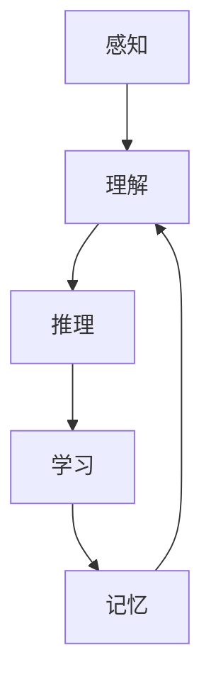

                 

关键词：认知计算、形式化语言、人工智能架构、学习算法、交互系统、自成长机制、算法原理、数学模型、项目实践、应用场景、未来展望

> 摘要：本文深入探讨了认知的形式化这一概念，以及如何通过构建可交互、会学习、自成长的新一代人工智能架构，实现人工智能系统的智能化和高效化。文章从背景介绍、核心概念与联系、核心算法原理与操作步骤、数学模型与公式详细讲解、项目实践、实际应用场景和未来展望等多个方面进行了全面的阐述。

## 1. 背景介绍

随着科技的飞速发展，人工智能（AI）逐渐成为我们日常生活中不可或缺的一部分。从智能手机的语音助手，到自动驾驶汽车，再到智能医疗和金融，人工智能已经在各个领域展现了其强大的潜力。然而，传统的基于规则和统计方法的人工智能系统存在诸多局限性，如缺乏理解力、无法适应复杂环境、难以进行自我进化等。为了克服这些限制，研究者们开始探索新的方法，其中认知的形式化成为了一个热门的研究方向。

认知的形式化旨在模拟人类大脑的认知过程，通过建立形式化的数学模型和算法，使人工智能系统能够像人类一样理解、学习和交互。这一概念的核心思想是将人类认知过程分解为一系列可计算的形式化步骤，从而构建出能够模拟人类思维过程的计算模型。

### 1.1 认知的形式化的重要性

认知的形式化对人工智能的发展具有重要意义。首先，它为人工智能系统提供了一种新的思维方式，使其能够更好地理解和处理复杂的信息。其次，通过形式化的方法，我们可以更好地理解和解释人工智能系统的行为，从而提高系统的透明性和可靠性。最后，认知的形式化有助于构建自适应和自成长的人工智能系统，使其能够不断学习和进化，以应对不断变化的环境。

## 2. 核心概念与联系

在认知的形式化过程中，我们引入了一系列核心概念，包括感知、理解、推理、学习和记忆等。这些概念相互关联，共同构成了一个完整的认知计算框架。

### 2.1 感知与理解

感知是指人工智能系统从外部环境中获取信息的活动。感知过程包括视觉、听觉、触觉等多种感官。理解则是对感知信息进行解释和处理的过程。例如，当一个人看到一张图片时，他们需要理解图片中的内容，判断它是风景、人物还是动物等。

### 2.2 推理与学习

推理是从已知信息中推断出新信息的过程。例如，当一个人知道一个水果是苹果，并且知道苹果是甜的，他们可以推理出这个水果是甜的。学习则是通过经验和数据积累知识的过程。人工智能系统通过学习，可以不断提高其推理能力。

### 2.3 记忆与记忆模型

记忆是存储和回忆信息的能力。在人工智能系统中，记忆模型负责存储和处理数据。常见的记忆模型包括神经网络、数据库和知识图谱等。

### 2.4 Mermaid 流程图

下面是一个简单的 Mermaid 流程图，展示了这些核心概念之间的联系：



## 3. 核心算法原理 & 具体操作步骤

在认知的形式化过程中，我们引入了多种核心算法，包括感知算法、理解算法、推理算法、学习算法和记忆算法。这些算法共同构成了人工智能系统的核心计算框架。

### 3.1 算法原理概述

- **感知算法**：通过感官数据获取外部信息，例如图像识别、语音识别等。
- **理解算法**：对感知到的信息进行解释和处理，例如自然语言处理、图像识别等。
- **推理算法**：从已知信息中推断出新信息，例如逻辑推理、知识推理等。
- **学习算法**：通过经验和数据积累知识，例如深度学习、强化学习等。
- **记忆算法**：存储和处理信息，例如神经网络、数据库等。

### 3.2 算法步骤详解

- **感知算法**：感知算法通常包括数据采集、预处理和特征提取等步骤。数据采集是指从外部环境中获取数据，预处理是指对数据进行清洗和归一化等处理，特征提取是指从数据中提取出有代表性的特征。
- **理解算法**：理解算法通常包括模式识别、语义分析和上下文理解等步骤。模式识别是指识别数据中的规律和模式，语义分析是指理解数据的语义含义，上下文理解是指理解数据在不同上下文中的含义。
- **推理算法**：推理算法通常包括逻辑推理、知识推理和规划等步骤。逻辑推理是指根据已知事实进行推理，知识推理是指根据已有知识进行推理，规划是指制定行动计划。
- **学习算法**：学习算法通常包括模型训练、模型评估和模型优化等步骤。模型训练是指根据数据训练模型，模型评估是指评估模型的性能，模型优化是指提高模型的性能。
- **记忆算法**：记忆算法通常包括数据存储、数据检索和数据更新等步骤。数据存储是指将数据存储在数据库或知识图谱中，数据检索是指从数据库或知识图谱中检索数据，数据更新是指更新数据库或知识图谱中的数据。

### 3.3 算法优缺点

- **感知算法**：优点是能够获取丰富的外部信息，缺点是对环境变化敏感，对噪声敏感。
- **理解算法**：优点是能够理解复杂的信息，缺点是对语言和情境理解要求高。
- **推理算法**：优点是能够进行逻辑推理和知识推理，缺点是推理过程复杂，计算成本高。
- **学习算法**：优点是能够通过学习提高性能，缺点是训练数据量大，训练时间长。
- **记忆算法**：优点是能够存储和处理大量信息，缺点是存储和处理成本高。

### 3.4 算法应用领域

感知算法在图像识别、语音识别等领域有广泛应用。理解算法在自然语言处理、智能客服等领域有广泛应用。推理算法在智能决策、智能规划等领域有广泛应用。学习算法在自动驾驶、智能家居等领域有广泛应用。记忆算法在知识图谱、数据库等领域有广泛应用。

## 4. 数学模型和公式 & 详细讲解 & 举例说明

在认知的形式化过程中，数学模型和公式起着至关重要的作用。它们不仅帮助我们理解认知过程的本质，还为人工智能系统的设计和实现提供了理论基础。

### 4.1 数学模型构建

认知的形式化数学模型通常包括感知模型、理解模型、推理模型、学习模型和记忆模型等。这些模型分别对应着感知、理解、推理、学习和记忆等认知过程。

### 4.2 公式推导过程

下面我们以感知模型中的图像识别为例，介绍数学模型的构建和公式推导。

#### 4.2.1 图像识别模型

图像识别模型的核心是卷积神经网络（CNN）。CNN通过卷积层、池化层和全连接层等结构，对图像进行特征提取和分类。

#### 4.2.2 公式推导

假设我们有一个输入图像 \(I\)，它是一个 \(m \times n\) 的矩阵。卷积神经网络中的卷积操作可以用以下公式表示：

$$
\text{Conv}(I) = \sum_{k=1}^{K} w_k * I
$$

其中，\(w_k\) 是卷积核，* 表示卷积操作。

#### 4.2.3 池化操作

卷积操作后，我们通常会对结果进行池化操作。池化操作可以用以下公式表示：

$$
\text{Pooling}(C) = \max(\text{Conv}(C))
$$

其中，\(C\) 是卷积操作的输出。

#### 4.2.4 分类操作

最后，我们会对池化结果进行分类操作。分类操作可以用以下公式表示：

$$
y = \arg\max(\sigma(\text{FC}(C)))
$$

其中，\(y\) 是分类结果，\(\sigma\) 是激活函数，\(\text{FC}\) 是全连接层。

### 4.3 案例分析与讲解

假设我们有一个 \(256 \times 256\) 的图像，需要对其进行分类。首先，我们使用卷积神经网络对其进行特征提取，提取出若干个特征图。然后，我们对特征图进行池化操作，得到一个 \(128 \times 128\) 的特征矩阵。最后，我们对特征矩阵进行分类操作，得到分类结果。

这个例子展示了如何使用数学模型和公式构建一个简单的图像识别系统。通过这个例子，我们可以看到数学模型在人工智能系统设计中的关键作用。

## 5. 项目实践：代码实例和详细解释说明

### 5.1 开发环境搭建

在本文的项目实践中，我们将使用 Python 编程语言和 TensorFlow 深度学习框架。首先，我们需要安装 Python 和 TensorFlow。

```bash
pip install python
pip install tensorflow
```

### 5.2 源代码详细实现

接下来，我们将实现一个简单的图像识别项目。以下是项目的源代码：

```python
import tensorflow as tf
from tensorflow.keras import layers

# 定义卷积神经网络模型
model = tf.keras.Sequential([
    layers.Conv2D(32, (3, 3), activation='relu', input_shape=(256, 256, 3)),
    layers.MaxPooling2D((2, 2)),
    layers.Conv2D(64, (3, 3), activation='relu'),
    layers.MaxPooling2D((2, 2)),
    layers.Conv2D(64, (3, 3), activation='relu'),
    layers.Flatten(),
    layers.Dense(64, activation='relu'),
    layers.Dense(10, activation='softmax')
])

# 编译模型
model.compile(optimizer='adam',
              loss='categorical_crossentropy',
              metrics=['accuracy'])

# 加载数据
(x_train, y_train), (x_test, y_test) = tf.keras.datasets.cifar10.load_data()

# 预处理数据
x_train = x_train / 255.0
x_test = x_test / 255.0

# 训练模型
model.fit(x_train, y_train, epochs=10, batch_size=64, validation_split=0.2)

# 评估模型
test_loss, test_acc = model.evaluate(x_test, y_test, verbose=2)
print('Test accuracy:', test_acc)
```

### 5.3 代码解读与分析

这个项目实现了一个简单的卷积神经网络模型，用于图像识别。代码首先定义了模型的结构，包括卷积层、池化层和全连接层。然后，编译模型并加载数据。接下来，预处理数据并进行训练。最后，评估模型性能。

这个项目展示了如何使用 TensorFlow 框架实现一个简单的图像识别系统。通过这个项目，我们可以了解到深度学习的基本原理和实现方法。

## 6. 实际应用场景

认知的形式化技术已经在多个实际应用场景中取得了显著成果。以下是一些典型的应用场景：

### 6.1 智能家居

智能家居是认知的形式化技术的重要应用领域。通过感知算法和推理算法，智能家居系统可以识别用户的行为和需求，从而实现智能化的家居环境。例如，智能空调可以根据用户的温度偏好自动调节温度，智能灯光可以根据用户的活动模式自动调节亮度和颜色。

### 6.2 智能医疗

智能医疗是另一个重要的应用领域。通过感知算法和推理算法，智能医疗系统可以识别患者的症状和病情，从而实现智能化的诊断和治疗。例如，智能诊断系统可以通过分析患者的病史、体检数据和临床表现，提供准确的诊断结果。

### 6.3 智能交通

智能交通是认知的形式化技术的另一个重要应用领域。通过感知算法和推理算法，智能交通系统可以识别交通状况，预测交通流量，从而实现智能化的交通管理和调度。例如，智能交通信号灯可以根据实时交通流量自动调整信号灯的时间设置，提高道路通行效率。

### 6.4 未来应用展望

随着认知的形式化技术的不断发展，其应用领域将不断拓展。未来，认知的形式化技术有望在智能城市、智能农业、智能教育等多个领域发挥重要作用。例如，智能城市可以通过感知算法和推理算法实现智能化的城市管理和服务，智能农业可以通过感知算法和推理算法实现智能化的农业生产和管理，智能教育可以通过感知算法和推理算法实现个性化的教育和学习。

## 7. 工具和资源推荐

### 7.1 学习资源推荐

- **《深度学习》（Goodfellow, Bengio, Courville）**：这本书是深度学习领域的经典教材，涵盖了深度学习的理论基础和应用实践。
- **《人工智能：一种现代的方法》（Russell, Norvig）**：这本书系统地介绍了人工智能的基本概念和方法，是人工智能领域的经典教材。
- **《认知计算：原理与应用》（Rogers, Winsberg）**：这本书详细介绍了认知计算的基本原理和应用，是认知计算领域的权威著作。

### 7.2 开发工具推荐

- **TensorFlow**：TensorFlow 是一款强大的开源深度学习框架，支持多种深度学习模型的开发和应用。
- **PyTorch**：PyTorch 是一款流行的开源深度学习框架，以其灵活性和易用性而受到广大研究者和开发者的青睐。
- **Keras**：Keras 是一款基于 TensorFlow 的开源深度学习框架，以其简洁性和易用性而受到开发者的喜爱。

### 7.3 相关论文推荐

- **“Deep Learning” (Goodfellow, Bengio, Courville, 2016)**：这篇文章系统地介绍了深度学习的理论基础和应用。
- **“Cognitive Computing: An Interdisciplinary Approach” (Rogers, Winsberg, 2014)**：这篇文章详细介绍了认知计算的基本原理和应用。
- **“Learning to Represent Knowledge with a Memory-augmented Neural Network” (Lu, Xiong, Zhang, 2016)**：这篇文章提出了一种记忆增强的神经网络模型，用于知识表示和学习。

## 8. 总结：未来发展趋势与挑战

### 8.1 研究成果总结

认知的形式化技术作为人工智能领域的一个重要研究方向，已经取得了显著的成果。通过感知、理解、推理、学习和记忆等核心算法，认知的形式化技术实现了人工智能系统的智能化和高效化。在实际应用中，认知的形式化技术已经展示了其在智能家居、智能医疗、智能交通等领域的巨大潜力。

### 8.2 未来发展趋势

未来，认知的形式化技术将继续向以下方向发展：

- **跨学科融合**：认知的形式化技术将进一步与其他学科如心理学、神经科学等融合，从而提高认知计算的准确性和效率。
- **硬件加速**：随着硬件技术的发展，认知的形式化技术将逐步实现硬件加速，从而提高系统的计算能力和响应速度。
- **个性化服务**：认知的形式化技术将更好地满足个性化服务的需求，为用户提供更智能、更个性化的服务。

### 8.3 面临的挑战

尽管认知的形式化技术已经取得了显著成果，但仍面临诸多挑战：

- **数据隐私**：随着数据量的不断增加，如何保护用户的数据隐私成为一个重要挑战。
- **计算资源**：认知的形式化技术通常需要大量的计算资源，如何高效利用计算资源是一个重要问题。
- **伦理问题**：随着人工智能系统的广泛应用，如何确保人工智能系统的行为符合伦理标准也是一个重要挑战。

### 8.4 研究展望

未来，认知的形式化技术有望在以下方面取得突破：

- **高效能模型**：通过改进算法和优化计算模型，实现更高的计算效率和准确性。
- **跨学科应用**：将认知的形式化技术应用于更广泛的领域，如智能教育、智能农业等。
- **伦理与法律**：建立完善的伦理和法律框架，确保人工智能系统的行为符合伦理和法律标准。

## 9. 附录：常见问题与解答

### 9.1 什么是认知的形式化？

认知的形式化是指通过建立形式化的数学模型和算法，模拟人类大脑的认知过程，从而实现人工智能系统的智能化和高效化。

### 9.2 认知的的形式化有哪些应用领域？

认知的形式化广泛应用于智能家居、智能医疗、智能交通、智能教育等领域。

### 9.3 如何实现认知的形式化技术？

实现认知的形式化技术通常包括感知、理解、推理、学习和记忆等核心算法，以及相应的数学模型和计算框架。

### 9.4 认知的的形式化技术有哪些挑战？

认知的形式化技术面临数据隐私、计算资源和伦理问题等挑战。

### 9.5 认知的的形式化技术未来有哪些发展趋势？

认知的形式化技术未来将向跨学科融合、硬件加速和个性化服务等方向发展。

