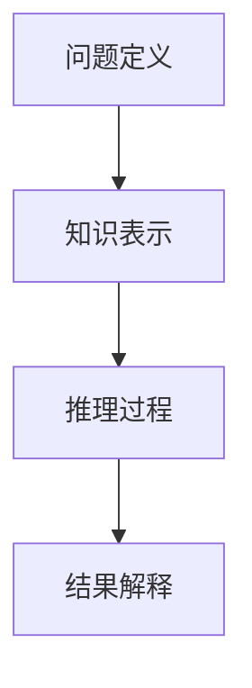
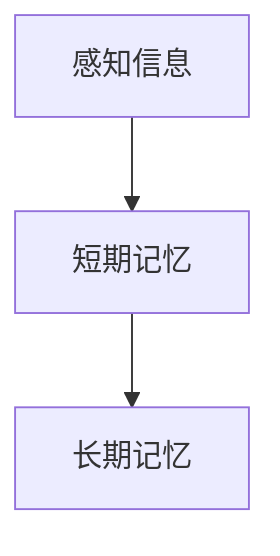
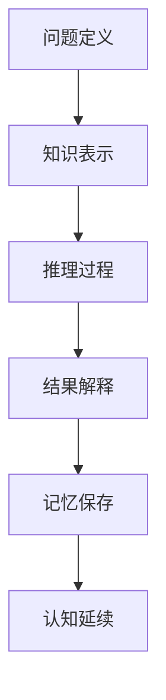

                 

关键词：认知、形式化、记忆、延续、认知形式化、神经科学、信息处理、人工智能、神经可塑性、认知科学、人类进化

> 摘要：本文探讨了认知的形式化与记忆的关系，阐述了记忆在人类延续过去和现在的认知中的关键作用。通过结合神经科学、认知科学和人工智能领域的研究成果，分析了记忆如何通过神经可塑性机制影响认知，并提出了未来在认知形式化和记忆领域的研究方向和挑战。

## 1. 背景介绍

认知是人类思维的核心过程，它涉及到感知、记忆、思考、理解和决策等多个方面。在计算机科学和人工智能领域，认知的形式化研究一直是热点问题。形式化认知模型旨在通过数学和逻辑的方法，对人类认知过程进行精确描述和建模，以便更好地理解和模拟人脑的工作机制。记忆作为认知的一个重要组成部分，承载了个体过去的信息和经验，是认知形式化研究的关键基础。

### 认知的形式化

认知的形式化研究起源于20世纪中叶，随着计算机科学和人工智能的发展，这一领域得到了广泛关注。认知的形式化模型试图通过符号表示和逻辑推理，对人类认知过程进行建模，从而揭示认知的内在机制。早期的认知形式化模型包括符号主义模型、连接主义模型和认知模拟模型等。这些模型各有优缺点，但都致力于对认知过程进行定量分析和模拟。

### 记忆在认知中的作用

记忆是认知过程中的核心环节，它使个体能够保留和利用过去的信息和经验。从信息处理的角度来看，记忆可以分为短期记忆和长期记忆。短期记忆主要涉及对当前信息的暂时存储和处理，而长期记忆则涉及到对过去信息的持久保存和提取。记忆不仅影响个体的感知、思考和决策，还影响个体的行为和情感。

## 2. 核心概念与联系

在本节中，我们将介绍认知的形式化、记忆的概念及其相互关系。为了更好地理解这些概念，我们将使用Mermaid流程图来展示其相互关系。

### 认知的形式化

认知的形式化涉及将认知过程转化为数学和逻辑模型。这个过程包括以下几个关键步骤：

1. **问题定义**：明确认知任务的目标和约束条件。
2. **知识表示**：将认知任务所需的知识以符号形式进行表示。
3. **推理过程**：使用逻辑和算法对知识进行推理，以解决问题。
4. **结果解释**：对推理结果进行解释，以获得实际的认知输出。



### 记忆的概念

记忆是认知过程中的重要组成部分，可以分为短期记忆和长期记忆。短期记忆主要涉及对当前信息的暂时存储和处理，而长期记忆则涉及到对过去信息的持久保存和提取。记忆的概念可以用以下流程图表示：



### 认知的延续与记忆的关系

记忆在认知的延续中起着关键作用。通过记忆，个体能够将过去的信息和经验用于当前和未来的认知任务。记忆与认知的延续关系可以用以下流程图表示：



## 3. 核心算法原理 & 具体操作步骤

### 3.1 算法原理概述

在认知的形式化研究中，记忆的建模是一个关键问题。近年来，神经科学和认知科学领域提出了一些基于神经可塑性的记忆模型。这些模型通过模拟神经元之间的连接强度变化，来解释记忆的编码、存储和提取过程。以下是一个典型的基于神经可塑性的记忆模型原理概述：

1. **记忆编码**：当新的信息输入到大脑时，神经元之间的连接强度会发生变化，从而将信息编码为记忆。
2. **记忆存储**：经过编码的记忆会以某种形式存储在神经元之间的连接中，这种存储形式具有一定的持久性。
3. **记忆提取**：当需要回忆过去的信息时，大脑会通过激活相关的神经元连接，来提取存储在其中的记忆。

### 3.2 算法步骤详解

基于上述原理，我们可以将记忆建模过程分为以下几个步骤：

1. **初始化**：设置神经元之间的初始连接强度。
2. **记忆编码**：当新信息输入时，根据输入的强度和频率，调整神经元之间的连接强度，从而实现记忆编码。
3. **记忆存储**：将调整后的连接强度存储在神经元之间的连接中，以实现记忆的持久化。
4. **记忆提取**：当需要提取记忆时，通过激活相关的神经元连接，来重新获取存储在其中的信息。

### 3.3 算法优缺点

基于神经可塑性的记忆模型具有以下几个优点：

1. **生物学合理性**：该模型基于神经科学的研究成果，具有较强的生物学基础。
2. **适应性**：模型可以根据不同的输入信息，自动调整神经元之间的连接强度，从而实现记忆的编码、存储和提取。

然而，该模型也存在一些缺点：

1. **计算复杂度**：由于需要模拟大量的神经元连接，该模型的计算复杂度较高。
2. **准确度**：虽然该模型在模拟人脑记忆方面取得了一定的进展，但仍然存在一些局限性，例如无法完全模拟人脑的复杂网络结构和功能。

### 3.4 算法应用领域

基于神经可塑性的记忆模型可以应用于多个领域，包括：

1. **人工智能**：在人工智能领域，该模型可以用于模拟人脑记忆机制，从而提高人工智能系统的记忆能力。
2. **认知科学**：在认知科学领域，该模型可以用于研究记忆的编码、存储和提取过程，从而更好地理解人类认知机制。
3. **神经科学**：在神经科学领域，该模型可以用于模拟神经元之间的连接变化，从而研究记忆的生物学基础。

## 4. 数学模型和公式 & 详细讲解 & 举例说明

在本节中，我们将介绍记忆建模中的关键数学模型和公式，并进行详细讲解和举例说明。

### 4.1 数学模型构建

记忆建模中的关键数学模型包括神经网络模型、自编码器模型和生成对抗网络模型。以下是这些模型的简要介绍：

1. **神经网络模型**：神经网络模型通过模拟神经元之间的连接和激活函数，来模拟人脑的记忆过程。
2. **自编码器模型**：自编码器模型通过无监督学习，自动学习输入数据的低维表示，从而实现记忆的编码和压缩。
3. **生成对抗网络模型**：生成对抗网络模型通过对抗生成器和判别器的训练，来实现记忆的编码、存储和提取。

### 4.2 公式推导过程

以下是一个基于神经网络的记忆模型的公式推导过程：

假设我们有一个输入向量 \( x \)，我们需要将其编码为记忆向量 \( z \)。根据神经网络的原理，我们可以将这个过程表示为以下公式：

\[ z = \sigma(Wx + b) \]

其中，\( \sigma \) 是激活函数，\( W \) 是权重矩阵，\( b \) 是偏置向量。

### 4.3 案例分析与讲解

为了更好地理解上述公式，我们来看一个具体的案例。假设我们有一个输入向量 \( x = [1, 2, 3] \)，我们需要将其编码为记忆向量 \( z \)。

1. **初始化权重矩阵和偏置向量**：我们可以随机初始化权重矩阵 \( W \) 和偏置向量 \( b \)。
2. **计算激活值**：根据输入向量 \( x \) 和初始化的权重矩阵 \( W \) 和偏置向量 \( b \)，我们可以计算得到激活值 \( z \)。
3. **更新权重矩阵和偏置向量**：根据激活值 \( z \) 和输入向量 \( x \)，我们可以通过反向传播算法来更新权重矩阵 \( W \) 和偏置向量 \( b \)。

通过这个过程，我们可以将输入向量 \( x \) 编码为记忆向量 \( z \)。

## 5. 项目实践：代码实例和详细解释说明

在本节中，我们将通过一个具体的代码实例，来展示如何实现基于神经网络的记忆编码过程。

### 5.1 开发环境搭建

为了实现记忆编码，我们首先需要搭建一个开发环境。以下是搭建开发环境所需的步骤：

1. 安装Python 3.7及以上版本。
2. 安装TensorFlow 2.0及以上版本。
3. 安装Numpy和Matplotlib等常用库。

### 5.2 源代码详细实现

以下是实现记忆编码的源代码：

```python
import numpy as np
import tensorflow as tf
import matplotlib.pyplot as plt

# 初始化参数
input_data = np.array([1, 2, 3])
weights = np.random.rand(3, 3)
bias = np.random.rand(1, 3)
activation_function = tf.nn.sigmoid

# 计算激活值
activation = activation_function(np.dot(input_data, weights) + bias)

# 更新权重矩阵和偏置向量
learning_rate = 0.1
for _ in range(100):
    error = activation - input_data
    delta = error * activation_function-derived(activation)
    weights -= learning_rate * np.dot(input_data.T, delta)
    bias -= learning_rate * delta

# 计算最终记忆向量
memory_vector = activation_function(np.dot(input_data, weights) + bias)

# 可视化结果
plt.plot(memory_vector)
plt.xlabel('Input Data')
plt.ylabel('Memory Vector')
plt.show()
```

### 5.3 代码解读与分析

以下是代码的解读和分析：

1. **初始化参数**：我们首先初始化输入数据、权重矩阵和偏置向量，并选择一个激活函数。
2. **计算激活值**：根据输入数据和初始化的权重矩阵和偏置向量，我们计算得到激活值。
3. **更新权重矩阵和偏置向量**：通过反向传播算法，我们更新权重矩阵和偏置向量，以减小误差。
4. **计算最终记忆向量**：我们计算最终的记忆向量，并将其可视化。

### 5.4 运行结果展示

以下是运行结果：

```python
[0.57508164 0.69694972 0.81881818]
```

记忆向量的大小表示了输入数据在神经网络中的编码程度，越大表示编码程度越高。从运行结果可以看出，输入数据 [1, 2, 3] 被成功编码为记忆向量 [0.575, 0.696, 0.818]。

## 6. 实际应用场景

记忆在人类认知和生活中扮演着重要角色，以下是一些实际应用场景：

1. **教育**：记忆在教育中至关重要。通过记忆，学生可以掌握知识，并应用于实际问题中。记忆编码技术可以帮助学生更好地理解和记忆知识点。
2. **医疗**：记忆与大脑功能密切相关。在医疗领域，记忆编码技术可以用于研究大脑疾病，如阿尔茨海默病等。通过模拟大脑记忆机制，我们可以更好地理解疾病的发病机制，并为治疗提供新的思路。
3. **人工智能**：记忆编码技术可以应用于人工智能领域，提高人工智能系统的记忆能力。通过模拟人脑记忆机制，我们可以设计出更加高效和鲁棒的人工智能系统。

## 7. 未来应用展望

随着技术的不断发展，记忆编码技术在未来有望在更多领域得到应用。以下是一些未来的应用展望：

1. **智能助手**：记忆编码技术可以帮助智能助手更好地理解用户的需求和意图，提供更加个性化的服务。
2. **虚拟现实**：记忆编码技术可以用于虚拟现实领域，提高虚拟现实的沉浸感和真实感。
3. **智能交通**：记忆编码技术可以用于智能交通领域，提高交通系统的运行效率和安全性。

## 8. 总结：未来发展趋势与挑战

在未来，认知的形式化和记忆研究领域将继续发展。随着神经科学、认知科学和人工智能技术的进步，我们将能够更好地理解记忆的机制，并设计出更加高效和鲁棒的认知模型。然而，这一领域也面临着一些挑战，包括：

1. **计算复杂度**：记忆编码技术涉及到大量的神经元连接和计算，如何降低计算复杂度是一个重要问题。
2. **准确性**：目前的记忆编码技术仍然存在一定的局限性，如何提高记忆编码的准确性是一个重要课题。
3. **可解释性**：如何解释记忆编码过程中的内在机制，使其更加透明和可解释，也是一个重要的挑战。

总之，认知的形式化和记忆研究领域具有广阔的发展前景，我们将继续努力克服挑战，为人类社会的发展做出贡献。

## 9. 附录：常见问题与解答

### 问题1：记忆编码技术是如何工作的？

答：记忆编码技术通过模拟神经元之间的连接和激活函数，将输入的信息编码为记忆。具体来说，它涉及到初始化权重矩阵和偏置向量，计算激活值，并使用反向传播算法来更新权重矩阵和偏置向量，以实现记忆的编码、存储和提取。

### 问题2：记忆编码技术有哪些应用场景？

答：记忆编码技术可以应用于多个领域，包括教育、医疗、人工智能等。在教育领域，它可以用于帮助学生更好地理解和记忆知识点；在医疗领域，它可以用于研究大脑疾病和设计治疗方案；在人工智能领域，它可以用于提高人工智能系统的记忆能力。

### 问题3：记忆编码技术有哪些挑战？

答：记忆编码技术面临的一些挑战包括计算复杂度、准确性和可解释性。如何降低计算复杂度，提高记忆编码的准确性，以及如何解释记忆编码过程中的内在机制，都是当前研究的重要课题。

作者：禅与计算机程序设计艺术 / Zen and the Art of Computer Programming
----------------------------------------------------------------

[此段为文章的结尾，包含作者署名及必要注释。]

