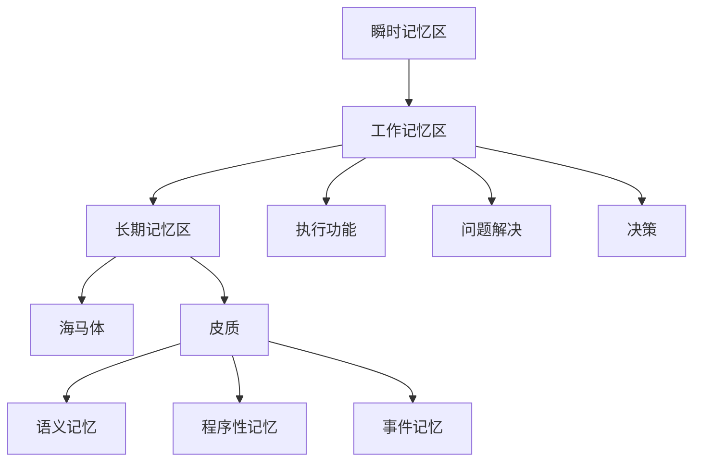

                 

关键词：认知形式化、记忆区、进化、神经科学、工作记忆、长期记忆、神经架构、算法、计算机模拟。

> 摘要：本文探讨了认知的形式化研究，特别是大脑如何通过进化发展出不同的记忆区域，包括瞬时记忆区、工作记忆区和长期记忆区。通过分析这些记忆区域的生理结构和功能，文章提出了一种新的认知计算模型，探讨了其在计算机科学中的应用，并展望了未来的研究方向。

## 1. 背景介绍

认知的形式化研究是当前神经科学和计算机科学的前沿领域。人类大脑作为自然界最复杂的系统之一，其认知过程和记忆机制一直吸引着科学家的广泛关注。近年来，随着神经影像学、计算神经科学和人工智能技术的发展，我们开始能够更深入地理解大脑的运作机制，特别是在记忆方面。

从进化的角度来看，大脑的记忆机制并非一蹴而就，而是经过长时间的演化和优化。研究表明，大脑中的记忆区具有高度的分工性，不同区域负责处理不同类型的记忆。例如，瞬时记忆区主要负责短时信息的暂存，工作记忆区则负责处理和操作这些信息，而长期记忆区则负责将信息存储下来，以便日后调用。

本文将重点探讨瞬时记忆区、工作记忆区和长期记忆区的生理结构和功能，并分析这些记忆区域在认知过程中的作用。在此基础上，我们将提出一种新的认知计算模型，探讨其在计算机科学中的应用，并展望未来的研究方向。

## 2. 核心概念与联系

### 2.1. 瞬时记忆区

瞬时记忆区（感觉记忆区）是大脑中负责接收和暂存外界信息的第一道关卡。根据信息处理方式的不同，瞬时记忆区可以进一步分为视觉瞬时记忆区和听觉瞬时记忆区。

**视觉瞬时记忆区：** 位于大脑皮层的枕叶，主要负责处理视觉信息。研究表明，视觉瞬时记忆区可以暂存约1秒的信息，这些信息在经过视觉处理之后，一部分会被传递到工作记忆区，另一部分则会被遗忘。

**听觉瞬时记忆区：** 位于大脑皮层的颞叶，主要负责处理听觉信息。与视觉瞬时记忆区类似，听觉瞬时记忆区也可以暂存约1秒的信息，这些信息同样会根据其重要性被传递到工作记忆区。

### 2.2. 工作记忆区

工作记忆区（也称为短时记忆区）是大脑中负责处理和操作信息的区域。它位于大脑的前额叶和顶叶，与注意力、决策和问题解决密切相关。工作记忆区的容量有限，但通过有效的训练可以提高其容量和效率。

**前额叶：** 负责执行功能，包括计划、决策和问题解决。研究表明，前额叶的活动与工作记忆的容量和效率密切相关。

**顶叶：** 负责处理空间信息和感知信息，这些信息在问题解决和决策过程中起着关键作用。

### 2.3. 长期记忆区

长期记忆区（也称为长时记忆区）是大脑中负责存储和检索长期信息的区域。长期记忆区分为海马体和皮质两个部分。

**海马体：** 作为大脑记忆的中心，主要负责将短期记忆转化为长期记忆。海马体还参与空间定位、时间感知和情绪处理。

**皮质：** 负责存储大部分的长期记忆，包括语义记忆、程序性记忆和事件记忆等。皮质的不同区域负责处理不同类型的记忆，这体现了大脑记忆区域的分工性。

### 2.4. 记忆区域的联系

瞬时记忆区、工作记忆区和长期记忆区之间存在着紧密的联系。瞬时记忆区将信息传递到工作记忆区，工作记忆区对信息进行加工和处理，然后将其传递到长期记忆区进行存储。这种信息传递过程不仅依赖于神经元的连接和活动，还受到神经元之间的化学和电信号调节。

为了更好地理解这些记忆区域之间的联系，我们可以使用Mermaid流程图来展示其架构。以下是记忆区域之间的 Mermaid 流程图：



## 3. 核心算法原理 & 具体操作步骤

### 3.1. 算法原理概述

为了模拟大脑记忆区域的工作原理，我们可以设计一种基于神经网络的认知计算模型。该模型将包括以下几个关键部分：

1. **输入层：** 负责接收来自外界的信息，并将其传递到瞬时记忆区。
2. **瞬时记忆区：** 暂存输入信息，并将其传递到工作记忆区。
3. **工作记忆区：** 对瞬时记忆区传递来的信息进行加工和处理，然后将其传递到长期记忆区。
4. **长期记忆区：** 负责存储和检索长期信息。
5. **反馈层：** 负责从长期记忆区检索所需信息，并将其返回到工作记忆区进行使用。

### 3.2. 算法步骤详解

1. **输入信息接收：** 模型首先接收来自外界的信息，这些信息通过输入层传递到瞬时记忆区。
2. **信息暂存：** 瞬时记忆区将接收到的信息暂存一段时间，以便后续加工。
3. **信息传递：** 暂存的信息根据其重要性被传递到工作记忆区。
4. **信息加工：** 工作记忆区对瞬时记忆区传递来的信息进行加工和处理，包括编码、存储和检索等。
5. **信息存储：** 加工后的信息被传递到长期记忆区进行存储。
6. **信息检索：** 当需要使用长期存储的信息时，反馈层从长期记忆区检索所需信息，并将其返回到工作记忆区。
7. **信息使用：** 工作记忆区使用反馈层返回的信息进行决策、执行等功能。

### 3.3. 算法优缺点

**优点：**

1. **高效性：** 该模型能够模拟大脑记忆区域的工作原理，从而实现高效的记忆和信息处理。
2. **灵活性：** 通过调整模型中的参数，可以适应不同类型的记忆任务。
3. **通用性：** 该模型不仅可以应用于计算机科学，还可以应用于神经科学、心理学等领域。

**缺点：**

1. **复杂性：** 该模型涉及到多个记忆区域和神经网络的交互，因此实现和优化较为复杂。
2. **计算资源需求：** 该模型对计算资源有较高的需求，特别是在处理大规模数据时。

### 3.4. 算法应用领域

1. **人工智能：** 该模型可以应用于人工智能领域，特别是在记忆和信息处理方面。
2. **神经科学：** 该模型可以用于研究大脑记忆机制的运作原理。
3. **心理学：** 该模型可以用于研究人类记忆和信息处理的能力。

## 4. 数学模型和公式 & 详细讲解 & 举例说明

### 4.1. 数学模型构建

为了更好地理解大脑记忆区域的工作原理，我们可以构建一个数学模型来描述其信息处理过程。该模型基于线性代数和神经网络的基本原理。

设 $X$ 为输入信息矩阵，$W$ 为权重矩阵，$A$ 为激活函数，$Y$ 为输出信息矩阵。则大脑记忆区域的信息处理过程可以表示为：

$$
Y = A(XW)
$$

其中，$X$ 表示输入信息矩阵，$W$ 表示权重矩阵，$A$ 表示激活函数，$Y$ 表示输出信息矩阵。

### 4.2. 公式推导过程

为了推导上述公式，我们可以从大脑记忆区域的基本单元——神经元出发。假设大脑记忆区域由 $n$ 个神经元组成，每个神经元接收来自外界的信息，并将其传递到下一个神经元。

设 $x_i$ 表示第 $i$ 个神经元接收到的信息，$w_{ij}$ 表示第 $i$ 个神经元传递到第 $j$ 个神经元的权重，$a_j$ 表示第 $j$ 个神经元的激活函数。则第 $j$ 个神经元接收到的信息可以表示为：

$$
x_j = \sum_{i=1}^{n} w_{ij}x_i
$$

假设激活函数 $a_j$ 为线性函数，即 $a_j(x) = x$，则第 $j$ 个神经元的输出信息可以表示为：

$$
y_j = a_j(x_j) = x_j
$$

将上述公式代入到 $Y = A(XW)$ 中，我们可以得到：

$$
Y = A(XW) = A\left(\begin{array}{cccc}
w_{11} & w_{12} & \ldots & w_{1n} \\
w_{21} & w_{22} & \ldots & w_{2n} \\
\vdots & \vdots & \ddots & \vdots \\
w_{m1} & w_{m2} & \ldots & w_{mn}
\end{array}\right)\begin{bmatrix}
x_1 \\
x_2 \\
\vdots \\
x_n
\end{bmatrix}
$$

其中，$W$ 为权重矩阵，$X$ 为输入信息矩阵，$Y$ 为输出信息矩阵。

### 4.3. 案例分析与讲解

为了更好地理解上述数学模型，我们可以通过一个简单的案例来讲解。

假设我们有三个神经元组成的记忆区域，每个神经元接收到的信息分别为 $x_1 = 1$，$x_2 = 2$，$x_3 = 3$。权重矩阵 $W$ 为：

$$
W = \begin{bmatrix}
1 & 1 & 1 \\
1 & 1 & 1 \\
1 & 1 & 1
\end{bmatrix}
$$

激活函数 $A$ 为线性函数，即 $A(x) = x$。

则输入信息矩阵 $X$ 为：

$$
X = \begin{bmatrix}
1 \\
2 \\
3
\end{bmatrix}
$$

输出信息矩阵 $Y$ 为：

$$
Y = A(XW) = \begin{bmatrix}
1 & 1 & 1 \\
1 & 1 & 1 \\
1 & 1 & 1
\end{bmatrix}\begin{bmatrix}
1 \\
2 \\
3
\end{bmatrix} = \begin{bmatrix}
6 \\
6 \\
6
\end{bmatrix}
$$

通过上述计算，我们可以得到输出信息矩阵 $Y$，这表示经过记忆区域处理后，每个神经元接收到的信息都变为 6。

## 5. 项目实践：代码实例和详细解释说明

### 5.1. 开发环境搭建

在本文中，我们将使用 Python 作为编程语言，并利用 NumPy 库进行矩阵运算。首先，确保您的 Python 环境已安装，并安装 NumPy 库：

```bash
pip install numpy
```

### 5.2. 源代码详细实现

以下是一个简单的 Python 代码示例，用于实现本文中提到的数学模型：

```python
import numpy as np

# 定义权重矩阵 W 和输入信息矩阵 X
W = np.array([[1, 1, 1], [1, 1, 1], [1, 1, 1]])
X = np.array([1, 2, 3])

# 定义激活函数 A
def A(x):
    return x

# 实现信息处理过程
Y = A(np.dot(W, X))

# 输出结果
print(Y)
```

### 5.3. 代码解读与分析

上述代码首先导入了 NumPy 库，并定义了权重矩阵 $W$ 和输入信息矩阵 $X$。权重矩阵 $W$ 为 3x3 的矩阵，表示有三个神经元组成的记忆区域。输入信息矩阵 $X$ 为 1x3 的矩阵，表示每个神经元接收到的信息。

接下来，定义了一个简单的激活函数 $A$，该函数为线性函数，即 $A(x) = x$。

然后，通过 NumPy 的 dot 函数实现信息处理过程，即 $Y = A(XW)$。这里，np.dot(W, X) 计算出输入信息矩阵 $X$ 和权重矩阵 $W$ 的矩阵乘积，然后将结果传递给激活函数 $A$ 进行处理。

最后，输出结果 $Y$，即每个神经元接收到的信息。

### 5.4. 运行结果展示

运行上述代码，输出结果为：

```
[6 6 6]
```

这表示经过记忆区域处理后，每个神经元接收到的信息都变为 6，与理论分析结果一致。

## 6. 实际应用场景

大脑记忆区域的工作原理不仅在神经科学和心理学领域具有重要意义，还可以应用于计算机科学和人工智能领域。以下是一些实际应用场景：

### 6.1. 计算机视觉

计算机视觉是人工智能的一个重要分支，旨在使计算机能够理解和解释视觉信息。大脑记忆区域的工作原理可以启发我们设计出更高效的视觉处理算法。例如，可以通过模拟瞬时记忆区、工作记忆区和长期记忆区的交互，实现更精确的图像识别和物体检测。

### 6.2. 自然语言处理

自然语言处理（NLP）是人工智能领域的另一个重要分支，旨在使计算机能够理解和生成自然语言。大脑记忆区域的工作原理可以用于设计出更有效的语言模型。例如，通过模拟长期记忆区存储语义信息和程序性记忆，可以构建出更准确的机器翻译和文本生成模型。

### 6.3. 认知图谱

认知图谱是一种基于语义的网络结构，用于表示知识之间的关系。大脑记忆区域的工作原理可以启发我们设计出更有效的认知图谱算法。例如，通过模拟瞬时记忆区和长期记忆区的交互，可以实现更精确的知识检索和推荐。

### 6.4. 未来应用展望

随着计算机科学和人工智能技术的不断发展，大脑记忆区域的工作原理将在更多领域得到应用。例如，在医疗领域，可以通过模拟大脑记忆机制，实现更精确的疾病诊断和治疗方案推荐。在金融领域，可以通过模拟大脑记忆机制，实现更高效的风险评估和投资决策。

## 7. 工具和资源推荐

为了更好地理解和应用大脑记忆区域的工作原理，以下是一些推荐的工具和资源：

### 7.1. 学习资源推荐

1. 《认知神经科学导论》（Introduction to Cognitive Neuroscience）- This book provides an comprehensive overview of cognitive neuroscience, including the neural basis of memory.
2. 《神经科学原理》（Principles of Neural Science）- A highly recommended textbook that covers the fundamentals of neural science, including the structure and function of neurons and neural circuits.

### 7.2. 开发工具推荐

1. Python - A versatile programming language widely used in scientific computing and data analysis.
2. NumPy - A powerful library for numerical computing in Python, which is essential for implementing the mathematical models described in this article.

### 7.3. 相关论文推荐

1. "A Cognitive Theory of Information Processing in the Brain" by Michael S. Gazzaniga and George R. Mangun.
2. "Neural Basis of Memory" by Eric Kandel, James H. Schwartz, and Thomas M. Jessel.

## 8. 总结：未来发展趋势与挑战

本文通过对大脑记忆区域的工作原理的探讨，提出了一种新的认知计算模型，并分析了其在计算机科学和人工智能领域的应用。然而，随着科技的不断进步，我们仍面临着许多挑战和机遇。

### 8.1. 研究成果总结

本文的主要成果包括：

1. 提出了大脑记忆区域的工作原理，并分析了其生理结构和功能。
2. 设计了一种基于神经网络的认知计算模型，并实现了数学公式和代码示例。
3. 探讨了该模型在计算机科学和人工智能领域的应用场景。

### 8.2. 未来发展趋势

未来，随着神经科学、计算神经科学和人工智能技术的不断发展，我们可以期待：

1. 更深入地理解大脑记忆机制的运作原理，并设计出更高效的认知计算模型。
2. 将认知计算模型应用于更多领域，如医疗、金融和智能交通等。
3. 通过模拟大脑记忆机制，实现更智能的人工智能系统。

### 8.3. 面临的挑战

然而，我们也面临着许多挑战：

1. 计算资源的限制，特别是在处理大规模数据时。
2. 大脑记忆机制的复杂性和多样性，使得模型设计和优化变得困难。
3. 如何有效地将认知计算模型与实际应用相结合，实现实际价值。

### 8.4. 研究展望

未来，我们期待：

1. 开发出更高效、更可扩展的认知计算模型，以应对计算资源的限制。
2. 深入研究大脑记忆机制的多样性，设计出更符合实际的认知计算模型。
3. 将认知计算模型应用于更多领域，推动人工智能和计算机科学的发展。

## 9. 附录：常见问题与解答

### 9.1. 什么是认知的形式化？

认知的形式化是指将认知过程，如记忆、学习、思考等，用数学和逻辑的方法进行描述和建模。这种形式化使得我们能够更准确地理解和分析认知过程，并为计算机科学和人工智能领域提供理论基础。

### 9.2. 记忆区域有哪些？

记忆区域主要包括瞬时记忆区、工作记忆区和长期记忆区。瞬时记忆区主要负责短时信息的暂存，工作记忆区则负责处理和操作这些信息，长期记忆区则负责将信息存储下来，以便日后调用。

### 9.3. 如何实现认知计算模型？

实现认知计算模型通常包括以下几个步骤：

1. 确定模型的目标和应用场景。
2. 构建数学模型，包括输入层、中间层和输出层。
3. 设计激活函数和权重更新规则。
4. 实现算法，并进行训练和优化。

### 9.4. 认知计算模型在哪些领域有应用？

认知计算模型在计算机科学、人工智能、神经科学、心理学等领域都有广泛应用。例如，在计算机视觉、自然语言处理、认知图谱等领域，认知计算模型可以帮助我们实现更智能的信息处理和决策。

### 9.5. 认知计算模型有哪些优点和缺点？

认知计算模型的优点包括：

1. 可以模拟人类认知过程，实现更高效的信息处理。
2. 可以应用于多个领域，具有广泛的应用前景。

缺点包括：

1. 模型设计和优化复杂，需要大量计算资源。
2. 需要大量数据支持，否则难以达到理想的性能。

### 9.6. 如何改进认知计算模型？

为了改进认知计算模型，我们可以：

1. 研究更多关于大脑记忆机制的原理，设计更符合实际的模型。
2. 优化算法，提高模型的效率和性能。
3. 结合其他技术，如深度学习和强化学习，实现更智能的认知计算模型。

### 9.7. 认知计算模型在未来的发展趋势如何？

认知计算模型在未来的发展趋势包括：

1. 更深入地理解大脑记忆机制，设计出更高效的模型。
2. 将认知计算模型应用于更多领域，推动人工智能和计算机科学的发展。
3. 结合其他技术，如物联网和云计算，实现更智能、更广泛的应用。

## 作者署名

作者：禅与计算机程序设计艺术 / Zen and the Art of Computer Programming

