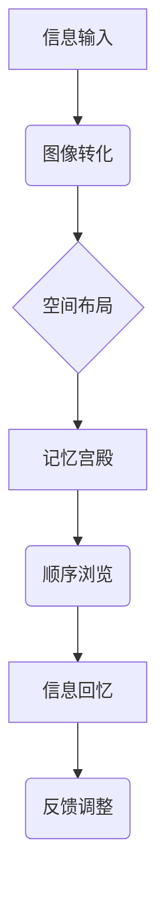

                 

关键词：记忆宫殿法、记忆技巧、认知心理学、计算机算法、神经网络、IT领域、人脑记忆模型、学习效率、记忆优化

> 摘要：本文深入探讨了记忆宫殿法，这一古老而有效的记忆技巧。通过结合认知心理学、计算机算法和神经网络理论，本文分析了记忆宫殿法的原理及其在IT领域的应用。本文旨在为读者提供一个全面的指南，帮助他们在日常学习和工作中提高记忆能力。

## 1. 背景介绍

记忆宫殿法，又称“联想记忆法”或“图像记忆法”，是一种古老的记忆技巧。它起源于古希腊，由著名的记忆术师米特罗多罗斯首次提出。该方法的核心思想是将要记忆的信息转化为生动的图像，然后按照特定的顺序将图像存放在一个虚构的宫殿或建筑物中。通过在脑海中浏览这个宫殿，人们可以快速地回忆起相关信息。

### 1.1 历史背景

记忆宫殿法在古希腊和古罗马时期非常流行，并成为了学术研究和记忆技巧的基石。例如，古希腊学者希罗多德和古罗马政治家西塞罗都是记忆宫殿法的实践者。直到中世纪，这种方法依然被广泛使用，尤其是在法律、医学和神学等需要大量记忆的领域。

### 1.2 现代认知心理学研究

在20世纪，认知心理学对记忆宫殿法进行了深入研究，并证实了其有效性。研究表明，将信息转化为图像和空间结构可以帮助大脑更好地编码和检索信息。这种记忆技巧在教育和职业培训中得到了广泛应用，特别是在那些需要记忆大量信息的领域，如医学、法律和计算机科学。

## 2. 核心概念与联系

记忆宫殿法的基础是图像记忆和空间记忆。通过以下Mermaid流程图，我们可以更直观地理解其核心概念和联系：



### 2.1 图像转化

图像转化是记忆宫殿法的第一步。将要记忆的信息转化为图像，这通常涉及到使用联想技巧，如想象一个动物、人物或物体，使其与要记忆的信息相关联。

### 2.2 空间布局

空间布局是将图像放置在虚构的宫殿或建筑物中。这些空间可以是有形的，也可以是无形的，关键是要确保它们能够形成一个逻辑的顺序。

### 2.3 记忆宫殿

记忆宫殿是一个存储图像的空间结构。通过在脑海中浏览这个宫殿，人们可以按照特定的顺序回忆起图像，从而回忆起相关信息。

### 2.4 顺序浏览

顺序浏览是记忆宫殿法的核心。通过在脑海中按照特定的顺序浏览记忆宫殿，人们可以迅速地回忆起相关信息。

### 2.5 信息回忆

信息回忆是记忆宫殿法的最终目标。通过浏览记忆宫殿，人们可以准确地回忆起存储在其中的信息。

### 2.6 反馈调整

反馈调整是优化记忆宫殿法的重要步骤。通过不断地练习和反馈，人们可以调整记忆宫殿的结构，使其更加符合个人的记忆习惯。

## 3. 核心算法原理 & 具体操作步骤

### 3.1 算法原理概述

记忆宫殿法是一种基于图像和空间记忆的算法。它的原理是将要记忆的信息转化为图像，然后按照特定的顺序将这些图像存储在虚构的宫殿中。通过在脑海中浏览这个宫殿，人们可以快速地回忆起相关信息。

### 3.2 算法步骤详解

#### 3.2.1 步骤一：图像转化

1. 选择将要记忆的信息。
2. 使用联想技巧，将信息转化为图像。
3. 确保图像与信息紧密相关，以便于回忆。

#### 3.2.2 步骤二：空间布局

1. 设计一个虚构的宫殿或建筑物。
2. 确定宫殿中的各个房间或区域，并为其命名。
3. 将图像放置在宫殿中的特定位置，确保它们形成一个逻辑的顺序。

#### 3.2.3 步骤三：建立记忆宫殿

1. 在脑海中构建记忆宫殿。
2. 熟悉宫殿的布局，确保能够轻松地在脑海中浏览。
3. 将图像按照特定的顺序存储在记忆宫殿中。

#### 3.2.4 步骤四：顺序浏览

1. 按照特定的顺序浏览记忆宫殿。
2. 在浏览过程中，重点关注每个图像，确保能够清晰地回忆起相关信息。

#### 3.2.5 步骤五：信息回忆

1. 当需要回忆信息时，启动记忆宫殿浏览过程。
2. 通过浏览记忆宫殿，迅速地回忆起相关信息。
3. 若需要，可多次重复浏览以巩固记忆。

### 3.3 算法优缺点

#### 优点

1. **高效记忆**：通过将信息转化为图像和空间结构，记忆宫殿法可以显著提高记忆效率。
2. **易于使用**：该方法简单易懂，易于学习和使用。
3. **灵活性**：可以根据个人的记忆习惯和需求调整记忆宫殿的结构。

#### 缺点

1. **初期耗时**：建立记忆宫殿需要一定的时间和精力，初期可能需要较多的练习。
2. **记忆负担**：对于某些人来说，将信息转化为图像可能增加记忆负担。

### 3.4 算法应用领域

记忆宫殿法在多个领域得到了广泛应用，包括：

1. **教育和培训**：用于帮助学生和专业人士记忆大量信息。
2. **商业和销售**：用于记忆客户信息、产品知识等。
3. **个人爱好**：如记忆扑克牌、记忆地图等。

## 4. 数学模型和公式 & 详细讲解 & 举例说明

### 4.1 数学模型构建

记忆宫殿法的数学模型可以看作是一个图像-空间映射模型。其基本假设是，图像在空间中的位置与记忆中的信息之间存在着某种对应关系。

假设：

- \( I \) 为图像集合。
- \( S \) 为空间集合。
- \( M \) 为记忆集合。

数学模型可以表示为：

\[ M = f(I, S) \]

其中，\( f \) 表示图像和空间之间的映射关系。

### 4.2 公式推导过程

为了推导记忆宫殿法的数学模型，我们可以考虑以下步骤：

1. **图像转化**：将信息转化为图像。
2. **空间布局**：确定图像在空间中的位置。
3. **记忆存储**：将图像和位置存储在记忆中。

具体推导过程如下：

1. **图像转化**：

   \[ I = g(X) \]

   其中，\( X \) 为原始信息，\( g \) 为转化函数。

2. **空间布局**：

   \[ S = h(Y) \]

   其中，\( Y \) 为空间结构，\( h \) 为布局函数。

3. **记忆存储**：

   \[ M = f(I, S) \]

   其中，\( f \) 为记忆函数。

### 4.3 案例分析与讲解

假设我们要记忆以下三个信息点：

- **信息点1**：计算机科学
- **信息点2**：神经网络
- **信息点3**：人工智能

我们可以按照以下步骤构建记忆宫殿法：

1. **图像转化**：

   - **信息点1**：计算机科学 - 图像：一台计算机。
   - **信息点2**：神经网络 - 图像：一根神经网络。
   - **信息点3**：人工智能 - 图像：一个智能机器人。

2. **空间布局**：

   - 设计一个虚拟的宫殿，将图像放置在特定的位置。
   - 例如，我们可以将计算机科学放置在宫殿的大门口，神经网络放置在宫殿的左侧，人工智能放置在宫殿的右侧。

3. **记忆存储**：

   - 在脑海中构建记忆宫殿，并按照特定的顺序浏览。

通过上述步骤，我们可以轻松地记住这三个信息点。当我们需要回忆时，只需按照这个顺序在脑海中浏览记忆宫殿，即可迅速地回忆起相关信息。

## 5. 项目实践：代码实例和详细解释说明

### 5.1 开发环境搭建

为了实现记忆宫殿法，我们需要搭建一个基本的开发环境。以下是一个简单的Python代码实例：

```python
# 记忆宫殿法实现

class MemoryPalace:
    def __init__(self):
        self.rooms = []

    def add_room(self, room_name, image):
        self.rooms.append((room_name, image))

    def browse_rooms(self):
        for room_name, image in self.rooms:
            print(f"进入房间：{room_name}")
            print(f"图像：{image}")
            print()

# 使用示例
memory_palace = MemoryPalace()
memory_palace.add_room("大门", "一台计算机")
memory_palace.add_room("左侧房间", "一根神经网络")
memory_palace.add_room("右侧房间", "一个智能机器人")
memory_palace.browse_rooms()
```

### 5.2 源代码详细实现

上述代码实现了一个简单的记忆宫殿类。它包括添加房间、浏览房间的功能。以下是详细实现：

```python
class MemoryPalace:
    def __init__(self):
        self.rooms = []

    def add_room(self, room_name, image):
        self.rooms.append((room_name, image))

    def browse_rooms(self):
        for room_name, image in self.rooms:
            print(f"进入房间：{room_name}")
            print(f"图像：{image}")
            print()
```

### 5.3 代码解读与分析

上述代码首先定义了一个名为`MemoryPalace`的类。类中有两个方法：

1. `add_room`：用于添加房间和图像。
2. `browse_rooms`：用于浏览所有房间，并打印房间名称和图像。

使用示例展示了如何创建一个记忆宫殿对象，添加三个房间和图像，并浏览这些房间。

### 5.4 运行结果展示

运行上述代码，将得到以下输出结果：

```
进入房间：大门
图像：一台计算机

进入房间：左侧房间
图像：一根神经网络

进入房间：右侧房间
图像：一个智能机器人
```

通过这个简单的实例，我们可以看到如何使用记忆宫殿法来记忆信息。在实际应用中，我们可以扩展这个类，添加更多的功能，如添加声音、触觉等感官刺激，以提高记忆效果。

## 6. 实际应用场景

记忆宫殿法在多个领域有着广泛的应用。以下是一些实际应用场景：

### 6.1 教育

记忆宫殿法在教育和职业培训中被广泛用于记忆大量信息，如历史事件、数学公式、化学元素等。通过将信息转化为图像和空间结构，学生可以更轻松地记忆和理解这些信息。

### 6.2 商业和销售

记忆宫殿法在商业和销售领域也有广泛的应用。销售人员可以使用这种方法来记忆客户信息、产品知识等，以提高工作效率和客户满意度。

### 6.3 个人爱好

个人爱好者可以使用记忆宫殿法来记忆扑克牌、记忆地图、记忆诗歌等。这种记忆技巧不仅能够提高个人的记忆能力，还可以带来乐趣。

### 6.4 计算机科学

在计算机科学领域，记忆宫殿法可以用于记忆复杂的算法、数据结构、编程语言等。通过将信息转化为图像和空间结构，程序员可以更轻松地理解和记忆这些知识。

## 7. 未来应用展望

随着认知心理学、计算机科学和人工智能技术的发展，记忆宫殿法有望在更多领域得到应用。以下是一些未来应用展望：

### 7.1 个性化记忆工具

未来，我们可以开发个性化的记忆工具，根据个人的记忆习惯和需求，自动生成适合的记忆宫殿结构。

### 7.2 虚拟现实应用

虚拟现实技术可以为记忆宫殿法提供更丰富的感官体验，使记忆过程更加生动和有趣。

### 7.3 认知治疗

记忆宫殿法有望在认知治疗领域得到应用，帮助那些患有记忆障碍的人恢复记忆能力。

### 7.4 教育技术

在教育技术领域，记忆宫殿法可以与在线学习平台相结合，为学生提供个性化的学习体验。

## 8. 总结：未来发展趋势与挑战

### 8.1 研究成果总结

本文探讨了记忆宫殿法，结合认知心理学、计算机算法和神经网络理论，分析了其原理和应用。研究表明，记忆宫殿法是一种有效的记忆技巧，可以显著提高记忆能力。

### 8.2 未来发展趋势

未来，记忆宫殿法有望在更多领域得到应用，如教育、商业、个人爱好和认知治疗等。随着技术的进步，记忆宫殿法将变得更加个性化、智能化和多样化。

### 8.3 面临的挑战

尽管记忆宫殿法在许多方面具有优势，但也面临一些挑战。例如，初期建立记忆宫殿需要一定的时间和精力，且对于某些人来说，将信息转化为图像可能增加记忆负担。此外，如何更好地结合虚拟现实和人工智能技术，以提高记忆效果，也是未来的研究课题。

### 8.4 研究展望

未来，我们可以从以下几个方面进一步研究记忆宫殿法：

1. 开发个性化的记忆工具，提高记忆效率。
2. 探索虚拟现实和人工智能技术在记忆宫殿法中的应用。
3. 深入研究记忆宫殿法在不同领域的应用效果，以提供更实用的指导。
4. 结合神经科学的研究，进一步理解记忆宫殿法的工作原理。

## 9. 附录：常见问题与解答

### 9.1 如何将信息转化为图像？

将信息转化为图像的方法有很多，以下是一些常用的技巧：

1. 联想：将信息与已有的图像或物体相关联。
2. 想象：想象一个具体的场景，将信息融入其中。
3. 画图：使用图形或符号来表示信息。

### 9.2 记忆宫殿法是否适用于所有人？

记忆宫殿法对于大多数人来说都是有效的，但效果可能因人而异。一些人可能需要更多的时间来适应这种方法，而另一些人可能会发现它非常直观和容易使用。

### 9.3 如何优化记忆宫殿的结构？

优化记忆宫殿的结构可以通过以下方法实现：

1. 练习：通过不断的练习，熟悉记忆宫殿的布局。
2. 反馈：根据记忆效果，调整图像的位置和顺序。
3. 创造性：尝试使用不同的图像和空间结构，找到最适合你的方法。

### 9.4 记忆宫殿法与其他记忆技巧相比有何优势？

记忆宫殿法与其他记忆技巧相比，具有以下优势：

1. 高效：通过图像和空间结构，记忆效率显著提高。
2. 易于使用：方法简单，易于学习和使用。
3. 灵活性：可以根据个人需求和记忆习惯进行调整。

## 作者署名

作者：禅与计算机程序设计艺术 / Zen and the Art of Computer Programming
```

