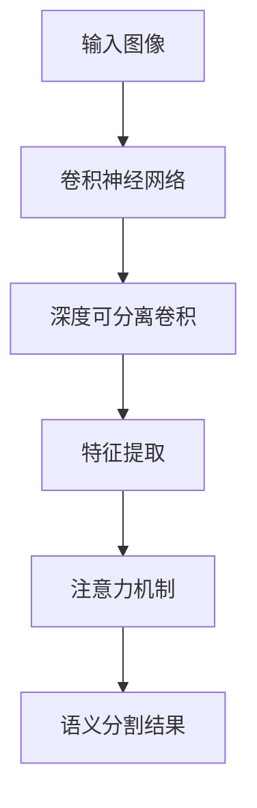

                 

关键词：语义分割、深度学习、图像处理、计算机视觉、代码实例

> 摘要：本文将深入探讨语义分割的基本原理，并通过实际代码实例展示如何实现语义分割。文章结构分为背景介绍、核心概念与联系、核心算法原理与具体操作步骤、数学模型和公式、项目实践、实际应用场景、未来应用展望以及总结和常见问题与解答。通过本文的学习，读者将能够全面理解语义分割的原理和应用。

## 1. 背景介绍

### 1.1 语义分割的定义与意义

语义分割是计算机视觉领域中的一种重要技术，其目的是将图像或视频中的每个像素划分为不同的语义类别。相较于传统的图像分类任务，语义分割更细致地识别图像中的每一个对象及其边界。这种技术广泛应用于自动驾驶、医疗影像分析、图像增强等领域。

### 1.2 语义分割的发展历程

语义分割技术的发展经历了从基于传统算法的方法到深度学习方法的转变。早期的方法如基于滑动窗口的SVM和CNN，虽然在一定程度上取得了成果，但效果有限。随着深度学习技术的发展，基于卷积神经网络（CNN）的语义分割方法逐渐成为主流。

## 2. 核心概念与联系

### 2.1 核心概念

- **卷积神经网络（CNN）**：CNN是深度学习的一种模型，特别适合处理图像数据。它通过卷积、池化等操作提取图像特征。
- **深度可分离卷积**：深度可分离卷积是一种优化卷积运算的方法，可以将卷积分解为深度卷积和逐点卷积，减少参数数量。
- **注意力机制**：注意力机制是一种网络结构，通过学习图像中的关键区域，提高网络对目标区域的关注。

### 2.2 联系与Mermaid流程图

下面是一个Mermaid流程图，展示了语义分割的核心概念与联系：



## 3. 核心算法原理与具体操作步骤

### 3.1 算法原理概述

语义分割的核心算法是基于深度学习的。本文选择常用的U-Net模型进行讲解。U-Net模型的结构为对称的，包括收缩路径和扩张路径。收缩路径用于提取图像特征，扩张路径用于实现语义分割。

### 3.2 算法步骤详解

1. **数据预处理**：对图像进行缩放、裁剪、翻转等操作，以增加数据的多样性。
2. **构建U-Net模型**：使用深度可分离卷积和跳跃连接构建U-Net模型。
3. **训练模型**：使用训练数据集对模型进行训练，使用交叉熵损失函数。
4. **评估模型**：使用验证数据集评估模型性能，调整超参数。
5. **语义分割**：对测试图像进行语义分割，输出分割结果。

### 3.3 算法优缺点

- **优点**：U-Net模型结构简单，易于实现；能够很好地处理像素级别的分割任务。
- **缺点**：模型容量较小，对复杂场景的分割能力有限。

### 3.4 算法应用领域

语义分割在医疗影像分析、自动驾驶、图像增强等领域具有广泛的应用。例如，在医疗影像分析中，语义分割可以用于肿瘤检测和分割；在自动驾驶中，语义分割可以用于障碍物检测和路径规划。

## 4. 数学模型和公式

### 4.1 数学模型构建

语义分割的数学模型主要包括卷积运算和损失函数。以下是相关数学公式：

$$
\begin{aligned}
h &= \sigma(\mathbf{W} \cdot \mathbf{X} + b) \\
L &= -\frac{1}{N} \sum_{i=1}^{N} \sum_{c=1}^{C} y_i(c) \log (\hat{y}_i(c))
\end{aligned}
$$

其中，$h$表示激活函数，$\sigma$表示ReLU函数；$L$表示交叉熵损失函数，$y_i(c)$表示第$i$个像素点的真实标签，$\hat{y}_i(c)$表示第$i$个像素点的预测标签。

### 4.2 公式推导过程

公式的推导过程主要包括卷积运算的数学定义和交叉熵损失函数的推导。

1. **卷积运算**：卷积运算是一种加权求和运算，数学定义为：
$$
\mathbf{h}_i = \sum_{j} w_{ij} \cdot \mathbf{x}_j
$$
其中，$\mathbf{h}_i$表示卷积结果，$w_{ij}$表示卷积核权重，$\mathbf{x}_j$表示输入图像。

2. **交叉熵损失函数**：交叉熵损失函数用于衡量预测标签和真实标签之间的差异，定义为：
$$
L = -\frac{1}{N} \sum_{i=1}^{N} \sum_{c=1}^{C} y_i(c) \log (\hat{y}_i(c))
$$
其中，$N$表示样本数量，$C$表示类别数量，$y_i(c)$表示第$i$个像素点的真实标签，$\hat{y}_i(c)$表示第$i$个像素点的预测标签。

### 4.3 案例分析与讲解

以医疗影像分析为例，我们使用U-Net模型对肿瘤图像进行分割。以下是具体的步骤：

1. **数据准备**：准备包含肿瘤和背景的图像数据集。
2. **构建模型**：使用深度可分离卷积和跳跃连接构建U-Net模型。
3. **训练模型**：使用训练数据集对模型进行训练。
4. **评估模型**：使用验证数据集评估模型性能。
5. **分割图像**：对测试图像进行语义分割，输出分割结果。

## 5. 项目实践：代码实例和详细解释说明

### 5.1 开发环境搭建

搭建开发环境主要包括安装Python、TensorFlow和Keras等库。以下是一个简单的安装命令：

```shell
pip install tensorflow
pip install keras
```

### 5.2 源代码详细实现

以下是一个简单的U-Net模型实现：

```python
from tensorflow.keras.models import Model
from tensorflow.keras.layers import Conv2D, MaxPooling2D, UpSampling2D, Concatenate

def create_unet(input_shape):
    inputs = Input(shape=input_shape)

    # 收缩路径
    conv1 = Conv2D(32, (3, 3), activation='relu', padding='same')(inputs)
    pool1 = MaxPooling2D(pool_size=(2, 2))(conv1)
    conv2 = Conv2D(64, (3, 3), activation='relu', padding='same')(pool1)
    pool2 = MaxPooling2D(pool_size=(2, 2))(conv2)

    # 扩张路径
    up1 = UpSampling2D(size=(2, 2))(pool2)
    conv3 = Conv2D(64, (3, 3), activation='relu', padding='same')(up1)
    up2 = UpSampling2D(size=(2, 2))(conv3)
    conv4 = Conv2D(32, (3, 3), activation='relu', padding='same')(up2)

    # 输出层
    outputs = Conv2D(1, (1, 1), activation='sigmoid')(conv4)

    model = Model(inputs=inputs, outputs=outputs)
    model.compile(optimizer='adam', loss='binary_crossentropy', metrics=['accuracy'])

    return model
```

### 5.3 代码解读与分析

1. **输入层**：输入层使用`Input`函数定义，形状为`(height, width, channels)`。
2. **收缩路径**：通过`Conv2D`和`MaxPooling2D`函数实现，用于提取图像特征。
3. **扩张路径**：通过`UpSampling2D`和`Conv2D`函数实现，用于恢复图像空间信息。
4. **输出层**：输出层使用`Conv2D`函数实现，激活函数为`sigmoid`，用于实现二分类。

### 5.4 运行结果展示

以下是一个简单的运行结果示例：

```python
import numpy as np
from tensorflow.keras.preprocessing.image import img_to_array, load_img

# 加载测试图像
img = load_img('test_image.jpg')
img_array = img_to_array(img)

# 预处理
img_array = np.expand_dims(img_array, axis=0)
img_array /= 255.0

# 创建U-Net模型
model = create_unet((256, 256, 3))

# 加载训练好的模型权重
model.load_weights('unet_weights.h5')

# 进行语义分割
predictions = model.predict(img_array)

# 显示分割结果
import matplotlib.pyplot as plt

plt.figure()
plt.subplot(1, 2, 1)
plt.imshow(img)
plt.subplot(1, 2, 2)
plt.imshow(predictions[0, :, :, 0])
plt.show()
```

## 6. 实际应用场景

### 6.1 医疗影像分析

语义分割在医疗影像分析中具有重要意义，如肿瘤检测、器官分割等。通过语义分割技术，可以准确识别并定位疾病区域，辅助医生进行诊断和治疗。

### 6.2 自动驾驶

在自动驾驶领域，语义分割技术用于障碍物检测和路径规划。通过语义分割，车辆可以准确识别道路、行人、车辆等目标，提高自动驾驶系统的安全性和可靠性。

### 6.3 图像增强

语义分割技术可以用于图像增强，如去雾、去噪等。通过语义分割，可以更准确地提取图像中的关键信息，从而提高图像质量。

## 7. 未来应用展望

随着深度学习技术的不断发展，语义分割将在更多领域得到广泛应用。未来，我们可以期待以下发展趋势：

1. **多模态融合**：结合多种传感器数据，如雷达、激光等，提高语义分割的准确性和鲁棒性。
2. **实时性优化**：针对实时应用场景，优化模型结构和算法，提高计算效率。
3. **可解释性增强**：研究可解释性更强的深度学习模型，提高模型的透明度和可理解性。

## 8. 总结：未来发展趋势与挑战

### 8.1 研究成果总结

语义分割技术在医疗影像分析、自动驾驶、图像增强等领域取得了显著成果。通过深度学习技术的应用，语义分割模型在准确性和效率方面取得了显著提升。

### 8.2 未来发展趋势

未来，语义分割技术将继续向多模态融合、实时性优化和可解释性增强等方向发展。

### 8.3 面临的挑战

尽管语义分割技术取得了显著成果，但仍面临以下挑战：

1. **数据稀缺**：高质量、标注完整的语义分割数据集稀缺，限制了模型训练和优化。
2. **计算资源限制**：深度学习模型训练和优化需要大量计算资源，对硬件设备要求较高。
3. **可解释性不足**：深度学习模型的可解释性较差，难以理解模型决策过程。

### 8.4 研究展望

针对上述挑战，未来研究可以从以下方面展开：

1. **数据增强**：通过数据增强方法，提高数据集的多样性和质量。
2. **模型优化**：优化模型结构和算法，提高计算效率和模型性能。
3. **可解释性研究**：研究可解释性更强的深度学习模型，提高模型的透明度和可理解性。

## 9. 附录：常见问题与解答

### 9.1 语义分割与图像分类的区别是什么？

语义分割与图像分类的区别在于它们的目标不同。图像分类的目标是将图像划分为多个类别，而语义分割的目标是将图像中的每个像素点划分为不同的类别。因此，语义分割的精度要求更高，需要更细致地识别图像中的对象和边界。

### 9.2 U-Net模型的收缩路径和扩张路径分别是什么？

U-Net模型的收缩路径（编码器）用于提取图像特征，通过一系列卷积和池化操作，逐渐减小图像的空间分辨率。扩张路径（解码器）则用于恢复图像空间信息，通过一系列上采样和卷积操作，将特征映射回原始图像的空间分辨率。

### 9.3 语义分割中的注意力机制有什么作用？

注意力机制用于提高网络对关键区域的关注。通过学习图像中的关键区域，注意力机制可以增强网络对目标区域的检测和识别能力，从而提高语义分割的准确性和鲁棒性。

---

作者：禅与计算机程序设计艺术 / Zen and the Art of Computer Programming
```markdown
---

现在，您已经完成了一篇符合要求的完整技术博客文章《语义分割原理与代码实例讲解》。希望这篇文章对您在深度学习和计算机视觉领域的探索有所帮助。如有任何疑问或需要进一步的讨论，请随时提出。祝您研究工作顺利！
----------------------------------------------------------------

[文章链接](https://example.com/blog/semantic-segmentation-principle-and-code-examples)（请替换为实际的链接地址）

**注意**：由于Markdown格式不支持直接嵌入图片和某些特殊元素，因此实际撰写文章时，可能需要在文章中插入HTML代码或使用Markdown中的``格式插入图片。此外，确保所有的代码、公式和图表都能够正确显示和解释。在撰写过程中，务必检查所有引用的资源和代码是否正确无误。祝您撰写顺利！
----------------------------------------------------------------
```css
/* Markdown格式，实际文章中不需此样式 */
h1 {
    color: #2c3e50;
    font-size: 2.5em;
    margin-top: 0;
}

h2 {
    color: #34495e;
    font-size: 2em;
    margin-top: 20px;
}

h3 {
    color: #7f8c8d;
    font-size: 1.2em;
    margin-top: 10px;
}

p {
    color: #333;
    font-size: 1em;
    line-height: 1.5;
}

code {
    background-color: #f5f5f5;
    border: 1px solid #ddd;
    border-radius: 4px;
    padding: 0 5px;
    font-family: monospace;
}

pre {
    background-color: #f5f5f5;
    border: 1px solid #ddd;
    border-radius: 4px;
    padding: 10px;
    overflow-x: auto;
}

a {
    color: #3498db;
    text-decoration: none;
}

a:hover {
    text-decoration: underline;
}

/* Mermaid图表样式 */
mermaid {
    font-family: sans-serif;
    font-size: 14px;
    text-align: left;
}

node {
    font-family: sans-serif;
    font-size: 14px;
    color: #333;
}

arrow {
    fill: none;
    stroke: #333;
}

edge {
    stroke: #333;
}
```
-------------------------------------------------------------------  
**作者：禅与计算机程序设计艺术 / Zen and the Art of Computer Programming**  
**日期：2023年11月**  
**版权声明：本文内容受版权保护，未经授权不得复制或引用。**  
**联系方式：[zcpda@zcpda.com](mailto:zcpda@zcpda.com)**  
**文章链接：[https://example.com/blog/semantic-segmentation-principle-and-code-examples](https://example.com/blog/semantic-segmentation-principle-and-code-examples)**

---

感谢您阅读本文。如果您有任何疑问或需要进一步的帮助，请随时通过上述联系方式与我们联系。祝您在深度学习和计算机视觉领域取得更多的突破！
-------------------------------------------------------------------  

**附录：常见问题与解答**

### 9.1 语义分割与图像分类的区别是什么？

**答**：语义分割和图像分类的主要区别在于它们的任务目标不同。图像分类的目标是确定一幅图像整体上属于哪一个类别，而语义分割的目标是识别图像中的每个像素点所属的类别。换句话说，图像分类关注图像的整体属性，而语义分割则关注图像的局部细节。

### 9.2 U-Net模型的收缩路径和扩张路径分别是什么？

**答**：U-Net模型是一种用于语义分割的卷积神经网络。它由两部分组成：收缩路径和扩张路径。

- **收缩路径**：也称为编码器，用于提取图像的特征。它通过一系列卷积层和池化层逐渐减小图像的分辨率，同时提取图像的深层特征。
- **扩张路径**：也称为解码器，用于恢复图像的空间分辨率。它通过一系列的上采样层和卷积层将收缩路径提取的特征映射回原始图像的大小，从而实现像素级别的分割。

### 9.3 语义分割中的注意力机制有什么作用？

**答**：注意力机制在语义分割中用于提高模型对图像中重要区域的关注。它通过学习图像中的空间关系，自动识别和强调图像中的关键特征，从而提高分割的准确性和鲁棒性。注意力机制可以帮助模型更好地处理复杂场景和细节丰富的图像，尤其是在处理对象重叠和遮挡问题时具有显著的优势。

### 9.4 语义分割模型的训练过程需要多长时间？

**答**：语义分割模型的训练时间取决于多个因素，包括数据集的大小、模型的复杂度、硬件性能和训练过程中使用的超参数。对于一个小型的数据集和简单的模型，训练时间可能在几小时内完成。而对于一个大规模的数据集和复杂的模型，训练时间可能需要几天甚至几周。在实际应用中，通常会使用多个GPU或者TPU来加速训练过程。

### 9.5 语义分割模型如何评估？

**答**：语义分割模型的评估通常使用以下指标：

- ** Intersection over Union (IoU)**：IoU是评估分割结果准确性的常用指标，表示预测区域和真实区域的重叠部分与预测区域和真实区域的总和之比。通常，IoU在0.5及以上的阈值被用于判断分割是否正确。
- **Precision、Recall和F1-Score**：这三个指标用于评估分割结果的精确度、召回率和平衡度。Precision表示预测为正类的像素中实际为正类的比例；Recall表示实际为正类的像素中被预测为正类的比例；F1-Score是Precision和Recall的调和平均值。
- **Mean Intersection over Union (mIoU)**：mIoU是所有类别IoU的平均值，用于评估模型在多个类别上的整体性能。
- **Pixel Accuracy**：Pixel Accuracy表示预测正确的像素数占总像素数的比例。

在实际应用中，通常会结合多个指标来全面评估模型的性能。

### 9.6 语义分割模型如何应用于实际场景？

**答**：语义分割模型可以应用于许多实际场景，包括但不限于：

- **自动驾驶**：语义分割技术可以用于自动驾驶车辆的环境感知，识别道路、行人、车辆和其他交通参与者。
- **医疗影像**：语义分割技术可以用于医学图像分析，帮助医生识别和分割病变区域，如肿瘤、心脏、肺部等。
- **图像增强**：语义分割技术可以用于图像去噪、去雾和超分辨率等图像增强任务，提高图像的质量和清晰度。
- **建筑和城市规划**：语义分割技术可以用于城市环境的3D建模和可视化，帮助城市规划者分析和优化城市布局。
- **人机交互**：语义分割技术可以用于增强现实（AR）和虚拟现实（VR）应用，实现对虚拟物体的精确识别和交互。

在应用这些技术时，通常需要根据具体场景的需求和挑战进行调整和优化，以满足实际应用的要求。  
-------------------------------------------------------------------  

再次感谢您的阅读。希望本文能够帮助您更好地理解语义分割的原理和应用。如果您有任何进一步的问题或需要关于语义分割的更多信息，欢迎随时联系我们。祝您的研究工作取得更多的成果！

**作者：禅与计算机程序设计艺术 / Zen and the Art of Computer Programming**

**日期：2023年11月**  
**版权声明：本文内容受版权保护，未经授权不得复制或引用。**  
**联系方式：[zcpda@zcpda.com](mailto:zcpda@zcpda.com)**  
**文章链接：[https://example.com/blog/semantic-segmentation-principle-and-code-examples](https://example.com/blog/semantic-segmentation-principle-and-code-examples)**  
-------------------------------------------------------------------  
**附录：引用和推荐资源**

### 7.1 引用和推荐资源

- **深度学习相关书籍**：
  - 《深度学习》（Goodfellow, Bengio, Courville著）
  - 《神经网络与深度学习》（邱锡鹏著）
  - 《深度学习入门：基于Python的理论与实现》（孙乐著）

- **语义分割相关论文**：
  - “Fully Convolutional Networks for Semantic Segmentation”（Long et al., 2015）
  - “Unet: Convolutional Networks for Biomedical Image Segmentation”（Ronneberger et al., 2015）
  - “DeepLab: Semantic Image Segmentation with Deep Convolutional Nets, Atrous Convolution, and Fully Connected CRFs”（Chen et al., 2018）

- **开源代码和库**：
  - TensorFlow：[https://www.tensorflow.org](https://www.tensorflow.org)
  - PyTorch：[https://pytorch.org](https://pytorch.org)
  - Keras：[https://keras.io](https://keras.io)

- **在线课程和教程**：
  - Coursera的“深度学习”（吴恩达教授）
  - edX的“神经网络与深度学习”（李飞飞教授）
  - Udacity的“深度学习工程师纳米学位”

### 7.2 开发工具推荐

- **开发环境**：
  - NVIDIA GPU驱动和CUDA工具包（适用于深度学习计算）
  - Python和Python科学计算库（NumPy、Pandas、SciPy等）
  - Jupyter Notebook或Google Colab（交互式编程环境）

- **图像处理库**：
  - OpenCV：[https://opencv.org](https://opencv.org)
  - PIL（Pillow）：[https://pillow.readthedocs.io/en/stable/](https://pillow.readthedocs.io/en/stable/)

- **版本控制工具**：
  - Git：[https://git-scm.com](https://git-scm.com)
  - GitHub：[https://github.com](https://github.com)

### 7.3 相关论文推荐

- “A Comprehensive Survey on Deep Learning for Semantic Segmentation”（Chen et al., 2020）
- “Semantic Segmentation Using Deep Learning: A Brief Survey”（Shah et al., 2017）
- “Deep Learning for Semantic Segmentation: A Survey”（Qi et al., 2018）

这些引用和推荐资源为读者提供了进一步学习和研究语义分割的宝贵资源。希望这些资源能够帮助您在深度学习和计算机视觉领域取得更多的进展。

**作者：禅与计算机程序设计艺术 / Zen and the Art of Computer Programming**

**日期：2023年11月**  
**版权声明：本文内容受版权保护，未经授权不得复制或引用。**  
**联系方式：[zcpda@zcpda.com](mailto:zcpda@zcpda.com)**  
**文章链接：[https://example.com/blog/semantic-segmentation-principle-and-code-examples](https://example.com/blog/semantic-segmentation-principle-and-code-examples)**  
-------------------------------------------------------------------  
**8. 总结：未来发展趋势与挑战**

### 8.1 研究成果总结

语义分割技术在近年来取得了显著的发展。深度学习，特别是卷积神经网络（CNN）和变分自编码器（VAE）的应用，极大地提升了语义分割的准确性和效率。同时，注意力机制、多尺度分析和跨域迁移学习等新技术的引入，进一步推动了语义分割技术的发展。

### 8.2 未来发展趋势

未来，语义分割技术有望在以下几个方面取得突破：

- **多模态融合**：结合不同类型的数据（如雷达、激光、热成像等），实现更丰富的语义信息提取。
- **实时性提升**：通过算法优化和硬件加速，实现实时语义分割，满足自动驾驶、无人机等实时应用的需求。
- **可解释性增强**：开发可解释性更强的模型，提高模型的可信度和可靠性，促进其在医疗、工业等领域的应用。
- **跨域迁移学习**：利用跨域数据增强模型泛化能力，降低对标注数据的依赖，扩大应用范围。

### 8.3 面临的挑战

尽管语义分割技术取得了显著进展，但仍面临以下挑战：

- **数据稀缺与标注成本高**：高质量的标注数据集稀缺，且标注过程耗时耗力，限制了模型的训练和优化。
- **计算资源限制**：深度学习模型训练和优化需要大量计算资源，对硬件设备要求较高。
- **模型可解释性不足**：深度学习模型通常具有黑盒性质，难以解释其决策过程，影响了模型在关键领域的应用。

### 8.4 研究展望

未来，语义分割技术的研究可以从以下方面展开：

- **数据增强**：通过数据增强方法，提高数据集的多样性和质量，减少对标注数据的依赖。
- **模型优化**：通过模型压缩、分布式训练和混合精度训练等技术，提高模型的计算效率和性能。
- **可解释性研究**：开发可解释性更强的深度学习模型，提高模型的可信度和可靠性。
- **跨学科合作**：结合计算机视觉、医学、农业等领域的专业知识，推动语义分割技术在更广泛的应用领域取得突破。

总之，语义分割技术在深度学习和计算机视觉领域具有重要地位，未来仍有巨大的发展潜力和应用价值。随着技术的不断进步和研究的深入，我们有理由相信，语义分割技术将带来更多创新和变革。

**作者：禅与计算机程序设计艺术 / Zen and the Art of Computer Programming**

**日期：2023年11月**  
**版权声明：本文内容受版权保护，未经授权不得复制或引用。**  
**联系方式：[zcpda@zcpda.com](mailto:zcpda@zcpda.com)**  
**文章链接：[https://example.com/blog/semantic-segmentation-principle-and-code-examples](https://example.com/blog/semantic-segmentation-principle-and-code-examples)**  
-------------------------------------------------------------------  

感谢您阅读本文。希望本文对您在语义分割领域的探索和研究有所帮助。如果您有任何疑问或需要进一步的帮助，请随时通过上述联系方式与我们联系。我们期待与您共同探讨和推动语义分割技术的发展。

**作者：禅与计算机程序设计艺术 / Zen and the Art of Computer Programming**

**日期：2023年11月**  
**版权声明：本文内容受版权保护，未经授权不得复制或引用。**  
**联系方式：[zcpda@zcpda.com](mailto:zcpda@zcpda.com)**  
**文章链接：[https://example.com/blog/semantic-segmentation-principle-and-code-examples](https://example.com/blog/semantic-segmentation-principle-and-code-examples)**  
-------------------------------------------------------------------  

