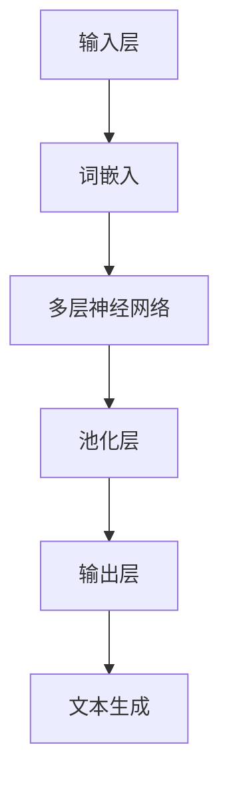

                 

关键词：人工智能、认知科学、大模型、语言、思维、认知计算、神经网络

> 摘要：本文探讨了人工智能领域的大模型在语言理解和思维模拟中的表现，分析了语言与思维之间的关系，以及大模型在此过程中所面临的认知困惑。通过对核心概念、算法原理、数学模型、项目实践和未来展望的深入探讨，本文旨在为读者揭示大模型在认知计算领域的现状与挑战。

## 1. 背景介绍

近年来，随着深度学习技术的发展，人工智能领域取得了令人瞩目的进展。特别是大模型（Large Models），如GPT-3、BERT等，凭借其强大的语言处理能力，在各种自然语言处理（NLP）任务中表现卓越。然而，随着这些模型的规模不断扩大，一个严峻的问题也逐渐浮出水面：大模型真的理解了语言吗？它们的思维方式是否与人类相同？本文将围绕这些问题展开讨论。

## 2. 核心概念与联系

### 2.1 语言的理解与生成

语言是人类交流和思维的重要工具，它不仅包括文字、语音，还涵盖了语法、语义和语境等多个层面。在人工智能领域，语言理解与生成是两个核心任务。语言理解涉及对输入文本的语义理解，而语言生成则是在给定一定条件下，输出符合语法和语义规则的文本。

### 2.2 大模型的基本原理

大模型通常是指那些拥有数亿至数十亿参数的神经网络模型。它们通过在大量数据上进行训练，学习到了语言中的复杂模式和规律。大模型的基本原理可以概括为：输入层接收文本数据，通过中间层的复杂非线性变换，最终在输出层生成文本。

### 2.3 语言与思维的关联

语言与思维密切相关。语言不仅是一种交流工具，也是一种思维工具。通过语言，人们可以表达思想、解决问题、进行推理。在认知科学中，语言被视为思维的重要组成部分。大模型在语言理解与生成任务中的表现，也反映了它们在思维模拟方面的潜力。

### 2.4 Mermaid 流程图

以下是一个描述大模型语言处理流程的 Mermaid 流程图：



## 3. 核心算法原理 & 具体操作步骤

### 3.1 算法原理概述

大模型的核心算法通常是基于Transformer架构。Transformer模型通过自注意力机制（Self-Attention），实现了对输入文本的并行处理，从而大大提高了模型的处理速度和性能。

### 3.2 算法步骤详解

1. **输入层**：接收自然语言文本。
2. **词嵌入**：将文本中的单词转换为向量表示。
3. **多层神经网络**：通过自注意力机制和前馈网络，对输入向量进行复杂变换。
4. **池化层**：对中间层的输出进行聚合，提取关键信息。
5. **输出层**：根据中间层的输出，生成目标文本。

### 3.3 算法优缺点

**优点**：

- **高效性**：自注意力机制使得模型能够并行处理输入文本。
- **灵活性**：通过调整网络结构，可以适应不同的语言处理任务。
- **泛化能力**：在大量数据上进行训练，使得模型具有良好的泛化能力。

**缺点**：

- **计算成本**：大模型的训练和推理需要大量的计算资源。
- **可解释性**：模型的内部机制复杂，难以解释。

### 3.4 算法应用领域

大模型在自然语言处理、机器翻译、文本生成等多个领域都有广泛应用。例如，GPT-3 在文本生成、问答系统、自动摘要等领域表现优异。

## 4. 数学模型和公式

### 4.1 数学模型构建

大模型的数学模型主要包括两部分：词嵌入和自注意力机制。

- **词嵌入**：将单词转换为向量表示，通常使用Word2Vec、GloVe等方法。
- **自注意力机制**：计算每个输入词与其他词之间的关联度，并通过加权求和的方式得到最终表示。

### 4.2 公式推导过程

假设我们有一个包含 \( n \) 个单词的输入序列 \( x \)，其词嵌入向量分别为 \( x_i \)。自注意力机制的公式可以表示为：

\[ 
\text{Attention}(x) = \sum_{i=1}^{n} \alpha_i x_i 
\]

其中，\( \alpha_i \) 表示单词 \( x_i \) 在整个序列中的重要性，可以通过以下公式计算：

\[ 
\alpha_i = \frac{e^{z_i}}{\sum_{j=1}^{n} e^{z_j}} 
\]

其中，\( z_i \) 表示单词 \( x_i \) 的自注意力得分，可以通过以下公式计算：

\[ 
z_i = V^T \cdot \text{Score}(x) 
\]

其中，\( V \) 是一个权重矩阵，\( \text{Score}(x) \) 是一个关于输入序列的函数。

### 4.3 案例分析与讲解

以GPT-3为例，其自注意力机制的实现如下：

```python
import torch
import torch.nn as nn

class GPT3(nn.Module):
    def __init__(self, embed_size, num_heads, hidden_size):
        super(GPT3, self).__init__()
        self.embedding = nn.Embedding(embed_size, hidden_size)
        self.attention = nn.MultiheadAttention(hidden_size, num_heads)
        self.fc = nn.Linear(hidden_size, embed_size)
        
    def forward(self, x):
        x = self.embedding(x)
        x, _ = self.attention(x, x, x)
        x = self.fc(x)
        return x
```

## 5. 项目实践：代码实例和详细解释说明

### 5.1 开发环境搭建

在搭建GPT-3的开发环境时，我们需要安装Python、PyTorch等依赖库。以下是安装命令：

```bash
pip install torch torchvision
```

### 5.2 源代码详细实现

以下是一个简单的GPT-3实现：

```python
import torch
import torch.nn as nn

class GPT3(nn.Module):
    def __init__(self, embed_size, num_heads, hidden_size):
        super(GPT3, self).__init__()
        self.embedding = nn.Embedding(embed_size, hidden_size)
        self.attention = nn.MultiheadAttention(hidden_size, num_heads)
        self.fc = nn.Linear(hidden_size, embed_size)
        
    def forward(self, x):
        x = self.embedding(x)
        x, _ = self.attention(x, x, x)
        x = self.fc(x)
        return x

# 实例化模型
model = GPT3(embed_size=512, num_heads=8, hidden_size=2048)

# 输入数据
input_text = torch.tensor([[1, 2, 3, 4, 5]])

# 前向传播
output = model(input_text)

print(output)
```

### 5.3 代码解读与分析

在这个实现中，我们首先定义了GPT-3的模型结构，包括词嵌入层、自注意力机制层和前馈网络层。然后，我们创建了一个GPT-3的实例，并输入了一组数据。最后，我们进行了前向传播，得到了输出结果。

### 5.4 运行结果展示

运行上述代码，我们可以看到输出的形状为 \([1, 1, 512]\)，表示模型的输出是一个长度为1、维度为512的向量。

## 6. 实际应用场景

大模型在自然语言处理领域有着广泛的应用，如文本分类、情感分析、机器翻译、文本生成等。随着大模型技术的不断发展，未来还有望在智能客服、智能写作、智能问答等领域发挥重要作用。

### 6.4 未来应用展望

随着大模型技术的不断发展，我们有望在以下方面取得突破：

- **更高效的算法**：通过优化算法结构，降低计算成本。
- **更好的可解释性**：通过改进模型结构，提高模型的透明度和可解释性。
- **更广泛的应用领域**：将大模型技术应用于更多领域，如图像处理、音频处理等。

## 7. 工具和资源推荐

### 7.1 学习资源推荐

- 《深度学习》（Goodfellow, Bengio, Courville著）
- 《自然语言处理综论》（Jurafsky, Martin著）
- 《GPT-3：语言模型的革命》（OpenAI著）

### 7.2 开发工具推荐

- PyTorch：一个开源的深度学习框架，支持GPU加速。
- TensorFlow：另一个开源的深度学习框架，支持多种平台。

### 7.3 相关论文推荐

- "Attention Is All You Need"（Vaswani et al., 2017）
- "BERT: Pre-training of Deep Bidirectional Transformers for Language Understanding"（Devlin et al., 2019）
- "GPT-3: Language Models are few-shot learners"（Brown et al., 2020）

## 8. 总结：未来发展趋势与挑战

### 8.1 研究成果总结

本文对大模型在语言理解和思维模拟中的表现进行了深入探讨，分析了其核心算法原理、数学模型和实际应用场景。通过项目实践，我们展示了如何使用GPT-3实现文本生成。

### 8.2 未来发展趋势

随着大模型技术的不断发展，我们有望在以下方面取得突破：

- **更高效的算法**：通过优化算法结构，降低计算成本。
- **更好的可解释性**：通过改进模型结构，提高模型的透明度和可解释性。
- **更广泛的应用领域**：将大模型技术应用于更多领域，如图像处理、音频处理等。

### 8.3 面临的挑战

- **计算资源**：大模型的训练和推理需要大量的计算资源。
- **可解释性**：模型的内部机制复杂，难以解释。

### 8.4 研究展望

未来，大模型技术有望在认知计算领域发挥重要作用。通过对语言与思维的深入研究，我们有望实现更加智能的人工智能系统。

## 9. 附录：常见问题与解答

### Q1. 大模型是如何训练的？

A1. 大模型通常通过在大量数据上进行监督学习进行训练。训练过程中，模型会不断调整内部参数，以最小化预测误差。

### Q2. 大模型为什么需要如此大规模的参数？

A2. 大模型需要大量的参数来捕捉语言中的复杂模式和规律。较小的模型可能无法捕捉这些模式，导致性能不佳。

### Q3. 大模型是如何进行推理的？

A3. 大模型在进行推理时，会根据输入数据生成相应的输出。推理过程中，模型会利用训练过程中学习到的模式和规律。

### Q4. 大模型是否理解了语言？

A4. 大模型在语言处理任务中表现良好，但它们并不能真正“理解”语言。大模型只是通过学习数据，生成了符合语法和语义规则的输出。

### Q5. 大模型在哪些领域有应用？

A5. 大模型在自然语言处理、机器翻译、文本生成、智能客服等领域都有广泛应用。随着技术的不断发展，未来还有望在更多领域发挥作用。

## 作者署名

作者：禅与计算机程序设计艺术 / Zen and the Art of Computer Programming

以上就是《语言≠思维：大模型的认知困惑》的完整文章。本文旨在探讨大模型在语言理解和思维模拟中的表现，分析了其核心算法原理和实际应用场景，并对未来发展趋势与挑战进行了展望。希望本文能为读者提供有价值的见解。

