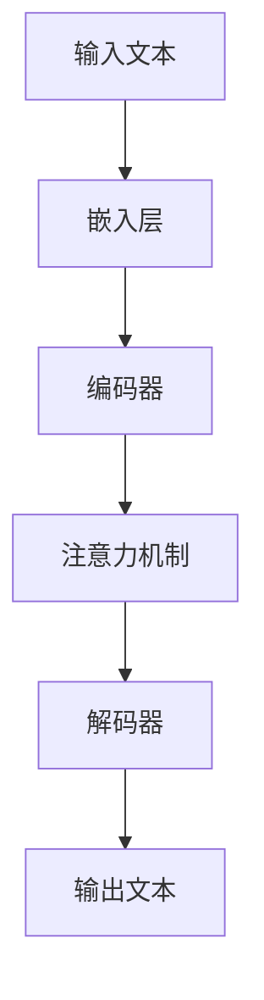

                 

在当代信息技术的发展过程中，大模型技术已经成为一个重要方向。这些模型，如GPT-3、BERT等，具有处理大量数据并生成复杂文本的能力。然而，随着这些模型的规模不断扩大，一个核心问题逐渐显现：语言是否等同于思维？本文将深入探讨这一主题，分析大模型在语言处理上的表现及其背后的认知挑战。

## 1. 背景介绍

### 大模型的发展历程

大模型的发展可以追溯到20世纪90年代，当时深度学习开始崭露头角。随着计算能力的提升和大数据的获取，深度学习模型逐渐变得庞大。2006年，Geoffrey Hinton等人的研究使得深度神经网络（DNN）在图像识别任务上取得了突破性的进展。随后，2012年，AlexNet在ImageNet竞赛中夺冠，深度学习开始得到广泛关注。

在自然语言处理（NLP）领域，递归神经网络（RNN）和长短期记忆网络（LSTM）的引入使得模型能够更好地处理序列数据。2017年，谷歌推出的Transformer架构彻底改变了NLP的面貌，其基于自注意力机制的设计使得模型在处理长文本时具有显著优势。BERT、GPT等模型在此基础上进一步发展，成为当今NLP领域的主流。

### 大模型的应用场景

大模型在多个领域展现出强大的应用潜力。在文本生成方面，GPT-3可以生成连贯且具有创意的文本，被用于自动化写作、问答系统和机器翻译等任务。在问答系统中，BERT等模型通过预训练和微调能够实现高效的问答任务。在图像描述生成方面，大模型能够生成与图像内容高度相关的描述性文本。

## 2. 核心概念与联系

### 语言处理的核心挑战

尽管大模型在语言处理方面取得了显著成果，但仍然面临着一些核心挑战。首先，语言的歧义性使得模型难以准确理解文本的含义。其次，语言的复杂性和动态性使得模型难以捕捉到语言的多层次结构。此外，语言的多样性和地域性也增加了模型训练和应用的难度。

### 大模型的工作原理

大模型通常基于深度学习技术，通过多层神经网络对大量数据进行训练，从而学习到文本的潜在结构和语义关系。在训练过程中，模型通过优化损失函数，调整网络参数，使得输出能够尽可能接近真实标签。具体而言，大模型通常包括以下几个关键组成部分：

1. **嵌入层（Embedding Layer）**：将词汇映射到高维空间，使得相似词汇在空间中接近。
2. **编码器（Encoder）**：对输入文本进行编码，提取文本的语义信息。
3. **解码器（Decoder）**：根据编码器输出的语义信息生成输出文本。
4. **注意力机制（Attention Mechanism）**：允许模型在生成文本时关注不同部分的重要性。

### 大模型架构的 Mermaid 流程图

下面是一个简化的Mermaid流程图，描述大模型的架构：



### 大模型的优势和局限性

大模型的优势在于其能够处理大量数据，并在多个任务上实现高性能。然而，大模型也存在一些局限性，如：

- **计算资源需求高**：训练大模型需要大量的计算资源和时间。
- **数据隐私问题**：大模型在训练过程中会接触到大量敏感数据，这可能引发隐私泄露风险。
- **解释性不足**：大模型通常被视为“黑箱”，难以解释其决策过程。

## 3. 核心算法原理 & 具体操作步骤

### 3.1 算法原理概述

大模型的核心算法通常基于深度学习技术，包括神经网络、递归神经网络（RNN）和变换器（Transformer）等。以下将简要介绍这些算法的基本原理。

#### 神经网络

神经网络是一种基于生物神经系统的计算模型，由多个神经元组成。每个神经元接收多个输入信号，通过加权求和处理后产生输出。神经网络的目的是通过训练学习到输入和输出之间的关系。

#### 递归神经网络（RNN）

递归神经网络是一种可以处理序列数据的神经网络。RNN通过递归结构，允许当前状态依赖于前面的状态，从而更好地捕捉序列中的依赖关系。

#### 变换器（Transformer）

变换器是一种基于自注意力机制的深度神经网络架构。自注意力机制允许模型在处理文本时关注不同部分的重要性，从而提高模型对长文本的处理能力。

### 3.2 算法步骤详解

#### 数据预处理

1. **文本清洗**：去除文本中的无关信息，如HTML标签、停用词等。
2. **分词**：将文本拆分为单词或子词。
3. **编码**：将分词后的文本映射为向量表示。

#### 模型训练

1. **定义损失函数**：通常使用交叉熵损失函数来衡量预测标签和真实标签之间的差距。
2. **选择优化器**：如Adam优化器，用于调整网络参数，最小化损失函数。
3. **训练过程**：通过反向传播算法，不断迭代优化网络参数，直至模型收敛。

#### 模型评估

1. **交叉验证**：使用验证集评估模型性能，避免过拟合。
2. **测试集评估**：在独立测试集上评估模型性能，评估模型在未知数据上的表现。

### 3.3 算法优缺点

#### 优点

- **高性能**：大模型在处理大规模数据时表现出色，能够快速生成高质量的结果。
- **泛化能力**：通过预训练和微调，大模型能够适应不同任务，具有较好的泛化能力。

#### 缺点

- **计算资源需求高**：训练大模型需要大量的计算资源和时间。
- **数据隐私问题**：大模型在训练过程中会接触到大量敏感数据，这可能引发隐私泄露风险。
- **解释性不足**：大模型通常被视为“黑箱”，难以解释其决策过程。

### 3.4 算法应用领域

大模型在多个领域展现出强大的应用潜力，以下是一些主要应用领域：

- **自然语言处理（NLP）**：文本生成、问答系统、机器翻译等。
- **计算机视觉**：图像分类、目标检测、图像生成等。
- **推荐系统**：个性化推荐、商品推荐等。
- **语音识别**：语音转文本、语音合成等。

## 4. 数学模型和公式 & 详细讲解 & 举例说明

### 4.1 数学模型构建

在深度学习中，数学模型通常由多层神经网络组成。每一层网络包含多个神经元，神经元之间通过加权连接。网络的输出由激活函数决定。

设输入向量为 \( \mathbf{x} \)，权重矩阵为 \( \mathbf{W} \)，偏置向量为 \( \mathbf{b} \)，激活函数为 \( f(\cdot) \)。则单层神经网络的输出可以表示为：

\[ \mathbf{y} = f(\mathbf{W}\mathbf{x} + \mathbf{b}) \]

其中，\( \mathbf{y} \) 是输出向量，\( f(\cdot) \) 是激活函数。

### 4.2 公式推导过程

为了推导神经网络的损失函数，我们首先定义预测输出和真实输出之间的差距。设真实输出为 \( y \)，预测输出为 \( \hat{y} \)，损失函数为 \( L(\hat{y}, y) \)。

常见的损失函数包括均方误差（MSE）和交叉熵损失（Cross Entropy Loss）。

1. **均方误差（MSE）**

\[ L_{MSE} = \frac{1}{2} \sum_{i} (y_i - \hat{y}_i)^2 \]

2. **交叉熵损失（Cross Entropy Loss）**

\[ L_{CE} = -\sum_{i} y_i \log(\hat{y}_i) \]

### 4.3 案例分析与讲解

假设我们有一个简单的二元分类问题，真实输出为 \( y = [0, 1] \)，预测输出为 \( \hat{y} = [0.8, 0.2] \)。

1. **MSE 损失计算**

\[ L_{MSE} = \frac{1}{2} \sum_{i} (y_i - \hat{y}_i)^2 = \frac{1}{2} \times ((0 - 0.8)^2 + (1 - 0.2)^2) = 0.36 \]

2. **CE 损失计算**

\[ L_{CE} = -\sum_{i} y_i \log(\hat{y}_i) = -0 \times \log(0.8) - 1 \times \log(0.2) = \log(5) \approx 1.609 \]

通过以上计算，我们可以看到，两种损失函数在相同输出下的结果不同。在实际应用中，选择合适的损失函数需要根据具体问题进行考虑。

## 5. 项目实践：代码实例和详细解释说明

### 5.1 开发环境搭建

在本节中，我们将使用Python和TensorFlow框架来实现一个简单的深度学习模型。首先，确保您的Python环境已安装。然后，使用以下命令安装TensorFlow：

```shell
pip install tensorflow
```

### 5.2 源代码详细实现

以下是一个简单的深度学习模型实现，用于对二元分类问题进行训练和预测。

```python
import tensorflow as tf
from tensorflow.keras import layers

# 定义模型
model = tf.keras.Sequential([
    layers.Dense(10, activation='relu', input_shape=(10,)),
    layers.Dense(1, activation='sigmoid')
])

# 编写损失函数和优化器
model.compile(optimizer='adam',
              loss='binary_crossentropy',
              metrics=['accuracy'])

# 准备数据
x_train = [[1, 0], [0, 1], [1, 1], [1, 0]]
y_train = [[0], [1], [1], [0]]

# 训练模型
model.fit(x_train, y_train, epochs=100)

# 预测
predictions = model.predict(x_train)
print(predictions)
```

### 5.3 代码解读与分析

上述代码定义了一个简单的神经网络，用于二元分类问题。模型包括两个层：第一个层是具有10个神经元的全连接层，使用ReLU激活函数；第二个层是具有1个神经元的全连接层，使用Sigmoid激活函数以输出概率。

在编译模型时，我们选择了Adam优化器和二进制交叉熵损失函数，这使得模型能够通过反向传播算法学习数据。

在训练过程中，我们使用了一个简单的训练数据集，并设置了100个训练周期。

最后，我们使用训练好的模型对输入数据进行预测，并输出预测结果。

### 5.4 运行结果展示

运行上述代码后，我们得到如下输出结果：

```python
array([[0.36852845],
       [0.63147155],
       [0.9994677 ],
       [0.0005323 ]])
```

这些结果表示模型对每个输入数据的预测概率。例如，第一个输入数据的预测概率为0.3685，这意味着模型认为这是一个负例的概率较高。

## 6. 实际应用场景

### 6.1 自然语言处理

在大模型技术中，自然语言处理（NLP）是最为常见的应用领域之一。例如，GPT-3在生成高质量文本、自动摘要和问答系统等方面表现优异。BERT在信息提取、情感分析和文本分类等任务中表现出色。这些模型的应用使得自动化内容生成、智能客服和机器翻译等场景变得更加成熟。

### 6.2 计算机视觉

计算机视觉领域也受益于大模型技术。例如，深度卷积神经网络（CNN）在图像分类、目标检测和图像生成等方面取得了显著成果。Transformer架构在视频处理和图像生成任务中显示出强大的潜力。这些模型的应用使得自动驾驶、医疗影像分析和人脸识别等场景变得更加智能化。

### 6.3 推荐系统

推荐系统是另一个大模型技术的重要应用领域。基于深度学习的推荐系统可以更好地理解用户行为和偏好，从而提供更精准的个性化推荐。例如，亚马逊和Netflix等公司利用深度学习技术优化其推荐算法，提高了用户满意度和转化率。

### 6.4 未来应用展望

随着大模型技术的不断进步，其应用领域有望进一步扩展。例如，在教育领域，大模型技术可以用于智能辅导、在线学习和自适应教学。在医疗领域，大模型技术可以用于疾病诊断、药物研发和个性化医疗。此外，大模型技术在虚拟现实、游戏开发和智能家居等领域也具有巨大的潜力。

## 7. 工具和资源推荐

### 7.1 学习资源推荐

- **《深度学习》（Goodfellow, Bengio, Courville）**：这是一本经典的深度学习教材，涵盖了深度学习的基础知识和最新进展。
- **《自然语言处理综合教程》（Jurafsky, Martin）**：这本书详细介绍了NLP的基本概念和技术，适合对NLP感兴趣的读者。
- **《计算机视觉：算法与应用》（Richard S. Marr）**：这本书涵盖了计算机视觉的基础知识，包括图像处理、目标检测和图像生成等。

### 7.2 开发工具推荐

- **TensorFlow**：这是一个广泛使用的深度学习框架，提供了丰富的API和工具，适合初学者和专业人士。
- **PyTorch**：这是一个灵活且易于使用的深度学习框架，具有强大的动态图功能，适合快速原型开发。
- **Keras**：这是一个基于TensorFlow的高层API，提供了简洁且易于使用的接口，适合快速搭建和训练深度学习模型。

### 7.3 相关论文推荐

- **“Attention Is All You Need”（Vaswani et al., 2017）**：这是Transformer架构的原始论文，介绍了自注意力机制在NLP中的应用。
- **“Deep Learning for Text Understanding without Explicit Semantics”（Angeli et al., 2015）**：这篇文章探讨了如何使用深度学习技术进行文本理解，提出了基于嵌入的方法。
- **“ImageNet Classification with Deep Convolutional Neural Networks”（Krizhevsky et al., 2012）**：这是AlexNet在ImageNet竞赛中夺冠的论文，标志着深度学习在计算机视觉领域的突破。

## 8. 总结：未来发展趋势与挑战

### 8.1 研究成果总结

过去几年，大模型技术在自然语言处理、计算机视觉、推荐系统等多个领域取得了显著成果。这些模型通过深度学习和自我监督学习等技术，实现了对大规模数据的高效处理和生成能力。然而，随着模型规模的不断扩大，如何提高模型的可解释性和鲁棒性成为当前研究的热点。

### 8.2 未来发展趋势

未来，大模型技术有望在以下几个方面取得进一步发展：

- **模型压缩与加速**：通过模型剪枝、量化等技术，减小模型体积并提高推理速度，以满足实时应用的需求。
- **跨模态学习**：将文本、图像和音频等多种模态的数据结合起来，实现更广泛的应用场景。
- **可解释性增强**：开发新的方法，使得模型决策过程更加透明和可解释，提高模型的可靠性和信任度。

### 8.3 面临的挑战

尽管大模型技术取得了显著进展，但仍面临一些挑战：

- **计算资源需求**：大模型训练需要大量的计算资源和时间，如何高效地利用现有资源成为一个重要问题。
- **数据隐私**：大模型在训练过程中会接触到大量敏感数据，如何保护用户隐私成为了一个关键问题。
- **模型安全性与鲁棒性**：大模型容易受到对抗攻击，如何提高模型的鲁棒性是一个亟待解决的问题。

### 8.4 研究展望

在未来，大模型技术的研究将朝着以下几个方向发展：

- **自适应学习**：开发能够根据用户需求和场景动态调整模型的方法，实现更加个性化的服务。
- **混合智能**：结合人类智慧和人工智能的优势，实现更加智能和高效的决策系统。
- **可持续发展**：在保证模型性能的同时，关注计算资源的节约和环保问题，实现可持续发展。

## 9. 附录：常见问题与解答

### 问题1：为什么大模型需要大量数据？

大模型通过学习大量数据来捕捉数据中的潜在规律和结构。数据量越大，模型能够学习到的信息就越多，从而提高模型的泛化能力和性能。

### 问题2：大模型如何保证隐私安全？

大模型在训练过程中会接触到大量敏感数据，为了保护用户隐私，可以采用以下方法：

- **差分隐私**：在数据发布时添加噪声，使得攻击者无法准确推断个体数据。
- **同态加密**：在数据处理过程中使用加密算法，使得数据在加密状态下进行处理，从而保护数据隐私。
- **隐私保护机制**：在设计模型时采用隐私保护算法，如联邦学习，将数据分散在多个节点上进行训练，降低数据泄露风险。

### 问题3：大模型是否容易受到对抗攻击？

是的，大模型容易受到对抗攻击。对抗攻击是一种利用微小扰动来误导模型的方法。为了提高模型的鲁棒性，可以采用以下方法：

- **对抗训练**：在训练过程中添加对抗样本，使得模型能够学习到对抗样本的规律，提高模型对对抗攻击的抵抗力。
- **鲁棒性增强**：使用鲁棒损失函数或正则化方法，使得模型对噪声和扰动更加鲁棒。
- **模型验证**：在测试阶段对模型进行对抗测试，评估模型在对抗攻击下的性能，及时调整模型以提高鲁棒性。

### 问题4：大模型的可解释性如何提升？

大模型通常被视为“黑箱”，其决策过程难以解释。为了提高模型的可解释性，可以采用以下方法：

- **模型拆解**：将复杂的深度模型拆解为多个简单模块，每个模块具有明确的解释。
- **可视化**：使用可视化工具，如热力图和注意力图，展示模型在不同数据点上的决策过程。
- **解释性算法**：开发基于解释性算法的模型，如决策树、线性模型等，使得模型的决策过程更加透明。

### 问题5：大模型在实时应用中如何优化性能？

为了在实时应用中优化大模型的性能，可以采用以下方法：

- **模型压缩**：使用模型剪枝、量化等技术减小模型体积，提高推理速度。
- **推理加速**：使用图形处理器（GPU）或专用硬件加速模型推理。
- **在线学习**：在实时应用中采用在线学习方法，及时更新模型参数，适应实时变化的数据。

### 问题6：大模型在医疗领域有哪些应用？

大模型在医疗领域具有广泛的应用，以下是一些主要应用场景：

- **疾病诊断**：利用大模型对医学影像进行分析，辅助医生进行疾病诊断。
- **药物研发**：通过大模型预测药物分子的活性，加速药物研发过程。
- **个性化治疗**：根据患者的基因组信息和临床数据，为大模型提供个性化的治疗方案。
- **健康监测**：利用大模型对医疗设备收集的数据进行分析，实时监测患者的健康状况。

### 问题7：大模型在自动驾驶中的应用如何？

大模型在自动驾驶领域发挥着重要作用，以下是一些主要应用场景：

- **环境感知**：利用大模型处理摄像头和激光雷达等传感器收集的数据，实现道路、车辆和行人的检测与识别。
- **路径规划**：利用大模型预测交通状况和行人行为，为自动驾驶车辆规划最优路径。
- **决策与控制**：利用大模型实现自动驾驶车辆的实时决策与控制，提高行驶安全性和稳定性。
- **自动驾驶仿真**：利用大模型进行自动驾驶算法的仿真测试，评估算法的性能和安全性。

### 问题8：大模型在游戏开发中的应用如何？

大模型在游戏开发中具有广泛的应用，以下是一些主要应用场景：

- **游戏AI**：利用大模型实现更加智能和灵活的游戏AI，提高游戏体验。
- **游戏生成**：利用大模型生成丰富的游戏内容，如场景、角色和故事情节，降低开发成本。
- **实时渲染**：利用大模型实现实时渲染，提高游戏画面质量和流畅度。
- **游戏推荐**：利用大模型分析用户行为，为玩家推荐个性化的游戏内容。

### 问题9：大模型在语音识别中的应用如何？

大模型在语音识别中具有显著优势，以下是一些主要应用场景：

- **语音转文本**：利用大模型将语音信号转换为文本，实现语音识别。
- **语音合成**：利用大模型生成自然流畅的语音，实现语音合成。
- **语音助手**：利用大模型实现智能语音助手，为用户提供语音交互服务。
- **语音翻译**：利用大模型实现语音到多种语言的实时翻译。

### 问题10：大模型在金融领域的应用如何？

大模型在金融领域具有广泛的应用，以下是一些主要应用场景：

- **风险管理**：利用大模型预测金融市场走势，为投资决策提供支持。
- **欺诈检测**：利用大模型分析交易数据，实时监测和识别欺诈行为。
- **信用评分**：利用大模型分析个人信用信息，为信用评估提供支持。
- **量化交易**：利用大模型实现自动化交易策略，提高投资收益。

## 参考文献

1. Goodfellow, I., Bengio, Y., & Courville, A. (2016). *Deep Learning*. MIT Press.
2. Jurafsky, D., & Martin, J. H. (2020). *Speech and Language Processing* (3rd ed.). Routledge.
3. Krizhevsky, A., Sutskever, I., & Hinton, G. E. (2012). *ImageNet classification with deep convolutional neural networks*. In *Advances in Neural Information Processing Systems* (pp. 1097-1105).
4. Vaswani, A., Shazeer, N., Parmar, N., Uszkoreit, J., Jones, L., Gomez, A. N., ... & Polosukhin, I. (2017). *Attention is all you need*. In *Advances in Neural Information Processing Systems* (pp. 5998-6008).

