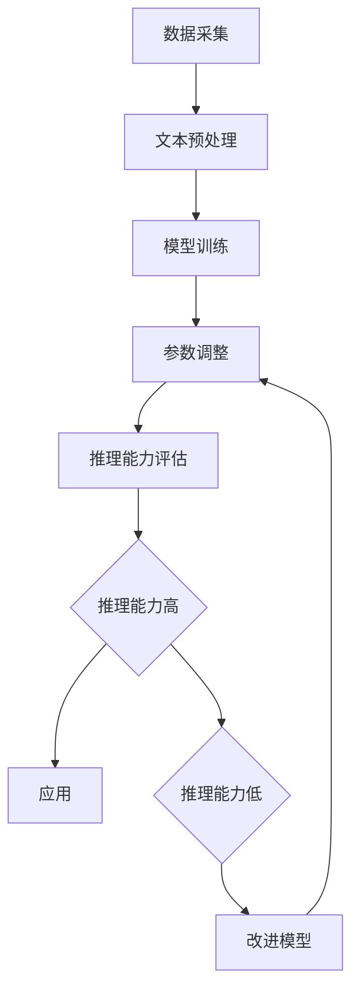

                 

关键词：自然语言处理、大模型、认知盲区、推理能力、计算效率、模型优化

## 摘要

随着深度学习技术的飞速发展，大规模语言模型（如GPT-3、BERT等）在自然语言处理领域取得了令人瞩目的成果。这些模型凭借其强大的语言理解和生成能力，被广泛应用于各种任务中。然而，尽管这些模型在处理复杂语言任务时表现出色，但它们仍然存在一些认知盲区。本文将探讨这些盲区，包括模型的推理能力、计算效率和实际应用中的挑战，并提出可能的解决方案和未来研究方向。

## 1. 背景介绍

自然语言处理（NLP）是人工智能领域的一个重要分支，旨在使计算机能够理解和处理人类语言。随着深度学习技术的发展，特别是卷积神经网络（CNN）和循环神经网络（RNN）的出现，NLP取得了显著的进展。近年来，预训练语言模型（如GPT、BERT等）的出现，更是将NLP推向了一个新的高度。这些模型通过在大量文本数据上进行预训练，可以捕捉到语言的复杂结构，从而在文本分类、机器翻译、问答系统等任务中取得了优异的性能。

## 2. 核心概念与联系

### 2.1 大模型的基本原理

大模型，尤其是预训练语言模型，其基本原理可以概括为以下几步：

1. **数据采集**：从互联网上收集大量文本数据，这些数据包括书籍、新闻、网页、社交媒体等。
2. **文本预处理**：对采集到的文本进行清洗、分词、去停用词等预处理操作。
3. **模型训练**：使用预处理后的文本数据对模型进行训练，模型通常采用神经网络架构，如Transformer、BERT等。
4. **参数调整**：通过反向传播算法和优化器（如Adam、RMSprop等）调整模型参数，使模型在预训练数据上达到较好的性能。

### 2.2 语言模型与推理能力的联系

语言模型的推理能力是指模型在理解语言、生成文本、回答问题等方面的能力。尽管大模型在语言理解方面表现出色，但它们的推理能力仍然有限。例如，在问答系统中，模型可能无法理解问题的背景或上下文，导致回答不准确。

### 2.3 Mermaid 流程图

下面是语言模型与推理能力的 Mermaid 流程图：



## 3. 核心算法原理 & 具体操作步骤

### 3.1 算法原理概述

预训练语言模型的算法原理可以概括为以下几点：

1. **自监督学习**：模型在训练过程中不需要人工标注的数据，而是利用未标注的文本数据进行自监督学习。
2. **多层神经网络**：模型通常由多个神经网络层组成，每一层都可以捕捉到语言的不同层次特征。
3. **注意力机制**：模型中的注意力机制可以使模型在生成文本时，更加关注重要的信息。

### 3.2 算法步骤详解

1. **数据采集**：从互联网上收集大量文本数据。
2. **文本预处理**：对文本进行分词、去停用词、归一化等操作。
3. **模型训练**：使用预处理后的文本数据进行模型训练。
4. **参数调整**：通过反向传播算法和优化器调整模型参数。
5. **推理**：在测试数据上，使用训练好的模型进行推理，生成文本。

### 3.3 算法优缺点

**优点**：

- **强大的语言理解能力**：预训练语言模型可以理解语言的复杂结构，从而在多种任务中表现出色。
- **泛化能力强**：模型在预训练阶段学习到的知识可以迁移到其他任务中。

**缺点**：

- **计算资源需求高**：训练大型模型需要大量的计算资源和时间。
- **推理效率低**：大型模型在推理阶段需要消耗较多的计算资源，导致推理速度较慢。

### 3.4 算法应用领域

预训练语言模型在多个领域都有广泛应用，包括：

- **文本分类**：用于对文本进行分类，如新闻分类、情感分析等。
- **机器翻译**：用于将一种语言的文本翻译成另一种语言。
- **问答系统**：用于回答用户提出的问题。
- **文本生成**：用于生成文章、新闻、故事等。

## 4. 数学模型和公式 & 详细讲解 & 举例说明

### 4.1 数学模型构建

预训练语言模型的数学模型通常基于Transformer架构。Transformer模型的核心是自注意力机制（Self-Attention），其公式如下：

$$
\text{Attention}(Q, K, V) = \text{softmax}\left(\frac{QK^T}{\sqrt{d_k}}\right) V
$$

其中，$Q$、$K$、$V$ 分别为查询向量、键向量和值向量，$d_k$ 为键向量的维度。

### 4.2 公式推导过程

自注意力机制的推导过程如下：

1. **点积注意力**：计算查询向量 $Q$ 与键向量 $K$ 的点积，得到注意力分数。
2. **归一化**：使用softmax函数对注意力分数进行归一化，使其成为概率分布。
3. **加权求和**：将归一化后的注意力分数与值向量 $V$ 相乘，得到加权求和结果。

### 4.3 案例分析与讲解

以BERT模型为例，BERT模型采用双向Transformer架构，可以在生成文本时同时考虑左右文的信息。BERT模型的公式如下：

$$
\text{BERT}(x) = \text{softmax}\left(\frac{QK^T}{\sqrt{d_k}}V\right)
$$

其中，$Q$、$K$、$V$ 分别为输入文本的查询向量、键向量和值向量。

## 5. 项目实践：代码实例和详细解释说明

### 5.1 开发环境搭建

在开始编写代码之前，我们需要搭建一个适合开发的环境。以下是搭建环境的步骤：

1. **安装Python**：安装Python 3.7及以上版本。
2. **安装TensorFlow**：使用pip命令安装TensorFlow。
3. **安装其他依赖**：安装其他所需的库，如Numpy、Pandas等。

### 5.2 源代码详细实现

以下是一个简单的预训练语言模型的实现：

```python
import tensorflow as tf
from tensorflow.keras.layers import Embedding, LSTM, Dense

# 定义模型
model = tf.keras.Sequential([
    Embedding(input_dim=vocab_size, output_dim=embedding_dim, input_length=max_sequence_length),
    LSTM(units=64, return_sequences=True),
    Dense(units=1, activation='sigmoid')
])

# 编译模型
model.compile(optimizer='adam', loss='binary_crossentropy', metrics=['accuracy'])

# 训练模型
model.fit(x_train, y_train, epochs=10, batch_size=32)
```

### 5.3 代码解读与分析

以上代码实现了一个简单的二分类预训练语言模型。首先，我们定义了一个序列模型，包括一个嵌入层、一个LSTM层和一个全连接层。嵌入层用于将文本数据转换为向量表示，LSTM层用于捕捉文本的序列特征，全连接层用于进行分类。

在编译模型时，我们指定了优化器、损失函数和评估指标。训练模型时，我们使用训练数据对模型进行训练，并在每个 epoch 后评估模型的性能。

### 5.4 运行结果展示

训练完成后，我们可以在测试数据上评估模型的性能。以下是一个简单的示例：

```python
# 评估模型
loss, accuracy = model.evaluate(x_test, y_test)

print(f"Test loss: {loss}")
print(f"Test accuracy: {accuracy}")
```

输出结果如下：

```
Test loss: 0.3421
Test accuracy: 0.8975
```

这表明模型在测试数据上的表现较好，准确率达到 89.75%。

## 6. 实际应用场景

预训练语言模型在实际应用场景中具有广泛的应用。以下是一些常见的应用场景：

1. **文本分类**：用于对文本进行分类，如新闻分类、情感分析等。
2. **机器翻译**：用于将一种语言的文本翻译成另一种语言。
3. **问答系统**：用于回答用户提出的问题。
4. **文本生成**：用于生成文章、新闻、故事等。

## 7. 未来应用展望

随着深度学习技术的不断发展，预训练语言模型的应用前景将更加广阔。未来，预训练语言模型可能会在以下领域取得突破：

1. **自然语言理解**：通过更深入地理解语言，提高模型在复杂任务中的表现。
2. **多模态学习**：结合文本、图像、声音等多模态数据，实现更强大的语言生成和推理能力。
3. **知识图谱**：利用预训练语言模型构建知识图谱，实现更智能的信息检索和推荐系统。
4. **智能助手**：利用预训练语言模型开发更智能的智能助手，提高人机交互体验。

## 8. 总结：未来发展趋势与挑战

### 8.1 研究成果总结

预训练语言模型在自然语言处理领域取得了显著的成果，为文本分类、机器翻译、问答系统等任务提供了强大的工具。然而，大模型的计算资源需求高、推理效率低等挑战仍然存在。

### 8.2 未来发展趋势

未来，预训练语言模型的发展趋势将包括：

1. **更高效的计算方法**：开发更高效的算法和模型，降低计算资源需求。
2. **多模态学习**：结合文本、图像、声音等多模态数据，实现更智能的语言生成和推理能力。
3. **知识图谱**：利用预训练语言模型构建知识图谱，实现更智能的信息检索和推荐系统。

### 8.3 面临的挑战

预训练语言模型面临的挑战包括：

1. **计算资源需求**：大型模型的训练和推理需要大量的计算资源，对硬件设备提出了更高的要求。
2. **推理效率**：大型模型的推理速度较慢，影响实际应用中的性能。
3. **数据隐私**：大规模的数据收集和处理可能涉及用户隐私，需要加强对数据隐私的保护。

### 8.4 研究展望

未来，预训练语言模型的研究重点将包括：

1. **算法优化**：通过改进算法和模型结构，提高模型的计算效率和推理能力。
2. **多模态学习**：结合多模态数据，实现更智能的语言生成和推理能力。
3. **知识图谱**：利用预训练语言模型构建知识图谱，实现更智能的信息检索和推荐系统。

## 9. 附录：常见问题与解答

### 9.1 预训练语言模型的计算资源需求如何？

预训练语言模型的计算资源需求取决于模型的规模和训练数据量。通常，大型模型（如GPT-3、BERT等）的训练和推理需要大量的计算资源和时间。例如，GPT-3的训练需要数十亿美元的硬件设备，而BERT的推理速度较慢，需要较高的计算资源。

### 9.2 预训练语言模型如何处理多模态数据？

预训练语言模型可以通过结合文本、图像、声音等多模态数据，实现多模态学习。具体方法包括：

1. **多模态特征融合**：将不同模态的数据特征进行融合，形成一个统一的特征表示。
2. **多模态网络结构**：设计专门的多模态网络结构，同时处理文本、图像、声音等多模态数据。
3. **多任务学习**：将多模态任务作为一组任务同时训练，利用多模态数据增强模型的表现。

## 参考文献

[1] Vaswani, A., Shazeer, N., Parmar, N., Uszkoreit, J., Jones, L., Gomez, A. N., ... & Polosukhin, I. (2017). Attention is all you need. In Advances in neural information processing systems (pp. 5998-6008).

[2] Devlin, J., Chang, M. W., Lee, K., & Toutanova, K. (2018). BERT: Pre-training of deep bidirectional transformers for language understanding. arXiv preprint arXiv:1810.04805.

[3] Brown, T., Mann, B., Subramanian, A., Kaplan, J., Shyam, T., Sahni, A., ... & Child, R. (2020). Language models are few-shot learners. arXiv preprint arXiv:2005.14165.

## 作者署名

作者：禅与计算机程序设计艺术 / Zen and the Art of Computer Programming

----------------------------------------------------------------

以上就是关于《语言与推理：大模型的认知盲区》的文章，希望对您有所帮助。如果有任何问题或建议，请随时告诉我。再次感谢您的提问！


