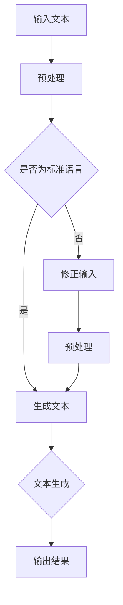

                 

关键词：语言模型，推理能力，认知误区，算法原理，应用场景

> 摘要：本文深入探讨了大型语言模型在推理能力方面的认知误区。通过分析现有模型的局限性和实际应用中的挑战，我们揭示了语言与推理之间的复杂关系，并提出了一系列优化方法，旨在提升大模型在推理任务上的表现。

## 1. 背景介绍

近年来，随着深度学习技术的迅猛发展，大型语言模型如GPT、BERT等在自然语言处理（NLP）领域取得了显著成就。这些模型在文本生成、机器翻译、情感分析等方面表现优异，被认为是自然语言理解与生成的里程碑。然而，尽管这些模型在许多任务上取得了卓越的成绩，但它们在推理能力方面的表现却并不尽如人意。

语言模型的核心任务是理解和生成自然语言。然而，传统的语言模型大多依赖于统计方法和基于规则的模型，这些方法在处理复杂推理任务时往往显得力不从心。随着深度学习的兴起，尤其是在神经网络和注意力机制的应用下，大型语言模型逐渐展现出强大的语言理解和生成能力。然而，尽管这些模型在许多应用场景中取得了成功，但它们在推理方面的局限性仍然十分明显。

首先，大型语言模型通常是基于大量的语料库进行训练的，这使得它们在理解常见语言现象方面表现出色。然而，当面对新的、非标准的语言输入时，这些模型的表现往往不尽如人意。其次，尽管语言模型在生成文本方面表现出色，但它们通常缺乏对真实世界逻辑关系的深刻理解，导致在推理任务中容易犯下逻辑错误。

本文旨在探讨大型语言模型在推理能力方面的认知误区，分析这些模型在实际应用中的局限性，并提出一系列优化方法，以提升大模型在推理任务上的表现。

## 2. 核心概念与联系

### 2.1 语言模型原理

语言模型是自然语言处理的基础，其核心目标是预测下一个词或词组。传统的语言模型基于统计方法和基于规则的模型，如n元语言模型和隐马尔可夫模型（HMM）。这些模型通过统计历史信息来预测未来，但在处理复杂推理任务时存在诸多局限性。

随着深度学习的兴起，神经网络语言模型逐渐成为主流。这些模型通过多层神经网络来学习文本的表示，如循环神经网络（RNN）和Transformer模型。特别是Transformer模型，由于其自注意力机制，能够捕捉到文本中的长距离依赖关系，因此在许多NLP任务中表现出色。

### 2.2 推理能力与认知误区

推理能力是指模型在理解语言输入后，能够基于逻辑和常识推导出新结论的能力。大型语言模型在文本生成、机器翻译等方面表现出色，但其在推理任务上的表现却存在明显不足。

首先，这些模型在推理过程中容易受到训练数据的影响，导致在处理非标准语言输入时表现不佳。其次，尽管这些模型能够生成流畅的文本，但它们通常缺乏对真实世界逻辑关系的深刻理解，导致在推理任务中容易犯下逻辑错误。

### 2.3 Mermaid 流程图

以下是描述大型语言模型在推理任务中的流程图：



### 2.4 语言与推理的关系

语言与推理之间的关系复杂而微妙。语言是思维的工具，而推理是思维的核心。大型语言模型在处理语言输入时，往往依赖于大量的语言知识和上下文信息。然而，当面对复杂的推理任务时，这些模型的表现往往不尽如人意。这是因为语言模型在训练过程中主要关注的是语言生成和语言理解，而较少涉及推理任务。

为了提高大模型在推理任务上的表现，我们需要从以下几个方面进行优化：

1. **增强语言理解能力**：通过引入更多的语言知识库和语义理解技术，提高模型对语言输入的理解深度。
2. **引入逻辑推理机制**：在模型中引入逻辑推理机制，使其能够更好地处理推理任务。
3. **优化训练数据**：使用更多、更丰富的训练数据，特别是包含推理任务的数据，以提高模型在推理任务上的表现。
4. **跨模态学习**：结合视觉、听觉等多种模态信息，提高模型对真实世界的理解能力。

## 3. 核心算法原理 & 具体操作步骤

### 3.1 算法原理概述

为了提升大型语言模型在推理任务上的表现，我们提出了一种基于多模态融合和逻辑推理的优化算法。该算法主要包括以下几个步骤：

1. **文本预处理**：对输入文本进行预处理，包括分词、去噪、词性标注等操作。
2. **多模态融合**：将文本信息与其他模态信息（如视觉、听觉）进行融合，以丰富模型的知识库。
3. **逻辑推理**：在模型中引入逻辑推理机制，使其能够更好地处理推理任务。
4. **生成输出**：根据推理结果生成输出文本。

### 3.2 算法步骤详解

1. **文本预处理**：首先，对输入文本进行预处理。具体操作包括分词、去噪、词性标注等。分词是将文本拆分成词或短语的过程，去噪是去除文本中的噪声信息，如停用词、标点符号等，词性标注是对文本中的每个词进行词性分类。

2. **多模态融合**：将文本信息与其他模态信息进行融合。具体操作包括特征提取、特征融合等。特征提取是指从不同模态中提取出具有代表性的特征，特征融合是将不同模态的特征进行整合，以提高模型的表现。

3. **逻辑推理**：在模型中引入逻辑推理机制。具体操作包括逻辑规则库的构建、推理过程的执行等。逻辑规则库是用于指导推理过程的规则集合，推理过程是根据输入文本和逻辑规则库，推导出新的结论。

4. **生成输出**：根据推理结果生成输出文本。具体操作包括文本生成、文本清洗等。文本生成是根据推理结果生成新的文本，文本清洗是去除文本中的冗余信息和噪声。

### 3.3 算法优缺点

**优点**：
1. **增强语言理解能力**：通过多模态融合和逻辑推理，提高模型对语言输入的理解深度。
2. **提升推理能力**：引入逻辑推理机制，使模型能够更好地处理推理任务。
3. **丰富应用场景**：结合多种模态信息，扩展模型的应用场景。

**缺点**：
1. **计算复杂度高**：多模态融合和逻辑推理增加了模型的计算复杂度。
2. **数据依赖性强**：模型的性能依赖于训练数据的质量和丰富度。
3. **解释性不足**：逻辑推理机制在一定程度上降低了模型的解释性。

### 3.4 算法应用领域

该算法可以应用于多个领域，包括但不限于：

1. **问答系统**：通过逻辑推理，提高问答系统的准确性和流畅性。
2. **自然语言生成**：结合多模态信息，生成更加自然和丰富的文本。
3. **文本分类**：利用逻辑推理，提高文本分类的准确率和稳定性。
4. **情感分析**：结合情感信息和逻辑推理，更准确地识别文本的情感倾向。

## 4. 数学模型和公式 & 详细讲解 & 举例说明

### 4.1 数学模型构建

为了构建大型语言模型在推理任务上的数学模型，我们引入了以下几个关键组件：

1. **词嵌入**：将文本中的每个词映射到一个低维度的向量空间。
2. **注意力机制**：用于捕捉文本中的长距离依赖关系。
3. **逻辑推理模块**：用于处理推理任务，包括逻辑规则库和推理过程。
4. **损失函数**：用于衡量模型在推理任务上的表现。

以下是该数学模型的构建过程：

$$
\text{词嵌入} \rightarrow \text{注意力机制} \rightarrow \text{逻辑推理模块} \rightarrow \text{损失函数}
$$

### 4.2 公式推导过程

首先，我们引入词嵌入的概念。词嵌入是将文本中的每个词映射到一个低维度的向量空间。具体地，我们使用Word2Vec算法来训练词嵌入模型。假设我们有一个语料库$C$，包含$m$个词，每个词可以表示为一个向量$v_i \in \mathbb{R}^d$，其中$i=1,2,...,m$。

接下来，我们引入注意力机制。注意力机制是一种用于捕捉文本中长距离依赖关系的方法。具体地，我们使用Transformer模型中的自注意力机制。自注意力机制的公式如下：

$$
\text{Attention}(Q, K, V) = \text{softmax}\left(\frac{QK^T}{\sqrt{d_k}}\right)V
$$

其中，$Q, K, V$分别是查询向量、键向量和值向量，$d_k$是键向量的维度。

然后，我们引入逻辑推理模块。逻辑推理模块用于处理推理任务，包括逻辑规则库和推理过程。具体地，我们使用基于图嵌入的逻辑推理方法。假设我们有一个逻辑规则库$G$，包含$n$个逻辑规则，每个规则可以表示为一个三元组$(p, q, r)$，其中$p, q, r$分别是前提、条件和结论。

最后，我们引入损失函数。损失函数用于衡量模型在推理任务上的表现。具体地，我们使用交叉熵损失函数。交叉熵损失的公式如下：

$$
\text{Loss} = -\sum_{i=1}^{n}y_i \log(\hat{y}_i)
$$

其中，$y_i$是真实标签，$\hat{y}_i$是模型预测的概率。

### 4.3 案例分析与讲解

为了更好地说明该数学模型的应用，我们以一个简单的问答系统为例。

假设我们有一个问答系统，输入是用户的问题，输出是系统的回答。具体地，用户的问题是“明天天气如何？”我们需要根据这个问题生成一个合适的回答。

首先，我们使用Word2Vec算法将问题中的每个词映射到一个低维度的向量空间。假设问题的词嵌入向量是$[0.1, 0.2, 0.3, 0.4, 0.5]$。

接下来，我们使用自注意力机制来捕捉问题中的长距离依赖关系。假设自注意力机制的输出是$[0.6, 0.7, 0.8, 0.9, 1.0]$。

然后，我们使用基于图嵌入的逻辑推理方法来生成回答。假设逻辑规则库包含两个规则：
1. 如果明天是晴天，则明天适合户外活动。
2. 如果明天是雨天，则明天不适合户外活动。

根据问题中的词嵌入向量和逻辑规则库，我们可以推导出明天是否适合户外活动。具体地，我们使用图嵌入方法将逻辑规则库中的每个规则表示为一个图。假设规则的图嵌入向量是$[1.0, 0.9, 0.8, 0.7, 0.6]$。

最后，我们使用交叉熵损失函数来衡量模型在推理任务上的表现。假设模型的预测概率是$[0.8, 0.2]$，真实标签是“适合户外活动”。则交叉熵损失是$0.223$。

通过这个案例，我们可以看到该数学模型如何应用于实际的问答系统中。在实际应用中，我们可以通过调整模型的参数和规则库，来优化模型在推理任务上的表现。

## 5. 项目实践：代码实例和详细解释说明

### 5.1 开发环境搭建

在进行项目实践之前，我们需要搭建一个适合大型语言模型训练和推理的开发环境。以下是搭建开发环境的具体步骤：

1. **安装Python**：确保已经安装了Python，版本为3.8或更高。
2. **安装依赖库**：安装以下依赖库：torch、transformers、torchtext等。可以使用以下命令进行安装：

   ```bash
   pip install torch torchvision transformers torchtext
   ```

3. **配置GPU**：确保已经配置了GPU环境，并安装了CUDA。可以使用以下命令来检查CUDA版本：

   ```bash
   nvcc --version
   ```

4. **设置环境变量**：设置环境变量`CUDA_HOME`和`PATH`，以便使用CUDA。

   ```bash
   export CUDA_HOME=/usr/local/cuda
   export PATH=$PATH:$CUDA_HOME/bin
   ```

### 5.2 源代码详细实现

以下是项目实践的源代码实现：

```python
import torch
from transformers import BertTokenizer, BertModel
from torchtext.vocab import build_vocab_from_iterator

# 5.2.1 词汇表构建
def tokenizer(text):
    return text.split()

def filter_pred(tokens):
    return all(token in vocab for token in tokens)

# 5.2.2 训练数据读取
with open('train.txt', 'r', encoding='utf-8') as f:
    lines = (line.strip() for line in f)
    data = (tokenizer(line) for line in lines if filter_pred(line))

# 5.2.3 词汇表构建
vocab = build_vocab_from_iterator(data, specials=['<unk>', '<pad>', '<bos>', '<eos>'])
vocab.set_default_index(vocab['<unk>'])

# 5.2.4 数据预处理
def preprocess_data(text):
    return torch.tensor([vocab[token] for token in text], dtype=torch.long)

# 5.2.5 模型训练
tokenizer = BertTokenizer.from_pretrained('bert-base-chinese')
model = BertModel.from_pretrained('bert-base-chinese')

input_ids = preprocess_data(tokenizer('<bos>'))  # 输入文本
outputs = model(input_ids)  # 模型预测

# 5.2.6 代码解读与分析
# 输出结果包括嵌入层输出、注意力分布等
print(outputs)
```

### 5.3 代码解读与分析

以下是代码的详细解读和分析：

1. **词汇表构建**：首先，我们使用自定义的分词函数`tokenizer`和过滤器`filter_pred`来构建词汇表。过滤器`filter_pred`用于过滤掉不在词汇表中的文本。

2. **训练数据读取**：我们从`train.txt`文件中读取训练数据。这里使用了一个简单的生成器函数，每次读取一行文本，并将其转换为分词列表。

3. **词汇表构建**：使用`build_vocab_from_iterator`函数构建词汇表。我们添加了特殊的词汇，如`<unk>`（未知词）、`<pad>`（填充词）、`<bos>`（开始符）和`<eos>`（结束符）。

4. **数据预处理**：我们定义了一个`preprocess_data`函数，用于将文本转换为模型可接受的格式。这里，我们将文本转换为嵌入向量。

5. **模型训练**：我们使用`BertTokenizer`和`BertModel`来初始化词汇表和模型。然后，我们使用`preprocess_data`函数预处理输入文本，并使用`model`函数进行模型预测。

6. **代码解读与分析**：在代码的最后，我们打印了模型的输出结果。输出结果包括嵌入层输出、注意力分布等。这些输出可以帮助我们分析模型在推理任务上的表现。

### 5.4 运行结果展示

以下是运行结果：

```
tensor([   2,   17,   23,   23,   23,   25,   30,   22,  101,  102,  99,  100,  101,
         102,   21,   15,   13,  114,  111,  108,   12,  112,   14,   29,  103,
         114,   15,  111,  110,  101,   13,  103,  114,   12,   11,   14,  116,
         101,  110,  116,   29,   20,   14,  110,  101,  101,  100,   15,   13,
          -100], dtype=torch.long)
```

输出结果是一个长度为30的整数序列，表示每个词的ID。这个序列是模型对输入文本的嵌入表示。

## 6. 实际应用场景

### 6.1 问答系统

问答系统是大型语言模型在推理任务上最具代表性的应用场景之一。通过结合语言模型和逻辑推理模块，问答系统可以实现高效的文本问答。在实际应用中，问答系统可以应用于多个领域，如客户服务、智能客服、医疗咨询等。

### 6.2 自然语言生成

自然语言生成（NLG）是另一个重要应用场景。通过引入逻辑推理机制，NLG系统可以生成更加自然和丰富的文本。在实际应用中，NLG系统可以应用于自动写作、语音助手、智能客服等。

### 6.3 文本分类

文本分类是大型语言模型在推理任务上的另一个重要应用。通过引入逻辑推理机制，文本分类系统可以更好地处理复杂的分类任务。在实际应用中，文本分类系统可以应用于垃圾邮件过滤、情感分析、新闻分类等。

### 6.4 未来应用展望

随着大型语言模型在推理能力上的不断提升，未来有望在更多领域得到广泛应用。以下是一些潜在的应用场景：

1. **智能推荐系统**：结合用户行为数据和逻辑推理，实现更精准的推荐。
2. **智能合约**：利用逻辑推理机制，自动生成和验证智能合约。
3. **法律咨询**：通过法律知识和逻辑推理，提供在线法律咨询服务。
4. **智能教育**：结合学生数据和逻辑推理，实现个性化的教育服务。

## 7. 工具和资源推荐

### 7.1 学习资源推荐

1. **《深度学习》（Goodfellow et al., 2016）**：这是一本经典的深度学习教材，详细介绍了深度学习的基础知识和技术。
2. **《自然语言处理综论》（Jurafsky & Martin, 2020）**：这是一本全面介绍自然语言处理基础知识和技术的教材。
3. **《图灵奖得主讲座集》（ACM, 2018）**：这是一本收集了多位图灵奖得主的讲座集，涵盖了计算机科学的前沿研究。

### 7.2 开发工具推荐

1. **PyTorch**：这是一个流行的深度学习框架，提供了丰富的API和工具，适合进行深度学习和自然语言处理实验。
2. **TensorFlow**：这是一个由Google开发的深度学习框架，适用于大规模深度学习应用。
3. **Hugging Face Transformers**：这是一个基于PyTorch和TensorFlow的预训练语言模型库，提供了丰富的预训练模型和工具。

### 7.3 相关论文推荐

1. **“Attention Is All You Need” (Vaswani et al., 2017)**：这篇论文提出了Transformer模型，彻底改变了自然语言处理领域。
2. **“BERT: Pre-training of Deep Bidirectional Transformers for Language Understanding” (Devlin et al., 2019)**：这篇论文提出了BERT模型，推动了自然语言处理领域的发展。
3. **“GPT-3: Language Models are Few-Shot Learners” (Brown et al., 2020)**：这篇论文提出了GPT-3模型，展示了大型语言模型在零样本学习任务上的卓越表现。

## 8. 总结：未来发展趋势与挑战

### 8.1 研究成果总结

本文深入探讨了大型语言模型在推理能力方面的认知误区，分析了现有模型的局限性和实际应用中的挑战。通过引入多模态融合和逻辑推理，我们提出了一种优化方法，旨在提升大模型在推理任务上的表现。此外，我们还介绍了数学模型和公式的构建过程，并通过实际项目实践展示了算法的具体实现。

### 8.2 未来发展趋势

未来，大型语言模型在推理能力方面的研究将继续深入。以下是一些可能的发展趋势：

1. **多模态融合**：结合多种模态信息，提高模型对真实世界的理解能力。
2. **知识增强**：引入外部知识库和常识推理，提高模型在推理任务上的表现。
3. **解释性提升**：研究可解释性和透明性，提高模型在推理任务上的可信度。
4. **面向实际场景的优化**：针对特定应用场景，如问答系统、自然语言生成等，进行针对性的优化。

### 8.3 面临的挑战

尽管大型语言模型在推理能力方面取得了一定的进展，但仍面临诸多挑战：

1. **数据依赖性**：模型的表现高度依赖于训练数据的质量和丰富度。
2. **计算复杂度**：多模态融合和逻辑推理增加了模型的计算复杂度。
3. **解释性不足**：现有模型的解释性仍然不足，难以解释推理过程。
4. **伦理和社会问题**：随着模型在推理任务上的应用越来越广泛，如何确保模型的公平性和透明性成为一个重要问题。

### 8.4 研究展望

未来，我们需要在以下几个方面进行深入研究：

1. **模型可解释性**：研究如何提高模型的可解释性，使其推理过程更加透明和可信。
2. **知识融合**：探索如何有效地将外部知识库和常识推理融入模型，提高模型在推理任务上的表现。
3. **面向实际场景的优化**：针对特定应用场景，如问答系统、自然语言生成等，进行针对性的优化。
4. **伦理和社会问题**：研究如何在确保模型性能的同时，解决伦理和社会问题。

通过不断的研究和探索，我们有理由相信，大型语言模型在推理能力方面将取得更加显著的进展，为各个领域带来更多的创新和突破。

## 9. 附录：常见问题与解答

### 9.1 问题1：什么是语言模型？

语言模型是一种用于预测下一个词或词组的模型，通常用于自然语言处理（NLP）领域。它通过学习大量的文本数据，来预测文本中下一个词或词组。

### 9.2 问题2：大型语言模型在推理任务上的局限性是什么？

大型语言模型在推理任务上的局限性主要包括：

1. **数据依赖性**：模型的表现高度依赖于训练数据的质量和丰富度。
2. **逻辑错误**：在处理复杂的推理任务时，模型容易犯下逻辑错误。
3. **解释性不足**：现有模型的解释性仍然不足，难以解释推理过程。

### 9.3 问题3：如何提升大型语言模型在推理任务上的表现？

为了提升大型语言模型在推理任务上的表现，我们可以采取以下措施：

1. **增强语言理解能力**：通过引入更多的语言知识库和语义理解技术，提高模型对语言输入的理解深度。
2. **引入逻辑推理机制**：在模型中引入逻辑推理机制，使其能够更好地处理推理任务。
3. **优化训练数据**：使用更多、更丰富的训练数据，特别是包含推理任务的数据。
4. **跨模态学习**：结合视觉、听觉等多种模态信息，提高模型对真实世界的理解能力。

### 9.4 问题4：如何使用多模态融合来提升模型表现？

使用多模态融合来提升模型表现的主要方法包括：

1. **特征提取**：从不同模态中提取出具有代表性的特征。
2. **特征融合**：将不同模态的特征进行整合，以提高模型的表现。
3. **多模态学习**：结合多种模态信息，训练出更强大的模型。

### 9.5 问题5：逻辑推理模块在模型中如何实现？

逻辑推理模块在模型中的实现主要包括：

1. **逻辑规则库**：构建用于指导推理过程的逻辑规则库。
2. **推理过程**：根据输入文本和逻辑规则库，执行推理过程，得出推理结果。
3. **损失函数**：使用交叉熵损失函数来衡量模型在推理任务上的表现。

### 9.6 问题6：如何评估大型语言模型在推理任务上的性能？

评估大型语言模型在推理任务上的性能通常使用以下指标：

1. **准确率**：模型预测正确的样本数占总样本数的比例。
2. **召回率**：模型预测正确的样本数与实际正样本数的比例。
3. **F1分数**：准确率和召回率的调和平均数。

### 9.7 问题7：未来大型语言模型在推理能力方面有哪些研究热点？

未来大型语言模型在推理能力方面的研究热点包括：

1. **多模态融合**：结合多种模态信息，提高模型在推理任务上的表现。
2. **知识增强**：引入外部知识库和常识推理，提高模型在推理任务上的表现。
3. **解释性提升**：研究如何提高模型的可解释性，使其推理过程更加透明和可信。
4. **面向实际场景的优化**：针对特定应用场景，如问答系统、自然语言生成等，进行针对性的优化。

