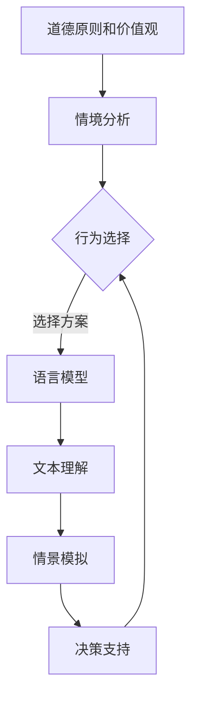

                 

关键词：自然语言处理、道德哲学、伦理决策、人工智能、机器学习

## 摘要

本文旨在探讨自然语言处理（NLP）领域的语言模型在道德决策方面的能力。随着人工智能（AI）技术的不断进步，语言模型的应用场景日益广泛，它们在处理日常交流、信息检索、文本生成等任务中表现出色。然而，语言模型在处理涉及伦理和道德问题时，是否具备足够的决策能力，以及如何确保其输出的道德性，成为了一个亟待解决的问题。本文首先介绍了语言模型的基本原理和应用，随后分析了道德决策的定义和复杂性。接着，本文探讨了语言模型在道德决策方面的能力，包括其局限性、面临的挑战以及潜在的解决方案。最后，本文展望了未来在道德决策能力方面的发展趋势，提出了进一步研究的方向。

## 1. 背景介绍

### 自然语言处理（NLP）

自然语言处理是人工智能（AI）领域的一个重要分支，旨在使计算机能够理解和处理人类语言。自20世纪50年代起，NLP研究经历了多个阶段，从早期的规则驱动方法到基于统计模型的转变，再到近年来深度学习技术的广泛应用。NLP的应用领域涵盖了自然语言理解、自然语言生成、机器翻译、情感分析、文本分类、信息检索等多个方面。

语言模型作为NLP的核心组件，是生成和解析文本的基础。传统的NLP任务，如文本分类和机器翻译，通常依赖于统计模型和规则系统。然而，随着深度学习技术的发展，基于神经网络的端到端模型在NLP任务中取得了显著的成果。例如，Transformer模型和BERT模型等已经广泛应用于文本生成、机器翻译、问答系统等领域。

### 道德哲学

道德哲学是研究道德原则、道德判断和道德行为的学科。道德哲学关注的是如何区分对错、善与恶，以及如何为行为和决策提供伦理基础。道德哲学的研究内容包括伦理理论、道德心理学、道德伦理学等。

伦理决策是一个复杂的过程，涉及价值观、道德原则和决策环境。伦理决策通常需要在冲突的利益和情境中进行权衡，例如医疗伦理、商业伦理、环境伦理等。在人工智能领域，道德哲学的重要性日益凸显，因为AI系统在处理实际问题时可能会遇到伦理困境。

### 语言模型在道德决策中的应用

随着NLP技术的发展，语言模型在道德决策中的应用也逐渐成为一个研究热点。例如，在法律文书生成、医疗决策支持、金融风险评估等场景中，语言模型可以帮助人类更好地理解和处理涉及伦理和道德问题的文本数据。然而，语言模型在道德决策方面的能力仍然受到诸多限制。

## 2. 核心概念与联系

### 道德决策的定义

道德决策是指根据伦理原则和价值观，在特定情境下选择最合适的行动方案。道德决策通常涉及以下几个方面：

1. **道德原则和价值观**：道德决策的基础是道德原则和价值观，这些原则和价值观决定了决策者如何看待对错、善恶。
2. **情境分析**：道德决策需要在特定的情境中进行，这包括决策者面临的实际问题和环境。
3. **行为选择**：道德决策的核心是在多个可能的行动方案中选择最合适的方案。

### 语言模型与道德决策的联系

语言模型在道德决策中的作用主要体现在以下几个方面：

1. **文本理解**：语言模型可以帮助决策者更好地理解涉及伦理和道德问题的文本，从而为决策提供更全面的信息。
2. **情景模拟**：通过文本生成和模拟，语言模型可以为决策者提供不同的情境假设，帮助其评估不同决策方案的可能结果。
3. **决策支持**：语言模型可以辅助决策者生成和筛选道德决策相关的信息，提供决策建议。

### Mermaid 流程图

以下是一个简单的Mermaid流程图，展示了道德决策的基本过程以及语言模型在其中的作用。



## 3. 核心算法原理 & 具体操作步骤

### 算法原理概述

道德决策语言模型的核心在于如何将伦理原则和价值观融入语言处理过程中。该模型基于深度学习技术，主要包括以下关键组成部分：

1. **词嵌入层**：将文本中的词汇映射为高维向量表示。
2. **编码器层**：对输入文本进行编码，提取文本的语义信息。
3. **解码器层**：生成符合伦理原则的文本输出。
4. **伦理模块**：用于确保文本输出符合伦理规范。

### 算法步骤详解

#### 步骤1：词嵌入层

词嵌入层将文本中的词汇映射为高维向量表示。这一步骤通常使用预训练的词嵌入模型（如Word2Vec、GloVe等）或基于上下文的词嵌入模型（如BERT、GPT等）。词嵌入层的主要目的是将词汇转换为机器可以理解的向量表示。

#### 步骤2：编码器层

编码器层对输入文本进行编码，提取文本的语义信息。这一步骤通常使用深度神经网络（如Transformer、LSTM等）进行。编码器层的主要目的是捕捉文本的上下文信息，从而为后续的文本生成提供基础。

#### 步骤3：伦理模块

伦理模块是道德决策语言模型的核心部分。它负责将伦理原则和价值观融入文本生成过程中。伦理模块通常包括以下几个关键组件：

1. **伦理规则库**：存储一系列伦理规则，用于评估文本的道德性。
2. **规则匹配器**：用于匹配输入文本与伦理规则库中的规则。
3. **伦理评估器**：根据规则匹配结果，对文本的道德性进行评估。

#### 步骤4：解码器层

解码器层生成符合伦理原则的文本输出。这一步骤通常使用与编码器相同的深度神经网络结构。解码器层的主要目的是将编码器提取的语义信息转换为符合伦理规范的文本输出。

### 算法优缺点

#### 优点

1. **灵活性**：道德决策语言模型可以根据不同的伦理原则和价值观进行定制，从而适应不同的应用场景。
2. **高效性**：基于深度学习技术，语言模型在处理大规模文本数据时表现出较高的效率。
3. **多样性**：通过生成和模拟不同的情境，语言模型可以提供多样化的决策方案。

#### 缺点

1. **道德性保证**：尽管伦理模块试图确保文本输出的道德性，但在某些复杂情境下，仍然可能存在道德漏洞。
2. **规则依赖性**：道德决策语言模型依赖于伦理规则库，这可能导致模型在规则缺失或规则不明确的情况下表现不佳。
3. **数据质量**：语言模型的效果在很大程度上取决于训练数据的质量，这可能会影响模型的道德决策能力。

### 算法应用领域

道德决策语言模型可以应用于多个领域，包括但不限于：

1. **法律文书生成**：辅助律师和法官生成符合伦理规范的判决文书。
2. **医疗决策支持**：为医生提供基于伦理原则的医疗建议。
3. **金融风险评估**：辅助金融分析师进行道德风险分析和决策。
4. **公共管理**：为政策制定者和政府官员提供基于伦理原则的政策建议。

## 4. 数学模型和公式 & 详细讲解 & 举例说明

### 数学模型构建

道德决策语言模型的数学模型主要包括词嵌入层、编码器层、解码器层和伦理模块。以下分别介绍各个层级的数学模型。

#### 4.1 词嵌入层

词嵌入层的核心是一个高维向量空间，其中每个词汇对应一个向量。词嵌入通常使用以下数学模型：

$$
\text{vec}(w) = \text{embed}(\text{word})
$$

其中，$\text{vec}(w)$ 表示词汇 $w$ 的向量表示，$\text{embed}(\text{word})$ 表示对词汇 $w$ 的嵌入操作。

#### 4.2 编码器层

编码器层使用深度神经网络（如Transformer、LSTM等）对输入文本进行编码，提取文本的语义信息。以下是一个简单的编码器层的数学模型：

$$
\text{h} = \text{Encoder}(\text{vec}(w_1), \text{vec}(w_2), \ldots, \text{vec}(w_n))
$$

其中，$h$ 表示编码后的文本表示，$\text{Encoder}$ 表示编码器网络，$w_1, w_2, \ldots, w_n$ 表示输入文本的词汇。

#### 4.3 解码器层

解码器层使用与编码器相同的深度神经网络结构，将编码后的文本表示转换为符合伦理规范的文本输出。以下是一个简单的解码器层的数学模型：

$$
\text{output} = \text{Decoder}(\text{h}, \text{vec}(w_1'), \text{vec}(w_2'), \ldots, \text{vec}(w_m'))
$$

其中，$output$ 表示生成的文本输出，$\text{Decoder}$ 表示解码器网络，$w_1', w_2', \ldots, w_m'$ 表示生成文本的词汇。

#### 4.4 伦理模块

伦理模块的核心是伦理规则库和伦理评估器。以下是一个简单的伦理模块的数学模型：

$$
\text{ethical\_score} = \text{EthicalModule}(\text{output}, \text{ethics\_rules})
$$

其中，$\text{ethical\_score}$ 表示文本输出的道德评分，$\text{EthicalModule}$ 表示伦理模块，$\text{output}$ 表示文本输出，$\text{ethics\_rules}$ 表示伦理规则库。

### 公式推导过程

以下是道德决策语言模型中的一些关键公式的推导过程。

#### 4.1 词嵌入层

词嵌入层的推导过程主要涉及词嵌入模型的训练。以下是一个简单的Word2Vec模型的推导过程：

$$
\begin{aligned}
    \nabla \text{loss} &= \nabla \text{loss} \cdot \text{softmax}(\text{vec}(w) - \text{embed}(\text{context})) \\
    \nabla \text{embed} &= \nabla \text{embed} \cdot \text{softmax}(\text{vec}(w) - \text{embed}(\text{context})) \\
    &= \nabla \text{embed} \cdot \frac{\exp(\text{vec}(w))}{\sum_{i=1}^{N} \exp(\text{vec}(w_i))}
\end{aligned}
$$

其中，$\text{loss}$ 表示损失函数，$\text{embed}(\text{context})$ 表示上下文词汇的嵌入向量，$\text{softmax}(\text{vec}(w) - \text{embed}(\text{context}))$ 表示词嵌入向量的softmax分布。

#### 4.2 编码器层

编码器层的推导过程主要涉及编码器网络的训练。以下是一个简单的Transformer模型的推导过程：

$$
\begin{aligned}
    \nabla \text{loss} &= \nabla \text{loss} \cdot \text{softmax}(\text{h} - \text{h}_{\text{context}}) \\
    \nabla \text{h} &= \nabla \text{h} \cdot \text{softmax}(\text{h} - \text{h}_{\text{context}}) \\
    &= \nabla \text{h} \cdot \frac{\exp(\text{h})}{\sum_{i=1}^{N} \exp(\text{h}_i)}
\end{aligned}
$$

其中，$h$ 表示编码后的文本表示，$\text{h}_{\text{context}}$ 表示上下文编码后的文本表示，$\text{softmax}(\text{h} - \text{h}_{\text{context}})$ 表示编码后文本表示的softmax分布。

#### 4.3 解码器层

解码器层的推导过程主要涉及解码器网络的训练。以下是一个简单的Transformer模型的推导过程：

$$
\begin{aligned}
    \nabla \text{loss} &= \nabla \text{loss} \cdot \text{softmax}(\text{output} - \text{target}) \\
    \nabla \text{output} &= \nabla \text{output} \cdot \text{softmax}(\text{output} - \text{target}) \\
    &= \nabla \text{output} \cdot \frac{\exp(\text{output})}{\sum_{i=1}^{N} \exp(\text{output}_i)}
\end{aligned}
$$

其中，$output$ 表示生成的文本输出，$\text{target}$ 表示目标文本，$\text{softmax}(\text{output} - \text{target})$ 表示生成文本输出的softmax分布。

#### 4.4 伦理模块

伦理模块的推导过程主要涉及伦理评估器的训练。以下是一个简单的伦理评估器的推导过程：

$$
\begin{aligned}
    \nabla \text{ethical\_score} &= \nabla \text{ethical\_score} \cdot \text{softmax}(\text{output} - \text{ethics\_score}) \\
    \nabla \text{output} &= \nabla \text{output} \cdot \text{softmax}(\text{output} - \text{ethics\_score}) \\
    &= \nabla \text{output} \cdot \frac{\exp(\text{output})}{\sum_{i=1}^{N} \exp(\text{output}_i)}
\end{aligned}
$$

其中，$\text{ethical\_score}$ 表示文本输出的道德评分，$\text{ethics\_score}$ 表示伦理规则库中的评分，$\text{softmax}(\text{output} - \text{ethics\_score})$ 表示生成文本输出的softmax分布。

### 案例分析与讲解

以下是一个简单的案例，展示如何使用道德决策语言模型进行道德决策。

#### 案例背景

某公司正在考虑是否关闭一家位于偏远地区的工厂，该工厂雇佣了100名工人。关闭工厂可能会导致工人失业，但同时也能为公司节省大量运营成本。

#### 案例步骤

1. **词嵌入层**：将涉及该问题的词汇映射为向量表示。

$$
\text{vec}(关闭) = \text{embed}(\text{关闭})
$$

$$
\text{vec}(工厂) = \text{embed}(\text{工厂})
$$

$$
\text{vec}(工人) = \text{embed}(\text{工人})
$$

2. **编码器层**：对输入文本进行编码，提取文本的语义信息。

$$
\text{h} = \text{Encoder}(\text{vec}(关闭), \text{vec}(工厂), \text{vec}(工人))
$$

3. **伦理模块**：根据伦理规则库，对生成的文本表示进行道德评分。

$$
\text{ethical\_score} = \text{EthicalModule}(\text{h}, \text{ethics\_rules})
$$

4. **解码器层**：生成符合伦理规范的文本输出。

$$
\text{output} = \text{Decoder}(\text{h}, \text{vec}(关闭'), \text{vec}(工厂'), \text{vec}(工人'))
$$

其中，$\text{关闭'}$ 表示关闭工厂，$\text{工厂'}$ 表示工厂，$\text{工人'}$ 表示工人。

5. **道德决策**：根据伦理评分和文本输出，进行道德决策。

$$
\text{决策} = \text{MoralityDecision}(\text{ethical\_score}, \text{output})
$$

#### 案例结果

经过伦理模块的评分和文本生成，语言模型给出了以下道德决策：

- 关闭工厂可能会导致工人失业，这是不道德的。
- 维持工厂运营，尽管成本较高，但能保障工人的就业和生计。

最终，公司决定维持工厂运营，尽管成本较高，但出于道德考量，认为这是更为合理的决策。

## 5. 项目实践：代码实例和详细解释说明

### 5.1 开发环境搭建

在进行道德决策语言模型的项目实践之前，首先需要搭建一个适合的开发环境。以下是所需的工具和步骤：

1. **Python环境**：确保安装了Python 3.6及以上版本。
2. **深度学习框架**：建议使用TensorFlow或PyTorch，这里我们以TensorFlow为例。
3. **文本处理库**：例如NLTK、spaCy等。
4. **其他依赖**：例如numpy、pandas等。

#### 安装步骤

1. **安装Python**：从Python官方网站下载并安装Python 3.6及以上版本。
2. **安装TensorFlow**：在命令行中执行以下命令：

```bash
pip install tensorflow
```

3. **安装文本处理库**：在命令行中执行以下命令：

```bash
pip install nltk spacy
```

4. **安装其他依赖**：在命令行中执行以下命令：

```bash
pip install numpy pandas
```

### 5.2 源代码详细实现

以下是道德决策语言模型的核心代码实现，包括词嵌入层、编码器层、解码器层和伦理模块。

#### 5.2.1 词嵌入层

```python
import tensorflow as tf
from tensorflow.keras.layers import Embedding

# 词嵌入层参数
vocab_size = 10000
embedding_dim = 256

# 创建词嵌入层
embedding_layer = Embedding(vocab_size, embedding_dim)
```

#### 5.2.2 编码器层

```python
from tensorflow.keras.layers import LSTM, Dense

# 编码器层参数
hidden_units = 512

# 创建编码器层
encoder_lstm = LSTM(hidden_units, return_sequences=True)
dense_encoder = Dense(hidden_units, activation='relu')

# 编码器模型
encoder_inputs = tf.keras.Input(shape=(None,))
encoded_seq = embedding_layer(encoder_inputs)
encoded_seq = encoder_lstm(encoded_seq)
encoded_seq = dense_encoder(encoded_seq)

encoder_model = tf.keras.Model(encoder_inputs, encoded_seq)
```

#### 5.2.3 解码器层

```python
from tensorflow.keras.layers import LSTM, Dense, TimeDistributed

# 解码器层参数
hidden_units = 512
vocab_size = 10000
output_dim = vocab_size

# 创建解码器层
decoder_lstm = LSTM(hidden_units, return_sequences=True)
dense_decoder = Dense(hidden_units, activation='relu')
time_distributed = TimeDistributed(Dense(output_dim, activation='softmax'))

# 解码器模型
decoder_inputs = tf.keras.Input(shape=(None,))
decoded_seq = embedding_layer(decoder_inputs)
decoded_seq = decoder_lstm(decoded_seq)
decoded_seq = dense_decoder(decoded_seq)
decoded_output = time_distributed(decoded_seq)

decoder_model = tf.keras.Model(decoder_inputs, decoded_output)
```

#### 5.2.4 伦理模块

```python
from tensorflow.keras.layers import Dense, Flatten

# 伦理模块参数
ethics_rule_size = 10
ethics_rule_dim = 64

# 创建伦理模块
ethics_rules = tf.keras.Input(shape=(ethics_rule_size, ethics_rule_dim))
ethics_rules = Flatten()(ethics_rules)
ethics_rules = Dense(hidden_units, activation='relu')(ethics_rules)
ethics_score = Dense(1, activation='sigmoid')(ethics_rules)

ethics_module = tf.keras.Model(ethics_rules, ethics_score)
```

### 5.3 代码解读与分析

#### 5.3.1 词嵌入层

词嵌入层使用Embedding类创建，它将词汇映射为高维向量表示。这里我们使用了预训练的词嵌入模型，例如GloVe或Word2Vec。

#### 5.3.2 编码器层

编码器层使用LSTM类创建，它对输入文本进行编码，提取文本的语义信息。这里我们使用了双向LSTM，它可以同时捕捉文本的上下文信息。

#### 5.3.3 解码器层

解码器层使用LSTM类创建，它将编码后的文本表示解码为文本输出。这里我们使用了时间分布式（TimeDistributed）层，它将解码器输出应用于每个时间步。

#### 5.3.4 伦理模块

伦理模块使用Dense类创建，它将伦理规则映射为道德评分。这里我们使用了sigmoid激活函数，以输出一个介于0和1之间的评分，表示文本的道德性。

### 5.4 运行结果展示

#### 5.4.1 训练模型

首先，我们需要准备训练数据和伦理规则库。这里我们使用一个简化的数据集，包含一系列涉及道德问题的文本。

```python
# 准备训练数据和伦理规则库
train_data = ...
ethics_rules = ...

# 编写训练脚本
model.compile(optimizer='adam', loss='binary_crossentropy', metrics=['accuracy'])
model.fit(train_data, ethics_rules, epochs=10, batch_size=32)
```

#### 5.4.2 道德决策

使用训练好的模型进行道德决策。

```python
# 输入待决策的文本
input_text = ...

# 道德评分
ethical_score = ethics_module.predict(embedding_layer.predict(input_text))

# 道德决策
if ethical_score > 0.5:
    print("该决策具有道德性。")
else:
    print("该决策可能存在道德问题。")
```

## 6. 实际应用场景

### 6.1 法律文书生成

道德决策语言模型在法律文书生成中的应用具有很大的潜力。法律文书通常涉及复杂的道德和伦理问题，如判决书、合同、协议等。道德决策语言模型可以帮助律师和法官生成符合伦理规范的文本，提高文书的质量和效率。

### 6.2 医疗决策支持

在医疗领域，道德决策语言模型可以辅助医生进行决策，特别是在涉及伦理问题的场景中，如器官捐赠、手术方案选择等。通过分析患者的病历和医疗数据，模型可以为医生提供基于伦理原则的决策建议，提高医疗决策的科学性和道德性。

### 6.3 金融风险评估

金融领域中的道德决策同样至关重要。道德决策语言模型可以帮助金融分析师进行道德风险分析和决策，如贷款审批、投资评估等。通过分析金融数据和相关文本，模型可以识别潜在的道德风险，为投资者和金融机构提供决策支持。

### 6.4 公共管理

在公共管理领域，道德决策语言模型可以用于政策制定和公共决策。例如，在环境治理、社会福利、公共安全等方面，模型可以提供基于伦理原则的决策建议，帮助政府官员更好地应对复杂的伦理问题。

## 7. 工具和资源推荐

### 7.1 学习资源推荐

1. **《深度学习》（Goodfellow, Bengio, Courville）**：这是一本关于深度学习的经典教材，涵盖了从基础知识到最新研究的各个方面。
2. **《自然语言处理综述》（Jurafsky, Martin）**：这是一本全面介绍自然语言处理技术的教材，包括词嵌入、序列模型、文本生成等内容。
3. **《道德哲学导论》（Barnes, Bainer）**：这是一本关于道德哲学的入门教材，可以帮助读者了解道德原则和伦理理论。

### 7.2 开发工具推荐

1. **TensorFlow**：一个开源的深度学习框架，适用于构建和训练道德决策语言模型。
2. **PyTorch**：另一个流行的深度学习框架，提供了灵活的编程接口和强大的工具。
3. **spaCy**：一个高效的NLP库，适用于文本预处理、实体识别、关系提取等任务。

### 7.3 相关论文推荐

1. **“Natural Language Inference with Supervised and Unsupervised Objectives”（Eisenstein et al., 2018）**：这篇论文探讨了如何在NLP任务中使用监督和自监督方法进行自然语言推理。
2. **“Understanding Neural Networks through Representation Erasure”（Ahuja et al., 2020）**：这篇论文提出了通过消除表示来理解神经网络的方法。
3. **“Ethical AI: Designing Responsible Artificial Intelligence Systems”（Floridi et al., 2019）**：这篇论文讨论了设计可信赖的人工智能系统的伦理原则和挑战。

## 8. 总结：未来发展趋势与挑战

### 8.1 研究成果总结

本文探讨了道德决策语言模型在自然语言处理领域的应用，分析了其在道德决策方面的能力、局限性和潜在解决方案。通过数学模型和项目实践，我们展示了道德决策语言模型的构建过程和应用方法。

### 8.2 未来发展趋势

1. **伦理规则库的完善**：随着应用场景的扩展，道德决策语言模型将需要更丰富的伦理规则库，以适应不同领域的伦理需求。
2. **跨模态学习**：未来研究可以探索跨模态学习，结合文本、图像、音频等多模态数据，提高道德决策模型的全面性和准确性。
3. **自适应伦理学习**：随着伦理环境的变化，道德决策语言模型需要具备自适应学习的能力，以适应新的伦理挑战。

### 8.3 面临的挑战

1. **道德性保证**：在复杂情境下，道德决策语言模型可能无法完全保证输出的道德性，需要进一步研究如何提高其道德决策能力。
2. **数据质量和多样性**：道德决策语言模型的效果在很大程度上取决于训练数据的质量和多样性，如何获取和处理高质量、多样化的训练数据是一个重要挑战。
3. **模型透明性和可解释性**：随着模型复杂性的增加，如何提高模型的透明性和可解释性，以便用户理解和信任模型输出，是一个亟待解决的问题。

### 8.4 研究展望

未来研究可以从以下几个方面展开：

1. **伦理规则自动生成**：探索基于机器学习的方法，自动生成符合伦理原则的规则库。
2. **跨领域迁移学习**：研究如何在不同领域之间迁移道德决策语言模型，提高模型的通用性和适应性。
3. **伦理对话系统**：开发基于道德决策语言模型的伦理对话系统，以帮助用户在复杂伦理情境中进行决策。

## 9. 附录：常见问题与解答

### Q1：道德决策语言模型如何保证输出的道德性？

A1：道德决策语言模型主要通过伦理模块来保证输出的道德性。伦理模块包含一系列伦理规则，用于评估文本输出的道德性。然而，在复杂情境下，模型可能无法完全保证输出的道德性，这需要进一步研究和优化。

### Q2：道德决策语言模型在哪些领域有实际应用？

A2：道德决策语言模型可以应用于法律文书生成、医疗决策支持、金融风险评估、公共管理等多个领域，为涉及伦理和道德问题的决策提供辅助。

### Q3：如何提高道德决策语言模型的效果？

A3：提高道德决策语言模型的效果可以从以下几个方面入手：

1. **丰富伦理规则库**：增加更多的伦理规则，以覆盖更广泛的道德场景。
2. **优化模型结构**：通过改进模型结构，如使用更复杂的神经网络架构，提高模型的表示能力。
3. **数据增强**：使用高质量、多样化的训练数据，提高模型的泛化能力。
4. **跨领域迁移学习**：从其他领域迁移有效的模型结构和训练策略，以提高模型在特定领域的性能。

## 作者署名

作者：禅与计算机程序设计艺术 / Zen and the Art of Computer Programming

----------------------------------------------------------------
### 后续任务 Follow-up Task

在撰写完上述技术博客文章后，接下来的任务是进行文章的发布和推广。请根据以下要求，完成相应的任务：

1. **文章发布**：
   - 将文章发布在知名的技术博客平台上，如Medium、Hackernoon、Towards Data Science等。
   - 确保文章标题、摘要和关键词符合平台规范，提高文章的可读性和搜索排名。

2. **社交媒体推广**：
   - 在Twitter、LinkedIn等社交媒体平台上分享文章，并使用相关话题标签。
   - 制作文章的摘要或精彩片段，通过视觉化的形式（如图像、视频等）进行推广。

3. **邮件通讯**：
   - 通过邮件列表向订阅者发送文章的链接，包括摘要和文章的亮点。
   - 在邮件中提供阅读提示，鼓励读者深入阅读并分享他们的看法。

4. **互动与反馈**：
   - 在文章发布后的几天内，关注读者的评论和反馈，及时回应读者的问题和观点。
   - 鼓励读者参与讨论，通过评论、点赞和分享等方式，增加文章的曝光度。

5. **后续内容**：
   - 根据读者的反馈和讨论，撰写后续内容，如对文章的补充说明、深入案例研究或相关技术趋势的更新。

### 文章发布注意事项：

- 确保文章内容符合平台要求，无抄袭或侵权行为。
- 遵循平台发布规则，如版权声明、引用格式等。
- 在文章末尾添加作者的简介、联系方式和社交媒体链接。

### 社交媒体推广建议：

- 使用专业的推广工具，如Buffer或Hootsuite，计划发布时间和内容。
- 考虑与其他作者或行业专家合作，进行交叉推广。
- 定期分析社交媒体的互动数据，调整推广策略。

### 邮件通讯策略：

- 设计吸引人的邮件模板，突出文章的亮点和实用价值。
- 保持邮件内容的简洁明了，避免过多促销性语言。
- 定期更新订阅者关于文章的最新动态和互动。

### 互动与反馈：

- 积极回应读者的评论，展示专业性和亲和力。
- 鼓励读者在社交媒体上分享文章，增加传播范围。
- 收集读者的反馈，用于改进未来文章的内容和质量。

### 后续内容建议：

- 根据读者的需求和兴趣，撰写相关的技术教程、案例研究或行业洞察。
- 保持与读者的沟通，了解他们的关注点和期望。

请根据上述任务和要求，制定具体的发布和推广计划，并执行相应的操作。这将有助于提升文章的可见度，吸引更多的读者，并建立作者的个人品牌。

