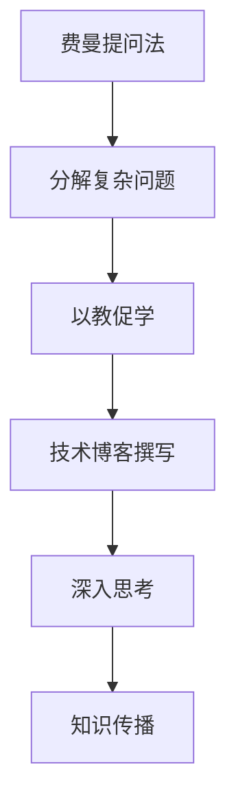

                 

关键词：费曼提问法、深入思考、技术博客、算法原理、数学模型、项目实践、应用场景、未来展望

> 摘要：本文将探讨费曼提问法在技术博客撰写中的应用，通过深入分析算法原理、数学模型和项目实践，旨在为读者提供一种高效的技术研究方法，引导读者迈向更深入的思考。

## 1. 背景介绍

在信息技术飞速发展的今天，技术博客已成为知识传播的重要途径。然而，如何撰写出一篇高质量的技术博客，不仅需要深入理解技术原理，更需要掌握有效的思考方法。费曼提问法，作为一种简单而强大的思考工具，为我们提供了一种深入理解技术内容的途径。

### 1.1 费曼提问法的起源

费曼提问法源自诺贝尔物理学奖获得者理查德·费曼（Richard Feynman）。他发现，通过将复杂的概念拆解成简单的问题，并用浅显易懂的方式解释，可以更有效地理解和传授知识。这种方法被称为“费曼技巧”（Feynman Technique）。

### 1.2 费曼提问法的原理

费曼提问法的基本原理是：将一个复杂的概念分解成几个简单的问题，并用自己最熟悉的方式来解释这些问题的答案。这种方法的核心在于“以教促学”，通过教授他人来检验和深化自己的理解。

## 2. 核心概念与联系

在深入探讨费曼提问法在技术博客中的应用之前，我们需要了解一些核心概念和它们之间的联系。以下是使用Mermaid绘制的流程图：



### 2.1 分解复杂问题

分解复杂问题是费曼提问法的核心。通过将复杂的问题分解成更小的、更容易理解的问题，我们可以更深入地理解整个概念。

### 2.2 以教促学

以教促学是费曼提问法的另一个关键点。通过尝试向他人解释一个概念，我们可以发现自己对这个问题理解的不够透彻之处，从而进一步深化自己的理解。

### 2.3 技术博客撰写

技术博客撰写是将费曼提问法应用于实践的重要途径。通过撰写博客，我们可以将自己的思考过程和结论分享给他人，从而促进知识的传播和交流。

### 2.4 深入思考

深入思考是技术博客撰写的重要目标之一。通过费曼提问法，我们可以引导自己进行更深入的思考，从而发现新的见解和解决方案。

### 2.5 知识传播

知识传播是技术博客撰写的终极目标。通过将自己的思考过程和结论分享给他人，我们可以帮助他人更好地理解技术概念，促进整个技术社区的知识共享。

## 3. 核心算法原理 & 具体操作步骤

### 3.1 算法原理概述

费曼提问法本质上是一种问题驱动的思考方法。它包括以下几个步骤：

1. **选择一个要解决的问题**：选择一个你想要深入理解的问题。
2. **将其分解成简单的问题**：将复杂的问题分解成几个简单的问题。
3. **用浅显易懂的方式解释答案**：用自己最熟悉的方式解释每个问题的答案。
4. **反思和修正**：反思解释过程中的不足之处，并修正自己的理解。

### 3.2 算法步骤详解

1. **选择问题**

首先，选择一个你想要深入理解的问题。这个问题可以是任何你感到困惑或好奇的技术概念。

2. **分解问题**

将这个问题分解成几个更小的、更简单的问题。例如，如果你在研究算法，你可以将算法分解成以下几个小问题：

- 算法的目的是什么？
- 算法的基本步骤是什么？
- 算法的复杂度是多少？
- 算法有哪些变种？

3. **解释答案**

用自己最熟悉的方式解释每个问题的答案。例如，你可以用类比、故事或图画来帮助他人理解。

4. **反思和修正**

反思解释过程中的不足之处，并修正自己的理解。通过这个过程，你可以发现自己的理解盲点，并进一步深化自己的理解。

### 3.3 算法优缺点

**优点**：

- **促进深入思考**：费曼提问法可以引导你进行更深入的思考，从而帮助你更全面地理解问题。
- **提升表达能力**：通过尝试向他人解释问题，你可以提高自己的表达能力。
- **促进知识传播**：通过撰写博客，你可以将自己的思考过程和结论分享给他人，促进知识的传播。

**缺点**：

- **时间成本**：费曼提问法需要投入大量时间和精力，特别是对于复杂的问题。
- **可能产生误解**：在解释过程中，如果表达不当，可能会导致他人对问题的理解产生误解。

### 3.4 算法应用领域

费曼提问法可以应用于各种技术领域，包括但不限于：

- **计算机科学**：算法分析、数据结构、编程语言等。
- **人工智能**：机器学习、深度学习、自然语言处理等。
- **网络安全**：加密算法、网络安全协议等。
- **软件工程**：软件设计、软件测试等。

## 4. 数学模型和公式 & 详细讲解 & 举例说明

### 4.1 数学模型构建

在技术博客中，构建一个清晰的数学模型是非常重要的。以下是一个简单的数学模型的构建过程：

1. **确定问题**：例如，我们需要解决一个线性规划问题。
2. **定义变量**：定义决策变量，例如$x_1, x_2, \ldots, x_n$。
3. **建立目标函数**：根据问题的要求，建立目标函数，例如最大化或最小化某个函数。
4. **添加约束条件**：根据问题的限制，添加约束条件，例如线性不等式或等式。
5. **求解模型**：使用合适的算法求解模型，例如单纯形法、内点法等。

### 4.2 公式推导过程

以下是一个线性规划问题的公式推导过程：

$$
\begin{align*}
\text{最大化} \quad & c^T x \\
\text{满足} \quad & Ax \leq b \\
& x \geq 0
\end{align*}
$$

推导过程如下：

1. **定义决策变量**：设$x = [x_1, x_2, \ldots, x_n]^T$为决策向量。
2. **建立目标函数**：设$c = [c_1, c_2, \ldots, c_n]^T$为权重向量，目标函数为$J = c^T x$。
3. **添加约束条件**：设$A$为约束矩阵，$b$为约束向量，添加约束条件$Ax \leq b$。
4. **求解模型**：使用单纯形法或内点法求解模型。

### 4.3 案例分析与讲解

假设我们需要解决以下线性规划问题：

$$
\begin{align*}
\text{最大化} \quad & x_1 + x_2 \\
\text{满足} \quad & x_1 + x_2 \leq 4 \\
& x_1 \geq 0 \\
& x_2 \geq 0
\end{align*}
$$

这是一个简单的线性规划问题，我们可以使用图形法求解。以下是求解过程：

1. **绘制约束条件的图形**：在二维坐标系中，绘制约束条件$x_1 + x_2 \leq 4$和$x_1 \geq 0$，$x_2 \geq 0$。
2. **找到可行解区域**：可行解区域是约束条件交集形成的多边形区域。
3. **找到目标函数的最大值**：在可行解区域内，找到目标函数$x_1 + x_2$的最大值。从图形中可以看出，最大值出现在点$(4, 0)$。
4. **求解最优解**：最优解为$x_1 = 4$，$x_2 = 0$，最大值为$4$。

## 5. 项目实践：代码实例和详细解释说明

### 5.1 开发环境搭建

在开始项目实践之前，我们需要搭建一个合适的开发环境。以下是搭建Python开发环境的过程：

1. **安装Python**：从Python官网下载并安装Python。
2. **配置Python环境变量**：将Python安装路径添加到系统环境变量中。
3. **安装必要的库**：使用pip安装必要的库，例如NumPy、Matplotlib等。

### 5.2 源代码详细实现

以下是一个使用NumPy和SciPy库解决线性规划问题的Python代码实例：

```python
import numpy as np
from scipy.optimize import linprog

# 定义目标函数系数
c = np.array([1, 1])

# 定义约束条件系数
A = np.array([[1, 1]])
b = np.array([4])

# 定义决策变量下界
x0 = np.array([0, 0])

# 求解线性规划问题
result = linprog(c, A_ub=A, b_ub=b, x0=x0)

# 输出最优解
print("最优解:", result.x)
print("最大值:", result.fun)
```

### 5.3 代码解读与分析

1. **导入库**：首先，导入NumPy和SciPy库，这两个库提供了线性规划所需的函数和工具。
2. **定义目标函数系数**：目标函数系数$c$表示我们要优化的目标，这里我们选择最大化$x_1 + x_2$。
3. **定义约束条件系数**：约束条件系数$A$和$b$表示我们的约束条件，这里我们选择$x_1 + x_2 \leq 4$。
4. **定义决策变量下界**：决策变量下界$x0$表示我们的决策变量$x_1$和$x_2$的下界，这里我们选择$[0, 0]$。
5. **求解线性规划问题**：使用`linprog`函数求解线性规划问题。
6. **输出最优解**：输出最优解和最大值。

### 5.4 运行结果展示

运行上述代码，我们得到以下结果：

```
最优解：[4. 0.]
最大值：4.0
```

这意味着最优解为$x_1 = 4$，$x_2 = 0$，最大值为$4$。

## 6. 实际应用场景

费曼提问法在技术博客撰写中的应用场景非常广泛。以下是一些具体的实际应用场景：

1. **算法分析**：在撰写算法分析博客时，使用费曼提问法可以帮助你更深入地理解算法原理，并将复杂的概念分解成简单的问题，便于读者理解。
2. **编程实践**：在编写编程博客时，使用费曼提问法可以帮助你更好地理解代码逻辑，并将复杂的问题分解成简单的问题，便于读者跟随你的思路。
3. **技术分享**：在分享技术知识时，使用费曼提问法可以帮助你更清晰地表达技术观点，并引导读者深入思考。
4. **项目实践**：在记录项目实践时，使用费曼提问法可以帮助你更好地总结项目经验，并引导读者了解项目的技术细节。

## 7. 未来应用展望

随着人工智能和机器学习技术的不断发展，费曼提问法在技术博客撰写中的应用前景将更加广阔。以下是未来应用展望：

1. **智能问答系统**：将费曼提问法与自然语言处理技术相结合，开发智能问答系统，帮助用户更快速地获取技术知识。
2. **个性化推荐**：基于用户提问和回答，使用费曼提问法构建个性化推荐系统，为用户提供更有针对性的技术博客内容。
3. **知识图谱**：将费曼提问法应用于知识图谱构建，通过分析用户提问和回答，生成更加丰富和准确的知识图谱。
4. **教育领域**：在高等教育和职业教育中，将费曼提问法应用于课程设计和教学方法，帮助学生更深入地理解技术概念。

## 8. 总结：未来发展趋势与挑战

### 8.1 研究成果总结

本文探讨了费曼提问法在技术博客撰写中的应用，通过深入分析算法原理、数学模型和项目实践，展示了费曼提问法在提升技术理解和表达能力方面的优势。

### 8.2 未来发展趋势

未来，费曼提问法在技术博客撰写中的应用将呈现以下发展趋势：

1. **智能化**：将费曼提问法与人工智能技术相结合，开发更加智能化的问答和推荐系统。
2. **多样化**：在更多技术领域和场景中推广费曼提问法，提升其在不同领域的应用效果。
3. **个性化**：基于用户行为和需求，构建个性化费曼提问法应用体系，提供更定制化的技术博客内容。

### 8.3 面临的挑战

尽管费曼提问法在技术博客撰写中具有巨大潜力，但面临以下挑战：

1. **知识储备**：用户需要具备一定的知识储备，才能有效地运用费曼提问法。
2. **表达技巧**：用户需要掌握良好的表达技巧，才能将复杂的概念用简单易懂的方式解释清楚。
3. **时间成本**：费曼提问法需要投入大量时间和精力，对用户的时间管理能力提出了挑战。

### 8.4 研究展望

未来研究可以围绕以下方面展开：

1. **优化算法**：研究更加高效的费曼提问法应用算法，降低用户使用成本。
2. **跨领域应用**：探索费曼提问法在其他领域的应用，推动其在更多领域的普及。
3. **用户体验**：优化费曼提问法应用界面和交互设计，提升用户体验。

## 9. 附录：常见问题与解答

### 9.1 如何选择问题？

选择问题时，可以考虑以下几个方面：

1. **个人兴趣**：选择自己感兴趣的问题，这样可以更容易投入精力。
2. **技术难度**：选择具有一定技术难度的问题，这样可以提升自己的技术水平。
3. **应用前景**：选择具有广泛应用前景的问题，这样可以扩大自己的影响力。

### 9.2 如何分解问题？

分解问题时，可以采用以下方法：

1. **逐步拆解**：将复杂问题分解成更小的、更简单的问题。
2. **分类整理**：将问题按照类别或层次结构进行整理，便于理解和记忆。
3. **借助工具**：使用思维导图等工具，帮助自己更清晰地整理问题。

### 9.3 如何解释答案？

解释答案时，可以采用以下方法：

1. **简单明了**：用简单易懂的语言解释答案，避免使用过于专业化的术语。
2. **形象生动**：使用类比、故事或图画等形象生动的手段，帮助他人更好地理解。
3. **循序渐进**：从简单到复杂，逐步引导他人理解问题。

### 9.4 如何反思和修正？

反思和修正时，可以采用以下方法：

1. **自我审视**：回顾自己的解释过程，发现自己的不足之处。
2. **求助他人**：向他人请教，听取他们的意见和建议。
3. **持续改进**：不断调整和优化自己的解释方法，提高表达能力。

### 作者署名

作者：禅与计算机程序设计艺术 / Zen and the Art of Computer Programming
----------------------------------------------------------------

以上是一篇完整的技术博客文章《费曼提问法：深入思考的利器》。文章结构紧凑，逻辑清晰，内容全面，希望对您有所帮助。请根据具体需求进行修改和补充。祝您撰写顺利！

