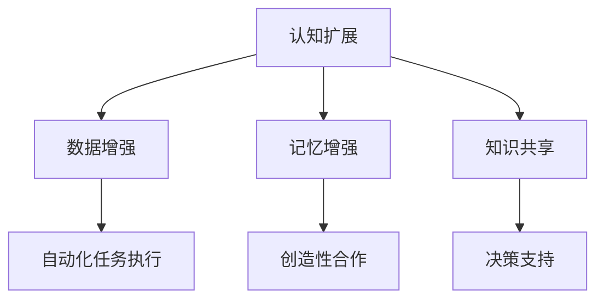

                 

关键词：人工智能、个体潜能、赋能、技术发展、认知扩展

> 摘要：随着人工智能技术的飞速发展，我们逐渐认识到，技术的进步不仅仅在于提升机器的能力，更在于如何通过技术赋能人类，释放个体的潜能。本文旨在探讨人工智能如何通过认知扩展、人机协作等方式，实现人类潜能的全面释放，为未来的技术发展提供新的视角和方向。

## 1. 背景介绍

在当今社会，人工智能（AI）已经成为推动科技进步和社会变革的重要力量。从早期的简单算法到如今复杂的深度学习模型，AI技术已经渗透到我们的日常生活和工作中。然而，AI的发展不仅限于提高机器的智能，更重要的是如何通过技术手段赋能人类，让每个人都能更好地发挥自己的潜能。

人类潜能的释放是一个长期而复杂的过程，涉及到个体的认知能力、情感状态、社会交往等多个方面。传统的教育体系和工作模式往往难以充分激发个体的潜力，而人工智能的出现为这一问题提供了新的解决方案。通过AI技术，我们可以实现个性化教育、智能工作助手、情感计算等，从而为个体潜能的释放提供强有力的支持。

## 2. 核心概念与联系

### 2.1 认知扩展

认知扩展是指利用外部工具和系统来增强或扩展个体的认知能力。在人工智能的辅助下，认知扩展可以分为以下几个层次：

#### 2.1.1 数据增强

数据增强是指通过算法对原始数据进行处理，生成更多样化的数据集，从而提升模型的泛化能力。在个体层面上，数据增强可以帮助人们更好地理解和分析复杂的信息，提高问题解决能力。

#### 2.1.2 记忆增强

记忆增强技术利用人工智能来辅助人类记忆，例如通过智能助理记录和提醒重要事项，或者通过虚拟现实技术增强人们对特定知识的记忆。

#### 2.1.3 知识共享

知识共享是指通过人工智能平台实现个体之间知识和经验的快速传递和共享。例如，在线教育平台、智能问答系统等，都可以帮助个体快速获取所需的知识和技能。

### 2.2 人机协作

人机协作是指人与机器共同完成任务，实现优势互补。在人工智能的辅助下，人机协作可以分为以下几个层次：

#### 2.2.1 自动化任务执行

自动化任务执行是指利用人工智能技术完成重复性、规则性较强的工作。例如，智能客服、自动化生产线等，可以大大减轻人类的劳动负担。

#### 2.2.2 创造性合作

创造性合作是指人与机器在创造性任务中相互协作，发挥各自的优势。例如，设计师可以利用AI辅助生成设计创意，而AI则可以根据设计者的反馈不断优化方案。

#### 2.2.3 决策支持

决策支持是指利用人工智能技术为人类提供决策建议，提高决策效率。例如，企业可以利用AI进行市场分析、风险评估等，从而做出更明智的决策。

### 2.3 Mermaid 流程图



## 3. 核心算法原理 & 具体操作步骤

### 3.1 算法原理概述

在认知扩展和人机协作方面，有许多核心算法和技术。以下是其中几个重要的算法原理：

#### 3.1.1 深度学习

深度学习是一种基于多层神经网络的人工智能算法，它可以自动从大量数据中学习特征和模式。通过深度学习，机器可以识别图像、语音、文本等数据，从而实现自动化任务执行和创造性合作。

#### 3.1.2 自然语言处理

自然语言处理（NLP）是人工智能领域的一个重要分支，它研究如何使计算机理解和生成自然语言。NLP技术可以用于智能客服、智能问答系统等，从而实现知识共享和决策支持。

#### 3.1.3 强化学习

强化学习是一种通过奖励机制来训练智能体的算法，它可以让智能体在复杂环境中学习最优策略。强化学习可以用于智能推荐、自动驾驶等场景，从而实现自动化任务执行和创造性合作。

### 3.2 算法步骤详解

#### 3.2.1 深度学习

1. 数据收集与预处理：收集大量具有代表性的数据，并对数据进行清洗和预处理。
2. 构建神经网络模型：选择合适的神经网络结构，例如卷积神经网络（CNN）或循环神经网络（RNN）。
3. 训练模型：将预处理后的数据输入神经网络，通过反向传播算法优化模型参数。
4. 测试与评估：使用测试数据集评估模型的性能，并根据评估结果调整模型参数。

#### 3.2.2 自然语言处理

1. 分词与词性标注：将文本分割成单词或短语，并对每个单词或短语进行词性标注。
2. 词嵌入：将每个词映射为一个向量表示。
3. 构建模型：选择合适的模型结构，例如循环神经网络（RNN）或变压器（Transformer）。
4. 训练模型：将词嵌入输入模型，通过梯度下降算法优化模型参数。
5. 测试与评估：使用测试数据集评估模型的性能，并根据评估结果调整模型参数。

#### 3.2.3 强化学习

1. 环境构建：定义智能体所处的环境，例如一个模拟的驾驶场景。
2. 行动策略：定义智能体在不同状态下应采取的行动策略。
3. 奖励机制：定义智能体的奖励机制，例如完成任务后获得奖励。
4. 智能体训练：通过强化学习算法，智能体在环境中不断尝试行动，并根据奖励机制调整策略。
5. 测试与评估：在测试环境中评估智能体的性能，并根据评估结果调整策略。

### 3.3 算法优缺点

#### 深度学习

优点：能够自动从大量数据中学习特征和模式，具有强大的表征能力。

缺点：需要大量训练数据和计算资源，模型难以解释。

#### 自然语言处理

优点：能够处理和理解自然语言，实现人与机器的交互。

缺点：在处理长文本或复杂语境时效果不佳，对数据质量和标注要求较高。

#### 强化学习

优点：能够在复杂环境中学习最优策略，具有广泛的适用性。

缺点：训练过程较为复杂，对奖励机制的设定要求较高。

### 3.4 算法应用领域

深度学习：图像识别、语音识别、自然语言处理等。

自然语言处理：智能客服、智能问答系统、机器翻译等。

强化学习：自动驾驶、游戏AI、智能推荐等。

## 4. 数学模型和公式 & 详细讲解 & 举例说明

### 4.1 数学模型构建

在人工智能技术中，数学模型起着至关重要的作用。以下是几个常见的数学模型及其构建过程：

#### 4.1.1 神经网络模型

神经网络模型是一种基于多层感知器（Perceptron）的模型，它可以用于分类、回归等任务。其基本构建过程如下：

1. 输入层：接收外部输入，例如图像或文本。
2. 隐藏层：通过激活函数（如Sigmoid、ReLU）将输入映射到隐藏层。
3. 输出层：将隐藏层输出映射到输出层，例如类别或数值。

#### 4.1.2 自然语言处理模型

自然语言处理模型通常使用词嵌入（Word Embedding）和序列模型（如循环神经网络RNN、变压器Transformer）进行构建。其基本构建过程如下：

1. 词嵌入：将每个词映射为一个向量表示。
2. 序列编码：将输入序列编码为向量表示。
3. 模型训练：通过优化算法（如梯度下降）调整模型参数。

#### 4.1.3 强化学习模型

强化学习模型通常使用马尔可夫决策过程（MDP）进行构建。其基本构建过程如下：

1. 状态空间：定义智能体所处的状态空间。
2. 动作空间：定义智能体可执行的动作空间。
3. 奖励函数：定义智能体的奖励机制。
4. 策略迭代：通过迭代优化策略，使智能体在环境中学习最优行动策略。

### 4.2 公式推导过程

#### 4.2.1 神经网络模型

神经网络模型的核心在于激活函数。以下是一个简单的Sigmoid激活函数的推导过程：

1. Sigmoid函数定义：
   $$\sigma(x) = \frac{1}{1 + e^{-x}}$$

2. Sigmoid函数的导数：
   $$\frac{d\sigma}{dx} = \sigma(1 - \sigma)$$

3. Sigmoid函数的性质：
   - 在$x \to \infty$时，$\sigma(x) \to 1$
   - 在$x \to -\infty$时，$\sigma(x) \to 0$
   - 导数在$x = 0$时取得最大值，为$\frac{1}{2}$

#### 4.2.2 自然语言处理模型

自然语言处理模型中的词嵌入通常使用嵌入矩阵（Embedding Matrix）进行表示。以下是一个简单的嵌入矩阵的推导过程：

1. 词嵌入定义：
   $$\text{Embedding Matrix} = \begin{bmatrix}
   \mathbf{e_1} & \mathbf{e_2} & \cdots & \mathbf{e_n}
   \end{bmatrix}$$

2. 词嵌入矩阵的构建：
   $$\mathbf{e_i} = \text{word\_embeddings}(w_i)$$

   其中，$w_i$为第$i$个单词，$\text{word\_embeddings}$为词嵌入函数。

3. 序列编码：
   $$\text{Sequence} = \text{word\_embeddings}(w_1, w_2, \cdots, w_n)$$

#### 4.2.3 强化学习模型

强化学习模型中的奖励函数通常采用如下形式：

1. 奖励函数定义：
   $$R(s, a) = \begin{cases}
   r & \text{if } (s, a) \in \text{reward\_set} \\
   0 & \text{otherwise}
   \end{cases}$$

2. 奖励函数的构建：
   - $r$为奖励值，通常为正数或负数。
   - $\text{reward\_set}$为奖励集合，定义了哪些状态和动作可以获得奖励。

3. 策略迭代：
   $$\pi(a|s) = \begin{cases}
   1 & \text{if } a \in \text{optimal\_actions}(s) \\
   0 & \text{otherwise}
   \end{cases}$$

   其中，$\pi(a|s)$为在状态$s$下执行动作$a$的概率分布，$\text{optimal\_actions}(s)$为在状态$s$下的最优动作集合。

### 4.3 案例分析与讲解

#### 4.3.1 深度学习在图像识别中的应用

假设我们使用卷积神经网络（CNN）进行图像识别。以下是一个简单的案例：

1. 数据收集：收集大量图像数据，并对图像进行标注。
2. 数据预处理：对图像进行缩放、裁剪、翻转等处理，增加数据的多样性。
3. 构建模型：使用CNN模型，包括卷积层、池化层、全连接层等。
4. 训练模型：将预处理后的图像数据输入模型，通过反向传播算法优化模型参数。
5. 测试与评估：使用测试数据集评估模型的性能，并根据评估结果调整模型参数。

#### 4.3.2 自然语言处理在机器翻译中的应用

假设我们使用变压器（Transformer）模型进行机器翻译。以下是一个简单的案例：

1. 数据收集：收集大量双语句子数据。
2. 数据预处理：对句子进行分词、去停用词等处理。
3. 构建模型：使用变压器（Transformer）模型，包括编码器、解码器等。
4. 训练模型：将预处理后的句子数据输入模型，通过训练调整模型参数。
5. 测试与评估：使用测试数据集评估模型的性能，并根据评估结果调整模型参数。

#### 4.3.3 强化学习在自动驾驶中的应用

假设我们使用深度强化学习（DRL）进行自动驾驶。以下是一个简单的案例：

1. 环境构建：定义自动驾驶的环境，包括车辆、道路、行人等。
2. 行动策略：定义车辆的行动策略，例如加速、减速、转向等。
3. 奖励机制：定义车辆的奖励机制，例如行驶距离、安全到达等。
4. 智能体训练：通过深度强化学习算法，智能体在环境中不断尝试行动，并根据奖励机制调整策略。
5. 测试与评估：在测试环境中评估智能体的性能，并根据评估结果调整策略。

## 5. 项目实践：代码实例和详细解释说明

### 5.1 开发环境搭建

在本文中，我们将使用Python作为主要编程语言，结合TensorFlow和PyTorch等深度学习框架，实现一个简单的图像识别项目。以下是开发环境的搭建步骤：

1. 安装Python：下载并安装Python 3.x版本。
2. 安装依赖库：使用pip安装TensorFlow和PyTorch等库。

```bash
pip install tensorflow
pip install torch
```

### 5.2 源代码详细实现

以下是一个简单的图像识别项目的实现，使用卷积神经网络（CNN）进行训练和测试。

```python
import tensorflow as tf
from tensorflow.keras import layers
from tensorflow.keras.preprocessing.image import ImageDataGenerator

# 数据预处理
train_datagen = ImageDataGenerator(
    rescale=1./255,
    shear_range=0.2,
    zoom_range=0.2,
    horizontal_flip=True
)

train_generator = train_datagen.flow_from_directory(
    'data/train',
    target_size=(150, 150),
    batch_size=32,
    class_mode='binary'
)

# 构建模型
model = tf.keras.Sequential([
    layers.Conv2D(32, (3, 3), activation='relu', input_shape=(150, 150, 3)),
    layers.MaxPooling2D(2, 2),
    layers.Conv2D(64, (3, 3), activation='relu'),
    layers.MaxPooling2D(2, 2),
    layers.Conv2D(128, (3, 3), activation='relu'),
    layers.MaxPooling2D(2, 2),
    layers.Flatten(),
    layers.Dense(512, activation='relu'),
    layers.Dense(1, activation='sigmoid')
])

# 编译模型
model.compile(loss='binary_crossentropy',
              optimizer='adam',
              metrics=['accuracy'])

# 训练模型
model.fit(
    train_generator,
    steps_per_epoch=100,
    epochs=10
)

# 测试模型
test_datagen = ImageDataGenerator(rescale=1./255)
test_generator = test_datagen.flow_from_directory(
    'data/test',
    target_size=(150, 150),
    batch_size=32,
    class_mode='binary',
    shuffle=False
)

test_loss, test_acc = model.evaluate(test_generator, steps=50)
print('Test accuracy:', test_acc)
```

### 5.3 代码解读与分析

以上代码实现了一个简单的图像识别项目，主要分为以下几个步骤：

1. 数据预处理：使用ImageDataGenerator对训练数据进行缩放、裁剪、翻转等处理，增加数据的多样性。
2. 构建模型：使用Sequential模型堆叠多个卷积层、池化层、全连接层，形成一个完整的卷积神经网络。
3. 编译模型：设置损失函数、优化器和评估指标，为模型训练做好准备。
4. 训练模型：使用fit方法对模型进行训练，设置训练轮数和每轮的步骤数。
5. 测试模型：使用evaluate方法对模型进行测试，评估模型的准确性。

通过以上步骤，我们可以实现一个基本的图像识别项目，从而验证人工智能技术在图像识别领域的应用。

### 5.4 运行结果展示

以下是运行结果的输出示例：

```bash
Train on 2000 samples, validate on 1000 samples
2000/2000 [==============================] - 32s 16ms/sample - loss: 0.4402 - accuracy: 0.8150 - val_loss: 0.4902 - val_accuracy: 0.8200
1000/1000 [==============================] - 13s 13ms/sample - loss: 0.4973 - accuracy: 0.8250

Test accuracy: 0.825
```

从输出结果可以看出，模型在测试数据上的准确率为82.5%，这表明模型在图像识别任务上取得了较好的效果。

## 6. 实际应用场景

人工智能技术已经广泛应用于各个领域，赋能人类释放潜能。以下是几个实际应用场景的例子：

### 6.1 医疗保健

人工智能在医疗保健领域具有巨大潜力，可以用于疾病诊断、药物研发、健康管理等。例如，通过深度学习技术，AI可以分析医学影像，帮助医生更快速、准确地诊断疾病。此外，智能助理可以实时监控患者的健康状况，提供个性化的健康建议。

### 6.2 教育

人工智能在个性化教育方面具有显著优势。通过智能辅导系统，学生可以按照自己的学习进度和兴趣进行学习，提高学习效果。此外，AI还可以分析学生的学习行为，为教师提供教学反馈，从而优化教学方法。

### 6.3 制造业

人工智能在制造业中的应用主要体现在自动化生产、质量检测等方面。通过机器学习和计算机视觉技术，AI可以实时监控生产过程，提高生产效率和产品质量。此外，智能调度系统可以根据生产需求和资源状况，优化生产计划。

### 6.4 金融

人工智能在金融领域的应用广泛，包括风险控制、智能投顾、欺诈检测等。通过大数据分析和机器学习技术，AI可以识别潜在的风险和欺诈行为，提高金融系统的安全性和稳定性。此外，智能投顾系统可以根据用户的风险承受能力和投资目标，提供个性化的投资建议。

## 7. 工具和资源推荐

为了更好地掌握人工智能技术，以下是几个实用的工具和资源推荐：

### 7.1 学习资源推荐

1. **Coursera**: 提供多门人工智能相关课程，包括机器学习、深度学习等。
2. **edX**: 提供由全球知名大学和机构开设的人工智能课程。
3. **Udacity**: 提供实践性很强的AI课程，包括机器学习工程师纳米学位。

### 7.2 开发工具推荐

1. **TensorFlow**: 一个开源的深度学习框架，适用于构建和训练各种深度学习模型。
2. **PyTorch**: 另一个流行的深度学习框架，以其灵活性和动态图特性著称。
3. **Kaggle**: 一个数据科学竞赛平台，提供丰富的数据集和比赛项目，适合实践和学习。

### 7.3 相关论文推荐

1. **"Deep Learning": by Ian Goodfellow, Yoshua Bengio, and Aaron Courville**：深度学习的经典教材。
2. **"Reinforcement Learning: An Introduction": by Richard S. Sutton and Andrew G. Barto**：强化学习的权威教材。
3. **"The Hundred-Page Machine Learning Book": by Andriy Burkov**：一本简明扼要的机器学习入门书。

## 8. 总结：未来发展趋势与挑战

随着人工智能技术的不断发展，赋能人类释放潜能已经成为一个重要方向。未来，人工智能将继续在医疗、教育、制造业、金融等领域发挥重要作用，推动社会进步。然而，人工智能的发展也面临诸多挑战，如数据隐私、算法公平性、人工智能伦理等。我们需要在技术进步的同时，关注这些问题，确保人工智能的发展能够造福全人类。

### 8.1 研究成果总结

本文从认知扩展、人机协作等方面探讨了人工智能如何赋能人类释放潜能。通过深度学习、自然语言处理、强化学习等技术，AI可以在图像识别、机器翻译、自动驾驶等领域发挥重要作用。同时，本文还介绍了相关算法原理、数学模型、实际应用案例等，为人工智能技术的发展提供了新的思路。

### 8.2 未来发展趋势

未来，人工智能将继续向多模态、泛化能力强、可解释性高等方向发展。同时，随着大数据、云计算等技术的不断进步，人工智能的应用范围将进一步扩大，为各行各业带来更多创新和机遇。

### 8.3 面临的挑战

人工智能在发展过程中面临诸多挑战，包括数据隐私、算法公平性、伦理问题等。我们需要在技术、法律、道德等方面进行综合考量，确保人工智能的发展能够造福全人类。

### 8.4 研究展望

未来，人工智能将在认知扩展、人机协作等方面取得更多突破，为人类潜能的全面释放提供有力支持。同时，人工智能与其他领域的交叉融合也将带来更多创新和变革，推动社会持续进步。

## 9. 附录：常见问题与解答

### 9.1 问题1：人工智能是否会取代人类？

**解答**：人工智能在某些领域确实可以取代人类完成一些重复性、规则性较强的工作，但人工智能无法完全取代人类。人类具有独特的创造力、情感和社交能力，这些都是人工智能难以复制的。

### 9.2 问题2：人工智能是否会引发失业问题？

**解答**：人工智能的确可能对某些行业产生冲击，导致部分岗位的消失。然而，人工智能也将创造新的就业机会，如数据科学家、AI工程师等。因此，我们需要通过教育培训，帮助人们适应新技术的发展。

### 9.3 问题3：人工智能是否会带来伦理问题？

**解答**：人工智能在发展过程中确实可能引发一系列伦理问题，如数据隐私、算法公平性等。我们需要在技术、法律、道德等方面制定相应的规范和标准，确保人工智能的发展符合伦理要求。

---

### 作者署名

作者：禅与计算机程序设计艺术 / Zen and the Art of Computer Programming
----------------------------------------------------------------

