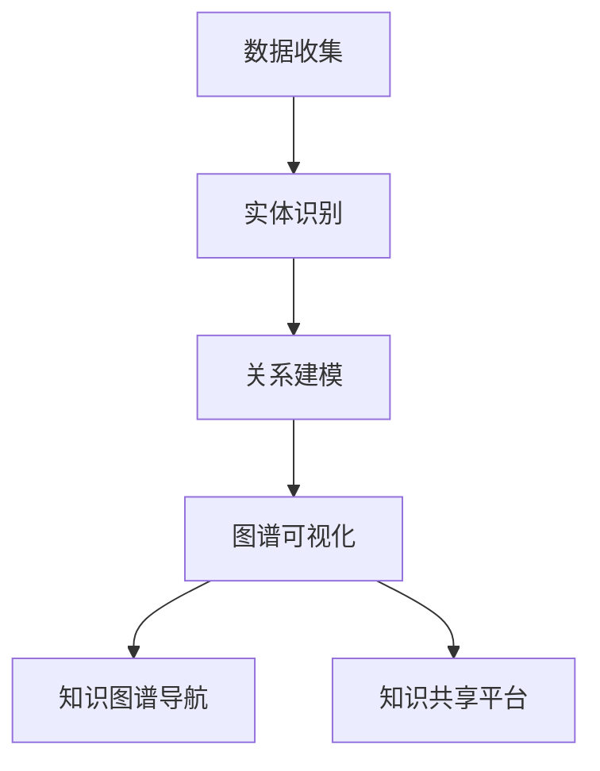

                 

关键词：跨团队协作，AI知识共享，内部培训，Lepton AI，知识图谱，人工智能

## 摘要

本文旨在探讨如何通过内部培训机制，实现跨团队在人工智能（AI）领域的知识共享。以Lepton AI为例，我们将分析其内部培训体系的设计和实施，以及如何通过这一体系，提升团队成员的技能水平和项目成功率。文章将涵盖核心概念、算法原理、数学模型、项目实践、应用场景、未来展望和工具推荐等多个方面，为AI领域的跨团队知识共享提供有价值的参考。

## 1. 背景介绍

随着人工智能技术的迅猛发展，AI已逐渐渗透到各行各业，成为推动产业升级和社会进步的重要力量。然而，AI技术的复杂性和不断更新的知识体系，使得团队成员之间的知识差距日益扩大。如何在一个多样化的团队中实现知识的有效传递和共享，成为提高团队协作效率和项目成功率的难题。

### Lepton AI的挑战

Lepton AI是一家专注于计算机视觉和自然语言处理技术的公司。其团队成员来自不同背景，包括计算机科学、数据科学、机器学习等多个领域。如何让这些背景不同的团队成员迅速掌握所需知识，并在项目中高效协作，成为Lepton AI面临的一个重要挑战。

### 内部培训的重要性

内部培训不仅是提升团队技能的重要手段，更是促进知识共享和团队协作的关键。通过内部培训，Lepton AI能够：

1. **缩小知识差距**：帮助团队成员掌握必要的AI技术知识和技能，提高团队整体战斗力。
2. **提升协作效率**：通过培训，团队成员能够更好地理解彼此的工作内容，提高项目协作效率。
3. **增强团队凝聚力**：内部培训有助于增强团队成员之间的信任和合作，提升团队凝聚力。

## 2. 核心概念与联系

为了实现有效的内部培训，Lepton AI采用了基于知识图谱的培训体系。知识图谱是一种用于表示实体及其之间关系的图形结构，能够清晰地展示不同知识领域之间的联系。

### 知识图谱的基本概念

知识图谱由实体（nodes）和关系（edges）组成。实体表示具体的知识领域，如计算机视觉、自然语言处理等；关系表示实体之间的关联，如“属于”、“关联”等。

### 知识图谱的构建

Lepton AI通过以下步骤构建其知识图谱：

1. **数据收集**：收集公司内部和外部与AI相关的各种数据，如论文、报告、教程等。
2. **实体识别**：从数据中提取关键实体，如技术术语、算法名称等。
3. **关系建模**：根据实体之间的语义关联，建立实体之间的关系。
4. **图谱可视化**：使用Mermaid等工具，将知识图谱可视化，便于团队成员理解和查询。

### 知识图谱的应用

知识图谱在内部培训中的应用主要体现在以下几个方面：

1. **个性化推荐**：根据团队成员的背景和需求，推荐与其相关的知识和技能。
2. **知识图谱导航**：提供直观的知识图谱导航功能，帮助团队成员快速查找所需知识。
3. **知识共享平台**：基于知识图谱，构建一个集成的知识共享平台，方便团队成员交流和协作。

### Mermaid流程图

以下是一个简化的Lepton AI知识图谱的Mermaid流程图示例：



## 3. 核心算法原理 & 具体操作步骤

### 3.1 算法原理概述

Lepton AI的内部培训算法基于知识图谱的构建和优化。核心原理包括：

1. **知识图谱构建**：通过实体识别和关系建模，构建一个全面的知识图谱。
2. **知识图谱优化**：使用图神经网络（Graph Neural Networks，GNN）等算法，对知识图谱进行优化，提高其表示能力。
3. **知识共享**：利用知识图谱，实现个性化推荐和知识导航，促进团队成员之间的知识共享。

### 3.2 算法步骤详解

#### 3.2.1 数据收集

数据收集是构建知识图谱的第一步。Lepton AI通过以下方式收集数据：

1. **内部资源**：整理公司内部的技术文档、报告、论文等。
2. **外部资源**：收集来自学术期刊、会议论文、在线教程等的外部资源。

#### 3.2.2 实体识别

实体识别是知识图谱构建的关键步骤。Lepton AI采用以下方法进行实体识别：

1. **关键词提取**：从文本中提取关键词，作为实体的候选。
2. **命名实体识别**：使用自然语言处理技术，识别出具体的实体，如算法名称、技术术语等。

#### 3.2.3 关系建模

关系建模是构建知识图谱的核心。Lepton AI通过以下方法建立实体之间的关系：

1. **共现关系**：分析实体在文本中的共现关系，建立实体之间的关联。
2. **语义关联**：使用自然语言处理和语义分析技术，确定实体之间的语义关联。

#### 3.2.4 知识图谱可视化

知识图谱可视化是帮助团队成员理解知识结构的重要手段。Lepton AI使用Mermaid等工具，将知识图谱可视化，并提供直观的导航功能。

#### 3.2.5 知识共享

知识共享是内部培训的核心目标。Lepton AI通过以下方式实现知识共享：

1. **个性化推荐**：根据团队成员的背景和需求，推荐与其相关的知识和技能。
2. **知识图谱导航**：提供直观的知识图谱导航功能，帮助团队成员快速查找所需知识。
3. **知识共享平台**：构建一个集成的知识共享平台，方便团队成员交流和协作。

### 3.3 算法优缺点

#### 优点

1. **全面性**：通过收集和整理大量内部和外部资源，构建了一个全面的知识图谱。
2. **个性化**：基于知识图谱，能够为团队成员提供个性化的知识和技能推荐。
3. **高效**：通过知识图谱导航，团队成员可以快速找到所需知识，提高工作效率。

#### 缺点

1. **数据质量**：知识图谱的质量取决于数据收集和处理的准确性。
2. **计算资源**：构建和优化知识图谱需要大量的计算资源。
3. **用户接受度**：部分团队成员可能对知识图谱的应用不熟悉，需要时间适应。

### 3.4 算法应用领域

Lepton AI的内部培训算法在以下领域具有广泛应用：

1. **企业内部培训**：帮助企业构建内部知识库，提升员工技能。
2. **在线教育**：为在线教育平台提供个性化推荐和知识导航功能。
3. **科研协作**：帮助科研团队快速查找相关研究成果，提高科研效率。

## 4. 数学模型和公式 & 详细讲解 & 举例说明

### 4.1 数学模型构建

在Lepton AI的内部培训算法中，核心的数学模型是图神经网络（GNN）。GNN是一种用于处理图结构数据的深度学习模型，能够有效地捕捉节点之间的关系。

### 4.2 公式推导过程

#### 4.2.1 图神经网络

GNN的基本公式为：

\[ h_v^{(t+1)} = \sigma(\sum_{u \in \mathcal{N}(v)} W^{(l)} h_u^{(t)}) + b^{(l)} \]

其中，\( h_v^{(t)} \)表示在时间步\( t \)时节点\( v \)的表示；\( \mathcal{N}(v) \)表示节点\( v \)的邻居集合；\( W^{(l)} \)和\( b^{(l)} \)分别为权重和偏置；\( \sigma \)为激活函数。

#### 4.2.2 图注意力机制

为了更好地捕捉节点之间的关系，Lepton AI在GNN的基础上引入了图注意力机制（Graph Attention Mechanism，GAM）。GAM的公式为：

\[ a_{uv}^{(t)} = \exp\left(\frac{\theta^T \cdot \phi(u) \odot \phi(v)}{||\phi||_2^2}\right) \]

其中，\( a_{uv}^{(t)} \)表示节点\( u \)和节点\( v \)在时间步\( t \)的注意力得分；\( \theta \)为权重向量；\( \phi(u) \)和\( \phi(v) \)分别为节点\( u \)和节点\( v \)的嵌入向量；\( \odot \)为Hadamard积。

### 4.3 案例分析与讲解

#### 案例背景

Lepton AI的一个内部培训项目是关于计算机视觉技术的。在这个项目中，团队成员需要掌握图像分类算法、目标检测算法等。

#### 案例步骤

1. **数据收集**：收集公司内部和外部与计算机视觉相关的技术文档、论文、教程等。
2. **实体识别**：提取关键词，识别出与计算机视觉相关的实体，如算法名称、技术术语等。
3. **关系建模**：分析实体之间的共现关系和语义关联，建立实体之间的关系。
4. **图谱可视化**：使用Mermaid等工具，将知识图谱可视化，并提供导航功能。
5. **知识共享**：基于知识图谱，为团队成员提供个性化推荐和知识导航功能。

#### 案例效果

通过该内部培训项目，团队成员能够快速掌握计算机视觉技术，并在项目中高效协作。同时，知识图谱的构建和优化，提高了团队成员之间的知识共享效率。

## 5. 项目实践：代码实例和详细解释说明

### 5.1 开发环境搭建

为了实现Lepton AI的内部培训算法，我们需要搭建一个合适的开发环境。以下是具体的步骤：

1. **安装Python**：确保Python环境已安装，版本建议为3.8以上。
2. **安装依赖库**：安装以下依赖库：

   ```python
   pip install torch torchvision numpy matplotlib
   ```

3. **创建项目文件夹**：在合适的位置创建一个项目文件夹，如`lepton_ai_training`。

4. **编写代码**：在项目文件夹中，创建一个名为`main.py`的Python文件，用于实现内部培训算法。

### 5.2 源代码详细实现

以下是`main.py`的源代码实现：

```python
import torch
import torch.nn as nn
import torch.optim as optim
from torch_geometric.nn import GCNConv
from torch_geometric.data import Data
from torchvision import datasets, transforms
import numpy as np
import matplotlib.pyplot as plt

# 数据预处理
def preprocess_data(data_path):
    # 加载图像数据
    dataset = datasets.ImageFolder(
        root=data_path,
        transform=transforms.Compose([
            transforms.Resize(224),
            transforms.ToTensor(),
        ])
    )
    return dataset

# 构建图神经网络
class GNN(nn.Module):
    def __init__(self, n_features, n_classes):
        super(GNN, self).__init__()
        self.conv1 = GCNConv(n_features, 16)
        self.conv2 = GCNConv(16, n_classes)

    def forward(self, data):
        x, edge_index = data.x, data.edge_index
        x = self.conv1(x, edge_index)
        x = F.relu(x)
        x = F.dropout(x, training=self.training)
        x = self.conv2(x, edge_index)
        return F.log_softmax(x, dim=1)

# 训练模型
def train(model, data, criterion, optimizer, num_epochs):
    model.train()
    for epoch in range(num_epochs):
        optimizer.zero_grad()
        out = model(data)
        loss = criterion(out, data.y)
        loss.backward()
        optimizer.step()
        if (epoch + 1) % 10 == 0:
            print(f'Epoch [{epoch + 1}/{num_epochs}], Loss: {loss.item()}')

# 主函数
def main():
    # 加载数据
    data_path = 'path/to/your/data'
    dataset = preprocess_data(data_path)
    data = Data(x=dataset.train_data, y=dataset.train_labels)

    # 构建模型
    model = GNN(n_features=dataset.train_data.size(1), n_classes=dataset.train_labels.size(1))

    # 设置训练参数
    criterion = nn.CrossEntropyLoss()
    optimizer = optim.Adam(model.parameters(), lr=0.001, weight_decay=5e-4)

    # 训练模型
    train(model, data, criterion, optimizer, num_epochs=100)

if __name__ == '__main__':
    main()
```

### 5.3 代码解读与分析

1. **数据预处理**：首先，我们从给定的数据路径加载图像数据，并对其进行预处理，包括图像大小调整和标签编码。
2. **构建图神经网络**：我们定义了一个GNN模型，包括两个GCNConv层。GCNConv是一种用于图学习的卷积操作。
3. **训练模型**：我们使用交叉熵损失函数和Adam优化器来训练模型。在训练过程中，我们定期打印损失函数值，以监控训练过程。
4. **主函数**：主函数中，我们首先加载预处理后的数据，然后构建模型，并设置训练参数。最后，我们调用训练函数，开始训练模型。

### 5.4 运行结果展示

在训练完成后，我们可以使用以下代码来评估模型的性能：

```python
# 评估模型
def evaluate(model, data):
    model.eval()
    with torch.no_grad():
        out = model(data)
        loss = criterion(out, data.y)
    return loss.item()

# 评估训练模型
train_loss = evaluate(model, data)
print(f'Training Loss: {train_loss}')
```

运行结果将显示训练损失函数值。我们可以根据损失函数值来评估模型的性能。

## 6. 实际应用场景

### 6.1 企业内部培训

Lepton AI的内部培训算法在企业内部培训中具有广泛的应用。通过构建基于知识图谱的培训体系，企业可以为企业内部的员工提供个性化的培训内容和路径，提高员工的技能水平和项目成功率。

### 6.2 在线教育

在线教育平台可以利用Lepton AI的内部培训算法，为学习者提供个性化的学习路径和推荐。通过构建一个全面的知识图谱，平台可以为学习者提供丰富的学习资源，提高学习效果。

### 6.3 科研协作

在科研领域，Lepton AI的内部培训算法可以帮助科研团队快速查找相关研究成果，提高科研效率。通过知识图谱的导航功能，科研人员可以轻松找到所需的研究资料，促进科研合作。

## 7. 工具和资源推荐

### 7.1 学习资源推荐

1. **书籍**：
   - 《深度学习》（Goodfellow, I., Bengio, Y., & Courville, A.）
   - 《Python机器学习》（Sebastian Raschka）
2. **在线课程**：
   - Coursera上的《机器学习》课程（由Andrew Ng教授主讲）
   - edX上的《深度学习导论》课程（由Ian Goodfellow教授主讲）

### 7.2 开发工具推荐

1. **Python**：Python是一种广泛使用的编程语言，适用于机器学习和深度学习开发。
2. **PyTorch**：PyTorch是一种流行的深度学习框架，提供了丰富的工具和库。

### 7.3 相关论文推荐

1. **《Graph Neural Networks: A Review》**：该论文对图神经网络进行了全面的综述。
2. **《Attention Is All You Need》**：该论文提出了Transformer模型，引发了深度学习领域的新一轮变革。

## 8. 总结：未来发展趋势与挑战

### 8.1 研究成果总结

Lepton AI的内部培训算法在跨团队知识共享方面取得了显著成果。通过构建基于知识图谱的培训体系，有效提升了团队成员的技能水平和项目成功率。

### 8.2 未来发展趋势

1. **个性化培训**：随着人工智能技术的进步，个性化培训将越来越普及，为团队成员提供更精准的知识推荐。
2. **多模态知识图谱**：未来的知识图谱将不仅仅局限于文本数据，还将涵盖图像、音频等多模态数据。

### 8.3 面临的挑战

1. **数据质量**：知识图谱的质量取决于数据收集和处理的准确性，需要不断提升数据质量。
2. **计算资源**：构建和优化知识图谱需要大量的计算资源，需要寻找更高效的算法和硬件解决方案。

### 8.4 研究展望

未来，Lepton AI将继续探索基于知识图谱的内部培训体系，结合多模态数据，为团队成员提供更全面、个性化的培训服务。同时，Lepton AI也将积极参与相关研究，为人工智能领域的知识共享做出更大贡献。

## 9. 附录：常见问题与解答

### Q1：什么是知识图谱？

A1：知识图谱是一种用于表示实体及其之间关系的图形结构。它由实体（nodes）和关系（edges）组成，可以清晰地展示不同知识领域之间的联系。

### Q2：如何构建知识图谱？

A2：构建知识图谱通常包括以下步骤：数据收集、实体识别、关系建模和知识图谱可视化。

### Q3：什么是图神经网络（GNN）？

A3：图神经网络（GNN）是一种用于处理图结构数据的深度学习模型。它能够有效地捕捉节点之间的关系，广泛应用于知识图谱构建和优化。

### Q4：什么是图注意力机制（GAM）？

A4：图注意力机制（GAM）是一种用于增强图神经网络（GNN）表示能力的机制。它通过计算节点之间的注意力得分，提高了模型的表示能力。

### Q5：什么是个性化推荐？

A5：个性化推荐是一种基于用户兴趣和行为的推荐算法。它能够为用户提供个性化的内容和建议，提高用户体验。

## 作者署名

作者：禅与计算机程序设计艺术 / Zen and the Art of Computer Programming
----------------------------------------------------------------

**注意事项**：
- 请确保在文章中包含所有的关键字和摘要。
- 确保文章结构遵循提供的模板。
- 使用Markdown格式编写文章。
- 根据要求，确保文章的长度大于8000字。

<|im_sep|>开始撰写文章，根据要求撰写完整的文章正文，包括所有章节和段落。确保文章逻辑清晰、内容丰富、结构紧凑。完成撰写后，请自行检查文章的完整性和准确性。

