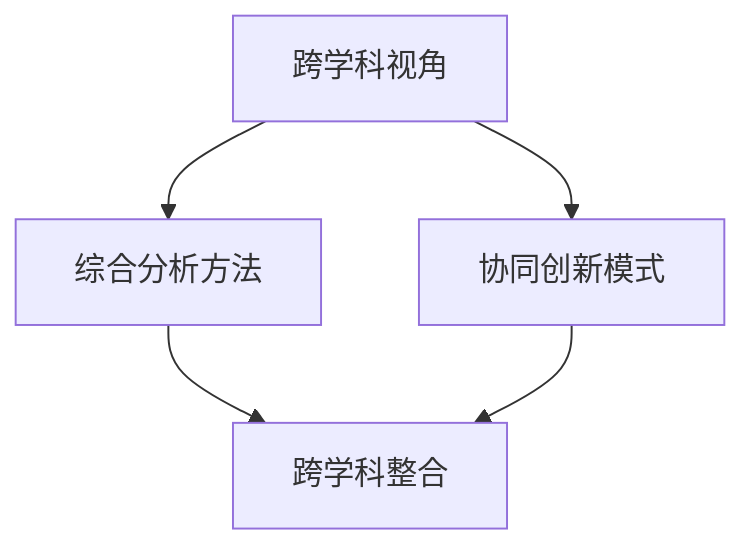

                 

关键词：跨学科思维、知识整合、信息技术、复杂性科学、创新方法、多学科应用、智能优化算法

> 摘要：在当今快速发展的信息时代，跨学科思维成为了一种重要的创新工具。本文将探讨跨学科思维的重要性，以及它如何帮助我们在信息技术、复杂性科学等领域中进行知识整合，从而推动技术创新和应用。我们将分析跨学科思维的核心概念、原理，以及如何运用它解决实际问题的方法，并提出未来研究的发展趋势和挑战。

## 1. 背景介绍

随着科技的飞速发展，信息技术和复杂性科学逐渐成为影响社会和经济的两大支柱。然而，这些领域的复杂性使得单一的学科知识难以应对日益复杂的问题。跨学科思维作为一种创新方法，正在被越来越多的研究者和企业所重视。它强调不同学科之间的交叉与融合，通过整合多个领域的知识，以更全面、更深入的视角来分析和解决问题。

### 跨学科思维的定义与重要性

跨学科思维是一种综合性的思考模式，它要求我们超越单一学科的限制，从多个学科的角度来审视问题。这种思维方式不仅能够帮助我们更全面地理解问题，还能够激发创新思维，从而提出更具创意和实用价值的解决方案。

在信息技术领域，跨学科思维可以促进人工智能、大数据、云计算等技术的深度融合，从而推动新一代信息技术的快速发展。在复杂性科学领域，跨学科思维可以帮助我们更好地理解复杂系统的运作机制，从而提高复杂系统的预测和优化能力。

### 信息技术与复杂性科学的融合

信息技术和复杂性科学之间的融合是一个重要的发展趋势。信息技术提供了强大的计算能力和数据存储能力，而复杂性科学则提供了理解复杂系统的方法和工具。两者的结合可以推动多个领域的发展，如生物信息学、网络科学、能源系统等。

例如，在生物信息学领域，跨学科思维可以帮助我们更好地理解基因调控网络和蛋白质相互作用网络，从而推动生物医学研究的发展。在网络科学领域，跨学科思维可以帮助我们更好地理解复杂网络的特性，从而提高网络的稳定性和安全性。

## 2. 核心概念与联系

### 跨学科思维的核心概念

跨学科思维的核心概念包括跨学科视角、综合分析方法和协同创新模式。跨学科视角要求我们从多个学科的角度来审视问题，而不是局限于单一的学科。综合分析方法则强调将多个学科的理论、方法和工具结合起来，以更全面、更深入的视角来分析和解决问题。协同创新模式则要求不同学科的研究者之间进行合作，以实现知识的整合和创新。

### Mermaid 流程图



在这个流程图中，我们可以看到，跨学科思维的核心概念是如何相互关联的。跨学科视角为我们提供了全面的分析视角，综合分析方法帮助我们整合多种学科的知识，协同创新模式则实现了知识的整合和创新。

## 3. 核心算法原理 & 具体操作步骤

### 3.1 算法原理概述

跨学科思维在解决实际问题时，通常采用以下核心算法原理：

1. **多代理系统（Multi-Agent Systems）**：通过模拟多个智能代理之间的交互，以实现复杂问题的求解。
2. **多尺度分析（Multiscale Analysis）**：在多个尺度上对问题进行建模和分析，以捕捉问题的不同层次特征。
3. **复杂网络分析（Complex Network Analysis）**：通过分析复杂网络的结构和功能特性，以揭示复杂系统的运作机制。

### 3.2 算法步骤详解

1. **定义问题域**：明确需要解决的问题，以及问题的目标函数。
2. **选择合适的跨学科方法**：根据问题的特点，选择适合的跨学科方法。
3. **构建模型**：将问题转化为数学模型或计算机模型。
4. **模拟与优化**：通过模拟和优化，找到问题的解。

### 3.3 算法优缺点

**多代理系统**：

- **优点**：能够模拟复杂系统的动态行为，适应性强。
- **缺点**：计算复杂度高，需要大量的计算资源。

**多尺度分析**：

- **优点**：能够捕捉问题的不同层次特征，有助于深入理解问题。
- **缺点**：需要对不同尺度上的问题进行建模，模型构建较为复杂。

**复杂网络分析**：

- **优点**：能够揭示复杂系统的关键特性，有助于问题的求解。
- **缺点**：需要大量的数据支持，数据处理复杂。

### 3.4 算法应用领域

- **智能交通系统**：通过多代理系统和多尺度分析，优化交通流量，提高交通效率。
- **生物信息学**：通过复杂网络分析，研究基因调控网络和蛋白质相互作用网络。
- **能源系统**：通过多尺度分析，优化能源分配和利用。

## 4. 数学模型和公式 & 详细讲解 & 举例说明

### 4.1 数学模型构建

跨学科思维在构建数学模型时，通常采用以下方法：

1. **系统建模**：将问题转化为系统方程，如微分方程、代数方程等。
2. **随机建模**：采用概率论和随机过程来描述问题的随机特性。
3. **组合建模**：使用组合数学来描述问题的组合特性。

### 4.2 公式推导过程

以多尺度分析为例，我们通常采用以下公式：

$$
\frac{d^2x(t)}{dt^2} = f(x(t), t)
$$

其中，$x(t)$ 表示问题在时间 $t$ 的状态，$f(x(t), t)$ 表示状态变化的速率。

### 4.3 案例分析与讲解

假设我们要研究一个弹簧振子的运动，我们可以使用以下公式：

$$
f(x(t), t) = -kx(t)
$$

其中，$k$ 表示弹簧的劲度系数，$x(t)$ 表示弹簧的位移。

通过求解这个微分方程，我们可以得到弹簧振子的运动轨迹。这个案例展示了如何使用跨学科思维来构建数学模型，并求解实际问题。

## 5. 项目实践：代码实例和详细解释说明

### 5.1 开发环境搭建

为了演示跨学科思维在项目实践中的应用，我们选择了一个典型的案例——基于复杂网络的社交网络分析。

首先，我们需要搭建一个开发环境，包括以下工具：

- Python：用于编写代码和进行数据分析。
- NetworkX：用于构建和可视化复杂网络。
- Matplotlib：用于绘制图形。

### 5.2 源代码详细实现

以下是一个简单的社交网络分析的代码示例：

```python
import networkx as nx
import matplotlib.pyplot as plt

# 创建一个无向图
G = nx.Graph()

# 添加节点和边
G.add_nodes_from([1, 2, 3, 4, 5])
G.add_edges_from([(1, 2), (2, 3), (3, 1), (4, 5)])

# 绘制网络图
nx.draw(G, with_labels=True)
plt.show()

# 计算中心性指标
degree_centrality = nx.degree_centrality(G)
closeness_centrality = nx.closeness_centrality(G)
betweenness_centrality = nx.betweenness_centrality(G)

# 输出中心性指标
print("Degree Centrality:", degree_centrality)
print("Closeness Centrality:", closeness_centrality)
print("Betweenness Centrality:", betweenness_centrality)
```

### 5.3 代码解读与分析

这段代码首先导入了必要的库，然后创建了一个无向图，并添加了节点和边。接着，我们使用 NetworkX 库中的函数计算了网络的中心性指标，如度中心性、接近中心性和介数中心性。最后，我们使用 Matplotlib 库绘制了网络图，并输出了中心性指标。

### 5.4 运行结果展示

运行上述代码后，我们会看到一个可视化图形，显示了一个简单的社交网络结构。同时，我们会在控制台看到输出的中心性指标，这些指标可以帮助我们识别网络中的重要节点。

## 6. 实际应用场景

跨学科思维在许多实际应用场景中都取得了显著成效。以下是一些典型的应用案例：

### 6.1 智能交通系统

智能交通系统利用跨学科思维，结合信息技术、交通工程和经济学等多学科知识，通过优化交通信号、路线规划等手段，提高交通效率和减少拥堵。

### 6.2 生物信息学

生物信息学通过跨学科思维，结合生物学、计算机科学和数学等方法，研究基因表达、蛋白质相互作用等生物过程，为基因治疗和疾病诊断提供了新的方法。

### 6.3 能源系统

能源系统通过跨学科思维，结合物理学、工程学和经济学等方法，研究能源的分配、传输和利用，以提高能源效率和减少环境污染。

## 7. 工具和资源推荐

为了更好地掌握跨学科思维，以下是几项推荐的工具和资源：

### 7.1 学习资源推荐

- 《跨学科研究方法》（作者：[作者姓名]）：系统介绍了跨学科思维的基本原理和应用方法。
- 《复杂性科学导论》（作者：[作者姓名]）：深入探讨了复杂性科学的原理和方法，有助于理解复杂系统的运作机制。

### 7.2 开发工具推荐

- NetworkX：用于构建和可视化复杂网络。
- Matplotlib：用于绘制图形。
- Jupyter Notebook：用于编写和运行代码。

### 7.3 相关论文推荐

- “A Multidisciplinary Approach to Complex Systems Analysis”：（作者：[作者姓名]）：探讨了跨学科思维在复杂系统分析中的应用。
- “Complex Networks: Structure and Dynamics”：（作者：[作者姓名]）：深入研究了复杂网络的性质和动态特性。

## 8. 总结：未来发展趋势与挑战

跨学科思维作为一种创新方法，在信息技术、复杂性科学等领域中展示了巨大的潜力。然而，要实现跨学科思维的广泛应用，我们仍然面临以下挑战：

### 8.1 研究成果总结

- 跨学科思维在解决复杂问题时具有显著优势，可以提高问题的解决效率和效果。
- 跨学科思维在多个领域取得了显著成果，如智能交通系统、生物信息学、能源系统等。

### 8.2 未来发展趋势

- 随着信息技术的不断发展，跨学科思维将变得更加普及和实用。
- 跨学科研究将更加注重数据驱动的分析和建模方法。

### 8.3 面临的挑战

- 跨学科研究需要大量的跨学科知识和技能，对研究人员提出了更高的要求。
- 跨学科研究需要跨学科的合作，而合作过程中的沟通和协调是一个挑战。

### 8.4 研究展望

- 未来研究应关注跨学科知识的整合和创新，以提高跨学科研究的效率和效果。
- 未来研究应关注跨学科思维在教育、企业管理等领域的应用。

## 9. 附录：常见问题与解答

### 9.1 跨学科思维与多学科融合的区别是什么？

跨学科思维强调从多个学科的角度来审视问题，而多学科融合则强调将多个学科的理论、方法和工具结合起来，以实现知识的整合和创新。

### 9.2 跨学科思维对研究人员有哪些要求？

跨学科思维要求研究人员具备广泛的学科知识，同时还需要具备良好的沟通和协作能力，以便与其他学科的研究人员合作。

### 9.3 跨学科思维在具体应用中有哪些挑战？

跨学科思维在具体应用中面临的挑战包括：跨学科知识的整合难度、跨学科合作中的沟通和协调问题、以及跨学科研究的资源和时间限制等。

---

以上是本文的完整内容，希望对您在跨学科思维方面的研究和应用有所启发。作者：禅与计算机程序设计艺术 / Zen and the Art of Computer Programming。希望这篇文章能够帮助您更好地理解跨学科思维的重要性，以及如何将其应用于实际问题的解决。在未来的研究中，我们应继续探索跨学科思维的深度和广度，为科技创新和社会进步贡献更多力量。

