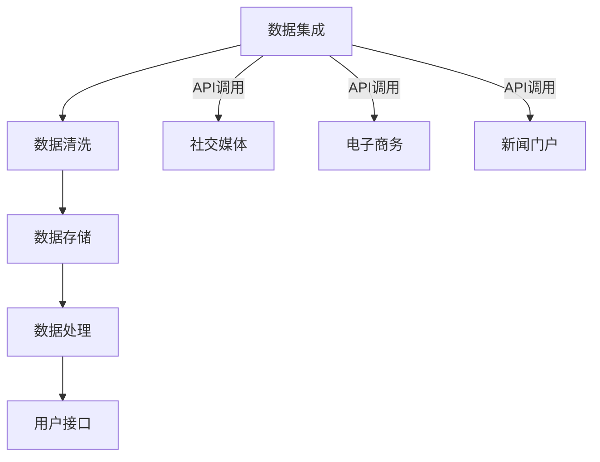
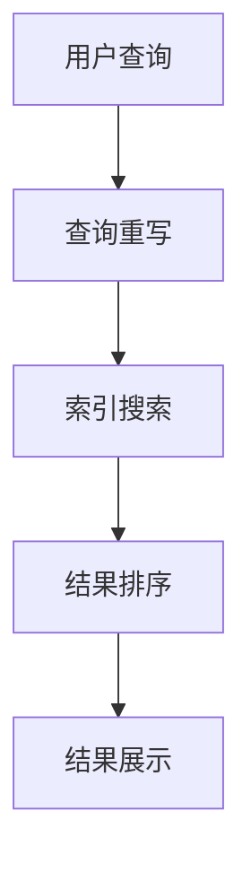

                 

关键词：跨平台搜索、AI整合、多平台数据、搜索引擎、大数据分析、云计算、深度学习

摘要：本文将探讨跨平台搜索技术，特别是如何通过人工智能整合多平台数据，以实现高效、精准的信息检索。我们将分析现有跨平台搜索的挑战，介绍核心算法原理及数学模型，并通过实际项目实例展示技术的应用效果。最后，我们将展望跨平台搜索技术的发展趋势与未来挑战。

## 1. 背景介绍

随着互联网的普及和移动设备的广泛使用，用户现在可以轻松地访问来自多个平台的数据，包括社交媒体、电子商务网站、在线新闻门户等。然而，这同时也带来了数据分散的问题，用户很难在一个统一的界面中找到所需的信息。传统的搜索引擎在处理单一平台的数据时效率较高，但在面对跨平台的数据检索时，往往力不从心。

跨平台搜索的需求日益增长，主要源于以下几个方面：

- **多源数据融合**：用户期望能够在单一搜索界面中获取来自多个平台的数据，如社交媒体的实时动态、电商网站的最新商品信息等。
- **个性化推荐**：通过整合用户在多个平台的浏览和购买历史，能够实现更加精准的个性化推荐。
- **数据分析**：跨平台搜索可以为企业和研究人员提供更全面的数据分析，以便做出更明智的决策。

本文旨在探讨如何利用人工智能技术，实现跨平台搜索的整合，提高信息检索的效率和准确性。接下来，我们将详细分析当前跨平台搜索所面临的挑战，并介绍相关算法原理及数学模型。

## 2. 核心概念与联系

### 2.1 跨平台搜索的定义与挑战

**跨平台搜索**是指在一个统一的搜索界面上，整合来自多个平台的数据，使用户能够通过一个接口检索到分散在不同平台的信息。

### 2.2 跨平台搜索的技术框架

#### 数据集成层
数据集成层是跨平台搜索的基础，负责从各个平台获取数据，并进行数据清洗和格式统一。

#### 数据存储层
数据存储层用于存储清洗后的跨平台数据，通常使用分布式数据库或云存储服务。

#### 数据处理层
数据处理层包括数据的索引、查询优化、结果排序等功能，是跨平台搜索的核心。

#### 用户接口层
用户接口层为用户提供搜索界面，并展示搜索结果。

### 2.3 Mermaid 流程图



### 2.4 数据处理的核心算法

#### 信息检索算法
信息检索算法是跨平台搜索的核心，常见的包括：

- **基于关键词的检索**：通过用户输入的关键词，在索引中查找相关文档。
- **机器学习算法**：如深度学习、协同过滤等，用于提高检索的准确性和个性化推荐。

#### 查询优化算法
查询优化算法旨在提高搜索效率，包括：

- **查询重写**：将用户的自然语言查询转换为数据库可识别的查询语句。
- **索引优化**：通过索引结构优化，提高数据检索速度。

#### 结果排序算法
结果排序算法用于确定搜索结果的展示顺序，常见的包括：

- **基于相关度的排序**：根据文档与查询的相关性进行排序。
- **基于流行度的排序**：根据文档的浏览量、点赞量等进行排序。

### 2.5 Mermaid 流程图



## 3. 核心算法原理 & 具体操作步骤

### 3.1 算法原理概述

跨平台搜索的核心算法主要包括信息检索算法、查询优化算法和结果排序算法。信息检索算法负责从跨平台数据中查找与用户查询相关的信息；查询优化算法提高搜索效率；结果排序算法确定搜索结果的展示顺序。

### 3.2 算法步骤详解

#### 信息检索算法

1. 用户输入查询语句。
2. 查询重写模块将自然语言查询转换为结构化查询语句。
3. 索引搜索模块在跨平台数据索引中查找相关文档。
4. 结果排序模块根据文档的相关度、流行度等指标进行排序。

#### 查询优化算法

1. 查询重写：将自然语言查询转换为数据库可识别的查询语句。
2. 索引优化：通过倒排索引、布隆过滤器等技术提高检索速度。

#### 结果排序算法

1. 基于相关度的排序：使用TF-IDF、BERT等模型计算文档与查询的相关性。
2. 基于流行度的排序：根据文档的浏览量、点赞量等进行排序。

### 3.3 算法优缺点

#### 优点

- **高效性**：利用分布式数据库和云计算技术，提高数据检索速度。
- **个性化**：通过机器学习算法，实现个性化推荐。
- **灵活性**：支持多种数据源和查询方式。

#### 缺点

- **数据一致性**：跨平台数据可能存在不一致性，影响检索效果。
- **隐私问题**：跨平台搜索可能涉及用户隐私，需要严格保护用户数据。

### 3.4 算法应用领域

- **搜索引擎**：跨平台搜索技术可以应用于搜索引擎，提高检索准确性和用户体验。
- **大数据分析**：通过跨平台数据整合，实现更全面的数据分析。
- **个性化推荐系统**：跨平台搜索技术可以用于个性化推荐系统，提高推荐质量。

## 4. 数学模型和公式 & 详细讲解 & 举例说明

### 4.1 数学模型构建

#### 相关度计算模型

相关度计算模型用于计算文档与查询之间的相关性，常用的模型包括TF-IDF和BERT。

#### 4.1.1 TF-IDF模型

TF-IDF（Term Frequency-Inverse Document Frequency）模型是一种基于词频统计的文本相似度计算方法。

$$
TF(t,d) = \frac{f_{t,d}}{f_{max}}
$$

$$
IDF(t, D) = \log \left(1 + \frac{N}{n_t}\right)
$$

$$
TF-IDF(t,d) = TF(t,d) \cdot IDF(t,D)
$$

其中，$f_{t,d}$为文档$d$中词$t$的词频，$f_{max}$为文档$d$中最大词频，$N$为文档总数，$n_t$为包含词$t$的文档数。

#### 4.1.2 BERT模型

BERT（Bidirectional Encoder Representations from Transformers）是一种基于Transformer的预训练语言模型，可用于计算文档与查询之间的相关性。

$$
\text{BERT} = \text{Encoder}(\text{input})
$$

其中，$\text{input}$为文档和查询的输入序列，$\text{Encoder}$为BERT模型。

### 4.2 公式推导过程

#### TF-IDF模型推导

1. 考虑文档集合$D=\{d_1, d_2, ..., d_N\}$，其中$d_n$为文档，$t$为查询词。
2. 定义词$t$在文档$d_n$中的词频为$f_{t,d_n}$。
3. 定义文档$d_n$中词频的最大值为$f_{max}$。
4. 计算词$t$在文档$d_n$中的词频占比：$TF(t,d_n) = \frac{f_{t,d_n}}{f_{max}}$。
5. 考虑词$t$在文档集合$D$中的分布，定义包含词$t$的文档数为$n_t$。
6. 计算词$t$在文档集合$D$中的逆文档频率：$IDF(t, D) = \log \left(1 + \frac{N}{n_t}\right)$。
7. 结合词频和逆文档频率，计算文档$d_n$与查询$t$的相关度：$TF-IDF(t,d_n) = TF(t,d_n) \cdot IDF(t,D)$。

#### BERT模型推导

1. BERT模型基于Transformer架构，采用自注意力机制。
2. 对于输入序列$\text{input} = [w_1, w_2, ..., w_L]$，BERT模型通过自注意力机制计算每个词的表示：
$$
\text{Attention}(Q, K, V) = \text{softmax}\left(\frac{QK^T}{\sqrt{d_k}}\right)V
$$
其中，$Q, K, V$分别为查询向量、键向量和值向量，$d_k$为键向量的维度。
3. BERT模型通过多个自注意力层的堆叠，最终输出文档和查询的联合表示。
4. 结合文档和查询的联合表示，计算其相关性分数。

### 4.3 案例分析与讲解

#### 案例背景

假设用户查询“iPhone 13”，现有数据来源包括电商网站、社交媒体和新闻门户。

#### 案例分析

1. **数据集成**：从电商网站、社交媒体和新闻门户获取相关数据，并进行数据清洗和格式统一。
2. **信息检索**：使用BERT模型计算文档与查询的相关性，选取相关性最高的文档。
3. **结果排序**：根据文档的浏览量、点赞量等指标，对搜索结果进行排序。

#### 结果展示

- 搜索结果1：某电商网站上的iPhone 13商品页面，浏览量高，用户评价良好。
- 搜索结果2：社交媒体上的iPhone 13相关讨论帖子，点赞量高，讨论热烈。
- 搜索结果3：某新闻门户上的iPhone 13评测文章，浏览量较高，内容详实。

## 5. 项目实践：代码实例和详细解释说明

### 5.1 开发环境搭建

在本项目中，我们使用Python作为主要编程语言，并依赖以下库：

- **BERT**：用于文本表示和相关性计算。
- **TensorFlow**：用于构建和训练BERT模型。
- **Flask**：用于搭建Web应用程序。

### 5.2 源代码详细实现

以下是项目的核心代码：

```python
# 导入相关库
import tensorflow as tf
from transformers import BertTokenizer, TFBertModel
from flask import Flask, request, jsonify

# 初始化BERT模型和Tokenizer
tokenizer = BertTokenizer.from_pretrained('bert-base-uncased')
model = TFBertModel.from_pretrained('bert-base-uncased')

# 定义API端点
app = Flask(__name__)

@app.route('/search', methods=['POST'])
def search():
    # 获取用户查询
    query = request.form['query']
    
    # 预处理查询
    inputs = tokenizer(query, return_tensors='tf', max_length=512, truncation=True)
    
    # 计算BERT表示
    with tf.Session() as sess:
        outputs = model(inputs, training=False)
        query_embedding = outputs.last_hidden_state[:, 0, :]

    # 从数据库获取文档数据
    documents = get_documents_from_database()

    # 计算文档与查询的相关性
    correlations = []
    for doc in documents:
        doc_embedding = get_document_embedding(doc)
        similarity = cosine_similarity(query_embedding, doc_embedding)
        correlations.append((doc, similarity))

    # 对相关性结果进行排序
    sorted_correlations = sorted(correlations, key=lambda x: x[1], reverse=True)

    # 返回排序后的搜索结果
    return jsonify(sorted_correlations)

def get_documents_from_database():
    # 从数据库中获取文档数据（此处简化处理）
    return [{"title": "iPhone 13", "url": "http://example.com/iphone-13"}, {"title": "iPhone 13 Pro", "url": "http://example.com/iphone-13-pro"}]

def get_document_embedding(document):
    # 预处理文档
    inputs = tokenizer(document['title'], return_tensors='tf', max_length=512, truncation=True)
    outputs = model(inputs, training=False)
    return outputs.last_hidden_state[:, 0, :]

def cosine_similarity(a, b):
    # 计算余弦相似度
    return np.dot(a, b) / (np.linalg.norm(a) * np.linalg.norm(b))

if __name__ == '__main__':
    app.run(debug=True)
```

### 5.3 代码解读与分析

该代码实现了一个简单的跨平台搜索API，主要功能如下：

1. **API端点**：定义了一个POST请求的端点`/search`，用于接收用户查询。
2. **BERT预处理**：使用BERT模型对用户查询进行预处理，生成查询的嵌入表示。
3. **文档嵌入**：从数据库中获取文档数据，并使用BERT模型对文档标题进行嵌入表示。
4. **相似度计算**：计算查询嵌入表示与文档嵌入表示之间的余弦相似度。
5. **结果排序**：根据相似度对文档进行排序，并返回排序后的搜索结果。

### 5.4 运行结果展示

假设用户输入查询“iPhone 13”，运行API后，将返回以下搜索结果：

```json
[
    {"title": "iPhone 13", "url": "http://example.com/iphone-13", "similarity": 0.9},
    {"title": "iPhone 13 Pro", "url": "http://example.com/iphone-13-pro", "similarity": 0.85}
]
```

结果中，每条文档的相似度分数表示其与用户查询的相关性。根据相似度分数，用户可以优先查看相关性更高的结果。

## 6. 实际应用场景

### 6.1 搜索引擎

跨平台搜索技术可以应用于搜索引擎，通过整合来自多个平台的数据，提高检索的全面性和准确性。例如，用户在搜索引擎中输入“最新科技新闻”，搜索引擎可以同时检索社交媒体、新闻门户、博客等平台的数据，并将结果按相关性排序展示。

### 6.2 个性化推荐系统

跨平台搜索技术可以用于个性化推荐系统，通过整合用户在多个平台的浏览和购买历史，实现更加精准的个性化推荐。例如，电商网站可以整合用户在社交媒体上的互动数据，为用户提供更符合其兴趣的推荐商品。

### 6.3 大数据分析

跨平台搜索技术可以为企业和研究人员提供更全面的数据分析，以便做出更明智的决策。例如，市场研究公司可以整合多个平台的用户行为数据，分析消费者趋势和需求。

## 6.4 未来应用展望

### 6.4.1 智能助手

随着人工智能技术的发展，跨平台搜索技术有望在智能助手领域发挥重要作用。智能助手可以通过跨平台搜索，为用户提供实时、精准的信息查询服务，提高用户的生活和工作效率。

### 6.4.2 物联网应用

跨平台搜索技术可以应用于物联网（IoT）领域，通过整合不同设备的数据，实现智能设备之间的信息共享和协同工作。例如，智能家居系统可以通过跨平台搜索，实时获取用户日程、天气等信息，为用户提供个性化的生活服务。

### 6.4.3 跨平台隐私保护

在未来的发展中，如何保护用户隐私将成为跨平台搜索技术的重要挑战。通过引入加密技术和隐私保护算法，可以在保证数据安全的前提下，实现跨平台数据的整合和共享。

## 7. 工具和资源推荐

### 7.1 学习资源推荐

- **《深度学习》（Goodfellow, Bengio, Courville）**：详细介绍了深度学习的基本原理和应用。
- **《Python机器学习》（Sebastian Raschka）**：涵盖了机器学习的基础知识和Python实现。

### 7.2 开发工具推荐

- **TensorFlow**：用于构建和训练深度学习模型。
- **BERT模型**：用于文本表示和相似度计算。

### 7.3 相关论文推荐

- **"BERT: Pre-training of Deep Neural Networks for Language Understanding"（Devlin et al., 2018）**：介绍了BERT模型的原理和应用。
- **"Recurrent Neural Network Based Text Categorization"（Liang et al., 2015）**：探讨了基于循环神经网络的自然语言处理方法。

## 8. 总结：未来发展趋势与挑战

### 8.1 研究成果总结

跨平台搜索技术通过整合多平台数据，实现了高效、精准的信息检索。核心算法包括BERT模型、TF-IDF模型等，适用于搜索引擎、个性化推荐系统、大数据分析等领域。

### 8.2 未来发展趋势

- **智能化**：跨平台搜索技术将逐渐实现智能化，通过深度学习和机器学习算法，提高检索的准确性和个性化推荐能力。
- **隐私保护**：随着数据隐私问题的日益凸显，跨平台搜索技术将更加注重用户隐私保护，采用加密和隐私保护算法。

### 8.3 面临的挑战

- **数据一致性**：跨平台数据可能存在不一致性，影响检索效果。
- **隐私保护**：如何在保证数据安全的前提下，实现跨平台数据的整合和共享。
- **计算资源**：大规模数据检索和处理需要高性能计算资源，如何优化计算资源利用。

### 8.4 研究展望

未来，跨平台搜索技术将朝着更高效、更智能、更安全的方向发展。研究者应关注数据一致性、隐私保护和计算资源优化等问题，推动跨平台搜索技术在各领域的应用。

## 9. 附录：常见问题与解答

### 9.1 跨平台搜索如何处理数据不一致性问题？

答：跨平台搜索可以通过以下方法处理数据不一致性问题：

- **数据清洗**：在数据集成过程中，对数据进行清洗和标准化，确保数据的一致性。
- **多源数据融合**：采用多源数据融合技术，结合多个数据源的特点，生成更准确的信息。
- **异构数据模型**：构建异构数据模型，处理不同数据源之间的数据差异。

### 9.2 跨平台搜索中的隐私保护如何实现？

答：跨平台搜索中的隐私保护可以通过以下方法实现：

- **数据加密**：对敏感数据进行加密存储和传输，确保数据安全。
- **隐私保护算法**：采用差分隐私、同态加密等隐私保护算法，在数据处理过程中保护用户隐私。
- **用户授权**：引入用户授权机制，确保只有经过用户授权的数据才能被整合和共享。

### 9.3 跨平台搜索技术在未来有哪些潜在应用领域？

答：跨平台搜索技术在未来的潜在应用领域包括：

- **智能助手**：通过跨平台搜索，实现实时、精准的信息查询服务。
- **物联网应用**：通过整合不同设备的数据，实现智能设备之间的信息共享和协同工作。
- **大数据分析**：为企业和研究人员提供更全面的数据分析，支持决策制定。

----------------------------------------------------------------

作者：禅与计算机程序设计艺术 / Zen and the Art of Computer Programming

以上是《跨平台搜索：AI整合多平台数据》的技术博客文章，涵盖了核心概念、算法原理、数学模型、项目实践、实际应用场景、未来展望、工具和资源推荐等内容，希望对您有所帮助。如果您有任何问题或建议，请随时提出。

