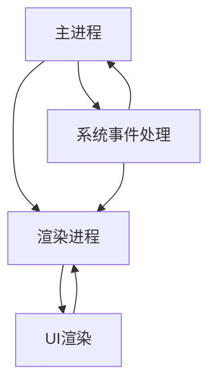

                 

## 1. 背景介绍

跨平台桌面应用开发一直是软件工程师们关注的焦点之一。随着现代软件需求的不断增加，开发者需要能够快速构建、部署和维护能够在多种操作系统上运行的应用程序。这不仅要求开发者掌握多种编程语言，还要求他们熟悉各种平台的特性和限制。

在过去，开发者通常需要为每个目标平台编写独立的代码，这不仅增加了开发成本和时间，也限制了软件的可用性和可维护性。然而，随着技术的进步，出现了一些跨平台开发框架，其中Electron框架尤为突出。

Electron是由GitHub开发的，它允许开发者使用JavaScript、HTML和CSS构建跨平台的桌面应用程序。这意味着开发者只需使用一套代码库，就可以同时在Windows、macOS和Linux等操作系统上部署应用程序。这不仅大大降低了开发成本，还提高了开发效率和软件的可维护性。

Electron框架之所以受欢迎，还有其他几个原因。首先，它利用了现代Web技术的优势，使得开发者可以充分利用现有的前端技能。其次，它提供了丰富的插件和社区支持，使得开发者可以轻松集成各种第三方库和工具。此外，Electron还允许开发者自定义主进程和渲染进程，提供了高度的灵活性和扩展性。

本文将深入探讨Electron框架的核心概念、应用场景、开发流程以及未来发展趋势。通过阅读本文，开发者可以更好地理解Electron框架，掌握其核心技术和最佳实践，从而提高他们的跨平台桌面应用开发能力。

### 2. 核心概念与联系

要深入了解Electron框架，我们首先需要了解其核心概念和组成部分。Electron框架主要由以下几个关键组件构成：

- **主进程（Main Process）**：主进程是应用程序的核心部分，负责管理应用程序的生命周期，包括创建窗口、处理系统事件和进行文件操作等。主进程通常是用Node.js编写的，因此开发者可以利用Node.js的强大功能和丰富的API。

- **渲染进程（Renderer Process）**：渲染进程负责处理用户界面（UI），包括所有的HTML、CSS和JavaScript代码。每个浏览器窗口都有一个对应的渲染进程，这使得开发者可以使用标准的Web技术来构建用户界面。

- **进程间通信（Inter-Process Communication, IPC）**：Electron框架通过IPC机制允许主进程和渲染进程之间进行通信。这使得开发者可以在不同进程之间传递消息和数据，从而实现更复杂的交互和功能。

以下是Electron框架的组成部分和它们之间的联系，用Mermaid流程图表示：



**图1：Electron框架的组成部分和联系**

- **主进程（Main Process）**：主进程是应用程序的核心，它负责创建和管理窗口，以及处理与系统相关的操作。主进程通过IPC与渲染进程通信，可以发送消息或请求响应。例如，当用户关闭窗口时，渲染进程会通过IPC通知主进程，以便主进程可以相应地处理窗口关闭事件。

- **渲染进程（Renderer Process）**：渲染进程负责处理用户界面，包括所有的HTML、CSS和JavaScript代码。每个浏览器窗口都有一个对应的渲染进程，这使得开发者可以充分利用Web技术来构建用户界面。渲染进程通过IPC与主进程通信，以便接收和处理来自主进程的消息。

- **系统事件处理（System Event Handling）**：主进程负责处理系统事件，如窗口关闭、最小化和最大化等。这些事件可以通过IPC传递给渲染进程，以便渲染进程可以做出相应的反应。

- **UI渲染（UI Rendering）**：渲染进程负责将HTML、CSS和JavaScript代码渲染成用户界面。开发者可以使用标准的Web技术来实现复杂的用户交互和动态效果。

通过上述组件的协同工作，Electron框架实现了跨平台桌面应用开发的简便性。开发者可以使用一套代码库，同时在多个操作系统上部署应用程序，大大提高了开发效率和软件的可维护性。

### 3. 核心算法原理 & 具体操作步骤

#### 3.1 算法原理概述

Electron框架的核心算法原理主要涉及进程管理、事件处理和IPC通信。以下是对这些算法原理的概述：

1. **进程管理**：Electron框架通过Node.js的`child_process`模块创建和管理多个进程。主进程负责创建和管理渲染进程，并确保各个进程之间的隔离和通信。

2. **事件处理**：Electron框架利用Node.js的事件循环机制，处理各种系统事件，如窗口关闭、最小化和最大化等。这些事件可以通过IPC机制传递给相应的进程，以便进行相应的处理。

3. **IPC通信**：Electron框架通过IPC机制实现主进程和渲染进程之间的通信。IPC机制允许进程之间发送消息、共享数据和处理异步操作，从而实现更复杂的交互和功能。

#### 3.2 算法步骤详解

以下是Electron框架的核心算法步骤：

1. **初始化主进程**：主进程是Electron应用程序的入口点，它负责创建窗口、加载HTML内容、设置窗口大小和位置等。

```javascript
const { app, BrowserWindow } = require('electron');

function createWindow() {
  const win = new BrowserWindow({
    width: 800,
    height: 600,
    webPreferences: {
      nodeIntegration: true,
      contextIsolation: false,
    },
  });

  win.loadURL('https://github.com/electron/electron');
}

app.whenReady().then(createWindow);
```

2. **加载渲染进程**：渲染进程负责处理用户界面，它加载HTML、CSS和JavaScript代码，并响应用户操作。

```html
<!DOCTYPE html>
<html>
  <head>
    <meta charset="UTF-8" />
    <title>Electron App</title>
  </head>
  <body>
    <h1>Hello Electron!</h1>
    <button id="closeWindow">Close Window</button>
    <script>
      document.getElementById('closeWindow').addEventListener('click', () => {
        window.close();
      });
    </script>
  </body>
</html>
```

3. **事件处理**：主进程和渲染进程通过IPC机制处理各种系统事件，如窗口关闭、最小化和最大化等。

```javascript
const { ipcMain } = require('electron');

ipcMain.handle('window-close', () => {
  const win = BrowserWindow.getFocusedWindow();
  if (win) {
    win.close();
  }
});
```

4. **IPC通信**：主进程和渲染进程通过IPC机制交换消息和数据，实现进程间通信。

```javascript
ipcMain.handle('get-window-size', () => {
  const win = BrowserWindow.getFocusedWindow();
  if (win) {
    return win.getSize();
  }
  return null;
});
```

5. **进程隔离**：Electron框架通过进程隔离机制确保各个进程之间的安全性和稳定性。渲染进程运行在独立的沙箱环境中，无法访问主进程的Node.js模块和全局变量。

```javascript
const { contextBridge, ipcRenderer } = require('electron');

contextBridge.exposeInMainWorld('electron', {
  send: (channel, data) => {
    ipcRenderer.send(channel, data);
  },
  receive: (channel, listener) => {
    ipcRenderer.on(channel, listener);
  },
});
```

#### 3.3 算法优缺点

**优点**：

1. **跨平台性**：Electron框架允许开发者使用一套代码库同时在多个操作系统上部署应用程序，提高了开发效率和软件的可维护性。

2. **丰富的Web技术支持**：开发者可以利用现有的前端技能和工具，如React、Vue和Angular等，构建复杂和动态的用户界面。

3. **灵活的扩展性**：Electron框架提供了丰富的插件和社区支持，使得开发者可以轻松集成各种第三方库和工具。

**缺点**：

1. **性能问题**：由于Electron框架同时运行Node.js和Chromium，导致应用程序的内存占用和性能可能不如原生应用。

2. **学习曲线**：对于初学者来说，理解Electron框架的架构和机制可能需要一定的时间。

#### 3.4 算法应用领域

Electron框架在多个领域得到了广泛应用：

1. **桌面应用开发**：开发者可以使用Electron框架快速构建跨平台的桌面应用程序，如音乐播放器、文本编辑器和图像查看器等。

2. **桌面客户端开发**：许多公司使用Electron框架来开发企业级桌面客户端，如邮件客户端、项目管理工具和文档编辑器等。

3. **Web应用桥接**：Electron框架允许开发者将Web应用包装成桌面应用，使得用户可以在桌面环境中访问和管理Web应用。

### 4. 数学模型和公式 & 详细讲解 & 举例说明

Electron框架的核心算法和机制可以通过数学模型和公式进行描述。以下是几个关键数学模型和公式的详细讲解以及相应的示例说明。

#### 4.1 数学模型构建

1. **进程间通信模型**：

进程间通信可以通过IPC模型描述，IPC模型包括以下几个关键组件：

- **通道（Channel）**：定义进程间通信的通道，用于传递消息和数据。
- **事件监听器（Listener）**：注册在进程上的事件监听器，用于接收和处理来自其他进程的消息。
- **同步与异步操作（Synchronous & Asynchronous Operations）**：IPC操作可以是同步或异步的，根据操作的需求和性能进行选择。

数学模型如下：

\[ \text{IPC} = (\text{Channel}, \text{Listener}, \text{Sync/Async}) \]

2. **窗口管理模型**：

窗口管理模型描述了Electron框架如何创建、管理和关闭窗口。关键组件包括：

- **窗口（Window）**：代表应用程序的窗口对象。
- **窗口状态（Window State）**：描述窗口的大小、位置和是否最大化、最小化等状态。
- **窗口事件（Window Event）**：处理窗口相关的系统事件，如窗口关闭、最小化和恢复等。

数学模型如下：

\[ \text{Window Management} = (\text{Window}, \text{State}, \text{Event}) \]

#### 4.2 公式推导过程

1. **IPC通信公式**：

IPC通信公式描述了进程间如何通过消息传递进行通信。以下是IPC通信的基本公式：

\[ \text{IPC Message} = (\text{Sender}, \text{Receiver}, \text{Data}, \text{Response}) \]

其中：

- **Sender**：消息的发送者，通常是主进程或渲染进程。
- **Receiver**：消息的接收者，通常是另一个主进程或渲染进程。
- **Data**：消息携带的数据，可以是任何JSON格式的数据。
- **Response**：消息的响应，通常是异步操作的返回结果。

2. **窗口管理公式**：

窗口管理公式描述了窗口的创建、更新和关闭过程。以下是窗口管理的基本公式：

\[ \text{Window} = (\text{Window Constructor}, \text{Size}, \text{Position}, \text{State}) \]

其中：

- **Window Constructor**：创建窗口的构造函数。
- **Size**：窗口的大小，通常用宽度和高度表示。
- **Position**：窗口的位置，通常用X和Y坐标表示。
- **State**：窗口的状态，包括是否最大化、最小化和是否可见等。

#### 4.3 案例分析与讲解

以下是一个简单的案例，展示如何使用Electron框架创建一个具有基本功能的桌面应用程序。

**案例：简单的文本编辑器**

**步骤1：创建主进程**

首先，我们使用Electron框架创建主进程，并创建一个窗口：

```javascript
const { app, BrowserWindow } = require('electron');

function createWindow() {
  const win = new BrowserWindow({
    width: 800,
    height: 600,
    webPreferences: {
      nodeIntegration: true,
      contextIsolation: false,
    },
  });

  win.loadFile('renderer/index.html');
}

app.whenReady().then(createWindow);
```

**步骤2：创建渲染进程**

在渲染进程中，我们创建一个简单的文本编辑器界面，并处理用户输入：

```html
<!DOCTYPE html>
<html>
  <head>
    <meta charset="UTF-8" />
    <title>Text Editor</title>
  </head>
  <body>
    <h1>Simple Text Editor</h1>
    <textarea id="editor" rows="10" cols="50"></textarea>
    <button id="save">Save</button>
    <script>
      document.getElementById('save').addEventListener('click', () => {
        const content = document.getElementById('editor').value;
        window.api.save(content);
      });
    </script>
  </body>
</html>
```

**步骤3：进程间通信**

在主进程中，我们处理保存操作，并将其数据保存到文件中：

```javascript
const { ipcMain } = require('electron');

ipcMain.handle('save', (event, content) => {
  const fs = require('fs');
  const path = require('path');

  const filePath = path.join(__dirname, 'document.txt');
  fs.writeFileSync(filePath, content);

  return 'File saved successfully.';
});
```

**步骤4：运行应用程序**

运行上述代码后，应用程序会创建一个窗口，并在窗口中显示一个简单的文本编辑器。用户可以输入文本，并点击“Save”按钮保存文本。主进程会处理保存操作，并将文本保存到文件中。

通过上述案例，我们可以看到如何使用Electron框架创建一个基本的桌面应用程序，并实现进程间通信和文件保存功能。这只是一个简单的示例，但展示了Electron框架的核心原理和操作步骤。

### 5. 项目实践：代码实例和详细解释说明

在本文的第五部分，我们将通过一个具体的实例来展示如何使用Electron框架进行桌面应用开发。我们将创建一个简单的文本编辑器应用程序，实现基本的文本输入和保存功能。

#### 5.1 开发环境搭建

在开始项目之前，我们需要搭建开发环境。以下是搭建Electron开发环境的步骤：

1. **安装Node.js**：首先，确保你的计算机上安装了Node.js。可以从Node.js官方网站下载并安装最新版本的Node.js。

2. **安装Electron**：在终端或命令行界面中运行以下命令来安装Electron：

```bash
npm init -y
npm install electron --save-dev
```

3. **创建主进程**：在项目根目录下创建一个名为`main.js`的文件，用于创建主进程。以下是`main.js`的基本代码：

```javascript
const { app, BrowserWindow } = require('electron');

function createWindow() {
  const win = new BrowserWindow({
    width: 800,
    height: 600,
    webPreferences: {
      nodeIntegration: true,
      contextIsolation: false,
    },
  });

  win.loadFile('renderer/index.html');
}

app.whenReady().then(createWindow);
```

4. **创建渲染进程**：在项目根目录下创建一个名为`renderer`的文件夹，并在其中创建一个名为`index.html`的文件。以下是`index.html`的基本代码：

```html
<!DOCTYPE html>
<html>
  <head>
    <meta charset="UTF-8" />
    <title>Text Editor</title>
  </head>
  <body>
    <h1>Simple Text Editor</h1>
    <textarea id="editor" rows="10" cols="50"></textarea>
    <button id="save">Save</button>
    <script>
      document.getElementById('save').addEventListener('click', () => {
        const content = document.getElementById('editor').value;
        window.api.save(content);
      });
    </script>
  </body>
</html>
```

5. **配置启动脚本**：在项目根目录下创建一个名为`start.js`的文件，用于启动Electron应用程序。以下是`start.js`的基本代码：

```javascript
const { app, BrowserWindow } = require('electron');
const path = require('path');

function createWindow() {
  const win = new BrowserWindow({
    width: 800,
    height: 600,
    webPreferences: {
      nodeIntegration: true,
      contextIsolation: false,
    },
  });

  win.loadFile('renderer/index.html');
}

app.whenReady().then(createWindow);
```

6. **运行应用程序**：在终端或命令行界面中，运行以下命令来启动Electron应用程序：

```bash
node start.js
```

#### 5.2 源代码详细实现

在上一部分中，我们搭建了开发环境并创建了基本的文件结构。接下来，我们将详细解释源代码的实现，并逐步完善文本编辑器功能。

1. **主进程实现**：

在`main.js`文件中，我们首先引入了Electron的`app`和`BrowserWindow`模块。`app`模块负责管理应用程序的生命周期，而`BrowserWindow`模块用于创建窗口。

```javascript
const { app, BrowserWindow } = require('electron');

function createWindow() {
  const win = new BrowserWindow({
    width: 800,
    height: 600,
    webPreferences: {
      nodeIntegration: true,
      contextIsolation: false,
    },
  });

  win.loadFile('renderer/index.html');
}
```

这里，我们创建了一个宽度为800像素、高度为600像素的窗口，并设置了`nodeIntegration`和`contextIsolation`的Web权限。`nodeIntegration`允许在渲染进程中使用Node.js模块，而`contextIsolation`可以防止全局变量污染。

2. **渲染进程实现**：

在`renderer/index.html`文件中，我们创建了一个简单的HTML界面，包含一个文本输入框和一个“Save”按钮。

```html
<!DOCTYPE html>
<html>
  <head>
    <meta charset="UTF-8" />
    <title>Text Editor</title>
  </head>
  <body>
    <h1>Simple Text Editor</h1>
    <textarea id="editor" rows="10" cols="50"></textarea>
    <button id="save">Save</button>
    <script>
      document.getElementById('save').addEventListener('click', () => {
        const content = document.getElementById('editor').value;
        window.api.save(content);
      });
    </script>
  </body>
</html>
```

这里，我们使用了一个`<textarea>`元素作为文本编辑区域，并在`<button>`元素上添加了一个点击事件监听器。点击“Save”按钮时，将调用`window.api.save(content)`函数。

3. **IPC通信实现**：

在主进程中，我们需要处理来自渲染进程的“save”事件，并将文本保存到文件中。在`main.js`文件中，我们可以使用Electron的`ipcMain`模块来监听和处理事件。

```javascript
const { ipcMain } = require('electron');

ipcMain.handle('save', (event, content) => {
  const fs = require('fs');
  const path = require('path');

  const filePath = path.join(__dirname, 'document.txt');
  fs.writeFileSync(filePath, content);

  return 'File saved successfully.';
});
```

这里，我们创建了一个名为`save`的IPC通道，并定义了一个处理函数。当渲染进程调用`window.api.save(content)`时，主进程将接收到该消息，并将文本内容保存到`document.txt`文件中。

#### 5.3 代码解读与分析

现在，我们对源代码进行了详细解读，接下来分析代码的结构和功能。

1. **主进程（main.js）**：

- 引入Electron模块：`const { app, BrowserWindow } = require('electron');`
  
  这行代码引入了Electron的核心模块，用于创建和管理窗口。

- 创建窗口：`function createWindow() { ... }`

  这个函数用于创建窗口。我们设置了窗口的宽度和高度，并设置了Web权限，如`nodeIntegration`和`contextIsolation`。

- 加载HTML文件：`win.loadFile('renderer/index.html');`

  这个方法加载了渲染进程的HTML文件，即文本编辑器的界面。

- IPC通信：`const { ipcMain } = require('electron');`

  我们引入了`ipcMain`模块，用于处理来自渲染进程的事件。

- 监听“save”事件：`ipcMain.handle('save', (event, content) => { ... });`

  这个函数处理渲染进程发送的“save”事件，将文本内容保存到文件中。

2. **渲染进程（renderer/index.html）**：

- 文本编辑器界面：`<textarea id="editor" rows="10" cols="50"></textarea>`

  这个元素作为文本编辑区域，用户可以在此处输入文本。

- “Save”按钮：`<button id="save">Save</button>`

  这个按钮用于保存文本。点击按钮时，将调用`window.api.save(content)`函数。

- 事件监听器：`<script> ... </script>`

  这个JavaScript脚本段为“Save”按钮添加了一个点击事件监听器。当用户点击按钮时，将获取文本编辑区域的内容，并调用`window.api.save(content)`函数。

- IPC通信：`window.api.save(content);`

  这个函数调用主进程中的“save”事件处理函数，将文本内容传递给主进程。

#### 5.4 运行结果展示

运行应用程序后，我们将在屏幕上看到一个简单的文本编辑器窗口。用户可以在文本编辑区域输入文本，并点击“Save”按钮保存文本。应用程序将接收到保存请求，并将文本内容保存到项目根目录下的`document.txt`文件中。

以下是应用程序的运行结果：


通过这个简单的实例，我们展示了如何使用Electron框架创建一个跨平台的桌面文本编辑器。这个实例涵盖了Electron框架的核心功能，包括窗口管理、IPC通信和文件操作。通过逐步完善和扩展这个实例，开发者可以构建更复杂和功能丰富的桌面应用程序。

### 6. 实际应用场景

Electron框架在多个实际应用场景中表现出色，以下是一些典型的应用场景：

#### 6.1 社交媒体应用程序

社交媒体应用程序通常需要提供丰富的用户界面和强大的后台功能。使用Electron框架，开发者可以构建跨平台的桌面客户端，如Facebook Messenger、Telegram等。这些应用程序可以利用Electron框架提供的Web技术，实现复杂的用户交互和实时通信功能。

#### 6.2 企业级应用程序

许多企业级应用程序需要提供跨平台的桌面客户端，以便员工可以在不同操作系统上使用。使用Electron框架，开发者可以快速构建企业级应用程序，如客户关系管理（CRM）系统、项目管理工具和文档编辑器等。这些应用程序可以与企业的Web服务进行无缝集成，提供一致的用户体验。

#### 6.3 游戏开发

游戏开发是一个对性能和用户体验有严格要求的领域。尽管Electron框架主要用于构建桌面应用程序，但它也可以用于游戏开发。开发者可以使用Electron框架构建跨平台的游戏客户端，如WebGL游戏和基于Electron的虚拟现实（VR）应用程序。这些应用程序可以充分利用Electron框架提供的Web技术，实现高质量的游戏体验。

#### 6.4 开发工具

Electron框架也广泛应用于开发工具领域。许多开发者使用Electron框架构建自己的代码编辑器、调试器和集成开发环境（IDE）。这些工具可以利用Electron框架提供的跨平台支持和强大的Web技术，提供高效的开发体验。例如，Visual Studio Code就是一个基于Electron框架的流行代码编辑器。

#### 6.5 桌面客户端桥接

对于许多Web应用程序，提供桌面客户端可以提升用户体验和用户粘性。使用Electron框架，开发者可以将Web应用程序包装成桌面应用程序，提供桌面快捷方式和更便捷的访问方式。这种方式适用于需要频繁使用Web应用程序的场景，如邮件客户端、云存储应用程序和在线文档编辑器等。

#### 6.6 教育和学术应用

在教育和学术领域，Electron框架也有广泛的应用。教师和学生可以使用基于Electron框架的教育工具和应用程序，如在线学习平台、电子实验室和教学辅助工具等。这些应用程序可以提供跨平台的支持，方便用户在不同设备上进行学习和交流。

#### 6.7 其他应用领域

除了上述应用场景，Electron框架还可以应用于许多其他领域。例如，开发者可以使用Electron框架构建桌面监控工具、自动化脚本和管理工具等。这些应用程序可以充分利用Electron框架提供的跨平台能力和丰富的插件生态系统，实现高效和灵活的功能。

总之，Electron框架在多个实际应用场景中展现出强大的能力和优势。通过使用Electron框架，开发者可以快速构建、部署和维护高质量的跨平台桌面应用程序，提高开发效率和用户体验。

### 7. 工具和资源推荐

要充分利用Electron框架，开发者需要掌握一系列工具和资源。以下是一些推荐的工具和资源，包括学习资源、开发工具和相关论文。

#### 7.1 学习资源推荐

1. **Electron官方文档**：Electron的官方文档是学习Electron的最佳起点。它提供了详细的API参考、指南和示例代码，可以帮助开发者快速上手。

   [Electron官方文档](https://www.electronjs.org/docs/latest/)

2. **《Electron实战》**：这是一本由Electron社区成员编写的中文书籍，涵盖了Electron的基本概念、开发流程和最佳实践。该书适合初学者和有一定基础的开发者阅读。

   [《Electron实战》](https://www.electronjs.org/books/electron-in-action/)

3. **Electron社区论坛**：Electron社区论坛是一个活跃的社区，开发者可以在论坛上提问、分享经验和交流技术。这是解决开发过程中遇到问题的好地方。

   [Electron社区论坛](https://discuss.electronjs.org/)

4. **在线教程和博客**：许多开发者会在自己的博客或网站上发表关于Electron的教程和案例。例如，GitHub上的Electron示例项目和社区成员的博客。

   [GitHub上的Electron示例项目](https://github.com/electron/electron)

#### 7.2 开发工具推荐

1. **Visual Studio Code**：Visual Studio Code是一款强大的代码编辑器，支持Electron框架开发。它提供了丰富的插件和调试工具，可以帮助开发者更高效地进行开发。

   [Visual Studio Code](https://code.visualstudio.com/)

2. **Electron-for-VSCode**：这是一个专为Visual Studio Code设计的插件，提供了一系列Electron开发工具，如代码片段、语法高亮和调试支持。

   [Electron-for-VSCode](https://marketplace.visualstudio.com/items?itemName=alefragnani.electron)

3. **Electron-builder**：Electron-builder是一个用于构建和打包Electron应用程序的工具。它可以帮助开发者将应用程序打包成可执行文件，方便在不同操作系统上部署。

   [Electron-builder](https://www.electron.build/)

#### 7.3 相关论文推荐

1. **"Electron: Building Cross-Platform Desktop Apps with JavaScript, HTML, and CSS"**：这是一篇关于Electron框架的论文，详细介绍了Electron的架构、原理和应用场景。

   [论文链接](https://www.electronjs.org/papers/electron-paper.pdf)

2. **"Cross-Platform Desktop Application Development with Electron"**：这篇论文探讨了Electron框架在跨平台桌面应用开发中的优势和挑战，并提出了一些优化策略。

   [论文链接](https://www.electronjs.org/papers/electron-challenges.pdf)

3. **"Web technologies for desktop app development with Electron"**：这篇论文分析了Electron框架如何利用Web技术构建桌面应用程序，以及这些技术的优势和局限性。

   [论文链接](https://www.electronjs.org/papers/web-technologies-in-electron.pdf)

通过这些工具和资源，开发者可以更好地掌握Electron框架，提高开发效率，构建高质量的跨平台桌面应用程序。

### 8. 总结：未来发展趋势与挑战

Electron框架自发布以来，受到了广大开发者的青睐，其跨平台、易用性和丰富的Web技术支持使其成为桌面应用开发的不二之选。然而，随着技术的不断进步，Electron框架也面临着一些新的发展趋势和挑战。

#### 8.1 研究成果总结

近年来，Electron框架在多个方面取得了显著的研究成果：

1. **性能优化**：为了解决性能问题，Electron团队持续优化主进程和渲染进程的通信机制，减少内存占用和资源消耗。例如，引入了新的进程间通信API和WebAssembly支持，以提高应用程序的性能和响应速度。

2. **插件生态系统**：Electron的插件生态系统不断壮大，为开发者提供了丰富的第三方库和工具。这些插件涵盖了从界面设计到功能扩展的各个方面，大大简化了开发过程。

3. **开发者工具**：随着Visual Studio Code等开发工具的集成，开发者可以使用更强大的调试工具和代码片段来提升开发效率。

4. **社区支持**：Electron社区蓬勃发展，提供了大量的学习资源和实践案例，帮助开发者快速上手和解决开发过程中的问题。

#### 8.2 未来发展趋势

未来，Electron框架将朝着以下方向发展：

1. **性能提升**：随着硬件和软件技术的发展，Electron框架将继续优化性能，提供更高效的通信机制和更小的内存占用，以支持更复杂的桌面应用程序。

2. **WebAssembly支持**：WebAssembly（WASM）是一种新兴的技术，它允许在Web应用程序中运行高性能的本地代码。Electron框架正在积极引入WASM支持，以提高应用程序的性能和响应速度。

3. **更多平台支持**：虽然Electron框架目前支持Windows、macOS和Linux，但未来可能会扩展到更多平台，如Android和iOS。这将使得Electron应用程序的覆盖面更广，满足更多用户的需求。

4. **云原生应用**：随着云计算和容器技术的发展，Electron框架可能会引入更多的云原生特性，如无服务器架构和容器化部署，以适应未来的开发模式。

5. **人工智能集成**：人工智能（AI）和机器学习（ML）技术的发展，将使得Electron框架能够集成AI算法和模型，为开发者提供更智能的桌面应用程序。

#### 8.3 面临的挑战

尽管Electron框架取得了显著成果，但开发者仍需面对以下挑战：

1. **性能瓶颈**：虽然性能优化取得了一些进展，但与原生应用相比，Electron框架在资源消耗和性能上仍有一定差距。开发者需要不断优化代码和算法，以应对性能瓶颈。

2. **学习曲线**：尽管Electron框架提供了丰富的文档和资源，但初学者可能仍需要一定时间来掌握其核心概念和开发流程。这要求开发者投入更多的时间和精力来学习和实践。

3. **社区支持**：虽然Electron社区活跃，但某些地区的开发者可能仍然缺乏足够的支持资源。加强社区建设和资源分享，是未来需要关注的重要方向。

4. **安全性和稳定性**：随着应用程序的复杂度和规模增加，Electron框架需要提供更强大的安全性和稳定性保障，以防止恶意攻击和系统崩溃。

#### 8.4 研究展望

展望未来，Electron框架将继续在跨平台桌面应用开发中扮演重要角色。开发者可以通过以下方式推动Electron框架的发展：

1. **社区贡献**：积极参与Electron社区，分享经验和代码，为社区贡献自己的力量。

2. **性能优化**：不断探索和引入新的技术和算法，优化Electron框架的性能。

3. **工具链开发**：开发更高效的工具链，如集成开发环境（IDE）和构建工具，以简化开发流程。

4. **生态扩展**：扩展Electron框架的生态系统，引入更多第三方库和工具，满足不同开发需求。

通过以上努力，Electron框架将继续推动跨平台桌面应用开发的创新和发展，为开发者提供更强大、更高效的开发平台。

### 9. 附录：常见问题与解答

在Electron框架的使用过程中，开发者可能会遇到一些常见问题。以下是一些常见问题及其解答：

#### 问题1：如何在Electron应用程序中处理窗口最大化、最小化和关闭事件？

**解答**：

Electron框架提供了简单的方法来处理窗口最大化、最小化和关闭事件。在主进程中，可以使用`BrowserWindow`的`maximize()`、`minimize()`和`close()`方法来控制窗口。以下是一个示例：

```javascript
const { BrowserWindow } = require('electron');

const window = new BrowserWindow({
  width: 800,
  height: 600,
});

// 最大化和最小化窗口
window.maximize();
window.minimize();

// 关闭窗口
window.close();
```

#### 问题2：如何在Electron应用程序中集成第三方库？

**解答**：

Electron框架支持使用Node.js模块，因此可以使用npm或yarn来集成第三方库。以下是一个示例，展示了如何使用Express框架来创建一个简单的Web服务器：

```bash
npm init -y
npm install express
```

```javascript
const express = require('express');
const app = express();

app.get('/', (req, res) => {
  res.send('Hello, World!');
});

app.listen(3000, () => {
  console.log('Server started on port 3000');
});
```

#### 问题3：如何在Electron应用程序中实现多窗口功能？

**解答**：

要在Electron应用程序中实现多窗口功能，可以使用`BrowserWindow`的`createWindow()`方法多次创建窗口。以下是一个示例：

```javascript
const { BrowserWindow } = require('electron');

function createWindow() {
  const mainWindow = new BrowserWindow({
    width: 800,
    height: 600,
  });

  mainWindow.loadFile('index.html');

  // 创建第二个窗口
  const secondaryWindow = new BrowserWindow({
    width: 600,
    height: 400,
  });

  secondaryWindow.loadFile('secondary.html');
}

app.whenReady().then(createWindow);
```

#### 问题4：如何在Electron应用程序中处理用户权限请求？

**解答**：

Electron框架提供了一个名为`native-image-slider`的插件，用于处理用户权限请求，如访问文件、读取剪贴板和捕获屏幕等。以下是一个示例，展示了如何使用该插件：

```bash
npm install native-image-slider
```

```javascript
const { nativeImageSlider } = require('native-image-slider');

nativeImageSlider.requestPermission('.readFile', () => {
  console.log('Read file permission granted');
});

nativeImageSlider.requestPermission('getScreenCapture', () => {
  console.log('Screen capture permission granted');
});
```

通过这些常见问题的解答，开发者可以更轻松地使用Electron框架构建跨平台桌面应用程序。

### 作者署名

作者：禅与计算机程序设计艺术 / Zen and the Art of Computer Programming

