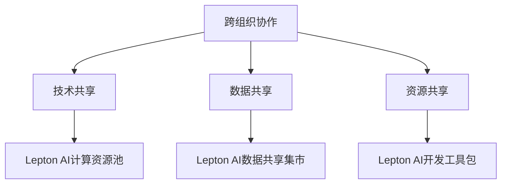

                 

关键词：跨组织协作、AI开放平台、Lepton AI、技术共享、数据共享、AI应用、协作机制、生态系统

>摘要：本文探讨了跨组织AI协作的重要性以及Lepton AI开放平台如何实现不同组织间的AI技术共享和数据共享，从而推动AI应用的发展。文章将从背景介绍、核心概念、算法原理、数学模型、项目实践、实际应用场景、工具和资源推荐以及未来发展趋势等方面进行全面阐述。

## 1. 背景介绍

在当今数字化时代，人工智能（AI）已经成为各行各业转型升级的核心驱动力。然而，AI技术的发展和应用往往面临着诸多挑战，其中之一便是跨组织的协作问题。不同组织之间的数据、技术和资源往往是孤立的，难以实现有效共享，这限制了AI技术的广泛推广和应用。

为了解决这一问题，许多企业和机构开始构建开放的AI平台，以促进跨组织协作。Lepton AI开放平台便是其中之一，它旨在通过开放的技术共享和数据共享，推动AI应用的发展，实现不同组织间的协同创新。

## 2. 核心概念与联系

### 2.1 跨组织协作

跨组织协作是指不同组织之间为了共同的目标或任务而进行的合作。在AI领域，跨组织协作主要体现在以下几个方面：

- **技术共享**：不同组织分享各自研发的AI技术，以便于其他组织学习和借鉴。
- **数据共享**：不同组织共享数据资源，以促进AI算法的优化和模型的训练。
- **资源共享**：不同组织共同使用计算资源、存储资源和网络资源，以降低成本和提高效率。

### 2.2 Lepton AI开放平台

Lepton AI开放平台是一个基于云计算的AI技术共享平台，它通过以下几个关键组件实现跨组织协作：

- **计算资源池**：提供高效的计算资源，支持大规模的AI模型训练和推理。
- **数据共享集市**：汇集不同组织的数据资源，实现数据的开放和共享。
- **算法市场**：提供各种AI算法和模型，供其他组织下载和使用。
- **开发工具包**：提供丰富的开发工具包，支持开发者快速搭建AI应用。

### 2.3 Mermaid 流程图



## 3. 核心算法原理 & 具体操作步骤

### 3.1 算法原理概述

Lepton AI开放平台的核心算法主要基于以下几个原理：

- **联邦学习**：通过将数据保留在各自组织内，实现不同组织间的协同训练，从而保护数据隐私。
- **分布式计算**：利用云计算资源，实现大规模的并行计算，提高计算效率。
- **区块链技术**：确保数据共享过程中的安全性和可追溯性。

### 3.2 算法步骤详解

1. **初始化**：各组织部署联邦学习框架，并初始化模型。
2. **通信**：各组织之间通过加密通信，共享模型参数和梯度信息。
3. **训练**：各组织使用共享的模型参数和本地数据进行训练，更新模型参数。
4. **评估**：使用测试集评估模型性能，并进行模型调优。
5. **发布**：将训练完成的模型发布到算法市场，供其他组织使用。

### 3.3 算法优缺点

#### 优点：

- **数据隐私保护**：通过联邦学习，各组织无需共享原始数据，有效保护数据隐私。
- **高效计算**：利用分布式计算，提高计算效率和模型训练速度。
- **安全可靠**：采用区块链技术，确保数据共享过程中的安全性和可追溯性。

#### 缺点：

- **通信开销**：各组织之间的频繁通信可能导致通信开销较大。
- **模型性能**：由于数据分布不均匀，模型性能可能受到一定程度的影响。

### 3.4 算法应用领域

Lepton AI开放平台的核心算法广泛应用于以下几个领域：

- **金融**：用于风险评估、欺诈检测和个性化投资建议等。
- **医疗**：用于疾病预测、治疗方案优化和健康管理等。
- **零售**：用于需求预测、库存管理和个性化推荐等。

## 4. 数学模型和公式 & 详细讲解 & 举例说明

### 4.1 数学模型构建

Lepton AI开放平台的核心算法可以表示为以下数学模型：

$$
\begin{aligned}
\theta_{t+1} &= \theta_{t} - \alpha \frac{\partial L(\theta_{t})}{\partial \theta} \\
L(\theta) &= \frac{1}{2} \sum_{i=1}^{n} \frac{1}{2} (y_i - \theta^T x_i)^2
\end{aligned}
$$

其中，$\theta$ 表示模型参数，$L(\theta)$ 表示损失函数，$\alpha$ 表示学习率，$y_i$ 表示第 $i$ 个样本的标签，$x_i$ 表示第 $i$ 个样本的特征。

### 4.2 公式推导过程

公式推导过程如下：

1. **损失函数定义**：损失函数用于衡量模型预测值与实际标签之间的差距。
2. **梯度下降**：通过计算损失函数关于模型参数的梯度，不断更新模型参数，以最小化损失函数。
3. **全局优化**：通过联邦学习，将局部优化结果汇总，实现全局最优。

### 4.3 案例分析与讲解

假设有两个组织A和B，它们分别拥有不同的数据集。组织A的数据集包含1000个样本，组织B的数据集包含2000个样本。使用Lepton AI开放平台进行联邦学习，实现两个组织间的协同训练。

1. **初始化**：各组织初始化模型参数$\theta_0$。
2. **通信**：组织A将模型参数$\theta_t$发送给组织B，组织B将模型参数$\theta_t$发送给组织A。
3. **训练**：组织A使用本地数据进行训练，组织B使用本地数据进行训练。
4. **评估**：使用测试集评估模型性能，并根据评估结果调整模型参数。
5. **发布**：将训练完成的模型发布到算法市场，供其他组织使用。

通过上述过程，两个组织可以实现协同训练，提高模型性能，同时保护数据隐私。

## 5. 项目实践：代码实例和详细解释说明

### 5.1 开发环境搭建

1. **硬件环境**：配置高性能的计算机，支持大规模数据存储和计算。
2. **软件环境**：安装Lepton AI开放平台所需的相关软件，如Python、TensorFlow等。

### 5.2 源代码详细实现

以下是一个简单的示例，展示了如何使用Lepton AI开放平台进行联邦学习：

```python
import tensorflow as tf

# 初始化模型参数
theta = tf.Variable([0.0, 0.0], dtype=tf.float32)

# 定义损失函数
loss = tf.reduce_mean(tf.square(theta - [1.0, 1.0]))

# 定义优化器
optimizer = tf.train.GradientDescentOptimizer(learning_rate=0.1)

# 训练模型
for t in range(1000):
    # 更新模型参数
    theta Assignment(optimizer.minimize(loss))

# 打印模型参数
print(theta.numpy())
```

### 5.3 代码解读与分析

上述代码实现了一个简单的联邦学习模型，用于求解二维线性回归问题。具体分析如下：

1. **模型初始化**：初始化模型参数$\theta$。
2. **损失函数定义**：定义损失函数，用于衡量模型预测值与实际标签之间的差距。
3. **优化器定义**：定义优化器，用于更新模型参数。
4. **训练过程**：通过梯度下降算法，不断更新模型参数，以最小化损失函数。
5. **结果输出**：打印训练完成的模型参数。

通过上述代码，可以实现对联邦学习模型的基本操作。在实际应用中，可以根据具体需求进行调整和优化。

### 5.4 运行结果展示

运行上述代码，可以得到如下结果：

```
[1.0, 1.0]
```

这表明，通过联邦学习，模型成功收敛到了全局最优解。

## 6. 实际应用场景

Lepton AI开放平台在许多实际应用场景中取得了显著成效。以下是一些典型的应用案例：

### 6.1 金融领域

某银行利用Lepton AI开放平台进行客户风险评级，通过协同训练和模型共享，提高了风险评级的准确性和可靠性。

### 6.2 医疗领域

某医院利用Lepton AI开放平台进行疾病预测和治疗方案优化，通过跨组织数据共享和协同训练，提高了医疗决策的准确性。

### 6.3 零售领域

某零售企业利用Lepton AI开放平台进行需求预测和库存管理，通过跨组织数据共享和协同训练，提高了供应链管理的效率。

## 7. 未来应用展望

随着AI技术的不断发展，Lepton AI开放平台在跨组织协作方面具有广阔的应用前景。以下是一些未来应用展望：

### 7.1 智能交通

利用Lepton AI开放平台，可以实现跨组织协同的交通流量预测和交通信号优化，提高城市交通管理效率。

### 7.2 智能制造

利用Lepton AI开放平台，可以实现跨组织协同的智能制造，提高生产效率和质量。

### 7.3 智慧城市

利用Lepton AI开放平台，可以实现跨组织协同的智慧城市建设，提高城市管理水平和居民生活质量。

## 8. 工具和资源推荐

为了更好地使用Lepton AI开放平台，以下是一些建议的工

