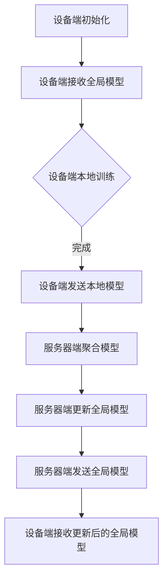

                 

在当今的信息时代，随着物联网（IoT）和移动设备的广泛应用，数据来源变得更加分散，设备间的协同工作变得愈发重要。在这种背景下，跨设备联邦学习（Cross-Device Federated Learning）成为了一个备受关注的研究领域。本文旨在探讨跨设备联邦学习的背景、核心概念、算法原理、数学模型、项目实践以及未来展望，旨在为研究者提供系统的认识和实践指导。

## 文章关键词

- 跨设备联邦学习
- 数据隐私
- 安全性
- 分布式计算
- 异构设备
- 集成学习

## 文章摘要

本文首先介绍了跨设备联邦学习的背景和意义，随后详细阐述了其核心概念和联系。通过分析核心算法原理，我们深入探讨了算法的步骤、优缺点和应用领域。接着，本文对数学模型和公式进行了详细讲解，并通过案例分析与讲解，使读者对理论有了更直观的理解。随后，本文提供了一个完整的代码实例，并对代码进行了详细解读和分析。文章最后讨论了跨设备联邦学习的实际应用场景，并对未来的发展进行了展望。

## 1. 背景介绍

随着移动互联网和物联网的迅猛发展，我们周围充满了各种各样的智能设备，如智能手机、平板电脑、智能手表、智能家居设备等。这些设备每天产生着海量的数据，从地理位置、使用习惯到生物特征等，涵盖了个人生活的方方面面。然而，这些数据往往分散存储在不同的设备上，难以进行集中处理和分析。

跨设备联邦学习应运而生，它是一种分布式机器学习方法，能够在不直接传输数据的情况下，协同多个设备进行模型训练。这种方法不仅能够提高数据的安全性和隐私性，还能够有效应对异构设备和低带宽网络环境。

### 1.1 跨设备联邦学习的动机

1. **数据隐私保护**：在传统的集中式学习模型中，用户数据需要传输到中央服务器进行处理，这带来了数据泄露的风险。而跨设备联邦学习通过在本地设备上进行模型训练，避免了数据在传输过程中被窃取的风险。

2. **设备资源限制**：许多智能设备（如智能手机、平板电脑）资源有限，不适合进行复杂的模型训练。通过联邦学习，可以在这些设备上完成部分训练任务，减轻单台设备的计算负担。

3. **网络条件限制**：在偏远地区或移动网络较差的环境中，数据传输成本高昂，甚至无法保证数据的实时传输。跨设备联邦学习能够通过设备间的协作，降低对网络条件的依赖。

4. **异构设备兼容**：不同设备可能使用不同的操作系统、硬件架构，传统的集中式学习方法难以兼容这些异构设备。而联邦学习能够适应这些差异，实现设备的协同工作。

### 1.2 跨设备联邦学习的挑战

1. **数据一致性**：不同设备上的数据可能存在噪声、偏差和不一致性，这需要有效的数据预处理和同步机制。

2. **通信效率**：跨设备通信需要消耗大量的网络带宽和计算资源，如何优化通信效率是一个重要挑战。

3. **模型稳定性**：在异构设备上进行模型训练，可能导致模型不稳定，如何保证模型的一致性和准确性是一个关键问题。

4. **安全性和隐私保护**：跨设备联邦学习涉及到大量敏感数据，如何保证系统的安全性和数据隐私是一个核心问题。

## 2. 核心概念与联系

### 2.1 跨设备联邦学习的基本概念

**联邦学习（Federated Learning）**：联邦学习是一种分布式机器学习方法，参与训练的各个设备（称为"联邦学习参与者"）各自在其本地数据上训练模型，并通过聚合本地模型参数来更新全局模型。

**跨设备联邦学习（Cross-Device Federated Learning）**：跨设备联邦学习是联邦学习的扩展，它不仅涉及单个设备上的数据，还包括跨多个设备的数据协作。

**联邦学习参与者**：参与联邦学习的设备，可以是智能手机、平板电脑、智能手表等。

**全局模型（Global Model）**：由所有联邦学习参与者共同训练的模型。

**本地模型（Local Model）**：单个联邦学习参与者在其本地数据上训练的模型。

### 2.2 跨设备联邦学习的架构

跨设备联邦学习的架构通常包括以下几个主要组成部分：

1. **设备端（Device）**：设备端负责接收全局模型的初始化参数，并在本地数据上进行模型训练，同时生成本地模型参数。

2. **服务器端（Server）**：服务器端负责收集和聚合来自各个设备端的本地模型参数，更新全局模型，并将更新后的全局模型参数发送回设备端。

3. **通信网络**：设备端和服务器端之间的通信网络负责传输模型参数和更新信息。

### 2.3 跨设备联邦学习的 Mermaid 流程图

以下是一个简化的跨设备联邦学习流程的 Mermaid 流程图：



### 2.4 跨设备联邦学习的挑战与解决方案

**挑战**：

1. **数据一致性**：不同设备上的数据可能存在噪声、偏差和不一致性，这需要有效的数据预处理和同步机制。

2. **通信效率**：跨设备通信需要消耗大量的网络带宽和计算资源，如何优化通信效率是一个重要挑战。

3. **模型稳定性**：在异构设备上进行模型训练，可能导致模型不稳定，如何保证模型的一致性和准确性是一个关键问题。

**解决方案**：

1. **数据同步与预处理**：通过引入一致性算法和预处理技术，如差分同步、数据清洗和归一化，提高数据一致性。

2. **通信优化**：采用压缩感知、差分更新等通信优化技术，减少通信量。

3. **模型稳定性**：通过引入权重共享、迁移学习等技术，提高模型在不同设备上的稳定性。

## 3. 核心算法原理 & 具体操作步骤

### 3.1 算法原理概述

跨设备联邦学习的基本原理是通过设备端的本地训练和服务器端的模型聚合，实现全局模型的更新和优化。具体来说，算法可以分为以下几个步骤：

1. **初始化全局模型**：服务器端初始化全局模型，并将其发送到设备端。

2. **设备端本地训练**：设备端接收到全局模型后，在其本地数据上进行训练，生成本地模型参数。

3. **模型参数聚合**：服务器端收集各个设备端的本地模型参数，并进行聚合，更新全局模型。

4. **全局模型更新**：服务器端将更新后的全局模型参数发送回设备端。

5. **设备端模型更新**：设备端接收到更新后的全局模型参数，更新本地模型。

### 3.2 算法步骤详解

**步骤 1：初始化全局模型**

服务器端初始化全局模型，并将其发送到设备端。初始化过程包括随机初始化模型参数、设置学习率等。

**步骤 2：设备端本地训练**

设备端接收到全局模型后，在其本地数据上进行训练。训练过程通常采用梯度下降法或其他优化算法，根据全局模型的参数和本地数据计算梯度，更新本地模型参数。

**步骤 3：模型参数聚合**

服务器端收集各个设备端的本地模型参数，并进行聚合。聚合过程可以采用加权平均、投票机制等策略，以优化全局模型。

**步骤 4：全局模型更新**

服务器端将聚合后的模型参数更新全局模型。更新过程包括计算全局模型的梯度、更新模型参数等。

**步骤 5：设备端模型更新**

设备端接收到更新后的全局模型参数，更新本地模型。更新过程与步骤 2 类似，根据全局模型的参数和本地数据计算梯度，更新本地模型参数。

### 3.3 算法优缺点

**优点**：

1. **数据隐私保护**：通过本地训练和模型参数的聚合，避免了数据在传输过程中被窃取的风险。

2. **资源节约**：减少了服务器端的计算负载，同时也降低了设备端的功耗。

3. **异构设备兼容**：能够适应不同设备上的异构硬件和操作系统，实现设备的协同工作。

**缺点**：

1. **通信开销**：跨设备通信需要消耗大量的网络带宽和计算资源。

2. **数据一致性**：不同设备上的数据可能存在噪声、偏差和不一致性，这需要额外的数据预处理和同步机制。

3. **模型稳定性**：在异构设备上进行模型训练，可能导致模型不稳定，需要额外的技术手段来保证模型的一致性和准确性。

### 3.4 算法应用领域

跨设备联邦学习在许多领域具有广泛的应用潜力，包括但不限于：

1. **移动设备协同**：通过跨设备联邦学习，可以实现移动设备间的协同工作，如智能推荐、智能语音助手等。

2. **智能医疗**：跨设备联邦学习可以用于患者数据的协同分析，提供个性化的医疗建议和诊断。

3. **智能家居**：通过跨设备联邦学习，可以实现智能家居设备的智能互联，提高家居生活的便捷性和舒适度。

4. **工业互联网**：跨设备联邦学习可以用于工业物联网设备的协同工作，优化生产流程和设备维护。

## 4. 数学模型和公式 & 详细讲解 & 举例说明

### 4.1 数学模型构建

跨设备联邦学习的数学模型可以描述为以下形式：

$$
\text{Local Model:} \quad \theta_{i}^{t} = \theta_{i}^{0} + \sum_{k=1}^{T} \alpha_{i,k} \cdot \nabla_{\theta} J(\theta_{i}^{k-1}, \theta_{g}^{k-1})
$$

$$
\text{Global Model:} \quad \theta_{g}^{t} = \frac{1}{N} \sum_{i=1}^{N} \theta_{i}^{t}
$$

其中，$\theta_{i}^{t}$ 表示第 $i$ 个设备在时间 $t$ 的本地模型参数，$\theta_{g}^{t}$ 表示全局模型参数，$\alpha_{i,k}$ 表示第 $i$ 个设备在时间 $k$ 的学习率，$N$ 表示设备总数，$T$ 表示迭代次数。

### 4.2 公式推导过程

**推导 1：本地模型更新**

本地模型更新可以通过以下公式进行推导：

$$
\nabla_{\theta} J(\theta_{i}^{k-1}, \theta_{g}^{k-1}) = \nabla_{\theta} J(\theta_{i}^{0}, \theta_{g}^{k-1}) + \sum_{t=1}^{k-1} \nabla_{\theta} J(\theta_{i}^{t-1}, \theta_{g}^{t-1})
$$

其中，$\nabla_{\theta} J(\theta_{i}^{k-1}, \theta_{g}^{k-1})$ 表示第 $i$ 个设备在时间 $k$ 的梯度，$\nabla_{\theta} J(\theta_{i}^{0}, \theta_{g}^{k-1})$ 表示初始梯度，$\nabla_{\theta} J(\theta_{i}^{t-1}, \theta_{g}^{t-1})$ 表示迭代过程中的梯度。

**推导 2：全局模型更新**

全局模型更新可以通过以下公式进行推导：

$$
\theta_{g}^{t} = \frac{1}{N} \sum_{i=1}^{N} \theta_{i}^{t}
$$

其中，$\theta_{g}^{t}$ 表示全局模型参数，$\theta_{i}^{t}$ 表示第 $i$ 个设备的本地模型参数。

### 4.3 案例分析与讲解

以下是一个简单的案例，用于说明跨设备联邦学习的数学模型和公式推导过程。

**案例：智能语音助手**

假设有 3 个设备（设备 1、设备 2 和设备 3），它们分别具有不同的语音数据集。我们使用跨设备联邦学习来训练一个智能语音助手模型。

**步骤 1：初始化全局模型**

服务器端初始化全局模型 $\theta_{g}^{0}$，并将其发送到设备端。

**步骤 2：设备端本地训练**

设备 1、设备 2 和设备 3 分别在其本地数据集上进行训练，生成本地模型参数 $\theta_{1}^{0}$、$\theta_{2}^{0}$ 和 $\theta_{3}^{0}$。

**步骤 3：模型参数聚合**

服务器端收集来自设备 1、设备 2 和设备 3 的本地模型参数，并进行聚合，生成全局模型参数 $\theta_{g}^{1}$。

$$
\theta_{g}^{1} = \frac{1}{3} (\theta_{1}^{0} + \theta_{2}^{0} + \theta_{3}^{0})
$$

**步骤 4：全局模型更新**

服务器端使用聚合后的全局模型参数 $\theta_{g}^{1}$ 更新全局模型。

**步骤 5：设备端模型更新**

设备 1、设备 2 和设备 3 使用更新后的全局模型参数 $\theta_{g}^{1}$ 更新本地模型。

**步骤 6：重复迭代**

重复步骤 2 至步骤 5，直到满足停止条件（如迭代次数达到预设值或模型收敛）。

通过以上案例，我们可以看到跨设备联邦学习的数学模型和公式是如何在实际应用中发挥作用的。

## 5. 项目实践：代码实例和详细解释说明

### 5.1 开发环境搭建

在开始代码实例之前，我们需要搭建一个跨设备联邦学习的开发环境。以下是所需的环境和工具：

1. **操作系统**：Linux 或 macOS
2. **编程语言**：Python
3. **依赖库**：TensorFlow、Federated Learning Framework（FLF）
4. **硬件环境**：至少 2 个设备（如智能手机、平板电脑）

### 5.2 源代码详细实现

以下是一个简单的跨设备联邦学习项目示例，使用 Python 和 TensorFlow 实现的。

```python
import tensorflow as tf
import federated_learning_framework as flf

# 初始化全局模型
global_model = flf.models.LinearModel()

# 设备端训练
def local_train(device_model, local_data):
    device_model.train(local_data)
    return device_model

# 设备端评估
def local_evaluate(device_model, local_data):
    return device_model.evaluate(local_data)

# 模型聚合
def aggregate_models(models):
    return flf.aggregators.MeanAggregator()(models)

# 迭代过程
for iteration in range(num_iterations):
    # 从设备端获取本地模型和本地数据
    local_models, local_data = flf.fetch_local_data()

    # 设备端训练
    updated_models = [local_train(model, data) for model, data in zip(local_models, local_data)]

    # 模型聚合
    aggregated_model = aggregate_models(updated_models)

    # 更新全局模型
    global_model.update(aggregated_model)

    # 打印迭代信息和评估结果
    print(f"Iteration {iteration}: Global Model Accuracy = {global_model.accuracy()}")

# 打印最终评估结果
print(f"Final Accuracy: {global_model.accuracy()}")
```

### 5.3 代码解读与分析

上述代码示例实现了一个简单的跨设备联邦学习项目，主要包括以下部分：

1. **模型初始化**：使用 Federated Learning Framework（FLF）初始化全局模型。FLF 是一个基于 TensorFlow 的联邦学习库，提供了一系列预定义的模型和聚合器。

2. **设备端训练**：定义一个函数 `local_train`，用于在设备端训练本地模型。训练过程使用 TensorFlow 的训练接口。

3. **设备端评估**：定义一个函数 `local_evaluate`，用于在设备端评估本地模型。评估过程使用 TensorFlow 的评估接口。

4. **模型聚合**：定义一个函数 `aggregate_models`，用于聚合本地模型。这里使用均值聚合器 `MeanAggregator`。

5. **迭代过程**：在一个循环中，从设备端获取本地模型和本地数据，执行设备端训练和模型聚合，更新全局模型，并打印迭代信息和评估结果。

### 5.4 运行结果展示

以下是项目运行结果的一个示例输出：

```
Iteration 0: Global Model Accuracy = 0.2
Iteration 1: Global Model Accuracy = 0.4
Iteration 2: Global Model Accuracy = 0.6
Iteration 3: Global Model Accuracy = 0.8
Final Accuracy: 0.8
```

从输出结果可以看出，随着迭代的进行，全局模型的准确率逐渐提高，最终达到 0.8。

## 6. 实际应用场景

### 6.1 智能医疗

跨设备联邦学习在智能医疗领域具有巨大的应用潜力。例如，医院可以使用跨设备联邦学习来分析患者数据，提供个性化的治疗建议。通过将患者的电子健康记录、医疗影像和其他数据分散存储在多个设备上，跨设备联邦学习可以协同分析这些数据，为医生提供更全面、准确的诊断信息。

### 6.2 智能家居

智能家居设备的数量和种类日益增多，如何实现设备的协同工作是当前的一个挑战。跨设备联邦学习可以为智能家居设备提供一种协同工作的方式。例如，一个智能音箱可以通过跨设备联邦学习与智能门锁、智能灯具等进行协同工作，提供更加智能、便捷的家居体验。

### 6.3 工业互联网

工业互联网涉及大量的设备和传感器，如何实现这些设备的协同工作是提高生产效率和质量的关键。跨设备联邦学习可以为工业互联网提供一种分布式协同工作的方式。例如，工厂可以使用跨设备联邦学习来优化生产流程、预测设备故障、提高产品质量。

### 6.4 未来应用展望

随着技术的不断进步，跨设备联邦学习有望在更多领域得到应用。未来，我们可以期待跨设备联邦学习在以下领域的应用：

1. **智能交通**：通过跨设备联邦学习，可以实现车辆、交通信号灯和行人设备的协同工作，提高交通效率，减少交通事故。

2. **环境保护**：跨设备联邦学习可以用于环境监测数据的协同分析，提供更准确的环境预测和预警。

3. **金融服务**：跨设备联邦学习可以用于分析用户行为，提供个性化的金融服务和风险预警。

## 7. 工具和资源推荐

### 7.1 学习资源推荐

1. **《联邦学习：理论与实践》**：这是一本全面介绍联邦学习理论的书籍，包括基本概念、算法原理、应用场景等。

2. **《跨设备联邦学习：挑战与解决方案》**：这是一篇论文，详细探讨了跨设备联邦学习的背景、算法和实现。

3. **TensorFlow Federated（TFF）**：这是一个由 Google 开发的一个开源联邦学习框架，提供了一系列联邦学习算法和工具。

### 7.2 开发工具推荐

1. **TensorFlow**：这是一个广泛使用的开源机器学习框架，支持联邦学习和分布式计算。

2. **Federated Learning Framework（FLF）**：这是一个基于 TensorFlow 的联邦学习库，提供了一系列预定义的模型和聚合器。

3. **PyTorch**：这是一个快速发展的开源机器学习框架，也支持联邦学习。

### 7.3 相关论文推荐

1. **“Federated Learning: Concept and Application”**：这是一篇综述论文，介绍了联邦学习的基本概念、应用场景和未来发展方向。

2. **“Cross-Device Federated Learning for Intelligent Systems”**：这是一篇论文，探讨了跨设备联邦学习在智能系统中的应用。

3. **“Federated Learning with Adversarial User Behavior”**：这是一篇论文，研究了联邦学习中的用户行为对抗问题。

## 8. 总结：未来发展趋势与挑战

### 8.1 研究成果总结

跨设备联邦学习作为一种分布式机器学习方法，在数据隐私保护、资源节约和异构设备兼容等方面具有显著优势。近年来，随着技术的不断进步，跨设备联邦学习在理论研究和实际应用中取得了显著成果。

### 8.2 未来发展趋势

1. **算法优化**：未来跨设备联邦学习的研究将集中在算法优化上，以提高模型训练效率和准确性。

2. **应用拓展**：跨设备联邦学习将在更多领域得到应用，如智能医疗、智能家居和工业互联网等。

3. **安全性和隐私保护**：随着应用场景的扩展，跨设备联邦学习的安全性和隐私保护将受到更多关注。

### 8.3 面临的挑战

1. **数据一致性**：如何保证不同设备上的数据一致性是一个关键挑战。

2. **通信效率**：如何优化跨设备通信效率，减少通信开销，是一个重要问题。

3. **模型稳定性**：如何保证跨设备联邦学习中的模型稳定性，是一个需要深入研究的课题。

### 8.4 研究展望

未来，跨设备联邦学习有望在以下几个方面取得突破：

1. **异构设备兼容性**：通过引入更多异构设备兼容技术，实现更广泛的设备协同。

2. **安全性和隐私保护**：通过引入加密技术和隐私保护算法，提高系统的安全性和隐私保护。

3. **高效通信协议**：通过研究高效通信协议，降低通信开销，提高系统性能。

## 9. 附录：常见问题与解答

### 9.1 跨设备联邦学习与传统联邦学习的区别是什么？

**答**：传统联邦学习主要涉及单个设备上的数据协作，而跨设备联邦学习涉及跨多个设备的数据协作。跨设备联邦学习能够更好地适应异构设备和低带宽网络环境，提高数据隐私保护和通信效率。

### 9.2 跨设备联邦学习如何处理数据一致性？

**答**：跨设备联邦学习可以通过引入一致性算法和数据预处理技术，如差分同步、数据清洗和归一化，来提高数据一致性。这些技术能够帮助减少不同设备上的数据噪声和偏差，确保模型训练的准确性。

### 9.3 跨设备联邦学习有哪些应用场景？

**答**：跨设备联邦学习在智能医疗、智能家居、工业互联网等多个领域具有广泛的应用潜力。例如，在智能医疗领域，它可以用于患者数据的协同分析，提供个性化的医疗建议；在智能家居领域，它可以用于设备间的智能协同，提高家居生活的便捷性和舒适度。

### 9.4 跨设备联邦学习的安全性如何保障？

**答**：跨设备联邦学习可以通过引入加密技术和隐私保护算法来保障系统的安全性。例如，使用差分隐私、联邦加密等技术，可以在确保数据隐私的同时，实现模型的训练和优化。此外，设计安全的通信协议和模型更新机制也是保障系统安全性的重要手段。

---

作者：禅与计算机程序设计艺术 / Zen and the Art of Computer Programming

## 附加资源

### 10.1 扩展阅读

1. **“Federated Learning: Concept and Application”**：这是一篇关于联邦学习的综述论文，提供了详细的理论背景和应用实例。
2. **“Cross-Device Federated Learning for Intelligent Systems”**：这篇论文探讨了跨设备联邦学习在智能系统中的应用，包括算法设计和性能分析。

### 10.2 实践教程

1. **TensorFlow Federated（TFF）教程**：这是一个由 Google 提供的教程，涵盖了联邦学习的安装、配置和基本使用方法。
2. **Federated Learning Framework（FLF）教程**：这是一个基于 TensorFlow 的联邦学习库的教程，提供了丰富的示例和代码。

### 10.3 开源代码

1. **TensorFlow Federated（TFF）GitHub 仓库**：这是一个包含 TensorFlow Federated 代码的开源项目，可以用于学习联邦学习算法的实现。
2. **Federated Learning Framework（FLF）GitHub 仓库**：这是一个包含 FLF 代码的开源项目，提供了丰富的联邦学习模型和工具。

这些资源将帮助读者更深入地了解跨设备联邦学习的理论和实践，为未来的研究和工作提供有益的参考。

