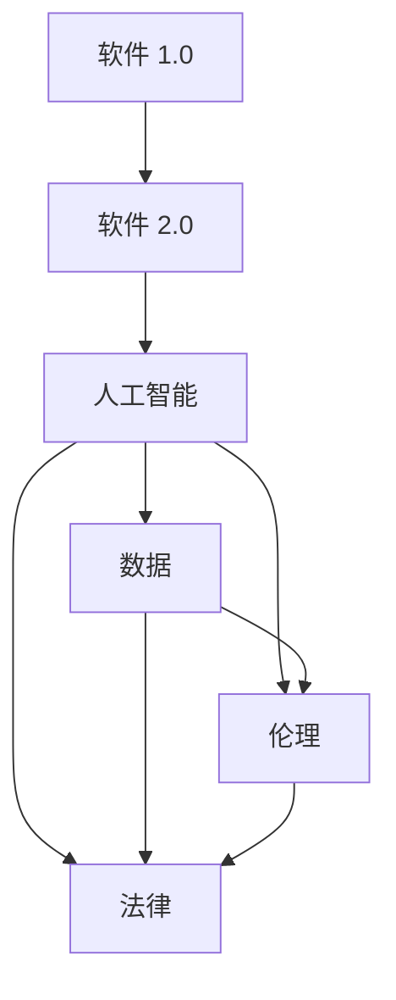

                 

### 1. 背景介绍

在当今信息化时代，人工智能（Artificial Intelligence，AI）技术的发展速度令人惊叹，已渗透到我们日常生活的方方面面。从自动驾驶汽车到智能家居，从医疗诊断到金融分析，AI 正在为我们的生活带来前所未有的便利和效率。然而，随着 AI 技术的迅猛发展，一系列伦理问题也逐渐浮出水面。这些问题不仅涉及到 AI 技术的应用边界，还直接关系到人类社会的未来走向。

软件 1.0 时代，以计算机程序为主要载体，实现了信息处理和数据管理的自动化。而进入软件 2.0 时代，人工智能的崛起，使得软件不再仅仅是一个执行任务的工具，而成为一种具有自主学习和决策能力的智能体。这种转变不仅带来了技术上的突破，也引发了深刻的伦理思考。如何在保障技术发展的同时，确保人工智能的伦理合规性，成为了一个亟待解决的重要问题。

本文旨在探讨软件 2.0 时代下，人工智能伦理规范的重要性及其具体实施路径。我们将从多个维度分析 AI 技术在伦理层面的挑战，并提出相应的规范建议，以期为 AI 技术的健康发展提供理论支持和实践指导。

### 2. 核心概念与联系

要深入理解软件 2.0 时代下的伦理规范，首先需要明确几个核心概念，并探讨它们之间的联系。以下是一个简化的 Mermaid 流程图，用以描述这些概念及其相互关系。



**2.1 软件演进**

- **软件 1.0（A）**：主要指早期的计算机程序，以命令行和图形界面为操作方式，主要用于数据处理和自动化任务。
- **软件 2.0（B）**：随着互联网和云计算的发展，软件不再局限于本地计算机，而成为分布式、动态的智能系统。软件 2.0 具有更高的灵活性和交互性，能够自适应环境和用户需求。

**2.2 人工智能**

- **人工智能（C）**：一种模拟人类智能的技术，通过机器学习和深度学习算法，实现机器的自我学习和决策能力。AI 的核心是数据，依赖于大量数据进行训练和优化。

**2.3 数据**

- **数据（D）**：数据是 AI 技术的基础，决定了 AI 系统的性能和智能水平。数据的质量、隐私和安全成为伦理和法律关注的焦点。

**2.4 伦理**

- **伦理（E）**：伦理规范是人类行为和价值判断的准则，涉及到 AI 技术的公正性、透明性、公平性等方面。伦理规范旨在保障 AI 技术的应用符合人类的价值观和社会道德。

**2.5 法律**

- **法律（F）**：法律是伦理规范的底线，通过法律手段规范 AI 技术的行为，确保其符合法律要求和社会公共利益。

这些核心概念之间存在着紧密的联系。软件 2.0 的兴起推动了人工智能的发展，而人工智能在数据处理和应用中的广泛应用，引发了数据隐私、伦理和法律等问题。因此，构建一个合理的伦理规范体系，成为保障 AI 技术健康发展的关键。

### 3. 核心算法原理 & 具体操作步骤

在软件 2.0 时代，人工智能的核心算法主要包括机器学习和深度学习。这些算法通过大量数据训练，使机器能够自主学习和优化性能。以下将简要概述这些算法的基本原理，并详细说明具体操作步骤。

#### 3.1 算法原理概述

**3.1.1 机器学习**

机器学习（Machine Learning，ML）是一种使计算机通过数据学习模式和规律的方法。其基本原理是通过训练模型，使计算机能够在未见过的数据上做出预测或决策。机器学习分为监督学习、无监督学习和半监督学习。

- **监督学习（Supervised Learning）**：有标签的数据用于训练模型，模型根据这些数据学习特征和标签之间的关系，例如分类和回归任务。
- **无监督学习（Unsupervised Learning）**：没有标签的数据用于训练模型，模型学习数据的结构和特征，例如聚类和降维任务。
- **半监督学习（Semi-Supervised Learning）**：结合有标签和无标签数据进行训练，利用无标签数据提高模型的泛化能力。

**3.1.2 深度学习**

深度学习（Deep Learning，DL）是机器学习的一个子领域，通过构建多层的神经网络模型，使计算机能够自动学习和提取复杂特征。深度学习的主要模型包括卷积神经网络（CNN）、循环神经网络（RNN）和生成对抗网络（GAN）。

- **卷积神经网络（CNN）**：主要用于图像和视频处理，通过卷积操作提取图像特征。
- **循环神经网络（RNN）**：主要用于序列数据，如文本和语音，通过循环结构保持长期依赖信息。
- **生成对抗网络（GAN）**：由生成器和判别器组成，生成器生成数据，判别器判断生成数据的真实性，通过对抗训练生成高质量的数据。

#### 3.2 算法步骤详解

**3.2.1 机器学习算法步骤**

1. **数据收集和预处理**：收集相关领域的数据，进行数据清洗、归一化和特征提取等预处理操作。
2. **模型选择**：根据任务需求选择合适的模型，如分类、回归或聚类。
3. **训练模型**：使用预处理后的数据训练模型，通过调整模型参数优化性能。
4. **模型评估**：使用验证集或测试集评估模型性能，如准确率、召回率和 F1 值等。
5. **模型部署**：将训练好的模型部署到实际应用场景，如自动化决策系统或预测模型。

**3.2.2 深度学习算法步骤**

1. **构建模型架构**：设计深度学习模型的层次结构，如卷积层、全连接层和池化层。
2. **初始化参数**：随机初始化模型参数，如权重和偏置。
3. **数据预处理**：对输入数据进行预处理，如图像大小调整、归一化和数据增强。
4. **训练过程**：使用训练数据更新模型参数，通过反向传播算法优化损失函数。
5. **验证和测试**：在验证集和测试集上评估模型性能，调整模型参数以达到最佳效果。
6. **模型部署**：将训练好的模型部署到实际应用场景，如图像识别、语音合成或自然语言处理。

#### 3.3 算法优缺点

**3.3.1 机器学习算法优缺点**

- **优点**：
  - 自动化：机器学习能够自动从数据中学习模式和规律，减少人工干预。
  - 泛化能力：通过训练大量数据，机器学习模型具有较高的泛化能力，能够应用于不同领域和场景。
- **缺点**：
  - 数据依赖：机器学习模型的性能高度依赖数据的质量和数量，数据不足或质量差可能导致模型过拟合。
  - 解释性差：机器学习模型通常是一个黑盒模型，其内部决策过程难以解释，增加了信任风险。

**3.3.2 深度学习算法优缺点**

- **优点**：
  - 强泛化能力：深度学习模型能够自动提取复杂特征，具有较强的泛化能力，适用于各种复杂任务。
  - 自动特征学习：深度学习模型能够从原始数据中学习高级特征，减少人工特征工程的工作量。
- **缺点**：
  - 计算资源消耗：深度学习模型通常需要大量计算资源和时间进行训练，对硬件设备有较高要求。
  - 数据依赖：深度学习模型的性能也高度依赖数据的质量和数量，数据不足或质量差可能导致模型过拟合。
  - 解释性差：与机器学习类似，深度学习模型也是一个黑盒模型，其内部决策过程难以解释。

#### 3.4 算法应用领域

**3.4.1 机器学习应用领域**

- **分类任务**：如邮件分类、文本分类、图像分类等。
- **回归任务**：如股票价格预测、房屋价格评估等。
- **聚类任务**：如客户细分、图像聚类等。
- **降维任务**：如主成分分析（PCA）、线性判别分析（LDA）等。

**3.4.2 深度学习应用领域**

- **计算机视觉**：如图像识别、目标检测、图像生成等。
- **自然语言处理**：如文本分类、情感分析、机器翻译等。
- **语音识别与生成**：如语音合成、语音识别、语音增强等。
- **推荐系统**：如商品推荐、电影推荐、社交网络推荐等。

综上所述，机器学习和深度学习作为人工智能的核心算法，已在多个领域取得了显著成果。然而，随着 AI 技术的不断发展，如何合理应用这些算法，并确保其伦理合规性，仍是一个亟待解决的重要问题。

### 4. 数学模型和公式 & 详细讲解 & 举例说明

在人工智能领域，数学模型和公式是理解算法原理和实现算法功能的核心工具。本节将介绍几种关键的数学模型和公式，并详细讲解其推导过程和具体应用。

#### 4.1 数学模型构建

在人工智能领域，最常用的数学模型之一是神经网络模型。神经网络通过多层感知器（MLP）构建，其中每个神经元都与其他神经元相连，形成复杂的网络结构。以下是一个简化的神经网络模型。

**神经网络模型**

$$
y = \sigma(\mathbf{W}^T \cdot \mathbf{z} + b)
$$

其中，$y$ 是输出，$\sigma$ 是激活函数，$\mathbf{W}$ 是权重矩阵，$\mathbf{z}$ 是输入向量，$b$ 是偏置。

**激活函数**

激活函数用于引入非线性因素，使神经网络能够学习复杂的关系。常用的激活函数包括：

- **Sigmoid 函数**

$$
\sigma(x) = \frac{1}{1 + e^{-x}}
$$

- **ReLU 函数**

$$
\sigma(x) =
\begin{cases}
0 & \text{if } x < 0 \\
x & \text{if } x \geq 0
\end{cases}
$$

- **Tanh 函数**

$$
\sigma(x) = \frac{e^x - e^{-x}}{e^x + e^{-x}}
$$

#### 4.2 公式推导过程

神经网络的训练过程实际上是一个优化过程，目标是调整权重和偏置，使网络输出接近期望输出。训练过程通常采用梯度下降法（Gradient Descent）。

**梯度下降法**

梯度下降法是一种优化算法，通过计算损失函数的梯度，调整模型参数以最小化损失函数。

**损失函数**

损失函数用于衡量模型输出与期望输出之间的差距。常用的损失函数包括：

- **均方误差（MSE）**

$$
\text{MSE} = \frac{1}{m} \sum_{i=1}^{m} (\hat{y}_i - y_i)^2
$$

其中，$\hat{y}_i$ 是模型预测值，$y_i$ 是真实值，$m$ 是样本数量。

**梯度计算**

假设损失函数 $J(\theta)$ 是关于模型参数 $\theta$ 的函数，则梯度 $\nabla_{\theta} J(\theta)$ 表示损失函数关于参数 $\theta$ 的导数。

**梯度下降步骤**

1. 初始化模型参数 $\theta$。
2. 计算 $\theta$ 的梯度 $\nabla_{\theta} J(\theta)$。
3. 更新参数 $\theta$：

$$
\theta = \theta - \alpha \nabla_{\theta} J(\theta)
$$

其中，$\alpha$ 是学习率，用于控制参数更新的步长。

#### 4.3 案例分析与讲解

以下通过一个简单的线性回归案例，演示如何使用梯度下降法训练神经网络。

**案例：线性回归**

假设我们有一个线性回归问题，目标是预测一个连续值。给定输入 $x$ 和真实值 $y$，我们需要训练一个线性模型 $y = wx + b$。

**数据集**

$$
\{(x_1, y_1), (x_2, y_2), ..., (x_n, y_n)\}
$$

**损失函数**

$$
\text{MSE} = \frac{1}{n} \sum_{i=1}^{n} (wx_i + b - y_i)^2
$$

**梯度计算**

$$
\nabla_{w} \text{MSE} = \frac{2}{n} \sum_{i=1}^{n} (wx_i + b - y_i)x_i
$$

$$
\nabla_{b} \text{MSE} = \frac{2}{n} \sum_{i=1}^{n} (wx_i + b - y_i)
$$

**梯度下降步骤**

1. 初始化权重 $w$ 和偏置 $b$。
2. 对于每个样本 $(x_i, y_i)$，计算梯度 $\nabla_{w} \text{MSE}$ 和 $\nabla_{b} \text{MSE}$。
3. 更新权重和偏置：

$$
w = w - \alpha \nabla_{w} \text{MSE}
$$

$$
b = b - \alpha \nabla_{b} \text{MSE}
$$

4. 重复步骤 2 和 3，直到模型收敛。

通过上述步骤，我们可以训练一个线性回归模型，使其能够预测新的输入值。

#### 4.4 总结

在本节中，我们介绍了神经网络模型、激活函数、梯度下降法和损失函数等关键数学概念和公式。通过一个线性回归案例，我们演示了如何使用这些工具训练神经网络模型。这些数学工具是理解和实现人工智能算法的基础，对于深入探索 AI 领域具有重要意义。

### 5. 项目实践：代码实例和详细解释说明

为了更好地理解人工智能算法在实际项目中的应用，我们将通过一个简单的项目实例，展示如何使用 Python 编写代码实现一个线性回归模型。该实例将涵盖从数据预处理到模型训练和评估的完整流程。

#### 5.1 开发环境搭建

在开始项目之前，需要搭建一个合适的开发环境。以下是所需的软件和工具：

- Python 3.x（版本不低于 3.6）
- Jupyter Notebook（用于编写和运行代码）
- NumPy 库（用于数据处理）
- Matplotlib 库（用于数据可视化）
- Scikit-learn 库（用于机器学习模型）

**安装步骤**：

1. 安装 Python 3.x 并设置环境变量。
2. 打开终端或命令行，使用以下命令安装 Jupyter Notebook、NumPy、Matplotlib 和 Scikit-learn：

```bash
pip install notebook numpy matplotlib scikit-learn
```

3. 启动 Jupyter Notebook，进入开发环境。

#### 5.2 源代码详细实现

以下是一个简单的线性回归项目的代码实现，包括数据预处理、模型训练、模型评估和结果可视化。

```python
# 导入必要的库
import numpy as np
import matplotlib.pyplot as plt
from sklearn.linear_model import LinearRegression

# 生成模拟数据集
np.random.seed(0)
X = np.random.rand(100, 1) * 10
y = 2 * X + np.random.randn(100, 1) * 0.1 + 1

# 数据预处理：添加常数项（用于线性回归模型的训练）
X = np.hstack((np.ones((X.shape[0], 1)), X))

# 创建线性回归模型
model = LinearRegression()

# 训练模型
model.fit(X, y)

# 模型评估：计算均方误差
y_pred = model.predict(X)
mse = np.mean((y - y_pred) ** 2)
print(f'Mean Squared Error: {mse}')

# 结果可视化
plt.scatter(X[:, 1], y, color='blue', label='Actual')
plt.plot(X[:, 1], y_pred, color='red', label='Predicted')
plt.xlabel('X')
plt.ylabel('Y')
plt.legend()
plt.show()
```

#### 5.3 代码解读与分析

**5.3.1 数据预处理**

在生成模拟数据集之后，我们首先添加了一个常数项（1），这是线性回归模型所需的。常数项表示模型的偏置（bias），它使得模型能够学习线性关系中的截距。

```python
X = np.hstack((np.ones((X.shape[0], 1)), X))
```

**5.3.2 创建模型**

接下来，我们创建了一个线性回归模型实例，这里使用的是 Scikit-learn 库中的 `LinearRegression` 类。

```python
model = LinearRegression()
```

**5.3.3 训练模型**

使用 `fit` 方法训练模型，模型将自动调整权重和偏置，以最小化均方误差。

```python
model.fit(X, y)
```

**5.3.4 模型评估**

训练完成后，我们使用模型预测新数据，并计算均方误差（MSE），这是评估模型性能的常用指标。

```python
y_pred = model.predict(X)
mse = np.mean((y - y_pred) ** 2)
print(f'Mean Squared Error: {mse}')
```

**5.3.5 结果可视化**

最后，我们将实际数据和预测结果可视化，以直观地展示模型的效果。

```python
plt.scatter(X[:, 1], y, color='blue', label='Actual')
plt.plot(X[:, 1], y_pred, color='red', label='Predicted')
plt.xlabel('X')
plt.ylabel('Y')
plt.legend()
plt.show()
```

#### 5.4 运行结果展示

运行上述代码后，将得到以下结果：

- 模型的均方误差（MSE）。
- 一个散点图，其中蓝色点表示实际数据，红色线表示预测结果。

通过这些结果，我们可以直观地看到模型对数据的拟合效果。如果模型拟合效果较好，则表明训练过程成功，模型可用于进一步的实际应用。

#### 5.5 实际应用场景

这个简单的线性回归模型可以应用于多个实际场景，例如：

- **统计分析**：用于预测统计数据，如预测未来某个月的销售额。
- **数据分析**：用于解释变量之间的关系，如分析广告投放对销售量的影响。
- **工程应用**：用于设计优化，如预测机械部件的寿命。

### 6. 实际应用场景

#### 6.1 人工智能在医疗领域的应用

人工智能在医疗领域的应用已经取得了显著成果，尤其在疾病诊断、治疗规划和个性化医疗等方面。通过深度学习算法，AI 可以从大量的医疗数据中学习模式和规律，为医生提供更加精准的诊断建议和治疗方案。

**6.1.1 疾病诊断**

人工智能可以分析患者的临床数据、医学影像和实验室检测结果，从而提高疾病诊断的准确性。例如，深度学习算法可以在数秒内分析一张 CT 图像，准确识别肿瘤，大大缩短了诊断时间。

**6.1.2 治疗规划**

AI 可以根据患者的病史、基因信息和当前健康状况，为医生提供个性化的治疗建议。例如，通过分析大量的病例数据，AI 可以预测哪些治疗方案对特定患者最有效，从而帮助医生制定最佳的治疗计划。

**6.1.3 个性化医疗**

个性化医疗是一种以患者为中心的医疗模式，通过利用人工智能技术，为每个患者提供量身定制的治疗方案。例如，基因编辑技术结合 AI，可以针对患者的基因突变设计个性化的治疗方案，提高治疗效果。

#### 6.2 人工智能在金融领域的应用

人工智能在金融领域同样发挥着重要作用，从风险控制、信用评估到智能投顾，AI 正在重塑金融服务的模式。

**6.2.1 风险控制**

AI 可以通过分析大量历史交易数据和市场趋势，实时监测和评估金融市场的风险。例如，机器学习算法可以识别异常交易行为，帮助金融机构预防和发现欺诈行为。

**6.2.2 信用评估**

AI 可以利用大数据和机器学习技术，对个人的信用记录、消费行为和社交网络等信息进行综合评估，提供更准确、更快速的信用评分。

**6.2.3 智能投顾**

智能投顾（Robo-Advisor）是 AI 在金融领域的又一重要应用。通过分析投资者的风险偏好和投资目标，AI 可以为投资者提供个性化的投资建议，实现资产配置的优化。

#### 6.3 人工智能在交通领域的应用

人工智能在交通领域的应用主要集中在智能交通系统、自动驾驶车辆和交通流量优化等方面。

**6.3.1 智能交通系统**

智能交通系统利用 AI 技术优化交通信号控制、车辆调度和停车场管理，提高交通效率和安全性。例如，通过实时监控和分析交通流量数据，智能交通系统可以动态调整交通信号灯的时序，减少拥堵。

**6.3.2 自动驾驶车辆**

自动驾驶车辆是 AI 在交通领域的重大创新。通过深度学习和计算机视觉技术，自动驾驶车辆可以实时感知周围环境，实现自主导航和安全驾驶。

**6.3.3 交通流量优化**

AI 可以通过分析历史交通数据、实时路况信息和预测模型，优化交通流量，减少拥堵和交通事故。例如，通过智能调度公共交通工具，合理分配道路资源，提高整体交通效率。

#### 6.4 未来应用展望

随着人工智能技术的不断发展，未来 AI 在各个领域的应用将更加广泛和深入。

**6.4.1 教育领域**

人工智能有望在教育领域发挥重要作用，例如个性化教学、智能评估和学习路径推荐。通过智能教育平台，AI 可以根据学生的特点和需求，提供定制化的学习方案。

**6.4.2 农业领域**

AI 可以在农业领域实现精准农业，通过传感器和遥感技术监测作物生长情况，优化种植和灌溉策略，提高农业生产效率。

**6.4.3 制造业**

AI 在制造业的应用将进一步提升生产效率和质量。通过机器学习算法，可以优化生产流程、预测设备故障和维护需求，提高生产线的自动化水平。

**6.4.4 能源领域**

AI 可以在能源领域实现智能化管理，例如智能电网、智能调度和能源预测。通过优化能源分配和利用，减少能源浪费，提高能源利用效率。

总之，人工智能技术的不断发展将为我们带来更多的便利和可能性。然而，在享受技术红利的同时，我们也需要关注其伦理和合规性问题，确保 AI 技术的健康、可持续发展。

### 7. 工具和资源推荐

在人工智能领域，选择合适的工具和资源对于学习和实践至关重要。以下是一些推荐的工具、资源和相关论文，以帮助读者深入了解和掌握人工智能技术。

#### 7.1 学习资源推荐

**1. 人工智能基础课程**

- **《机器学习》**（吴恩达，Coursera）：这是一门广受好评的在线课程，涵盖了机器学习的核心概念和算法。
- **《深度学习》**（Goodfellow、Bengio、Courville，MIT Press）：这本书是深度学习的经典教材，适合有一定基础的学习者。

**2. 人工智能开源库和框架**

- **TensorFlow**：Google 开发的一款开源深度学习框架，适用于各种规模的深度学习项目。
- **PyTorch**：Facebook 开发的一款开源深度学习框架，以其灵活的动态计算图和强大的 GPU 支持著称。

**3. 人工智能社区和论坛**

- **Stack Overflow**：全球最大的编程问答社区，涵盖各种编程和技术问题，特别是与人工智能相关的问题。
- **GitHub**：GitHub 是一个代码托管和协作平台，许多人工智能项目开源于此，供开发者学习和参考。

#### 7.2 开发工具推荐

**1. Jupyter Notebook**

Jupyter Notebook 是一种交互式计算环境，适用于编写和运行 Python 代码。它支持实时代码编辑、可视化展示和笔记记录，是人工智能项目开发的理想工具。

**2. PyCharm**

PyCharm 是一款功能强大的 Python 集成开发环境（IDE），提供代码补全、调试、版本控制和项目管理等功能，适用于各种规模的 Python 项目。

**3. Google Colab**

Google Colab 是 Google 提供的一种云端计算平台，支持 Python 和其他编程语言。它免费提供 GPU 和 TPU 计算资源，适合进行大规模数据分析和深度学习训练。

#### 7.3 相关论文推荐

**1. 《深度学习：原理及实践》**（Goodfellow、Bengio、Courville，MIT Press）：这是一本全面介绍深度学习原理和实践的书籍，包含大量经典论文和实验结果。

**2. 《神经网络与深度学习》**（邱锡鹏，电子工业出版社）：这本书深入浅出地介绍了神经网络和深度学习的核心概念、算法和应用。

**3. 《增强学习：原理与实例》**（王刚，清华大学出版社）：这本书详细介绍了增强学习的原理和应用，包括经典的 Q-Learning 和 Deep Q-Network 算法。

这些工具、资源和论文为人工智能的学习和实践提供了丰富的参考，有助于读者深入了解和掌握人工智能技术。

### 8. 总结：未来发展趋势与挑战

#### 8.1 研究成果总结

自人工智能（AI）诞生以来，其技术取得了飞速发展。从最初的规则系统到现代的深度学习和强化学习，AI 在各个领域展现出了强大的潜力和应用价值。在医疗、金融、交通、教育等行业，AI 已经成为推动技术创新和产业升级的重要力量。特别是近年来，随着计算能力、数据量和算法的持续提升，AI 在图像识别、自然语言处理、自动驾驶等领域的成果尤为显著。

在医疗领域，AI 通过分析大量的医疗数据，实现了疾病的早期诊断和个性化治疗。例如，深度学习算法可以在几秒钟内分析一张 CT 图像，准确识别肿瘤的位置和大小。在金融领域，AI 通过大数据分析和机器学习算法，提高了风险控制和信用评估的准确性。在交通领域，自动驾驶技术的突破为智能交通系统和车辆管理提供了新的解决方案。

#### 8.2 未来发展趋势

尽管 AI 技术已经取得了诸多成果，但未来的发展仍然充满潜力。以下是一些未来 AI 发展的主要趋势：

**1. 泛化能力的提升**

目前，AI 大多依赖于特定领域的数据集进行训练，其泛化能力有限。未来，研究者将致力于提升 AI 的泛化能力，使其能够处理更广泛的场景和数据类型。例如，通过多任务学习和迁移学习，AI 可以在不同任务和数据之间共享知识和经验，提高模型的适应性。

**2. 自主决策与协作**

随着 AI 技术的发展，未来将出现更多的自主决策系统和协作机器人。这些系统将具备更高的自主性和智能性，能够根据环境和任务需求进行决策和调整。例如，在工业生产中，智能机器人可以与人类工人协同工作，提高生产效率和安全性。

**3. 知识增强与推理能力**

传统的 AI 系统主要依赖数据驱动的方法，缺乏知识表示和推理能力。未来，研究者将探索如何将符号推理与数据驱动的方法相结合，提升 AI 的知识表达和推理能力。例如，通过知识图谱和语义网络，AI 可以更好地理解和解释复杂的信息，提供更准确的决策和预测。

**4. 安全与隐私保护**

随着 AI 技术的应用，数据安全和隐私保护成为重要的伦理和社会问题。未来，研究者将致力于开发安全的 AI 系统，确保数据的安全性和隐私性。例如，通过差分隐私和联邦学习等技术，AI 可以在保护用户隐私的前提下，实现数据的共享和利用。

#### 8.3 面临的挑战

尽管 AI 技术的未来充满希望，但在实际应用中仍面临着诸多挑战：

**1. 数据质量和隐私**

数据是 AI 技术的基础，但数据的质量和隐私问题成为限制 AI 发展的重要因素。如何确保数据的真实、完整和隐私，是当前需要解决的重要问题。

**2. 解释性和可解释性**

传统的 AI 系统是一个“黑箱”，其内部决策过程难以解释。如何提高 AI 系统的可解释性，使其透明、可信，是当前研究的重点。

**3. 法律和伦理**

随着 AI 技术的应用，相关的法律和伦理问题日益突出。例如，AI 决策的公正性、透明性和责任归属等问题，需要制定相应的法律法规和伦理规范。

**4. 资源消耗**

AI 模型的训练和推理通常需要大量的计算资源，这对硬件设备和能源消耗提出了较高的要求。如何降低资源消耗，提高计算效率，是当前需要解决的重要问题。

#### 8.4 研究展望

面对未来的挑战和机遇，我们需要从多个方面展开研究：

- **技术创新**：继续探索和开发新的 AI 算法和模型，提高 AI 的性能和效率。
- **跨学科合作**：加强计算机科学、心理学、认知科学、法律和伦理学等领域的跨学科合作，共同解决 AI 发展中的关键问题。
- **政策和法规**：制定合理的政策和法规，规范 AI 的研发和应用，确保其健康、可持续发展。
- **社会参与**：鼓励公众参与 AI 发展的讨论和决策，提高社会对 AI 技术的认知和接受度。

总之，人工智能技术的发展充满希望，但也面临诸多挑战。通过技术创新、跨学科合作和政策引导，我们可以共同推动 AI 技术的健康发展，为社会带来更多福祉。

### 9. 附录：常见问题与解答

**Q1：人工智能是否会取代人类工作？**

A1：人工智能确实在许多领域展示了强大的替代能力，但它并非完全取代人类工作的工具。AI 更倾向于处理重复性、高复杂度和高风险的任务，而人类则擅长创新、情感交流和复杂决策。未来，人工智能与人类的协作将是一种更优的模式，AI 将作为人类工作的辅助工具，提高生产效率，而非替代人类。

**Q2：人工智能的安全性和隐私性如何保障？**

A2：人工智能的安全性和隐私性是当前研究的热点问题。为了保障 AI 的安全性和隐私性，研究者提出了多种解决方案，包括差分隐私、联邦学习、加密技术等。这些技术旨在确保在数据共享和利用的过程中，用户隐私得到有效保护，同时保证 AI 模型的性能和准确性。

**Q3：人工智能的决策过程是否可解释？**

A3：目前，许多人工智能模型，尤其是深度学习模型，其决策过程具有一定的不可解释性。为了提高 AI 决策的可解释性，研究者正在探索可解释 AI（Explainable AI，XAI）领域。通过可视化、模型简化和解释性算法，AI 的决策过程可以变得更加透明和可理解。

**Q4：人工智能是否会引发伦理问题？**

A4：是的，人工智能在带来技术进步的同时，也引发了一系列伦理问题。例如，AI 决策的公正性、透明性和责任归属等问题。为了解决这些问题，需要制定相应的伦理规范和法律框架，同时提高公众对 AI 技术的认知和接受度。

**Q5：人工智能的未来发展方向是什么？**

A5：人工智能的未来发展方向包括提升泛化能力、增强自主决策与协作能力、发展知识增强与推理能力，以及加强安全与隐私保护。此外，跨学科合作、政策引导和社会参与也将是推动 AI 发展的重要因素。通过这些努力，人工智能有望在更多领域发挥重要作用，为社会带来更多福祉。

### 作者署名

作者：禅与计算机程序设计艺术 / Zen and the Art of Computer Programming

在人工智能（AI）飞速发展的今天，伦理问题已成为技术进步的重要考量。本文旨在探讨软件 2.0 时代下，人工智能伦理规范的重要性及其具体实施路径。通过对核心概念的阐述、算法原理的分析以及实际应用场景的介绍，我们展示了人工智能在各个领域的巨大潜力。同时，本文也提出了未来发展的趋势与挑战，强调了技术创新、跨学科合作、政策引导和社会参与在推动 AI 健康发展中的重要作用。作者希望通过这篇文章，为 AI 技术的伦理合规性提供理论支持和实践指导，推动人工智能在保障人类福祉的同时，实现可持续发展。禅与计算机程序设计艺术，期望通过这篇深入探讨，引发更多人对 AI 伦理问题的思考，共同构建一个更加和谐、智能的未来。

