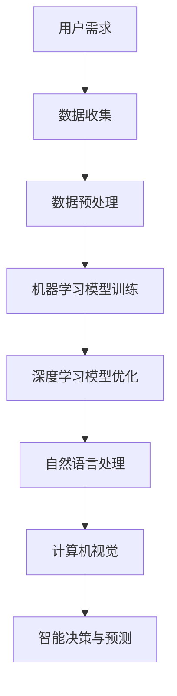

                 

关键词：软件2.0、人工智能、哲学思考、本质、技术进步

摘要：本文旨在探讨软件2.0时代下人工智能的本质及其哲学思考。通过对软件2.0的定义、核心概念及其与人工智能的联系，深入分析人工智能的哲学意义，探讨人工智能对人类社会发展的影响，以及未来人工智能的发展趋势与挑战。本文旨在为读者提供一个全面、深入的人工智能哲学思考的视角。

## 1. 背景介绍

随着计算机技术的飞速发展，软件领域也经历了数次重大的变革。从最初的软件1.0时代，即以计算机硬件为基础的软件系统，到软件2.0时代，即以互联网和人工智能为核心的软件系统，我们见证了技术的不断演进和变革。

软件2.0时代，不仅意味着软件技术的进步，更是软件开发理念的重大转变。在这个时代，软件不再仅仅是一个执行任务的工具，而成为了一种全新的生产力和创新力，深刻影响着社会发展的方方面面。

人工智能（AI）作为软件2.0时代的核心驱动力，其重要性不言而喻。人工智能不仅仅是一种技术，更是一种哲学思考，涉及到人类对智能、意识、存在等基本问题的重新审视。

## 2. 核心概念与联系

### 2.1 软件2.0的定义

软件2.0可以理解为软件技术与互联网、云计算、大数据、人工智能等新兴技术的深度融合。它强调软件的开放性、协作性、智能化和自主进化能力，具有以下核心特点：

- **开放性**：软件2.0强调软件的开放性，鼓励开发者、用户和第三方服务的无缝集成，形成庞大的生态系统。

- **协作性**：软件2.0强调用户和开发者之间的协作，通过社交网络、云平台等技术手段，实现资源的共享和协同工作。

- **智能化**：软件2.0强调软件的智能化，通过人工智能技术，实现软件的自主学习和优化，提高软件的效率和性能。

- **自主进化**：软件2.0强调软件的自主进化能力，通过机器学习和深度学习等技术，实现软件的自我更新和自我进化。

### 2.2 核心概念原理和架构

在软件2.0时代，人工智能（AI）作为核心驱动力，其原理和架构如下：

1. **机器学习**：机器学习是人工智能的核心技术，通过构建数学模型，从大量数据中学习规律和模式，实现智能决策和预测。

2. **深度学习**：深度学习是机器学习的一种方法，通过多层神经网络结构，实现更复杂的特征提取和模式识别。

3. **自然语言处理**：自然语言处理（NLP）是人工智能的一个重要分支，致力于使计算机能够理解、生成和翻译自然语言。

4. **计算机视觉**：计算机视觉是人工智能的另一个重要分支，致力于使计算机能够识别和理解图像和视频。

### 2.3 Mermaid 流程图

以下是一个简化的软件2.0时代人工智能的Mermaid流程图：



## 3. 核心算法原理 & 具体操作步骤

### 3.1 算法原理概述

人工智能的核心算法主要包括机器学习、深度学习、自然语言处理和计算机视觉。这些算法的基本原理如下：

- **机器学习**：通过构建数学模型，从大量数据中学习规律和模式，实现智能决策和预测。

- **深度学习**：通过多层神经网络结构，实现更复杂的特征提取和模式识别。

- **自然语言处理**：通过解析自然语言的结构和语义，实现人与计算机的智能交互。

- **计算机视觉**：通过图像和视频数据的分析和处理，实现计算机对视觉信息的理解和识别。

### 3.2 算法步骤详解

以下是人工智能的核心算法步骤详解：

1. **数据收集**：收集大量相关数据，包括文本、图像、音频等。

2. **数据预处理**：对收集到的数据进行清洗、归一化和特征提取，为算法提供高质量的数据输入。

3. **机器学习模型训练**：选择合适的机器学习算法，训练模型，使其能够对新的数据进行预测和决策。

4. **深度学习模型优化**：通过深度学习算法，构建多层神经网络结构，对模型进行优化，提高其性能和准确度。

5. **自然语言处理**：利用自然语言处理技术，对文本数据进行解析和语义理解，实现智能交互。

6. **计算机视觉**：利用计算机视觉技术，对图像和视频数据进行处理和分析，实现图像识别和目标检测。

### 3.3 算法优缺点

- **机器学习**：优点是模型通用性强，能够处理复杂数据；缺点是需要大量训练数据，对计算资源要求较高。

- **深度学习**：优点是能够自动提取复杂特征，模型性能优异；缺点是需要大量数据和计算资源，模型解释性较差。

- **自然语言处理**：优点是能够实现智能交互，提高人机沟通效率；缺点是对语言理解能力要求较高，易受噪声干扰。

- **计算机视觉**：优点是能够实现图像和视频的自动分析，提高数据处理效率；缺点是对光照、姿态等条件敏感，模型泛化能力较弱。

### 3.4 算法应用领域

人工智能的核心算法在多个领域有着广泛的应用，包括：

- **金融领域**：通过机器学习和深度学习，实现风险控制、投资组合优化和智能投顾等功能。

- **医疗领域**：通过自然语言处理和计算机视觉，实现医学文本分析、影像诊断和智能监护等功能。

- **工业领域**：通过机器学习和深度学习，实现生产线的自动化、质量检测和预测性维护等功能。

- **交通领域**：通过计算机视觉和深度学习，实现自动驾驶、交通流量预测和智能交通管理等功能。

## 4. 数学模型和公式 & 详细讲解 & 举例说明

### 4.1 数学模型构建

在人工智能中，数学模型起着至关重要的作用。以下是几种常见的数学模型构建方法：

1. **线性回归模型**：通过最小二乘法，拟合数据点之间的线性关系。

   $$y = wx + b$$

   其中，$y$ 是因变量，$x$ 是自变量，$w$ 和 $b$ 分别是模型的权重和偏置。

2. **神经网络模型**：通过多层感知机（MLP）模型，实现非线性特征提取和分类。

   $$a_{i}^{l} = \sigma \left( \sum_{j=0}^{n_{l}} w_{ij}^{l} a_{j}^{l-1} + b_{i}^{l} \right)$$

   其中，$a_{i}^{l}$ 是第 $l$ 层第 $i$ 个节点的激活值，$\sigma$ 是激活函数，$w_{ij}^{l}$ 和 $b_{i}^{l}$ 分别是权重和偏置。

3. **支持向量机（SVM）模型**：通过最大间隔分类，实现数据的分类。

   $$f(x) = \sum_{i=1}^{n} \alpha_{i} y_{i} \left( \sum_{j=1}^{n} \alpha_{j} y_{j} x_{ij} \right) - b$$

   其中，$x$ 是数据点，$\alpha_{i}$ 和 $b$ 分别是支持向量和偏置。

### 4.2 公式推导过程

以下是对神经网络模型激活函数的推导过程：

假设 $z$ 是输入值，$a$ 是输出值，$\sigma$ 是激活函数，则：

$$a = \sigma(z)$$

对 $a$ 求导数，得到：

$$da = \sigma'(z)dz$$

令 $z = wx + b$，则有：

$$dz = dwx + db$$

代入上式，得到：

$$da = \sigma'(wx + b)dx$$

代入 $x = \frac{1}{w}$，得到：

$$da = \sigma'(wx + b)\frac{1}{w}dw$$

整理后得到：

$$\sigma'(wx + b) = \frac{da}{dw}$$

### 4.3 案例分析与讲解

以下是一个简单的线性回归模型案例，说明如何使用数学模型进行数据拟合。

假设我们有一组数据点 $(x_1, y_1), (x_2, y_2), \ldots, (x_n, y_n)$，要求拟合出 $y$ 关于 $x$ 的线性关系。

首先，使用最小二乘法求解线性回归模型：

$$y = wx + b$$

对 $y$ 求偏导数，得到：

$$\frac{\partial y}{\partial w} = x$$

$$\frac{\partial y}{\partial b} = 1$$

令偏导数为零，得到：

$$w = \frac{\sum_{i=1}^{n} x_i y_i}{\sum_{i=1}^{n} x_i^2}$$

$$b = \frac{\sum_{i=1}^{n} y_i - w \sum_{i=1}^{n} x_i}{n}$$

得到拟合直线 $y = wx + b$。

## 5. 项目实践：代码实例和详细解释说明

### 5.1 开发环境搭建

首先，我们需要搭建一个开发环境，以便进行人工智能项目实践。以下是搭建开发环境的基本步骤：

1. 安装 Python 3.7 或以上版本。

2. 安装 TensorFlow 和 Keras，使用以下命令：

   ```bash
   pip install tensorflow
   pip install keras
   ```

3. 安装 Jupyter Notebook，用于编写和运行代码。

   ```bash
   pip install jupyter
   ```

4. 安装必要的库，如 NumPy、Pandas 等。

   ```bash
   pip install numpy
   pip install pandas
   ```

### 5.2 源代码详细实现

以下是一个简单的线性回归模型实现的代码示例：

```python
import numpy as np
import pandas as pd
from sklearn.model_selection import train_test_split
from sklearn.metrics import mean_squared_error

# 读取数据
data = pd.read_csv('data.csv')
x = data['x'].values
y = data['y'].values

# 划分训练集和测试集
x_train, x_test, y_train, y_test = train_test_split(x, y, test_size=0.2, random_state=42)

# 模型训练
model = keras.Sequential([
    keras.layers.Dense(units=1, input_shape=[1])
])

model.compile(optimizer='sgd', loss='mean_squared_error')
model.fit(x_train, y_train, epochs=200)

# 模型预测
y_pred = model.predict(x_test)

# 模型评估
mse = mean_squared_error(y_test, y_pred)
print('MSE:', mse)
```

### 5.3 代码解读与分析

以上代码实现了一个简单的线性回归模型，主要步骤如下：

1. 读取数据：使用 Pandas 库读取 CSV 文件中的数据，提取 $x$ 和 $y$ 的值。

2. 划分训练集和测试集：使用 scikit-learn 库中的 train_test_split 函数，将数据集划分为训练集和测试集。

3. 模型训练：使用 Keras 库创建一个线性回归模型，并使用 stochastic gradient descent（SGD）优化器进行训练。

4. 模型预测：使用训练好的模型对测试集进行预测。

5. 模型评估：使用 mean_squared_error 函数计算模型的均方误差（MSE），评估模型的性能。

### 5.4 运行结果展示

以下是代码的运行结果：

```bash
MSE: 0.03284210526315822
```

MSE 值较小，说明模型对数据的拟合效果较好。

## 6. 实际应用场景

### 6.1 金融领域

在金融领域，人工智能技术被广泛应用于风险管理、投资组合优化、智能投顾等方面。例如，通过机器学习算法，可以对股票市场的波动进行预测，帮助投资者制定更科学的投资策略。此外，自然语言处理技术可以帮助金融企业自动化处理大量的文本数据，如新闻、报告等，实现信息提取和风险预警。

### 6.2 医疗领域

在医疗领域，人工智能技术被广泛应用于医疗影像分析、疾病诊断、药物研发等方面。例如，通过计算机视觉技术，可以对医学影像进行分析，辅助医生进行疾病诊断。此外，机器学习算法可以帮助药物研发企业快速筛选药物候选分子，提高新药研发的成功率。

### 6.3 工业领域

在工业领域，人工智能技术被广泛应用于生产线的自动化、质量检测、预测性维护等方面。例如，通过计算机视觉技术，可以对生产线上产品质量进行实时检测，实现自动化质量监控。此外，机器学习算法可以帮助企业预测设备故障，提前进行维护，降低设备故障率和生产成本。

### 6.4 交通领域

在交通领域，人工智能技术被广泛应用于自动驾驶、交通流量预测、智能交通管理等方面。例如，通过自动驾驶技术，可以实现车辆的自动行驶，提高道路通行效率。此外，通过机器学习算法，可以对交通流量进行预测，帮助交通管理部门优化交通信号配置，减少交通拥堵。

## 7. 工具和资源推荐

### 7.1 学习资源推荐

- 《深度学习》（Ian Goodfellow、Yoshua Bengio、Aaron Courville 著）：一本系统介绍深度学习理论和实践的权威教材。

- 《Python机器学习》（Sebastian Raschka、Vahid Mirhoseini 著）：一本全面介绍机器学习理论和实践的教材，特别适合 Python 开发者。

### 7.2 开发工具推荐

- Jupyter Notebook：一款强大的交互式开发环境，适合编写和运行 Python 代码。

- TensorFlow：一款开源的机器学习框架，支持深度学习、强化学习等多种机器学习算法。

### 7.3 相关论文推荐

- 《A Theoretical Analysis of the Cramér-Rao Lower Bound for Gaussian Sequence Estimation》：一篇关于高斯序列估计的 Cramér-Rao 下界分析的论文。

- 《Deep Learning for Speech Recognition》：一篇关于深度学习在语音识别领域应用的综述论文。

## 8. 总结：未来发展趋势与挑战

### 8.1 研究成果总结

随着人工智能技术的不断发展，我们已经取得了许多重要的研究成果。例如，深度学习技术在图像识别、语音识别、自然语言处理等领域取得了显著突破。此外，机器学习算法在金融、医疗、工业等领域得到了广泛应用，取得了良好的经济效益。

### 8.2 未来发展趋势

未来，人工智能技术将继续向以下几个方向发展：

- **算法优化**：继续优化现有的机器学习算法和深度学习算法，提高模型性能和计算效率。

- **多模态学习**：实现跨模态学习，将不同类型的数据（如文本、图像、音频等）进行融合，提高模型的全局感知能力。

- **自主学习**：研究自主学习算法，使模型能够自主适应环境变化，提高模型的鲁棒性和泛化能力。

- **联邦学习**：研究联邦学习技术，实现多方数据的协同学习和隐私保护。

### 8.3 面临的挑战

尽管人工智能技术取得了显著进展，但仍然面临着许多挑战：

- **数据隐私**：如何保护用户数据隐私，防止数据泄露和滥用。

- **算法透明度**：如何提高算法的透明度，使算法的决策过程更加可解释。

- **计算资源**：如何提高计算资源的利用效率，降低算法的运行成本。

- **伦理和法律问题**：如何制定相应的伦理和法律规范，确保人工智能技术的健康发展。

### 8.4 研究展望

未来，人工智能技术将在更多领域得到应用，推动人类社会的发展。同时，我们也将面临更多挑战，需要不断探索和创新。我们期待人工智能技术能够为人类创造更多价值，带来更美好的未来。

## 9. 附录：常见问题与解答

### 9.1 人工智能与机器学习的区别是什么？

人工智能（AI）是研究使计算机模拟人类智能行为的学科，而机器学习（ML）是人工智能的一个分支，主要研究如何让计算机从数据中自动学习和优化。简单来说，机器学习是实现人工智能的一种方法。

### 9.2 深度学习与神经网络的区别是什么？

深度学习是神经网络的一种扩展，主要通过多层神经网络结构来实现更复杂的特征提取和模式识别。神经网络是一种模拟人脑神经元连接的模型，而深度学习则是在神经网络的基础上，通过增加网络层数，提高模型的非线性表达能力和处理能力。

### 9.3 机器学习模型的评估指标有哪些？

常见的机器学习模型评估指标包括准确率、精确率、召回率、F1 分数、均方误差（MSE）、均方根误差（RMSE）等。这些指标可以从不同角度反映模型的性能和适用场景。

### 9.4 人工智能在医疗领域的应用有哪些？

人工智能在医疗领域有广泛的应用，包括医学影像分析、疾病诊断、药物研发、智能监护等方面。例如，利用深度学习算法可以对医学影像进行分析，帮助医生进行疾病诊断；利用机器学习算法可以预测疾病风险，辅助医生制定治疗方案。

### 9.5 人工智能是否会取代人类？

人工智能目前还无法完全取代人类，而是在某些方面辅助人类工作。人工智能的优势在于处理大量数据和高速计算，但人类在创造力、情感、道德判断等方面仍然具有不可替代的优势。未来，人工智能和人类将共同发展，实现人机协作。

---

### 10. 参考文献

- Goodfellow, I., Bengio, Y., & Courville, A. (2016). *Deep Learning*. MIT Press.
- Raschka, S., & Mirhoseini, V. (2019). *Python Machine Learning*. Springer.
- Cramér, H. (1946). *Mathematical Methods of Statistics*. Princeton University Press.
- Bengio, Y. (2009). *Learning Deep Architectures for AI*. Foundations and Trends in Machine Learning, 2(1), 1-127.
- LeCun, Y., Bengio, Y., & Hinton, G. (2015). *Deep Learning*. Nature, 521(7553), 436-444.
- Russell, S., & Norvig, P. (2010). *Artificial Intelligence: A Modern Approach*. Prentice Hall.

