                 

关键词：软件 2.0、视觉识别、语音识别、语音合成、核心算法、应用领域、数学模型、代码实例

摘要：随着人工智能技术的迅猛发展，软件 2.0 时代已经到来。视觉识别、语音识别和语音合成作为软件 2.0 的典型应用，极大地改变了人们的生产和生活方式。本文将深入探讨这些技术的核心原理、算法实现、应用场景以及未来发展趋势。

## 1. 背景介绍

在过去的几十年里，计算机软件经历了从 1.0 到 2.0 的巨大变革。软件 1.0 时代主要侧重于实现计算功能，如文字处理、表格计算和简单的图形处理。而软件 2.0 时代，人工智能成为核心技术，使得软件能够模拟人类的感知、理解和决策能力。

视觉识别、语音识别和语音合成作为软件 2.0 的三大应用领域，已经广泛应用于各行各业。视觉识别技术使得计算机能够识别和理解图像、视频中的内容；语音识别技术使得计算机能够将人类的语音转化为文字；语音合成技术则使得计算机能够生成自然流畅的语音。

## 2. 核心概念与联系

### 2.1 视觉识别

视觉识别技术是指计算机利用图像处理、计算机视觉和机器学习等技术，对图像或视频中的物体、场景和动作进行识别和理解。其核心算法包括卷积神经网络（CNN）、目标检测和图像分类等。

### 2.2 语音识别

语音识别技术是指计算机利用信号处理、模式识别和自然语言处理等技术，将人类的语音转化为文字。其核心算法包括隐马尔可夫模型（HMM）、高斯混合模型（GMM）和深度神经网络（DNN）等。

### 2.3 语音合成

语音合成技术是指计算机利用语音信号处理和自然语言处理等技术，生成自然流畅的语音。其核心算法包括波形合成、参数合成和文本到语音（TTS）等。

### 2.4 Mermaid 流程图

```mermaid
graph TD
    A[视觉识别] --> B[图像处理]
    A --> C[计算机视觉]
    A --> D[机器学习]
    B --> E[卷积神经网络]
    B --> F[目标检测]
    B --> G[图像分类]
    C --> H[深度学习]
    C --> I[特征提取]
    D --> J[监督学习]
    D --> K[无监督学习]
    D --> L[增强学习]
    E --> M[卷积层]
    E --> N[池化层]
    F --> O[区域提议网络]
    F --> P[边界框回归]
    G --> Q[softmax]
    G --> R[交叉熵]
    H --> S[卷积神经网络]
    H --> T[循环神经网络]
    I --> U[特征向量]
    I --> V[特征矩阵]
    J --> W[梯度下降]
    J --> X[随机梯度下降]
    K --> Y[自编码器]
    K --> Z[聚类算法]
    L --> AA[强化学习算法]
    AA --> BB[奖励机制]
    BB --> CC[策略网络]
    M --> DD[卷积核]
    M --> EE[激活函数]
    N --> FF[步长]
    N --> GG[填充方式]
    O --> HH[候选区域]
    O --> II[置信度]
    P --> JJ[回归目标]
    P --> KK[预测误差]
    Q --> LL[输出概率]
    Q --> MM[预测结果]
    R --> NN[真实标签]
    R --> OO[损失函数]
    S --> PP[卷积层]
    S --> QQ[池化层]
    T --> RR[循环层]
    T --> SS[输出层]
    U --> TT[特征值]
    U --> WW[特征维度]
    V --> XX[特征矩阵]
    V --> YY[特征矩阵维度]
    W --> ZZ[学习率]
    W --> AAA[动量]
    X --> BBB[批量大小]
    Y --> CCC[编码器]
    Y --> DDD[解码器]
    Z --> EEE[聚类中心]
    Z --> FFF[聚类结果]
    AA --> GGG[奖励函数]
    AA --> HHH[策略梯度]
    BB --> III[奖励得分]
    CC --> JJ[策略选择]
    DD --> KKK[卷积核]
    DD --> LLL[激活函数]
    EE --> MMM[步长]
    EE --> NNN[填充方式]
    FF --> OOO[候选区域]
    FF --> PPP[置信度]
    GG --> QQQ[回归目标]
    GG --> RRR[预测误差]
    HH --> SSS[特征向量]
    HH --> TTT[特征向量维度]
    II --> UUU[置信度值]
    II --> VVV[置信度矩阵]
    JJ --> WWW[真实值]
    JJ --> XXX[预测值]
    KK --> YYY[回归误差]
    KK --> ZZZ[损失函数值]
    LL --> AAAA[输出概率]
    LL --> BBBB[预测结果]
    MM --> CCCD[卷积结果]
    MM --> DDDD[卷积层输出]
    NN --> EEED[真实标签]
    NN --> FFED[损失函数]
    OO --> GGGD[损失函数]
    OO --> HHHD[预测结果]
    PPP --> IIID[真实值]
    PPP --> JJJD[预测值]
    QQQ --> KKKD[回归目标]
    QQQ --> LLKD[预测误差]
    RRR --> MMMD[特征向量]
    RRR --> NNND[特征向量维度]
    SSS --> OOOE[置信度值]
    SSS --> PPPD[置信度矩阵]
    TTT --> QQOE[置信度矩阵维度]
    WWW --> XWWW[真实值]
    WWW --> XXWD[预测值]
    XXX --> YYWD[预测结果]
    YYY --> ZZZD[回归误差]
    ZZZ --> AAAE[损失函数]
    ZZZ --> BBBE[预测值]
    AAAA --> CCCF[输出概率]
    CCCD --> DCCD[卷积层输出]
    DDDD --> EEED[卷积结果]
    FFED --> GGGF[损失函数]
    GGGF --> HHHF[预测结果]
    EEED --> IIIF[真实标签]
    IIIF --> JJIF[损失函数]
    FFIF --> GGGF[损失函数]
    GGGF --> HHHF[预测结果]
    IIID --> IIIF[真实值]
    IIIF --> JJIF[预测值]
    JJJD --> KKJD[回归目标]
    KKJD --> LLJD[预测误差]
    MMMD --> OOOE[置信度值]
    NNND --> PPPD[置信度矩阵]
    NNND --> QQOE[置信度矩阵维度]
    XWWW --> XWWW[真实值]
    XXWD --> XXWD[预测值]
    YYWD --> YYWD[预测结果]
    ZZZD --> ZZZD[回归误差]
    ZZZD --> AAAE[损失函数]
    ZZZD --> BBBE[预测值]
    CCCF --> DDDDF[输出概率]
    DCCD --> EECD[卷积层输出]
    EECD --> FFCD[卷积结果]
    FFCD --> GGGD[损失函数]
    GGGD --> HHHF[预测结果]
    EECD --> IIID[真实标签]
    IIID --> JJIF[损失函数]
    FFID --> GGGD[损失函数]
    GGGD --> HHHF[预测结果]
    IIIF --> IIIF[真实值]
    IIIF --> JJIF[预测值]
    JJJD --> KKJD[回归目标]
    KKJD --> LLJD[预测误差]
    OOOE --> QQQF[置信度值]
    PPPD --> RRRD[置信度矩阵]
    QQOE --> SSSD[置信度矩阵维度]
    XWWW --> XXWD[真实值]
    XXWD --> XXWD[预测值]
    YYWD --> YYWD[预测结果]
    ZZZD --> ZZZD[回归误差]
    ZZZD --> AAAE[损失函数]
    ZZZD --> BBBE[预测值]
```



## 3. 核心算法原理 & 具体操作步骤

### 3.1 算法原理概述

视觉识别算法的核心原理是基于卷积神经网络（CNN）进行特征提取和分类。首先，输入的图像经过卷积层和池化层，提取出图像的特征。然后，通过全连接层进行分类，得到最终的识别结果。

语音识别算法的核心原理是基于深度神经网络（DNN）进行声学建模和语言建模。声学建模用于提取语音信号的特征，语言建模用于生成对应的文字输出。

语音合成算法的核心原理是基于文本到语音（TTS）技术进行语音合成。首先，输入的文本经过语言模型生成对应的声码器参数。然后，通过声码器生成语音波形。

### 3.2 算法步骤详解

#### 3.2.1 视觉识别算法步骤

1. 数据预处理：对输入的图像进行缩放、裁剪、翻转等预处理操作，使得网络能够接受统一格式的输入。
2. 卷积层：使用卷积核在图像上滑动，对图像进行卷积操作，提取图像特征。
3. 池化层：对卷积层输出的特征进行下采样，减少数据维度。
4. 全连接层：将池化层输出的特征进行全连接操作，得到分类结果。
5. 损失函数：使用交叉熵损失函数计算分类误差，并使用梯度下降算法更新网络参数。

#### 3.2.2 语音识别算法步骤

1. 数据预处理：对输入的语音信号进行加窗、滤除噪声等预处理操作。
2. 声学建模：使用深度神经网络提取语音信号的特征。
3. 语言建模：使用循环神经网络（RNN）或 Transformer 模型生成对应的文字输出。
4. 损失函数：使用交叉熵损失函数计算声学建模和语言建模的误差，并使用梯度下降算法更新网络参数。

#### 3.2.3 语音合成算法步骤

1. 文本预处理：对输入的文本进行分词、拼音标注等预处理操作。
2. 语言模型：使用神经网络生成对应的声码器参数。
3. 声码器：使用声码器生成语音波形。
4. 损失函数：使用音频交叉熵损失函数计算语音合成误差，并使用梯度下降算法更新网络参数。

### 3.3 算法优缺点

#### 3.3.1 视觉识别算法

优点：

- 高效的特征提取能力：卷积神经网络能够自动提取图像的层次化特征，减少人工设计的复杂度。
- 强大的分类能力：通过全连接层和损失函数，视觉识别算法能够实现高效的分类。

缺点：

- 需要大量的训练数据：卷积神经网络的训练需要大量的图像数据，训练时间较长。
- 对计算资源要求较高：卷积神经网络在训练和推理过程中需要大量的计算资源，对硬件性能有较高要求。

#### 3.3.2 语音识别算法

优点：

- 高效的语音识别能力：深度神经网络能够自动提取语音信号的特征，实现高效的语音识别。
- 对噪声干扰具有较强的鲁棒性：通过声学建模和语言建模，语音识别算法能够有效抵抗噪声干扰。

缺点：

- 需要大量的训练数据：深度神经网络的训练需要大量的语音数据，训练时间较长。
- 对计算资源要求较高：深度神经网络的训练和推理需要大量的计算资源，对硬件性能有较高要求。

#### 3.3.3 语音合成算法

优点：

- 高质量的语音输出：通过文本预处理和语言模型，语音合成算法能够生成自然流畅的语音。
- 灵活性强：语音合成算法可以根据输入的文本生成对应的语音，具有较强的灵活性。

缺点：

- 对计算资源要求较高：语音合成算法在生成语音的过程中需要大量的计算资源，对硬件性能有较高要求。
- 难以实现情感表达：目前的语音合成算法难以实现情感表达，生成的语音较为平淡。

### 3.4 算法应用领域

视觉识别算法广泛应用于计算机视觉领域，如人脸识别、目标检测、图像分类等。

语音识别算法广泛应用于智能语音助手、语音翻译、语音输入等领域。

语音合成算法广泛应用于语音合成、智能语音交互等领域。

## 4. 数学模型和公式 & 详细讲解 & 举例说明

### 4.1 数学模型构建

#### 4.1.1 视觉识别数学模型

输入图像 $X \in \mathbb{R}^{H \times W \times C}$，其中 $H$、$W$ 和 $C$ 分别表示图像的高度、宽度和通道数。

卷积层输出 $F \in \mathbb{R}^{H' \times W' \times C'}$，其中 $H'$、$W'$ 和 $C'$ 分别表示卷积层输出图像的高度、宽度和通道数。

$$
F_{i,j,k} = \sum_{m=1}^{C} W_{i,m,k} \times X_{i-m,j-m} + b_{i,k}
$$

池化层输出 $G \in \mathbb{R}^{H'' \times W''}$，其中 $H''$ 和 $W''$ 分别表示池化层输出图像的高度和宽度。

$$
G_{i,j} = \max_{p,q} F_{i+p,j+q}
$$

全连接层输出 $Y \in \mathbb{R}^{N}$，其中 $N$ 表示分类结果的类别数。

$$
Y_i = \sigma(\sum_{j=1}^{H'' \times W''} W_{i,j} \times G_{j} + b_i)
$$

分类结果 $Y^* \in \{1,2,\ldots,N\}$，其中 $Y^*$ 表示预测的类别。

损失函数 $L \in \mathbb{R}$。

$$
L = -\sum_{i=1}^{N} Y_i^* \log(Y_i)
$$

#### 4.1.2 语音识别数学模型

输入语音信号 $X \in \mathbb{R}^{T \times M}$，其中 $T$ 表示语音信号的时长，$M$ 表示语音信号的通道数。

声学建模输出 $A \in \mathbb{R}^{T \times K}$，其中 $K$ 表示声学建模输出的维度。

$$
A_t = \sigma(\sum_{m=1}^{M} W_{a,m,t} \times X_t + b_a)
$$

语言建模输出 $L \in \mathbb{R}^{T \times V}$，其中 $V$ 表示语言建模输出的维度。

$$
L_t = \sum_{v=1}^{V} W_{l,v,t} \times A_t + b_l
$$

文本输出 $Y \in \{1,2,\ldots,V\}$，其中 $Y$ 表示预测的文本。

损失函数 $L \in \mathbb{R}$。

$$
L = -\sum_{t=1}^{T} \log(L_t^Y)
$$

#### 4.1.3 语音合成数学模型

输入文本 $X \in \{1,2,\ldots,V\}^{T}$，其中 $T$ 表示文本的长度，$V$ 表示文本的维度。

语言模型输出 $L \in \mathbb{R}^{T \times K}$，其中 $K$ 表示语言模型输出的维度。

$$
L_t = \sum_{v=1}^{V} W_{l,v,t} \times X_t + b_l
$$

声码器输出 $A \in \mathbb{R}^{T \times M}$，其中 $M$ 表示声码器输出的维度。

$$
A_t = \sigma(\sum_{m=1}^{M} W_{a,m,t} \times L_t + b_a)
$$

语音输出 $Y \in \mathbb{R}^{T \times N}$，其中 $N$ 表示语音输出的维度。

损失函数 $L \in \mathbb{R}$。

$$
L = -\sum_{t=1}^{T} \log(Y_t^A)
$$

### 4.2 公式推导过程

#### 4.2.1 视觉识别公式推导

1. **卷积层**：

   卷积层的基本公式为：

   $$F_{i,j,k} = \sum_{m=1}^{C} W_{i,m,k} \times X_{i-m,j-m} + b_{i,k}$$

   其中，$W_{i,m,k}$ 为卷积核，$b_{i,k}$ 为偏置项。

2. **池化层**：

   池化层的基本公式为：

   $$G_{i,j} = \max_{p,q} F_{i+p,j+q}$$

   其中，$F_{i+p,j+q}$ 为卷积层输出。

3. **全连接层**：

   全连接层的基本公式为：

   $$Y_i = \sigma(\sum_{j=1}^{H'' \times W''} W_{i,j} \times G_{j} + b_i)$$

   其中，$W_{i,j}$ 为权重，$G_{j}$ 为池化层输出，$b_i$ 为偏置项。

4. **损失函数**：

   交叉熵损失函数的基本公式为：

   $$L = -\sum_{i=1}^{N} Y_i^* \log(Y_i)$$

   其中，$Y_i$ 为预测概率，$Y_i^*$ 为真实标签。

#### 4.2.2 语音识别公式推导

1. **声学建模**：

   声学建模的基本公式为：

   $$A_t = \sigma(\sum_{m=1}^{M} W_{a,m,t} \times X_t + b_a)$$

   其中，$X_t$ 为语音信号，$W_{a,m,t}$ 为声学建模权重，$b_a$ 为偏置项。

2. **语言建模**：

   语言建模的基本公式为：

   $$L_t = \sum_{v=1}^{V} W_{l,v,t} \times A_t + b_l$$

   其中，$W_{l,v,t}$ 为语言建模权重，$b_l$ 为偏置项。

3. **损失函数**：

   交叉熵损失函数的基本公式为：

   $$L = -\sum_{t=1}^{T} \log(L_t^Y)$$

   其中，$L_t^Y$ 为语言建模输出。

#### 4.2.3 语音合成公式推导

1. **语言模型**：

   语言模型的基本公式为：

   $$L_t = \sum_{v=1}^{V} W_{l,v,t} \times X_t + b_l$$

   其中，$X_t$ 为文本，$W_{l,v,t}$ 为语言模型权重，$b_l$ 为偏置项。

2. **声码器**：

   声码器的基本公式为：

   $$A_t = \sigma(\sum_{m=1}^{M} W_{a,m,t} \times L_t + b_a)$$

   其中，$L_t$ 为语言模型输出，$W_{a,m,t}$ 为声码器权重，$b_a$ 为偏置项。

3. **损失函数**：

   音频交叉熵损失函数的基本公式为：

   $$L = -\sum_{t=1}^{T} \log(Y_t^A)$$

   其中，$Y_t^A$ 为声码器输出。

### 4.3 案例分析与讲解

#### 4.3.1 视觉识别案例

假设我们有一个包含 1000 个类别的图像分类问题，输入图像的尺寸为 224×224×3，我们使用 ResNet-50 作为视觉识别模型。

1. **数据预处理**：

   对输入的图像进行缩放，使得图像的尺寸为 224×224×3。

2. **卷积层**：

   ResNet-50 的第一层卷积层使用 7×7×3 的卷积核，步长为 2，填充方式为 'same'。

   $$F_{i,j,k} = \sum_{m=1}^{3} W_{i,m,k} \times X_{i-m,j-m} + b_{i,k}$$

3. **池化层**：

   ResNet-50 的第一层池化层使用 3×3 的最大池化。

   $$G_{i,j} = \max_{p,q} F_{i+p,j+q}$$

4. **全连接层**：

   ResNet-50 的最后一层全连接层使用 1000 个神经元，激活函数为 softmax。

   $$Y_i = \sigma(\sum_{j=1}^{H'' \times W''} W_{i,j} \times G_{j} + b_i)$$

5. **损失函数**：

   使用交叉熵损失函数计算分类误差。

   $$L = -\sum_{i=1}^{1000} Y_i^* \log(Y_i)$$

#### 4.3.2 语音识别案例

假设我们有一个包含中文文本的语音识别问题，输入的语音信号时长为 10 秒，使用 DeepSpeech 2 作为语音识别模型。

1. **数据预处理**：

   对输入的语音信号进行加窗和滤除噪声。

2. **声学建模**：

   DeepSpeech 2 使用 LSTM 网络进行声学建模，声学建模输出的维度为 1024。

   $$A_t = \sigma(\sum_{m=1}^{M} W_{a,m,t} \times X_t + b_a)$$

3. **语言建模**：

   DeepSpeech 2 使用 CTC（Connectionist Temporal Classification）进行语言建模。

   $$L_t = \sum_{v=1}^{V} W_{l,v,t} \times A_t + b_l$$

4. **损失函数**：

   使用交叉熵损失函数计算声学建模和语言建模的误差。

   $$L = -\sum_{t=1}^{T} \log(L_t^Y)$$

#### 4.3.3 语音合成案例

假设我们有一个包含中文文本的语音合成问题，输入的文本长度为 10 个字，使用 DeepVoice 3 作为语音合成模型。

1. **数据预处理**：

   对输入的文本进行分词和拼音标注。

2. **语言模型**：

   DeepVoice 3 使用 LSTM 网络进行语言建模，语言建模输出的维度为 1024。

   $$L_t = \sum_{v=1}^{V} W_{l,v,t} \times X_t + b_l$$

3. **声码器**：

   DeepVoice 3 使用 WaveNet 进行声码器，声码器输出的维度为 24。

   $$A_t = \sigma(\sum_{m=1}^{M} W_{a,m,t} \times L_t + b_a)$$

4. **损失函数**：

   使用音频交叉熵损失函数计算语音合成误差。

   $$L = -\sum_{t=1}^{T} \log(Y_t^A)$$

## 5. 项目实践：代码实例和详细解释说明

### 5.1 开发环境搭建

1. 安装 Python 3.7 或以上版本。
2. 安装 TensorFlow 2.0 或以上版本。
3. 安装 Keras 2.2.4 或以上版本。

### 5.2 源代码详细实现

#### 5.2.1 视觉识别代码实现

```python
import tensorflow as tf
from tensorflow.keras.applications import ResNet50
from tensorflow.keras.preprocessing.image import ImageDataGenerator

# 加载预训练的 ResNet50 模型
base_model = ResNet50(weights='imagenet', include_top=False, input_shape=(224, 224, 3))

# 添加全连接层和 Softmax 层
x = base_model.output
x = tf.keras.layers.Flatten()(x)
x = tf.keras.layers.Dense(1000, activation='softmax')(x)

# 创建模型
model = tf.keras.Model(inputs=base_model.input, outputs=x)

# 编译模型
model.compile(optimizer='adam', loss='categorical_crossentropy', metrics=['accuracy'])

# 加载训练数据
train_datagen = ImageDataGenerator(rescale=1./255)
train_generator = train_datagen.flow_from_directory(
        'data/train',
        target_size=(224, 224),
        batch_size=32,
        class_mode='categorical')

# 训练模型
model.fit(train_generator, epochs=10)
```

#### 5.2.2 语音识别代码实现

```python
import tensorflow as tf
import tensorflow_text as text
from tensorflow.keras.layers import LSTM, Dense, Embedding, TimeDistributed, Bidirectional, Conv1D, MaxPooling1D
from tensorflow.keras.models import Model

# 定义声学建模模型
input_shape = (None, 23)
input_acoustic = tf.keras.Input(shape=input_shape)

x = Embedding(16384, 128)(input_acoustic)
x = Conv1D(128, 3, activation='relu')(x)
x = MaxPooling1D(pool_size=2)(x)
x = Conv1D(128, 3, activation='relu')(x)
x = MaxPooling1D(pool_size=2)(x)
x = Bidirectional(LSTM(128, return_sequences=True))(x)
x = TimeDistributed(Dense(128, activation='relu'))(x)

# 定义语言建模模型
input_text = tf.keras.Input(shape=(None,))
text_embedding = Embedding(5202, 128)(input_text)
encoded = textificio

```markdown
## 6. 实际应用场景

视觉识别、语音识别和语音合成技术已经在多个领域得到广泛应用，下面我们列举一些实际应用场景：

### 6.1 智能安防

视觉识别技术在智能安防领域得到广泛应用，如人脸识别门禁系统、视频监控系统等。通过实时识别监控视频中的目标，可以实现对入侵者的预警和追踪。

### 6.2 智能助手

语音识别和语音合成技术在智能助手领域具有重要应用，如苹果的 Siri、谷歌的 Google Assistant 等。用户可以通过语音命令与智能助手进行交互，完成日程管理、信息查询、在线购物等任务。

### 6.3 自动驾驶

视觉识别技术在自动驾驶领域扮演着关键角色，如车辆识别、行人检测、交通标志识别等。通过实时分析道路环境，自动驾驶系统能够做出准确的决策，确保行车安全。

### 6.4 医疗诊断

语音识别技术可以帮助医生快速识别和记录病历，提高医疗工作效率。同时，结合图像处理技术，医生可以通过分析医疗影像，辅助诊断疾病。

### 6.5 教育

语音合成技术在教育领域具有广泛应用，如语音教科书、听力训练等。通过语音合成，学生可以随时随地学习，提高学习效率。

## 7. 工具和资源推荐

### 7.1 学习资源推荐

- 《深度学习》（Goodfellow、Bengio、Courville 著）
- 《计算机视觉基础与算法应用》（李航 著）
- 《语音信号处理与识别技术》（徐雷 著）

### 7.2 开发工具推荐

- TensorFlow：用于构建和训练深度学习模型。
- Keras：简化 TensorFlow 的开发接口。
- PyTorch：用于构建和训练深度学习模型。

### 7.3 相关论文推荐

- "Convolutional Neural Networks for Speech Recognition"（2014）
- "Deep Neural Networks for Acoustic Modeling in Speech Recognition"（2013）
- "A Theoretically Grounded Application of Dropout in Computer Vision"（2016）

## 8. 总结：未来发展趋势与挑战

### 8.1 研究成果总结

视觉识别、语音识别和语音合成技术在近年来取得了显著成果，模型性能不断提升，应用场景日益丰富。特别是在深度学习技术的推动下，这些技术的应用效果得到了大幅提升。

### 8.2 未来发展趋势

- 模型轻量化：为了满足移动设备和嵌入式设备的需求，模型轻量化将成为研究重点，如知识蒸馏、剪枝等技术。
- 模型压缩：通过模型压缩技术，降低模型的存储和计算成本，提高模型的部署效率。
- 多模态融合：结合多种传感器数据，实现更准确的识别和预测，如视觉识别与语音识别的结合。

### 8.3 面临的挑战

- 数据隐私：随着数据量的增大，数据隐私保护成为亟待解决的问题。
- 计算资源：深度学习模型在训练和推理过程中对计算资源的需求较高，如何优化计算资源成为关键挑战。
- 模型泛化能力：如何提高模型在不同领域、不同场景下的泛化能力，是实现更广泛应用的关键。

### 8.4 研究展望

随着人工智能技术的不断发展，视觉识别、语音识别和语音合成技术将在更多领域得到应用，如智能家居、智能医疗、智能交通等。未来，这些技术将不断优化，实现更高性能、更低成本、更广泛的应用。同时，如何应对数据隐私、计算资源等挑战，也将是研究的重要方向。

## 9. 附录：常见问题与解答

### 9.1 视觉识别技术如何处理图像噪声？

视觉识别技术在处理图像噪声方面主要通过以下几种方法：

1. 数据增强：通过旋转、翻转、缩放、裁剪等操作，生成更多样化的训练数据，提高模型对噪声的鲁棒性。
2. 预处理：使用滤波器（如高斯滤波、中值滤波）对图像进行预处理，减少噪声对模型性能的影响。
3. 特征提取：使用深度神经网络提取图像的特征，能够在一定程度上抑制噪声。

### 9.2 语音识别技术如何处理噪声干扰？

语音识别技术在处理噪声干扰方面主要通过以下几种方法：

1. 预处理：使用滤波器（如带通滤波、波纹滤波）对语音信号进行预处理，减少噪声对模型性能的影响。
2. 噪声抑制：使用自适应噪声抑制技术（如谱减法、变分降噪）对噪声进行抑制。
3. 声学建模：使用噪声干扰下的训练数据，提高模型对噪声干扰的适应性。

### 9.3 语音合成技术如何实现情感表达？

语音合成技术实现情感表达主要通过以下几种方法：

1. 文本情感分析：通过文本情感分析技术，识别输入文本的情感倾向，为语音合成提供情感标注。
2. 超参数调整：调整语音合成模型的超参数（如音调、音量、语速等），实现不同情感的表达。
3. 情感语音库：使用包含多种情感语音的语音库，通过检索和拼接，实现情感语音的合成。

### 9.4 视觉识别技术在医疗诊断中的应用有哪些？

视觉识别技术在医疗诊断中的应用包括：

1. 疾病筛查：通过分析医学影像，如 X 光、CT、MRI 等，实现疾病的自动筛查。
2. 病灶识别：通过分析医学影像，自动识别肿瘤、炎症等病灶区域。
3. 辅助诊断：结合医生的经验和视觉识别技术的分析结果，提高疾病诊断的准确性。

### 9.5 语音识别技术在智能助手中的应用有哪些？

语音识别技术在智能助手中的应用包括：

1. 语音输入：用户可以通过语音命令与智能助手进行交互，实现语音搜索、信息查询等功能。
2. 语音控制：用户可以通过语音命令控制智能助手执行特定操作，如发送短信、拨打电话、设置提醒等。
3. 语音交互：智能助手可以根据用户的语音输入，实现自然语言理解与对话，提供个性化服务。

