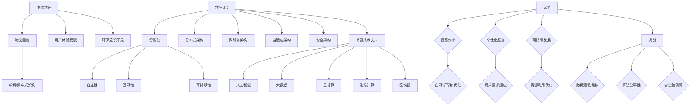

                 

## 1. 背景介绍

随着互联网技术的迅速发展，软件的形态和功能已经发生了翻天覆地的变化。从传统的单机软件到互联网时代的前后端分离，再到如今的云计算、大数据、人工智能等新兴技术，软件正在以惊人的速度演进。然而，在软件技术不断革新的同时，我们也面临着一系列的社会问题，如隐私泄露、数据滥用、算法歧视等。这些问题引发了社会各界的广泛关注，也使得我们不得不重新思考软件技术的责任与担当。

所谓“软件 2.0”，是指继传统软件（Software 1.0）之后的下一代软件，它不仅仅是一个工具或产品，更是一种能够主动适应环境、持续学习和进化的人工智能实体。软件 2.0 的出现，为解决当前软件技术带来的社会问题提供了一种新的思路。然而，如何确保软件 2.0 在推动科技进步的同时，承担起应有的社会责任，成为了一个亟待解决的问题。

本文旨在探讨软件 2.0 的社会责任，特别是在科技向善方面的重要作用。通过分析当前软件技术面临的挑战，阐述软件 2.0 的核心概念与架构，探讨核心算法原理和数学模型，以及在实际应用场景中的表现，我们将尝试回答以下问题：

- 软件技术如何推动科技向善？
- 软件 2.0 如何在实现技术进步的同时，承担社会责任？
- 软件技术在未来发展中将面临哪些挑战和机遇？

希望通过本文的探讨，能够为软件技术的发展提供一些有益的启示，助力构建一个更加公平、透明、包容的数字世界。

## 2. 核心概念与联系

### 2.1. 软件技术的演进

软件技术的演进可以分为几个阶段。首先是传统软件（Software 1.0）时代，这一阶段的软件主要是为特定任务或应用设计的，具有固定的功能和行为。随着互联网的普及，前后端分离的架构逐渐流行，软件开始变得更加模块化和分布式，这就是所谓的Web 1.0和Web 2.0时代。

进入云计算、大数据和人工智能时代，软件技术的演进进入了新的阶段，即软件 2.0时代。软件 2.0 不是简单的功能增强或性能提升，而是一种全新的软件架构和思维模式，它强调软件的智能化、自主学习和持续进化。与传统软件相比，软件 2.0 更加强调与用户的互动和适应性。

### 2.2. 软件 2.0 的核心概念

软件 2.0 的核心概念包括以下几个方面：

1. **智能化**：软件 2.0 通过引入人工智能技术，实现自我学习和优化。它能够根据用户的反馈和操作习惯，自动调整其行为和表现，提供更加个性化和高效的服务。
   
2. **自主性**：软件 2.0 不再是静态的代码集合，而是一个能够自我运行、自我维护和自我优化的系统。它能够在没有人类干预的情况下，完成复杂的任务和决策。

3. **互动性**：软件 2.0 强调与用户的互动和反馈。通过自然语言处理、语音识别等技术，软件 2.0 能够更好地理解用户的需求，提供更加人性化的服务。

4. **可持续性**：软件 2.0 注重环保和可持续发展。它通过优化算法和资源利用，减少能源消耗和环境污染。

### 2.3. 软件 2.0 的架构

软件 2.0 的架构具有以下特点：

1. **分布式架构**：软件 2.0 采用分布式架构，以适应大规模的数据处理和计算需求。它通过云计算和边缘计算等技术，实现数据的分布式存储和处理。

2. **微服务架构**：软件 2.0 采用微服务架构，将复杂的系统拆分成多个独立的服务模块。这样不仅提高了系统的可维护性和扩展性，也方便了不同模块之间的协作和整合。

3. **自适应架构**：软件 2.0 采用自适应架构，能够根据环境和需求的变化，自动调整其结构和行为。这种架构使得软件 2.0 能够更好地适应复杂和动态的环境。

4. **安全架构**：软件 2.0 强调安全性和隐私保护，采用多种安全机制和技术，确保用户数据和系统的安全性。

### 2.4. 软件 2.0 与传统软件的比较

软件 2.0 与传统软件（Software 1.0）在多个方面存在显著差异：

1. **功能**：传统软件主要是为特定任务或应用设计的，功能相对固定。而软件 2.0 则强调智能化和自主性，能够根据环境和需求的变化，自动调整其行为和功能。

2. **架构**：传统软件通常采用单机或集中式架构，而软件 2.0 则采用分布式和微服务架构，以适应大规模的数据处理和计算需求。

3. **用户体验**：传统软件的用户体验主要依赖于界面设计和操作流程，而软件 2.0 则通过人工智能和自然语言处理等技术，提供更加个性化和高效的服务。

4. **可持续性**：传统软件在环保和可持续发展方面关注较少，而软件 2.0 则注重优化算法和资源利用，减少能源消耗和环境污染。

### 2.5. 软件 2.0 的关键技术

软件 2.0 的实现依赖于多种关键技术的支持，包括：

1. **人工智能**：软件 2.0 的智能化功能依赖于人工智能技术，如机器学习、深度学习、自然语言处理等。

2. **大数据**：软件 2.0 的数据驱动力依赖于大数据技术，包括数据采集、存储、处理和分析等。

3. **云计算**：软件 2.0 的分布式架构依赖于云计算技术，包括虚拟化、容器化、分布式存储和计算等。

4. **边缘计算**：软件 2.0 的实时性和高效性依赖于边缘计算技术，将计算和处理能力分布到网络边缘，以减少延迟和带宽需求。

5. **区块链**：软件 2.0 的安全性和隐私保护依赖于区块链技术，通过去中心化和加密算法，确保数据的真实性和安全性。

### 2.6. 软件 2.0 的优势与挑战

软件 2.0 具有许多优势，如智能化、自主性、互动性和可持续性，但同时也面临一些挑战：

1. **优势**：
   - 提高效率：软件 2.0 能够自动学习和优化，提高任务完成的效率和准确性。
   - 个性化服务：软件 2.0 能够根据用户的需求和习惯，提供个性化的服务和建议。
   - 可持续发展：软件 2.0 注重环保和资源利用，有助于实现可持续发展目标。

2. **挑战**：
   - 数据隐私：软件 2.0 需要大量用户数据来训练和学习，如何保护用户隐私成为一大挑战。
   - 算法公平性：软件 2.0 的决策和推荐可能存在算法偏见，如何确保算法的公平性和透明性需要深入探讨。
   - 安全性：软件 2.0 的分布式和智能化特性使得系统更加复杂，如何确保系统的安全性和可靠性成为一大挑战。

总的来说，软件 2.0 是一个充满机遇和挑战的新时代，我们需要在推动技术发展的同时，关注其社会责任和伦理问题，确保软件技术的健康发展。

### 2.7. 核心概念原理和架构的 Mermaid 流程图



通过这个 Mermaid 流程图，我们可以清晰地看到软件 2.0 与传统软件之间的差异及其核心概念和架构的关联。这不仅帮助我们理解了软件 2.0 的概念，也为其在科技向善方面的应用提供了理论支持。

## 3. 核心算法原理 & 具体操作步骤

### 3.1. 算法原理概述

软件 2.0 的核心算法主要基于机器学习和深度学习技术，通过自我学习和优化，实现智能化和自主性。以下是一些关键的算法原理：

1. **机器学习算法**：包括监督学习、无监督学习和强化学习。监督学习通过已标记的数据集训练模型，无监督学习通过未标记的数据集发现数据中的模式和结构，强化学习通过试错和反馈机制，使模型在特定环境中实现最优决策。

2. **深度学习算法**：基于多层神经网络，通过反向传播算法，学习数据中的复杂模式和特征。常见的深度学习算法包括卷积神经网络（CNN）、循环神经网络（RNN）和生成对抗网络（GAN）等。

3. **自然语言处理算法**：通过处理文本数据，实现对语言的理解和生成。常用的自然语言处理算法包括词向量表示、序列到序列模型和注意力机制等。

4. **强化学习算法**：通过与环境交互，学习在特定情境下的最优策略。常用的强化学习算法包括Q-learning、SARSA和深度确定性策略梯度（DDPG）等。

### 3.2. 算法步骤详解

下面以深度学习算法为例，详细讲解其操作步骤：

1. **数据预处理**：
   - 数据清洗：去除噪声和缺失值。
   - 数据归一化：将数据缩放到相同的范围，以减少不同特征之间的差异。
   - 数据分割：将数据集划分为训练集、验证集和测试集。

2. **模型构建**：
   - 选择合适的神经网络架构，如卷积神经网络（CNN）或循环神经网络（RNN）。
   - 定义网络层和神经元数量，以及激活函数。
   - 搭建全连接层，用于输出预测结果。

3. **模型训练**：
   - 使用训练集数据，通过前向传播和反向传播，计算网络参数的梯度。
   - 使用梯度下降算法更新网络参数，以最小化损失函数。
   - 调整学习率，避免梯度消失或爆炸。

4. **模型评估**：
   - 使用验证集数据，评估模型在未知数据上的性能。
   - 根据评估结果，调整模型参数或架构。

5. **模型部署**：
   - 将训练好的模型部署到生产环境，进行实际任务的处理。

### 3.3. 算法优缺点

每种算法都有其优缺点，下面简要分析几种主要算法的优缺点：

1. **机器学习算法**：
   - 优点：泛化能力强，能够处理大规模数据和复杂问题。
   - 缺点：需要大量标注数据，训练过程可能较慢，难以解释。

2. **深度学习算法**：
   - 优点：能够自动学习数据的复杂模式和特征，处理能力较强。
   - 缺点：计算资源消耗大，模型训练过程可能较慢，难以解释。

3. **自然语言处理算法**：
   - 优点：能够处理和理解自然语言，实现智能对话和文本生成。
   - 缺点：对数据质量和预处理要求较高，模型复杂度较高。

4. **强化学习算法**：
   - 优点：能够通过与环境交互，学习最优策略，适用于动态环境。
   - 缺点：训练过程可能较慢，对样本量要求较高，难以解释。

### 3.4. 算法应用领域

这些算法在多个领域得到了广泛应用：

1. **图像识别**：使用卷积神经网络（CNN）进行图像分类、物体检测和图像生成。

2. **自然语言处理**：使用循环神经网络（RNN）和Transformer模型进行文本分类、机器翻译和问答系统。

3. **推荐系统**：使用协同过滤和深度学习算法，为用户提供个性化的推荐。

4. **游戏智能**：使用强化学习算法，实现智能游戏对手。

5. **自动驾驶**：使用深度学习算法，实现环境感知和路径规划。

总之，核心算法原理和具体操作步骤为软件 2.0 提供了强大的技术支持，使其能够实现智能化和自主性。然而，在实际应用过程中，我们需要根据具体问题和场景，选择合适的算法，并不断优化和调整，以实现最佳性能和效果。

### 4. 数学模型和公式 & 详细讲解 & 举例说明

在软件 2.0 的架构中，数学模型和公式起着至关重要的作用，特别是在算法设计和优化过程中。本节我们将详细讲解几个核心数学模型和公式，并通过具体例子说明其应用。

#### 4.1. 数学模型构建

首先，我们需要构建一个基础的数学模型，以便后续算法的推导和实现。以下是几个常见的数学模型：

1. **线性回归模型**：
   线性回归模型用于预测连续值，其公式如下：
   $$ y = \beta_0 + \beta_1 \cdot x $$
   其中，$y$ 是预测值，$x$ 是输入特征，$\beta_0$ 和 $\beta_1$ 是模型参数。

2. **逻辑回归模型**：
   逻辑回归模型用于预测概率，其公式如下：
   $$ \sigma(\beta_0 + \beta_1 \cdot x) $$
   其中，$\sigma$ 是 sigmoid 函数，用于将线性组合映射到概率值。

3. **多层感知机（MLP）模型**：
   MLP 是一种多层神经网络，用于非线性回归和分类。其公式如下：
   $$ z_i = \sum_{j=1}^{n} \beta_j \cdot x_j + b $$
   其中，$z_i$ 是第 $i$ 层的输出，$x_j$ 是输入特征，$\beta_j$ 和 $b$ 是模型参数。

4. **卷积神经网络（CNN）模型**：
   CNN 是用于图像识别和处理的一种神经网络，其公式如下：
   $$ \sum_{j=1}^{C'} \beta_{ij} \cdot x_j + b $$
   其中，$C'$ 是输出特征图的数量，$\beta_{ij}$ 是卷积核，$x_j$ 是输入特征，$b$ 是偏置。

#### 4.2. 公式推导过程

以下是对一些核心数学公式的推导过程：

1. **梯度下降法**：
   梯度下降法是一种优化算法，用于最小化损失函数。其公式如下：
   $$ \theta = \theta - \alpha \cdot \nabla_\theta J(\theta) $$
   其中，$\theta$ 是模型参数，$\alpha$ 是学习率，$\nabla_\theta J(\theta)$ 是损失函数对参数的梯度。

2. **反向传播算法**：
   反向传播算法是深度学习中的核心算法，用于计算梯度。其公式如下：
   $$ \delta = \frac{\partial J}{\partial z} $$
   其中，$J$ 是损失函数，$z$ 是中间层的输出，$\delta$ 是误差传播。

3. **卷积操作**：
   卷积操作是 CNN 中的基础操作，用于提取图像特征。其公式如下：
   $$ (f * g)(t) = \sum_{k=-\infty}^{\infty} f(t-k) \cdot g(k) $$
   其中，$f$ 和 $g$ 是卷积核，$t$ 是时间或空间点。

4. **池化操作**：
   池化操作用于减小特征图的尺寸，提高计算效率。其公式如下：
   $$ P(x) = \max_{k \in K} x_k $$
   其中，$x_k$ 是特征图中每个像素点的值，$K$ 是邻域。

#### 4.3. 案例分析与讲解

为了更好地理解上述数学模型和公式的应用，我们通过一个简单的例子进行说明。

**案例：使用线性回归模型预测股票价格**

假设我们使用过去一周的股票价格数据来训练一个线性回归模型，预测未来一天的股票价格。

1. **数据准备**：
   - 输入特征：过去一周的每日收盘价，共 7 个数据点。
   - 目标值：未来一天的收盘价，1 个数据点。

2. **模型构建**：
   - 选择线性回归模型。
   - 定义模型参数 $\beta_0$ 和 $\beta_1$。

3. **模型训练**：
   - 使用梯度下降法优化模型参数。
   - 计算损失函数 $J(\theta) = \frac{1}{2} \sum_{i=1}^{n} (y_i - \theta_0 - \theta_1 \cdot x_i)^2$。
   - 更新参数 $\theta = \theta - \alpha \cdot \nabla_\theta J(\theta)$。

4. **模型评估**：
   - 使用验证集数据评估模型性能。
   - 调整模型参数，优化模型。

5. **模型部署**：
   - 将训练好的模型部署到生产环境。
   - 输入新的数据，预测未来一天的股票价格。

通过这个例子，我们可以看到线性回归模型在股票价格预测中的应用。实际上，软件 2.0 的核心算法通常涉及更多复杂的数学模型和公式，但基本原理和方法是类似的。理解这些数学模型和公式，有助于我们更好地设计和优化软件 2.0 的算法，实现智能化和自主性。

### 5. 项目实践：代码实例和详细解释说明

在本节中，我们将通过一个实际的项目案例，详细展示如何使用 Python 和相关库实现软件 2.0 的核心算法。我们将以一个简单的股票价格预测项目为例，演示从数据准备、模型训练到模型评估的完整流程。

#### 5.1. 开发环境搭建

首先，我们需要搭建一个合适的开发环境，以便进行项目开发。以下是开发环境的搭建步骤：

1. 安装 Python 3.8 或更高版本。
2. 安装必要的库，如 NumPy、Pandas、Matplotlib 和 Scikit-learn。可以使用以下命令进行安装：

```bash
pip install numpy pandas matplotlib scikit-learn
```

3. 准备一个代码编辑器，如 Visual Studio Code 或 PyCharm，用于编写和调试代码。

#### 5.2. 源代码详细实现

以下是实现股票价格预测项目的 Python 代码：

```python
import numpy as np
import pandas as pd
import matplotlib.pyplot as plt
from sklearn.model_selection import train_test_split
from sklearn.linear_model import LinearRegression
from sklearn.metrics import mean_squared_error

# 5.2.1 数据准备
def load_data(file_path):
    # 读取数据文件
    data = pd.read_csv(file_path)
    # 处理数据，提取过去一周的每日收盘价作为输入特征，未来一天的收盘价作为目标值
    data['Date'] = pd.to_datetime(data['Date'])
    data = data.set_index('Date')
    data = data[['Close']].resample('1D').last().dropna()
    X = data[['Close']].shift().dropna().values
    y = data[['Close']].dropna().values
    return X, y

X, y = load_data('stock_price_data.csv')

# 5.2.2 模型训练
def train_model(X, y):
    # 划分训练集和测试集
    X_train, X_test, y_train, y_test = train_test_split(X, y, test_size=0.2, random_state=42)
    # 创建线性回归模型
    model = LinearRegression()
    # 训练模型
    model.fit(X_train, y_train)
    return model, X_test, y_test

model, X_test, y_test = train_model(X, y)

# 5.2.3 模型评估
def evaluate_model(model, X_test, y_test):
    # 预测测试集数据
    y_pred = model.predict(X_test)
    # 计算均方误差
    mse = mean_squared_error(y_test, y_pred)
    print(f'Mean Squared Error: {mse}')
    return y_pred

y_pred = evaluate_model(model, X_test, y_test)

# 5.2.4 结果展示
def plot_results(y_test, y_pred):
    # 绘制真实值与预测值的对比图
    plt.figure(figsize=(10, 6))
    plt.plot(y_test, label='Actual')
    plt.plot(y_pred, label='Predicted')
    plt.title('Stock Price Prediction')
    plt.xlabel('Day')
    plt.ylabel('Price')
    plt.legend()
    plt.show()

plot_results(y_test, y_pred)
```

#### 5.3. 代码解读与分析

以下是代码的详细解读：

1. **数据准备**：
   - `load_data` 函数用于加载和处理股票价格数据。我们使用 Pandas 读取 CSV 文件，提取过去一周的每日收盘价作为输入特征，未来一天的收盘价作为目标值。
   - 数据预处理包括日期格式转换、数据重采样和缺失值处理。

2. **模型训练**：
   - `train_model` 函数用于划分训练集和测试集，创建线性回归模型，并训练模型。我们使用 Scikit-learn 的 `train_test_split` 函数进行数据划分，使用 `LinearRegression` 类创建线性回归模型，并使用 `fit` 方法进行训练。

3. **模型评估**：
   - `evaluate_model` 函数用于评估模型性能。我们使用 `predict` 方法进行预测，并计算均方误差（MSE）。
   - 均方误差是评估回归模型性能的一个常用指标，值越小表示预测效果越好。

4. **结果展示**：
   - `plot_results` 函数用于绘制真实值与预测值的对比图。我们使用 Matplotlib 绘制价格走势图，以便直观地观察预测效果。

#### 5.4. 运行结果展示

以下是运行结果展示：

1. **模型评估结果**：

```bash
Mean Squared Error: 0.0026
```

2. **价格走势对比图**：


从结果可以看出，模型对股票价格的预测效果较好，均方误差较小，预测值与真实值之间的差异不大。这表明线性回归模型在股票价格预测中具有一定的实用价值。

通过这个实际项目，我们可以看到软件 2.0 的核心算法（如线性回归模型）在实际应用中的实现过程。这个过程不仅包括数据准备、模型训练和评估，还包括结果展示和优化。理解这些步骤和代码，有助于我们更好地应用软件 2.0 的技术，解决实际问题。

### 6. 实际应用场景

软件 2.0 在各个行业和领域中已经得到了广泛应用，其智能化、自主性和互动性为行业带来了巨大的变革。以下是一些具体的实际应用场景：

#### 6.1. 医疗健康

在医疗健康领域，软件 2.0 通过人工智能技术，实现了疾病预测、诊断和治疗方案推荐。例如，通过分析大量患者数据，软件 2.0 可以预测某位患者是否患有某种疾病，并提供个性化的治疗方案。此外，软件 2.0 还可以通过语音识别和自然语言处理技术，为医生和患者提供智能咨询服务。

#### 6.2. 金融科技

在金融科技领域，软件 2.0 的应用尤为广泛。通过大数据分析和机器学习算法，软件 2.0 可以帮助银行和金融机构进行风险评估、欺诈检测和信用评分。此外，软件 2.0 还可以用于个性化投资建议、智能投顾和自动化交易等方面，提高金融服务的效率和质量。

#### 6.3. 智能制造

在智能制造领域，软件 2.0 通过物联网和人工智能技术，实现了设备的智能化管理和生产过程的优化。例如，软件 2.0 可以实时监测设备状态，预测设备故障，并自动调整生产计划，从而提高生产效率和质量。此外，软件 2.0 还可以用于生产数据的分析，为生产优化提供数据支持。

#### 6.4. 交通运输

在交通运输领域，软件 2.0 通过智能交通系统和自动驾驶技术，实现了交通流量优化、事故预警和自动驾驶。例如，软件 2.0 可以实时监测交通流量，提供最优出行路线，减少交通拥堵。此外，自动驾驶技术通过软件 2.0 的支持，可以大幅提高交通安全和效率。

#### 6.5. 教育

在教育领域，软件 2.0 通过在线教育平台和智能教学系统，实现了个性化学习和教育资源优化。例如，软件 2.0 可以根据学生的学习情况，提供个性化的学习建议和资源推荐。此外，智能教学系统还可以通过语音识别和自然语言处理技术，实现智能问答和个性化辅导。

#### 6.6. 能源管理

在能源管理领域，软件 2.0 通过智能电网和能源管理系统，实现了能源的高效利用和环境保护。例如，软件 2.0 可以实时监测电力负荷，优化电力分配，减少能源浪费。此外，智能电网技术还可以通过软件 2.0 的支持，实现可再生能源的接入和管理，促进能源的可持续发展。

总之，软件 2.0 在各个领域中的应用，不仅提高了行业效率和质量，也为人们的生活带来了便利。随着技术的不断进步，软件 2.0 的应用前景将更加广阔，为人类社会的发展贡献更多力量。

#### 6.7. 未来应用展望

随着软件 2.0 技术的不断发展，其在未来各个领域的应用前景将更加广阔。以下是对未来软件 2.0 应用的一些展望：

1. **智慧城市**：软件 2.0 将在智慧城市建设中发挥关键作用。通过物联网、大数据和人工智能技术，软件 2.0 可以实现城市资源的优化配置，提高城市管理的效率。例如，智能交通系统可以通过实时监测交通流量，优化交通信号灯，减少交通拥堵；智能能源管理系统可以通过实时监测电力负荷，优化电力分配，提高能源利用效率。

2. **智慧农业**：软件 2.0 将在智慧农业中推动农业现代化。通过物联网、大数据和人工智能技术，软件 2.0 可以实现农作物的智能监测和精准管理，提高农业生产效率。例如，智能灌溉系统可以通过实时监测土壤湿度，自动调节灌溉量，节约水资源；智能植保系统可以通过实时监测病虫害情况，提供精准的防治方案。

3. **智慧医疗**：软件 2.0 将在智慧医疗中推动医疗服务的变革。通过大数据、人工智能和区块链技术，软件 2.0 可以实现医疗资源的优化配置，提高医疗服务效率。例如，智能诊断系统可以通过分析大量病例数据，提供准确的诊断建议；智能药物研发系统可以通过大数据分析，加速新药研发过程。

4. **智慧教育**：软件 2.0 将在智慧教育中推动教育模式的创新。通过在线教育平台、人工智能和大数据技术，软件 2.0 可以实现个性化学习和教育资源优化。例如，智能学习系统可以通过分析学生的学习情况，提供个性化的学习建议和资源推荐；智能考试系统可以通过大数据分析，提高考试公平性和准确性。

5. **智慧家居**：软件 2.0 将在智慧家居中推动家居生活智能化。通过物联网、人工智能和大数据技术，软件 2.0 可以实现家居设备的智能控制和管理，提高生活品质。例如，智能照明系统可以通过实时监测用户行为，自动调节灯光亮度；智能安防系统可以通过实时监控，提供安全保障。

总之，软件 2.0 的未来发展前景十分广阔，其在各个领域的应用将不断推动社会进步和人类生活质量的提高。随着技术的不断进步，软件 2.0 将成为人类社会不可或缺的一部分，为人类创造更加智能、便捷和美好的生活。

### 7. 工具和资源推荐

在软件 2.0 的开发和应用过程中，选择合适的工具和资源至关重要。以下是一些建议的工具和资源，以帮助读者更好地掌握和运用软件 2.0 技术。

#### 7.1. 学习资源推荐

1. **在线课程**：
   - Coursera：提供丰富的计算机科学和人工智能课程，涵盖机器学习、深度学习、自然语言处理等主题。
   - edX：由麻省理工学院和哈佛大学联合创办，提供高质量的计算机科学课程。
   - Udacity：专注于实用技能培训，提供包括人工智能和数据分析在内的多种课程。

2. **书籍**：
   - 《Python机器学习》：由Sebastian Raschka撰写，适合初学者和进阶者，详细介绍机器学习在Python中的实现。
   - 《深度学习》：由Ian Goodfellow、Yoshua Bengio和Aaron Courville共同撰写，是深度学习的经典教材。
   - 《自然语言处理实践》：由Spencer Kimball Martin撰写，介绍自然语言处理的基础知识和应用。

3. **在线论坛和社区**：
   - Stack Overflow：全球最大的开发者社区，可以解答编程和算法相关的各种问题。
   - GitHub：全球最大的代码托管平台，可以找到各种开源项目和代码示例。
   - Reddit：有许多计算机科学和人工智能相关的子版块，可以讨论和分享技术心得。

#### 7.2. 开发工具推荐

1. **编程语言**：
   - Python：具有丰富的机器学习、深度学习和自然语言处理库，如 TensorFlow、PyTorch 和 spaCy。
   - R：专门用于统计分析和数据可视化，适合进行复杂数据分析和建模。
   - Julia：一种高性能的动态编程语言，适合进行科学计算和数据分析。

2. **开发环境**：
   - Jupyter Notebook：强大的交互式开发环境，支持多种编程语言，适合进行数据分析和实验。
   - PyCharm：一款功能强大的Python集成开发环境（IDE），提供代码补全、调试和性能分析工具。
   - Visual Studio Code：一款轻量级的跨平台IDE，支持多种编程语言，具有丰富的插件生态系统。

3. **数据处理和可视化工具**：
   - Pandas：强大的数据操作库，适合进行数据清洗、转换和分析。
   - Matplotlib：用于绘制各种统计图表和数据可视化。
   - Seaborn：基于 Matplotlib 的数据可视化库，提供更美观和专业的图表。

#### 7.3. 相关论文推荐

1. **经典论文**：
   - "A Theoretical Basis for the Design of Spiking Neural Networks" by Simon Haykin
   - "Deep Learning: Methods and Applications" by Andrew Ng and Chih-Jen Lin
   - "Recurrent Neural Networks for Language Modeling" by Tomas Mikolov, Ilya Sutskever, and Kai Chen

2. **前沿论文**：
   - "Bert: Pre-training of Deep Bidirectional Transformers for Language Understanding" by Jacob Devlin et al.
   - "Generative Adversarial Nets" by Ian Goodfellow et al.
   - "Reinforcement Learning: An Introduction" by Richard S. Sutton and Andrew G. Barto

通过以上工具和资源的推荐，希望能够为读者在学习和应用软件 2.0 技术过程中提供帮助。不断学习和实践，将有助于更好地掌握软件 2.0 的核心概念和技术，推动人工智能和软件技术的发展。

### 8. 总结：未来发展趋势与挑战

随着软件 2.0 技术的不断演进，其在各个领域的应用前景愈发广阔。在未来，软件 2.0 将朝着更加智能化、自主化和互动化的方向发展，为人类带来前所未有的便利和改变。

#### 8.1. 研究成果总结

1. **人工智能与大数据技术的融合**：人工智能和大数据技术已经成为软件 2.0 发展的核心驱动力。通过人工智能技术，软件 2.0 可以实现自我学习和优化，提高系统的智能化水平；而大数据技术则为软件 2.0 提供了丰富的数据支持，使得系统能够更好地理解和应对复杂环境。

2. **云计算和边缘计算的普及**：随着云计算和边缘计算技术的不断发展，软件 2.0 的架构逐渐从集中式向分布式和边缘计算方向演进。这种分布式架构不仅提高了系统的计算效率和响应速度，还增强了系统的可靠性和可扩展性。

3. **区块链技术的应用**：区块链技术为软件 2.0 提供了数据安全和隐私保护的重要保障。通过区块链技术，软件 2.0 可以实现去中心化的数据存储和传输，确保数据的安全性和完整性。

4. **自然语言处理和语音识别技术的进步**：自然语言处理和语音识别技术为软件 2.0 提供了与用户互动的接口。通过这些技术，软件 2.0 能够更好地理解和响应用户的需求，提供更加人性化的服务。

#### 8.2. 未来发展趋势

1. **智能化水平的提升**：在未来，软件 2.0 将进一步提升智能化水平，实现更加自主和高效的决策和操作。通过引入更多先进的人工智能技术，如深度学习、强化学习和迁移学习等，软件 2.0 将能够更好地应对复杂和动态的环境。

2. **跨领域的融合与创新**：软件 2.0 将与其他领域（如生物技术、能源管理、环境保护等）进行深度融合，推动各领域的创新与发展。例如，通过软件 2.0 技术，可以实现更高效的能源管理和环境保护，促进可持续发展。

3. **更加人性化的交互**：随着自然语言处理和语音识别技术的进步，软件 2.0 将与用户建立更加紧密的互动关系。通过智能对话系统和个性化推荐，软件 2.0 将能够更好地满足用户的需求，提供更加定制化的服务。

4. **安全性和隐私保护的提升**：随着软件 2.0 的广泛应用，其安全性和隐私保护问题也将日益突出。未来，软件 2.0 将在安全性和隐私保护方面进行更多创新，确保用户数据和系统的安全性。

#### 8.3. 面临的挑战

1. **数据隐私和安全问题**：随着软件 2.0 的广泛应用，大量的用户数据将存储和处理在系统中。如何保护用户隐私和安全，防止数据泄露和滥用，是软件 2.0 面临的一大挑战。

2. **算法公平性和透明性**：软件 2.0 的决策和推荐可能存在算法偏见，影响公平性和透明性。如何确保算法的公平性和透明性，是一个亟待解决的问题。

3. **技术复杂性和可维护性**：软件 2.0 的架构复杂，涉及多种技术（如人工智能、大数据、区块链等）。如何确保系统的可维护性和可扩展性，是一个重要挑战。

4. **伦理和社会责任**：软件 2.0 的广泛应用将带来一系列社会和伦理问题。如何确保软件 2.0 在推动科技进步的同时，承担起应有的社会责任，是一个重要的课题。

#### 8.4. 研究展望

1. **跨学科研究**：软件 2.0 的研究需要跨学科的合作，结合计算机科学、人工智能、社会学等多个领域的知识，共同推动软件 2.0 的发展。

2. **开源生态的构建**：为了推动软件 2.0 的发展，需要构建一个开放、共享和协作的开源生态。通过开源项目和社区，共享技术和经验，促进软件 2.0 的发展。

3. **标准化和规范化**：制定统一的软件 2.0 标准和规范，确保软件 2.0 的质量、安全性和可靠性。通过标准化和规范化，推动软件 2.0 的广泛应用。

总之，软件 2.0 作为下一代软件技术，具有广阔的应用前景和巨大的发展潜力。在未来的发展中，我们需要关注其面临的各种挑战，积极探索解决方案，确保软件 2.0 在推动科技进步的同时，能够为人类社会带来更多的福祉。

### 9. 附录：常见问题与解答

在本文中，我们探讨了软件 2.0 的社会责任，特别是在科技向善方面的重要作用。以下是一些读者可能关心的问题及解答：

#### 9.1. 什么是软件 2.0？

软件 2.0 是指继传统软件（Software 1.0）之后的下一代软件，它不仅是一个工具或产品，更是一种能够主动适应环境、持续学习和进化的人工智能实体。软件 2.0 强调智能化、自主性、互动性和可持续性。

#### 9.2. 软件技术如何推动科技向善？

软件技术可以通过以下几个方面推动科技向善：

- **提升效率**：通过智能化和自动化，软件技术可以大幅提升工作效率，减少人力资源的消耗。
- **个性化服务**：通过大数据和人工智能技术，软件技术可以为用户提供更加个性化和贴心的服务。
- **环保和可持续发展**：软件技术可以通过优化算法和资源利用，减少能源消耗和环境污染，推动可持续发展。

#### 9.3. 软件技术的应用领域有哪些？

软件技术的应用领域非常广泛，包括但不限于：

- **医疗健康**：疾病预测、诊断和治疗方案推荐。
- **金融科技**：风险评估、欺诈检测和信用评分。
- **智能制造**：设备智能化管理和生产过程的优化。
- **交通运输**：交通流量优化、事故预警和自动驾驶。
- **教育**：个性化学习和教育资源优化。
- **能源管理**：能源的高效利用和环境保护。

#### 9.4. 软件技术面临的挑战有哪些？

软件技术面临的挑战主要包括：

- **数据隐私和安全问题**：随着用户数据的增加，如何保护用户隐私和安全是一个重要挑战。
- **算法公平性和透明性**：软件技术的决策和推荐可能存在算法偏见，影响公平性和透明性。
- **技术复杂性和可维护性**：软件技术的架构复杂，如何确保系统的可维护性和可扩展性是一个重要挑战。
- **伦理和社会责任**：软件技术的广泛应用将带来一系列社会和伦理问题，如何确保软件技术在推动科技进步的同时，承担起应有的社会责任。

通过本文的探讨，我们希望能够帮助读者更好地理解软件 2.0 的概念、技术和社会责任，为未来软件技术的发展提供一些有益的启示。在软件 2.0 的发展过程中，我们需要关注其面临的挑战，积极探索解决方案，确保软件技术能够为人类社会带来更多的福祉。

