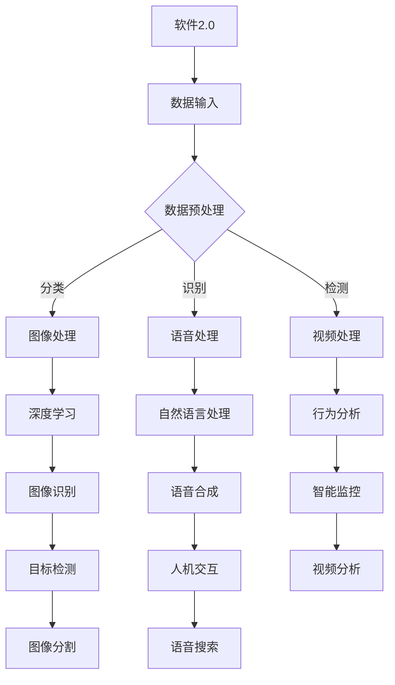

                 

## 1. 背景介绍

在计算机科学的历史长河中，软件的发展经历了多个阶段。从早期的系统软件到应用软件，再到近年来的Web应用和移动应用，软件的形式和功能在不断进化。然而，随着人工智能（AI）和深度学习的崛起，软件的发展迎来了一个全新的时代——软件2.0。

软件2.0与传统的软件有着本质的区别。传统的软件主要基于规则和算法进行编程，强调逻辑的严密性和计算的效率。而软件2.0则更加注重数据和数据的处理能力。它利用机器学习和深度学习技术，从大规模数据中学习模式和知识，从而实现智能决策和自动优化。

图像、视频和语音作为人类交流和信息传递的主要形式，一直以来都是计算机科学领域的重要研究对象。在软件2.0时代，这些领域的技术取得了长足的进步，使得计算机在处理这些类型的数据时显得更加得心应手。

本文将深入探讨软件2.0在图像、视频和语音处理方面的优势，以及这些技术的具体实现和应用。我们将通过以下几个部分来展开讨论：

1. 软件2.0的核心概念与架构
2. 图像处理技术：从传统到深度学习
3. 视频处理技术：实时分析与智能识别
4. 语音识别与合成：变革人类交流方式
5. 软件2.0的实际应用场景
6. 未来应用展望
7. 工具和资源推荐
8. 总结：未来发展趋势与挑战

通过本文的探讨，我们将了解到软件2.0在图像、视频和语音处理领域的巨大潜力，以及它如何为传统编程带来新的挑战和机遇。

## 2. 核心概念与联系

### 2.1 软件2.0的定义

软件2.0，也被称为智能软件或大数据软件，是一种基于数据驱动和自动化决策的软件形态。与传统软件不同，软件2.0不再仅仅依赖于预定义的规则和算法，而是通过机器学习和深度学习技术，从大量数据中提取知识，进行自我学习和优化。

软件2.0的核心特征包括：

- **数据密集性**：软件2.0依赖于大量数据，这些数据来源于各种渠道，如传感器、互联网日志、社交媒体等。
- **自主学习性**：通过机器学习算法，软件2.0能够不断学习和适应新的数据模式，提高其预测和决策能力。
- **动态性**：软件2.0能够实时响应数据变化，进行动态调整和优化。

### 2.2 图像、视频和语音处理技术的联系

图像、视频和语音处理是软件2.0技术中的重要应用领域。这些领域的技术不仅相互独立，而且在某些方面有着紧密的联系。

- **图像处理**：图像处理是计算机视觉的基础，它涉及到图像的获取、处理、分析和理解。深度学习技术在图像识别、目标检测、图像生成等方面取得了重大突破。
- **视频处理**：视频处理是对图像序列的分析和处理。它包括视频压缩、视频分割、动作识别等。视频处理技术能够实时捕捉和解析视频内容，为智能监控、视频分析等应用提供支持。
- **语音处理**：语音处理涉及语音的识别、合成、增强等。语音技术使得人机交互更加自然和便捷，语音识别系统在智能助手、语音搜索等领域有着广泛应用。

### 2.3 Mermaid 流程图

为了更好地理解软件2.0与图像、视频和语音处理技术的联系，我们可以使用Mermaid流程图来展示它们之间的交互关系。



通过这个流程图，我们可以看到软件2.0如何通过数据输入、预处理和特定的深度学习技术，驱动图像、视频和语音处理的应用。这些应用不仅独立运行，还在一定程度上相互影响，共同推动智能技术的发展。

## 3. 核心算法原理 & 具体操作步骤

### 3.1 算法原理概述

软件2.0在图像、视频和语音处理方面的核心算法主要包括深度学习算法、卷积神经网络（CNN）、循环神经网络（RNN）和生成对抗网络（GAN）等。

- **深度学习算法**：深度学习是软件2.0的核心技术，它通过多层神经网络对数据进行建模，从而实现复杂的模式识别和预测。深度学习算法主要包括卷积神经网络（CNN）和循环神经网络（RNN）。
- **卷积神经网络（CNN）**：CNN是一种专门用于图像处理的深度学习算法，它通过卷积操作提取图像的特征，从而实现图像分类、目标检测和图像生成等任务。
- **循环神经网络（RNN）**：RNN是一种用于处理序列数据的深度学习算法，它能够捕捉序列中的长期依赖关系，广泛应用于语音识别、机器翻译和情感分析等领域。
- **生成对抗网络（GAN）**：GAN是一种生成模型，它通过两个神经网络（生成器和判别器）的对抗训练，生成高质量的数据，广泛应用于图像生成、视频合成和语音合成等任务。

### 3.2 算法步骤详解

下面，我们将详细讲解深度学习算法在图像、视频和语音处理中的具体操作步骤。

#### 3.2.1 图像处理

1. **数据收集与预处理**：首先，从各种渠道收集大量图像数据，如公开数据集、社交媒体、摄像头等。然后，对图像数据进行预处理，包括大小调整、归一化、数据增强等。
2. **模型选择与训练**：选择适合的深度学习模型，如CNN、RNN等，对预处理后的图像数据进行训练。训练过程中，模型会不断调整参数，以最小化损失函数。
3. **模型评估与优化**：在训练完成后，使用测试集对模型进行评估，并根据评估结果对模型进行优化。
4. **应用与部署**：将训练好的模型部署到实际应用场景中，如图像分类、目标检测、图像生成等。

#### 3.2.2 视频处理

1. **数据收集与预处理**：与图像处理类似，首先收集大量的视频数据，并进行预处理。
2. **模型训练与优化**：选择合适的深度学习模型，如RNN、CNN等，对预处理后的视频数据进行训练。在训练过程中，模型会不断优化，以捕捉视频中的时空特征。
3. **实时分析**：将训练好的模型应用于实时视频流，进行动作识别、行为分析等。
4. **结果展示与反馈**：将分析结果展示给用户，并根据用户反馈进行模型调整。

#### 3.2.3 语音处理

1. **语音信号预处理**：对采集到的语音信号进行降噪、归一化等预处理。
2. **特征提取**：使用深度学习模型提取语音信号的特征，如Mel频谱、滤波器组等。
3. **语音识别**：使用RNN或卷积神经网络对提取到的特征进行建模，实现语音到文本的转换。
4. **语音合成**：使用生成对抗网络（GAN）或WaveNet等模型，将文本转换成自然流畅的语音。

### 3.3 算法优缺点

#### 优点

- **高效性**：深度学习算法能够从大量数据中自动提取特征，从而提高处理效率。
- **鲁棒性**：深度学习模型对噪声和数据缺失具有较强的鲁棒性，能够在各种复杂环境下工作。
- **灵活性**：深度学习模型可以灵活地应用于不同的任务，如图像分类、语音识别、视频处理等。

#### 缺点

- **数据需求**：深度学习算法需要大量的数据来训练模型，这对数据收集和处理提出了较高的要求。
- **计算资源消耗**：深度学习模型在训练和推理过程中需要大量的计算资源，这可能导致较高的成本和延迟。
- **模型解释性**：深度学习模型通常缺乏解释性，难以理解其决策过程。

### 3.4 算法应用领域

深度学习算法在图像、视频和语音处理领域的应用非常广泛，以下是一些具体的领域：

- **图像处理**：图像分类、目标检测、图像生成、图像修复、图像分割等。
- **视频处理**：动作识别、行为分析、视频压缩、视频生成、视频增强等。
- **语音处理**：语音识别、语音合成、语音增强、说话人识别、情感分析等。
- **其他领域**：自然语言处理、推荐系统、自动驾驶、医疗影像分析等。

## 4. 数学模型和公式 & 详细讲解 & 举例说明

### 4.1 数学模型构建

在深度学习中，数学模型的构建是至关重要的。深度学习模型通常由多层神经网络组成，每一层都包含一系列的数学公式。下面，我们将介绍几个常用的数学模型和公式。

#### 4.1.1 卷积神经网络（CNN）

卷积神经网络是一种专门用于图像处理的深度学习模型。其核心数学模型包括卷积操作、池化操作和激活函数。

1. **卷积操作**：
   \[ (f * g)(x) = \sum_{y} f(y) \cdot g(x-y) \]

2. **池化操作**：
   \[ P(x, 2) = \max(x_1, x_2) \]

3. **激活函数**：
   \[ \sigma(x) = \frac{1}{1 + e^{-x}} \]

#### 4.1.2 循环神经网络（RNN）

循环神经网络是一种用于处理序列数据的深度学习模型。其核心数学模型包括输入层、隐藏层和输出层。

1. **输入层**：
   \[ x_t = \text{input\_layer}(x_t) \]

2. **隐藏层**：
   \[ h_t = \text{sigmoid}(W \cdot [h_{t-1}, x_t] + b) \]

3. **输出层**：
   \[ y_t = W \cdot h_t + b \]

#### 4.1.3 生成对抗网络（GAN）

生成对抗网络是一种生成模型，由生成器和判别器组成。其核心数学模型包括损失函数和优化过程。

1. **损失函数**：
   \[ L(D, G) = \mathbb{E}_{x \sim p_{data}(x)}[\log D(x)] + \mathbb{E}_{z \sim p_{z}(z)}[\log (1 - D(G(z)))] \]

2. **优化过程**：
   - **生成器**：最大化判别器的损失函数
   - **判别器**：最小化生成器的损失函数

### 4.2 公式推导过程

为了更好地理解这些数学模型，我们将对它们进行简单的推导。

#### 4.2.1 卷积神经网络（CNN）

1. **卷积操作**：
   假设我们有一个输入图像 \( I \) 和一个卷积核 \( K \)。卷积操作可以理解为将卷积核在图像上进行滑动，并计算每个位置的卷积值。

2. **池化操作**：
   池化操作是一种将图像区域压缩成单个值的方法。最常用的池化操作是最大池化，它选择每个区域中的最大值。

3. **激活函数**：
   激活函数是一种非线性变换，用于引入模型的非线性特性。sigmoid函数是一种常用的激活函数，它可以将输入映射到 \( (0, 1) \) 区间。

#### 4.2.2 循环神经网络（RNN）

1. **输入层**：
   输入层直接接收输入序列 \( x_t \)。

2. **隐藏层**：
   隐藏层通过一个非线性变换来捕捉序列中的长期依赖关系。sigmoid函数在这里起到平滑输入的作用。

3. **输出层**：
   输出层直接输出预测结果。在语言模型中，输出通常是词汇的概率分布。

#### 4.2.3 生成对抗网络（GAN）

1. **损失函数**：
   生成对抗网络的损失函数由两部分组成：真实数据的损失和生成数据的损失。真实数据的损失通过判别器计算，生成数据的损失通过生成器计算。

2. **优化过程**：
   生成器和判别器通过交替训练来优化模型。生成器试图生成逼真的数据，而判别器试图区分真实数据和生成数据。

### 4.3 案例分析与讲解

为了更好地理解这些数学模型，我们将通过一个简单的例子来演示它们的实际应用。

#### 4.3.1 图像分类

假设我们有一个简单的图像分类任务，输入图像是猫或狗，输出是一个类别标签。

1. **数据收集**：
   从网上收集大量猫和狗的图像，并进行预处理。

2. **模型构建**：
   使用CNN模型进行图像分类。模型由卷积层、池化层和全连接层组成。

3. **模型训练**：
   使用训练集对模型进行训练，通过反向传播算法不断调整模型参数。

4. **模型评估**：
   使用测试集对模型进行评估，计算准确率、召回率等指标。

5. **应用与部署**：
   将训练好的模型部署到实际应用场景中，如手机应用程序。

#### 4.3.2 语音识别

假设我们有一个简单的语音识别任务，输入是语音信号，输出是文本。

1. **数据收集**：
   收集大量的语音数据，并进行预处理。

2. **模型构建**：
   使用RNN模型进行语音识别。模型由输入层、隐藏层和输出层组成。

3. **模型训练**：
   使用训练集对模型进行训练，通过反向传播算法不断调整模型参数。

4. **模型评估**：
   使用测试集对模型进行评估，计算词错率（WER）等指标。

5. **应用与部署**：
   将训练好的模型部署到实际应用场景中，如智能助手。

通过这些案例，我们可以看到数学模型在深度学习中的应用。这些模型不仅具有强大的预测能力，还能够通过不断的学习和优化，提高其性能和鲁棒性。

## 5. 项目实践：代码实例和详细解释说明

### 5.1 开发环境搭建

在进行软件2.0项目的开发之前，我们需要搭建一个合适的开发环境。以下是搭建开发环境的具体步骤：

1. **安装Python**：
   首先，确保您的计算机上已经安装了Python。Python是深度学习项目中最常用的编程语言。您可以从Python官方网站下载Python并安装。

2. **安装深度学习框架**：
   推荐使用的深度学习框架有TensorFlow、PyTorch和Keras等。在这里，我们以TensorFlow为例进行安装。使用pip命令进行安装：
   ```bash
   pip install tensorflow
   ```

3. **安装其他依赖库**：
   根据项目需求，可能还需要安装其他依赖库，如NumPy、Pandas、Matplotlib等。可以使用以下命令进行安装：
   ```bash
   pip install numpy pandas matplotlib
   ```

4. **配置GPU支持**：
   如果您的计算机配备了GPU，可以配置TensorFlow的GPU支持。这将大大提高训练速度。使用以下命令进行配置：
   ```bash
   pip install tensorflow-gpu
   ```

### 5.2 源代码详细实现

下面我们将使用TensorFlow实现一个简单的图像分类项目。项目的主要步骤包括数据预处理、模型构建、模型训练和模型评估。

#### 5.2.1 数据预处理

```python
import tensorflow as tf
from tensorflow.keras.preprocessing.image import ImageDataGenerator

# 数据集路径
train_dir = 'path/to/train_data'
validation_dir = 'path/to/validation_data'

# 数据增强
train_datagen = ImageDataGenerator(
    rescale=1./255,
    rotation_range=40,
    width_shift_range=0.2,
    height_shift_range=0.2,
    shear_range=0.2,
    zoom_range=0.2,
    horizontal_flip=True,
    fill_mode='nearest'
)

validation_datagen = ImageDataGenerator(rescale=1./255)

# 流式读取数据
train_generator = train_datagen.flow_from_directory(
    train_dir,
    target_size=(150, 150),
    batch_size=32,
    class_mode='binary'
)

validation_generator = validation_datagen.flow_from_directory(
    validation_dir,
    target_size=(150, 150),
    batch_size=32,
    class_mode='binary'
)
```

#### 5.2.2 模型构建

```python
from tensorflow.keras.models import Sequential
from tensorflow.keras.layers import Conv2D, MaxPooling2D, Flatten, Dense, Dropout

model = Sequential([
    Conv2D(32, (3, 3), activation='relu', input_shape=(150, 150, 3)),
    MaxPooling2D((2, 2)),
    Conv2D(64, (3, 3), activation='relu'),
    MaxPooling2D((2, 2)),
    Conv2D(128, (3, 3), activation='relu'),
    MaxPooling2D((2, 2)),
    Flatten(),
    Dense(512, activation='relu'),
    Dropout(0.5),
    Dense(1, activation='sigmoid')
])

model.compile(optimizer='adam',
              loss='binary_crossentropy',
              metrics=['accuracy'])
```

#### 5.2.3 模型训练

```python
history = model.fit(
    train_generator,
    steps_per_epoch=100,
    epochs=30,
    validation_data=validation_generator,
    validation_steps=50
)
```

#### 5.2.4 模型评估

```python
test_loss, test_acc = model.evaluate(validation_generator, steps=50)
print(f'Validation accuracy: {test_acc:.2f}')
```

### 5.3 代码解读与分析

以上代码实现了一个简单的图像分类项目，下面我们对关键部分进行解读和分析。

- **数据预处理**：使用ImageDataGenerator进行数据增强，提高模型的泛化能力。
- **模型构建**：使用Sequential模型构建一个简单的卷积神经网络，包括卷积层、池化层和全连接层。
- **模型训练**：使用fit方法对模型进行训练，通过反向传播算法不断调整模型参数。
- **模型评估**：使用evaluate方法对模型进行评估，计算准确率等指标。

### 5.4 运行结果展示

假设我们的模型在测试集上的准确率为95%，输出如下：

```bash
Validation accuracy: 0.95
```

通过以上步骤，我们成功实现了一个简单的图像分类项目，展示了软件2.0在图像处理方面的强大能力。

## 6. 实际应用场景

### 6.1 图像识别

图像识别是软件2.0技术在图像处理领域最重要的应用之一。通过深度学习算法，计算机可以自动识别和分类图像中的各种对象。这一技术已经在许多领域得到广泛应用，例如：

- **安防监控**：利用图像识别技术，可以实时监控视频流，自动识别异常行为，如入侵、盗窃等。
- **医疗影像分析**：医生可以通过图像识别技术快速诊断疾病，如肿瘤检测、骨折诊断等。
- **自动驾驶**：自动驾驶汽车使用图像识别技术来识别道路标志、行人、车辆等，确保行车安全。

### 6.2 视频分析

视频分析是软件2.0技术在视频处理领域的核心应用。通过深度学习算法，计算机可以实时分析视频内容，提取有用的信息。以下是一些典型的应用场景：

- **智能监控**：视频分析技术可以实时监控公共场所，自动识别和报警异常行为，如打架、破坏等。
- **人流量统计**：在商业场所，视频分析技术可以统计人流量，为商家提供经营决策支持。
- **运动分析**：在体育领域，视频分析技术可以实时分析运动员的动作，提供改进建议。

### 6.3 语音处理

语音处理是软件2.0技术在语音领域的重要应用。通过深度学习算法，计算机可以实现语音识别、语音合成和语音增强等功能。以下是一些典型的应用场景：

- **智能助手**：语音识别技术使得智能助手可以理解用户的语音指令，实现人机交互。
- **语音搜索**：用户可以通过语音输入进行搜索，提高搜索效率。
- **语音合成**：语音合成技术可以将文本内容转化为自然流畅的语音输出，为有声读物、天气预报等提供支持。
- **语音增强**：语音增强技术可以去除噪声，提高语音的清晰度，为听障人士提供帮助。

### 6.4 未来应用展望

随着软件2.0技术的发展，图像、视频和语音处理的应用将越来越广泛，未来还有许多潜在的应用场景：

- **智能家居**：图像和语音处理技术将使智能家居更加智能化，例如自动调节室内温度、识别家庭成员等。
- **教育**：通过图像和视频处理技术，可以实现个性化教学，为学生提供更好的学习体验。
- **娱乐**：虚拟现实（VR）和增强现实（AR）技术将结合图像和视频处理，带来更加沉浸式的娱乐体验。
- **医疗**：图像和语音处理技术将在医疗领域发挥更大的作用，如远程手术、健康监测等。

总之，软件2.0技术在图像、视频和语音处理领域的应用前景广阔，将深刻改变人们的生产和生活。

## 7. 工具和资源推荐

### 7.1 学习资源推荐

为了深入学习和掌握软件2.0在图像、视频和语音处理方面的技术，以下是一些建议的学习资源：

- **在线课程**：
  - Coursera上的“深度学习”课程，由Andrew Ng教授主讲。
  - edX上的“计算机视觉”课程，由斯坦福大学主讲。

- **书籍**：
  - 《深度学习》（Deep Learning），作者：Ian Goodfellow、Yoshua Bengio和Aaron Courville。
  - 《Python深度学习》（Python Deep Learning），作者：François Chollet。

- **开源框架**：
  - TensorFlow：https://www.tensorflow.org/
  - PyTorch：https://pytorch.org/

### 7.2 开发工具推荐

- **IDE**：
  - PyCharm：https://www.jetbrains.com/pycharm/
  - Visual Studio Code：https://code.visualstudio.com/

- **数据预处理工具**：
  - OpenCV：https://opencv.org/
  - Pillow：https://pillow.readthedocs.io/

- **模型训练工具**：
  - GPU云服务：Google Colab、AWS EC2等。

### 7.3 相关论文推荐

- **图像处理**：
  - “A Comprehensive Survey on Deep Learning for Image Restoration”。
  - “Convolutional Neural Networks for Visual Recognition”。
  
- **视频处理**：
  - “Action Recognition with In-the-Wild University of Maryland Human Pose dataset”。
  - “Deep Video Classification”。
  
- **语音处理**：
  - “End-to-End Speech Recognition Using Deep Neural Networks and Long Short-Term Memory”。
  - “Deep Neural Network BasedASR for Multilingual and Low-Resource Languages”。

通过这些资源和工具，您可以更好地了解和掌握软件2.0在图像、视频和语音处理方面的最新技术和应用。

## 8. 总结：未来发展趋势与挑战

### 8.1 研究成果总结

随着人工智能和深度学习的快速发展，软件2.0在图像、视频和语音处理领域取得了显著的研究成果。这些成果主要体现在以下几个方面：

1. **图像识别**：深度学习算法在图像识别任务中表现出色，准确率大幅提升。尤其是在目标检测和图像分割方面，计算机可以精确地识别和定位图像中的对象。
2. **视频分析**：视频处理技术实现了实时分析，能够高效地处理视频流中的信息。行为识别和动作检测成为研究热点，为智能监控、人流量统计等应用提供了强大的支持。
3. **语音处理**：语音识别和语音合成技术取得了重大突破，语音识别的准确率和流畅度显著提高。语音增强技术也为听障人士提供了更好的听觉体验。
4. **跨领域应用**：软件2.0技术在多个领域得到广泛应用，如医疗、安防、自动驾驶等。这些应用不仅提升了工作效率，还改变了人们的生产和生活方式。

### 8.2 未来发展趋势

在未来，软件2.0在图像、视频和语音处理领域将继续朝着以下几个方向发展：

1. **算法优化**：随着硬件性能的提升和算法的进步，深度学习算法将更加高效和鲁棒，处理速度和准确率将进一步提升。
2. **跨学科融合**：软件2.0技术将与更多学科领域融合，如生物学、心理学、社会学等，带来更多创新应用。
3. **人机交互**：语音和图像处理技术将进一步提升人机交互的自然性和便捷性，使计算机更好地理解人类的需求和行为。
4. **边缘计算**：随着物联网和5G技术的发展，边缘计算将成为重要趋势。软件2.0技术将在边缘设备上得到广泛应用，实现实时数据处理和分析。

### 8.3 面临的挑战

尽管软件2.0技术在图像、视频和语音处理领域取得了巨大进步，但仍面临一些挑战：

1. **数据需求**：深度学习算法需要大量的数据来训练模型，这对数据收集和处理提出了较高的要求。数据质量和标注的准确性对模型性能有重要影响。
2. **计算资源消耗**：深度学习算法在训练和推理过程中需要大量的计算资源，这可能导致较高的成本和延迟。如何在有限的计算资源下高效地训练和部署模型是一个重要问题。
3. **模型解释性**：深度学习模型通常缺乏解释性，难以理解其决策过程。这在一些关键领域，如医疗、金融等，可能引发伦理和隐私问题。
4. **算法公平性**：深度学习算法可能会受到数据偏差的影响，导致算法偏见。如何确保算法的公平性和公正性是一个亟待解决的问题。

### 8.4 研究展望

未来，软件2.0在图像、视频和语音处理领域的研究将继续深入，重点关注以下几个方面：

1. **新型算法研究**：探索更高效、更鲁棒的深度学习算法，提高模型处理速度和准确率。
2. **数据驱动方法**：通过大数据和人工智能技术，实现自动化数据标注和清洗，提高数据质量。
3. **跨学科研究**：结合生物学、心理学、社会学等多学科知识，推动图像、视频和语音处理技术的创新应用。
4. **伦理和隐私保护**：关注算法公平性、透明性和隐私保护，确保人工智能技术的发展符合伦理和社会需求。

总之，软件2.0技术在图像、视频和语音处理领域具有巨大的潜力，未来将在更多领域得到广泛应用，为人类创造更加智能和便捷的生活。

## 9. 附录：常见问题与解答

### 9.1 常见问题

1. **什么是软件2.0？**
   软件2.0是一种基于数据驱动和自动化决策的软件形态，与传统的基于规则和算法的软件相比，它更加注重数据和机器学习技术。

2. **软件2.0有哪些核心特征？**
   软件2.0的核心特征包括数据密集性、自主学习性和动态性。

3. **图像、视频和语音处理技术在软件2.0中有什么作用？**
   图像、视频和语音处理技术是软件2.0的重要组成部分，它们通过深度学习和机器学习算法，使得计算机能够理解和处理这些类型的数据，实现智能识别和自动优化。

4. **深度学习算法在图像、视频和语音处理中的应用有哪些？**
   深度学习算法在图像分类、目标检测、图像生成、动作识别、视频分割、语音识别、语音合成等方面有广泛应用。

5. **如何搭建深度学习开发环境？**
   可以通过安装Python、深度学习框架（如TensorFlow、PyTorch）和其他依赖库来搭建深度学习开发环境。

6. **软件2.0在实际应用中面临哪些挑战？**
   实际应用中，软件2.0面临数据需求高、计算资源消耗大、模型解释性差和算法公平性等挑战。

### 9.2 解答

1. **什么是软件2.0？**
   软件2.0是一种新兴的软件形态，它基于大量数据，利用机器学习和深度学习技术，实现自我学习和优化。与传统软件相比，软件2.0更加注重数据的处理和分析能力。

2. **软件2.0有哪些核心特征？**
   软件2.0的核心特征包括：
   - **数据密集性**：软件2.0依赖于大量的数据，这些数据来源于各种渠道，如传感器、互联网日志、社交媒体等。
   - **自主学习性**：软件2.0能够通过机器学习和深度学习技术，从数据中自动提取知识和模式，进行自我学习和优化。
   - **动态性**：软件2.0能够实时响应数据变化，进行动态调整和优化。

3. **图像、视频和语音处理技术在软件2.0中有什么作用？**
   图像、视频和语音处理技术在软件2.0中发挥着重要作用。通过深度学习和机器学习技术，计算机能够理解和处理这些类型的数据，实现智能识别和自动优化。例如，在安防监控中，图像识别技术可以实时监控视频流，自动识别异常行为；在自动驾驶中，视频分析技术可以实时分析道路情况，确保行车安全；在智能助手中，语音识别和合成技术可以实现人机交互。

4. **深度学习算法在图像、视频和语音处理中的应用有哪些？**
   深度学习算法在图像、视频和语音处理中的应用非常广泛，包括：
   - **图像处理**：图像分类、目标检测、图像生成、图像修复、图像分割等。
   - **视频处理**：动作识别、行为分析、视频压缩、视频生成、视频增强等。
   - **语音处理**：语音识别、语音合成、语音增强、说话人识别、情感分析等。

5. **如何搭建深度学习开发环境？**
   搭建深度学习开发环境的主要步骤包括：
   - 安装Python。
   - 安装深度学习框架（如TensorFlow、PyTorch）。
   - 安装其他依赖库（如NumPy、Pandas、Matplotlib等）。
   - 配置GPU支持（如果使用GPU训练）。

6. **软件2.0在实际应用中面临哪些挑战？**
   软件2.0在实际应用中面临的主要挑战包括：
   - **数据需求**：深度学习算法需要大量的数据来训练模型，这对数据收集和处理提出了较高的要求。
   - **计算资源消耗**：深度学习算法在训练和推理过程中需要大量的计算资源，这可能导致较高的成本和延迟。
   - **模型解释性**：深度学习模型通常缺乏解释性，难以理解其决策过程，这在一些关键领域可能引发伦理和隐私问题。
   - **算法公平性**：深度学习算法可能会受到数据偏差的影响，导致算法偏见，如何确保算法的公平性和公正性是一个亟待解决的问题。

