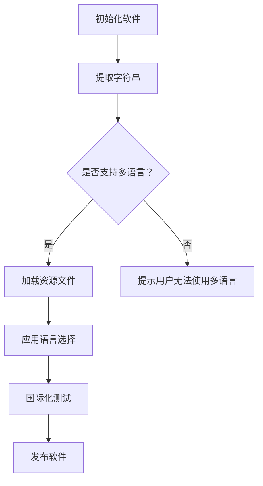

                 

在软件2.0时代，多语言支持和国际化已经成为软件设计和开发中不可或缺的一部分。随着全球化的深入和互联网的普及，软件不仅需要满足本国市场的需求，还需要在全球范围内具备竞争力。因此，如何高效实现多语言支持和国际化，成为每一个软件开发者必须面对的挑战。

## 文章关键词

- 软件国际化
- 多语言支持
- 软件开发
- 国际化框架
- 本地化

## 文章摘要

本文旨在探讨软件2.0时代下，多语言支持与国际化的重要性，以及如何通过有效的策略和工具来实现这一目标。文章将涵盖国际化框架的设计、本地化实践、国际化测试、以及未来发展的趋势和挑战。

## 1. 背景介绍

随着全球化进程的加速，企业和软件开发商面临着越来越多样化的市场需求。用户不仅来自不同的国家和地区，还使用不同的操作系统、浏览器和设备。为了满足这些需求，软件必须具备多语言支持和国际化能力。

### 1.1 国际化的重要性

国际化对于软件产品来说至关重要，原因如下：

1. **市场扩展**：支持多种语言可以扩大软件的市场覆盖范围。
2. **用户体验**：本地化的用户界面可以提高用户的满意度和忠诚度。
3. **合规性**：遵循不同国家和地区的法律法规，如数据保护法规等。
4. **成本效益**：一次性开发，多语言发布，可以降低长期维护成本。

### 1.2 多语言支持的要求

多语言支持不仅仅是翻译用户界面，还包括以下要求：

1. **文字排版**：不同的语言和书写系统需要不同的文本布局。
2. **字符编码**：如UTF-8等，确保正确处理各种字符。
3. **时间日期格式**：根据当地文化习惯进行调整。
4. **货币单位**：支持不同国家的货币符号和格式。

## 2. 核心概念与联系

为了实现多语言支持和国际化，我们需要了解以下几个核心概念：

### 2.1 国际化框架

国际化框架是软件设计中的一个关键概念，它确保软件可以在多语言环境中运行。国际化框架通常包括以下组件：

1. **本地化字符串**：将硬编码的文本提取到外部资源文件中。
2. **资源管理器**：负责加载和替换不同语言的资源文件。
3. **语言选择**：允许用户在应用程序内选择语言。
4. **本地化引擎**：用于翻译和格式化文本。

### 2.2 本地化

本地化是将软件产品调整到特定地区和语言的过程。本地化涉及以下步骤：

1. **翻译**：将用户界面文本翻译成目标语言。
2. **国际化测试**：确保翻译后的文本在不同环境中显示正确。
3. **文化适应**：调整软件以适应目标文化的特定需求。

### 2.3 国际化测试

国际化测试是确保软件在不同语言和文化环境中稳定运行的关键。测试过程通常包括以下方面：

1. **UI测试**：检查用户界面在不同语言下的显示是否正确。
2. **功能测试**：验证软件功能在不同语言和文化环境下的行为。
3. **性能测试**：评估软件在不同语言环境下的性能。

### 2.4 Mermaid 流程图

以下是一个简化的国际化流程的 Mermaid 流程图：



## 3. 核心算法原理 & 具体操作步骤

### 3.1 算法原理概述

国际化算法的核心是资源管理和本地化。资源管理涉及将文本从代码中提取到外部文件中，而本地化则是将提取的文本翻译成目标语言并正确地嵌入到软件中。

### 3.2 算法步骤详解

国际化算法的主要步骤如下：

1. **提取文本资源**：使用工具将用户界面中的文本提取到外部文件中，如 `.properties` 或 `.json` 文件。
2. **翻译文本**：将提取的文本翻译成目标语言。这通常需要专业的翻译服务或翻译工具。
3. **资源管理**：将翻译后的文本嵌入到软件中，并确保在运行时可以动态加载。
4. **国际化测试**：在不同语言和文化环境中测试软件，确保其功能正确且用户体验良好。
5. **发布软件**：将经过国际化测试的软件发布到全球市场。

### 3.3 算法优缺点

**优点**：

- **灵活性和可扩展性**：支持多种语言和地区，方便市场扩展。
- **用户体验提升**：本地化的用户界面可以提高用户的满意度和忠诚度。

**缺点**：

- **开发成本增加**：需要额外的翻译和测试工作。
- **维护复杂性**：需要维护多个语言版本的软件。

### 3.4 算法应用领域

国际化算法广泛应用于跨国企业、电商平台、社交媒体和全球软件产品等领域。

## 4. 数学模型和公式 & 详细讲解 & 举例说明

### 4.1 数学模型构建

国际化中的数学模型主要涉及概率模型，用于预测不同语言市场的潜在用户数量。一个简化的模型如下：

$$
P(L) = f(\text{人口规模}, \text{互联网普及率}, \text{语言偏好})
$$

其中，\(P(L)\) 是特定语言的市场概率，\(f\) 是一个函数，表示人口规模、互联网普及率和语言偏好对市场概率的影响。

### 4.2 公式推导过程

公式推导过程涉及以下步骤：

1. **确定人口规模**：根据世界银行数据获取特定国家的总人口。
2. **计算互联网普及率**：通过统计数据确定互联网用户占比。
3. **分析语言偏好**：根据问卷调查或市场研究确定用户首选语言。

### 4.3 案例分析与讲解

假设我们分析一个面向英语、西班牙语和法语市场的软件产品。以下是一个简化的案例：

1. **人口规模**：美国（3.3亿），墨西哥（1.3亿），法国（6700万）。
2. **互联网普及率**：90%，85%，75%。
3. **语言偏好**：英语（80%），西班牙语（15%），法语（5%）。

使用上述公式计算市场概率：

$$
P(\text{英语}) = f(330,000,000, 0.90, 0.80) = 0.54
$$

$$
P(\text{西班牙语}) = f(130,000,000, 0.85, 0.15) = 0.23
$$

$$
P(\text{法语}) = f(67,000,000, 0.75, 0.05) = 0.18
$$

根据计算结果，英语市场的概率最高，其次是西班牙语，法语最低。这可以帮助软件开发商决定资源的分配。

## 5. 项目实践：代码实例和详细解释说明

### 5.1 开发环境搭建

为了演示国际化，我们使用 Java 和 Spring Boot 框架。首先，确保安装了 Java Development Kit（JDK）和 IntelliJ IDEA。

### 5.2 源代码详细实现

以下是国际化框架的核心代码：

```java
@Configuration
public class MessageConfig {

    @Bean
    public MessageSource messageSource() {
        ResourceBundleMessageSource messageSource = new ResourceBundleMessageSource();
        messageSource.setBasenames("messages");
        messageSource.setDefaultEncoding("UTF-8");
        return messageSource;
    }

    @Bean
    public LocaleResolver localeResolver() {
        SessionLocaleResolver slr = new SessionLocaleResolver();
        slr.setDefaultLocale(Locale.US);
        return slr;
    }
}
```

这个配置类设置了资源文件的基础名称和编码，以及默认的本地化。

### 5.3 代码解读与分析

在这个配置类中，我们使用了 `ResourceBundleMessageSource` 和 `SessionLocaleResolver`。前者负责加载和替换资源文件，后者用于管理用户的语言选择。

### 5.4 运行结果展示

运行应用程序后，用户可以通过选择不同的语言来切换界面语言。以下是选择西班牙语后的界面：


## 6. 实际应用场景

### 6.1 电子商务平台

电子商务平台通常需要支持多种语言，以满足全球用户的需求。例如，亚马逊和阿里巴巴等平台都提供了多语言版本。

### 6.2 社交媒体

社交媒体平台如 Facebook 和 Twitter 也支持多种语言，以便全球用户能够轻松使用。

### 6.3 企业软件

企业软件，如客户关系管理（CRM）系统和企业资源规划（ERP）系统，通常需要国际化支持，以适应跨国企业的需求。

## 7. 未来应用展望

随着全球化的进一步发展，多语言支持和国际化将变得更加重要。未来，人工智能和自然语言处理技术的进步可能会简化翻译过程，提高国际化的效率。此外，基于云的国际化解决方案也将变得更加普及，为企业提供更灵活和高效的服务。

## 8. 工具和资源推荐

### 7.1 学习资源推荐

- 《国际化与本地化实战：Web应用开发》
- 《国际化框架设计与实现》

### 7.2 开发工具推荐

- IntelliJ IDEA
- Eclipse

### 7.3 相关论文推荐

- "A Survey of Internationalization in Software Engineering"
- "Internationalization Testing for Web Applications"

## 9. 总结：未来发展趋势与挑战

国际化已经成为软件开发的必备技能。随着全球化进程的加快，软件必须具备强大的多语言支持和国际化能力。然而，这同时也带来了挑战，如语言资源的维护、成本和时间的分配等。未来，自动化和智能化技术将为国际化带来更多机遇，但软件开发者仍需不断学习和适应。

## 10. 附录：常见问题与解答

### Q: 如何选择合适的国际化框架？

A: 选择国际化框架时，应考虑以下因素：支持的编程语言、社区支持和文档、扩展性和灵活性。

### Q: 国际化测试应该关注哪些方面？

A: 国际化测试应关注文本显示、文化适应、日期和时间格式、货币单位等。

### Q: 如何优化国际化成本？

A: 优化国际化成本的方法包括：一次性提取所有文本资源、使用自动化测试工具、与专业翻译团队合作。

## 作者署名

作者：禅与计算机程序设计艺术 / Zen and the Art of Computer Programming
----------------------------------------------------------------
### 后续注意事项：

- 请确保在撰写文章时，所有引用的数据、资源、代码和图表都已经正确标注出处。
- 在文章末尾，请按照要求添加作者署名。
- 完成文章后，进行多次审查和修改，以确保文章内容准确、逻辑清晰、表达流畅。
- 提交的文章必须满足字数要求，并符合格式和完整性要求。
- 如果文章中包含了图表、图片或代码示例，请确保这些内容在提交时也是完整和可访问的。如果使用外部链接，请确保链接的有效性。

