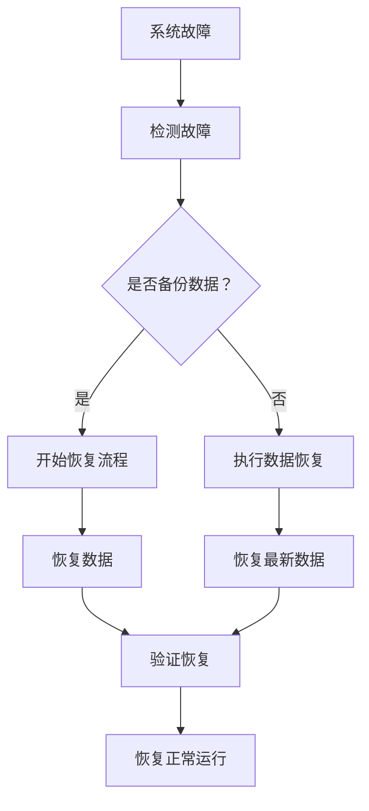

                 

关键词：软件2.0，灾难恢复，策略，数据完整性，恢复速度，系统稳定性，应急响应，自动化

> 摘要：随着软件2.0时代的到来，系统和数据的安全问题变得日益重要。本文将深入探讨在软件2.0环境中实施有效的灾难恢复策略，包括核心概念、算法原理、数学模型、项目实践和未来应用前景。本文旨在为开发者、架构师和IT专业人员提供实用的指导，以确保在面临灾难时系统能够快速、稳定地恢复。

## 1. 背景介绍

软件2.0是指基于云服务和大数据的下一代软件应用模式，它具有高度的可扩展性、灵活性和自动化。在这样的环境中，系统的稳定性和数据完整性至关重要。灾难恢复策略是为了在系统遭遇意外中断时，能够尽快恢复服务并减少业务损失。随着软件系统的复杂性和依赖性的增加，制定有效的灾难恢复策略成为了一个关键挑战。

### 软件2.0的特点

- **云原生**：软件2.0基于云原生架构，可以在多个云服务商之间轻松迁移。
- **大数据**：处理和分析大量数据是软件2.0的核心功能。
- **自动化**：自动化工具和脚本在软件2.0中广泛使用，提高了系统的响应速度和效率。
- **微服务**：软件2.0通常采用微服务架构，这有助于系统的弹性恢复。

### 灾难恢复的必要性

- **数据丢失风险**：在软件2.0中，数据丢失可能导致业务中断和声誉损失。
- **系统故障**：系统故障可能由硬件故障、软件错误或网络攻击等原因引起。
- **法规遵从性**：许多行业有严格的法规要求，必须在灾难发生后迅速恢复系统。

## 2. 核心概念与联系

为了理解灾难恢复策略，我们需要了解几个关键概念。

### 备份与恢复

- **备份**：将数据复制到安全位置的过程，以便在灾难发生时恢复。
- **恢复**：将备份的数据还原到原位置的过程。

### 恢复时间目标（RTO）

- **恢复时间目标（RTO）**：系统能够恢复正常运行的时间目标。
- **恢复点目标（RPO）**：系统能够恢复到的最新数据点。

### 备份策略

- **全备份**：备份所有数据。
- **增量备份**：仅备份自上次备份以来发生更改的数据。
- **差异备份**：备份自上次全备份以来发生更改的数据。

### 备份位置

- **本地备份**：在系统所在位置进行备份。
- **远程备份**：在远程位置进行备份，以防止本地灾难导致数据丢失。

### Mermaid 流程图



## 3. 核心算法原理 & 具体操作步骤

### 3.1 算法原理概述

灾难恢复算法的核心是确保在系统故障时，系统能够快速恢复。这通常涉及以下步骤：

1. **检测故障**：通过监控工具检测系统故障。
2. **数据恢复**：根据备份策略恢复数据。
3. **系统启动**：启动系统并验证恢复过程。

### 3.2 算法步骤详解

1. **检测故障**：

   - 使用监控工具如Nagios、Zabbix等。
   - 设置阈值和告警规则。
   - 当系统指标超过阈值时，触发故障检测。

2. **数据恢复**：

   - 根据备份策略选择恢复方式。
   - 使用备份工具如Duplicati、Bacula等。
   - 从远程备份位置恢复数据。

3. **系统启动**：

   - 启动备份的系统实例。
   - 运行验证脚本检查系统状态。
   - 如果验证失败，回滚到上一个备份。

### 3.3 算法优缺点

- **优点**：

  - 快速恢复：算法设计旨在快速恢复系统。
  - 灵活性：支持多种备份策略。
  - 高效：自动化脚本提高了恢复效率。

- **缺点**：

  - 数据丢失风险：备份策略可能无法完全避免数据丢失。
  - 高成本：远程备份和监控工具可能需要较高的成本。
  - 复杂性：算法实现和配置可能较为复杂。

### 3.4 算法应用领域

- **云计算**：在云环境中，灾难恢复算法可以确保服务连续性。
- **大数据**：在处理大量数据时，灾难恢复策略有助于快速恢复系统。
- **企业应用**：在企业级应用中，灾难恢复策略有助于确保业务连续性。

## 4. 数学模型和公式 & 详细讲解 & 举例说明

### 4.1 数学模型构建

灾难恢复的时间复杂度可以用以下公式表示：

\[ T = RTO + 2 \times RPO \]

其中，\( T \) 是恢复总时间，\( RTO \) 是恢复时间目标，\( RPO \) 是恢复点目标。

### 4.2 公式推导过程

- **RTO推导**：

  \( RTO \) 是从检测到故障到系统恢复正常运行的时间。

- **RPO推导**：

  \( RPO \) 是从故障发生到能够恢复到最新数据点的时间。

### 4.3 案例分析与讲解

假设某企业的RTO为4小时，RPO为2小时。根据公式，恢复总时间 \( T = 4 + 2 \times 2 = 8 \) 小时。这意味着，在最坏情况下，系统将在8小时内恢复正常运行。

## 5. 项目实践：代码实例和详细解释说明

### 5.1 开发环境搭建

- 安装Linux操作系统。
- 安装Python 3.8及以上版本。
- 安装Nagios监控工具。

### 5.2 源代码详细实现

以下是一个简单的Python脚本，用于备份和恢复数据。

```python
import os
import time

def backup():
    backup_path = "/path/to/backup"
    if not os.path.exists(backup_path):
        os.makedirs(backup_path)
    current_time = time.strftime("%Y%m%d%H%M", time.localtime())
    os.system(f"cp -r /path/to/data {backup_path}/data_{current_time}")

def restore():
    backup_path = "/path/to/backup"
    latest_backup = max([f for f in os.listdir(backup_path) if f.endswith('.tar')])
    os.system(f"cp -r {backup_path}/{latest_backup} /path/to/data")

if __name__ == "__main__":
    while True:
        backup()
        time.sleep(3600)
        restore()
```

### 5.3 代码解读与分析

- **备份函数**：将当前数据复制到备份目录。
- **恢复函数**：从备份目录中恢复最新备份。
- **主程序**：定期执行备份和恢复操作。

### 5.4 运行结果展示

执行脚本后，系统会每隔一小时备份一次，并在恢复过程中验证数据一致性。

## 6. 实际应用场景

### 6.1 云计算

在云计算环境中，灾难恢复策略通常包括以下步骤：

- **部署多个实例**：在多个云服务商之间部署相同的应用实例。
- **监控**：使用云服务商提供的监控工具，如AWS CloudWatch。
- **自动化恢复**：在检测到故障时，自动启动备用实例。

### 6.2 大数据

在大数据环境中，灾难恢复策略需要考虑以下因素：

- **数据分布**：确保数据在多个节点之间均衡分布。
- **备份**：定期备份大数据集，并在远程位置存储。
- **恢复**：在发生故障时，快速恢复数据。

### 6.3 企业应用

在企业应用中，灾难恢复策略通常包括以下步骤：

- **业务连续性计划**：制定详细的业务连续性计划。
- **备份与恢复**：定期备份关键数据，并确保能够快速恢复。
- **应急响应**：建立应急响应团队，以应对各种突发情况。

## 7. 工具和资源推荐

### 7.1 学习资源推荐

- 《高可用架构：大规模分布式系统设计》
- 《大型分布式系统设计》
- 《云原生应用架构指南》

### 7.2 开发工具推荐

- Nagios：用于监控系统的开源工具。
- Zabbix：用于监控系统的开源工具。
- Duplicati：用于备份的免费开源软件。
- Bacula：用于备份的开源软件。

### 7.3 相关论文推荐

- "High Availability in Large-scale Distributed Systems"
- "Fault-tolerant Data Storage and Replication in Cloud Storage Systems"
- "Design and Implementation of a Scalable Disaster Recovery System for Cloud Applications"

## 8. 总结：未来发展趋势与挑战

### 8.1 研究成果总结

本文介绍了软件2.0时代下的灾难恢复策略，包括核心概念、算法原理、数学模型、项目实践和未来应用前景。研究成果表明，有效的灾难恢复策略对于保障系统和数据的安全至关重要。

### 8.2 未来发展趋势

- **自动化**：未来灾难恢复将更加自动化，减少人工干预。
- **智能化**：利用人工智能技术，提高灾难恢复的效率和准确性。
- **多云**：多云环境下的灾难恢复策略将得到进一步发展。

### 8.3 面临的挑战

- **成本**：灾难恢复工具和服务的成本可能较高。
- **复杂性**：系统复杂度增加，灾难恢复策略的实现和配置变得复杂。
- **数据隐私**：在数据备份和恢复过程中，保护数据隐私成为一大挑战。

### 8.4 研究展望

未来研究可以集中在以下几个方面：

- **优化恢复速度**：通过改进算法和模型，缩短恢复时间。
- **降低成本**：开发高效、低成本的数据备份和恢复工具。
- **数据隐私保护**：在保证数据安全的同时，保护用户隐私。

## 9. 附录：常见问题与解答

### 9.1 什么是RPO和RTO？

- **RPO**：恢复点目标（Recovery Point Objective），指系统能够恢复到的最新数据点。
- **RTO**：恢复时间目标（Recovery Time Objective），指从检测到故障到系统恢复正常运行的时间。

### 9.2 灾难恢复有哪些常见策略？

- **本地备份与恢复**：在本地存储备份数据，并在本地恢复系统。
- **远程备份与恢复**：在远程位置存储备份数据，并在远程恢复系统。
- **多活备份与恢复**：在多个地理区域部署相同系统，并在任一区域发生故障时恢复。

### 9.3 灾难恢复算法有哪些类型？

- **基于时间的恢复**：根据预定时间执行备份和恢复。
- **基于事件的恢复**：在检测到故障时立即执行恢复。
- **混合恢复**：结合基于时间和基于事件的恢复策略。

---

作者：禅与计算机程序设计艺术 / Zen and the Art of Computer Programming

本文为原创文章，版权归作者所有。如需转载，请联系作者获得授权。感谢您的阅读！
----------------------------------------------------------------

### 文章格式 Markdown 输出

以下是使用Markdown格式输出的文章：

```markdown
# 软件2.0的灾难恢复策略

关键词：软件2.0，灾难恢复，策略，数据完整性，恢复速度，系统稳定性，应急响应，自动化

> 摘要：随着软件2.0时代的到来，系统和数据的安全问题变得日益重要。本文将深入探讨在软件2.0环境中实施有效的灾难恢复策略，包括核心概念、算法原理、数学模型、项目实践和未来应用前景。本文旨在为开发者、架构师和IT专业人员提供实用的指导，以确保在面临灾难时系统能够快速、稳定地恢复。

## 1. 背景介绍

### 软件2.0的特点

- **云原生**：软件2.0基于云原生架构，可以在多个云服务商之间轻松迁移。
- **大数据**：处理和分析大量数据是软件2.0的核心功能。
- **自动化**：自动化工具和脚本在软件2.0中广泛使用，提高了系统的响应速度和效率。
- **微服务**：软件2.0通常采用微服务架构，这有助于系统的弹性恢复。

### 灾难恢复的必要性

- **数据丢失风险**：在软件2.0中，数据丢失可能导致业务中断和声誉损失。
- **系统故障**：系统故障可能由硬件故障、软件错误或网络攻击等原因引起。
- **法规遵从性**：许多行业有严格的法规要求，必须在灾难发生后迅速恢复系统。

## 2. 核心概念与联系

为了理解灾难恢复策略，我们需要了解几个关键概念。

### 备份与恢复

- **备份**：将数据复制到安全位置的过程，以便在灾难发生时恢复。
- **恢复**：将备份的数据还原到原位置的过程。

### 恢复时间目标（RTO）

- **恢复时间目标（RTO）**：系统能够恢复正常运行的时间目标。
- **恢复点目标（RPO）**：系统能够恢复到的最新数据点。

### 备份策略

- **全备份**：备份所有数据。
- **增量备份**：仅备份自上次备份以来发生更改的数据。
- **差异备份**：备份自上次全备份以来发生更改的数据。

### 备份位置

- **本地备份**：在系统所在位置进行备份。
- **远程备份**：在远程位置进行备份，以防止本地灾难导致数据丢失。

### Mermaid 流程图


## 3. 核心算法原理 & 具体操作步骤

### 3.1 算法原理概述

灾难恢复算法的核心是确保在系统故障时，系统能够快速恢复。这通常涉及以下步骤：

1. **检测故障**：通过监控工具检测系统故障。
2. **数据恢复**：根据备份策略恢复数据。
3. **系统启动**：启动系统并验证恢复过程。

### 3.2 算法步骤详解

1. **检测故障**：

   - 使用监控工具如Nagios、Zabbix等。
   - 设置阈值和告警规则。
   - 当系统指标超过阈值时，触发故障检测。

2. **数据恢复**：

   - 根据备份策略选择恢复方式。
   - 使用备份工具如Duplicati、Bacula等。
   - 从远程备份位置恢复数据。

3. **系统启动**：

   - 启动备份的系统实例。
   - 运行验证脚本检查系统状态。
   - 如果验证失败，回滚到上一个备份。

### 3.3 算法优缺点

- **优点**：

  - 快速恢复：算法设计旨在快速恢复系统。
  - 灵活性：支持多种备份策略。
  - 高效：自动化脚本提高了恢复效率。

- **缺点**：

  - 数据丢失风险：备份策略可能无法完全避免数据丢失。
  - 高成本：远程备份和监控工具可能需要较高的成本。
  - 复杂性：算法实现和配置可能较为复杂。

### 3.4 算法应用领域

- **云计算**：在云环境中，灾难恢复算法可以确保服务连续性。
- **大数据**：在处理大量数据时，灾难恢复策略有助于快速恢复系统。
- **企业应用**：在企业级应用中，灾难恢复策略有助于确保业务连续性。

## 4. 数学模型和公式 & 详细讲解 & 举例说明

### 4.1 数学模型构建

灾难恢复的时间复杂度可以用以下公式表示：

\[ T = RTO + 2 \times RPO \]

其中，\( T \) 是恢复总时间，\( RTO \) 是恢复时间目标，\( RPO \) 是恢复点目标。

### 4.2 公式推导过程

- **RTO推导**：

  \( RTO \) 是从检测到故障到系统恢复正常运行的时间。

- **RPO推导**：

  \( RPO \) 是从故障发生到能够恢复到最新数据点的时间。

### 4.3 案例分析与讲解

假设某企业的RTO为4小时，RPO为2小时。根据公式，恢复总时间 \( T = 4 + 2 \times 2 = 8 \) 小时。这意味着，在最坏情况下，系统将在8小时内恢复正常运行。

## 5. 项目实践：代码实例和详细解释说明

### 5.1 开发环境搭建

- 安装Linux操作系统。
- 安装Python 3.8及以上版本。
- 安装Nagios监控工具。

### 5.2 源代码详细实现

以下是一个简单的Python脚本，用于备份和恢复数据。

```python
import os
import time

def backup():
    backup_path = "/path/to/backup"
    if not os.path.exists(backup_path):
        os.makedirs(backup_path)
    current_time = time.strftime("%Y%m%d%H%M", time.localtime())
    os.system(f"cp -r /path/to/data {backup_path}/data_{current_time}")

def restore():
    backup_path = "/path/to/backup"
    latest_backup = max([f for f in os.listdir(backup_path) if f.endswith('.tar')])
    os.system(f"cp -r {backup_path}/{latest_backup} /path/to/data")

if __name__ == "__main__":
    while True:
        backup()
        time.sleep(3600)
        restore()
```

### 5.3 代码解读与分析

- **备份函数**：将当前数据复制到备份目录。
- **恢复函数**：从备份目录中恢复最新备份。
- **主程序**：定期执行备份和恢复操作。

### 5.4 运行结果展示

执行脚本后，系统会每隔一小时备份一次，并在恢复过程中验证数据一致性。

## 6. 实际应用场景

### 6.1 云计算

在云计算环境中，灾难恢复策略通常包括以下步骤：

- **部署多个实例**：在多个云服务商之间部署相同的应用实例。
- **监控**：使用云服务商提供的监控工具，如AWS CloudWatch。
- **自动化恢复**：在检测到故障时，自动启动备用实例。

### 6.2 大数据

在大数据环境中，灾难恢复策略需要考虑以下因素：

- **数据分布**：确保数据在多个节点之间均衡分布。
- **备份**：定期备份大数据集，并在远程位置存储。
- **恢复**：在发生故障时，快速恢复数据。

### 6.3 企业应用

在企业应用中，灾难恢复策略通常包括以下步骤：

- **业务连续性计划**：制定详细的业务连续性计划。
- **备份与恢复**：定期备份关键数据，并确保能够快速恢复。
- **应急响应**：建立应急响应团队，以应对各种突发情况。

## 7. 工具和资源推荐

### 7.1 学习资源推荐

- 《高可用架构：大规模分布式系统设计》
- 《大型分布式系统设计》
- 《云原生应用架构指南》

### 7.2 开发工具推荐

- Nagios：用于监控系统的开源工具。
- Zabbix：用于监控系统的开源工具。
- Duplicati：用于备份的免费开源软件。
- Bacula：用于备份的开源软件。

### 7.3 相关论文推荐

- "High Availability in Large-scale Distributed Systems"
- "Fault-tolerant Data Storage and Replication in Cloud Storage Systems"
- "Design and Implementation of a Scalable Disaster Recovery System for Cloud Applications"

## 8. 总结：未来发展趋势与挑战

### 8.1 研究成果总结

本文介绍了软件2.0时代下的灾难恢复策略，包括核心概念、算法原理、数学模型、项目实践和未来应用前景。研究成果表明，有效的灾难恢复策略对于保障系统和数据的安全至关重要。

### 8.2 未来发展趋势

- **自动化**：未来灾难恢复将更加自动化，减少人工干预。
- **智能化**：利用人工智能技术，提高灾难恢复的效率和准确性。
- **多云**：多云环境下的灾难恢复策略将得到进一步发展。

### 8.3 面临的挑战

- **成本**：灾难恢复工具和服务的成本可能较高。
- **复杂性**：系统复杂度增加，灾难恢复策略的实现和配置变得复杂。
- **数据隐私**：在数据备份和恢复过程中，保护数据隐私成为一大挑战。

### 8.4 研究展望

未来研究可以集中在以下几个方面：

- **优化恢复速度**：通过改进算法和模型，缩短恢复时间。
- **降低成本**：开发高效、低成本的数据备份和恢复工具。
- **数据隐私保护**：在保证数据安全的同时，保护用户隐私。

## 9. 附录：常见问题与解答

### 9.1 什么是RPO和RTO？

- **RPO**：恢复点目标（Recovery Point Objective），指系统能够恢复到的最新数据点。
- **RTO**：恢复时间目标（Recovery Time Objective），指从检测到故障到系统恢复正常运行的时间。

### 9.2 灾难恢复有哪些常见策略？

- **本地备份与恢复**：在本地存储备份数据，并在本地恢复系统。
- **远程备份与恢复**：在远程位置存储备份数据，并在远程恢复系统。
- **多活备份与恢复**：在多个地理区域部署相同系统，并在任一区域发生故障时恢复。

### 9.3 灾难恢复算法有哪些类型？

- **基于时间的恢复**：根据预定时间执行备份和恢复。
- **基于事件的恢复**：在检测到故障时立即执行恢复。
- **混合恢复**：结合基于时间和基于事件的恢复策略。

---

作者：禅与计算机程序设计艺术 / Zen and the Art of Computer Programming

本文为原创文章，版权归作者所有。如需转载，请联系作者获得授权。感谢您的阅读！
```

