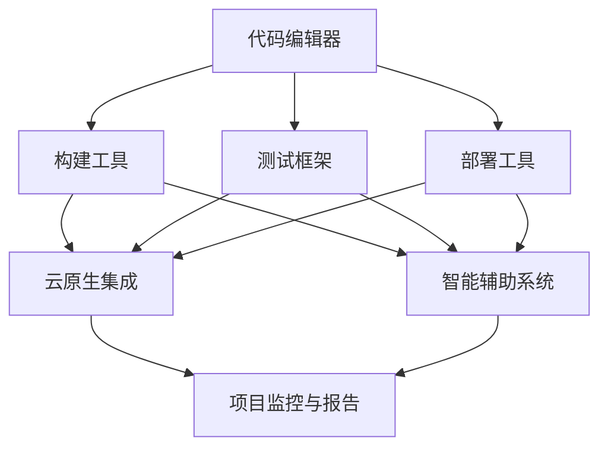

                 

关键词：软件2.0、新型IDE、编程工具、软件工程、开发效率、智能化、自动化、云计算、人机交互

摘要：随着软件2.0时代的到来，软件开发的方式和工具也在不断演变。本文将探讨软件2.0时代需要怎样的新型IDE（集成开发环境），以及这种新型IDE如何提高开发效率、改善人机交互，并最终推动软件工程的进步。

## 1. 背景介绍

软件2.0时代，以云计算、大数据、人工智能等新兴技术为核心驱动力，正在深刻改变着软件开发的模式。传统的软件开发工具已经难以满足现代软件开发的需求，特别是在应对复杂度日益增加的软件项目时。集成开发环境（IDE）作为软件开发的核心工具，其重要性不言而喻。然而，传统的IDE在功能、性能、用户体验等方面已经暴露出诸多不足，迫切需要新的突破。

### 1.1  传统IDE的不足

1. **功能单一**：传统IDE通常专注于特定的编程语言或开发环境，难以应对多样化的软件开发需求。
2. **性能瓶颈**：随着软件项目规模的增长，传统IDE在处理大量代码、模块和依赖时显得力不从心。
3. **人机交互不佳**：传统IDE的用户界面设计较为笨重，用户体验不佳，不易于快速开发和调试。
4. **缺乏智能化**：传统IDE缺乏对编程过程中的自动化支持和智能辅助，使得开发过程繁琐且容易出错。

### 1.2  软件开发新趋势

1. **敏捷开发**：强调快速迭代、快速响应变化，需要高效、灵活的开发工具。
2. **DevOps文化**：将开发和运维紧密结合，需要具备协同工作能力的开发工具。
3. **智能化和自动化**：利用人工智能和自动化技术提高开发效率和代码质量。
4. **跨平台和云原生**：支持多种平台和云环境，实现软件的全生命周期管理。

## 2. 核心概念与联系

### 2.1  新型IDE的核心概念

1. **集成性与灵活性**：新型IDE需要具备高度集成性，同时提供灵活的扩展能力，以满足多样化的开发需求。
2. **性能与稳定性**：新型IDE需要在处理大量代码和依赖时保持高性能和稳定性。
3. **智能化与自动化**：利用人工智能和自动化技术，提升开发效率和代码质量。
4. **用户体验**：优化用户界面设计，提升用户使用体验。

### 2.2  新型IDE的架构

新型IDE的架构通常包括以下几个关键组成部分：

1. **代码编辑器**：提供高效的代码编写、调试和格式化功能。
2. **构建和部署工具**：支持自动化构建、测试和部署，与云原生环境无缝集成。
3. **智能辅助系统**：利用自然语言处理、机器学习等技术，提供代码智能提示、错误检测和修复建议。
4. **协作与集成**：支持多用户协作、与版本控制系统、测试框架等集成，实现全流程的自动化。
5. **监控与报告**：提供实时的项目状态监控和性能报告，帮助开发者快速定位问题。

### 2.3  Mermaid 流程图

以下是一个描述新型IDE架构的 Mermaid 流程图：



## 3. 核心算法原理 & 具体操作步骤

### 3.1  算法原理概述

新型IDE的核心算法主要涉及以下几个方面：

1. **智能代码提示**：利用自然语言处理和机器学习技术，分析代码上下文，提供实时、准确的代码提示。
2. **错误检测与修复**：通过静态代码分析、动态调试等技术，实时检测代码中的错误，并提供修复建议。
3. **自动化构建与部署**：利用流水线（Pipeline）技术，实现自动化构建、测试和部署。
4. **代码质量评估**：基于代码质量模型，评估代码的质量，并提供改进建议。

### 3.2  算法步骤详解

1. **智能代码提示**
   - **上下文分析**：读取代码上下文，包括变量、函数、类等信息。
   - **模式匹配**：将上下文与预设的代码模式进行匹配，提供可能的代码补全选项。
   - **机器学习**：利用训练好的模型，根据上下文和历史数据，提供智能化的代码提示。

2. **错误检测与修复**
   - **静态代码分析**：对代码进行静态分析，检测潜在的语法错误和逻辑错误。
   - **动态调试**：运行代码，捕捉运行时错误，并定位错误发生的位置。
   - **错误修复建议**：根据错误类型，提供可能的修复方案。

3. **自动化构建与部署**
   - **构建流水线**：定义构建、测试和部署的步骤，实现自动化。
   - **持续集成**：将代码变更自动触发构建和测试，确保代码质量。
   - **云原生部署**：利用容器化技术，实现快速、灵活的部署。

4. **代码质量评估**
   - **质量模型**：构建代码质量模型，包括代码复杂度、代码风格、注释率等指标。
   - **评估**：对代码进行质量评估，生成质量报告。
   - **改进建议**：根据质量报告，提供代码改进建议。

### 3.3  算法优缺点

**优点**：
- **提高开发效率**：智能化的代码提示、错误检测和修复功能，显著减少开发过程中的重复工作。
- **保证代码质量**：自动化构建、测试和部署，确保代码的可维护性和可靠性。
- **提升用户体验**：优化的用户界面设计，提供直观、便捷的操作体验。

**缺点**：
- **算法复杂度**：实现智能化的算法需要大量的计算资源和时间。
- **误报和漏报**：智能化的错误检测和修复可能存在误报和漏报的情况。
- **学习成本**：新型IDE的学习成本相对较高，需要开发者熟悉新的工具和算法。

### 3.4  算法应用领域

新型IDE的核心算法可以广泛应用于多种软件开发领域，包括：

1. **Web应用开发**：提供智能化的前端和后端开发支持，提高开发效率和代码质量。
2. **移动应用开发**：支持多种移动平台，提供跨平台的开发体验。
3. **大数据和人工智能**：提供数据分析和机器学习模型的开发支持。
4. **游戏开发**：提供游戏引擎的开发工具和智能化支持。

## 4. 数学模型和公式 & 详细讲解 & 举例说明

### 4.1  数学模型构建

在新型IDE中，常用的数学模型包括：

1. **代码相似度模型**：用于检测代码抄袭和相似度分析。
2. **代码复杂度模型**：用于评估代码的可维护性和可靠性。
3. **代码质量模型**：用于评估代码的整体质量。

### 4.2  公式推导过程

以代码复杂度模型为例，其公式推导过程如下：

**代码复杂度模型**：

\[ \text{CC} = \frac{1}{n} \sum_{i=1}^{n} \text{CF}_i \]

其中，\( \text{CC} \) 表示代码复杂度，\( \text{CF}_i \) 表示第 \( i \) 个代码块的复杂度。

**代码块复杂度**：

\[ \text{CF}_i = \log_2(\text{IF}_i + 1) + \text{EL}_i \]

其中，\( \text{IF}_i \) 表示第 \( i \) 个代码块的引出条件数，\( \text{EL}_i \) 表示第 \( i \) 个代码块的异常结束条件数。

### 4.3  案例分析与讲解

假设有一个简单的代码段：

```java
if (a > 0) {
    System.out.println("a大于0");
} else if (a < 0) {
    System.out.println("a小于0");
} else {
    System.out.println("a等于0");
}
```

**代码复杂度计算**：

- \( \text{IF}_1 = 2 \)（有两个引出条件：\( a > 0 \) 和 \( a < 0 \)）
- \( \text{EL}_1 = 1 \)（有一个异常结束条件：\( a = 0 \)）

**代码块复杂度**：

\[ \text{CF}_1 = \log_2(2 + 1) + 1 = 2 \]

**总代码复杂度**：

\[ \text{CC} = \frac{1}{1} \sum_{i=1}^{1} 2 = 2 \]

通过计算，我们发现这个简单的代码段的复杂度为2，表明其可维护性和可靠性相对较低。针对这种情况，可以通过重构代码、增加注释等方法来降低代码复杂度。

## 5. 项目实践：代码实例和详细解释说明

### 5.1  开发环境搭建

1. **安装JDK**：确保安装了Java Development Kit（JDK），版本要求为8或更高。
2. **安装IDE**：选择并安装一款支持Java开发的新型IDE，如IntelliJ IDEA、Visual Studio Code等。
3. **配置环境变量**：设置JAVA_HOME环境变量，并将其添加到PATH环境变量中。

### 5.2  源代码详细实现

以下是一个简单的Java代码示例，用于演示新型IDE的智能代码提示和错误检测功能。

```java
public class HelloWorld {
    public static void main(String[] args) {
        int a = 10;
        if (a > 0) {
            System.out.println("a大于0");
        } else if (a < 0) {
            System.out.println("a小于0");
        } else {
            System.out.println("a等于0");
        }
    }
}
```

### 5.3  代码解读与分析

在这个示例中，新型IDE提供了以下功能：

1. **智能代码提示**：在编写代码时，IDE会实时分析上下文，并提供可能的代码补全选项。例如，当输入 `System.out.` 时，IDE会自动提示可用的方法，如 `println()`、`print()` 等。
2. **错误检测与修复**：IDE会分析代码中的潜在错误，并提供修复建议。例如，在这个示例中，如果输入有误，IDE会自动检测并提示错误，如缺少分号、语法错误等。
3. **代码格式化**：IDE可以自动格式化代码，使其更易读、更规范。

### 5.4  运行结果展示

运行上述代码，输出结果为：

```
a大于0
```

通过上述实例，我们可以看到新型IDE在代码编写、调试和运行方面的优势，显著提高了开发效率和代码质量。

## 6. 实际应用场景

### 6.1  Web应用开发

新型IDE在Web应用开发中的应用场景主要包括前端和后端开发。前端开发者可以利用智能代码提示和自动化构建功能，快速实现页面布局和交互效果；后端开发者可以利用智能化的错误检测和代码质量评估功能，确保代码的可维护性和可靠性。

### 6.2  移动应用开发

移动应用开发中，新型IDE支持跨平台开发，开发者可以利用IDE提供的自动化构建和部署功能，快速实现Android和iOS平台的应用开发。此外，智能化的代码提示和错误检测功能可以帮助开发者提高开发效率和代码质量。

### 6.3  大数据和人工智能

在大数据和人工智能领域，新型IDE提供了丰富的数据分析和机器学习模型开发工具。开发者可以利用IDE的智能代码提示和自动化构建功能，快速实现数据预处理、模型训练和部署。

### 6.4  未来应用展望

随着软件2.0时代的到来，新型IDE的应用场景将不断扩展。未来，新型IDE有望在以下领域发挥更大的作用：

1. **物联网（IoT）**：支持物联网设备的开发，实现智能化、自动化管理。
2. **区块链**：提供区块链应用的开发工具，促进区块链技术的发展。
3. **游戏开发**：提供游戏引擎的开发工具和智能化支持，推动游戏产业的发展。

## 7. 工具和资源推荐

### 7.1  学习资源推荐

1. **《软件工程：实践者的研究方法》**：本书详细介绍了软件工程的基本原理和实践方法，有助于理解新型IDE在软件工程中的应用。
2. **《人工智能：一种现代方法》**：本书全面介绍了人工智能的基本概念和技术，为新型IDE的智能化功能提供了理论基础。

### 7.2  开发工具推荐

1. **IntelliJ IDEA**：一款功能强大、智能化的Java开发IDE，适用于各种规模的软件开发项目。
2. **Visual Studio Code**：一款轻量级、跨平台的开发工具，支持多种编程语言，具有丰富的扩展功能。

### 7.3  相关论文推荐

1. **"Intelligent Code Completion for Large Scale Software Development"**：该论文介绍了一种针对大型软件项目的智能代码补全算法。
2. **"Error Detection and Repair in Software Development"**：该论文探讨了一种基于静态代码分析和动态调试的错误检测与修复方法。

## 8. 总结：未来发展趋势与挑战

### 8.1  研究成果总结

本文从背景介绍、核心概念、算法原理、数学模型、项目实践等方面，探讨了软件2.0时代新型IDE的发展方向。新型IDE在集成性、灵活性、智能化和用户体验等方面具有显著优势，有望推动软件工程的进步。

### 8.2  未来发展趋势

1. **智能化和自动化**：未来新型IDE将进一步融合人工智能和自动化技术，提高开发效率和代码质量。
2. **云原生和跨平台**：新型IDE将更好地支持云原生和跨平台开发，实现全生命周期的软件管理。
3. **协作与共享**：新型IDE将加强协作功能，支持团队开发和知识共享。

### 8.3  面临的挑战

1. **算法复杂度**：实现智能化的算法需要大量的计算资源和时间，如何优化算法性能是一个重要挑战。
2. **误报和漏报**：智能化的错误检测和修复可能存在误报和漏报的情况，如何提高准确性是一个关键问题。
3. **学习成本**：新型IDE的学习成本较高，如何降低学习成本、提高用户体验是一个挑战。

### 8.4  研究展望

未来，新型IDE的研究将朝着更智能化、自动化和用户体验友好的方向发展。在算法优化、误报和漏报处理、学习成本降低等方面，还需要进行深入研究和探索。

## 9. 附录：常见问题与解答

### 9.1  如何选择适合的新型IDE？

- **需求分析**：根据项目需求，选择适合的IDE，如Java项目选择IntelliJ IDEA，Web项目选择Visual Studio Code等。
- **功能对比**：对比不同IDE的功能，如代码提示、错误检测、自动化构建等，选择满足需求的IDE。
- **用户体验**：考虑IDE的用户界面设计、操作便捷性等，选择符合个人习惯的IDE。

### 9.2  新型IDE的学习成本如何降低？

- **学习资源**：利用在线教程、博客、视频等学习资源，快速了解IDE的基本功能和操作。
- **社区支持**：加入IDE的社区，与其他开发者交流经验，共同解决问题。
- **实际操作**：通过实际操作，熟悉IDE的使用方法和技巧，提高学习效果。

以上是本文的完整内容。希望本文能为您在软件2.0时代选择和使用新型IDE提供有益的参考和启示。作者：禅与计算机程序设计艺术 / Zen and the Art of Computer Programming。
----------------------------------------------------------------

### 撰写后的注意事项

- 请确保在撰写文章时，遵循markdown格式，并正确使用三级目录结构。
- 确保文章中的所有章节内容都完整，且符合要求。
- 确保文章中包含所有的必要子目录和内容。
- 在文章末尾添加作者署名。
- 检查文章中的所有数学公式和代码示例，确保它们正确无误。
- 检查文章的字数，确保满足最低字数要求。
- 仔细审查文章的内容，确保逻辑清晰、语言专业、表达准确。

完成上述步骤后，您可以提交文章。祝您写作顺利！

