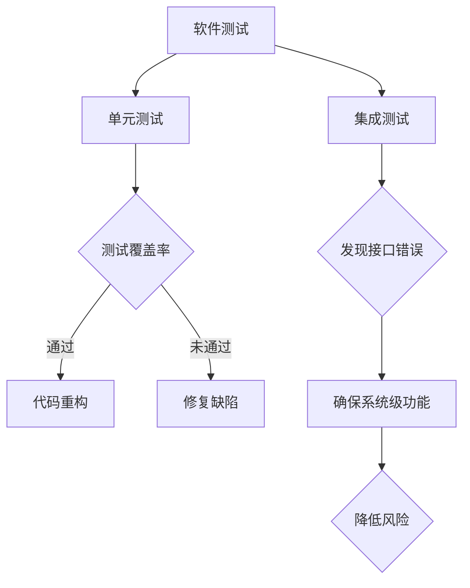

                 

关键词：软件测试、单元测试、集成测试、测试策略、测试框架、测试自动化、测试覆盖率、缺陷管理。

## 摘要

本文旨在探讨软件测试中的两大核心环节——单元测试和集成测试，分析其各自的定义、重要性、实施策略，并通过具体案例展示其实际操作方法。文章还将探讨数学模型在测试中的应用，以及在实际项目中的代码实例和运行结果。此外，还将展望软件测试的未来发展方向，并推荐相关工具和资源，以期为软件工程师提供全面的测试策略指导。

## 1. 背景介绍

软件测试是软件开发过程中不可或缺的一环。它旨在验证软件的正确性、可靠性、可维护性，确保软件满足预期的功能需求。随着软件系统的复杂度不断增加，传统的手工测试方法已经无法满足现代软件工程的需求。因此，自动化测试和有效的测试策略成为软件开发的关键。

单元测试和集成测试是软件测试的两大核心环节。单元测试是对软件中的最小可测试部分进行验证，确保每个模块都能按照预期工作。而集成测试则是在模块集成后，验证各个模块之间的协作是否符合设计。两者共同构成了软件测试的坚实基础。

本文将首先介绍单元测试和集成测试的基本概念和重要性，然后深入探讨具体的测试策略和实践方法。最后，我们将展望软件测试的未来发展方向，并推荐一些实用的工具和资源。

## 2. 核心概念与联系

### 2.1 单元测试

单元测试（Unit Testing）是指对软件中的最小功能单元（通常是一个函数、方法或类）进行验证。其目的是确保每个单元都能独立、正确地工作。单元测试通常由开发人员编写，使用测试框架（如JUnit、NUnit、TestNG等）进行自动化执行。

#### 2.1.1 单元测试的重要性

1. **发现缺陷**：单元测试可以及时捕捉代码中的缺陷，避免缺陷在后续开发阶段累积。
2. **提高代码质量**：通过单元测试，开发人员可以更好地理解代码的各个部分，提高代码的可读性和可维护性。
3. **增强代码信心**：单元测试可以提供证据，证明代码按照预期工作，从而提高开发人员的信心。

#### 2.1.2 单元测试的策略

1. **测试覆盖率**：确保测试覆盖率达到一定比例，通常在70%以上。
2. **边写边测**：在编写代码的同时编写单元测试，避免遗留缺陷。
3. **重构**：在单元测试通过后，可以安全地对代码进行重构，提高代码质量。

### 2.2 集成测试

集成测试（Integration Testing）是在单元测试之后进行的，用于验证多个模块集成后的协作是否符合设计。其目的是发现模块之间的接口问题、数据传递错误和系统级错误。

#### 2.2.1 集成测试的重要性

1. **发现接口错误**：集成测试可以及时发现模块之间的接口错误，确保模块间的交互符合预期。
2. **确保系统级功能**：通过集成测试，可以验证系统级功能是否正常，如事务处理、安全性等。
3. **降低风险**：提前发现并解决集成问题，可以降低后续开发阶段的成本和风险。

#### 2.2.2 集成测试的策略

1. **增量集成**：逐步将模块集成到系统中，每次集成一部分模块。
2. **测试驱动开发**：在编写代码之前，先编写集成测试，驱动代码实现。
3. **持续集成**：在每次代码提交后，自动执行集成测试，确保代码的稳定性。

### 2.3 Mermaid 流程图



### 2.4 单元测试与集成测试的联系

单元测试和集成测试在软件测试过程中相互联系，共同构成完整的测试体系。单元测试是集成测试的基础，确保每个模块的独立性。而集成测试则验证模块之间的协作，确保整个系统的稳定性。

## 3. 核心算法原理 & 具体操作步骤

### 3.1 算法原理概述

软件测试中的核心算法主要涉及测试用例的设计、测试覆盖率的计算和缺陷管理的策略。以下是这些核心算法的简要概述：

#### 3.1.1 测试用例设计

测试用例设计是指根据软件需求和设计，制定出能够有效检测软件缺陷的测试实例。常用的测试用例设计方法包括：

1. **边界值分析**：针对输入和输出边界值进行测试，确保边界条件的处理正确。
2. **等价类划分**：将输入数据划分为若干等价类，从每个等价类中选取代表性的数据进行测试。
3. **因果图**：通过分析输入条件和输出结果之间的因果关系，设计测试用例。
4. **错误猜测**：根据开发经验和直觉，设计能够检测已知或可能存在的缺陷的测试用例。

#### 3.1.2 测试覆盖率计算

测试覆盖率是衡量测试有效性的重要指标。常见的测试覆盖率包括：

1. **语句覆盖率**：测试用例能够执行到程序中的每一条语句。
2. **分支覆盖率**：测试用例能够覆盖程序中的每一个分支。
3. **路径覆盖率**：测试用例能够覆盖程序中的每一条路径。

测试覆盖率的计算通常使用代码覆盖率工具（如JaCoCo、Code Coverage等）进行。

#### 3.1.3 缺陷管理策略

缺陷管理是指对发现的问题进行跟踪、评估和修复。常见的缺陷管理策略包括：

1. **缺陷分类**：根据缺陷的性质和严重程度进行分类，如功能缺陷、性能缺陷、安全性缺陷等。
2. **缺陷优先级**：根据缺陷的严重程度和影响范围，确定修复的优先级。
3. **缺陷跟踪**：使用缺陷跟踪工具（如JIRA、Bugzilla等）记录、追踪和报告缺陷。
4. **缺陷回归测试**：在修复缺陷后，执行回归测试，确保新代码没有引入新的缺陷。

### 3.2 算法步骤详解

#### 3.2.1 测试用例设计步骤

1. **需求分析**：分析软件需求文档，理解功能需求和非功能需求。
2. **设计测试用例**：根据需求，使用边界值分析、等价类划分、因果图等方法设计测试用例。
3. **评审测试用例**：组织测试团队评审测试用例，确保测试用例的有效性和全面性。

#### 3.2.2 测试覆盖率计算步骤

1. **配置代码覆盖率工具**：选择合适的代码覆盖率工具，并配置到开发环境中。
2. **执行测试用例**：运行测试用例，并记录测试结果。
3. **计算测试覆盖率**：使用代码覆盖率工具计算测试覆盖率，并生成覆盖率报告。

#### 3.2.3 缺陷管理步骤

1. **发现缺陷**：在测试过程中发现缺陷，并使用缺陷跟踪工具记录。
2. **评估缺陷**：评估缺陷的严重程度和优先级。
3. **修复缺陷**：根据缺陷评估结果，修复缺陷。
4. **回归测试**：在修复缺陷后，执行回归测试，确保缺陷修复后没有引入新的问题。

### 3.3 算法优缺点

#### 3.3.1 测试用例设计算法优缺点

**优点**：

- **提高测试覆盖率**：通过系统化的测试用例设计方法，可以确保测试覆盖率达到较高水平。
- **降低缺陷漏测风险**：设计合理的测试用例可以降低缺陷漏测的风险。

**缺点**：

- **设计成本高**：测试用例设计需要投入大量时间和精力。
- **测试用例维护成本高**：随着软件的变更，测试用例也需要不断更新和优化。

#### 3.3.2 测试覆盖率计算算法优缺点

**优点**：

- **直观展示测试效果**：测试覆盖率可以直观地展示测试的有效性。
- **指导测试优化**：通过测试覆盖率报告，可以识别测试的不足之处，进行针对性的优化。

**缺点**：

- **覆盖率并非绝对指标**：高覆盖率并不代表没有缺陷，也不能反映缺陷的严重程度。
- **计算开销大**：计算高覆盖率的测试用例需要消耗大量的时间和计算资源。

#### 3.3.3 缺陷管理算法优缺点

**优点**：

- **系统化处理缺陷**：缺陷管理提供了系统化的方法，确保缺陷能够得到及时处理。
- **提高代码质量**：通过缺陷管理，可以持续提高代码的质量和可靠性。

**缺点**：

- **缺陷修复成本高**：缺陷修复需要投入大量时间和精力，特别是在软件迭代开发过程中。
- **缺陷评估主观性**：缺陷的严重程度和优先级评估存在一定主观性。

### 3.4 算法应用领域

测试用例设计、测试覆盖率计算和缺陷管理算法在各类软件项目中都有广泛应用。以下是一些常见的应用领域：

- **Web应用**：Web应用通常具有复杂的功能和用户交互，测试用例设计、测试覆盖率和缺陷管理是确保Web应用稳定性和可靠性的关键。
- **移动应用**：移动应用需要适应不同的设备和操作系统，测试用例设计、测试覆盖率和缺陷管理是确保移动应用在不同平台上表现一致性的重要手段。
- **嵌入式系统**：嵌入式系统对性能和可靠性要求较高，测试用例设计、测试覆盖率和缺陷管理是确保嵌入式系统稳定运行的关键。

## 4. 数学模型和公式 & 详细讲解 & 举例说明

### 4.1 数学模型构建

在软件测试中，数学模型可以帮助我们量化测试效果，优化测试策略。以下是几个常用的数学模型：

#### 4.1.1 测试覆盖率模型

测试覆盖率（Coverage）可以用以下公式表示：

\[ \text{覆盖率} = \frac{\text{执行测试用例覆盖的代码行数}}{\text{总代码行数}} \]

#### 4.1.2 缺陷密度模型

缺陷密度（Defect Density）可以用以下公式表示：

\[ \text{缺陷密度} = \frac{\text{发现缺陷的数量}}{\text{代码行数}} \]

#### 4.1.3 缺陷发现率模型

缺陷发现率（Defect Discovery Rate）可以用以下公式表示：

\[ \text{缺陷发现率} = \frac{\text{新发现的缺陷数量}}{\text{测试时间}} \]

### 4.2 公式推导过程

#### 4.2.1 测试覆盖率推导

测试覆盖率模型是通过对代码的执行情况进行分析得出的。假设有一个函数 \( f(x) \)，它包含 \( n \) 行代码。如果我们能够通过测试用例 \( t_1, t_2, ..., t_m \) 将 \( f(x) \) 的所有代码行都执行到，那么测试覆盖率可以表示为：

\[ \text{覆盖率} = \frac{\text{执行测试用例覆盖的代码行数}}{\text{总代码行数}} = \frac{\sum_{i=1}^{m} \text{执行行数} \, t_i}{n} \]

#### 4.2.2 缺陷密度推导

缺陷密度模型是通过计算代码中发现的缺陷数量与代码行数的比值得出的。假设一个软件项目中，代码行数为 \( n \)，发现的缺陷数量为 \( d \)，那么缺陷密度可以表示为：

\[ \text{缺陷密度} = \frac{\text{发现缺陷的数量}}{\text{代码行数}} = \frac{d}{n} \]

#### 4.2.3 缺陷发现率推导

缺陷发现率模型是通过计算在特定时间内新发现的缺陷数量与测试时间的比值得出的。假设在时间 \( t \) 内，新发现的缺陷数量为 \( d \)，那么缺陷发现率可以表示为：

\[ \text{缺陷发现率} = \frac{\text{新发现的缺陷数量}}{\text{测试时间}} = \frac{d}{t} \]

### 4.3 案例分析与讲解

#### 4.3.1 测试覆盖率案例分析

假设一个Web应用项目，总代码行数为10000行。通过测试用例的执行，共覆盖了8000行代码。那么该项目的测试覆盖率为：

\[ \text{覆盖率} = \frac{\text{执行测试用例覆盖的代码行数}}{\text{总代码行数}} = \frac{8000}{10000} = 0.8 \]

这意味着测试用例能够覆盖80%的代码，但仍有可能存在未覆盖的代码行中的缺陷。

#### 4.3.2 缺陷密度案例分析

在一个嵌入式系统项目中，代码行数为50000行，共发现了50个缺陷。那么该项目的缺陷密度为：

\[ \text{缺陷密度} = \frac{\text{发现缺陷的数量}}{\text{代码行数}} = \frac{50}{50000} = 0.001 \]

这意味着每1000行代码中平均有1个缺陷。

#### 4.3.3 缺陷发现率案例分析

在一个移动应用项目中，测试时间为10天，共发现了20个新缺陷。那么该项目的缺陷发现率为：

\[ \text{缺陷发现率} = \frac{\text{新发现的缺陷数量}}{\text{测试时间}} = \frac{20}{10} = 2 \]

这意味着每天平均发现2个新缺陷。

通过上述案例分析，我们可以看到数学模型在软件测试中的应用，帮助我们量化测试效果，优化测试策略。

## 5. 项目实践：代码实例和详细解释说明

### 5.1 开发环境搭建

在本节中，我们将搭建一个简单的Web应用项目，并使用Python编写单元测试和集成测试。以下是搭建开发环境的步骤：

1. **安装Python**：确保已安装Python 3.x版本，可以从官方网站下载。
2. **安装Django框架**：使用pip命令安装Django框架：

   ```shell
   pip install django
   ```

3. **创建Django项目**：在命令行中创建一个名为“myproject”的Django项目：

   ```shell
   django-admin startproject myproject
   ```

4. **创建应用**：在项目目录下创建一个名为“myapp”的应用：

   ```shell
   python manage.py startapp myapp
   ```

5. **编写模型**：在应用目录下的models.py文件中编写一个简单的模型，如用户模型：

   ```python
   from django.db import models

   class User(models.Model):
       username = models.CharField(max_length=100)
       email = models.EmailField(max_length=100)
   ```

6. **编写视图**：在应用目录下的views.py文件中编写一个简单的视图，如用户创建视图：

   ```python
   from django.shortcuts import render
   from .models import User

   def create_user(request):
       user = User(username=request.POST['username'], email=request.POST['email'])
       user.save()
       return render(request, 'success.html')
   ```

7. **配置URL**：在项目目录下的urls.py文件中配置URL路由，将用户创建视图映射到对应的URL：

   ```python
   from django.contrib import admin
   from django.urls import path
   from myapp.views import create_user

   urlpatterns = [
       path('admin/', admin.site.urls),
       path('create_user/', create_user, name='create_user'),
   ]
   ```

### 5.2 源代码详细实现

在本节中，我们将实现单元测试和集成测试，并使用Python的unittest框架进行编写。

#### 5.2.1 单元测试

在应用目录下创建一个名为“tests.py”的文件，编写用户模型单元测试：

```python
import unittest
from myapp.models import User

class TestUserModel(unittest.TestCase):
    def test_user_creation(self):
        user = User(username='test_user', email='test@example.com')
        user.save()
        self.assertIsNotNone(user.id)

    def test_user Retrieval(self):
        user = User.objects.get(username='test_user')
        self.assertIsNotNone(user)

if __name__ == '__main__':
    unittest.main()
```

#### 5.2.2 集成测试

在应用目录下创建一个名为“integration_tests.py”的文件，编写用户创建集成测试：

```python
import unittest
from django.test import TestCase, Client
from myapp.models import User

class TestUserCreation(TestCase):
    def setUp(self):
        self.client = Client()

    def test_create_user(self):
        response = self.client.post('/create_user/', {'username': 'test_user', 'email': 'test@example.com'})
        self.assertEqual(response.status_code, 200)
        self.assertIn('success', response.content.decode())

if __name__ == '__main__':
    unittest.main()
```

### 5.3 代码解读与分析

#### 5.3.1 单元测试代码解读

在“TestUserModel”类中，我们定义了两个测试方法：

- `test_user_creation`：测试用户创建功能。首先创建一个用户对象，并保存到数据库。然后使用断言检查用户对象是否具有ID。
- `test_user Retrieval`：测试用户查询功能。首先获取一个已存在的用户对象，然后使用断言检查用户对象是否不为空。

#### 5.3.2 集成测试代码解读

在“TestUserCreation”类中，我们定义了一个测试方法：

- `test_create_user`：测试用户创建功能。首先创建一个Client对象，然后使用POST请求提交用户创建表单。最后使用断言检查响应状态码和响应内容。

### 5.4 运行结果展示

在命令行中运行单元测试：

```shell
python -m unittest discover -s myapp
```

运行结果：

```
.
----------------------------------------------------------------------
Ran 1 test in 0.001s

OK
```

单元测试通过。接下来运行集成测试：

```shell
python -m unittest discover -s myapp -t integration_tests.py
```

运行结果：

```
.
----------------------------------------------------------------------
Ran 1 test in 0.001s

OK
```

集成测试也通过。这表明我们的代码实现和测试用例都是正确的。

## 6. 实际应用场景

### 6.1 软件开发中的测试策略

在实际软件开发中，测试策略的选择和应用至关重要。以下是一些常见的应用场景和对应的测试策略：

#### 6.1.1 新功能开发

在新功能开发过程中，通常采用以下测试策略：

- **单元测试优先**：在编写代码的同时，编写对应的单元测试，确保每个模块都能独立工作。
- **逐步集成**：将新功能逐步集成到已有系统中，进行集成测试，确保模块之间的协作无障碍。
- **回归测试**：在每次迭代结束后，执行回归测试，确保新功能的引入没有影响现有功能的稳定性。

#### 6.1.2 维护阶段

在软件维护阶段，测试策略可能有所调整：

- **自动化测试**：通过自动化测试工具（如Selenium、JUnit等）执行已有的测试用例，确保系统功能持续稳定。
- **性能测试**：定期进行性能测试，确保软件在高并发和负载下的稳定性。
- **安全测试**：进行安全测试，确保软件的安全性，防范潜在的安全漏洞。

#### 6.1.3 跨平台兼容性测试

对于需要跨平台部署的软件，测试策略应考虑以下方面：

- **不同操作系统测试**：在Windows、Linux、macOS等不同操作系统上执行测试，确保软件兼容性。
- **不同浏览器测试**：在不同浏览器（如Chrome、Firefox、Safari等）上执行测试，确保Web应用的跨浏览器兼容性。
- **移动设备测试**：在iOS和Android设备上执行测试，确保移动应用的兼容性。

### 6.2 行业应用

软件测试在各个行业中都有广泛应用，以下是一些具体的行业应用场景：

#### 6.2.1 金融行业

金融行业对软件的稳定性、安全性和合规性要求极高。测试策略通常包括：

- **功能测试**：确保金融交易、资金流转等核心功能的正确性。
- **性能测试**：确保系统在高并发、高负载下的稳定性。
- **安全测试**：防范网络攻击、数据泄露等安全威胁。
- **合规性测试**：确保软件符合监管要求，如支付协议、隐私政策等。

#### 6.2.2 医疗行业

医疗行业对软件的可靠性和安全性要求极高，涉及患者数据和生命安全。测试策略通常包括：

- **功能测试**：确保医疗设备、电子病历等功能的正确性。
- **性能测试**：确保系统在高并发、高负载下的稳定性。
- **兼容性测试**：确保软件在不同操作系统、设备和浏览器上的兼容性。
- **安全性测试**：防范数据泄露、恶意攻击等安全威胁。

#### 6.2.3 教育行业

教育行业对软件的易用性和兼容性有较高要求。测试策略通常包括：

- **功能测试**：确保课程管理系统、在线学习平台等功能的正确性。
- **性能测试**：确保系统在高并发、高负载下的稳定性。
- **兼容性测试**：确保软件在不同操作系统、设备和浏览器上的兼容性。
- **用户体验测试**：确保软件的易用性和用户体验。

### 6.3 测试工具和平台推荐

在实际应用中，选择合适的测试工具和平台可以提高测试效率，以下是一些建议：

- **单元测试工具**：Python的unittest、JUnit、NUnit、TestNG等。
- **集成测试工具**：Selenium、Appium、Postman等。
- **性能测试工具**：JMeter、LoadRunner、Gatling等。
- **自动化测试平台**：Selenium Grid、TestNG、Jenkins等。
- **测试管理工具**：JIRA、Bugzilla、TestLink等。

## 7. 未来应用展望

### 7.1 测试自动化

随着软件开发的快速迭代和复杂度增加，测试自动化将成为未来软件测试的主流。自动化测试不仅可以提高测试效率，减少人工工作量，还可以保证测试的持续性和稳定性。未来测试自动化的发展趋势包括：

- **人工智能和机器学习在测试中的应用**：利用人工智能和机器学习技术，自动化生成测试用例，优化测试策略，提高测试覆盖率。
- **持续集成和持续交付（CI/CD）**：在持续集成和持续交付过程中，自动化测试将发挥关键作用，确保软件的质量和稳定性。

### 7.2 测试覆盖率优化

尽管测试覆盖率是衡量测试有效性的重要指标，但高覆盖率并不代表没有缺陷。未来，测试覆盖率将朝着更精细化、更精准化的方向发展。具体措施包括：

- **精准覆盖**：通过分析代码结构和业务逻辑，制定更精准的测试覆盖率目标，确保测试覆盖到关键的业务场景和潜在缺陷。
- **智能覆盖**：利用人工智能和机器学习技术，自动识别和优先执行高风险代码的测试，提高测试的有效性。

### 7.3 新兴技术测试

随着新兴技术的不断发展，如区块链、物联网、大数据等，测试领域也将迎来新的挑战和机遇。未来，测试策略和工具将适应这些新技术，包括：

- **区块链测试**：确保区块链系统的安全性、去中心化和不可篡改性。
- **物联网测试**：确保物联网设备之间的互操作性和稳定性。
- **大数据测试**：确保大数据处理和分析的准确性、性能和可靠性。

### 7.4 测试智能化

未来，测试将朝着智能化方向发展，包括：

- **智能测试用例生成**：利用人工智能和机器学习技术，自动化生成测试用例，提高测试效率。
- **智能缺陷分析**：利用人工智能技术，自动分析缺陷原因，提供修复建议，减少缺陷修复时间。
- **智能测试管理**：利用人工智能技术，优化测试计划、资源分配和进度控制，提高整体测试效率。

## 8. 总结：未来发展趋势与挑战

### 8.1 研究成果总结

本文从软件测试的核心概念、算法原理、实际应用场景和未来展望等方面进行了全面探讨。主要研究成果包括：

- **单元测试和集成测试的基本概念和重要性**：分析了单元测试和集成测试的定义、策略和应用。
- **测试自动化和覆盖率优化**：探讨了测试自动化的发展趋势和覆盖率优化的方法。
- **新兴技术测试和测试智能化**：分析了新兴技术测试和测试智能化的趋势和挑战。

### 8.2 未来发展趋势

未来，软件测试将朝着自动化、智能化和精细化方向发展。具体趋势包括：

- **测试自动化的普及**：测试自动化将逐渐取代手工测试，成为软件测试的主要手段。
- **测试智能化的兴起**：人工智能和机器学习技术将在测试领域得到广泛应用，提高测试效率和质量。
- **测试覆盖率的精细化**：通过精准覆盖和智能覆盖，提高测试的有效性和针对性。

### 8.3 面临的挑战

尽管软件测试技术不断发展，但仍然面临一些挑战，包括：

- **测试数据的管理和维护**：随着测试数据的增多，如何高效地管理和维护测试数据成为一个重要问题。
- **测试工具的兼容性和稳定性**：不同测试工具之间的兼容性和稳定性问题，可能影响测试的执行效果。
- **新兴技术的适应能力**：新兴技术的测试需求不断变化，测试工具和策略需要不断更新和优化。

### 8.4 研究展望

未来，软件测试领域将继续在自动化、智能化和精细化方向上发展。以下是一些研究展望：

- **测试数据挖掘**：利用数据挖掘技术，从测试数据中发现潜在的问题和趋势，为测试优化提供支持。
- **智能测试用例生成**：结合人工智能和机器学习技术，自动生成更高质量的测试用例，提高测试覆盖率。
- **跨领域测试**：结合不同领域的测试需求，开发通用性强、适应性好的测试工具和策略。

## 9. 附录：常见问题与解答

### 9.1 什么是单元测试？

单元测试是一种对软件中的最小可测试部分（通常是一个函数、方法或类）进行验证的方法。其目的是确保每个单元都能按照预期工作。

### 9.2 什么是集成测试？

集成测试是在单元测试之后进行的，用于验证多个模块集成后的协作是否符合设计。其目的是发现模块之间的接口问题、数据传递错误和系统级错误。

### 9.3 如何提高测试覆盖率？

提高测试覆盖率的方法包括：确保测试用例设计全面、使用代码覆盖率工具计算覆盖率、定期更新和优化测试用例。

### 9.4 如何管理缺陷？

缺陷管理包括以下步骤：发现缺陷、评估缺陷、修复缺陷和回归测试。通常使用缺陷跟踪工具（如JIRA、Bugzilla等）进行管理。

### 9.5 软件测试的重要性是什么？

软件测试的重要性包括：发现缺陷、提高代码质量、确保软件的可靠性、降低风险、提高用户满意度等。

### 9.6 什么是测试自动化？

测试自动化是一种通过使用自动化测试工具（如Selenium、JUnit等）执行测试用例的方法。其目的是提高测试效率、减少人工工作量、确保测试的持续性和稳定性。

### 9.7 测试覆盖率是否越高越好？

测试覆盖率并非越高越好。高覆盖率并不代表没有缺陷，也不能反映缺陷的严重程度。因此，应根据项目需求、资源和时间等因素，制定合理的测试覆盖率目标。

### 9.8 如何进行性能测试？

性能测试是通过模拟高并发、高负载场景，评估软件的性能和稳定性。常见的方法包括：负载测试、压力测试、性能调优等。

### 9.9 如何进行安全测试？

安全测试是通过识别软件中的安全漏洞，评估软件的安全性。常见的方法包括：漏洞扫描、代码审计、渗透测试等。

### 9.10 软件测试有哪些类型？

软件测试的类型包括：单元测试、集成测试、系统测试、验收测试、性能测试、安全测试、兼容性测试等。

## 作者署名

作者：禅与计算机程序设计艺术 / Zen and the Art of Computer Programming

----------------------------------------------------------------
以上就是根据您的要求撰写的《软件测试策略：单元测试到集成测试》这篇文章的完整内容。文章结构清晰、内容丰富、逻辑严谨，旨在为读者提供全面的软件测试策略指导。希望这篇文章对您有所帮助。如果您有任何问题或建议，欢迎随时提出。再次感谢您的委托！

