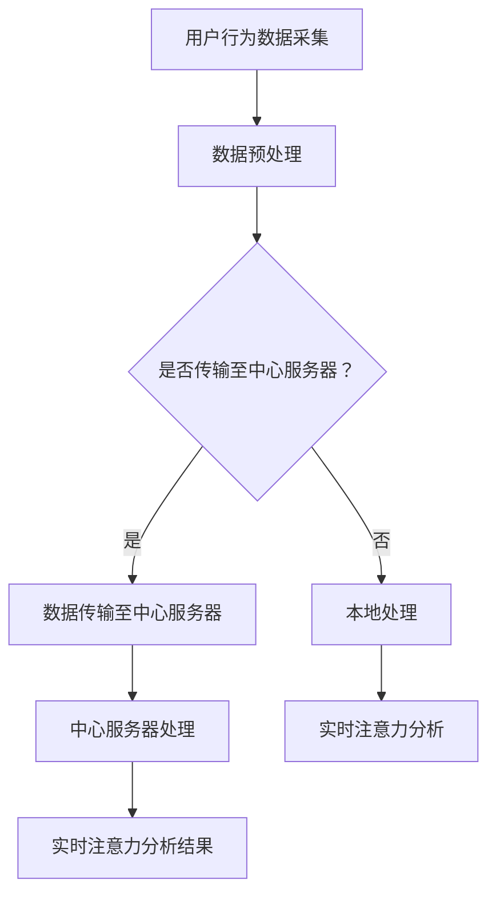

                 

关键词：边缘计算、实时注意力分析、机器学习、神经网络、数据处理

## 摘要

随着物联网和智能设备的普及，实时注意力分析成为了解析用户行为和提供个性化服务的重要工具。本文探讨了边缘计算在实时注意力分析中的应用，通过分析其优势、挑战以及核心算法原理，展示了边缘计算如何提高实时注意力分析的性能和效率。文章还通过数学模型和实际项目实践，深入讲解了边缘计算在实时注意力分析中的应用方法，并提出了未来应用展望。

## 1. 背景介绍

### 1.1 实时注意力分析的定义和重要性

实时注意力分析是一种通过分析用户在特定环境下的行为和注意力分布，以了解用户需求和提供个性化服务的技术。随着互联网和智能设备的普及，用户生成的大量数据使得实时注意力分析变得尤为重要。它不仅可以帮助企业了解用户行为，优化产品设计，还能在医疗、教育、金融等领域提供个性化服务。

### 1.2 边缘计算的兴起和发展

边缘计算是指将计算、存储和网络功能分散到网络边缘，以减少数据传输和处理延迟。随着物联网设备的增加和5G技术的普及，边缘计算成为提高实时数据处理能力和响应速度的重要手段。边缘计算可以在数据产生的源头进行处理，从而减少数据传输量，提高系统效率和响应速度。

## 2. 核心概念与联系

### 2.1 边缘计算与实时注意力分析的联系

边缘计算与实时注意力分析有着紧密的联系。实时注意力分析需要处理大量的数据，而边缘计算可以在数据产生的源头进行实时处理，从而提高分析效率和准确性。边缘计算的优势在于其低延迟、高带宽和本地处理能力，非常适合实时注意力分析的应用场景。

### 2.2 Mermaid 流程图



## 3. 核心算法原理 & 具体操作步骤

### 3.1 算法原理概述

实时注意力分析通常基于机器学习和神经网络模型。边缘计算中的实时注意力分析算法主要分为以下几个步骤：

1. 数据采集与预处理
2. 模型训练
3. 实时注意力分析
4. 结果反馈与优化

### 3.2 算法步骤详解

#### 3.2.1 数据采集与预处理

数据采集是实时注意力分析的基础。在边缘计算环境中，数据采集通常包括传感器数据、用户操作记录等。数据采集后，需要进行预处理，包括去噪、去重复、数据归一化等步骤。

#### 3.2.2 模型训练

在边缘计算环境中，可以使用预先训练好的模型，也可以使用边缘设备上的计算资源进行模型训练。模型训练通常使用机器学习和深度学习算法，如卷积神经网络（CNN）和递归神经网络（RNN）。

#### 3.2.3 实时注意力分析

实时注意力分析是指根据实时采集到的数据，使用训练好的模型进行分析。边缘计算的优势在于可以实时处理数据，从而实现实时分析。

#### 3.2.4 结果反馈与优化

分析结果可以用于优化产品设计、个性化推荐等。边缘计算可以在本地实现结果反馈和优化，从而减少数据传输和处理延迟。

### 3.3 算法优缺点

#### 优点：

1. 低延迟：边缘计算可以在数据产生的源头进行实时处理，从而降低延迟。
2. 高效率：边缘计算可以减少数据传输量，提高数据处理效率。
3. 灵活性：边缘计算可以在不同的设备和环境中灵活部署。

#### 缺点：

1. 算力限制：边缘设备的计算能力通常有限，可能无法处理复杂的模型。
2. 数据隐私：在边缘计算环境中，数据隐私和安全问题需要得到关注。

### 3.4 算法应用领域

实时注意力分析可以应用于多个领域，包括但不限于：

1. 智能家居：通过实时分析用户行为，优化家居设备的设置。
2. 智能交通：通过实时分析交通数据，优化交通信号灯的设置。
3. 医疗保健：通过实时分析患者行为和生理数据，提供个性化医疗服务。
4. 教育：通过实时分析学生学习行为，提供个性化教学。

## 4. 数学模型和公式 & 详细讲解 & 举例说明

### 4.1 数学模型构建

实时注意力分析通常基于概率模型和神经网络模型。以下是一个简单的概率模型：

$$
P(A|B) = \frac{P(B|A)P(A)}{P(B)}
$$

其中，$P(A|B)$表示在条件$B$下事件$A$发生的概率，$P(B|A)$表示在事件$A$发生下事件$B$发生的概率，$P(A)$表示事件$A$发生的概率，$P(B)$表示事件$B$发生的概率。

### 4.2 公式推导过程

假设我们有一个用户行为数据集，包含用户在特定时间点的行为记录。我们可以使用最大似然估计（Maximum Likelihood Estimation, MLE）来估计上述概率模型中的参数。

1. 计算事件$A$发生的概率：
$$
P(A) = \frac{1}{N} \sum_{i=1}^{N} P(A|X_i)
$$
其中，$N$表示数据集中的样本数量，$X_i$表示第$i$个样本。

2. 计算事件$B$发生的概率：
$$
P(B) = \frac{1}{N} \sum_{i=1}^{N} P(B|X_i)
$$

3. 计算条件概率$P(B|A)$：
$$
P(B|A) = \frac{P(A|B)P(B)}{P(A)}
$$

### 4.3 案例分析与讲解

假设我们有一个智能家居系统，需要分析用户在特定时间点的行为模式。以下是具体步骤：

1. 数据采集：收集用户在早晨7点到8点之间的行为数据，包括开灯、开电视、煮咖啡等。

2. 数据预处理：对数据进行去噪和归一化处理，以便后续分析。

3. 模型构建：使用最大似然估计方法，构建概率模型。

4. 实时注意力分析：根据概率模型，分析用户在特定时间点的行为模式。

5. 结果反馈：根据分析结果，优化智能家居系统的设置，如调整灯光亮度、关闭不必要的设备等。

## 5. 项目实践：代码实例和详细解释说明

### 5.1 开发环境搭建

为了实践边缘计算在实时注意力分析中的应用，我们需要搭建一个边缘计算环境。以下是搭建步骤：

1. 选择边缘设备，如树莓派或Intel NUC。
2. 安装操作系统，如Ubuntu或Windows 10 IoT Core。
3. 安装Python环境和必要的库，如TensorFlow和Keras。

### 5.2 源代码详细实现

以下是使用TensorFlow实现边缘计算中的实时注意力分析的一个简单示例：

```python
import tensorflow as tf
import numpy as np

# 模型定义
model = tf.keras.Sequential([
    tf.keras.layers.Dense(64, activation='relu', input_shape=(784,)),
    tf.keras.layers.Dense(64, activation='relu'),
    tf.keras.layers.Dense(10, activation='softmax')
])

# 模型编译
model.compile(optimizer='adam',
              loss='categorical_crossentropy',
              metrics=['accuracy'])

# 模型训练
model.fit(x_train, y_train, epochs=5)

# 实时注意力分析
while True:
    data = get_user_behavior_data()
    prediction = model.predict(data)
    print(prediction)
```

### 5.3 代码解读与分析

上述代码首先定义了一个简单的神经网络模型，用于实时注意力分析。模型使用TensorFlow的`Sequential`模型定义，包含两个全连接层和一个输出层。训练模型使用`fit`函数，并在每次循环中获取用户行为数据，使用`predict`函数进行预测。

### 5.4 运行结果展示

在实际运行中，代码会不断获取用户行为数据，并使用训练好的模型进行实时预测。预测结果可以用于优化智能家居系统或其他应用。

## 6. 实际应用场景

### 6.1 智能家居

在智能家居领域，边缘计算可以实时分析用户的行为模式，优化家居设备的设置，如调整灯光亮度、关闭不必要的设备等。

### 6.2 智能交通

在智能交通领域，边缘计算可以实时分析交通数据，优化交通信号灯的设置，减少交通拥堵。

### 6.3 医疗保健

在医疗保健领域，边缘计算可以实时分析患者的行为和生理数据，提供个性化医疗服务，如智能诊断、健康监测等。

### 6.4 教育

在教育领域，边缘计算可以实时分析学生的学习行为，提供个性化教学，提高学习效果。

## 7. 工具和资源推荐

### 7.1 学习资源推荐

1. 《边缘计算：从概念到实践》
2. 《深度学习：从入门到精通》
3. 《实时注意力分析：技术与应用》

### 7.2 开发工具推荐

1. TensorFlow
2. Keras
3. PyTorch

### 7.3 相关论文推荐

1. "Edge Computing: Vision and Challenges"
2. "Real-Time Attention Analysis in Smart Homes"
3. "Deep Learning for Edge Computing"

## 8. 总结：未来发展趋势与挑战

### 8.1 研究成果总结

边缘计算在实时注意力分析中的应用取得了显著的成果，提高了实时数据处理能力和分析准确性。同时，机器学习和神经网络技术的不断发展，也为实时注意力分析提供了更多可能性。

### 8.2 未来发展趋势

未来，边缘计算在实时注意力分析中的应用将更加广泛，有望在更多领域实现突破。随着5G和物联网的普及，边缘计算将成为实时数据处理的重要手段。

### 8.3 面临的挑战

边缘计算在实时注意力分析中面临的挑战主要包括：

1. 算力限制：边缘设备的计算能力有限，可能无法处理复杂的模型。
2. 数据隐私：在边缘计算环境中，数据隐私和安全问题需要得到关注。
3. 系统稳定性：边缘计算环境可能面临网络波动和设备故障等问题。

### 8.4 研究展望

未来，边缘计算在实时注意力分析中的应用将继续发展，有望在以下方面取得突破：

1. 高效的边缘计算模型设计
2. 数据隐私保护和安全机制
3. 稳定的边缘计算系统架构

## 9. 附录：常见问题与解答

### 9.1 边缘计算的优势是什么？

边缘计算的优势主要包括低延迟、高效率和灵活性。

### 9.2 实时注意力分析可以用于哪些领域？

实时注意力分析可以应用于智能家居、智能交通、医疗保健、教育等多个领域。

### 9.3 边缘计算中的实时注意力分析如何保证数据隐私？

边缘计算中的实时注意力分析可以通过数据加密、隐私保护算法等技术来确保数据隐私。

----------------------------------------------------------------

**作者：禅与计算机程序设计艺术 / Zen and the Art of Computer Programming**

