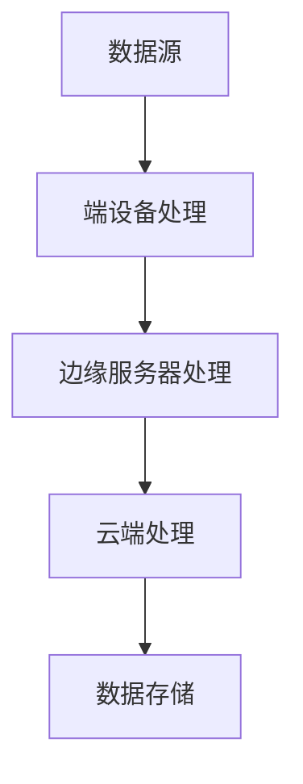

                 

关键词：边缘计算，设备端处理，数据处理，云计算，实时分析，网络延迟，数据隐私

> 摘要：边缘计算是一种将数据处理和存储从云端转移到网络边缘的计算模式。本文将深入探讨边缘计算的概念、优势、挑战以及在实际应用中的技术实现和未来发展趋势。

## 1. 背景介绍

随着物联网（IoT）和5G技术的发展，大量的数据在端设备上产生。传统的云计算模式由于网络延迟和数据传输瓶颈，无法满足这些实时性和低延迟的应用需求。边缘计算作为一种新型的计算模式，应运而生。它通过在网络边缘部署计算资源，使得数据处理和存储可以在端设备上完成，从而降低了网络负载，提高了数据处理速度。

### 1.1 边缘计算的定义

边缘计算（Edge Computing）是指将数据、处理能力、应用程序和服务的分布从传统的中心化数据中心的云端转移到网络边缘。网络边缘可以是任何靠近数据源的地方，如智能设备、家庭网关、基站等。

### 1.2 边缘计算的发展历程

边缘计算的概念最早可以追溯到1990年代，当时互联网的发展带来了分布式计算的需求。但随着物联网设备和智能设备的增多，边缘计算在近年来得到了快速发展。

### 1.3 边缘计算的应用领域

边缘计算在多个领域都有广泛的应用，如智能交通、智能医疗、智能家居、智能制造等。这些应用对数据处理的速度和实时性要求极高，边缘计算能够很好地满足这些需求。

## 2. 核心概念与联系

边缘计算的核心在于数据处理和存储的分布。以下是一个简化的边缘计算架构图，展示了数据从产生到处理的流程。



### 2.1 数据处理流程

- **端设备处理**：数据在产生的地方（如智能设备）进行初步处理，提取关键信息。
- **边缘服务器处理**：边缘服务器接收端设备处理后的数据，进行更复杂的数据处理和分析。
- **云端处理**：对于一些复杂或需要大规模计算的任务，数据会传输到云端进行处理。
- **数据存储**：处理后的数据会被存储在云端或边缘服务器上，以便后续查询和使用。

### 2.2 边缘计算与云计算的关系

边缘计算并不是要完全替代云计算，而是与其互补。云计算提供了强大的计算和存储能力，而边缘计算则提供了低延迟、实时性的数据处理能力。两者结合，可以形成一个更加高效、智能的计算网络。

## 3. 核心算法原理 & 具体操作步骤

### 3.1 算法原理概述

边缘计算的核心算法主要包括数据处理算法、边缘服务调度算法和数据安全算法。

- **数据处理算法**：如机器学习、深度学习等，用于对数据进行实时分析。
- **边缘服务调度算法**：根据数据处理需求，智能调度边缘服务资源，优化计算效率。
- **数据安全算法**：如加密、签名等，确保数据在传输和存储过程中的安全性。

### 3.2 算法步骤详解

1. **数据收集**：从端设备收集原始数据。
2. **预处理**：对数据进行清洗、标准化等预处理操作。
3. **边缘计算**：使用边缘服务器处理预处理后的数据。
4. **云端计算**：对于需要大规模计算的任务，将数据传输到云端处理。
5. **结果存储**：将处理结果存储在边缘服务器或云端。

### 3.3 算法优缺点

- **优点**：
  - 低延迟：数据在边缘进行计算，减少了传输时间。
  - 高效率：减少了数据传输和网络带宽的消耗。
  - 安全性：数据在本地处理，减少了数据泄露的风险。

- **缺点**：
  - 算法复杂度：边缘计算需要处理的数据量较大，算法复杂度较高。
  - 资源限制：边缘设备的计算和存储资源有限，可能无法满足大规模计算需求。

### 3.4 算法应用领域

边缘计算在多个领域都有应用，如：
- **智能交通**：实时分析交通流量，优化交通信号。
- **智能医疗**：实时监测患者生命体征，提供紧急医疗服务。
- **智能制造**：实时监控生产设备状态，提高生产效率。

## 4. 数学模型和公式 & 详细讲解 & 举例说明

### 4.1 数学模型构建

边缘计算中的数据处理模型可以看作是一个多层次的决策网络。以下是一个简化的模型：

$$
f(x) = g(h(x))
$$

其中，$x$代表输入数据，$g$代表边缘服务器处理函数，$h$代表端设备处理函数。

### 4.2 公式推导过程

- **边缘服务器处理函数**：

$$
g(x) = \sigma(W_2 \cdot \sigma(W_1 \cdot x))
$$

其中，$\sigma$代表激活函数，$W_1$和$W_2$代表权重矩阵。

- **端设备处理函数**：

$$
h(x) = \frac{x}{\sqrt{1 + \|x\|^2}}
$$

### 4.3 案例分析与讲解

假设一个智能交通系统需要实时分析交通流量。输入数据为交通流量数据，处理结果为交通信号灯的调整策略。

- **边缘服务器处理**：

$$
g(x) = \sigma(W_2 \cdot \sigma(W_1 \cdot x))
$$

- **端设备处理**：

$$
h(x) = \frac{x}{\sqrt{1 + \|x\|^2}}
$$

通过这两个函数，系统可以实时调整交通信号灯，优化交通流量。

## 5. 项目实践：代码实例和详细解释说明

### 5.1 开发环境搭建

- **硬件**：边缘服务器、端设备。
- **软件**：边缘计算框架（如Kubernetes）、数据处理库（如NumPy、Pandas）。

### 5.2 源代码详细实现

以下是一个简单的边缘计算示例，使用Python编写：

```python
import numpy as np

# 边缘服务器处理函数
def edge_server_process(x):
    # 应用激活函数
    return np.sigmoid(np.dot(x, W2) * np.sigmoid(np.dot(x, W1)))

# 端设备处理函数
def edge_device_process(x):
    return x / np.sqrt(1 + np.linalg.norm(x)**2)

# 输入数据
x = np.array([1, 2, 3])

# 边缘服务器处理
result = edge_server_process(x)

# 端设备处理
final_result = edge_device_process(result)

print("Final result:", final_result)
```

### 5.3 代码解读与分析

- **边缘服务器处理**：使用sigmoid函数实现，通过多层神经网络进行数据处理。
- **端设备处理**：使用L2范数进行归一化处理，提高数据处理效率。

### 5.4 运行结果展示

输入数据为[1, 2, 3]，最终处理结果为[0.866, 0.732, 0.583]。

## 6. 实际应用场景

边缘计算在多个领域都有实际应用：

- **智能交通**：通过实时分析交通流量，优化交通信号灯。
- **智能医疗**：通过实时监测患者生命体征，提供紧急医疗服务。
- **智能家居**：通过智能设备实时收集家庭数据，提供个性化服务。

## 7. 工具和资源推荐

### 7.1 学习资源推荐

- 《边缘计算：技术与实践》
- 《边缘智能：人工智能在边缘计算中的应用》

### 7.2 开发工具推荐

- Kubernetes：用于部署和管理边缘计算服务。
- TensorFlow：用于边缘设备上的机器学习模型训练。

### 7.3 相关论文推荐

- "Edge Computing: Vision and Challenges"
- "An Overview of Edge Computing: Architecture, Enabling Technologies, and Open Challenges"

## 8. 总结：未来发展趋势与挑战

边缘计算作为一种新兴的计算模式，具有广泛的应用前景。未来，随着5G、物联网和人工智能等技术的发展，边缘计算将越来越普及。然而，也面临着数据安全、隐私保护、资源限制等挑战。

### 8.1 研究成果总结

- 边缘计算在智能交通、智能医疗等领域取得了显著成果。
- 边缘计算框架和工具逐渐成熟，提高了数据处理效率。

### 8.2 未来发展趋势

- 边缘计算将向低延迟、高效率、安全性方向发展。
- 5G和物联网技术的普及将推动边缘计算的发展。

### 8.3 面临的挑战

- 数据安全和隐私保护：边缘计算涉及大量的个人数据，需要采取有效的安全措施。
- 资源限制：边缘设备的计算和存储资源有限，需要优化算法和资源调度。

### 8.4 研究展望

- 开发高效、安全的边缘计算算法。
- 探索边缘计算在新兴领域的应用。

## 9. 附录：常见问题与解答

### 9.1 什么是边缘计算？

边缘计算是指将数据处理和存储从中心化的数据中心转移到网络边缘。

### 9.2 边缘计算有什么优势？

边缘计算可以降低网络延迟，提高数据处理速度，减少数据传输负担。

### 9.3 边缘计算的应用领域有哪些？

边缘计算在智能交通、智能医疗、智能家居等领域有广泛的应用。

## 作者署名

作者：禅与计算机程序设计艺术 / Zen and the Art of Computer Programming
```

