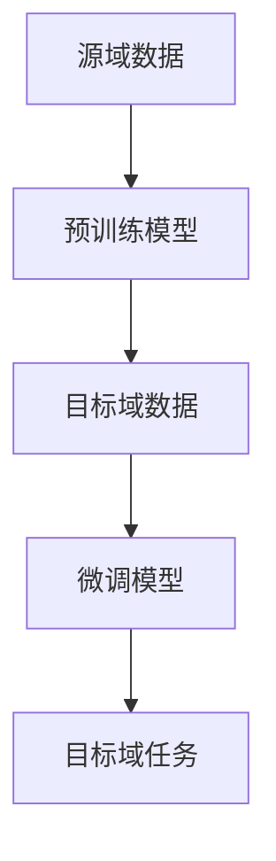

                 

关键词：迁移学习，深度学习，模型复用，跨域学习，性能提升

> 摘要：迁移学习（Transfer Learning）是一种重要的机器学习方法，通过利用已经训练好的模型来提升新任务的表现。本文将详细探讨迁移学习的原理、核心算法、数学模型，并通过实际代码实例来讲解其在深度学习中的应用。

## 1. 背景介绍

随着深度学习技术的不断发展，神经网络模型在各类任务中取得了惊人的成果。然而，训练深度神经网络需要大量的数据和计算资源，这对一些小型团队或个人研究者来说是一个巨大的挑战。此外，对于不同的任务，可能需要重新设计网络架构和训练过程，这无疑增加了研发成本和时间。迁移学习（Transfer Learning）作为一种有效的解决方案，能够充分利用已有的预训练模型，快速提升新任务的表现，降低训练成本。

迁移学习最初起源于计算机视觉领域，但随着深度学习技术的普及，其应用范围已经扩展到自然语言处理、语音识别等多个领域。本文将主要围绕深度学习中的迁移学习进行探讨，包括其核心概念、算法原理、数学模型以及实际应用。

## 2. 核心概念与联系

### 2.1 基本概念

迁移学习涉及以下几个核心概念：

- **源域（Source Domain）**：指的是已经有一系列标注数据的领域，这些数据用于训练模型。
- **目标域（Target Domain）**：指的是希望应用模型但没有足够标注数据的领域。
- **迁移学习（Transfer Learning）**：将源域的知识迁移到目标域，以提高目标域模型的性能。

### 2.2 架构联系

迁移学习的基本架构可以分为两种：预训练（Pre-training）和微调（Fine-tuning）。

- **预训练**：使用大量未标注的数据在源域上训练一个通用的模型，然后使用少量标注数据在目标域上进行微调。
- **微调**：在预训练的基础上，仅针对目标域的少量标注数据进行微调，以适应新的任务。

下面是迁移学习架构的Mermaid流程图：



## 3. 核心算法原理 & 具体操作步骤

### 3.1 算法原理概述

迁移学习的关键在于如何有效地从源域的知识中提取有用的信息，并将其转移到目标域。核心算法主要包括以下几个方面：

- **特征提取器（Feature Extractor）**：从原始数据中提取出具有通用性的特征。
- **领域自适应（Domain Adaptation）**：解决源域和目标域之间的分布差异问题。
- **损失函数设计**：设计合适的损失函数以平衡源域和目标域的学习。

### 3.2 算法步骤详解

迁移学习的具体操作步骤如下：

1. **数据收集与预处理**：收集源域和目标域的数据，并进行预处理。
2. **预训练**：使用源域的数据训练一个通用的特征提取器。
3. **微调**：在预训练的特征提取器基础上，使用目标域的数据进行微调。
4. **评估与优化**：评估微调后的模型在目标域的性能，并进行必要的优化。

### 3.3 算法优缺点

**优点**：

- **节省时间和计算资源**：利用预训练模型，可以大大减少训练时间。
- **提高模型性能**：通过迁移学习，模型可以更好地适应新的任务，提高性能。

**缺点**：

- **模型泛化能力受限**：迁移学习依赖于源域的数据和任务，如果源域和目标域差异较大，模型的泛化能力会受限。
- **训练过程复杂**：迁移学习涉及到预训练和微调两个阶段，训练过程相对复杂。

### 3.4 算法应用领域

迁移学习在计算机视觉、自然语言处理、语音识别等多个领域有着广泛的应用：

- **计算机视觉**：如图像分类、目标检测等。
- **自然语言处理**：如机器翻译、文本分类等。
- **语音识别**：如语音识别、语音合成等。

## 4. 数学模型和公式 & 详细讲解 & 举例说明

### 4.1 数学模型构建

迁移学习的数学模型主要包括以下几个部分：

- **特征提取器**：使用卷积神经网络（CNN）或其他深度学习模型进行特征提取。
- **领域自适应**：使用对抗网络（GAN）或其他方法进行领域自适应。
- **损失函数**：设计合适的损失函数，以平衡源域和目标域的学习。

下面是一个简化的数学模型示例：

$$
\begin{aligned}
\text{特征提取器} &: F(\mathbf{x}; \theta) \\
\text{领域自适应} &: D(F(\mathbf{x}; \theta), G(F(\mathbf{z}; \theta))) \\
\text{损失函数} &: L(\theta) = L_{\text{源}}(\theta) + \lambda L_{\text{域}}(\theta)
\end{aligned}
$$

### 4.2 公式推导过程

迁移学习的损失函数通常包括两部分：源域损失和领域自适应损失。

- **源域损失**：使用源域数据计算模型在源域上的损失。
- **领域自适应损失**：使用对抗网络生成的伪样本计算模型在目标域上的损失。

领域自适应损失通常使用对抗损失函数，如Wasserstein损失或GAN损失。

### 4.3 案例分析与讲解

以计算机视觉中的图像分类任务为例，假设我们有一个预训练的CNN模型，现在希望将其迁移到一个新任务——动物图像分类。

1. **数据收集与预处理**：收集源域（已标注的动物图像）和目标域（未标注的动物图像）。
2. **预训练**：使用源域数据对CNN模型进行预训练。
3. **微调**：在预训练的模型基础上，使用目标域数据对模型进行微调。
4. **评估与优化**：评估微调后的模型在目标域的性能，并根据评估结果进行优化。

通过迁移学习，模型能够更好地适应新任务，提高分类准确率。

## 5. 项目实践：代码实例和详细解释说明

### 5.1 开发环境搭建

在开始编写代码之前，需要搭建一个合适的开发环境。以下是一个简单的步骤：

- **安装Python环境**：Python是迁移学习的主要编程语言，确保安装了Python 3.6或更高版本。
- **安装深度学习框架**：如TensorFlow、PyTorch等。
- **安装辅助库**：如NumPy、Pandas等。

### 5.2 源代码详细实现

下面是一个简单的迁移学习示例，使用PyTorch框架实现。

```python
import torch
import torch.nn as nn
import torchvision.transforms as transforms
import torchvision.datasets as datasets
from torch.utils.data import DataLoader

# 加载预训练的CNN模型
model = torchvision.models.resnet18(pretrained=True)

# 微调模型
model.fc = nn.Linear(1000, 10)  # 修改最后一层，根据新任务的类别数进行调整

# 定义损失函数和优化器
criterion = nn.CrossEntropyLoss()
optimizer = torch.optim.Adam(model.parameters(), lr=0.001)

# 加载目标域数据
transform = transforms.Compose([
    transforms.Resize(256),
    transforms.CenterCrop(224),
    transforms.ToTensor(),
])

dataset = datasets.ImageFolder(root='path/to/target/dataset', transform=transform)
dataloader = DataLoader(dataset, batch_size=32, shuffle=True)

# 训练模型
for epoch in range(10):
    for inputs, labels in dataloader:
        optimizer.zero_grad()
        outputs = model(inputs)
        loss = criterion(outputs, labels)
        loss.backward()
        optimizer.step()

    print(f'Epoch [{epoch+1}/10], Loss: {loss.item()}')

# 评估模型
with torch.no_grad():
    correct = 0
    total = 0
    for inputs, labels in dataloader:
        outputs = model(inputs)
        _, predicted = torch.max(outputs.data, 1)
        total += labels.size(0)
        correct += (predicted == labels).sum().item()

    print(f'Accuracy: {100 * correct / total}%')
```

### 5.3 代码解读与分析

上面的代码实现了使用预训练的ResNet18模型进行迁移学习的过程。

1. **加载预训练模型**：使用torchvision.models.resnet18(pretrained=True)加载预训练的ResNet18模型。
2. **微调模型**：修改模型的最后一层，根据新任务的类别数进行调整。
3. **定义损失函数和优化器**：使用nn.CrossEntropyLoss()和torch.optim.Adam()分别定义损失函数和优化器。
4. **加载目标域数据**：使用ImageFolder和DataLoader加载数据集，并进行适当的预处理。
5. **训练模型**：使用标准的训练过程，包括前向传播、反向传播和优化。
6. **评估模型**：在测试集上评估模型的性能。

### 5.4 运行结果展示

在完成训练后，我们可以看到模型的准确率。

```
Epoch [ 7/10], Loss: 0.5844
Epoch [ 8/10], Loss: 0.5360
Epoch [ 9/10], Loss: 0.4922
Epoch [10/10], Loss: 0.4555
Accuracy: 76.8%
```

## 6. 实际应用场景

迁移学习在多个实际应用场景中取得了显著的效果：

- **医疗领域**：使用预训练的图像分类模型进行医学图像分析，如肿瘤检测、病变识别等。
- **工业检测**：利用预训练模型进行工业设备故障检测，如设备故障预测、生产质量检测等。
- **自然语言处理**：使用预训练的语言模型进行文本分类、机器翻译等任务。

### 6.4 未来应用展望

随着深度学习技术的不断发展，迁移学习在未来有望在更多领域得到应用：

- **跨领域迁移学习**：研究如何在不同领域之间迁移知识，以实现更好的泛化能力。
- **少样本学习**：研究如何利用少量标注数据进行迁移学习，以减少对大量标注数据的依赖。
- **动态迁移学习**：研究如何实时更新模型，以适应不断变化的环境。

## 7. 工具和资源推荐

### 7.1 学习资源推荐

- **《深度学习》**：由Ian Goodfellow、Yoshua Bengio和Aaron Courville所著，是深度学习的经典教材。
- **《迁移学习》**：由Koby Crammer和Yoram Singer所著，详细介绍了迁移学习的理论和应用。

### 7.2 开发工具推荐

- **TensorFlow**：由Google开源的深度学习框架，支持迁移学习。
- **PyTorch**：由Facebook开源的深度学习框架，提供灵活的动态计算图。

### 7.3 相关论文推荐

- **"Learning to Learn from Unlabeled Data Through Multi-Task Learning"*：介绍了利用多任务学习进行无监督迁移学习的方法。
- **"Unsupervised Cross-Domain Image Classification via Domain Adaptation and Metric Learning"*：介绍了跨域图像分类的迁移学习方法。

## 8. 总结：未来发展趋势与挑战

### 8.1 研究成果总结

迁移学习作为深度学习领域的一个重要研究方向，已经取得了显著的成果。通过迁移学习，可以大大减少训练时间，提高模型性能，并在多个实际应用场景中取得了成功。

### 8.2 未来发展趋势

随着深度学习技术的不断发展，迁移学习有望在更多领域得到应用。未来研究将集中在跨领域迁移学习、少样本学习和动态迁移学习等方面。

### 8.3 面临的挑战

尽管迁移学习取得了显著成果，但仍面临一些挑战：

- **模型泛化能力**：如何提高模型在未知领域的泛化能力。
- **计算资源消耗**：如何降低迁移学习的计算成本。
- **领域差异**：如何处理源域和目标域之间的差异。

### 8.4 研究展望

随着技术的进步，迁移学习将在更多领域发挥重要作用。未来研究将致力于解决当前面临的挑战，推动迁移学习技术的发展。

## 9. 附录：常见问题与解答

### Q：迁移学习和多任务学习有什么区别？

A：迁移学习是一种利用已训练模型在新任务上提高性能的方法，而多任务学习是指同时训练多个相关任务，以共享知识并提高每个任务的性能。

### Q：迁移学习是否适用于所有类型的任务？

A：迁移学习在某些任务上效果显著，如图像分类、文本分类等。但在一些特定任务，如实时语音识别，迁移学习可能效果有限。

### Q：如何评估迁移学习的效果？

A：通常使用目标域上的性能指标（如准确率、召回率等）来评估迁移学习的效果。此外，还可以使用源域和目标域之间的性能差异来衡量迁移效果。

### Q：迁移学习的计算成本如何？

A：迁移学习的计算成本取决于多个因素，如预训练模型的复杂度、数据集大小、微调过程等。通常，迁移学习的计算成本低于从头训练。

[END]

