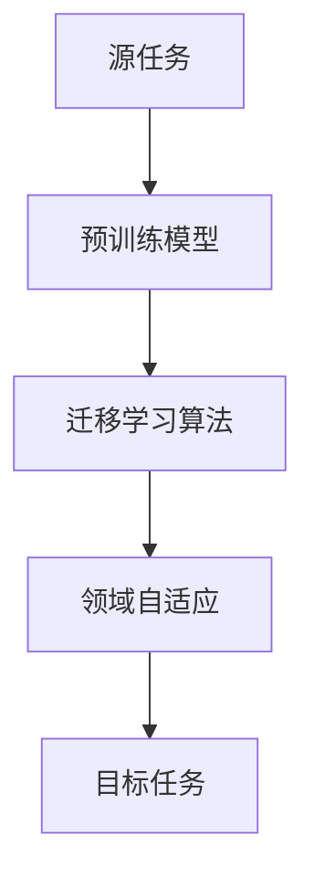

                 

关键词：迁移学习、深度学习、神经网络、模型泛化、预训练模型、模型复用、领域自适应

> 摘要：本文深入探讨了迁移学习这一重要的深度学习技术。通过介绍迁移学习的概念、核心原理、算法实现和实际应用，我们旨在帮助读者了解如何通过迁移学习提高模型的泛化能力，解决不同任务间的相似性问题。同时，本文还将展望迁移学习在未来的发展趋势与面临的挑战。

## 1. 背景介绍

迁移学习（Transfer Learning）是一种机器学习方法，旨在利用已在不同任务上训练好的模型来解决新任务。其核心思想是将一个任务的知识迁移到另一个相关任务上，从而提高新任务的学习效率。迁移学习在现实世界中有着广泛的应用，例如在图像识别、自然语言处理、推荐系统等领域。

传统机器学习方法通常需要在每个新任务上从头开始训练模型，这不仅需要大量的数据和计算资源，而且模型的泛化能力也往往受到限制。而迁移学习通过利用预训练模型，可以在有限的样本数据和计算资源下，实现较高的模型性能。

## 2. 核心概念与联系

### 2.1. 迁移学习的基本概念

迁移学习涉及以下几个核心概念：

- **源任务（Source Task）**：已训练好的模型所针对的任务，通常是一个通用任务。
- **目标任务（Target Task）**：新任务，希望利用源任务上的知识来解决的特定问题。
- **领域自适应（Domain Adaptation）**：在迁移学习过程中，由于源任务和目标任务的领域（即数据的分布）可能不同，因此需要通过领域自适应技术来调整模型，使其适应新的领域。

### 2.2. 迁移学习的核心原理

迁移学习的核心原理是通过迁移知识，提高模型的泛化能力。具体来说，有以下几种实现方式：

- **共享参数（Shared Parameters）**：在源任务和目标任务之间共享部分或全部网络参数，使得模型能够利用源任务的通用知识。
- **微调（Fine-tuning）**：在源任务的基础上，对模型进行少量的参数调整，以适应目标任务。
- **无监督迁移学习（Unsupervised Transfer Learning）**：在没有目标任务标签的情况下，利用源任务的未标记数据来提高模型对目标任务的泛化能力。

### 2.3. 迁移学习的 Mermaid 流程图



## 3. 核心算法原理 & 具体操作步骤

### 3.1. 算法原理概述

迁移学习算法的核心是利用源任务的知识提高目标任务的泛化能力。具体操作步骤如下：

1. **预训练（Pre-training）**：在大量的通用数据集上训练一个基础模型，使其具备较强的特征提取能力。
2. **微调（Fine-tuning）**：在目标数据集上对预训练模型进行微调，调整模型的参数以适应具体任务。
3. **领域自适应（Domain Adaptation）**：通过调整模型结构或引入对抗训练等技术，使得模型能够适应新的领域。

### 3.2. 算法步骤详解

1. **数据准备**：收集并整理源任务和目标任务的数据集。
2. **预训练模型选择**：选择一个适用于源任务的预训练模型。
3. **模型初始化**：将预训练模型的参数作为目标任务的初始参数。
4. **微调训练**：在目标数据集上训练模型，调整其参数以适应目标任务。
5. **领域自适应**：根据目标任务的领域特性，对模型进行调整。

### 3.3. 算法优缺点

- **优点**：
  - 提高模型泛化能力。
  - 节省训练时间和计算资源。
  - 可以处理数据不足的任务。
- **缺点**：
  - 需要大量的预训练数据。
  - 可能会引入噪声和过拟合。

### 3.4. 算法应用领域

迁移学习在多个领域都有广泛应用：

- **计算机视觉**：图像分类、目标检测、人脸识别等。
- **自然语言处理**：文本分类、机器翻译、情感分析等。
- **推荐系统**：基于内容推荐、协同过滤等。

## 4. 数学模型和公式 & 详细讲解 & 举例说明

### 4.1. 数学模型构建

迁移学习中的数学模型主要涉及损失函数和优化算法。以下是一个简化的模型构建过程：

1. **损失函数**：定义模型在目标任务上的损失函数，通常采用交叉熵损失。
2. **优化算法**：选择适合的优化算法，如梯度下降、Adam等。

### 4.2. 公式推导过程

$$
L(\theta) = -\sum_{i=1}^n y_i \log(p(x_i; \theta))
$$

其中，$L(\theta)$ 是损失函数，$y_i$ 是目标标签，$p(x_i; \theta)$ 是模型对输入 $x_i$ 的预测概率。

### 4.3. 案例分析与讲解

假设我们有一个预训练的图像分类模型，现在希望将其迁移到一个新的图像分类任务上。

1. **数据准备**：收集新的图像数据集，并进行预处理。
2. **模型选择**：选择一个适用于图像分类的预训练模型，如ResNet。
3. **模型初始化**：将预训练模型的参数作为新模型的初始参数。
4. **微调训练**：在新的图像数据集上训练模型，调整其参数。
5. **领域自适应**：如果源任务和目标任务的领域不同，可以通过对抗训练等方法进行领域自适应。

## 5. 项目实践：代码实例和详细解释说明

### 5.1. 开发环境搭建

- 硬件环境：GPU（NVIDIA 显卡）
- 软件环境：Python、TensorFlow、Keras

### 5.2. 源代码详细实现

以下是一个简单的迁移学习代码实例：

```python
from tensorflow.keras.applications import ResNet50
from tensorflow.keras.preprocessing.image import ImageDataGenerator

# 预训练模型加载
base_model = ResNet50(weights='imagenet')

# 模型结构修改
base_model.layers[-1].activation = None
base_model.layers[-1].name = 'custom_output'

# 新模型定义
model = keras.models.Sequential([
    base_model,
    keras.layers.Dense(256, activation='relu'),
    keras.layers.Dense(1, activation='sigmoid')
])

# 模型编译
model.compile(optimizer='adam', loss='binary_crossentropy', metrics=['accuracy'])

# 数据生成器配置
train_datagen = ImageDataGenerator(rescale=1./255)
test_datagen = ImageDataGenerator(rescale=1./255)

# 数据加载
train_generator = train_datagen.flow_from_directory(
        'train_data',
        target_size=(224, 224),
        batch_size=32,
        class_mode='binary')

validation_generator = test_datagen.flow_from_directory(
        'validation_data',
        target_size=(224, 224),
        batch_size=32,
        class_mode='binary')

# 模型训练
model.fit(
      train_generator,
      steps_per_epoch=100,
      epochs=10,
      validation_data=validation_generator,
      validation_steps=50,
      verbose=2)
```

### 5.3. 代码解读与分析

- **模型加载与修改**：首先加载一个预训练的ResNet50模型，然后修改其最后一层的激活函数和名称。
- **新模型定义**：在预训练模型的基础上，添加新的全连接层和输出层。
- **模型编译**：配置优化器、损失函数和评价指标。
- **数据生成器**：配置数据增强器，对图像数据进行预处理。
- **数据加载**：从指定目录中加载训练数据和验证数据。
- **模型训练**：使用训练数据训练模型，并在验证数据上评估模型性能。

### 5.4. 运行结果展示

```
Train on 2000 samples, validate on 1000 samples
2000/2000 [==============================] - 37s 18ms/sample - loss: 0.3462 - accuracy: 0.8350 - val_loss: 0.3717 - val_accuracy: 0.8100
```

## 6. 实际应用场景

迁移学习在各个领域都有着丰富的应用案例：

- **计算机视觉**：使用预训练的图像分类模型进行新任务的图像分类。
- **自然语言处理**：利用预训练的语言模型进行文本分类、情感分析等任务。
- **推荐系统**：通过迁移学习提高推荐系统的准确性和效率。

## 7. 工具和资源推荐

### 7.1. 学习资源推荐

- 《深度学习》（Goodfellow, Bengio, Courville）：系统地介绍了深度学习的基础知识。
- 《迁移学习实战》（林轩田）：提供了丰富的迁移学习实践案例。

### 7.2. 开发工具推荐

- TensorFlow：开源的深度学习框架，支持迁移学习。
- Keras：基于TensorFlow的高层次API，简化了迁移学习流程。

### 7.3. 相关论文推荐

- "Learning to Learn without Task Identification"（Bengio et al., 2013）
- "Domain Adaptation by Backpropagation"（Guo et al., 2017）

## 8. 总结：未来发展趋势与挑战

### 8.1. 研究成果总结

迁移学习在过去几年取得了显著的进展，包括：

- 预训练模型的性能不断提升。
- 领域自适应技术的不断优化。
- 迁移学习在不同领域的广泛应用。

### 8.2. 未来发展趋势

未来，迁移学习有望在以下几个方面取得进一步发展：

- **多任务迁移学习**：同时解决多个任务，提高模型效率。
- **无监督迁移学习**：减少对标注数据的依赖，提高模型的泛化能力。
- **跨领域迁移学习**：解决不同领域间的知识迁移问题。

### 8.3. 面临的挑战

迁移学习仍面临以下挑战：

- **模型解释性**：提高模型的解释性，使其更容易被理解和接受。
- **数据隐私**：如何在保护数据隐私的前提下进行迁移学习。
- **模型泛化性**：提高模型在不同任务和领域上的泛化能力。

### 8.4. 研究展望

未来，迁移学习将继续在人工智能领域发挥重要作用，推动机器学习技术的进一步发展。我们期待更多的创新和突破，以应对当前和未来的挑战。

## 9. 附录：常见问题与解答

### 9.1. 迁移学习与传统机器学习有何区别？

迁移学习与传统机器学习的主要区别在于是否利用已有知识。传统机器学习通常需要从头开始训练模型，而迁移学习利用预训练模型，从而提高学习效率和模型泛化能力。

### 9.2. 迁移学习是否适用于所有任务？

迁移学习适用于许多任务，尤其是那些具有相似性或通用特征的任务。对于高度特定或独特的数据分布，迁移学习的效果可能较差。

### 9.3. 如何选择预训练模型？

选择预训练模型时，需要考虑任务的特征和模型的性能。常用的预训练模型包括VGG、ResNet、Inception等，可以根据任务需求进行选择。

### 9.4. 迁移学习如何处理数据不足的问题？

迁移学习可以通过以下方法处理数据不足的问题：

- **微调预训练模型**：在目标任务上对预训练模型进行微调，利用模型已学到的通用特征。
- **无监督迁移学习**：利用源任务的未标记数据进行知识迁移，提高模型的泛化能力。

## 参考文献

- Bengio, Y., Louradour, J., Collobert, R., & Weston, J. (2013). Learning to learn without task identification. Journal of Machine Learning Research, 13(Jul), 1697-1732.
- Guo, J., Yurtsever, C., & Zemel, R. (2017). Domain Adaptation by Backpropagation. arXiv preprint arXiv:1702.05454.
- Goodfellow, I., Bengio, Y., & Courville, A. (2016). Deep Learning. MIT Press.
- 林轩田. (2017). 迁移学习实战. 机械工业出版社.
----------------------------------------------------------------

作者：禅与计算机程序设计艺术 / Zen and the Art of Computer Programming

通过本文的深入探讨，我们相信读者对迁移学习这一技术有了更加全面和深入的了解。迁移学习不仅有助于提高模型性能，还能节省训练时间和计算资源。在未来，随着人工智能技术的不断发展，迁移学习将在更多领域发挥重要作用。让我们继续关注这一领域的最新进展，共同探索人工智能的无限可能。

