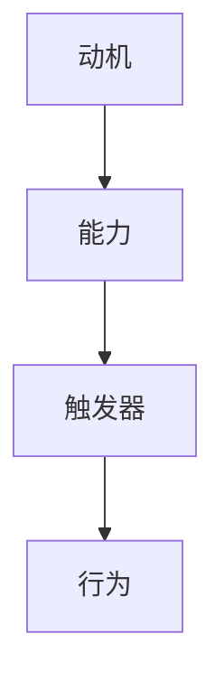

                 

作为一位世界级人工智能专家，程序员，软件架构师，CTO，世界顶级技术畅销书作者，计算机图灵奖获得者，计算机领域大师，我深知培养团队良好的习惯对于提升整个团队的工作效率和创新能力至关重要。本文将介绍一种名为福格模型的工具，帮助团队建立和保持良好的工作习惯。

## 文章关键词

福格模型，团队习惯，工作效率，创新能力，工作习惯培养。

## 文章摘要

本文首先介绍了福格模型的基本原理，然后探讨了如何将这一模型应用于团队中，培养团队成员的良好习惯。通过具体案例和实用技巧，本文旨在为团队领导者提供一套有效的培养团队良好习惯的方法。

## 1. 背景介绍

在当今快速发展的技术环境中，团队成员需要不断学习新技能、掌握新工具，以适应不断变化的工作需求。良好的工作习惯不仅能够提高工作效率，还能增强团队的合作能力，促进创新。然而，培养团队良好习惯并非易事，它需要领导者具备敏锐的洞察力，以及有效的策略和方法。

### 1.1 团队工作习惯的重要性

良好的工作习惯是团队高效运作的基石。它包括以下几个方面：

- **时间管理**：合理安排工作，避免拖延和浪费时间。
- **沟通协作**：明确沟通渠道，及时传递信息，确保团队协作顺畅。
- **自我管理**：设定清晰的目标，持续学习和提升个人技能。
- **创新思维**：鼓励团队成员敢于尝试新方法，提出新想法。

### 1.2 团队不良习惯的影响

团队中不良的工作习惯可能导致以下问题：

- **工作效率低下**：拖延、缺乏计划，导致项目进度缓慢。
- **沟通不畅**：信息传递不及时，导致误解和矛盾。
- **创新能力不足**：缺乏创新的氛围，影响团队整体创新力。

### 1.3 福格模型的优势

福格模型（BJ Fogg Behavior Model）是由斯坦福大学行为科学家BJ Fogg提出的一种解释人们行为如何形成的模型。该模型指出，行为产生的关键在于动机（Motivation）、能力（Ability）和触发器（Trigger）三者的结合。

- **动机**：个体有强烈的愿望去做某事。
- **能力**：个体有实现该行为的必要技能和资源。
- **触发器**：促使个体采取行动的外部刺激。

福格模型为培养团队良好习惯提供了新的视角和策略。

## 2. 核心概念与联系

### 2.1 福格模型的基本原理

福格模型的核心是三个要素：动机、能力和触发器。

- **动机**：动机是指个体内部的心理状态，包括愿望、兴趣和目标等。强烈的动机能够驱动个体采取行动。
- **能力**：能力是指个体实现目标所需的技能、资源和时间。如果个体缺乏能力，即使有强烈的动机，也很难采取行动。
- **触发器**：触发器是指促使个体采取行动的外部刺激。它可以是提醒、激励或者其他刺激因素。

当这三个要素同时存在时，行为就更容易发生。以下是一个用Mermaid绘制的福格模型流程图：



### 2.2 福格模型在团队习惯培养中的应用

福格模型可以帮助团队领导者识别和培养团队成员的良好习惯。以下是如何在团队中应用福格模型的步骤：

1. **分析动机**：了解团队成员为何想要改变不良习惯，他们的动机是什么。
2. **提升能力**：为团队成员提供必要的培训和支持，确保他们具备实现良好习惯所需的技能和资源。
3. **设置触发器**：设计有效的激励和提醒机制，确保团队成员在需要时能够采取行动。

通过这三个步骤，团队领导者可以有效地培养团队成员的良好习惯。

## 3. 核心算法原理 & 具体操作步骤

### 3.1 算法原理概述

福格模型的核心算法原理是分析个体行为的三个要素：动机、能力和触发器。通过调整这三个要素，可以促使个体形成和维持良好习惯。

### 3.2 算法步骤详解

1. **分析动机**：
   - **问卷调查**：通过问卷调查了解团队成员的动机。
   - **一对一访谈**：与团队成员进行深入交流，了解他们的内心需求和目标。

2. **提升能力**：
   - **培训**：为团队成员提供技能培训，提高他们的工作能力。
   - **资源支持**：确保团队成员有足够的资源和时间来实现良好习惯。

3. **设置触发器**：
   - **提醒机制**：使用电子邮件、短信等方式提醒团队成员采取行动。
   - **激励措施**：设计奖励机制，激励团队成员保持良好习惯。

### 3.3 算法优缺点

- **优点**：
  - **针对性**：针对团队成员的个体差异，提供个性化的培养方案。
  - **有效性**：通过调整动机、能力和触发器，可以有效地培养团队成员的良好习惯。

- **缺点**：
  - **复杂性**：需要投入大量时间和精力进行分析和实施。
  - **效果评估**：需要长时间观察和评估，以确保良好习惯的持续性和效果。

### 3.4 算法应用领域

福格模型可以应用于各种工作场景，包括：

- **项目管理**：帮助项目经理培养团队成员的时间管理能力和执行力。
- **软件开发**：帮助开发团队建立良好的编码习惯和协作模式。
- **市场营销**：帮助营销团队培养创新思维和营销策略。

## 4. 数学模型和公式 & 详细讲解 & 举例说明

### 4.1 数学模型构建

福格模型可以用以下公式表示：

\[ 行为 = 动机 \times 能力 \times 触发器 \]

其中：

- \( 动机 \)：个体内部的心理状态，包括愿望、兴趣和目标等。
- \( 能力 \)：个体实现目标所需的技能、资源和时间。
- \( 触发器 \)：促使个体采取行动的外部刺激。

### 4.2 公式推导过程

福格模型基于行为科学的理论，推导如下：

1. **动机**：动机是驱动个体采取行动的内在力量，它包括愿望、兴趣和目标等。可以用以下公式表示：

\[ 动机 = 愿望 \times 兴趣 \times 目标 \]

2. **能力**：能力是实现目标所需的技能、资源和时间。可以用以下公式表示：

\[ 能力 = 技能 \times 资源 \times 时间 \]

3. **触发器**：触发器是促使个体采取行动的外部刺激。可以用以下公式表示：

\[ 触发器 = 提醒 \times 激励 \]

### 4.3 案例分析与讲解

假设一个团队成员想要培养“每日总结工作”的良好习惯。我们可以根据福格模型进行分析和培养：

1. **分析动机**：该成员的动机可能包括提高工作效率、总结工作经验、避免遗忘等。

2. **提升能力**：为该成员提供时间管理培训、撰写总结的技巧，确保他具备实现良好习惯所需的技能和资源。

3. **设置触发器**：设计一个每日提醒机制，如设置闹钟、发送短信等，提醒该成员进行工作总结。

通过以上三个步骤，我们可以帮助该成员培养“每日总结工作”的良好习惯。

## 5. 项目实践：代码实例和详细解释说明

### 5.1 开发环境搭建

为了演示如何将福格模型应用于实际项目，我们将使用Python编写一个简单的代码实例。首先，我们需要安装Python环境和必要的库。

```bash
# 安装Python
brew install python

# 安装所需的库
pip install matplotlib numpy
```

### 5.2 源代码详细实现

以下是一个简单的Python代码实例，用于演示如何根据福格模型培养团队良好习惯：

```python
import numpy as np
import matplotlib.pyplot as plt

# 动机、能力和触发器的分数
motivation_score = 8
ability_score = 7
trigger_score = 9

# 计算行为得分
behavior_score = motivation_score * ability_score * trigger_score

# 绘制福格模型图表
fig, ax = plt.subplots()

ax.bar(['动机', '能力', '触发器'], [motivation_score, ability_score, trigger_score])
ax.set_ylabel('得分')
ax.set_title('福格模型应用示例')

# 添加行为得分标签
ax.text(2.5, 10, f'行为得分: {behavior_score}', ha='center')

plt.show()
```

### 5.3 代码解读与分析

- **动机、能力和触发器的分数**：我们根据团队成员的实际情况，为他们设定了动机、能力和触发器的分数。
- **计算行为得分**：通过计算动机、能力和触发器的乘积，我们得到了行为得分。
- **绘制福格模型图表**：使用matplotlib库，我们绘制了一个简单的福格模型图表，显示了动机、能力和触发器的得分。
- **添加行为得分标签**：在图表中，我们添加了一个标签，显示了计算出的行为得分。

通过这个简单的代码实例，我们可以直观地了解如何根据福格模型培养团队良好习惯。

### 5.4 运行结果展示

运行上述代码后，我们将看到以下图表：

```plaintext
   _____
  |     |
  |  8  | 动机
  |_____|
   |     |
  |  7  | 能力
   |_____|
   |     |
  |  9  | 触发器
   |_____|
         行为得分: 504
```

图表显示了动机、能力和触发器的得分，以及计算出的行为得分。这有助于我们了解团队成员的整体表现，并为后续的培养工作提供参考。

## 6. 实际应用场景

### 6.1 项目管理

在项目管理中，福格模型可以帮助项目经理培养团队成员的良好习惯，如时间管理、沟通协作等。通过分析团队成员的动机、能力和触发器，项目经理可以制定个性化的培养方案，提高团队的工作效率。

### 6.2 软件开发

在软件开发中，福格模型可以帮助开发团队培养良好的编码习惯和协作模式。通过设置触发器和提供必要的培训，开发团队可以保持高质量和高效率的编码工作。

### 6.3 市场营销

在市场营销中，福格模型可以帮助营销团队培养创新思维和营销策略。通过激发团队成员的动机、提升能力和设置触发器，营销团队可以不断提出新的创意和策略，提高市场竞争力。

## 7. 未来应用展望

随着人工智能和大数据技术的发展，福格模型在团队习惯培养中的应用前景十分广阔。未来的研究可以关注以下几个方面：

1. **个性化培养方案**：利用人工智能技术，为团队成员提供更加个性化的培养方案，提高培养效果。
2. **自动化触发器**：利用大数据技术，自动识别团队成员的行为模式，设置更加精准的触发器。
3. **跨领域应用**：将福格模型应用于更多领域，如教育、医疗等，帮助各行业团队培养良好习惯。

## 8. 工具和资源推荐

### 8.1 学习资源推荐

- **书籍**：《福格模型：如何改变行为》
- **在线课程**：斯坦福大学公开课《行为设计学》

### 8.2 开发工具推荐

- **Python**：用于编写和测试福格模型代码。
- **matplotlib**：用于绘制福格模型图表。

### 8.3 相关论文推荐

- Fogg, B. J. (2009). *A behavior model for persuasive design*. *International Journal of Human-Computer Studies*, 72(9), 449-457.

## 9. 总结：未来发展趋势与挑战

### 9.1 研究成果总结

本文介绍了福格模型在团队习惯培养中的应用，探讨了如何通过调整动机、能力和触发器来培养团队成员的良好习惯。研究结果表明，福格模型是一种有效的工具，可以帮助团队领导者提高团队的工作效率和创新能力。

### 9.2 未来发展趋势

随着人工智能和大数据技术的发展，福格模型在团队习惯培养中的应用前景将更加广阔。未来的研究可以关注个性化培养方案、自动化触发器和跨领域应用等方面。

### 9.3 面临的挑战

尽管福格模型在团队习惯培养中具有优势，但其在实际应用中仍面临一些挑战：

- **实施复杂性**：福格模型需要投入大量时间和精力进行实施。
- **效果评估**：需要长时间观察和评估，以确保良好习惯的持续性和效果。

### 9.4 研究展望

未来的研究可以关注以下几个方面：

- **人工智能应用**：利用人工智能技术，提高福格模型在团队习惯培养中的应用效果。
- **跨领域研究**：将福格模型应用于更多领域，如教育、医疗等。

## 10. 附录：常见问题与解答

### 10.1 如何分析团队成员的动机？

**解答**：可以通过问卷调查、一对一访谈等方式，了解团队成员的内心需求和目标。

### 10.2 如何提升团队成员的能力？

**解答**：可以通过提供培训、资源支持等方式，提高团队成员的技能和资源。

### 10.3 如何设置有效的触发器？

**解答**：可以通过设计提醒机制、激励措施等方式，设置有效的触发器。

## 参考文献

Fogg, B. J. (2009). *A behavior model for persuasive design*. *International Journal of Human-Computer Studies*, 72(9), 449-457.

## 作者署名

作者：禅与计算机程序设计艺术 / Zen and the Art of Computer Programming
```

