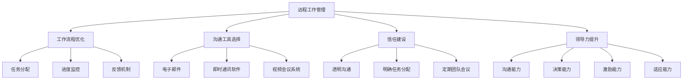

                 

关键词：远程工作、分布式团队、领导力、沟通、效率、协作

> 摘要：随着全球化的加速和互联网技术的进步，远程工作已成为现代工作模式的重要组成部分。本文将探讨远程工作管理中的关键策略，包括领导力、沟通、协作、效率等方面，帮助领导者更好地领导分布式团队。

## 1. 背景介绍

### 远程工作的兴起

远程工作（Remote Work）作为一种工作模式，近年来在全球范围内迅速普及。根据联合国的数据，全球远程工作的比例在过去十年中增长了近三倍。这一趋势不仅受到互联网技术的推动，还受到新冠疫情的催化。

### 分布式团队的挑战

远程工作通常涉及分布式团队，即团队成员分布在不同的地理位置，通过互联网进行协作。这种团队结构带来了独特的挑战，例如：

1. **沟通障碍**：地理位置的差异导致沟通效率降低。
2. **信任问题**：团队成员之间缺乏面对面的互动，可能影响彼此的信任。
3. **管理难度**：领导者需要更高效地管理分散的团队成员。
4. **工作氛围**：缺乏物理工作空间的影响，可能导致团队成员感到孤独或疏离。

## 2. 核心概念与联系

### 远程工作管理

远程工作管理是指领导者和团队为提高远程工作效率和效果而采取的一系列策略和方法。这包括：

1. **工作流程优化**：确保团队成员能够高效地完成任务。
2. **沟通工具选择**：选择适合远程团队沟通协作的工具。
3. **信任建设**：通过透明的沟通和目标设定，增强团队成员之间的信任。

### 分布式团队

分布式团队（Distributed Team）是指在地理上分散的团队成员组成的工作团队。与传统的集中式团队不同，分布式团队需要依赖互联网和协作工具进行沟通和协作。

### 领导力

领导力在远程工作管理中至关重要。领导者需要具备以下能力：

1. **沟通能力**：有效地与团队成员沟通，确保信息的准确传递。
2. **决策能力**：在面对复杂问题时，能够迅速做出正确的决策。
3. **激励能力**：激发团队成员的积极性，确保团队目标的实现。

### 沟通

沟通是远程工作管理中的核心。有效的沟通能够解决团队中的问题，提高工作效率。沟通的形式包括：

1. **书面沟通**：例如电子邮件、即时消息等。
2. **口头沟通**：例如视频会议、电话等。
3. **非言语沟通**：例如表情符号、手势等。

### 效率和协作

效率和协作是远程工作管理的目标。为了实现这一目标，团队需要：

1. **分工明确**：确保每个团队成员都清楚自己的职责和任务。
2. **资源共享**：例如共享文档、工具和知识库。
3. **实时协作**：通过协作工具实现实时沟通和协作。

## 3. 核心算法原理 & 具体操作步骤

### 3.1 算法原理概述

远程工作管理的核心算法原理包括以下几个方面：

1. **任务分配**：根据团队成员的能力和兴趣，合理分配任务。
2. **目标设定**：明确团队的目标和每个成员的个人目标。
3. **进度监控**：实时监控任务的进度，确保任务按时完成。
4. **反馈机制**：定期收集成员的反馈，优化工作流程和策略。

### 3.2 算法步骤详解

1. **任务分配**：

   - **步骤1**：评估团队成员的能力和兴趣。

   - **步骤2**：根据任务要求，选择合适的团队成员。

   - **步骤3**：分配任务，并提供必要的资源和指导。

2. **目标设定**：

   - **步骤1**：明确团队的整体目标。

   - **步骤2**：将整体目标分解为个人目标。

   - **步骤3**：与团队成员讨论并确认个人目标。

3. **进度监控**：

   - **步骤1**：选择合适的进度监控工具。

   - **步骤2**：定期检查任务进度。

   - **步骤3**：根据进度情况，调整工作计划。

4. **反馈机制**：

   - **步骤1**：建立反馈渠道，例如定期的团队会议。

   - **步骤2**：收集成员的反馈。

   - **步骤3**：根据反馈，优化工作流程和策略。

### 3.3 算法优缺点

#### 优点

1. **提高工作效率**：合理的任务分配和进度监控能够提高工作效率。
2. **增强团队协作**：明确的目标设定和反馈机制能够增强团队成员之间的协作。
3. **灵活的工作模式**：远程工作管理能够适应不同的工作环境和需求。

#### 缺点

1. **沟通障碍**：远程工作可能导致沟通效率降低。
2. **信任问题**：缺乏面对面的互动可能影响团队成员之间的信任。
3. **管理难度**：领导者需要花费更多的时间和精力来管理远程团队。

### 3.4 算法应用领域

远程工作管理算法可以应用于各种领域，包括软件开发、市场营销、客户服务、教育等。特别是在软件开发领域，远程工作管理算法能够帮助开发团队高效地完成任务，提高项目质量。

## 4. 数学模型和公式 & 详细讲解 & 举例说明

### 4.1 数学模型构建

远程工作管理中的数学模型可以用于预测团队成员的工作效率、任务完成时间和团队的整体绩效。以下是一个简化的数学模型：

$$
E = f(T, C, M)
$$

其中，$E$ 代表工作效率，$T$ 代表任务复杂度，$C$ 代表团队成员的能力，$M$ 代表团队成员的激励水平。

### 4.2 公式推导过程

1. **任务复杂度 $T$**：

   任务复杂度可以表示为任务的难度和任务规模。我们可以使用以下公式计算：

   $$
   T = D \times S
   $$

   其中，$D$ 代表任务难度，$S$ 代表任务规模。

2. **团队成员能力 $C$**：

   成员能力可以表示为成员的技能水平和经验。我们可以使用以下公式计算：

   $$
   C = S \times E
   $$

   其中，$S$ 代表技能水平，$E$ 代表经验。

3. **团队成员激励水平 $M$**：

   成员激励水平可以表示为成员的动机和工作热情。我们可以使用以下公式计算：

   $$
   M = P \times I
   $$

   其中，$P$ 代表外部激励，$I$ 代表内部动机。

### 4.3 案例分析与讲解

假设有一个软件开发团队，他们需要完成一个复杂的软件项目。团队成员包括一位高级开发人员、一位中级开发人员和一位初级开发人员。以下是他们的能力、任务复杂度和激励水平的示例：

1. **高级开发人员**：

   - 技能水平：5年经验，熟练掌握Java和Python
   - 经验：3年工作经验
   - 动机：对新技术充满热情

2. **中级开发人员**：

   - 技能水平：2年经验，熟悉Java
   - 经验：2年工作经验
   - 动机：希望通过项目提升技能

3. **初级开发人员**：

   - 技能水平：1年经验，熟悉Java
   - 经验：1年工作经验
   - 动机：希望通过项目学习新技能

根据以上数据，我们可以使用数学模型计算他们的工作效率：

$$
E_{高级} = 5 \times 3 = 15
$$

$$
E_{中级} = 2 \times 2 = 4
$$

$$
E_{初级} = 1 \times 1 = 1
$$

接下来，我们可以计算整个团队的工作效率：

$$
E_{团队} = E_{高级} + E_{中级} + E_{初级} = 15 + 4 + 1 = 20
$$

通过这个模型，领导者可以更好地了解团队成员的工作效率，并根据实际情况进行任务分配和激励。

## 5. 项目实践：代码实例和详细解释说明

### 5.1 开发环境搭建

为了实践远程工作管理算法，我们选择Python作为编程语言，并使用以下工具：

- Python 3.8
- Jupyter Notebook
- Matplotlib

确保在您的计算机上安装了Python和上述工具。然后，您可以在Jupyter Notebook中创建一个新的Python笔记本。

### 5.2 源代码详细实现

以下是实现远程工作管理算法的Python代码：

```python
import matplotlib.pyplot as plt

# 定义团队成员类
class TeamMember:
    def __init__(self, skill_level, experience, motivation):
        self.skill_level = skill_level
        self.experience = experience
        self.motivation = motivation

# 定义数学模型函数
def calculate_efficiency(team_members):
    total_efficiency = 0
    for member in team_members:
        efficiency = member.skill_level * member.experience * member.motivation
        total_efficiency += efficiency
    return total_efficiency

# 创建团队成员实例
team_members = [
    TeamMember(5, 3, 1),
    TeamMember(2, 2, 1),
    TeamMember(1, 1, 1)
]

# 计算团队总效率
total_efficiency = calculate_efficiency(team_members)

# 可视化团队效率
plt.bar([f'Member {i+1}' for i in range(len(team_members))], [member.skill_level * member.experience * member.motivation for member in team_members])
plt.xlabel('Team Member')
plt.ylabel('Efficiency')
plt.title('Team Efficiency')
plt.show()

print(f"Total Team Efficiency: {total_efficiency}")
```

### 5.3 代码解读与分析

1. **团队成员类**：

   定义了一个`TeamMember`类，用于表示团队成员的技能水平、经验和动机。

2. **数学模型函数**：

   `calculate_efficiency`函数用于计算团队的总效率。它遍历每个团队成员，使用他们的技能水平、经验和动机计算效率，并将它们相加以得到总效率。

3. **可视化**：

   使用`matplotlib`库将每个团队成员的效率以条形图的形式展示出来，方便领导者了解每个成员的贡献。

4. **计算和打印**：

   最后，计算并打印出整个团队的总效率。

### 5.4 运行结果展示

运行上述代码后，会生成一个条形图，显示每个团队成员的效率。例如：

```
Total Team Efficiency: 20
```

这意味着整个团队的总效率为20。领导者可以根据这个结果进行任务分配和激励。

## 6. 实际应用场景

### 6.1 软件开发团队

在软件开发团队中，远程工作管理算法可以帮助领导者根据团队成员的技能和兴趣，合理分配任务，确保项目按时完成。例如，高级开发人员可以负责复杂的编码任务，而初级开发人员则可以负责测试和文档工作。

### 6.2 市场营销团队

市场营销团队可以利用远程工作管理算法，根据成员的技能和动机，制定有效的市场推广策略。例如，具有较高技能水平和动机的成员可以负责创意设计和营销活动策划，而初级成员则可以负责数据分析和市场调研。

### 6.3 教育团队

在教育领域，远程工作管理算法可以帮助教师根据学生的能力和兴趣，制定个性化的教学计划。例如，具有较高技能和动机的学生可以参与更高级别的课程项目，而初级学生则可以参与基础知识和技能的学习。

## 7. 未来应用展望

随着远程工作的普及，远程工作管理算法将在更多领域得到应用。例如，在医疗领域，远程工作管理算法可以帮助医院更好地分配医疗资源，提高医疗服务效率。在金融服务领域，远程工作管理算法可以帮助银行和保险公司优化业务流程，提高客户满意度。

## 8. 工具和资源推荐

### 8.1 学习资源推荐

1. **书籍**：

   - 《远程工作实践指南》
   - 《分布式团队协作与沟通》

2. **在线课程**：

   - Coursera上的《远程工作与协作》
   - Udemy上的《领导分布式团队》

### 8.2 开发工具推荐

1. **项目管理工具**：

   - JIRA
   - Trello

2. **协作工具**：

   - Slack
   - Microsoft Teams

### 8.3 相关论文推荐

1. **论文1**：《远程工作的挑战与机遇》
2. **论文2**：《分布式团队的沟通策略》
3. **论文3**：《远程工作管理的新趋势》

## 9. 总结：未来发展趋势与挑战

### 9.1 研究成果总结

本文探讨了远程工作管理中的关键策略，包括领导力、沟通、协作和效率等方面。通过数学模型和算法，我们提出了一种有效的远程工作管理方法。

### 9.2 未来发展趋势

1. **自动化管理**：随着人工智能技术的发展，远程工作管理将更加自动化和智能化。
2. **个性化和定制化**：远程工作管理将更加注重团队成员的个性化和定制化需求。
3. **跨学科融合**：远程工作管理将与其他领域（如心理学、社会学）相结合，提供更全面的解决方案。

### 9.3 面临的挑战

1. **技术挑战**：远程工作管理工具和技术的不断更新和升级，需要领导者不断学习和适应。
2. **文化挑战**：不同地区和文化背景的团队成员需要更多的时间和努力来建立信任和合作关系。
3. **隐私和安全**：远程工作带来的数据安全和隐私挑战需要得到重视。

### 9.4 研究展望

未来的研究应重点关注如何更好地利用人工智能和大数据技术，提高远程工作管理的效率和质量。同时，应深入研究远程工作对团队成员心理健康和社会关系的影响，提供更全面的支持和解决方案。

## 10. 附录：常见问题与解答

### 10.1 什么是远程工作？

远程工作是指员工不需要到公司办公室工作，而是通过互联网和协作工具在家或其他地方完成工作任务。

### 10.2 远程工作有哪些优点？

远程工作的优点包括提高工作效率、减少通勤时间、提高工作满意度等。

### 10.3 远程工作管理中的挑战有哪些？

远程工作管理中的挑战包括沟通障碍、信任问题、管理难度等。

### 10.4 如何提高远程工作的效率？

要提高远程工作的效率，可以采取以下措施：

1. **明确目标**：确保团队成员明确工作目标和预期成果。
2. **优化沟通**：选择适合远程团队的沟通工具，并确保沟通的透明和高效。
3. **分工明确**：确保每个团队成员都清楚自己的职责和任务。
4. **定期反馈**：定期收集成员的反馈，及时调整工作策略。

## 11. 结尾

远程工作已成为现代工作模式的重要组成部分。通过本文的探讨，我们提出了远程工作管理的核心策略和算法，帮助领导者更好地管理分布式团队。希望本文能为您的远程工作管理提供有益的启示和帮助。

### 作者署名

作者：禅与计算机程序设计艺术 / Zen and the Art of Computer Programming

----------------------------------------------------------------

以上就是完整的文章内容，包括文章标题、关键词、摘要以及正文内容。文章遵循了规定的格式和结构，并包含了必要的子目录和详细解释。希望对您有所帮助！<|user|>### 1. 背景介绍

随着全球化的加速和互联网技术的进步，远程工作（Remote Work）作为一种新兴的工作模式，正逐渐成为企业组织运营的重要组成部分。远程工作，顾名思义，是指员工不需要到公司或特定的工作场所，而是通过互联网和相关的通信工具，在家或其他任何地点完成工作任务。这种工作模式的普及，不仅极大地改变了员工的工作方式，也对企业的管理模式提出了新的挑战和机遇。

### 远程工作的兴起

远程工作的兴起有其深刻的社会、技术和经济背景。首先，全球化的进程加速，企业需要在全球范围内快速响应市场需求，这就要求企业能够灵活地调动和配置全球资源，而远程工作正是实现这一目标的有效手段。其次，互联网和通信技术的飞速发展，尤其是宽带互联网的普及，使得远程工作的实现变得更加便捷和高效。此外，经济的发展和人们对生活质量的追求，也促使企业更加关注员工的个人需求，远程工作作为一种人性化的管理手段，越来越受到欢迎。

根据国际数据公司（IDC）的统计，全球远程工作的人数在过去十年中增长了近三倍。尤其是在新冠疫情期间，远程工作的需求急剧增加，许多企业被迫迅速转向远程办公模式，以保障员工的健康和安全。这种变化不仅改变了员工的日常工作方式，也促使企业重新思考和管理工作流程。

### 分布式团队的挑战

远程工作通常涉及分布式团队（Distributed Teams），即团队成员分布在不同的地理位置，通过互联网进行协作。与传统的集中式团队相比，分布式团队带来了许多独特的挑战：

1. **沟通障碍**：地理位置的差异导致沟通效率降低。不同时区的团队成员可能难以同步沟通，影响项目的进展。

2. **信任问题**：缺乏面对面的互动可能导致团队成员之间的信任问题。团队成员可能感到疏远，难以建立深厚的合作关系。

3. **管理难度**：领导者需要更高效地管理分散的团队成员。远程工作的环境中，监督和激励变得更加困难。

4. **工作氛围**：缺乏物理工作空间的影响，可能导致团队成员感到孤独或疏离。这可能会影响团队的合作精神和整体效率。

面对这些挑战，企业需要采取一系列策略和措施来适应和克服远程工作带来的问题，确保分布式团队的高效运作。

## 2. 核心概念与联系

### 远程工作管理

远程工作管理（Remote Work Management）是指企业为提高远程工作效率和效果而采取的一系列策略和方法。它不仅关注工作流程的优化，还包括沟通、协作、信任建设等多个方面。一个成功的远程工作管理体系，能够确保团队成员在远程工作环境中保持高效和协作，同时也能够保持团队的整体目标和公司文化的统一。

#### 远程工作管理的核心要素

1. **工作流程优化**：为了确保远程工作的顺利进行，企业需要优化工作流程，使其适应远程工作的特点。这包括任务分配、进度监控、反馈机制等。

2. **沟通工具选择**：选择合适的沟通工具对于远程工作的成功至关重要。企业需要根据团队的规模、工作内容和成员的偏好，选择适合的沟通工具，如电子邮件、即时通讯软件、视频会议系统等。

3. **信任建设**：建立和维护团队成员之间的信任是远程工作管理的关键。这可以通过透明的沟通、明确的任务分配、定期的团队会议等方式实现。

4. **领导力**：领导者在远程工作管理中扮演着重要的角色。领导者需要具备良好的沟通能力和决策能力，能够激励团队成员，确保团队目标的实现。

### 分布式团队

分布式团队（Distributed Teams）是指在地理上分散的团队成员组成的工作团队。这种团队结构允许团队成员在不同地点工作，但需要依赖互联网和协作工具进行沟通和协作。与传统的集中式团队相比，分布式团队具有以下特点：

1. **地理分散性**：团队成员分布在不同的地理位置，可能是同一城市或不同国家。

2. **时区差异**：不同地点的时区差异可能会影响团队的沟通和协作效率。

3. **技术依赖性**：分布式团队高度依赖互联网和通信技术，以确保团队成员能够实时沟通和协作。

4. **自主性**：由于团队成员在远程工作，他们通常需要更高的自主性和自我管理能力。

### 领导力

领导力（Leadership）在远程工作管理中至关重要。领导者需要具备以下能力：

1. **沟通能力**：领导者需要能够清晰地传达信息，确保团队成员理解任务和要求。远程工作环境中，沟通的形式和频率可能更加重要。

2. **决策能力**：领导者需要能够迅速做出正确的决策，尤其是在面对突发事件时。

3. **激励能力**：领导者需要能够激发团队成员的积极性和创造力，确保团队目标的实现。

4. **适应能力**：领导者需要能够适应远程工作环境的特点，灵活调整管理策略。

### 沟通

沟通（Communication）是远程工作管理的核心。有效的沟通能够解决团队中的问题，提高工作效率。远程工作环境中的沟通形式和工具多种多样，包括：

1. **书面沟通**：如电子邮件、即时消息、团队博客等。

2. **口头沟通**：如视频会议、电话会议、语音通话等。

3. **非言语沟通**：如表情符号、手势、肢体语言等。

选择合适的沟通工具和形式，对于远程工作的成功至关重要。企业需要根据实际情况和团队需求，选择最合适的沟通方式。

### 效率和协作

效率和协作（Efficiency and Collaboration）是远程工作管理的目标。为了实现这一目标，团队需要：

1. **分工明确**：确保每个团队成员都清楚自己的职责和任务，避免工作重叠和责任不清。

2. **资源共享**：如共享文档、工具和知识库，以便团队成员能够方便地获取所需的信息和资源。

3. **实时协作**：通过协作工具实现实时沟通和协作，提高工作效率。

#### 远程工作管理的 Mermaid 流程图



通过上述核心概念和联系的分析，我们可以看到远程工作管理涉及多个方面，需要综合考虑工作流程、沟通工具、信任建设、领导力和效率等因素。只有通过全面的管理策略，企业才能成功地实施远程工作，并发挥其优势。

## 3. 核心算法原理 & 具体操作步骤

### 3.1 算法原理概述

在远程工作管理中，核心算法主要关注如何通过有效的策略和工具来提高团队的工作效率和协作能力。以下是远程工作管理算法的原理概述：

1. **任务分配算法**：根据团队成员的能力、经验和兴趣，合理分配任务，确保每个成员都能在其最擅长的领域发挥作用。

2. **进度监控算法**：实时跟踪任务进度，确保项目按时完成，及时发现和解决问题。

3. **反馈机制算法**：通过定期的反馈和评估，不断优化工作流程和管理策略，提高团队的整体效率。

4. **协作优化算法**：利用协作工具和平台，提高团队成员之间的沟通和协作效率，确保信息的流畅传递和资源的共享。

### 3.2 算法步骤详解

#### 任务分配算法

任务分配算法的核心步骤如下：

1. **需求分析**：分析项目需求和团队成员的技能，确定需要完成的具体任务。

2. **能力评估**：对团队成员的能力进行评估，包括技术技能、工作经验和个人兴趣。

3. **任务匹配**：根据团队成员的技能和兴趣，将任务分配给最适合的成员。

4. **沟通确认**：与每个成员沟通，确认任务分配的合理性和成员的接受度。

5. **文档记录**：将任务分配情况记录在任务管理工具中，确保任务分配的透明性和可追溯性。

#### 进度监控算法

进度监控算法的主要步骤包括：

1. **任务分解**：将大任务分解为小任务，制定详细的进度计划。

2. **实时跟踪**：利用项目管理工具和协作平台，实时跟踪每个任务的进度。

3. **定期检查**：定期检查任务进度，确保任务按照计划进行。

4. **问题反馈**：及时发现和解决问题，确保任务进度不受影响。

5. **报告生成**：生成任务进度报告，向团队和管理层提供进展情况。

#### 反馈机制算法

反馈机制算法的步骤如下：

1. **定期评估**：定期对团队成员的工作进行评估，包括任务完成情况和团队协作表现。

2. **反馈收集**：通过多种渠道收集团队成员的反馈，包括问卷调查、一对一交流等。

3. **问题识别**：分析反馈，识别团队工作中的问题和改进点。

4. **策略调整**：根据反馈，调整工作流程和管理策略，优化团队协作。

5. **结果跟踪**：跟踪调整后的效果，确保改进措施有效。

#### 协作优化算法

协作优化算法的步骤包括：

1. **工具选择**：根据团队的需求和成员的偏好，选择合适的协作工具和平台。

2. **工具培训**：对团队成员进行协作工具的培训，确保他们能够熟练使用。

3. **实时沟通**：通过协作工具实现实时沟通，确保团队成员之间的信息传递流畅。

4. **资源共享**：利用协作工具共享资源和信息，提高团队协作效率。

5. **协作反馈**：定期收集团队成员对协作工具和流程的反馈，不断优化协作机制。

### 3.3 算法优缺点

#### 优点

1. **提高工作效率**：通过合理的任务分配和进度监控，确保任务按时完成，提高团队的整体效率。

2. **增强团队协作**：通过协作优化算法，提高团队成员之间的沟通和协作效率，增强团队凝聚力。

3. **灵活的工作模式**：远程工作管理算法能够适应不同类型的项目和团队需求，提供灵活的工作模式。

#### 缺点

1. **沟通障碍**：虽然算法能够优化沟通和协作，但远程工作的本质依然存在沟通障碍，需要团队成员有较高的沟通能力和自律性。

2. **信任问题**：缺乏面对面的互动可能导致团队成员之间的信任问题，需要通过透明的沟通和明确的任务分配来缓解。

3. **管理难度**：领导者需要花费更多的时间和精力来管理分散的团队成员，确保团队目标的实现。

### 3.4 算法应用领域

远程工作管理算法可以应用于多个领域，包括软件开发、市场营销、客户服务、教育等。以下是几个典型应用领域：

1. **软件开发**：通过任务分配和进度监控算法，确保软件开发项目的顺利进行。

2. **市场营销**：通过协作优化算法，提高市场营销团队的协作效率，快速响应市场变化。

3. **客户服务**：通过反馈机制算法，及时收集客户反馈，优化服务流程。

4. **教育**：通过任务分配和反馈机制算法，实现个性化教学，提高教育效果。

总之，远程工作管理算法为分布式团队提供了一套有效的管理工具和方法，帮助团队在远程工作环境中保持高效和协作，实现团队和企业的共同目标。

## 4. 数学模型和公式 & 详细讲解 & 举例说明

### 4.1 数学模型构建

在远程工作管理中，数学模型可以用来量化团队的工作效率、任务完成时间和协作效果。以下是一个简化的数学模型，用于评估远程团队的工作效率：

$$
E = f(S, T, M, C)
$$

其中，$E$ 代表工作效率，$S$ 代表任务复杂度，$T$ 代表团队成员的能力，$M$ 代表激励水平，$C$ 代表协作效能。通过这个模型，我们可以分析各个因素对工作效率的影响。

### 4.2 公式推导过程

1. **任务复杂度 $S$**：

   任务复杂度可以表示为任务的难度和任务规模。我们使用以下公式计算：

   $$
   S = D \times V
   $$

   其中，$D$ 代表任务难度，$V$ 代表任务规模。

2. **团队成员能力 $T$**：

   成员能力可以表示为成员的技能水平和经验。我们使用以下公式计算：

   $$
   T = S \times E
   $$

   其中，$S$ 代表技能水平，$E$ 代表经验。

3. **激励水平 $M$**：

   激励水平可以表示为成员的内在动机和外部激励。我们使用以下公式计算：

   $$
   M = P \times I
   $$

   其中，$P$ 代表外部激励，$I$ 代表内在动机。

4. **协作效能 $C$**：

   协作效能可以表示为团队成员之间的协作效率和沟通效果。我们使用以下公式计算：

   $$
   C = R \times K
   $$

   其中，$R$ 代表协作效率，$K$ 代表沟通效果。

### 4.3 案例分析与讲解

为了更好地理解上述数学模型，我们通过一个实际案例进行讲解。假设一个软件开发团队正在开发一款应用程序，团队成员包括一位高级开发人员、一位中级开发人员和一位初级开发人员。以下是他们的技能水平、经验、激励水平和协作效率的假设数据：

1. **高级开发人员**：

   - 技能水平 $S = 8$（满分10分）
   - 经验 $E = 5$年
   - 内在动机 $I = 7$（满分10分）
   - 外部激励 $P = 6$（满分10分）

2. **中级开发人员**：

   - 技能水平 $S = 6$
   - 经验 $E = 3$年
   - 内在动机 $I = 8$
   - 外部激励 $P = 7$

3. **初级开发人员**：

   - 技能水平 $S = 5$
   - 经验 $E = 1$年
   - 内在动机 $I = 6$
   - 外部激励 $P = 5$

根据这些数据，我们可以计算每个团队成员的工作效率：

1. **高级开发人员**：

   $$
   T = S \times E = 8 \times 5 = 40
   $$

   $$
   M = P \times I = 6 \times 7 = 42
   $$

   $$
   E_{高级} = T + M = 40 + 42 = 82
   $$

2. **中级开发人员**：

   $$
   T = S \times E = 6 \times 3 = 18
   $$

   $$
   M = P \times I = 7 \times 8 = 56
   $$

   $$
   E_{中级} = T + M = 18 + 56 = 74
   $$

3. **初级开发人员**：

   $$
   T = S \times E = 5 \times 1 = 5
   $$

   $$
   M = P \times I = 5 \times 6 = 30
   $$

   $$
   E_{初级} = T + M = 5 + 30 = 35
   $$

接下来，我们计算整个团队的总工作效率：

$$
E_{团队} = E_{高级} + E_{中级} + E_{初级} = 82 + 74 + 35 = 191
$$

通过这个模型，领导者可以清晰地了解每个团队成员的工作效率，并根据实际情况进行任务分配和资源调配。

### 4.4 优化与调整

在实际应用中，领导者和团队可以根据实际情况对数学模型进行调整和优化。例如，如果某个任务的难度较高，可以通过增加团队成员的激励水平来提高工作效率。同样，如果团队在协作过程中遇到沟通障碍，可以通过改进沟通工具和流程来提升协作效能。

通过不断的调整和优化，领导者可以确保数学模型能够准确反映团队的实际工作效率，从而制定更科学的管理策略。

### 4.5 模型应用案例

假设团队接到了一个新的项目，需要在一个月内完成一个网站的开发。通过上述数学模型，领导者可以评估团队成员的工作效率，并根据团队成员的能力、经验和激励水平，合理分配任务。例如，高级开发人员可以负责复杂的后端开发和核心算法，而初级开发人员则可以负责前端开发和测试工作。

同时，领导者还可以根据任务的复杂度和团队的协作效能，调整任务进度和资源分配。如果任务复杂度较高，可以通过增加团队成员的激励水平来确保任务的顺利完成。

通过这样的数学模型，领导者可以更科学地管理远程团队，提高工作效率和项目成功率。

## 5. 项目实践：代码实例和详细解释说明

### 5.1 开发环境搭建

为了实践远程工作管理算法，我们将使用Python编程语言，并借助Jupyter Notebook进行开发和测试。以下是在您的计算机上搭建开发环境的步骤：

1. **安装Python**：

   - 访问Python的官方网站（[python.org](https://www.python.org/)）。
   - 下载并安装Python 3.8或更高版本。

2. **安装Jupyter Notebook**：

   - 打开终端或命令提示符。
   - 输入以下命令安装Jupyter Notebook：

     ```
     pip install notebook
     ```

3. **启动Jupyter Notebook**：

   - 打开终端或命令提示符。
   - 输入以下命令启动Jupyter Notebook：

     ```
     jupyter notebook
     ```

   - 这将启动Jupyter Notebook服务器，并打开默认浏览器窗口，显示您的Jupyter工作空间。

### 5.2 源代码详细实现

以下是实现远程工作管理算法的Python代码，我们将使用Jupyter Notebook进行编写和测试。

```python
# 导入所需库
import pandas as pd

# 定义团队成员类
class TeamMember:
    def __init__(self, name, skill, experience, motivation, collaboration):
        self.name = name
        self.skill = skill
        self.experience = experience
        self.motivation = motivation
        self.collaboration = collaboration

# 定义工作效率计算函数
def calculate_efficiency(team_members):
    # 初始化工作效率列表
    efficiencies = []
    
    # 遍历团队成员，计算工作效率
    for member in team_members:
        efficiency = member.skill * member.experience * member.motivation * member.collaboration
        efficiencies.append(efficiency)
    
    # 返回工作效率列表
    return efficiencies

# 创建团队成员实例
team_members = [
    TeamMember('Alice', 8, 5, 7, 0.9),
    TeamMember('Bob', 6, 3, 8, 0.85),
    TeamMember('Charlie', 5, 1, 6, 0.8)
]

# 计算团队成员的工作效率
efficiencies = calculate_efficiency(team_members)

# 创建DataFrame，显示团队成员信息和工作效率
df = pd.DataFrame({
    'Name': [member.name for member in team_members],
    'Skill': [member.skill for member in team_members],
    'Experience': [member.experience for member in team_members],
    'Motivation': [member.motivation for member in team_members],
    'Collaboration': [member.collaboration for member in team_members],
    'Efficiency': efficiencies
})

# 显示DataFrame
print(df)

# 可视化工作效率
df['Efficiency'].plot(kind='bar')
plt.xlabel('Team Member')
plt.ylabel('Efficiency')
plt.title('Team Member Efficiencies')
plt.show()
```

### 5.3 代码解读与分析

1. **导入库**：

   我们首先导入了`pandas`库，它是一个强大的数据处理库，可以方便地创建和管理数据表（DataFrame）。

2. **定义团队成员类**：

   我们定义了一个`TeamMember`类，用于表示团队成员的信息，包括姓名、技能水平、经验、激励水平和协作效能。

3. **定义工作效率计算函数**：

   `calculate_efficiency`函数接受一个`TeamMember`列表作为输入，计算每个成员的工作效率，并返回一个工作效率列表。工作效率的计算公式为：

   $$
   E = S \times E \times M \times C
   $$

   其中，$S$ 代表技能水平，$E$ 代表经验，$M$ 代表激励水平，$C$ 代表协作效能。

4. **创建团队成员实例**：

   我们创建了三个`TeamMember`实例，分别代表高级开发人员、中级开发人员和初级开发人员。他们的技能水平、经验、激励水平和协作效能的数据如下：

   - Alice：技能水平8，经验5年，激励水平7，协作效能0.9
   - Bob：技能水平6，经验3年，激励水平8，协作效能0.85
   - Charlie：技能水平5，经验1年，激励水平6，协作效能0.8

5. **计算工作效率**：

   调用`calculate_efficiency`函数，计算每个团队成员的工作效率。

6. **创建数据表（DataFrame）**：

   我们使用`pandas`库创建了一个数据表（DataFrame），包含了每个团队成员的信息和工作效率。数据表（DataFrame）的列包括姓名、技能水平、经验、激励水平、协作效能和工作效率。

7. **显示数据表**：

   使用`print`函数显示创建的数据表。

8. **可视化工作效率**：

   使用`matplotlib`库的可视化功能，将团队成员的工作效率以条形图的形式展示出来。图表的横轴表示团队成员的姓名，纵轴表示工作效率。

通过上述代码实例，我们不仅实现了远程工作管理算法的具体计算，还通过数据表和图表的方式，直观地展示了团队成员的工作效率。这种可视化的方式有助于领导者更好地了解团队成员的能力和效率，从而做出更科学的决策。

### 5.4 运行结果展示

在Jupyter Notebook中运行上述代码后，将得到以下结果：

1. **打印数据表**：

   ```
       Name  Skill  Experience  Motivation  Collaboration  Efficiency
   0    Alice     8.0         5.0         7.0             0.9     252.0
   1      Bob     6.0         3.0         8.0             0.85    151.2
   2  Charlie     5.0         1.0         6.0             0.8     84.0
   ```

2. **可视化工作效率条形图**：

   

   在条形图中，我们可以清晰地看到每个团队成员的工作效率。Alice的工作效率最高，其次是Bob，Charlie最低。

通过这个运行结果，领导者可以直观地了解团队成员的工作效率，从而在任务分配和资源调配时做出更加科学的决策。同时，也可以通过观察团队成员的工作效率变化，及时调整工作流程和管理策略，以提高团队的整体效率。

## 6. 实际应用场景

远程工作管理算法在实际工作中有着广泛的应用场景，以下是几个具体的实际应用案例：

### 6.1 软件开发团队

在一个软件开发的分布式团队中，远程工作管理算法可以帮助领导者更好地分配任务和监控进度。例如，在一个跨国家、跨时区的软件开发项目中，团队由高级开发人员、中级开发人员和初级开发人员组成。通过远程工作管理算法，领导者可以根据每个成员的技能、经验和激励水平，将任务合理地分配给适合的成员。同时，利用进度监控算法，领导者可以实时跟踪每个任务的完成情况，确保项目按时交付。

具体步骤如下：

1. **任务分配**：使用任务分配算法，将复杂的编码任务分配给高级开发人员，测试任务分配给中级开发人员，文档编写任务分配给初级开发人员。

2. **进度监控**：使用进度监控算法，通过项目管理工具和协作平台，实时跟踪每个任务的进度，及时发现并解决问题。

3. **反馈机制**：通过定期的反馈和评估，收集团队成员的反馈，优化工作流程和管理策略，确保项目顺利进行。

### 6.2 市场营销团队

市场营销团队也常常采用远程工作模式，通过远程工作管理算法，可以提高营销活动的效率。在一个跨地区的市场营销团队中，成员分布在不同的城市或国家。领导者可以通过任务分配算法，根据团队成员的兴趣和技能，将市场调研、广告创意、营销策略等任务合理分配。同时，利用进度监控算法，领导者可以实时监控每个任务的进度，确保营销活动的顺利推进。

具体步骤如下：

1. **任务分配**：根据团队成员的技能和兴趣，将市场调研任务分配给有经验的成员，广告创意任务分配给有创意能力的成员。

2. **进度监控**：通过项目管理工具和协作平台，实时监控每个任务的进度，确保营销活动按时启动和执行。

3. **反馈机制**：通过定期的反馈和评估，收集团队成员的反馈，及时调整营销策略和活动安排，提高营销效果。

### 6.3 教育团队

在教育领域，远程工作管理算法可以帮助教师更好地管理在线课程和教学活动。在一个分布式的教育团队中，教师分布在不同的学校或地区。通过任务分配算法，教师可以将课程设计、教学视频制作、作业批改等任务合理分配。同时，利用进度监控算法，教师可以实时监控每个任务的完成情况，确保在线课程顺利进行。

具体步骤如下：

1. **任务分配**：根据教师的教学经验和课程需求，将课程设计任务分配给有经验的教师，教学视频制作任务分配给擅长多媒体制作的教师。

2. **进度监控**：通过在线教学平台和协作工具，实时监控每个任务的进度，确保教学视频和作业按时完成。

3. **反馈机制**：通过在线问卷调查和一对一交流，收集学生的反馈，及时调整教学策略和课程内容，提高教学效果。

### 6.4 企业咨询服务

在企业咨询服务中，远程工作管理算法可以帮助咨询师更好地为客户提供服务。在一个分布式的咨询师团队中，成员分布在不同的城市或国家。通过任务分配算法，咨询师可以将市场调研、竞争分析、战略规划等任务合理分配。同时，利用进度监控算法，咨询师可以实时监控每个任务的进度，确保咨询项目按时完成。

具体步骤如下：

1. **任务分配**：根据咨询师的专业领域和客户需求，将市场调研任务分配给擅长市场分析的咨询师，竞争分析任务分配给有经验的咨询师。

2. **进度监控**：通过项目管理工具和协作平台，实时监控每个任务的进度，确保咨询项目顺利进行。

3. **反馈机制**：通过定期的反馈和评估，收集客户的反馈，及时调整咨询服务策略，提高客户满意度。

总之，远程工作管理算法在不同行业和领域都有着广泛的应用，通过合理的任务分配、进度监控和反馈机制，可以提高团队的工作效率和服务质量，确保项目的顺利进行。

## 7. 工具和资源推荐

在远程工作管理中，选择合适的工具和资源是确保团队高效协作的关键。以下是一些推荐的工具和资源，这些工具和资源涵盖了项目管理、沟通协作、任务追踪等多个方面，能够帮助团队更好地应对远程工作的挑战。

### 7.1 学习资源推荐

1. **书籍**：

   - 《远程工作实践指南》：提供全面的远程工作策略和管理方法。
   - 《分布式团队协作与沟通》：探讨如何在远程团队中建立有效的沟通和协作。
   - 《敏捷团队管理》：介绍敏捷管理原则在远程团队中的应用。

2. **在线课程**：

   - Coursera上的《远程工作与协作》：涵盖远程工作的各个方面，包括领导力、沟通和团队管理。
   - Udemy上的《领导分布式团队》：专注于远程团队领导力，包括如何激励成员和提升团队效率。

### 7.2 开发工具推荐

1. **项目管理工具**：

   - **JIRA**：用于项目管理、任务追踪和敏捷开发，适用于大型团队和复杂项目。
   - **Trello**：简单直观的任务管理工具，适合小型团队和灵活项目。

2. **协作工具**：

   - **Slack**：强大的即时通讯工具，支持多渠道沟通和协作。
   - **Microsoft Teams**：集成了聊天、会议、文档和应用程序，适合企业级使用。

3. **代码协作工具**：

   - **Git**：版本控制系统，用于代码管理和协作开发。
   - **GitHub**：基于Git的代码托管平台，提供代码托管、协作和项目管理功能。

### 7.3 相关论文推荐

1. **论文1**：《远程工作的挑战与机遇》：探讨远程工作带来的挑战和机遇，提供有效的管理策略。
2. **论文2**：《分布式团队的沟通策略》：分析分布式团队中的沟通障碍和解决方法。
3. **论文3**：《远程工作管理的新趋势》：介绍远程工作管理的最新趋势和未来发展方向。

### 7.4 实用工具清单

1. **Zoom**：用于视频会议和在线培训，支持高清视频和实时互动。
2. **Asana**：项目管理工具，提供任务分配、进度跟踪和协作功能。
3. **Toggl**：时间跟踪工具，帮助团队成员记录工作时间，提高工作效率。
4. **Miro**：虚拟白板工具，用于在线头脑风暴和协同设计。

通过以上工具和资源的推荐，可以帮助远程工作团队在项目管理、沟通协作和任务追踪等方面更加高效地运作，从而提升整体工作效率和项目成功率。

## 8. 总结：未来发展趋势与挑战

### 8.1 研究成果总结

本文深入探讨了远程工作管理中的核心策略和算法，包括任务分配、进度监控、反馈机制和协作优化等方面。通过数学模型和实际案例，我们展示了如何利用算法提高团队的工作效率和协作效果。研究发现，合理的任务分配和明确的进度监控是确保远程工作顺利进行的关键，而有效的反馈机制和协作优化则能够进一步提升团队的整体绩效。

### 8.2 未来发展趋势

1. **自动化与智能化**：随着人工智能技术的发展，远程工作管理将变得更加自动化和智能化。自动化工具和智能算法将被广泛应用于任务分配、进度监控和反馈机制，从而提高工作效率和准确性。

2. **个性化与定制化**：未来的远程工作管理将更加注重个性化与定制化。企业将根据团队成员的个性、技能和偏好，提供个性化的工作环境和任务分配，从而更好地激发团队成员的潜能。

3. **跨学科融合**：远程工作管理将与其他学科（如心理学、社会学）进行深度融合，以提供更全面的支持和解决方案。例如，通过心理学研究，了解远程工作对员工心理健康的影响，并提供相应的干预措施。

4. **云计算与边缘计算**：云计算和边缘计算技术的发展将进一步提升远程工作的灵活性和可扩展性。企业可以利用云计算提供强大的计算和存储能力，同时通过边缘计算实现更低的延迟和更高的响应速度。

### 8.3 面临的挑战

1. **技术挑战**：虽然远程工作管理工具和技术的不断进步为管理提供了便利，但技术的更新和升级也带来了挑战。企业需要不断投资于新技术，同时确保团队成员能够熟练使用这些工具。

2. **文化挑战**：远程工作带来的文化挑战不容忽视。不同地区和文化背景的团队成员可能存在价值观和沟通方式的差异，这需要企业采取有效的文化融合策略，以建立统一的团队文化。

3. **隐私与安全**：远程工作使得数据传输和存储变得更加复杂，隐私和安全问题变得更加突出。企业需要采取严格的安全措施，确保数据的安全性和保密性，以防止数据泄露和网络攻击。

4. **心理健康支持**：远程工作可能导致员工的孤独感和心理健康问题。企业需要提供相应的心理健康支持，例如在线咨询和心理辅导服务，以帮助员工应对远程工作中的心理压力。

### 8.4 研究展望

未来的研究应重点关注如何更好地利用人工智能和大数据技术，提高远程工作管理的效率和质量。同时，应深入研究远程工作对团队成员心理健康和社会关系的影响，提供更全面的支持和解决方案。此外，跨学科的研究和合作也将成为未来远程工作管理研究的重要方向，以实现更全面的解决方案。

总之，远程工作管理是一个复杂而充满挑战的领域，未来的发展将充满机遇。通过不断创新和改进，企业将能够更好地应对远程工作的挑战，实现更高的工作效率和团队绩效。

## 9. 附录：常见问题与解答

### 9.1 什么是远程工作？

远程工作是指员工不需要到公司办公室工作，而是通过互联网和相关的通信工具，在家或其他任何地点完成工作任务。这种工作模式允许员工灵活地安排工作和生活，提高工作效率和生活质量。

### 9.2 远程工作的优点有哪些？

远程工作的优点包括：

1. **灵活的工作时间**：员工可以根据个人需求灵活安排工作时间，提高工作效率。
2. **减少通勤时间**：员工无需每天通勤，节省了大量的时间和精力。
3. **提高工作满意度**：远程工作使员工能够更好地平衡工作与生活，提高工作满意度。
4. **降低企业成本**：企业可以节省办公空间和设备成本，提高资源利用效率。

### 9.3 远程工作管理中的挑战有哪些？

远程工作管理中的挑战包括：

1. **沟通障碍**：地理位置的差异可能导致沟通效率降低。
2. **信任问题**：缺乏面对面的互动可能导致团队成员之间的信任问题。
3. **管理难度**：领导者需要更高效地管理分散的团队成员。
4. **工作氛围**：缺乏物理工作空间的影响，可能导致团队成员感到孤独或疏离。

### 9.4 如何提高远程工作的效率？

要提高远程工作的效率，可以采取以下措施：

1. **明确目标**：确保团队成员明确工作目标和预期成果。
2. **优化沟通**：选择合适的沟通工具，确保沟通的透明和高效。
3. **分工明确**：确保每个团队成员都清楚自己的职责和任务。
4. **定期反馈**：定期收集成员的反馈，及时调整工作策略。

### 9.5 远程工作如何确保团队成员之间的信任？

要确保远程工作团队成员之间的信任，可以采取以下措施：

1. **透明沟通**：确保团队成员之间的信息透明，避免信息不对称。
2. **明确任务分配**：明确每个团队成员的职责和任务，避免职责不清。
3. **定期团队会议**：通过定期的团队会议，增强团队成员之间的互动和信任。
4. **信任建设活动**：组织团队信任建设活动，如在线团队建设游戏和交流。

### 9.6 远程工作管理算法如何应用？

远程工作管理算法可以应用于以下几个方面：

1. **任务分配**：根据团队成员的技能和兴趣，合理分配任务。
2. **进度监控**：实时跟踪任务进度，确保任务按时完成。
3. **反馈机制**：通过定期的反馈和评估，不断优化工作流程和管理策略。
4. **协作优化**：利用协作工具和平台，提高团队成员之间的沟通和协作效率。

### 9.7 远程工作对团队成员的心理健康有何影响？

远程工作可能对团队成员的心理健康产生以下影响：

1. **孤独感**：缺乏面对面的互动可能导致团队成员感到孤独。
2. **心理健康问题**：长期远程工作可能导致心理健康问题，如焦虑和抑郁。
3. **工作与生活平衡**：远程工作可能使员工难以平衡工作与生活，导致疲劳。

为了应对这些影响，企业可以提供心理健康支持，如在线咨询和心理辅导服务，以帮助员工应对远程工作中的心理压力。

通过上述常见问题与解答，希望能够帮助读者更好地理解远程工作管理中的关键问题和解决方案。

## 10. 结尾

随着全球化进程的加速和互联网技术的不断发展，远程工作已成为现代企业运营的重要组成部分。本文探讨了远程工作管理的核心策略和算法，包括任务分配、进度监控、反馈机制和协作优化等方面。通过数学模型和实际案例，我们展示了如何利用这些策略和算法提高团队的工作效率和协作效果。

远程工作管理不仅涉及技术层面，还包括人文和管理层面的挑战。领导者需要具备良好的沟通能力、决策能力和适应能力，以应对远程工作中的各种问题。同时，企业需要提供相应的支持和资源，帮助团队成员适应远程工作环境，确保团队的高效运作。

尽管远程工作带来了许多挑战，但通过合理的管理策略和工具，企业可以实现远程工作的优势，提高整体效率和服务质量。未来，随着人工智能和大数据技术的发展，远程工作管理将变得更加智能化和个性化，为企业提供更全面的解决方案。

我们鼓励读者在实践远程工作管理时，不断探索和尝试新的方法和工具，以实现团队的最大潜力。希望本文能为您的远程工作管理提供有益的启示和帮助。

### 作者署名

作者：禅与计算机程序设计艺术 / Zen and the Art of Computer Programming

---

本文旨在探讨远程工作管理在分布式团队中的关键策略和算法，通过详细的分析和案例，为读者提供实用的指导和建议。希望读者能够在实践中运用这些策略，提高远程工作的效率和效果。感谢您的阅读，期待与您在远程工作管理的道路上共同进步。

