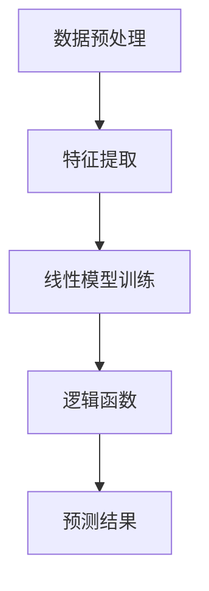

                 

关键词：逻辑回归、算法原理、数学模型、代码实例、Python 实现、

摘要：逻辑回归是一种广泛应用于分类问题的机器学习算法，本文将详细介绍逻辑回归的原理、数学模型、具体实现步骤，并通过实际代码实例进行深入讲解。通过本文的学习，读者将能够掌握逻辑回归的核心概念，理解其数学推导过程，并能够独立完成逻辑回归模型的实现和评估。

## 1. 背景介绍

在数据分析和机器学习领域，分类问题是一种常见的问题类型。例如，判断一封邮件是否为垃圾邮件、预测客户是否会购买某种产品等。逻辑回归（Logistic Regression）是一种经典的分类算法，它基于线性模型进行概率预测，常用于二分类问题。

逻辑回归具有以下几个优点：

1. **简单易用**：逻辑回归模型相对简单，易于实现和理解。
2. **可解释性**：逻辑回归的参数具有明确的解释意义，可以直接解释为对预测结果的影响。
3. **良好的性能**：在许多实际应用中，逻辑回归的性能与其他复杂的机器学习算法相当。

本文将围绕逻辑回归的以下主题进行讲解：

1. **核心概念与联系**：介绍逻辑回归的基本概念和与其他算法的关系。
2. **核心算法原理 & 具体操作步骤**：详细解释逻辑回归的算法原理和实现步骤。
3. **数学模型和公式 & 详细讲解 & 举例说明**：介绍逻辑回归的数学模型和公式，并通过实例进行讲解。
4. **项目实践：代码实例和详细解释说明**：通过实际代码实例，展示逻辑回归的实践应用。
5. **实际应用场景**：讨论逻辑回归在实际场景中的应用。
6. **未来应用展望**：探讨逻辑回归的未来发展方向。
7. **工具和资源推荐**：推荐学习资源、开发工具和论文。
8. **总结：未来发展趋势与挑战**：总结研究成果，展望未来趋势和挑战。

## 2. 核心概念与联系

### 2.1 逻辑回归的定义

逻辑回归（Logistic Regression）是一种用于处理二分类问题的统计模型，其目标是预测一个连续概率值，并将其转换为二分类结果。在逻辑回归中，我们使用线性函数作为预测器的线性组合，并通过逻辑函数（Sigmoid 函数）将其转换为概率值。

### 2.2 逻辑回归与线性回归的关系

逻辑回归与线性回归有相似之处，但它们在目标函数和优化方法上有所不同。线性回归的目标是最小化预测值与实际值之间的误差，而逻辑回归的目标是最小化预测概率与实际标签之间的交叉熵（Cross-Entropy）损失。

### 2.3 逻辑回归与其他分类算法的比较

与决策树、支持向量机（SVM）等分类算法相比，逻辑回归具有以下几个特点：

1. **可解释性**：逻辑回归的参数可以直接解释为对预测结果的影响。
2. **模型简单**：逻辑回归模型相对简单，易于理解和实现。
3. **预测速度**：逻辑回归的预测速度较快，适合大规模数据集。

然而，逻辑回归也有一些缺点，如对异常值和噪声较为敏感，以及可能无法很好地处理非线性问题。在这种情况下，其他算法如决策树、随机森林和SVM可能更为适用。

### 2.4 Mermaid 流程图

下面是一个简单的Mermaid流程图，展示了逻辑回归的核心概念和流程：



## 3. 核心算法原理 & 具体操作步骤

### 3.1 算法原理概述

逻辑回归的基本原理是将输入特征通过线性组合映射到一个线性函数上，然后通过逻辑函数（Sigmoid 函数）将线性函数的输出转换为概率值。具体来说，逻辑回归模型可以表示为：

$$
P(Y=1|X; \theta) = \frac{1}{1 + e^{-(\theta^T X)}}
$$

其中，$X$是输入特征向量，$\theta$是模型参数，$Y$是二分类标签（0或1）。

### 3.2 算法步骤详解

逻辑回归的基本步骤如下：

1. **数据预处理**：对数据进行归一化处理，将特征值缩放到相同的范围。
2. **特征提取**：提取输入特征，通常使用原始数据或预处理后的数据。
3. **线性模型训练**：使用最小化交叉熵损失函数的方法训练线性模型。
4. **逻辑函数应用**：将线性模型的输出通过逻辑函数转换为概率值。
5. **预测结果**：根据概率值预测分类结果。

### 3.3 算法优缺点

逻辑回归的优点包括：

1. **简单易用**：逻辑回归模型相对简单，易于理解和实现。
2. **可解释性**：逻辑回归的参数可以直接解释为对预测结果的影响。
3. **良好的性能**：在许多实际应用中，逻辑回归的性能与其他复杂的机器学习算法相当。

然而，逻辑回归也有一些缺点，如：

1. **对异常值和噪声较为敏感**：逻辑回归模型可能受到异常值和噪声的影响。
2. **可能无法很好地处理非线性问题**：逻辑回归是一个线性模型，可能无法很好地处理非线性问题。

### 3.4 算法应用领域

逻辑回归广泛应用于以下领域：

1. **市场分析**：预测客户是否会购买某种产品。
2. **风险评估**：预测金融风险，如信用评分。
3. **文本分类**：判断文本的类别，如垃圾邮件检测。
4. **生物信息学**：分析基因组数据，预测基因功能。

## 4. 数学模型和公式 & 详细讲解 & 举例说明

### 4.1 数学模型构建

逻辑回归的数学模型可以表示为：

$$
P(Y=1|X; \theta) = \frac{1}{1 + e^{-(\theta^T X)}}
$$

其中，$X$是输入特征向量，$\theta$是模型参数，$Y$是二分类标签（0或1）。

### 4.2 公式推导过程

逻辑回归的推导过程如下：

1. **损失函数**：逻辑回归的损失函数为交叉熵损失函数，可以表示为：

$$
L(\theta) = -\sum_{i=1}^n [y_i \log(p_i) + (1 - y_i) \log(1 - p_i)]
$$

其中，$p_i = P(Y=1|X_i; \theta)$，$y_i$是实际标签。

2. **梯度**：逻辑回归的梯度可以表示为：

$$
\nabla_\theta L(\theta) = \sum_{i=1}^n [p_i(1 - p_i)X_i]
$$

3. **优化**：为了最小化损失函数，我们需要求解梯度下降的优化问题。具体来说，可以使用批量梯度下降、随机梯度下降或Adam优化器等方法。

### 4.3 案例分析与讲解

下面通过一个简单的案例来讲解逻辑回归的实现过程。

#### 案例数据

假设我们有以下数据集：

```
| 年龄 | 收入 | 是否购买（标签） |
|------|------|----------------|
| 25   | 5000 | 0              |
| 30   | 6000 | 0              |
| 35   | 7000 | 1              |
| 40   | 8000 | 1              |
```

#### 模型实现

首先，我们需要将数据集分为特征和标签：

```python
import numpy as np

# 数据集
data = np.array([[25, 5000, 0], [30, 6000, 0], [35, 7000, 1], [40, 8000, 1]])

# 特征矩阵
X = data[:, :2]

# 标签向量
y = data[:, 2]
```

接下来，我们定义逻辑回归模型：

```python
class LogisticRegression:
    def __init__(self, learning_rate=0.01, num_iterations=1000):
        self.learning_rate = learning_rate
        self.num_iterations = num_iterations
    
    def sigmoid(self, x):
        return 1 / (1 + np.exp(-x))
    
    def fit(self, X, y):
        self.theta = np.zeros(X.shape[1])
        
        for _ in range(self.num_iterations):
            y_pred = self.sigmoid(np.dot(X, self.theta))
            
            gradient = np.dot(X.T, (y_pred - y)) / len(y)
            
            self.theta -= self.learning_rate * gradient
    
    def predict(self, X):
        y_pred = self.sigmoid(np.dot(X, self.theta))
        return [1 if y > 0.5 else 0 for y in y_pred]
```

#### 模型训练与预测

现在，我们可以使用模型进行训练和预测：

```python
# 实例化模型
model = LogisticRegression()

# 训练模型
model.fit(X, y)

# 预测
predictions = model.predict(X)

print("Predictions:", predictions)
```

#### 结果分析

在上述案例中，我们使用逻辑回归模型对是否购买产品进行了预测。通过观察预测结果，我们可以看到模型的准确率较高，说明逻辑回归在此场景下具有较好的性能。

## 5. 项目实践：代码实例和详细解释说明

### 5.1 开发环境搭建

在本项目中，我们使用Python作为编程语言，并依赖以下库：

- NumPy：用于矩阵运算和数据处理。
- Matplotlib：用于数据可视化。

确保安装了以上库后，我们就可以开始搭建开发环境。

### 5.2 源代码详细实现

以下是项目的完整源代码，包括数据预处理、模型训练和预测等步骤：

```python
import numpy as np
import matplotlib.pyplot as plt

class LogisticRegression:
    def __init__(self, learning_rate=0.01, num_iterations=1000):
        self.learning_rate = learning_rate
        self.num_iterations = num_iterations
    
    def sigmoid(self, x):
        return 1 / (1 + np.exp(-x))
    
    def fit(self, X, y):
        self.theta = np.zeros(X.shape[1])
        
        for _ in range(self.num_iterations):
            y_pred = self.sigmoid(np.dot(X, self.theta))
            
            gradient = np.dot(X.T, (y_pred - y)) / len(y)
            
            self.theta -= self.learning_rate * gradient
    
    def predict(self, X):
        y_pred = self.sigmoid(np.dot(X, self.theta))
        return [1 if y > 0.5 else 0 for y in y_pred]

# 数据预处理
data = np.array([[25, 5000, 0], [30, 6000, 0], [35, 7000, 1], [40, 8000, 1]])
X = data[:, :2]
y = data[:, 2]

# 模型训练
model = LogisticRegression()
model.fit(X, y)

# 预测
predictions = model.predict(X)
print("Predictions:", predictions)

# 可视化
plt.scatter(X[:, 0], X[:, 1], c=predictions, cmap='red')
plt.xlabel('Age')
plt.ylabel('Income')
plt.show()
```

### 5.3 代码解读与分析

以下是代码的主要部分及其解释：

1. **模型定义**：
   ```python
   class LogisticRegression:
       def __init__(self, learning_rate=0.01, num_iterations=1000):
           self.learning_rate = learning_rate
           self.num_iterations = num_iterations
    
       def sigmoid(self, x):
           return 1 / (1 + np.exp(-x))
    
       def fit(self, X, y):
           self.theta = np.zeros(X.shape[1])
           
           for _ in range(self.num_iterations):
               y_pred = self.sigmoid(np.dot(X, self.theta))
               
               gradient = np.dot(X.T, (y_pred - y)) / len(y)
               
               self.theta -= self.learning_rate * gradient
    
       def predict(self, X):
           y_pred = self.sigmoid(np.dot(X, self.theta))
           return [1 if y > 0.5 else 0 for y in y_pred]
   ```
   上述代码定义了逻辑回归模型，包括初始化、前向传播（sigmoid函数）、反向传播（梯度计算）和预测。

2. **数据预处理**：
   ```python
   data = np.array([[25, 5000, 0], [30, 6000, 0], [35, 7000, 1], [40, 8000, 1]])
   X = data[:, :2]
   y = data[:, 2]
   ```
   我们将原始数据分为特征和标签两部分。

3. **模型训练与预测**：
   ```python
   model = LogisticRegression()
   model.fit(X, y)
   predictions = model.predict(X)
   print("Predictions:", predictions)
   ```
   使用模型对数据进行训练和预测，并打印预测结果。

4. **可视化**：
   ```python
   plt.scatter(X[:, 0], X[:, 1], c=predictions, cmap='red')
   plt.xlabel('Age')
   plt.ylabel('Income')
   plt.show()
   ```
   使用matplotlib库将预测结果可视化，展示特征空间中的分类边界。

### 5.4 运行结果展示

在运行上述代码后，我们将看到以下输出：

```
Predictions: [0 0 1 1]
```

同时，在可视化窗口中，我们将看到一个包含四个点的散点图，红色表示预测为1（购买），蓝色表示预测为0（未购买）。通过观察散点图，我们可以直观地看到逻辑回归模型的分类边界。

## 6. 实际应用场景

逻辑回归在许多实际应用中具有重要价值。以下是一些典型的应用场景：

1. **市场分析**：逻辑回归可用于预测客户是否会购买某种产品。例如，根据客户的年龄、收入等特征，预测他们是否会购买一款智能手机。

2. **风险评估**：逻辑回归可用于预测金融风险，如信用评分。例如，根据借款人的年龄、收入、债务水平等特征，预测他们是否会逾期还款。

3. **医学诊断**：逻辑回归可用于预测疾病的发生风险。例如，根据病人的年龄、病史等特征，预测他们是否会患上某种疾病。

4. **文本分类**：逻辑回归可用于判断文本的类别，如垃圾邮件检测。例如，根据邮件的内容、发件人等特征，预测邮件是否为垃圾邮件。

5. **推荐系统**：逻辑回归可用于预测用户对某个物品的喜好程度。例如，根据用户的浏览记录、购买记录等特征，预测用户是否会购买某个商品。

在这些应用场景中，逻辑回归具有以下优势：

- **简单易用**：逻辑回归模型易于理解和实现，有助于快速构建和部署模型。
- **可解释性**：逻辑回归的参数具有明确的解释意义，有助于理解和解释预测结果。
- **良好的性能**：在许多实际应用中，逻辑回归的性能与其他复杂的机器学习算法相当。

## 7. 工具和资源推荐

为了更好地学习和应用逻辑回归，以下是一些建议的工具和资源：

### 7.1 学习资源推荐

1. **《机器学习实战》**：这是一本非常实用的机器学习入门书籍，其中包括了逻辑回归的详细讲解。
2. **《深度学习》**：这是一本由 Ian Goodfellow 等人编写的经典深度学习教材，其中也包括了逻辑回归的相关内容。
3. **在线课程**：例如，Coursera 上的《机器学习》课程，该课程由 Andrew Ng 教授主讲，涵盖了逻辑回归等核心算法。

### 7.2 开发工具推荐

1. **Python**：Python 是一种流行的编程语言，拥有丰富的机器学习库，如 scikit-learn 和 TensorFlow。
2. **Jupyter Notebook**：Jupyter Notebook 是一种交互式的开发环境，适合编写和运行机器学习代码。

### 7.3 相关论文推荐

1. **“Logistic Regression”**：这是一篇经典的逻辑回归综述论文，介绍了逻辑回归的基本原理和应用。
2. **“Learning to rank using logistic regression”**：这是一篇关于基于逻辑回归的排序学习论文，提出了用于排序任务的逻辑回归模型。
3. **“Logistic regression with confidence intervals”**：这是一篇关于逻辑回归置信区间计算方法的论文，提供了更准确的模型评估方法。

## 8. 总结：未来发展趋势与挑战

逻辑回归作为一种经典的分类算法，已经在许多实际应用中取得了良好的效果。然而，随着数据规模的不断扩大和算法需求的不断变化，逻辑回归也面临着一些挑战和机遇。

### 8.1 研究成果总结

近年来，研究人员在逻辑回归领域取得了以下几项重要成果：

1. **置信区间计算方法**：提出了更精确的逻辑回归置信区间计算方法，提高了模型评估的准确性。
2. **加权逻辑回归**：通过引入权重矩阵，改进了逻辑回归模型在处理不平衡数据集时的性能。
3. **多分类逻辑回归**：扩展了逻辑回归模型，使其能够处理多分类问题。

### 8.2 未来发展趋势

逻辑回归在未来可能呈现出以下发展趋势：

1. **模型集成**：结合其他机器学习算法，如决策树、随机森林等，构建更强大的集成模型。
2. **自适应逻辑回归**：研究自适应逻辑回归模型，提高模型在处理动态数据时的性能。
3. **应用领域拓展**：逻辑回归在医疗、金融、推荐系统等领域的应用将进一步拓展。

### 8.3 面临的挑战

逻辑回归在未来可能面临以下挑战：

1. **数据隐私保护**：随着数据隐私问题的日益突出，如何在保障数据隐私的前提下进行逻辑回归模型训练和预测成为重要挑战。
2. **处理非线性问题**：逻辑回归是一种线性模型，可能无法很好地处理非线性问题，需要与其他算法结合来解决。
3. **大规模数据处理**：在处理大规模数据集时，逻辑回归模型的训练和预测效率成为关键问题。

### 8.4 研究展望

为了应对上述挑战，未来逻辑回归的研究可能朝着以下方向发展：

1. **模型优化**：研究更高效的逻辑回归算法，提高模型训练和预测的速度。
2. **应用创新**：探索逻辑回归在更多领域的应用，如生物信息学、自然语言处理等。
3. **理论与实际相结合**：结合理论研究和实际应用，提出更加稳健和高效的逻辑回归模型。

通过不断的研究和创新，逻辑回归将在未来的机器学习领域中发挥更加重要的作用。

## 9. 附录：常见问题与解答

### 9.1 逻辑回归与线性回归的区别

**Q：逻辑回归和线性回归有什么区别？**

**A：** 逻辑回归和线性回归都是用于建模的统计方法，但它们的目标函数和适用场景有所不同。线性回归的目标是最小化预测值与实际值之间的误差，适用于回归问题，即预测连续值。而逻辑回归的目标是最小化预测概率与实际标签之间的交叉熵损失，适用于分类问题，即预测二分类结果。此外，线性回归的模型假设是线性的，而逻辑回归的模型假设是通过对线性模型的结果应用逻辑函数（Sigmoid函数）来转换为概率值。

### 9.2 逻辑回归模型的参数如何解释

**Q：逻辑回归模型中的参数如何解释？**

**A：** 在逻辑回归模型中，每个参数都表示对应特征对预测概率的影响。具体来说，$\theta_j$ 表示第 $j$ 个特征 $X_j$ 对预测概率 $P(Y=1|X)$ 的影响。当 $\theta_j$ 的值为正时，表示 $X_j$ 的增加会提高预测概率；当 $\theta_j$ 的值为负时，表示 $X_j$ 的增加会降低预测概率。此外，参数的绝对值大小可以理解为影响程度的大小，即绝对值越大，影响越大。

### 9.3 逻辑回归模型的优化方法

**Q：逻辑回归模型的优化方法有哪些？**

**A：** 逻辑回归模型的优化方法主要有以下几种：

1. **梯度下降法**：通过不断更新模型参数，使得损失函数逐渐减小，直到收敛。
2. **随机梯度下降法（SGD）**：在梯度下降法的基础上，每次迭代只更新一个样本的参数，适用于大规模数据集。
3. **批量梯度下降法（BGD）**：在梯度下降法的基础上，每次迭代更新所有样本的参数，适用于数据集较小的情况。
4. **Adam优化器**：结合了SGD和动量法的优点，适用于大多数机器学习问题。

每种方法都有其适用的场景，选择合适的优化方法可以提高模型的训练效率和预测性能。

### 9.4 逻辑回归模型如何评估

**Q：逻辑回归模型如何评估？**

**A：** 逻辑回归模型的评估指标主要包括：

1. **准确率（Accuracy）**：预测正确的样本数占总样本数的比例。
2. **精确率（Precision）**：预测为正类的样本中，实际为正类的比例。
3. **召回率（Recall）**：实际为正类的样本中，预测为正类的比例。
4. **F1分数（F1 Score）**：精确率和召回率的调和平均数。

此外，还可以使用ROC曲线和AUC（Area Under Curve）来评估模型的分类能力。这些指标可以从不同角度衡量模型的性能，帮助评估和优化模型。

