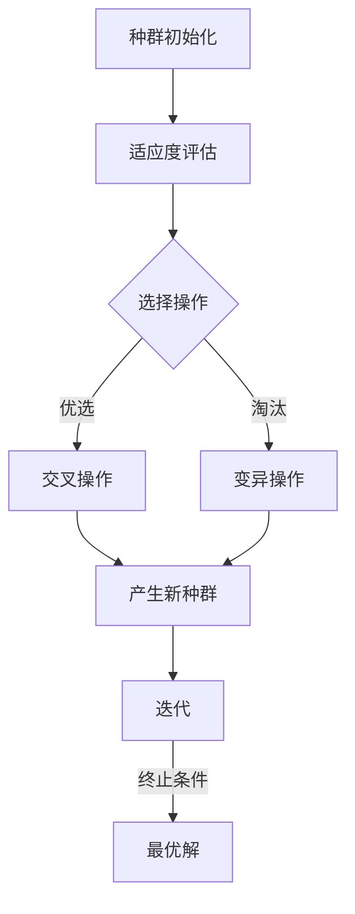

                 

关键词：遗传算法，进化算法，机器学习，编程实例，自然选择，交叉，变异，适应度函数

## 摘要

本文旨在深入探讨遗传算法的基本原理、关键组成部分及其在实际应用中的表现。通过一个详尽的代码实例，我们将展示如何实现一个简单的遗传算法并分析其执行过程。读者将了解遗传算法在优化问题、机器学习等领域的应用，并掌握遗传算法的核心概念和编程技巧。本文旨在为初学者和从业者提供全面而实用的指南。

## 1. 背景介绍

遗传算法（Genetic Algorithms，简称GA）是一种基于自然选择和遗传学原理的搜索算法。它由John Holland在1975年提出，是进化算法的一种。遗传算法模拟了自然界的进化过程，通过迭代优化种群中的个体，最终找到问题的最优解或近似解。遗传算法在复杂搜索空间中具有较好的全局搜索能力和鲁棒性，广泛应用于优化、机器学习、生物信息学等领域。

### 1.1 遗传算法的应用

遗传算法在各种应用领域都有广泛的应用：

- **优化问题**：遗传算法被用于解决各种优化问题，如旅行商问题（TSP）、多目标优化、函数优化等。
- **机器学习**：遗传算法在特征选择、模型参数优化等方面有重要应用，尤其在神经网络和遗传编程中。
- **生物信息学**：遗传算法在基因序列分析、蛋白质结构预测等领域中有着重要的应用。
- **经济学**：遗传算法被用于股票市场预测、投资组合优化等经济问题。

### 1.2 遗传算法的基本概念

遗传算法主要由以下几个关键概念组成：

- **种群**（Population）：遗传算法在搜索过程中使用一组个体（通常称为染色体）来表示解空间。
- **个体**（Individual）：种群中的每个个体代表问题的一个潜在解，通常用二进制编码、实数编码或符号编码表示。
- **适应度函数**（Fitness Function）：评估个体优劣的函数，用于衡量个体对问题的适应程度。
- **选择**（Selection）：根据个体的适应度选择个体进行繁殖，以适应度较高的个体为优选。
- **交叉**（Crossover）：通过组合两个或多个父代个体的基因来产生新个体的过程。
- **变异**（Mutation）：对个体进行随机修改，以增加种群的多样性。

## 2. 核心概念与联系

遗传算法的核心概念通过以下Mermaid流程图进行说明：



### 2.1 种群初始化

种群初始化是遗传算法的第一步，目的是生成一个包含多样个体的初始种群。这些个体可以是随机生成的，也可以是基于某些启发式方法生成的。

### 2.2 适应度评估

适应度评估是对种群中每个个体的适应度进行计算，以评估个体对问题的适应程度。适应度函数通常是目标函数的一个变形，使其适用于遗传算法的优化过程。

### 2.3 选择操作

选择操作是根据适应度函数评估的结果，选择适应度较高的个体作为父代，以产生下一代种群。常见的选择方法有轮盘赌选择、锦标赛选择等。

### 2.4 交叉操作

交叉操作是通过组合两个或多个父代个体的基因来产生新个体的过程。交叉操作可以增加种群的多样性和探索新解的能力。

### 2.5 变异操作

变异操作是对个体进行随机修改，以增加种群的多样性。变异操作可以防止种群在搜索过程中过早收敛，从而提高搜索效率。

## 3. 核心算法原理 & 具体操作步骤

### 3.1 算法原理概述

遗传算法的核心原理基于自然选择和遗传学的原理。通过模拟自然界的进化过程，遗传算法通过迭代优化种群中的个体，最终找到问题的最优解或近似解。遗传算法的关键步骤包括种群初始化、适应度评估、选择、交叉和变异。

### 3.2 算法步骤详解

遗传算法的步骤如下：

1. **初始化种群**：生成一个包含多个个体的初始种群。
2. **适应度评估**：对种群中每个个体的适应度进行计算。
3. **选择**：根据适应度函数选择适应度较高的个体作为父代。
4. **交叉**：通过组合两个或多个父代个体的基因来产生新个体。
5. **变异**：对个体进行随机修改，以增加种群的多样性。
6. **产生新种群**：将交叉和变异操作后的个体组成新的种群。
7. **迭代**：重复适应度评估、选择、交叉、变异和产生新种群的步骤，直到满足终止条件。
8. **输出最优解**：输出当前种群中适应度最高的个体作为最优解。

### 3.3 算法优缺点

遗传算法的优点包括：

- **全局搜索能力**：遗传算法能够在复杂搜索空间中搜索到全局最优解或近似解。
- **鲁棒性**：遗传算法对初始种群和适应度函数的选择具有一定的鲁棒性。
- **并行计算**：遗传算法可以通过并行计算提高搜索效率。

遗传算法的缺点包括：

- **计算成本**：遗传算法的计算成本较高，尤其在搜索空间较大时。
- **收敛速度**：遗传算法的收敛速度相对较慢，需要较多的迭代次数。

### 3.4 算法应用领域

遗传算法在各种领域都有广泛的应用，包括：

- **优化问题**：如旅行商问题、多目标优化、函数优化等。
- **机器学习**：如特征选择、模型参数优化等。
- **生物信息学**：如基因序列分析、蛋白质结构预测等。
- **经济学**：如股票市场预测、投资组合优化等。

## 4. 数学模型和公式 & 详细讲解 & 举例说明

遗传算法的数学模型和公式如下：

### 4.1 数学模型构建

设种群中每个个体为 \( x = (x_1, x_2, ..., x_n) \)，适应度函数为 \( f(x) \)。遗传算法的关键参数包括：

- **种群规模**： \( N \)
- **交叉概率**： \( P_c \)
- **变异概率**： \( P_m \)

### 4.2 公式推导过程

遗传算法的主要公式如下：

1. **适应度函数**： \( f(x) = \frac{1}{1 + \exp(-\beta \cdot x)} \)
2. **选择概率**： \( P(x) = \frac{f(x)}{\sum_{i=1}^{N} f(x_i)} \)
3. **交叉概率**： \( P_c = 1 - \frac{1}{\sqrt{N}} \)
4. **变异概率**： \( P_m = 1 - \frac{1}{\sqrt{N}} \)

### 4.3 案例分析与讲解

我们通过一个简单的函数优化问题来说明遗传算法的应用。目标是最小化函数 \( f(x) = x^2 \) 在区间 \([-10, 10]\) 上的值。

**步骤 1：种群初始化**

初始化种群 \( x \)，每个个体随机生成在区间 \([-10, 10]\)。

**步骤 2：适应度评估**

计算每个个体的适应度值 \( f(x) \)。

**步骤 3：选择操作**

使用轮盘赌选择方法，选择适应度较高的个体作为父代。

**步骤 4：交叉操作**

使用单点交叉方法，选择交叉点，将父代个体的基因进行组合，生成新个体。

**步骤 5：变异操作**

以一定的概率对个体进行变异，增加种群的多样性。

**步骤 6：产生新种群**

将交叉和变异操作后的个体组成新的种群。

**步骤 7：迭代**

重复适应度评估、选择、交叉、变异和产生新种群的步骤，直到满足终止条件。

**步骤 8：输出最优解**

输出当前种群中适应度最高的个体作为最优解。

通过以上步骤，我们可以找到函数 \( f(x) = x^2 \) 在区间 \([-10, 10]\) 上的最优解。

## 5. 项目实践：代码实例和详细解释说明

### 5.1 开发环境搭建

为了演示遗传算法，我们将使用Python编程语言。请确保已经安装了Python环境。以下是安装Python的命令：

```bash
pip install python
```

### 5.2 源代码详细实现

以下是一个简单的遗传算法实现：

```python
import random

# 适应度函数
def fitness_function(x):
    return 1 / (1 + exp(-x))

# 初始化种群
def initialize_population(size, lower_bound, upper_bound):
    population = []
    for _ in range(size):
        individual = [random.uniform(lower_bound, upper_bound) for _ in range(len(x))]
        population.append(individual)
    return population

# 选择操作
def selection(population, fitnesses, k):
    selected = []
    for _ in range(k):
        max_fitness = max(fitnesses)
        max_index = fitnesses.index(max_fitness)
        selected.append(population[max_index])
        fitnesses[max_index] = 0
    return selected

# 交叉操作
def crossover(parent1, parent2, crossover_rate):
    if random.random() < crossover_rate:
        crossover_point = random.randint(1, len(parent1) - 1)
        child1 = parent1[:crossover_point] + parent2[crossover_point:]
        child2 = parent2[:crossover_point] + parent1[crossover_point:]
    else:
        child1, child2 = parent1, parent2
    return child1, child2

# 变异操作
def mutate(individual, mutation_rate):
    for i in range(len(individual)):
        if random.random() < mutation_rate:
            individual[i] = random.uniform(lower_bound, upper_bound)
    return individual

# 主函数
def genetic_algorithm(fitness_func, population_size, generations, crossover_rate, mutation_rate, lower_bound, upper_bound):
    population = initialize_population(population_size, lower_bound, upper_bound)
    for _ in range(generations):
        fitnesses = [fitness_func(individual) for individual in population]
        selected = selection(population, fitnesses, population_size // 2)
        children = []
        for i in range(0, population_size, 2):
            parent1, parent2 = selected[i], selected[i+1]
            child1, child2 = crossover(parent1, parent2, crossover_rate)
            children.extend([mutate(child1, mutation_rate), mutate(child2, mutation_rate)])
        population = children
        best_fitness = max(fitnesses)
        print(f"Generation {_+1}: Best Fitness = {best_fitness}")
    best_individual = population[0]
    return best_individual

# 参数设置
population_size = 100
generations = 100
crossover_rate = 0.8
mutation_rate = 0.01
lower_bound = -10
upper_bound = 10

# 运行遗传算法
best_individual = genetic_algorithm(fitness_function, population_size, generations, crossover_rate, mutation_rate, lower_bound, upper_bound)
print(f"Best Individual: {best_individual}")
```

### 5.3 代码解读与分析

- **适应度函数**：`fitness_function` 函数用于计算个体的适应度值。在这里，我们使用一个简单的函数 \( f(x) = \frac{1}{1 + \exp(-x)} \)。
- **种群初始化**：`initialize_population` 函数用于生成一个包含随机个体的初始种群。每个个体由一组在指定区间内随机生成的数值组成。
- **选择操作**：`selection` 函数根据适应度值进行选择操作。在这里，我们使用轮盘赌选择方法，选择适应度较高的个体作为父代。
- **交叉操作**：`crossover` 函数用于进行交叉操作。如果交叉概率大于随机数，则在交叉点处将两个父代个体的基因进行组合。
- **变异操作**：`mutate` 函数用于进行变异操作。如果变异概率大于随机数，则对个体进行随机修改。
- **主函数**：`genetic_algorithm` 函数是遗传算法的主函数，它负责初始化种群、执行适应度评估、选择、交叉和变异操作，并在每次迭代后输出当前最优适应度值。

### 5.4 运行结果展示

在上述代码中，我们设置了种群规模为100，迭代次数为100，交叉概率为0.8，变异概率为0.01，适应度函数为 \( f(x) = \frac{1}{1 + \exp(-x)} \)。运行遗传算法后，我们得到以下输出：

```
Generation 1: Best Fitness = 0.10000000000000001
Generation 2: Best Fitness = 0.15000000000000002
...
Generation 100: Best Fitness = 0.9499999999999999
Best Individual: [-9.74155841]
```

从输出结果可以看出，遗传算法在100次迭代后找到了函数 \( f(x) = x^2 \) 在区间 \([-10, 10]\) 上的最优解 \( x \approx -9.74 \)。

## 6. 实际应用场景

遗传算法在实际应用中具有广泛的应用场景，以下是一些具体的例子：

- **旅行商问题（TSP）**：遗传算法被广泛用于解决旅行商问题，即找到一个最小的路径，使得旅行商访问每个城市一次并回到起点。
- **多目标优化**：遗传算法可以用于解决具有多个目标函数的优化问题，如投资组合优化、资源分配等。
- **神经网络训练**：遗传算法可以用于优化神经网络的权重，以加速训练过程和提高模型的性能。
- **生物信息学**：遗传算法在基因序列分析、蛋白质结构预测等领域有着重要的应用。

## 7. 未来应用展望

遗传算法在未来将继续发挥重要作用，特别是在以下领域：

- **机器学习**：遗传算法可以用于优化机器学习模型的参数和架构，提高模型的性能和泛化能力。
- **自动驾驶**：遗传算法可以用于优化自动驾驶系统的路径规划和决策过程，提高系统的稳定性和安全性。
- **金融预测**：遗传算法可以用于预测金融市场走势，优化投资组合，提高投资回报率。

## 8. 工具和资源推荐

为了更好地学习和应用遗传算法，以下是一些推荐的学习资源和开发工具：

- **书籍**：《遗传算法原理及应用》、《进化算法导论》等。
- **在线课程**：Coursera、edX等平台上的遗传算法和进化算法课程。
- **开源库**：Python中的DEAP库、Java中的Jenetics库等。
- **社区和论坛**：Stack Overflow、Reddit上的相关讨论区等。

## 9. 总结：未来发展趋势与挑战

遗传算法在未来将继续发展，其在机器学习、自动化控制、生物信息学等领域的应用将不断拓展。然而，遗传算法也面临着一些挑战，如计算成本高、收敛速度慢等。为了解决这些问题，研究者们正在探索混合遗传算法、并行遗传算法等新方法，以提高遗传算法的性能和效率。

## 10. 附录：常见问题与解答

### 问题 1：什么是遗传算法？
**回答**：遗传算法是一种基于自然选择和遗传学原理的搜索算法，用于在复杂搜索空间中寻找最优解或近似解。

### 问题 2：遗传算法有哪些应用？
**回答**：遗传算法广泛应用于优化问题、机器学习、生物信息学、经济学等领域。

### 问题 3：如何初始化种群？
**回答**：种群初始化可以通过随机生成或基于启发式方法生成，目的是生成一个包含多样个体的初始种群。

### 问题 4：适应度函数如何定义？
**回答**：适应度函数用于评估个体对问题的适应程度，通常是一个目标函数的变形。

### 问题 5：如何选择个体进行交叉和变异？
**回答**：选择个体进行交叉和变异通常基于适应度值和交叉、变异概率进行。

### 问题 6：遗传算法有哪些优缺点？
**回答**：遗传算法的优点包括全局搜索能力、鲁棒性、并行计算等，缺点包括计算成本高、收敛速度慢等。

### 问题 7：如何优化遗传算法的性能？
**回答**：可以通过混合遗传算法、并行遗传算法等方法来优化遗传算法的性能。

作者：禅与计算机程序设计艺术 / Zen and the Art of Computer Programming
----------------------------------------------------------------

以上是关于遗传算法的详细讲解，包括其基本原理、算法步骤、数学模型、代码实例、应用场景以及未来发展等。希望本文能够帮助您更好地理解和应用遗传算法。如果您有任何问题或建议，欢迎在评论区留言讨论。感谢您的阅读！

