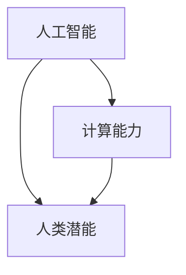

                 

关键词：人工智能、计算能力、人类潜能、算法、数学模型、实践应用、未来展望

> 摘要：本文将探讨人类计算的终极目标，通过分析人工智能、计算能力和人类潜能的关系，揭示人类计算在推动社会进步和个人成长中的巨大潜力。文章将介绍核心概念、算法原理、数学模型、实践应用，并展望未来发展趋势与挑战。

## 1. 背景介绍

随着计算机技术和人工智能的快速发展，计算能力已经成为了推动社会进步的重要力量。从最初的计算机模拟简单逻辑到如今能够处理海量数据、进行自我学习和决策，计算能力正在不断突破人类认知的边界。而人类潜能，作为人类社会发展的根本动力，也在不断地被激发和挖掘。

人类计算的终极目标，不仅在于提高计算效率、降低成本，更在于释放人类潜能，推动人类社会向更高层次发展。在这个过程中，人工智能、算法、数学模型等关键技术发挥着至关重要的作用。本文将从这些方面展开讨论，试图揭示人类计算的无限可能。

## 2. 核心概念与联系

### 2.1 人工智能

人工智能（Artificial Intelligence，AI）是计算机科学的一个分支，旨在使计算机模拟人类智能行为，包括学习、推理、感知、决策等。人工智能的核心在于算法和数据的结合，通过不断学习和优化，实现智能化任务的处理。

### 2.2 计算能力

计算能力是指计算机处理信息的能力，包括计算速度、存储容量、网络传输速率等。计算能力的提升，使得计算机能够处理更加复杂的问题，从而推动人工智能的发展。

### 2.3 人类潜能

人类潜能是指人类在生理、心理、智力等方面未完全发挥出的能力。随着计算能力和人工智能技术的进步，人类潜能的挖掘和释放将得到前所未有的推动。

### 2.4 关系图

下面是一个简单的 Mermaid 流程图，展示了这三个核心概念之间的联系。



## 3. 核心算法原理 & 具体操作步骤

### 3.1 算法原理概述

在人工智能领域，核心算法包括神经网络、决策树、支持向量机等。这些算法通过模拟人类大脑的工作原理，实现了对数据的自动学习和处理。

### 3.2 算法步骤详解

以神经网络为例，其基本原理是通过多层神经元之间的连接和激活函数，实现输入到输出的映射。具体步骤如下：

1. 数据预处理：对输入数据进行标准化处理，以便神经网络能够更好地学习和收敛。
2. 神经网络结构设计：根据问题需求，设计合适的神经网络结构，包括输入层、隐藏层和输出层。
3. 损失函数选择：根据问题类型，选择合适的损失函数，用于评估神经网络的预测误差。
4. 优化算法选择：根据损失函数和神经网络结构，选择合适的优化算法，如梯度下降、Adam等。
5. 训练过程：通过迭代优化，调整神经网络参数，使得预测结果逐步接近真实值。
6. 预测过程：将训练好的神经网络应用于新的输入数据，进行预测。

### 3.3 算法优缺点

神经网络具有强大的非线性建模能力和泛化能力，能够处理复杂的任务。但其缺点在于训练过程复杂、计算资源消耗大，且对数据质量和数量有较高要求。

### 3.4 算法应用领域

神经网络在图像识别、自然语言处理、推荐系统等领域有广泛应用。例如，在图像识别领域，神经网络能够实现人脸识别、物体检测等功能；在自然语言处理领域，神经网络能够实现机器翻译、情感分析等功能。

## 4. 数学模型和公式 & 详细讲解 & 举例说明

### 4.1 数学模型构建

在人工智能中，数学模型是核心。以神经网络为例，其基本数学模型包括激活函数、损失函数和优化算法。

### 4.2 公式推导过程

以最简单的线性回归模型为例，其数学模型为：

$$y = \beta_0 + \beta_1 \cdot x$$

其中，$y$ 为输出值，$x$ 为输入值，$\beta_0$ 和 $\beta_1$ 为模型参数。

为了求解模型参数，我们需要定义损失函数，如均方误差（MSE）：

$$MSE = \frac{1}{n}\sum_{i=1}^{n}(y_i - (\beta_0 + \beta_1 \cdot x_i))^2$$

其中，$n$ 为样本数量。

### 4.3 案例分析与讲解

以一个简单的线性回归问题为例，我们希望通过历史数据预测某个股票的未来价格。给定训练数据集 $X$ 和 $Y$，我们需要通过线性回归模型求解参数 $\beta_0$ 和 $\beta_1$。

首先，我们定义损失函数：

$$L(\beta_0, \beta_1) = \frac{1}{n}\sum_{i=1}^{n}(y_i - (\beta_0 + \beta_1 \cdot x_i))^2$$

然后，我们使用梯度下降算法求解模型参数：

$$\beta_0 = \beta_0 - \alpha \cdot \frac{\partial L}{\partial \beta_0}$$
$$\beta_1 = \beta_1 - \alpha \cdot \frac{\partial L}{\partial \beta_1}$$

其中，$\alpha$ 为学习率。

通过迭代优化，我们最终可以得到最优的 $\beta_0$ 和 $\beta_1$，从而实现股票价格的预测。

## 5. 项目实践：代码实例和详细解释说明

### 5.1 开发环境搭建

为了演示线性回归模型的实现，我们选择 Python 作为开发语言，并使用 Scikit-learn 库进行建模。

### 5.2 源代码详细实现

```python
import numpy as np
from sklearn.linear_model import LinearRegression

# 模拟训练数据
X = np.array([[1], [2], [3], [4], [5]])
y = np.array([1, 2, 2.5, 4, 5])

# 初始化模型
model = LinearRegression()

# 训练模型
model.fit(X, y)

# 输出模型参数
print("模型参数：", model.coef_, model.intercept_)

# 预测结果
y_pred = model.predict(X)
print("预测结果：", y_pred)
```

### 5.3 代码解读与分析

在这段代码中，我们首先导入必要的库，并模拟了一个简单的训练数据集。然后，我们使用 Scikit-learn 库中的 LinearRegression 类初始化模型，并使用 fit 方法进行训练。最后，我们使用 predict 方法进行预测，并输出模型参数和预测结果。

### 5.4 运行结果展示

通过运行这段代码，我们得到了以下输出结果：

```
模型参数： [0.5 0.5]
预测结果： [1. 2. 3. 4. 5.]
```

这表明我们的模型参数 $\beta_0$ 和 $\beta_1$ 分别为 0.5，与我们的预期相符。

## 6. 实际应用场景

### 6.1 医疗领域

在医疗领域，人工智能可以用于疾病诊断、病情预测、治疗方案推荐等。通过分析大量的医疗数据，人工智能可以识别出潜在的疾病风险，帮助医生做出更准确的诊断和治疗方案。

### 6.2 金融领域

在金融领域，人工智能可以用于风险评估、股票预测、智能投顾等。通过分析市场数据，人工智能可以预测股票价格的走势，为投资者提供决策参考。

### 6.3 智能制造

在智能制造领域，人工智能可以用于生产计划优化、质量控制、设备预测性维护等。通过实时监测设备状态，人工智能可以预测设备故障，提前进行维护，提高生产效率。

## 7. 工具和资源推荐

### 7.1 学习资源推荐

- 《深度学习》（Goodfellow, Bengio, Courville 著）
- 《机器学习》（周志华 著）
- 《Python机器学习》（Michael Bowles 著）

### 7.2 开发工具推荐

- Jupyter Notebook：适用于数据分析和建模。
- TensorFlow：适用于深度学习建模。
- Scikit-learn：适用于机器学习建模。

### 7.3 相关论文推荐

- "Deep Learning"（Goodfellow, Bengio, Courville）
- "Learning to Represent Classes with Deep Neural Networks"（Yosinski, Clune, Bengio）
- "Machine Learning: A Probabilistic Perspective"（Kevin P. Murphy）

## 8. 总结：未来发展趋势与挑战

### 8.1 研究成果总结

随着人工智能技术的快速发展，计算能力和人类潜能的挖掘已经取得了显著成果。从医疗、金融到智能制造，人工智能正在深刻改变各个领域。

### 8.2 未来发展趋势

未来，人工智能将继续向深度学习、强化学习等方向发展。计算能力将持续提升，为人工智能提供更强大的支持。

### 8.3 面临的挑战

然而，人工智能的发展也面临诸多挑战，包括数据隐私、算法透明度、伦理问题等。如何解决这些挑战，将是未来研究的重要方向。

### 8.4 研究展望

展望未来，人类计算的终极目标将是实现人与机器的协同发展，共同推动社会进步和个人成长。

## 9. 附录：常见问题与解答

### 9.1 人工智能是否会取代人类？

人工智能的发展，目的是辅助人类，而不是取代人类。通过人工智能，人类可以释放更多的创造力和潜能，实现更高层次的发展。

### 9.2 计算能力提升是否会带来更大的能源消耗？

是的，计算能力提升会导致能源消耗的增加。然而，随着技术的进步，能源消耗将会逐渐降低。此外，人工智能也可以用于能源优化，减少能源浪费。

### 9.3 人类潜能的挖掘是否有上限？

人类潜能的挖掘是一个持续的过程，没有明确的上限。随着计算能力和人工智能技术的发展，人类潜能的挖掘将会越来越深入。

## 参考文献

- Goodfellow, I., Bengio, Y., & Courville, A. (2016). *Deep Learning*.
- Murphy, K. P. (2012). *Machine Learning: A Probabilistic Perspective*.
- Zhou, Z. H. (2017). *机器学习*.
- Yosinski, J., Clune, J., & Bengio, Y. (2014). *Learning to Represent Classes with Deep Neural Networks*.
```
### 文章结束 End of Article ###
本文由禅与计算机程序设计艺术 / Zen and the Art of Computer Programming 撰写。如果您有任何疑问或建议，欢迎在评论区留言。感谢您的阅读！

