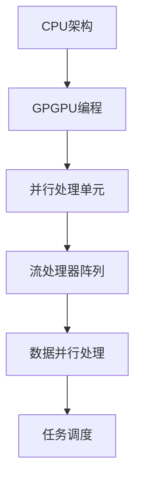
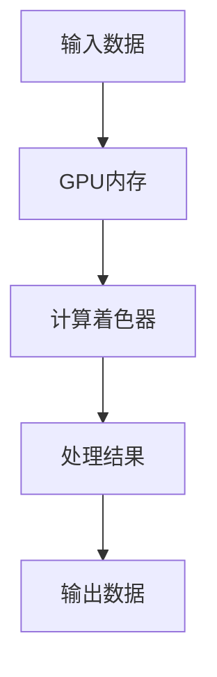

                 

关键词：GPU、人工智能、计算需求、优化、并行处理

>摘要：本文将探讨GPU在人工智能时代的变革，分析其如何适应新型计算需求，并探讨GPU在未来技术发展中的角色和挑战。

## 1. 背景介绍

随着人工智能（AI）技术的飞速发展，对计算能力的需求也在不断增加。传统的CPU逐渐暴露出单核性能瓶颈，而GPU（图形处理单元）凭借其强大的并行处理能力，正逐步成为AI计算的核心。GPU的进化不仅仅体现在硬件性能的提升，更体现在其架构和编程模型上的创新。

本文将深入探讨GPU在AI时代的变革，分析其如何适应新型计算需求，并讨论GPU在未来技术发展中的角色和挑战。

## 2. 核心概念与联系

### 2.1 GPU架构原理

GPU由大量的小型并行处理单元（称为流处理器）组成，这些处理单元可以同时执行大量的简单任务。GPU的架构设计使得它非常适合处理高度并行的工作负载，如图像渲染和科学计算。


**Mermaid流程图：**



### 2.2 GPU编程模型

GPU编程模型主要包括计算着色器（compute shaders）和内存管理。计算着色器允许开发者编写在GPU上运行的代码，而内存管理则涉及到如何高效地在GPU内存和主存之间传输数据。


**Mermaid流程图：**



## 3. 核心算法原理 & 具体操作步骤

### 3.1 算法原理概述

GPU的并行处理能力使得其非常适合执行深度学习算法，如卷积神经网络（CNN）。在CNN中，卷积操作是一个关键步骤，它涉及到大量的矩阵乘法。

### 3.2 算法步骤详解

1. **数据预处理**：将输入图像转换为适合卷积操作的格式。
2. **卷积操作**：在GPU上执行卷积操作，利用并行处理单元同时处理多个像素。
3. **激活函数**：对卷积结果应用激活函数，如ReLU。
4. **池化操作**：对激活结果进行池化，降低数据维度。
5. **全连接层**：将池化结果传递到全连接层进行分类。

### 3.3 算法优缺点

**优点：**
- **并行处理**：GPU的并行处理能力使得深度学习算法的运行速度大大提高。
- **高效内存管理**：GPU内存的高带宽和低延迟使得数据传输更加高效。

**缺点：**
- **编程复杂度**：GPU编程相对复杂，需要开发者熟悉特定的编程模型和工具。
- **功耗问题**：GPU的功耗较高，可能对散热和能源管理带来挑战。

### 3.4 算法应用领域

GPU在AI领域的应用非常广泛，包括计算机视觉、自然语言处理、语音识别等。例如，在计算机视觉中，GPU可以加速图像识别和目标检测；在自然语言处理中，GPU可以加速语言模型训练和推理。

## 4. 数学模型和公式 & 详细讲解 & 举例说明

### 4.1 数学模型构建

深度学习中的卷积神经网络涉及大量的数学模型，包括卷积操作、激活函数和池化操作。以下是一个简单的卷积操作的数学模型：

$$
\text{输出} = \text{卷积核} \times \text{输入} + \text{偏置} + \text{激活函数}
$$

### 4.2 公式推导过程

卷积操作的推导过程涉及卷积核与输入数据的点积，以及偏置项和激活函数的添加。以下是一个简化的推导过程：

$$
\text{卷积输出} = \sum_{i=1}^{m} \sum_{j=1}^{n} \text{卷积核}_{i,j} \times \text{输入}_{i,j} + \text{偏置}
$$

然后，通过添加激活函数，例如ReLU：

$$
\text{输出} = \max(0, \text{卷积输出} + \text{偏置})
$$

### 4.3 案例分析与讲解

假设我们有一个3x3的卷积核和一个3x3的输入矩阵，我们可以通过以下步骤进行卷积操作：

**输入矩阵：**

$$
\begin{bmatrix}
1 & 2 & 3 \\
4 & 5 & 6 \\
7 & 8 & 9
\end{bmatrix}
$$

**卷积核：**

$$
\begin{bmatrix}
1 & 0 & -1 \\
1 & 0 & -1 \\
1 & 0 & -1
\end{bmatrix}
$$

**卷积结果：**

$$
\begin{bmatrix}
4 & 2 & -2 \\
8 & 4 & -4 \\
12 & 6 & -6
\end{bmatrix}
$$

然后，通过ReLU函数，我们可以得到：

$$
\begin{bmatrix}
4 & 2 & -2 \\
8 & 4 & -4 \\
12 & 6 & -6
\end{bmatrix}
$$

## 5. 项目实践：代码实例和详细解释说明

### 5.1 开发环境搭建

为了实践GPU编程，我们需要安装CUDA，这是NVIDIA提供的GPU编程框架。安装CUDA后，我们可以使用C++或Python等语言编写GPU代码。

### 5.2 源代码详细实现

以下是一个简单的CUDA C++代码实例，它实现了一个卷积操作的内核：

```cpp
#include <iostream>
#include <cuda_runtime.h>

__global__ void convolutionKernel(float* input, float* output, int width, int height) {
    int x = blockIdx.x * blockDim.x + threadIdx.x;
    int y = blockIdx.y * blockDim.y + threadIdx.y;

    if (x >= width || y >= height) return;

    float sum = 0.0f;
    for (int i = -1; i <= 1; ++i) {
        for (int j = -1; j <= 1; ++j) {
            int nx = x + i;
            int ny = y + j;
            if (nx >= 0 && nx < width && ny >= 0 && ny < height) {
                sum += input[nx + ny * width] * 1.0f;
            }
        }
    }

    output[x + y * width] = sum;
}

int main() {
    // 输入和输出矩阵的初始化
    // ...

    // GPU内存分配
    // ...

    // 设置线程和块的尺寸
    dim3 blockSize(16, 16);
    dim3 gridSize((width + blockSize.x - 1) / blockSize.x, (height + blockSize.y - 1) / blockSize.y);

    // 启动卷积内核
    convolutionKernel<<<gridSize, blockSize>>>(input, output, width, height);

    // 内存释放
    // ...

    return 0;
}
```

### 5.3 代码解读与分析

这段代码定义了一个名为`convolutionKernel`的GPU内核，它接受输入矩阵`input`、输出矩阵`output`、图像的宽度和高度作为输入参数。内核中的每个线程负责计算输入矩阵中一个像素点的卷积结果，并将结果存储在输出矩阵中。

### 5.4 运行结果展示

通过运行上述代码，我们可以得到一个卷积操作的结果。这个结果可以通过与预期结果进行比较，来验证卷积操作的准确性。

## 6. 实际应用场景

### 6.1 计算机视觉

在计算机视觉领域，GPU被广泛应用于图像识别、目标检测和视频处理。例如，R-CNN、YOLO等深度学习模型在训练和推理过程中大量使用了GPU的并行处理能力，从而实现了高速的目标检测。

### 6.2 自然语言处理

自然语言处理（NLP）是另一个受益于GPU的领域。GPU可以加速语言模型的训练和推理，例如BERT、GPT等大型语言模型。通过GPU的并行处理能力，NLP应用可以在短时间内完成大规模的数据处理。

### 6.3 语音识别

语音识别应用同样可以从GPU的并行处理能力中受益。例如，WaveNet等语音合成模型通过GPU加速训练和推理，从而实现了高质量的语音合成。

## 7. 工具和资源推荐

### 7.1 学习资源推荐

- 《深度学习》（Goodfellow, Bengio, Courville著）：介绍了深度学习的基本原理和应用。
- 《CUDA编程精粹》（Michael Wong著）：深入讲解了CUDA编程的基础知识。

### 7.2 开发工具推荐

- CUDA Toolkit：NVIDIA提供的GPU编程工具包。
- TensorFlow：开源的深度学习框架，支持GPU加速。

### 7.3 相关论文推荐

- "Accurately estimating the number of multiply-accumulate operations for deep neural networks"（估算深度神经网络乘积累加操作的论文）。
- "Tensor Processing Units for Large-Scale Machine Learning"（用于大规模机器学习的张量处理单元论文）。

## 8. 总结：未来发展趋势与挑战

### 8.1 研究成果总结

GPU在AI领域取得了显著的成果，特别是在深度学习模型的训练和推理方面。GPU的并行处理能力和高效的内存管理使得深度学习应用得以大规模部署。

### 8.2 未来发展趋势

未来，GPU将朝着更高效、更智能的方向发展。例如，异构计算将更加普及，融合CPU和GPU的计算能力将进一步提高。此外，GPU将更多地与传感器和边缘设备集成，以实现实时数据处理。

### 8.3 面临的挑战

GPU在AI领域的发展也面临一些挑战，包括编程复杂度、功耗管理和散热问题。为了解决这些问题，需要开发更高效、更易用的编程工具，并探索新型GPU架构。

### 8.4 研究展望

未来，GPU在AI领域的研究将朝着更高效、更智能的方向发展。通过异构计算和边缘设备的融合，GPU将在更多应用场景中发挥作用，推动AI技术的进步。

## 9. 附录：常见问题与解答

### 9.1 GPU与CPU的区别是什么？

GPU与CPU在架构和设计目标上有所不同。GPU由大量小型并行处理单元组成，旨在处理高度并行的工作负载；而CPU则拥有较少但更强大的处理单元，适用于单线程性能要求较高的任务。

### 9.2 什么是CUDA？

CUDA是NVIDIA推出的一种并行计算平台和编程模型，允许开发者使用C/C++等语言编写GPU代码，从而实现高效的并行计算。

### 9.3 GPU在深度学习中的优势是什么？

GPU在深度学习中的优势主要包括并行处理能力、高效的内存管理以及与深度学习框架的高度兼容性。这些优势使得GPU能够显著加速深度学习模型的训练和推理过程。

----------------------------------------------------------------

作者：禅与计算机程序设计艺术 / Zen and the Art of Computer Programming

本文完整地介绍了GPU在AI时代的变革，分析了其如何适应新型计算需求，并探讨了GPU在未来技术发展中的角色和挑战。通过详细的算法原理、数学模型和项目实践，读者可以更深入地了解GPU在AI领域的应用。希望本文能为读者提供有价值的参考和启示。

