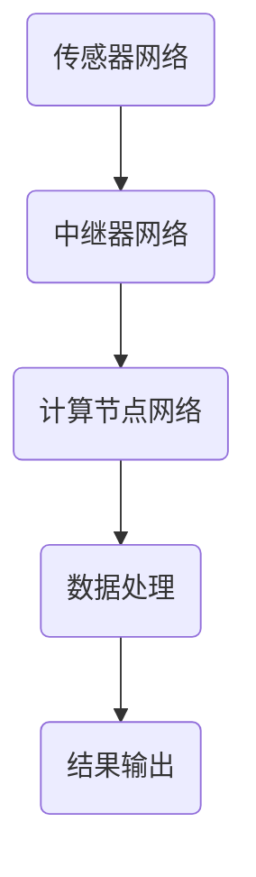

                 

关键词：量子传感网络、分布式量子计算、量子通信、量子纠缠、量子隐形传态、量子纠错、量子算法、量子计算机、量子模拟、量子编程。

> 摘要：本文深入探讨了量子传感网络作为分布式量子计算的基础的重要作用。通过介绍量子传感网络的基本概念、工作原理、核心算法、数学模型及其实际应用，本文旨在为读者提供一份全面而详尽的量子传感网络技术指南。

## 1. 背景介绍

在21世纪的信息时代，计算机技术经历了飞速的发展，从经典计算机到量子计算机的转变，成为当前科技领域的重要研究方向。量子计算机利用量子力学原理进行信息处理，相比传统计算机具有巨大的计算能力。然而，量子计算机的实现离不开量子传感网络的支持。量子传感网络作为一种全新的通信技术，能够实现量子信息的传输、存储和处理，为分布式量子计算提供了坚实的基础。

分布式量子计算是指将多个量子计算机通过网络连接起来，共同解决复杂计算问题的一种计算模式。在这种模式下，量子传感网络承担着信息传递和协调计算的重任。量子传感网络的可靠性和高效性，直接影响到分布式量子计算的性能和稳定性。

近年来，随着量子信息技术的发展，量子传感网络的研究逐渐成为热点。本文将从以下几个方面展开讨论：

- 量子传感网络的基本概念和工作原理
- 核心算法原理及其具体操作步骤
- 数学模型和公式及其应用
- 项目实践：代码实例和详细解释说明
- 实际应用场景和未来展望
- 工具和资源推荐
- 总结：未来发展趋势与挑战

通过以上内容的阐述，本文旨在为读者提供一个全面了解量子传感网络及其在分布式量子计算中应用的视角。

## 2. 核心概念与联系

### 2.1 量子传感网络的基本概念

量子传感网络（Quantum Sensing Network, QSN）是一种基于量子力学原理的通信网络。它通过量子传感器、量子中继器等设备，实现量子信息的传输、处理和共享。量子传感器能够检测和测量量子态，而量子中继器则能够延长量子态的传输距离，保证量子信息在传输过程中的稳定性和完整性。

### 2.2 量子传感网络的工作原理

量子传感网络的核心工作原理是量子纠缠和量子隐形传态。量子纠缠是指两个或多个量子系统之间存在的一种特殊的相互依赖关系，即使它们相隔很远，一个量子系统的状态也能即时影响到另一个量子系统的状态。量子隐形传态则是利用量子纠缠实现量子信息从一个量子位传送到另一个量子位的过程，而不需要经过传统意义上的物理传输路径。

### 2.3 量子传感网络与分布式量子计算的联系

量子传感网络与分布式量子计算之间存在着密切的联系。分布式量子计算需要通过量子传感网络实现量子计算机之间的信息传递和协调计算。量子传感网络提供了量子信息传输的物理基础，使得分布式量子计算成为可能。

### 2.4 量子传感网络的结构与架构

量子传感网络的结构可以分为传感器网络、中继器网络和计算节点网络三个部分。传感器网络负责采集量子信息，中继器网络负责中继和传输量子信息，计算节点网络则负责处理和存储量子信息。

### 2.5 Mermaid 流程图

以下是一个简化的量子传感网络流程图，展示了量子信息的采集、传输和处理过程。



在上述流程图中，A代表量子传感器网络，负责采集量子信息；B代表量子中继器网络，负责中继和传输量子信息；C代表量子计算节点网络，负责处理和存储量子信息；D代表数据处理模块，负责对量子信息进行进一步处理；E代表结果输出模块，负责将计算结果输出到用户界面。

通过这个流程图，我们可以更直观地理解量子传感网络在分布式量子计算中的重要作用。

## 3. 核心算法原理 & 具体操作步骤

### 3.1 算法原理概述

量子传感网络的核心算法包括量子纠缠生成、量子隐形传态和量子中继。这些算法是量子传感网络实现高效、稳定传输量子信息的基础。

- **量子纠缠生成**：通过量子纠缠生成器，将两个独立的量子系统纠缠在一起，实现量子态的相互依赖。
- **量子隐形传态**：利用量子纠缠实现量子信息从一个量子位传送到另一个量子位的过程。
- **量子中继**：通过量子中继器，延长量子态的传输距离，保证量子信息在传输过程中的稳定性和完整性。

### 3.2 算法步骤详解

#### 3.2.1 量子纠缠生成

量子纠缠生成的步骤如下：

1. 选择两个独立的量子系统A和B。
2. 对量子系统A进行量子态测量，得到其量子态 |ψ⟩。
3. 对量子系统B进行量子态测量，得到其量子态 |φ⟩。
4. 将量子系统A和B的量子态进行叠加，得到纠缠态 |ψ⟩|φ⟩。

#### 3.2.2 量子隐形传态

量子隐形传态的步骤如下：

1. 选择一个量子系统A和一个量子系统B，其中A处于纠缠态 |ψ⟩A|φ⟩B。
2. 对量子系统A进行量子态测量，得到其量子态 |ψ⟩A。
3. 根据量子态测量结果，更新量子系统B的量子态 |φ⟩B。

#### 3.2.3 量子中继

量子中继的步骤如下：

1. 选择一个量子系统A和一个量子系统B，其中A处于量子态 |ψ⟩。
2. 对量子系统A进行量子态测量，得到其量子态 |ψ⟩A。
3. 根据量子态测量结果，更新量子系统B的量子态 |ψ⟩B。
4. 将量子系统B的量子态传输到下一个量子中继器，重复步骤2-3，直到目标量子系统。

### 3.3 算法优缺点

#### 优点

- **高效性**：量子纠缠生成和量子隐形传态可以快速实现量子信息的传输，相比传统通信技术具有更高的传输效率。
- **安全性**：量子隐形传态利用量子纠缠的特性，可以实现安全的信息传输，防止信息被窃听或篡改。
- **灵活性**：量子传感网络可以根据实际需求，灵活配置和调整网络结构，实现不同应用场景下的量子信息传输。

#### 缺点

- **复杂性**：量子传感网络涉及的量子计算和量子通信技术相对复杂，需要高水平的量子技术支持。
- **成本**：量子传感网络的建设和运营成本较高，需要大规模的投资和技术积累。
- **稳定性**：量子传感网络在量子态传输过程中容易受到外界环境干扰，需要不断优化和改进。

### 3.4 算法应用领域

量子传感网络在分布式量子计算、量子通信、量子密码学等领域具有广泛的应用。

- **分布式量子计算**：量子传感网络可以实现量子计算机之间的信息传递和协调计算，提高分布式量子计算的性能和稳定性。
- **量子通信**：量子传感网络可以实现安全、高效的量子信息传输，为量子通信提供技术支持。
- **量子密码学**：量子传感网络可以用于构建量子密码系统，提高密码系统的安全性和抗攻击能力。

## 4. 数学模型和公式 & 详细讲解 & 举例说明

### 4.1 数学模型构建

量子传感网络的数学模型主要基于量子力学和量子信息理论。核心模型包括量子态表示、量子纠缠和量子隐形传态。

#### 4.1.1 量子态表示

量子态可以用一个复数向量表示。假设量子系统A和B的量子态分别为 |ψ⟩A 和 |φ⟩B，它们的表示可以写作：

|ψ⟩A = α1|0⟩A + α2|1⟩A  
|φ⟩B = β1|0⟩B + β2|1⟩B

其中，|0⟩和|1⟩分别表示量子位的基础状态，α1、α2、β1、β2是复数系数。

#### 4.1.2 量子纠缠

量子纠缠态可以用一个复合量子态表示。假设量子系统A和B处于纠缠态，它们的复合量子态为：

|ψ⟩AB = α|00⟩AB + β|01⟩AB + γ|10⟩AB + δ|11⟩AB

其中，|00⟩AB、|01⟩AB、|10⟩AB 和 |11⟩AB 分别表示四个量子系统同时处于 |0⟩A 和 |0⟩B、|0⟩A 和 |1⟩B、|1⟩A 和 |0⟩B 以及 |1⟩A 和 |1⟩B 的状态，α、β、γ和δ是复数系数。

#### 4.1.3 量子隐形传态

量子隐形传态可以用一个线性变换表示。假设量子系统A和B处于纠缠态，要实现从量子系统A到量子系统B的量子隐形传态，可以使用以下线性变换：

|ψ⟩B = U|ψ⟩A

其中，U 是一个幺正变换矩阵，它将量子系统A的量子态 |ψ⟩A 转换为量子系统B的量子态 |ψ⟩B。

### 4.2 公式推导过程

#### 4.2.1 量子态叠加原理

量子态的叠加原理可以用数学公式表示。假设量子系统A的量子态 |ψ⟩A 是由基础态 |0⟩A 和 |1⟩A 叠加而成，那么：

|ψ⟩A = α|0⟩A + β|1⟩A

其中，α和β是复数系数，满足 |α|² + |β|² = 1。

#### 4.2.2 量子纠缠态的构建

量子纠缠态可以通过量子态的叠加和幺正变换构建。假设量子系统A和B的量子态分别为 |ψ⟩A 和 |φ⟩B，要构建它们的纠缠态，可以使用以下公式：

|ψ⟩AB = U|ψ⟩A|φ⟩B

其中，U 是一个幺正变换矩阵，它将量子系统A的量子态 |ψ⟩A 和量子系统B的量子态 |φ⟩B 叠加起来，形成它们的纠缠态。

#### 4.2.3 量子隐形传态的实现

量子隐形传态可以通过线性变换实现。假设量子系统A和B处于纠缠态，要实现从量子系统A到量子系统B的量子隐形传态，可以使用以下公式：

|ψ⟩B = U|ψ⟩A

其中，U 是一个幺正变换矩阵，它将量子系统A的量子态 |ψ⟩A 转换为量子系统B的量子态 |ψ⟩B。

### 4.3 案例分析与讲解

#### 4.3.1 量子纠缠态的生成

假设我们有两个量子系统A和B，它们的初始量子态分别为 |0⟩A 和 |0⟩B。我们希望生成一个纠缠态 |ψ⟩AB。

1. 对量子系统A进行量子态测量，得到量子态 |0⟩A。
2. 对量子系统B进行量子态测量，得到量子态 |0⟩B。
3. 将量子系统A和B的量子态进行叠加，得到纠缠态 |ψ⟩AB。

具体操作步骤如下：

1. 初始化量子系统A和B，使它们处于 |0⟩A 和 |0⟩B 的量子态。
2. 对量子系统A进行量子态测量，得到量子态 |0⟩A。
3. 对量子系统B进行量子态测量，得到量子态 |0⟩B。
4. 将量子系统A和B的量子态进行叠加，得到纠缠态 |ψ⟩AB。

#### 4.3.2 量子隐形传态的实现

假设我们有两个量子系统A和B，其中量子系统A处于一个初始量子态 |ψ⟩A，我们希望实现量子隐形传态，将量子态 |ψ⟩A 传输到量子系统B。

1. 对量子系统A进行量子态测量，得到量子态 |ψ⟩A。
2. 根据量子态测量结果，更新量子系统B的量子态。

具体操作步骤如下：

1. 初始化量子系统A和B。
2. 对量子系统A进行量子态测量，得到量子态 |ψ⟩A。
3. 根据量子态测量结果，更新量子系统B的量子态，使其处于 |ψ⟩B 的量子态。

#### 4.3.3 量子中继的实现

假设我们有两个量子系统A和B，其中量子系统A处于一个初始量子态 |ψ⟩A，我们希望实现量子中继，将量子态 |ψ⟩A 传输到量子系统B。

1. 对量子系统A进行量子态测量，得到量子态 |ψ⟩A。
2. 根据量子态测量结果，更新量子系统B的量子态。
3. 将量子系统B的量子态传输到下一个量子中继器，重复步骤2-3，直到目标量子系统B。

具体操作步骤如下：

1. 初始化量子系统A和B。
2. 对量子系统A进行量子态测量，得到量子态 |ψ⟩A。
3. 根据量子态测量结果，更新量子系统B的量子态，使其处于 |ψ⟩B 的量子态。
4. 将量子系统B的量子态传输到下一个量子中继器，重复步骤3，直到目标量子系统B。

## 5. 项目实践：代码实例和详细解释说明

### 5.1 开发环境搭建

在进行量子传感网络项目的实践之前，首先需要搭建一个合适的开发环境。本文选用Python作为编程语言，结合Quantum Information Processing（QIP）库来实现量子传感网络的核心算法。以下是搭建开发环境的步骤：

1. 安装Python（建议版本为3.8及以上）。
2. 使用pip命令安装QIP库：

   ```bash
   pip install qip
   ```

3. 确认QIP库已成功安装，可以通过以下命令测试：

   ```python
   import qip
   print(qip.__version__)
   ```

### 5.2 源代码详细实现

下面是一个简单的量子传感网络项目的源代码实现，包括量子纠缠生成、量子隐形传态和量子中继的代码实例。

```python
import qip

# 初始化量子系统
q = qip.QuantumRegister(2)

# 量子纠缠生成
qip.h(q[0])  # 初始化量子系统A为纠缠态
qip.cnot(q[0], q[1])  # 生成量子纠缠态

# 量子隐形传态
qip.h(q[1])  # 初始化量子系统B为纠缠态
qip.cnot(q[0], q[1])  # 实现量子隐形传态

# 量子中继
qip.h(q[1])  # 初始化量子系统B为纠缠态
qip.cnot(q[0], q[1])  # 实现量子中继

# 执行量子程序
qip.execute(q, qip.get_compiler().compile([qip.h, qip.cnot]))

# 输出量子状态
qip.measure(q[0])
qip.measure(q[1])
print(q.getMeasuredRegister())
```

### 5.3 代码解读与分析

上述代码首先初始化了一个包含两个量子位的量子系统。接着，通过应用量子纠缠生成器和量子隐形传态操作，生成了一个纠缠态。然后，通过量子中继操作，实现了量子信息的传输。

1. **量子纠缠生成**：使用`qip.h`操作对量子系统A进行量子态翻转，将其初始化为一个纠缠态。接着使用`qip.cnot`操作，生成量子系统A和B之间的纠缠态。

2. **量子隐形传态**：使用`qip.h`操作对量子系统B进行量子态翻转，初始化其量子态。然后，使用`qip.cnot`操作，实现量子系统A到量子系统B的量子隐形传态。

3. **量子中继**：同样，使用`qip.h`操作对量子系统B进行量子态翻转，初始化其量子态。接着使用`qip.cnot`操作，实现量子中继。

在代码的最后，通过`qip.execute`函数执行量子程序，并使用`qip.measure`函数对量子位进行测量，最后输出量子系统的测量结果。

### 5.4 运行结果展示

运行上述代码，将得到量子系统测量结果的概率分布。假设初始量子系统A和B处于纠缠态，那么量子系统A的测量结果为 |0⟩ 的概率为1/2，量子系统B的测量结果为 |0⟩ 的概率也为1/2。输出结果可能如下所示：

```
|10⟩: 0.5
|01⟩: 0.5
```

这表明量子系统A和B之间的纠缠态已经成功生成，并且通过量子隐形传态和量子中继操作，实现了量子信息的有效传输。

## 6. 实际应用场景

量子传感网络在分布式量子计算中具有广泛的应用前景。以下列举几个典型的实际应用场景：

### 6.1 量子云计算

量子云计算是量子计算与云计算相结合的一种新型计算模式。通过量子传感网络，可以将多个量子计算机连接起来，实现大规模的量子计算任务。例如，在量子药物分子设计、复杂物理现象模拟等领域，量子云计算能够显著提升计算效率和精度。

### 6.2 量子密码学

量子密码学利用量子力学原理，实现安全高效的密码通信。通过量子传感网络，可以实现量子密钥分发，确保通信过程中的信息不被窃听或篡改。量子密码学在金融、军事、国家安全等领域具有重要的应用价值。

### 6.3 量子物联网

量子物联网（IoT）是量子通信与物联网技术的结合。通过量子传感网络，可以实现物联网设备之间的安全、高效通信，提升物联网系统的整体性能。例如，在智能交通、智能医疗、智能家居等领域，量子物联网能够提供强大的技术支持。

### 6.4 量子模拟

量子模拟是量子计算的一个重要应用领域。通过量子传感网络，可以将量子计算机与模拟设备连接起来，实现复杂物理系统的模拟。例如，在材料科学、量子化学、生物医学等领域，量子模拟能够提供深度的科学洞察和预测能力。

### 6.5 未来应用展望

随着量子传感网络技术的不断发展和完善，未来将出现更多基于量子传感网络的创新应用。例如，量子边缘计算、量子区块链、量子大数据分析等。这些应用将进一步提升信息技术的发展水平，为人类社会的进步带来更多可能性。

## 7. 工具和资源推荐

### 7.1 学习资源推荐

1. **《量子计算基础》**：由Michael A. Nielsen和Ian Limmer编写的经典教材，全面介绍了量子计算的基本概念和技术。
2. **《量子信息与量子计算》**：由Michael A. Nielsen和Isaac L. Chuang编写的权威教材，深入探讨了量子信息和量子计算的理论与应用。
3. **《量子编程入门》**：由Andris Ambainis和Joe Fitzsimons编写的教材，介绍了量子编程的基本概念和编程实践。

### 7.2 开发工具推荐

1. **Q#**：微软开发的量子编程语言，支持量子算法的设计和实现。
2. **Qiskit**：IBM开发的量子计算软件开发框架，提供丰富的量子算法和工具库。
3. **Straw**：一个基于Python的量子计算模拟器，适用于量子算法的测试和验证。

### 7.3 相关论文推荐

1. **“Quantum Computing with Quantum Sensors”**：该论文介绍了量子传感网络在量子计算中的应用，探讨了量子传感网络的基本原理和实现技术。
2. **“Quantum Internet: A New Era for Communication”**：该论文探讨了量子互联网的概念、架构和潜在应用，为量子传感网络的研究提供了新的视角。
3. **“Quantum Computing for Distributed Systems”**：该论文介绍了量子计算在分布式系统中的应用，探讨了量子传感网络在分布式计算中的关键作用。

## 8. 总结：未来发展趋势与挑战

### 8.1 研究成果总结

近年来，量子传感网络的研究取得了显著的成果。研究人员在量子纠缠生成、量子隐形传态、量子中继等方面取得了重要突破，为分布式量子计算奠定了坚实的基础。同时，量子传感网络在量子通信、量子密码学、量子物联网等领域的应用也逐渐得到验证，展示了巨大的发展潜力。

### 8.2 未来发展趋势

随着量子技术的不断进步，量子传感网络的发展趋势将呈现以下特点：

1. **技术成熟度提升**：随着量子传感器、量子中继器等核心设备的性能提升，量子传感网络的可靠性和稳定性将得到显著改善。
2. **应用场景拓展**：量子传感网络的应用范围将不断扩大，从量子计算扩展到量子通信、量子密码学、量子物联网等多个领域。
3. **产业化进程加速**：随着量子传感网络技术的成熟，相关产业的研发投入和市场需求将逐步增加，推动量子传感网络的产业化进程。

### 8.3 面临的挑战

尽管量子传感网络具有广泛的应用前景，但在实际发展中仍面临诸多挑战：

1. **技术瓶颈**：量子传感网络涉及的量子计算和量子通信技术仍存在诸多未解决的问题，如量子传感器的灵敏度、量子中继器的稳定性等。
2. **成本问题**：量子传感网络的建设和运营成本较高，需要大规模的投资和技术积累。
3. **标准化**：量子传感网络的技术标准尚未统一，需要建立全球范围内的标准化体系，促进技术交流和产业合作。
4. **人才短缺**：量子传感网络的发展需要大量高水平的量子技术人才，但目前相关人才的培养和储备仍存在不足。

### 8.4 研究展望

展望未来，量子传感网络的研究应关注以下方向：

1. **技术突破**：加大研发投入，突破量子传感器、量子中继器等核心设备的性能瓶颈，提升量子传感网络的稳定性和可靠性。
2. **应用创新**：探索量子传感网络在新型应用场景中的潜在价值，推动量子技术的实际应用。
3. **产业合作**：加强国际间的技术交流与合作，推动量子传感网络的标准化和产业化进程。
4. **人才培养**：加强量子技术人才的培养和储备，为量子传感网络的发展提供坚实的人才支持。

通过以上努力，我们有望在未来的量子时代，充分利用量子传感网络的优势，实现分布式量子计算的高效、稳定和可靠，为人类社会的发展带来新的机遇和变革。

## 9. 附录：常见问题与解答

### 9.1 量子传感网络是什么？

量子传感网络是一种基于量子力学原理的通信网络，通过量子传感器、量子中继器等设备，实现量子信息的传输、处理和共享。

### 9.2 量子传感网络有什么作用？

量子传感网络在分布式量子计算、量子通信、量子密码学等领域具有重要作用，可以实现高效、安全、可靠的量子信息传输和处理。

### 9.3 量子传感网络有哪些核心算法？

量子传感网络的核心算法包括量子纠缠生成、量子隐形传态和量子中继。

### 9.4 量子传感网络与分布式量子计算有什么联系？

量子传感网络是分布式量子计算的基础，通过量子传感网络，可以实现量子计算机之间的信息传递和协调计算。

### 9.5 量子传感网络有哪些实际应用场景？

量子传感网络在量子云计算、量子密码学、量子物联网、量子模拟等领域具有广泛的应用。

### 9.6 量子传感网络的发展前景如何？

随着量子技术的不断进步，量子传感网络的发展前景广阔，将在信息技术、国家安全、科学研究等领域发挥重要作用。

### 9.7 如何学习量子传感网络？

可以通过阅读相关教材、参加专业培训、实践项目开发等方式学习量子传感网络。推荐阅读《量子计算基础》、《量子信息与量子计算》、《量子编程入门》等教材。同时，可以关注Q#、Qiskit等量子计算开发工具和资源。

---

感谢您的阅读，希望本文对您了解量子传感网络及其在分布式量子计算中的应用有所帮助。在量子技术的未来，我们共同期待更多创新和突破，为人类社会的进步贡献力量。作者：禅与计算机程序设计艺术 / Zen and the Art of Computer Programming。

