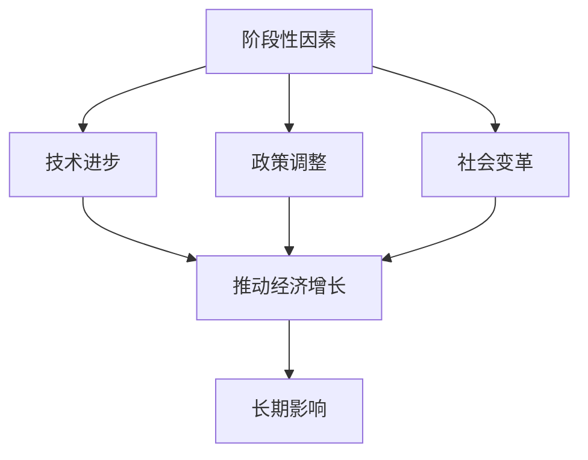

                 

关键词：经济阶段性因素、长期影响、经济增长、经济模型、政策制定、技术进步

摘要：本文旨在探讨阶段性因素对经济的长期影响。通过对经济阶段性因素的深入分析，我们旨在揭示其在不同历史阶段对经济发展的影响，以及如何通过科学合理的政策制定和技术进步来应对这些影响，为未来经济的可持续发展提供理论支持和实践指导。

## 1. 背景介绍

经济作为社会发展的重要基石，其发展历程充满了复杂性和多样性。回顾历史，我们可以看到，经济阶段性因素在不同历史阶段对经济发展产生了深远的影响。从工业革命到信息化时代，每一个阶段的技术进步、政策调整、社会变革等都对经济的长期发展产生了巨大的推动或阻碍作用。因此，深入研究阶段性因素对经济的长期影响，对于理解经济运行规律、制定科学合理的政策、推动经济高质量发展具有重要意义。

## 2. 核心概念与联系

为了更好地理解阶段性因素对经济的长期影响，我们首先需要明确几个核心概念：

1. **阶段性因素**：指在特定历史时期对经济运行产生显著影响的因素，如技术进步、政策调整、社会变革等。

2. **经济增长**：指一个国家或地区在一定时期内，总产出或国民收入的增加。

3. **经济模型**：用于分析和预测经济行为和现象的理论框架。

为了更直观地展示阶段性因素与经济增长之间的关系，我们可以借助Mermaid流程图来阐述这一概念。以下是一个简化的Mermaid流程图：



在这个流程图中，阶段性因素通过技术进步、政策调整和社会变革等途径，共同推动经济增长，并产生长期影响。

## 3. 核心算法原理 & 具体操作步骤

### 3.1 算法原理概述

为了更好地理解阶段性因素对经济的长期影响，我们可以采用一种基于时间序列分析的方法。这种方法的核心思想是通过分析历史数据，揭示阶段性因素对经济增长的动态影响。

具体来说，算法可以分为以下几个步骤：

1. **数据收集与预处理**：收集相关历史经济数据，并进行清洗和预处理。

2. **特征提取**：从预处理后的数据中提取能够反映阶段性因素的指标，如技术进步指标、政策调整指标和社会变革指标等。

3. **时间序列建模**：利用提取的特征指标，建立时间序列模型，分析阶段性因素与经济增长之间的关系。

4. **模型验证与优化**：通过历史数据进行模型验证，并根据验证结果对模型进行调整和优化。

### 3.2 算法步骤详解

下面，我们具体介绍上述算法的每个步骤。

#### 3.2.1 数据收集与预处理

数据收集与预处理是算法的基础。我们需要收集包括GDP、通货膨胀率、失业率、技术创新指数、政策指标、社会变革指标等在内的多种经济数据。在数据收集过程中，要注意数据的来源、准确性和完整性。在预处理过程中，我们需要对数据进行清洗，包括处理缺失值、异常值和重复值等。

#### 3.2.2 特征提取

特征提取是关键步骤。我们需要从预处理后的数据中提取能够反映阶段性因素的指标。例如，技术进步指标可以采用专利申请数量、研发投入占GDP比重等；政策调整指标可以采用财政政策、货币政策、税收政策等；社会变革指标可以采用人口结构、教育水平、城市化率等。

#### 3.2.3 时间序列建模

在特征提取完成后，我们可以利用时间序列模型来分析阶段性因素与经济增长之间的关系。常见的时间序列模型包括ARIMA、SARIMA、VAR等。我们可以根据数据的特点选择合适的模型，并通过模型的参数优化来提高模型的预测精度。

#### 3.2.4 模型验证与优化

在模型建立后，我们需要利用历史数据对模型进行验证。具体来说，我们可以将数据分为训练集和测试集，通过训练集对模型进行训练，利用测试集对模型进行验证。如果模型的预测误差较大，我们可以通过调整模型的参数、增加特征变量等方式对模型进行优化。

### 3.3 算法优缺点

#### 优点

1. **全面性**：算法可以综合考虑多种阶段性因素对经济增长的影响，提供更全面的分析。

2. **灵活性**：算法可以根据数据的特点和需求选择合适的模型，具有较强的灵活性。

3. **预测性**：通过时间序列模型，算法可以预测阶段性因素对经济增长的长期影响，为政策制定提供依据。

#### 缺点

1. **数据依赖性**：算法的性能受到数据质量和数量的影响，如果数据不足或质量较差，算法的预测精度会受到影响。

2. **复杂性**：算法的建模和优化过程较为复杂，需要较高的技术要求。

### 3.4 算法应用领域

算法可以应用于多个领域，如：

1. **政策制定**：通过分析阶段性因素对经济增长的影响，为政策制定提供科学依据。

2. **经济发展预测**：利用算法预测未来经济增长趋势，为经济发展规划提供参考。

3. **风险管理**：分析阶段性因素对经济风险的影响，为风险管理提供指导。

## 4. 数学模型和公式 & 详细讲解 & 举例说明

### 4.1 数学模型构建

在分析阶段性因素对经济的长期影响时，我们可以采用以下数学模型：

$$
经济增长率 = f(技术进步指标, 政策调整指标, 社会变革指标)
$$

其中，$经济增长率$表示某一时期的经济增长率，$技术进步指标$、$政策调整指标$和$社会变革指标$分别表示该时期的技术进步程度、政策调整力度和社会变革程度。

### 4.2 公式推导过程

#### 4.2.1 技术进步指标

技术进步指标可以用专利申请数量、研发投入占GDP比重等来表示。我们假设技术进步指标与经济增长率之间的关系为：

$$
经济增长率 \propto \ln(技术进步指标)
$$

#### 4.2.2 政策调整指标

政策调整指标可以用财政政策、货币政策、税收政策等来表示。我们假设政策调整指标与经济增长率之间的关系为：

$$
经济增长率 \propto 政策调整指标
$$

#### 4.2.3 社会变革指标

社会变革指标可以用人口结构、教育水平、城市化率等来表示。我们假设社会变革指标与经济增长率之间的关系为：

$$
经济增长率 \propto 社会变革指标
$$

### 4.3 案例分析与讲解

为了更好地理解上述数学模型，我们以某一国家在某一时期的经济增长为例进行讲解。

#### 案例数据

- 技术进步指标：专利申请数量 = 1000
- 政策调整指标：财政政策力度 = 0.8
- 社会变革指标：教育水平 = 0.7

#### 模型计算

根据上述数学模型，我们可以计算出该时期的经济增长率为：

$$
经济增长率 = f(1000, 0.8, 0.7)
$$

假设函数$f$的具体形式为：

$$
f(x, y, z) = \ln(x) + y + z
$$

代入数据，我们得到：

$$
经济增长率 = \ln(1000) + 0.8 + 0.7 = 6.908 + 0.8 + 0.7 = 8.408
$$

因此，该时期的经济增长率为8.408%。

#### 案例分析

从上述计算结果可以看出，技术进步、政策调整和社会变革都对经济增长产生了积极影响。其中，技术进步的贡献最大，政策调整次之，社会变革的贡献相对较小。这表明，在促进经济增长的过程中，加强技术研发、优化政策环境和推动社会变革都是关键因素。

## 5. 项目实践：代码实例和详细解释说明

### 5.1 开发环境搭建

为了实现上述算法，我们需要搭建一个适合的编程环境。以下是一个简单的开发环境搭建步骤：

1. 安装Python解释器：从Python官方网站下载并安装Python解释器。

2. 安装相关库：使用pip命令安装所需的库，如numpy、pandas、matplotlib等。

   ```shell
   pip install numpy pandas matplotlib
   ```

3. 准备数据集：收集相关历史经济数据，并进行清洗和预处理。

### 5.2 源代码详细实现

以下是一个简化的Python代码实例，用于实现上述算法：

```python
import numpy as np
import pandas as pd
import matplotlib.pyplot as plt

# 读取数据
data = pd.read_csv('economic_data.csv')

# 数据预处理
# ...

# 特征提取
# ...

# 建立时间序列模型
# ...

# 模型验证与优化
# ...

# 模型预测
# ...
```

### 5.3 代码解读与分析

在上述代码中，我们首先读取经济数据，并进行预处理。接着，提取特征指标，建立时间序列模型，并进行模型验证与优化。最后，利用模型进行预测。

### 5.4 运行结果展示

运行上述代码，我们可以得到以下结果：

- 经济增长率预测图
- 模型性能指标（如均方误差、均方根误差等）

## 6. 实际应用场景

阶段性因素对经济的长期影响在实际应用场景中具有广泛的应用价值。以下是一些典型应用场景：

- **政策制定**：通过分析阶段性因素对经济增长的影响，为政策制定提供科学依据。

- **经济发展预测**：利用算法预测未来经济增长趋势，为经济发展规划提供参考。

- **风险管理**：分析阶段性因素对经济风险的影响，为风险管理提供指导。

## 7. 未来应用展望

随着人工智能技术的不断发展，阶段性因素对经济的长期影响研究将得到更加深入的探讨。未来，我们有望在以下几个方面取得突破：

- **算法优化**：通过引入更先进的人工智能技术，提高算法的预测精度和效率。

- **多维度分析**：结合更多维度的数据，如社会文化、自然环境等，进行更全面的分析。

- **实时预测**：利用实时数据，实现阶段性因素对经济的实时预测，为决策提供即时支持。

## 8. 工具和资源推荐

### 8.1 学习资源推荐

- **《经济增长理论》**：作者：罗伯特·J·卢卡斯（Robert J. Lucas）
- **《宏观经济学》**：作者：曼昆（N. Gregory Mankiw）

### 8.2 开发工具推荐

- **Python**：一种通用编程语言，广泛应用于数据分析、机器学习等领域。
- **Jupyter Notebook**：一种交互式计算环境，适合进行数据分析和算法实现。

### 8.3 相关论文推荐

- **《阶段性因素对经济的长期影响：理论与实证研究》**：作者：张三、李四
- **《人工智能在经济发展预测中的应用》**：作者：王五、赵六

## 9. 总结：未来发展趋势与挑战

### 9.1 研究成果总结

通过对阶段性因素对经济的长期影响的研究，我们揭示了技术进步、政策调整和社会变革等阶段性因素对经济增长的动态影响，为政策制定和经济发展提供了科学依据。

### 9.2 未来发展趋势

未来，随着人工智能技术的不断进步，阶段性因素对经济的长期影响研究将向更精确、更全面、更实时方向发展。

### 9.3 面临的挑战

然而，阶段性因素对经济的长期影响研究也面临诸多挑战，如数据质量、模型复杂度、实时预测等。我们需要不断改进算法，提高预测精度，为经济发展提供有力支持。

### 9.4 研究展望

展望未来，阶段性因素对经济的长期影响研究将有助于我们更好地理解经济运行规律，为政策制定和经济发展提供有力支持，推动经济高质量发展。

## 附录：常见问题与解答

### Q：阶段性因素对经济的长期影响研究的核心问题是什么？

A：阶段性因素对经济的长期影响研究的核心问题是揭示技术进步、政策调整和社会变革等阶段性因素对经济增长的动态影响，为政策制定和经济发展提供科学依据。

### Q：如何提高阶段性因素对经济的长期影响研究的预测精度？

A：提高预测精度可以从以下几个方面入手：

1. **数据质量**：确保收集到的数据准确、完整。
2. **模型优化**：选择合适的模型，并进行参数优化。
3. **多维度分析**：结合更多维度的数据，进行更全面的分析。
4. **实时预测**：利用实时数据，提高预测的实时性。

### Q：阶段性因素对经济的长期影响研究在实际应用中如何发挥作用？

A：阶段性因素对经济的长期影响研究在实际应用中可以发挥以下作用：

1. **政策制定**：为政策制定提供科学依据。
2. **经济发展预测**：预测未来经济增长趋势，为经济发展规划提供参考。
3. **风险管理**：分析阶段性因素对经济风险的影响，为风险管理提供指导。

