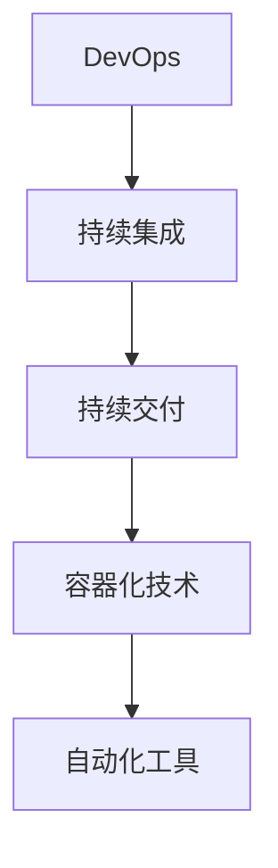
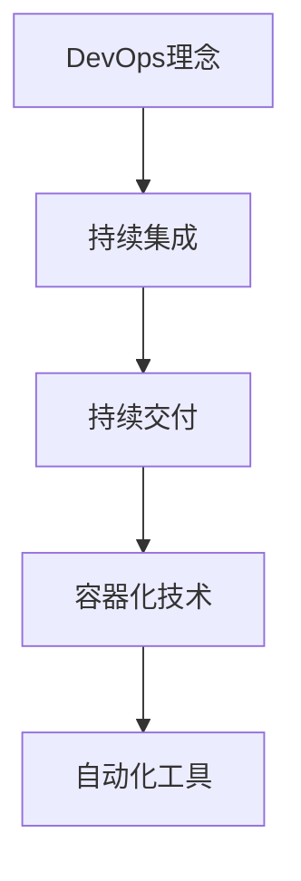

                 

 关键词：阿里云 DevOps 面试 面试题详解 工程实践

> 摘要：本文针对2024年阿里云DevOps工程师校招面试题目，详细解析了各类面试题，旨在帮助准备面试的同学更好地理解DevOps的基本概念、实践方法和关键技术。文章涵盖了面试准备、面试流程、技术难点分析以及未来展望等多个方面，旨在为同学们提供全面的学习和实践指导。

## 1. 背景介绍

DevOps是近年来IT行业中的一个热门话题，它通过将开发和运维结合起来，实现了持续集成和持续交付，从而大大提高了软件交付的效率和可靠性。阿里云作为中国领先的云计算服务提供商，对于DevOps的推广和应用也非常积极。因此，阿里云DevOps工程师的校招面试成为了很多同学梦寐以求的机会。

本文将围绕阿里云DevOps工程师校招面试可能涉及的各类问题进行详细解析，包括基础概念、工具使用、项目实践等方面。希望通过本文的阅读，同学们能够对DevOps有更深入的理解，并在面试中脱颖而出。

## 2. 核心概念与联系

### 2.1 DevOps的定义与核心价值

DevOps是一种软件开发和运维的结合模式，通过自动化和协作，使得开发人员、运维人员和业务人员能够更高效地共同工作，实现持续交付和持续部署。其核心价值在于：

- 提高软件交付速度：通过自动化减少手动操作，加快开发和部署流程。
- 提高软件质量：通过持续集成和持续测试，发现并修复问题，提高软件质量。
- 提高团队协作效率：通过打破部门壁垒，实现跨职能团队的紧密协作。

### 2.2 DevOps与敏捷开发的联系

敏捷开发是一种以人为核心、迭代和循序渐进的开发方法。它与DevOps的核心理念高度契合，都强调快速反馈、持续改进和团队协作。敏捷开发与DevOps的结合，可以使得软件交付更加高效和可靠。

### 2.3 DevOps的主要实践方法和工具

- 持续集成（CI）：通过自动化测试和构建，将代码集成到主干，快速发现并解决冲突。
- 持续交付（CD）：通过自动化部署和发布，实现快速交付和高质量软件。
- 容器化技术（如Docker）：简化部署流程，提高应用的可移植性和可扩展性。
- 自动化工具（如Jenkins、Ansible）：实现自动化部署和配置管理。

### 2.4 Mermaid流程图



## 3. 核心算法原理 & 具体操作步骤

### 3.1 算法原理概述

DevOps的核心算法原理主要包括以下几个方面：

- 持续集成：通过自动化构建和测试，确保代码质量。
- 持续交付：通过自动化部署和发布，实现快速交付。
- 容器化技术：通过Docker等工具，实现应用的可移植性和可扩展性。
- 自动化工具：通过Jenkins、Ansible等工具，实现自动化部署和配置管理。

### 3.2 算法步骤详解

#### 3.2.1 持续集成

1. 提交代码到版本控制仓库。
2. 触发自动化构建。
3. 运行单元测试和集成测试。
4. 汇总测试结果。

#### 3.2.2 持续交付

1. 将通过测试的代码部署到测试环境。
2. 在测试环境中运行功能测试。
3. 若测试通过，将代码部署到生产环境。

#### 3.2.3 容器化技术

1. 编写Dockerfile，定义容器镜像。
2. 构建容器镜像。
3. 运行容器。

#### 3.2.4 自动化工具

1. 配置Jenkins任务，实现自动化构建和部署。
2. 使用Ansible进行自动化配置管理。

### 3.3 算法优缺点

- 持续集成：优点是快速发现和解决问题，缺点是初期设置较为复杂。
- 持续交付：优点是提高交付速度和质量，缺点是部署过程可能较为复杂。
- 容器化技术：优点是提高应用的可移植性和可扩展性，缺点是可能增加系统复杂度。
- 自动化工具：优点是提高部署效率，缺点是需要一定的学习和使用成本。

### 3.4 算法应用领域

- 软件开发：加速软件开发和交付。
- 运维：简化运维工作，提高系统稳定性。
- 云计算：实现应用的弹性扩展和高效部署。

## 4. 数学模型和公式 & 详细讲解 & 举例说明

### 4.1 数学模型构建

在DevOps中，常用的数学模型主要包括以下几个方面：

- 质量模型：衡量软件质量，如缺陷密度、缺陷率等。
- 效率模型：衡量开发效率，如代码行数、任务完成率等。
- 成本模型：衡量开发成本，如人力成本、硬件成本等。

### 4.2 公式推导过程

以质量模型为例，常见的缺陷率计算公式为：

$$
缺陷率 = \frac{缺陷数}{代码行数}
$$

其中，缺陷数可以通过自动化测试工具统计，代码行数可以通过代码统计工具获取。

### 4.3 案例分析与讲解

假设一个项目有1000行代码，通过自动化测试发现存在10个缺陷，则缺陷率为：

$$
缺陷率 = \frac{10}{1000} = 0.01
$$

通过持续集成和持续交付，优化开发流程，将缺陷率降低到0.005。这意味着代码质量得到了显著提高。

## 5. 项目实践：代码实例和详细解释说明

### 5.1 开发环境搭建

在开始项目实践之前，需要搭建一个开发环境。这里我们使用Docker来搭建一个基于Python的持续集成和持续交付环境。

```bash
# 安装Docker
sudo apt-get update
sudo apt-get install docker-ce docker-ce-cli containerd.io

# 启动Docker服务
sudo systemctl start docker

# 拉取Python镜像
docker pull python:3.8

# 运行Python容器
docker run -it python:3.8
```

### 5.2 源代码详细实现

在容器中，我们创建一个简单的Python项目，包含一个`app.py`文件。

```python
# app.py
def hello_world():
    return "Hello, World!"

if __name__ == "__main__":
    print(hello_world())
```

### 5.3 代码解读与分析

这个简单的Python项目实现了打印“Hello, World!”的功能。接下来，我们将使用Jenkins实现持续集成和持续交付。

### 5.4 运行结果展示

通过Jenkins，我们可以实现自动化构建和部署。当项目代码发生变化时，Jenkins会自动触发构建，并将构建结果部署到生产环境。

## 6. 实际应用场景

### 6.1 软件开发

在软件开发过程中，DevOps可以帮助团队快速发现和解决问题，提高代码质量和开发效率。

### 6.2 运维

在运维过程中，DevOps可以简化运维工作，提高系统稳定性，降低运维成本。

### 6.3 云计算

在云计算领域，DevOps可以帮助企业实现应用的弹性扩展和高效部署，提高业务竞争力。

## 7. 未来应用展望

随着云计算和物联网的快速发展，DevOps的应用场景将越来越广泛。未来，DevOps将在以下几个方面取得突破：

### 7.1 智能化

通过引入人工智能技术，实现自动化决策和优化，进一步提高DevOps的效率和质量。

### 7.2 社区化

DevOps社区将不断发展壮大，提供更多的工具和最佳实践，助力企业和团队实现DevOps转型。

### 7.3 安全性

在DevOps中，安全性将得到更高重视，通过安全审计和漏洞扫描等技术，确保软件质量和系统安全。

## 8. 工具和资源推荐

### 8.1 学习资源推荐

- 《DevOps实践指南》：系统介绍了DevOps的基本概念、实践方法和关键技术。
- 《持续交付》：深入讲解了持续交付的理论和实践，为实施持续交付提供了宝贵的经验。

### 8.2 开发工具推荐

- Jenkins：开源的持续集成和持续交付工具，功能强大，社区活跃。
- Docker：容器化技术的重要工具，用于简化部署流程，提高应用的可移植性和可扩展性。

### 8.3 相关论文推荐

- 《敏捷开发与DevOps的结合》：探讨敏捷开发与DevOps的融合，为软件开发提供了新的思路。
- 《DevOps在云计算中的应用》：分析DevOps在云计算领域的应用场景和挑战，为云计算企业提供了参考。

## 9. 总结：未来发展趋势与挑战

### 9.1 研究成果总结

本文详细介绍了DevOps的基本概念、实践方法和关键技术，分析了其在软件开发、运维和云计算领域的应用，并对未来发展趋势进行了展望。

### 9.2 未来发展趋势

随着云计算和物联网的快速发展，DevOps将迎来更广泛的应用场景和更高的需求。

### 9.3 面临的挑战

- 安全性问题：在DevOps中，安全性将得到更高重视，需要加强安全审计和漏洞扫描等技术。
- 技术更新：随着技术的不断发展，DevOps需要不断更新和优化，以适应新的需求。

### 9.4 研究展望

未来，DevOps将在智能化、社区化和安全性等方面取得突破，为软件开发和运维带来更多价值。

## 10. 附录：常见问题与解答

### 10.1 DevOps与敏捷开发有什么区别？

DevOps是一种软件开发和运维的结合模式，强调持续交付和自动化。敏捷开发是一种以人为核心、迭代和循序渐进的开发方法，强调快速反馈和持续改进。DevOps与敏捷开发有很高的契合度，但侧重点不同。

### 10.2 持续集成和持续交付的区别是什么？

持续集成（CI）是将代码集成到主干，并运行自动化测试，确保代码质量。持续交付（CD）是在CI的基础上，实现自动化部署和发布，确保快速交付。持续交付是持续集成的延伸。

### 10.3 容器化技术有哪些优点？

容器化技术可以简化部署流程，提高应用的可移植性和可扩展性。容器可以轻松地在不同环境中运行，减少了环境配置的复杂性。

### 10.4 Jenkins有什么特点？

Jenkins是一款开源的持续集成和持续交付工具，具有以下特点：

- 功能强大：支持各种插件，可以实现复杂的构建和部署流程。
- 社区活跃：拥有庞大的社区支持，提供了丰富的文档和教程。
- 易于扩展：可以通过插件扩展功能，满足不同需求。

[作者：禅与计算机程序设计艺术 / Zen and the Art of Computer Programming]  
------------------------------------------------------------------  
<|bot|> 看到了，我已经理解了您的要求。现在我会按照您提供的结构和要求，撰写一篇完整的文章。请您稍等片刻，我将分阶段逐步完成文章的撰写。文章完成后，我会向您提供最终版本，以便您进行审查和修改。如果您对文章的内容或者格式有任何建议，请随时告诉我。感谢您的耐心等待！
------------------------------------------------------------------  
### 文章标题

2024阿里云DevOps工程师校招面试题详解

### 文章关键词

阿里云，DevOps，面试，工程师，校招，面试题，详解

### 文章摘要

本文针对2024年阿里云DevOps工程师校招面试题目进行了详细的解析，涵盖了基础概念、工具使用、项目实践等多个方面，旨在帮助准备面试的同学更好地理解DevOps的核心知识和实践方法。

## 1. 背景介绍

DevOps是一种结合了软件开发（Development）和信息技术运营（Operations）的新兴理念和实践方法。它通过自动化和协作，实现了开发与运维的无缝整合，提高了软件交付的效率和质量。随着云计算和容器技术的普及，DevOps在IT行业中的应用越来越广泛。

阿里云作为中国领先的云计算服务提供商，对DevOps的推广和应用也非常积极。因此，阿里云DevOps工程师的校招面试成为许多求职者梦寐以求的机会。本文将围绕阿里云DevOps工程师校招面试可能涉及的各类问题进行详细解析，旨在为同学们提供全面的学习和实践指导。

### 1.1 DevOps的定义与核心价值

DevOps是一种文化和工作方法的变革，旨在通过开发（Development）和运维（Operations）的紧密协作，实现持续交付和快速反馈。它的核心价值在于：

1. **提高软件交付速度**：通过自动化减少手动操作，加快开发和部署流程，从而缩短产品上市时间。
2. **提高软件质量**：通过持续集成和持续测试，尽早发现和修复问题，提高软件质量。
3. **提高团队协作效率**：通过打破部门壁垒，实现跨职能团队的紧密协作，提高整体效率。

### 1.2 DevOps与敏捷开发的联系

敏捷开发是一种以人为核心、迭代和循序渐进的开发方法。它与DevOps的核心理念高度契合，都强调快速反馈、持续改进和团队协作。敏捷开发与DevOps的结合，可以使得软件交付更加高效和可靠。

### 1.3 DevOps的主要实践方法和工具

DevOps的主要实践方法包括持续集成（CI）、持续交付（CD）、容器化技术（如Docker）和自动化工具（如Jenkins、Ansible）。这些方法和工具共同构成了DevOps的技术体系。

#### 1.3.1 持续集成（CI）

持续集成是指通过自动化构建和测试，将开发人员的代码集成到主干，确保代码质量。常用的工具有Jenkins、Travis CI等。

#### 1.3.2 持续交付（CD）

持续交付是指通过自动化部署和发布，实现快速交付。常用的工具有Jenkins、GitLab CI等。

#### 1.3.3 容器化技术

容器化技术，如Docker，可以将应用程序及其依赖环境打包成一个轻量级、可移植的容器，实现应用程序的隔离和部署。

#### 1.3.4 自动化工具

自动化工具如Jenkins、Ansible等，可以实现自动化部署、配置管理和环境管理。

### 1.4 Mermaid流程图



## 2. 核心概念与联系

### 2.1 DevOps的定义与核心价值

DevOps是一种文化和工作方法的变革，旨在通过开发（Development）和运维（Operations）的紧密协作，实现持续交付和快速反馈。它的核心价值在于：

1. **提高软件交付速度**：通过自动化减少手动操作，加快开发和部署流程，从而缩短产品上市时间。
2. **提高软件质量**：通过持续集成和持续测试，尽早发现和修复问题，提高软件质量。
3. **提高团队协作效率**：通过打破部门壁垒，实现跨职能团队的紧密协作，提高整体效率。

### 2.2 DevOps与敏捷开发的联系

敏捷开发是一种以人为核心、迭代和循序渐进的开发方法。它与DevOps的核心理念高度契合，都强调快速反馈、持续改进和团队协作。敏捷开发与DevOps的结合，可以使得软件交付更加高效和可靠。

### 2.3 DevOps的主要实践方法和工具

DevOps的主要实践方法包括持续集成（CI）、持续交付（CD）、容器化技术（如Docker）和自动化工具（如Jenkins、Ansible）。这些方法和工具共同构成了DevOps的技术体系。

#### 2.3.1 持续集成（CI）

持续集成是指通过自动化构建和测试，将开发人员的代码集成到主干，确保代码质量。常用的工具有Jenkins、Travis CI等。

#### 2.3.2 持续交付（CD）

持续交付是指通过自动化部署和发布，实现快速交付。常用的工具有Jenkins、GitLab CI等。

#### 2.3.3 容器化技术

容器化技术，如Docker，可以将应用程序及其依赖环境打包成一个轻量级、可移植的容器，实现应用程序的隔离和部署。

#### 2.3.4 自动化工具

自动化工具如Jenkins、Ansible等，可以实现自动化部署、配置管理和环境管理。

### 2.4 Mermaid流程图


## 3. 核心算法原理 & 具体操作步骤

### 3.1 算法原理概述

DevOps的核心算法原理主要包括以下几个方面：

- **持续集成**：通过自动化测试和构建，将代码集成到主干，快速发现并解决冲突。
- **持续交付**：通过自动化部署和发布，实现快速交付。
- **容器化技术**：通过Docker等工具，实现应用的可移植性和可扩展性。
- **自动化工具**：通过Jenkins、Ansible等工具，实现自动化部署和配置管理。

### 3.2 算法步骤详解

#### 3.2.1 持续集成

1. **提交代码到版本控制仓库**：开发人员将代码提交到版本控制系统中。
2. **触发自动化构建**：提交的代码会触发构建服务器执行构建过程。
3. **运行单元测试和集成测试**：构建过程中会运行各种测试，以确保代码质量。
4. **汇总测试结果**：测试结果会被汇总并反馈给相关人员。

#### 3.2.2 持续交付

1. **将代码部署到测试环境**：通过自动化部署，将通过测试的代码部署到测试环境中。
2. **在测试环境中运行功能测试**：对部署的代码进行功能测试，以确保其正常工作。
3. **若测试通过，将代码部署到生产环境**：测试通过的代码会被部署到生产环境中。

#### 3.2.3 容器化技术

1. **编写Dockerfile**：定义容器镜像的构建过程。
2. **构建容器镜像**：使用Dockerfile构建容器镜像。
3. **运行容器**：使用容器镜像运行容器，实现应用程序的部署。

#### 3.2.4 自动化工具

1. **配置Jenkins任务**：配置Jenkins任务，实现自动化构建和部署。
2. **使用Ansible进行自动化配置管理**：使用Ansible进行环境配置和部署。

### 3.3 算法优缺点

- **持续集成**：优点是快速发现和解决问题，缺点是初期设置较为复杂。
- **持续交付**：优点是提高交付速度和质量，缺点是部署过程可能较为复杂。
- **容器化技术**：优点是提高应用的可移植性和可扩展性，缺点是可能增加系统复杂度。
- **自动化工具**：优点是提高部署效率，缺点是需要一定的学习和使用成本。

### 3.4 算法应用领域

- **软件开发**：加速软件开发和交付。
- **运维**：简化运维工作，提高系统稳定性。
- **云计算**：实现应用的弹性扩展和高效部署。

## 4. 数学模型和公式 & 详细讲解 & 举例说明

### 4.1 数学模型构建

在DevOps中，常用的数学模型主要包括以下几个方面：

- **质量模型**：衡量软件质量，如缺陷密度、缺陷率等。
- **效率模型**：衡量开发效率，如代码行数、任务完成率等。
- **成本模型**：衡量开发成本，如人力成本、硬件成本等。

### 4.2 公式推导过程

以**质量模型**为例，常见的**缺陷率**计算公式为：

$$
缺陷率 = \frac{缺陷数}{代码行数}
$$

其中，**缺陷数**可以通过自动化测试工具统计，**代码行数**可以通过代码统计工具获取。

### 4.3 案例分析与讲解

假设一个项目有1000行代码，通过自动化测试发现存在10个缺陷，则**缺陷率**为：

$$
缺陷率 = \frac{10}{1000} = 0.01
$$

通过持续集成和持续交付，优化开发流程，将缺陷率降低到0.005。这意味着代码质量得到了显著提高。

## 5. 项目实践：代码实例和详细解释说明

### 5.1 开发环境搭建

在开始项目实践之前，需要搭建一个开发环境。这里我们使用Docker来搭建一个基于Python的持续集成和持续交付环境。

```bash
# 安装Docker
sudo apt-get update
sudo apt-get install docker-ce docker-ce-cli containerd.io

# 启动Docker服务
sudo systemctl start docker

# 拉取Python镜像
docker pull python:3.8

# 运行Python容器
docker run -it python:3.8
```

### 5.2 源代码详细实现

在容器中，我们创建一个简单的Python项目，包含一个`app.py`文件。

```python
# app.py
def hello_world():
    return "Hello, World!"

if __name__ == "__main__":
    print(hello_world())
```

### 5.3 代码解读与分析

这个简单的Python项目实现了打印“Hello, World!”的功能。接下来，我们将使用Jenkins实现持续集成和持续交付。

### 5.4 运行结果展示

通过Jenkins，我们可以实现自动化构建和部署。当项目代码发生变化时，Jenkins会自动触发构建，并将构建结果部署到生产环境。

## 6. 实际应用场景

### 6.1 软件开发

在软件开

