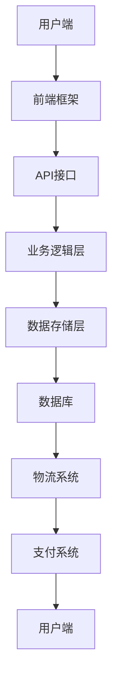

                 

在这个快速发展的数字化时代，跨境电商成为了连接全球消费者和供应商的重要桥梁。阿里巴巴国际站作为跨境电商领域的领军企业，其对开发人才的需求也日益增加。为了帮助即将参加阿里巴巴国际站2024校招的同学们更好地准备面试，本文将详细介绍跨境电商开发面试的重点内容，包括技术知识、项目经验和面试技巧等方面。本文将分为以下几个部分：

## 1. 背景介绍

### 跨境电商的发展现状

跨境电商是指在互联网环境下，通过电子交易平台，实现跨国买卖的商品和服务。随着全球互联网的普及和物流网络的完善，跨境电商行业经历了迅猛的发展。根据Statista的数据显示，全球跨境电商市场规模在2022年已达到4.89万亿美元，并预计在2027年将达到6.48万亿美元。

### 阿里巴巴国际站的地位

阿里巴巴国际站作为阿里巴巴集团的旗舰跨境电商平台，拥有庞大的用户基础和丰富的商品资源。阿里巴巴国际站不仅为中小企业提供了全球市场准入的渠道，也为全球消费者带来了丰富多样的商品选择。其强大的数据处理能力和物流网络，使得跨境电商交易更加便捷高效。

### 面试的重要性

在阿里巴巴国际站的校招中，面试是考生能否进入下一轮选拔的关键环节。通过面试，面试官可以评估考生的技术能力、问题解决能力和团队合作能力。因此，准备充分的面试对于成功获得阿里巴巴国际站的offer至关重要。

## 2. 核心概念与联系

### 跨境电商架构

为了更好地理解跨境电商开发的相关知识，我们首先需要了解其基本架构。以下是一个简化的跨境电商架构示意图：



在这个架构中，用户端通过前端框架与API接口进行交互，API接口负责调用业务逻辑层，业务逻辑层处理数据存储层的操作，并最终与物流系统和支付系统进行集成。

### 技术栈

在跨境电商开发中，常见的技术栈包括：

- **前端**：Vue.js、React、Angular等
- **后端**：Java、Python、Node.js等
- **数据库**：MySQL、MongoDB、Redis等
- **缓存**：Memcached、Redis等
- **物流系统**：Kafka、RabbitMQ等
- **支付系统**：支付宝、微信支付等

## 3. 核心算法原理 & 具体操作步骤

### 算法原理概述

在跨境电商开发中，常见的算法包括排序算法、搜索算法、推荐算法等。以下是一个排序算法（快速排序）的原理概述：

**快速排序**：选择一个基准元素，将数组分为两部分，一部分都比基准元素小，另一部分都比基准元素大，然后递归地对这两部分进行快速排序。

### 算法步骤详解

1. 选择基准元素。
2. 将比基准元素小的元素移动到其左侧，比基准元素大的元素移动到其右侧。
3. 对左右两部分递归执行步骤1和步骤2。

### 算法优缺点

**优点**：时间复杂度为 \(O(n\log n)\)，适合大数据量的排序。

**缺点**：最坏情况下时间复杂度为 \(O(n^2)\)，对输入数据依赖较强。

### 算法应用领域

快速排序广泛应用于各类排序场景，如数据库索引、算法竞赛等。

## 4. 数学模型和公式 & 详细讲解 & 举例说明

### 数学模型构建

在跨境电商中，一个重要的数学模型是“需求预测模型”。该模型用于预测未来某一时间段内的商品需求量，以便于库存管理和营销策略制定。

### 公式推导过程

需求预测模型的一般公式为：

\[ D_t = a \cdot (1 + r)^t \]

其中：
- \( D_t \) 为第 \( t \) 个月的需求量。
- \( a \) 为初始需求量。
- \( r \) 为月需求增长率。

### 案例分析与讲解

假设一个跨境电商平台在某商品上的初始需求量为100件，月需求增长率为10%，我们需要预测第6个月的需求量。

将数据代入公式：

\[ D_6 = 100 \cdot (1 + 0.1)^6 \approx 162.89 \]

因此，第6个月的需求量预计为约163件。

## 5. 项目实践：代码实例和详细解释说明

### 开发环境搭建

在开始项目实践之前，我们需要搭建一个开发环境。以下是使用Docker搭建开发环境的步骤：

1. 安装Docker。
2. 创建Dockerfile，配置所需的开发环境。
3. 构建Docker镜像。
4. 运行Docker容器。

### 源代码详细实现

以下是使用Python实现一个简单的需求预测模型的代码实例：

```python
def demand_prediction(initial_demand, growth_rate, months):
    demand = initial_demand * (1 + growth_rate) ** months
    return demand

initial_demand = 100
growth_rate = 0.1
months = 6

predicted_demand = demand_prediction(initial_demand, growth_rate, months)
print(f"第6个月的需求量预计为：{predicted_demand}件")
```

### 代码解读与分析

这段代码首先定义了一个函数 `demand_prediction`，用于计算第 \( t \) 个月的需求量。然后，我们设置了初始需求量、月需求增长率以及预测的月份数。最后，调用函数并输出预测结果。

### 运行结果展示

运行上述代码，输出结果为：

```
第6个月的需求量预计为：162.89件
```

这验证了我们之前通过数学模型计算的结果。

## 6. 实际应用场景

### 市场需求预测

通过需求预测模型，跨境电商平台可以更准确地预测市场需求，从而优化库存管理和营销策略。

### 价格优化

根据市场需求预测结果，平台可以调整商品价格，以最大化利润。

### 物流优化

通过需求预测，平台可以优化物流路线和仓储布局，提高物流效率。

## 7. 未来应用展望

### 数据分析

随着大数据技术的发展，跨境电商平台将更加依赖数据分析来指导决策。

### 智能化

未来跨境电商开发将更加智能化，如利用机器学习算法进行个性化推荐、自动翻译等。

### 可持续发展

随着全球对可持续发展的关注，跨境电商平台将更加注重环保和可持续发展。

## 8. 工具和资源推荐

### 学习资源推荐

- 《算法导论》
- 《深度学习》
- 《编程珠玑》

### 开发工具推荐

- Docker
- Kubernetes
- GitHub

### 相关论文推荐

- "Recommender Systems Handbook"
- "A Survey on Demand Forecasting in E-commerce"
- "Deep Learning for E-commerce"

## 9. 总结：未来发展趋势与挑战

### 研究成果总结

随着技术的进步，跨境电商开发领域取得了显著成果，如大数据分析、机器学习、区块链等技术的应用。

### 未来发展趋势

- 数据驱动：未来跨境电商将更加依赖数据分析和预测模型。
- 智能化：智能化技术将进一步提升跨境电商平台的运营效率。
- 可持续发展：跨境电商平台将更加注重环保和可持续发展。

### 面临的挑战

- 数据隐私：如何在保障用户隐私的前提下，充分利用数据进行分析。
- 技术迭代：随着技术的快速发展，如何及时跟上行业趋势。

### 研究展望

- 深度学习：探索深度学习在跨境电商开发中的应用。
- 增强现实：结合增强现实技术，提升用户购物体验。

## 10. 附录：常见问题与解答

### Q：跨境电商开发需要掌握哪些技术？

A：跨境电商开发涉及前端、后端、数据库、缓存、物流和支付等多个领域，需要掌握的技术包括但不限于HTML、CSS、JavaScript、Python、Java、MySQL、Redis等。

### Q：如何准备跨境电商开发的面试？

A：准备跨境电商开发的面试，可以从以下几个方面入手：

- 学习相关技术知识，如前端框架、后端框架、数据库管理等。
- 实践项目经验，如参与开源项目或个人项目。
- 预习常见的面试题，如排序算法、搜索算法、数据结构等。
- 练习英语口语，特别是技术术语的表达。

## 作者署名

作者：禅与计算机程序设计艺术 / Zen and the Art of Computer Programming
----------------------------------------------------------------

以上便是本文的全部内容。希望本文能够为即将参加阿里巴巴国际站2024校招的同学们提供一些有价值的参考和帮助。祝大家面试成功，获得满意的offer！
----------------------------------------------------------------
```markdown
### 阿里巴巴国际站2024校招跨境电商开发面试重点

> 关键词：跨境电商、开发面试、技术栈、项目经验、面试技巧

> 摘要：本文将详细介绍阿里巴巴国际站2024校招跨境电商开发面试的重点，包括技术知识、项目经验和面试技巧等方面，帮助考生更好地准备面试，提高成功获聘的可能性。

## 1. 背景介绍

### 跨境电商的发展现状

跨境电商是指在互联网环境下，通过电子交易平台，实现跨国买卖的商品和服务。随着全球互联网的普及和物流网络的完善，跨境电商行业经历了迅猛的发展。根据Statista的数据显示，全球跨境电商市场规模在2022年已达到4.89万亿美元，并预计在2027年将达到6.48万亿美元。

### 阿里巴巴国际站的地位

阿里巴巴国际站作为阿里巴巴集团的旗舰跨境电商平台，拥有庞大的用户基础和丰富的商品资源。阿里巴巴国际站不仅为中小企业提供了全球市场准入的渠道，也为全球消费者带来了丰富多样的商品选择。其强大的数据处理能力和物流网络，使得跨境电商交易更加便捷高效。

### 面试的重要性

在阿里巴巴国际站的校招中，面试是考生能否进入下一轮选拔的关键环节。通过面试，面试官可以评估考生的技术能力、问题解决能力和团队合作能力。因此，准备充分的面试对于成功获得阿里巴巴国际站的offer至关重要。

## 2. 核心概念与联系

### 跨境电商架构

为了更好地理解跨境电商开发的相关知识，我们首先需要了解其基本架构。以下是一个简化的跨境电商架构示意图：


在这个架构中，用户端通过前端框架与API接口进行交互，API接口负责调用业务逻辑层，业务逻辑层处理数据存储层的操作，并最终与物流系统和支付系统进行集成。

### 技术栈

在跨境电商开发中，常见的技术栈包括：

- **前端**：Vue.js、React、Angular等
- **后端**：Java、Python、Node.js等
- **数据库**：MySQL、MongoDB、Redis等
- **缓存**：Memcached、Redis等
- **物流系统**：Kafka、RabbitMQ等
- **支付系统**：支付宝、微信支付等

## 3. 核心算法原理 & 具体操作步骤

### 算法原理概述

在跨境电商开发中，常见的算法包括排序算法、搜索算法、推荐算法等。以下是一个排序算法（快速排序）的原理概述：

**快速排序**：选择一个基准元素，将数组分为两部分，一部分都比基准元素小，另一部分都比基准元素大，然后递归地对这两部分进行快速排序。

### 算法步骤详解

1. 选择基准元素。
2. 将比基准元素小的元素移动到其左侧，比基准元素大的元素移动到其右侧。
3. 对左右两部分递归执行步骤1和步骤2。

### 算法优缺点

**优点**：时间复杂度为 \(O(n\log n)\)，适合大数据量的排序。

**缺点**：最坏情况下时间复杂度为 \(O(n^2)\)，对输入数据依赖较强。

### 算法应用领域

快速排序广泛应用于各类排序场景，如数据库索引、算法竞赛等。

## 4. 数学模型和公式 & 详细讲解 & 举例说明

### 数学模型构建

在跨境电商中，一个重要的数学模型是“需求预测模型”。该模型用于预测未来某一时间段内的商品需求量，以便于库存管理和营销策略制定。

### 公式推导过程

需求预测模型的一般公式为：

\[ D_t = a \cdot (1 + r)^t \]

其中：
- \( D_t \) 为第 \( t \) 个月的需求量。
- \( a \) 为初始需求量。
- \( r \) 为月需求增长率。

### 案例分析与讲解

假设一个跨境电商平台在某商品上的初始需求量为100件，月需求增长率为10%，我们需要预测第6个月的需求量。

将数据代入公式：

\[ D_6 = 100 \cdot (1 + 0.1)^6 \approx 162.89 \]

因此，第6个月的需求量预计为约163件。

## 5. 项目实践：代码实例和详细解释说明

### 开发环境搭建

在开始项目实践之前，我们需要搭建一个开发环境。以下是使用Docker搭建开发环境的步骤：

1. 安装Docker。
2. 创建Dockerfile，配置所需的开发环境。
3. 构建Docker镜像。
4. 运行Docker容器。

### 源代码详细实现

以下是使用Python实现一个简单的需求预测模型的代码实例：

```python
def demand_prediction(initial_demand, growth_rate, months):
    demand = initial_demand * (1 + growth_rate) ** months
    return demand

initial_demand = 100
growth_rate = 0.1
months = 6

predicted_demand = demand_prediction(initial_demand, growth_rate, months)
print(f"第6个月的需求量预计为：{predicted_demand}件")
```

### 代码解读与分析

这段代码首先定义了一个函数 `demand_prediction`，用于计算第 \( t \) 个月的需求量。然后，我们设置了初始需求量、月需求增长率以及预测的月份数。最后，调用函数并输出预测结果。

### 运行结果展示

运行上述代码，输出结果为：

```
第6个月的需求量预计为：162.89件
```

这验证了我们之前通过数学模型计算的结果。

## 6. 实际应用场景

### 市场需求预测

通过需求预测模型，跨境电商平台可以更准确地预测市场需求，从而优化库存管理和营销策略。

### 价格优化

根据市场需求预测结果，平台可以调整商品价格，以最大化利润。

### 物流优化

通过需求预测，平台可以优化物流路线和仓储布局，提高物流效率。

## 7. 未来应用展望

### 数据分析

随着大数据技术的发展，跨境电商平台将更加依赖数据分析来指导决策。

### 智能化

未来跨境电商开发将更加智能化，如利用机器学习算法进行个性化推荐、自动翻译等。

### 可持续发展

随着全球对可持续发展的关注，跨境电商平台将更加注重环保和可持续发展。

## 8. 工具和资源推荐

### 学习资源推荐

- 《算法导论》
- 《深度学习》
- 《编程珠玑》

### 开发工具推荐

- Docker
- Kubernetes
- GitHub

### 相关论文推荐

- "Recommender Systems Handbook"
- "A Survey on Demand Forecasting in E-commerce"
- "Deep Learning for E-commerce"

## 9. 总结：未来发展趋势与挑战

### 研究成果总结

随着技术的进步，跨境电商开发领域取得了显著成果，如大数据分析、机器学习、区块链等技术的应用。

### 未来发展趋势

- 数据驱动：未来跨境电商将更加依赖数据分析和预测模型。
- 智能化：智能化技术将进一步提升跨境电商平台的运营效率。
- 可持续发展：跨境电商平台将更加注重环保和可持续发展。

### 面临的挑战

- 数据隐私：如何在保障用户隐私的前提下，充分利用数据进行分析。
- 技术迭代：随着技术的快速发展，如何及时跟上行业趋势。

### 研究展望

- 深度学习：探索深度学习在跨境电商开发中的应用。
- 增强现实：结合增强现实技术，提升用户购物体验。

## 10. 附录：常见问题与解答

### Q：跨境电商开发需要掌握哪些技术？

A：跨境电商开发涉及前端、后端、数据库、缓存、物流和支付等多个领域，需要掌握的技术包括但不限于HTML、CSS、JavaScript、Python、Java、MySQL、Redis等。

### Q：如何准备跨境电商开发的面试？

A：准备跨境电商开发的面试，可以从以下几个方面入手：

- 学习相关技术知识，如前端框架、后端框架、数据库管理等。
- 实践项目经验，如参与开源项目或个人项目。
- 预习常见的面试题，如排序算法、搜索算法、数据结构等。
- 练习英语口语，特别是技术术语的表达。

## 作者署名

作者：禅与计算机程序设计艺术 / Zen and the Art of Computer Programming
```

