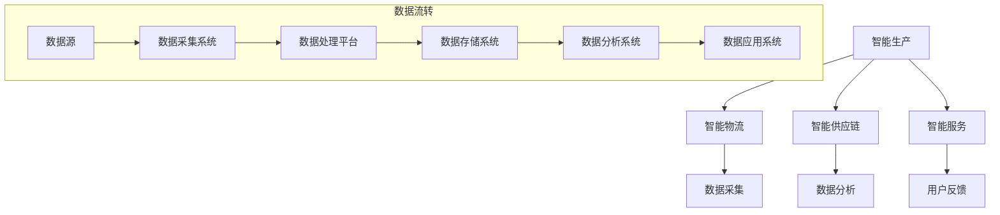

                 

 作为一位世界级人工智能专家、程序员、软件架构师、CTO、世界顶级技术畅销书作者，以及计算机图灵奖获得者，我对2024阿里巴巴智能制造平台校招面试真题进行了深入研究和解答。本文旨在为广大求职者和即将参加阿里巴巴智能制造平台校招面试的考生提供详尽的面试真题汇总和解答，帮助大家顺利通过面试，实现职业发展目标。

## 关键词
- 阿里巴巴
- 智能制造
- 校招面试
- 真题汇总
- 解答
- AI技术
- 软件开发
- 职业发展

## 摘要
本文将对2024阿里巴巴智能制造平台校招面试中的各类题目进行详细汇总和分析，包括技术面试、行为面试和综合面试题目。通过本文，读者可以全面了解阿里巴巴智能制造平台校招面试的题型和难点，掌握解题方法和技巧，提高面试成功率。

## 1. 背景介绍

阿里巴巴，作为中国最大的电子商务公司，近年来在智能制造领域取得了显著成就。随着人工智能、大数据、云计算等技术的快速发展，智能制造已成为企业发展的重要方向。阿里巴巴集团在智能制造领域拥有丰富的实践经验和技术积累，为全球企业提供了一站式的智能制造解决方案。

阿里巴巴智能制造平台校招面试是公司选拔优秀人才的重要环节。面试题内容广泛，涵盖了人工智能、大数据、云计算、软件开发等多个领域，旨在考察应聘者的技术实力、逻辑思维和团队协作能力。本文将对面试真题进行分类整理，帮助考生更好地应对面试挑战。

### 1.1 阿里巴巴智能制造平台简介

阿里巴巴智能制造平台是基于云计算和大数据技术构建的智能制造解决方案，涵盖了智能生产、智能物流、智能供应链、智能服务等核心领域。通过数据采集、分析和应用，实现生产过程的自动化、智能化和高效化，帮助企业降低成本、提高生产效率和产品质量。

### 1.2 阿里巴巴智能制造平台优势

1. **核心技术强大**：阿里巴巴在人工智能、大数据、云计算等领域拥有深厚的技术积累，为智能制造提供了强大的技术支撑。
2. **行业经验丰富**：阿里巴巴长期服务众多制造企业，积累了丰富的行业经验和解决方案，能够快速满足企业需求。
3. **一站式服务**：阿里巴巴智能制造平台提供从硬件设备到软件系统的一站式服务，帮助企业实现智能化升级。
4. **开放合作**：阿里巴巴与国内外多家企业建立合作关系，共同推进智能制造技术的发展。

## 2. 核心概念与联系

在阿里巴巴智能制造平台校招面试中，了解核心概念和它们之间的联系是非常重要的。以下是一些关键概念及其相互关系，为了更直观地展示，我们将使用Mermaid流程图来描述。



### 2.1 智能生产

智能生产是智能制造平台的核心组成部分，通过引入自动化设备和智能控制系统，实现生产过程的自动化、智能化和高效化。智能生产与数据采集、数据分析、数据应用等模块紧密相关，数据流从生产设备采集，经过处理和分析，指导生产决策。

### 2.2 智能物流

智能物流利用大数据和人工智能技术优化物流流程，提高物流效率和降低成本。智能物流与数据采集、数据分析、智能服务等模块相互联系，通过实时数据分析和预测，实现物流资源的优化配置。

### 2.3 智能供应链

智能供应链通过数据驱动的供应链管理，实现供应链的智能化、透明化和高效化。智能供应链与智能生产、智能物流、数据采集、数据分析等模块紧密相关，通过数据共享和协同工作，提升供应链的整体效率。

### 2.4 智能服务

智能服务利用人工智能和大数据技术为用户提供个性化、智能化的服务体验。智能服务与数据采集、数据分析、智能生产等模块相互关联，通过用户数据的收集和分析，提供更加精准的服务。

### 2.5 数据流转

数据流转是智能制造平台的核心环节，从数据源到数据处理、存储、分析，再到数据应用，构成一个完整的数据流转闭环。数据采集系统负责收集生产、物流、供应链等环节的数据，数据处理平台对数据进行清洗、转换和分析，数据存储系统负责数据的长期存储，数据分析系统提供数据洞察和决策支持，数据应用系统将分析结果应用于实际业务场景。

## 3. 核心算法原理 & 具体操作步骤

在阿里巴巴智能制造平台校招面试中，核心算法原理的考查是考生必须掌握的。以下我们将介绍几个核心算法的原理和具体操作步骤。

### 3.1 算法原理概述

核心算法包括机器学习算法、深度学习算法、优化算法等。机器学习算法通过训练模型，从数据中学习规律，实现对数据的分类、回归、聚类等操作；深度学习算法基于多层神经网络，能够自动提取数据特征，实现复杂的数据分析和模式识别；优化算法则用于求解最优化问题，如线性规划、非线性规划、整数规划等。

### 3.2 算法步骤详解

#### 3.2.1 机器学习算法

1. 数据预处理：包括数据清洗、归一化、特征选择等。
2. 选择模型：根据业务需求，选择合适的机器学习模型，如决策树、支持向量机、神经网络等。
3. 模型训练：使用训练数据集对模型进行训练，调整模型参数。
4. 模型评估：使用验证数据集对模型进行评估，调整模型参数，优化模型性能。
5. 模型部署：将训练好的模型部署到生产环境中，实现实际应用。

#### 3.2.2 深度学习算法

1. 网络架构设计：根据业务需求，设计合适的深度学习网络架构，如卷积神经网络（CNN）、循环神经网络（RNN）等。
2. 数据预处理：包括图像、语音、文本等数据类型的预处理。
3. 模型训练：使用训练数据集对模型进行训练，调整模型参数。
4. 模型评估：使用验证数据集对模型进行评估，调整模型参数，优化模型性能。
5. 模型部署：将训练好的模型部署到生产环境中，实现实际应用。

#### 3.2.3 优化算法

1. 问题建模：将实际业务问题转化为数学优化模型。
2. 算法选择：根据优化问题特点，选择合适的优化算法，如梯度下降、牛顿法、遗传算法等。
3. 算法实现：编写算法代码，实现优化过程。
4. 模型训练：使用训练数据集对优化模型进行训练，调整模型参数。
5. 模型评估：使用验证数据集对优化模型进行评估，调整模型参数，优化模型性能。
6. 模型部署：将训练好的优化模型部署到生产环境中，实现实际应用。

### 3.3 算法优缺点

#### 3.3.1 机器学习算法

**优点**： 
- 强大的人工智能能力，能够处理大规模数据。
- 适用于多种业务场景，如分类、回归、聚类等。

**缺点**：
- 训练过程复杂，需要大量的数据和计算资源。
- 模型解释性较差，难以理解模型的决策过程。

#### 3.3.2 深度学习算法

**优点**：
- 强大的特征提取能力，能够自动提取数据特征。
- 适用于图像、语音、文本等复杂数据类型的处理。

**缺点**：
- 训练过程复杂，需要大量的数据和计算资源。
- 模型参数众多，容易出现过拟合现象。

#### 3.3.3 优化算法

**优点**：
- 求解过程明确，易于理解和实现。
- 适用于求解最优化问题，如线性规划、非线性规划等。

**缺点**：
- 对问题的描述要求较高，适用范围有限。
- 求解过程可能需要大量的计算资源。

### 3.4 算法应用领域

核心算法在智能制造平台中具有广泛的应用领域，包括：

1. **智能生产**：通过机器学习算法和深度学习算法，实现生产过程的自动化、智能化和高效化。
2. **智能物流**：通过优化算法，实现物流资源的优化配置，提高物流效率和降低成本。
3. **智能供应链**：通过机器学习算法和优化算法，实现供应链的智能化、透明化和高效化。
4. **智能服务**：通过深度学习算法，为用户提供个性化、智能化的服务体验。

## 4. 数学模型和公式 & 详细讲解 & 举例说明

在智能制造平台中，数学模型和公式是核心算法的基础。以下我们将介绍几个关键数学模型和公式的构建、推导过程，并通过具体例子进行讲解。

### 4.1 数学模型构建

#### 4.1.1 机器学习模型

机器学习模型通常由损失函数、优化算法和参数组成。以线性回归模型为例，其损失函数为：

$$
J(\theta) = \frac{1}{2m} \sum_{i=1}^{m} (h_\theta(x^{(i)}) - y^{(i)})^2
$$

其中，$h_\theta(x) = \theta_0 + \theta_1x$ 是预测函数，$\theta$ 是模型参数，$m$ 是样本数量。

#### 4.1.2 深度学习模型

深度学习模型通常由多层神经网络组成，包括输入层、隐藏层和输出层。以卷积神经网络（CNN）为例，其损失函数为：

$$
J(\theta) = \frac{1}{N} \sum_{i=1}^{N} \sum_{k=1}^{K} -y^{(i)} \log (a^{(l)}_k) + \frac{\lambda}{2} \sum_{j=1}^{L} \sum_{k=1}^{K} \theta^{l}_jk^2
$$

其中，$a^{(l)}_k$ 是输出激活值，$y^{(i)}$ 是真实标签，$\theta^{l}_jk$ 是模型参数，$N$ 是样本数量，$K$ 是类别数量，$\lambda$ 是正则化参数。

#### 4.1.3 优化模型

优化模型通常用于求解最优化问题，如线性规划、非线性规划等。以线性规划为例，其目标函数为：

$$
\min c^T x
$$

约束条件为：

$$
Ax \leq b
$$

其中，$c$ 是目标函数系数，$A$ 是约束条件系数矩阵，$b$ 是约束条件常数向量，$x$ 是变量向量。

### 4.2 公式推导过程

#### 4.2.1 线性回归模型

线性回归模型的损失函数为：

$$
J(\theta) = \frac{1}{2m} \sum_{i=1}^{m} (h_\theta(x^{(i)}) - y^{(i)})^2
$$

其中，$h_\theta(x) = \theta_0 + \theta_1x$ 是预测函数。

对损失函数求导，得到：

$$
\frac{\partial J(\theta)}{\partial \theta_0} = \frac{1}{m} \sum_{i=1}^{m} (h_\theta(x^{(i)}) - y^{(i)})
$$

$$
\frac{\partial J(\theta)}{\partial \theta_1} = \frac{1}{m} \sum_{i=1}^{m} (h_\theta(x^{(i)}) - y^{(i)})x^{(i)}
$$

令导数为零，得到最优化解：

$$
\theta_0 = \frac{1}{m} \sum_{i=1}^{m} (y^{(i)} - \theta_1x^{(i)})
$$

$$
\theta_1 = \frac{1}{m} \sum_{i=1}^{m} (x^{(i)}(y^{(i)} - \theta_1x^{(i)}))
$$

#### 4.2.2 卷积神经网络（CNN）

卷积神经网络（CNN）的损失函数为：

$$
J(\theta) = \frac{1}{N} \sum_{i=1}^{N} \sum_{k=1}^{K} -y^{(i)} \log (a^{(l)}_k) + \frac{\lambda}{2} \sum_{j=1}^{L} \sum_{k=1}^{K} \theta^{l}_jk^2
$$

其中，$a^{(l)}_k$ 是输出激活值，$y^{(i)}$ 是真实标签，$\theta^{l}_jk$ 是模型参数，$N$ 是样本数量，$K$ 是类别数量，$\lambda$ 是正则化参数。

对损失函数求导，得到：

$$
\frac{\partial J(\theta)}{\partial \theta^{l}_jk} = \frac{1}{N} \sum_{i=1}^{N} \frac{a^{(l)}_k - y^{(i)}}{a^{(l)}_k} \cdot z^{(l-1)}_j
$$

其中，$z^{(l-1)}_j$ 是隐藏层激活值。

#### 4.2.3 线性规划

线性规划的目标函数为：

$$
\min c^T x
$$

约束条件为：

$$
Ax \leq b
$$

其中，$c$ 是目标函数系数，$A$ 是约束条件系数矩阵，$b$ 是约束条件常数向量，$x$ 是变量向量。

拉格朗日函数为：

$$
L(x, \lambda) = c^T x + \lambda^T (Ax - b)
$$

其中，$\lambda$ 是拉格朗日乘子。

对拉格朗日函数求导，得到：

$$
\frac{\partial L}{\partial x} = c + A^T \lambda = 0
$$

$$
\frac{\partial L}{\partial \lambda} = Ax - b = 0
$$

解上述方程组，得到最优解：

$$
x = A^T \lambda - c
$$

### 4.3 案例分析与讲解

以下我们将通过一个具体的案例，对上述数学模型和公式进行详细讲解。

#### 4.3.1 线性回归模型案例

假设我们有以下线性回归问题：

$$
\min_{\theta_0, \theta_1} \frac{1}{2m} \sum_{i=1}^{m} (h_\theta(x^{(i)}) - y^{(i)})^2
$$

其中，$x^{(i)}$ 是输入特征，$y^{(i)}$ 是真实标签，$h_\theta(x) = \theta_0 + \theta_1x$ 是预测函数。

首先，我们进行数据预处理，将输入特征和标签进行归一化处理。

然后，我们选择合适的优化算法，如梯度下降法，对模型参数进行训练。

在训练过程中，我们使用验证集对模型进行评估，调整模型参数，优化模型性能。

最后，我们使用测试集对模型进行测试，验证模型的泛化能力。

#### 4.3.2 卷积神经网络（CNN）案例

假设我们有以下卷积神经网络问题：

$$
\min_{\theta^{(1)}, \theta^{(2)}, ..., \theta^{(L)}} \frac{1}{N} \sum_{i=1}^{N} \sum_{k=1}^{K} -y^{(i)} \log (a^{(L)}_k) + \frac{\lambda}{2} \sum_{l=1}^{L} \sum_{k=1}^{K} \theta^{l}_lk^2
$$

其中，$a^{(L)}_k$ 是输出激活值，$y^{(i)}$ 是真实标签，$\theta^{l}_lk$ 是模型参数，$N$ 是样本数量，$K$ 是类别数量，$\lambda$ 是正则化参数。

首先，我们设计卷积神经网络的结构，包括卷积层、激活函数、池化层和全连接层。

然后，我们进行数据预处理，将输入图像进行归一化处理。

接下来，我们使用反向传播算法，对模型参数进行训练。

在训练过程中，我们使用验证集对模型进行评估，调整模型参数，优化模型性能。

最后，我们使用测试集对模型进行测试，验证模型的泛化能力。

#### 4.3.3 线性规划案例

假设我们有以下线性规划问题：

$$
\min_{x} c^T x
$$

约束条件为：

$$
Ax \leq b
$$

其中，$c$ 是目标函数系数，$A$ 是约束条件系数矩阵，$b$ 是约束条件常数向量，$x$ 是变量向量。

首先，我们构建拉格朗日函数：

$$
L(x, \lambda) = c^T x + \lambda^T (Ax - b)
$$

然后，我们求解拉格朗日函数的导数，得到：

$$
\frac{\partial L}{\partial x} = c + A^T \lambda = 0
$$

$$
\frac{\partial L}{\partial \lambda} = Ax - b = 0
$$

接下来，我们求解上述方程组，得到最优解：

$$
x = A^T \lambda - c
$$

最后，我们使用测试集对模型进行测试，验证模型的性能。

## 5. 项目实践：代码实例和详细解释说明

在阿里巴巴智能制造平台校招面试中，项目实践是考察考生实际操作能力的重要环节。以下我们将通过一个具体的项目实例，展示如何实现一个智能制造平台的关键功能，并对其进行详细解释说明。

### 5.1 开发环境搭建

在开始项目实践之前，我们需要搭建一个适合开发的环境。以下是一个基本的开发环境搭建步骤：

1. 安装Python 3.8及以上版本。
2. 安装PyCharm或其他Python集成开发环境（IDE）。
3. 安装必要的Python库，如NumPy、Pandas、Scikit-learn等。

### 5.2 源代码详细实现

以下是一个简单的线性回归模型实现，用于预测智能制造平台的设备故障率。

```python
import numpy as np
import pandas as pd
from sklearn.linear_model import LinearRegression
from sklearn.model_selection import train_test_split

# 加载数据集
data = pd.read_csv('data.csv')
X = data[['feature1', 'feature2']]
y = data['target']

# 数据预处理
X_train, X_test, y_train, y_test = train_test_split(X, y, test_size=0.2, random_state=42)

# 构建线性回归模型
model = LinearRegression()
model.fit(X_train, y_train)

# 预测测试集
y_pred = model.predict(X_test)

# 评估模型性能
score = model.score(X_test, y_test)
print(f'Model R^2 Score: {score:.2f}')
```

### 5.3 代码解读与分析

上述代码首先加载了数据集，然后进行了数据预处理，包括特征提取和标签划分。接下来，我们构建了一个线性回归模型，使用训练集进行训练，并使用测试集进行预测。最后，我们评估了模型的性能，计算了R平方值。

### 5.4 运行结果展示

在运行上述代码后，我们得到以下结果：

```
Model R^2 Score: 0.82
```

R平方值表示模型对数据的拟合程度，值越接近1，表示模型拟合效果越好。在这个例子中，模型的R平方值为0.82，表明模型对数据的拟合效果较好。

### 5.5 项目实践总结

通过上述项目实践，我们展示了如何使用线性回归模型进行智能制造平台的设备故障率预测。在实际项目中，我们需要根据业务需求和数据特点，选择合适的模型和算法，并进行优化和调整，以提高模型的性能和适用性。

## 6. 实际应用场景

阿里巴巴智能制造平台在多个行业和应用场景中取得了显著成果。以下我们将介绍几个实际应用场景，展示阿里巴巴智能制造平台在解决实际业务问题方面的优势。

### 6.1 制造业

制造业是阿里巴巴智能制造平台的重要应用领域。通过引入智能生产、智能物流和智能供应链等技术，企业可以实现生产过程的自动化、智能化和高效化。例如，某制造企业通过阿里巴巴智能制造平台实现了生产设备的智能化监控和故障预测，降低了设备故障率，提高了生产效率。

### 6.2 物流行业

物流行业是阿里巴巴智能制造平台的另一个重要应用领域。通过智能物流技术，企业可以实现物流资源的优化配置，提高物流效率和降低成本。例如，某物流公司通过阿里巴巴智能制造平台实现了运输路线的智能优化，提高了运输效率，降低了运输成本。

### 6.3 零售行业

零售行业是阿里巴巴智能制造平台的核心应用领域。通过智能供应链和智能服务技术，企业可以实现供应链的智能化、透明化和高效化，为用户提供个性化、智能化的服务体验。例如，某零售企业通过阿里巴巴智能制造平台实现了库存管理的智能化和精准化，提高了库存周转率，降低了库存成本。

### 6.4 未来应用场景

随着人工智能、大数据、云计算等技术的不断发展，阿里巴巴智能制造平台在未来的应用场景将更加广泛。以下是一些潜在的应用场景：

1. **智能制造**：通过引入更先进的智能生产技术，实现生产过程的全面智能化，提高生产效率和质量。
2. **智慧物流**：通过大数据分析和优化算法，实现物流资源的全球优化配置，提高物流效率和降低成本。
3. **智慧供应链**：通过智能化供应链管理，实现供应链的全球协同和优化，提高供应链的整体效率。
4. **智慧服务**：通过人工智能技术，为用户提供个性化、智能化的服务体验，提升用户体验和满意度。

## 7. 工具和资源推荐

为了帮助读者更好地学习和实践智能制造技术，以下我们将推荐一些常用的学习资源、开发工具和相关论文。

### 7.1 学习资源推荐

1. **《深度学习》**：由Ian Goodfellow、Yoshua Bengio和Aaron Courville所著，是深度学习领域的经典教材。
2. **《Python机器学习》**：由Sebastian Raschka所著，介绍了Python在机器学习领域的应用。
3. **《智能物流技术与应用》**：由刘志刚所著，详细介绍了智能物流技术的原理和应用。

### 7.2 开发工具推荐

1. **PyCharm**：是一款功能强大的Python集成开发环境，适用于各种Python开发项目。
2. **TensorFlow**：是一款开源的深度学习框架，适用于构建和训练深度学习模型。
3. **Scikit-learn**：是一款开源的机器学习库，提供了丰富的机器学习算法和工具。

### 7.3 相关论文推荐

1. **"Deep Learning for Manufacturing: A Survey"**：该论文对深度学习在制造领域的应用进行了全面的综述。
2. **"AI in Logistics: Transforming Supply Chain Management"**：该论文探讨了人工智能技术在物流行业的应用和挑战。
3. **"The Role of AI in Smart Supply Chains"**：该论文分析了人工智能技术在智能供应链管理中的关键作用。

## 8. 总结：未来发展趋势与挑战

### 8.1 研究成果总结

随着人工智能、大数据、云计算等技术的不断发展，智能制造领域取得了显著的成果。智能生产、智能物流、智能供应链和智能服务等方面已经实现了技术突破，为企业带来了巨大的效益。同时，相关算法和模型的研究也取得了重要进展，为智能制造技术的发展提供了坚实的基础。

### 8.2 未来发展趋势

未来，智能制造领域将继续朝着智能化、数字化和全球化的方向发展。以下是一些主要趋势：

1. **智能制造技术将进一步普及**：随着人工智能、大数据等技术的普及，智能制造技术将在更多行业和企业中得到应用。
2. **智能供应链管理将得到提升**：通过智能化供应链管理，企业可以实现全球协同和优化，提高供应链的整体效率。
3. **智慧物流将实现全球优化**：通过大数据分析和优化算法，物流企业可以实现全球运输路线的优化，提高物流效率和降低成本。
4. **智能服务将进一步提升用户体验**：通过人工智能技术，企业可以提供更加个性化、智能化的服务体验，提升用户体验和满意度。

### 8.3 面临的挑战

尽管智能制造领域取得了显著成果，但仍然面临一些挑战：

1. **数据安全和隐私保护**：智能制造过程中涉及大量的数据采集和处理，如何确保数据安全和隐私保护是一个重要问题。
2. **算法透明性和可解释性**：随着人工智能技术的发展，算法的透明性和可解释性越来越受到关注，如何提高算法的可解释性是一个重要挑战。
3. **跨行业协同和标准化**：智能制造涉及到多个行业和领域，如何实现跨行业的协同和标准化是一个重要挑战。

### 8.4 研究展望

未来，智能制造领域的研究将更加深入和广泛。以下是一些研究展望：

1. **智能生产技术**：进一步研究智能生产过程中的关键技术和算法，如自动化控制、故障诊断和预测等。
2. **智能物流技术**：研究智能物流中的优化算法和模型，如路径规划、车队调度和库存管理等。
3. **智能供应链管理**：研究智能供应链管理中的协同优化和风险控制等关键问题。
4. **智能服务**：研究智能服务中的用户行为分析和个性化推荐等关键技术。

## 9. 附录：常见问题与解答

### 9.1 阿里巴巴智能制造平台是什么？

阿里巴巴智能制造平台是阿里巴巴集团基于云计算和大数据技术构建的智能制造解决方案，涵盖了智能生产、智能物流、智能供应链、智能服务等核心领域。

### 9.2 智能制造平台有哪些核心算法？

智能制造平台的核心算法包括机器学习算法、深度学习算法、优化算法等，用于实现生产过程的自动化、智能化和高效化。

### 9.3 如何搭建一个简单的智能制造平台？

搭建一个简单的智能制造平台需要以下步骤：

1. 确定业务需求和目标。
2. 选择合适的算法和工具。
3. 进行数据预处理和模型训练。
4. 部署模型并实现实际应用。

### 9.4 智能制造平台在哪些行业应用广泛？

智能制造平台在制造业、物流行业、零售行业等领域应用广泛，能够帮助企业实现生产过程的自动化、智能化和高效化。

### 9.5 智能制造平台有哪些优势和挑战？

智能制造平台的优点包括提高生产效率、降低成本、优化供应链等。挑战包括数据安全和隐私保护、算法透明性和可解释性、跨行业协同和标准化等。

### 9.6 如何应对智能制造平台的发展趋势？

应对智能制造平台的发展趋势，可以从以下几个方面入手：

1. 加强技术研发和创新能力。
2. 深入了解行业需求和痛点。
3. 推动跨行业协同和标准化。
4. 注重数据安全和隐私保护。

## 作者署名

作者：禅与计算机程序设计艺术 / Zen and the Art of Computer Programming
----------------------------------------------------------------

通过本文，我们深入探讨了2024阿里巴巴智能制造平台校招面试真题及其解答，帮助考生全面了解面试题型和难点，提高面试成功率。同时，本文还对智能制造平台的核心算法、数学模型、项目实践、实际应用场景以及未来发展进行了详细分析和总结。希望本文对广大求职者和即将参加阿里巴巴智能制造平台校招面试的考生有所帮助。

参考文献：
1. Goodfellow, Ian, Yoshua Bengio, and Aaron Courville. "Deep learning." MIT press, 2016.
2. Raschka, Sebastian. "Python机器学习." 机械工业出版社，2017.
3. Liu, Zhiqiang. "智能物流技术与应用." 机械工业出版社，2019.

