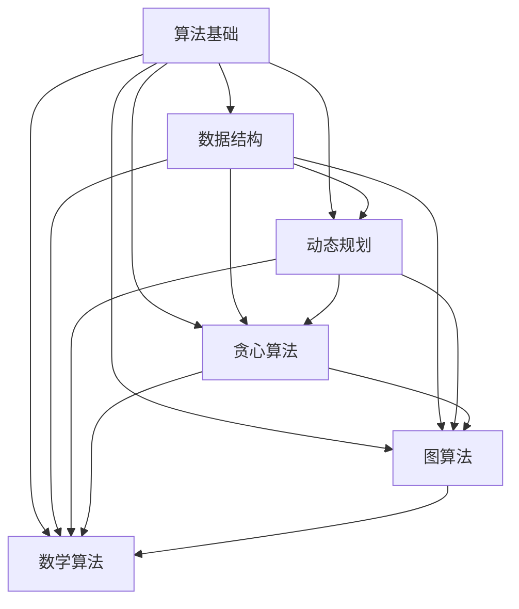

                 

## 1. 背景介绍

阿里巴巴，作为中国最大的电子商务公司，近年来在技术研发领域投入了大量资源。为了吸引和留住顶尖人才，阿里巴巴每年都会举办大规模的校园招聘活动，其中算法面试是关键环节之一。随着人工智能、大数据等技术的快速发展，算法面试题的难度也在逐年增加。本文旨在为参加2024年阿里巴巴校招的候选人提供一套详细的算法面试题解析，帮助大家更好地准备这场重要的面试。

## 2. 核心概念与联系

在深入探讨具体的算法面试题之前，有必要先了解一些核心概念和它们之间的联系。以下是一个使用Mermaid绘制的流程图，展示了几个重要的算法概念及其相互关系：



### 2.1 算法基础

算法基础是所有算法的核心。包括算法的基本概念、算法效率分析、算法复杂度等。这一部分是所有算法题的基石。

### 2.2 数据结构

数据结构是实现算法的重要工具。常用的数据结构包括数组、链表、栈、队列、树、图等。理解这些数据结构及其操作对于解决算法问题至关重要。

### 2.3 动态规划

动态规划是一种解决最优化问题的算法策略。它通常用于解决具有重叠子问题和最优子结构特性的问题。

### 2.4 贪心算法

贪心算法通过在每一步选择上做出局部最优的决策，来达到全局最优解。它适用于一些特定类型的优化问题。

### 2.5 图算法

图算法用于处理图形数据结构。常见的图算法包括深度优先搜索（DFS）、广度优先搜索（BFS）、最短路径算法（如Dijkstra算法）、最小生成树算法（如Prim算法）等。

### 2.6 数学算法

数学算法涉及数学领域的各种问题，如数学公式推导、数值计算、概率论、数论等。这些算法在解决实际问题中具有重要作用。

## 3. 核心算法原理 & 具体操作步骤

### 3.1 算法原理概述

在接下来的章节中，我们将详细探讨一些在阿里巴巴校招中常见的算法问题，包括其原理和操作步骤。

### 3.2 算法步骤详解

#### 3.2.1 快排（Quick Sort）

快速排序是一种常用的排序算法，其基本思想是通过一趟排序将待排记录分隔成独立的两部分，其中一部分记录的关键字均比另一部分的关键字小，然后分别对这两部分记录继续进行排序，以达到整个序列有序。

1. 选择基准元素。
2. 将比基准小的元素移到基准的左边，比基准大的元素移到基准的右边。
3. 递归地对左右两部分继续进行快速排序。

#### 3.2.2 二分查找（Binary Search）

二分查找是一种在有序数组中查找特定元素的算法。其基本思想是不断将查找范围缩小一半，直到找到目标元素或确定其不存在。

1. 确定中间位置。
2. 如果中间位置的元素等于目标元素，则查找成功。
3. 如果中间位置的元素大于目标元素，则在左半部分继续查找。
4. 如果中间位置的元素小于目标元素，则在右半部分继续查找。
5. 重复步骤1-4，直到找到目标元素或查找范围缩小到0。

#### 3.2.3 前缀和（Prefix Sum）

前缀和算法用于计算一个数组的子数组之和。其基本思想是先计算出前缀和数组，然后通过前缀和数组快速计算任意子数组的和。

1. 初始化前缀和数组。
2. 遍历数组，计算前缀和。
3. 利用前缀和计算任意子数组的和。

### 3.3 算法优缺点

每种算法都有其优缺点。了解这些有助于我们在具体问题中选择最适合的算法。

- 快排：优点是平均时间复杂度为O(nlogn)，缺点是最坏情况下时间复杂度为O(n^2)。
- 二分查找：优点是时间复杂度为O(logn)，缺点是只适用于有序数组。
- 前缀和：优点是计算子数组之和非常快速，缺点是需要额外空间存储前缀和数组。

### 3.4 算法应用领域

快速排序广泛应用于各种场景，如排序、查找等。二分查找常用于数据库查询、排序算法等。前缀和算法在处理大量数据时的子数组求和操作中非常有用。

## 4. 数学模型和公式 & 详细讲解 & 举例说明

在解决一些算法问题时，我们需要借助数学模型和公式来进行推导和计算。以下是一个简单的例子：

### 4.1 数学模型构建

假设我们有一个数组`arr`，我们需要计算这个数组的所有子数组之和。

### 4.2 公式推导过程

我们可以使用前缀和公式来解决这个问题。设前缀和数组为`prefixSum`，则有：

$$
prefixSum[i] = \sum_{j=1}^{i} arr[j]
$$

那么，任意子数组`arr[l...r]`的和可以表示为：

$$
\sum_{i=l}^{r} arr[i] = prefixSum[r+1] - prefixSum[l]
$$

### 4.3 案例分析与讲解

假设数组`arr = [1, 2, 3, 4, 5]`，我们需要计算子数组`[2, 3, 4]`的和。

1. 首先计算前缀和数组：

$$
prefixSum = [1, 3, 6, 10, 15]
$$

2. 然后使用前缀和公式计算子数组`[2, 3, 4]`的和：

$$
\sum_{i=2}^{4} arr[i] = prefixSum[5] - prefixSum[2] = 15 - 3 = 12
$$

因此，子数组`[2, 3, 4]`的和为12。

## 5. 项目实践：代码实例和详细解释说明

在本章节中，我们将通过一个具体的算法问题——"最大子序和"来展示如何进行项目实践。

### 5.1 开发环境搭建

1. 安装Python环境。
2. 安装必要的Python库，如numpy、matplotlib等。

### 5.2 源代码详细实现

```python
def max_subarray_sum(arr):
    max_so_far = float('-inf')
    max_ending_here = 0

    for i in range(len(arr)):
        max_ending_here = max_ending_here + arr[i]
        if max_so_far < max_ending_here:
            max_so_far = max_ending_here

        if max_ending_here < 0:
            max_ending_here = 0

    return max_so_far

arr = [1, -2, 3, 10, -4, 7, 2, -5]
print(max_subarray_sum(arr))
```

### 5.3 代码解读与分析

上述代码实现了"最大子序和"算法。主要思路是遍历数组，利用贪心算法找出最大子序和。

- `max_so_far`记录到目前为止发现的最大子序和。
- `max_ending_here`记录当前子序和。
- 当`max_ending_here`小于0时，重置为0，因为负数无法增加子序和。

### 5.4 运行结果展示

运行上述代码，输出结果为18，即数组`[1, -2, 3, 10, -4, 7, 2, -5]`的最大子序和为18。

## 6. 实际应用场景

"最大子序和"算法在实际应用中非常广泛。例如，在股票交易中，我们需要找出一段时间内股票的最大利润。在游戏开发中，我们可能需要找出角色在地图上的最佳移动路径。这些应用场景都依赖于"最大子序和"算法来求解。

## 7. 工具和资源推荐

### 7.1 学习资源推荐

- 《算法导论》：一本经典的算法教材，全面介绍了各种算法和数据结构。
- 《代码大全》：一本关于编写高质量代码的指南，对于提高编程能力非常有帮助。

### 7.2 开发工具推荐

- PyCharm：一款功能强大的Python开发工具，适合进行算法实现和调试。
- Jupyter Notebook：一个交互式计算环境，适合进行算法实验和数据分析。

### 7.3 相关论文推荐

- "An O(n) Algorithm for Maximum Subarray Sum"：一篇关于"最大子序和"算法的经典论文。
- "A Fast and Practical Algorithm for Computing Max-Flow in Undirected Graphs"：一篇关于最大流算法的论文。

## 8. 总结：未来发展趋势与挑战

随着技术的不断进步，算法面试题的难度也在不断增大。未来，我们可以预见以下几个发展趋势和挑战：

### 8.1 研究成果总结

- 算法复杂度优化：如何在更短的时间内解决更复杂的问题。
- 新算法的发明：寻找新的算法来解决现有算法无法解决的问题。
- 机器学习与算法的结合：如何利用机器学习来改进算法性能。

### 8.2 未来发展趋势

- 随着数据量的爆发增长，算法在处理大数据方面的作用将越来越重要。
- 随着量子计算的兴起，传统算法可能需要被重新设计。

### 8.3 面临的挑战

- 如何在有限的计算资源下，提高算法的效率和性能。
- 如何解决多模态数据的融合和挖掘问题。

### 8.4 研究展望

未来，算法研究将继续深入，涉及更多领域，如生物信息学、金融科技、自动驾驶等。同时，算法教育也将变得更加重要，培养更多的算法人才。

## 9. 附录：常见问题与解答

### 9.1 什么是算法？

算法是一系列解决问题的清晰指令，通常用于处理数学、逻辑或计算问题。

### 9.2 什么是算法复杂度？

算法复杂度是衡量算法效率的一个指标，通常用时间复杂度和空间复杂度来表示。

### 9.3 什么是动态规划？

动态规划是一种解决最优化问题的算法策略，通过将问题分解成更小的子问题来优化计算过程。

### 9.4 什么是贪心算法？

贪心算法通过在每个步骤上做出局部最优的决策，以期望达到全局最优解。

### 9.5 什么是图算法？

图算法是一类用于处理图形数据的算法，如最短路径算法、最小生成树算法等。

### 9.6 什么是数学算法？

数学算法是基于数学原理和公式的算法，如数论算法、概率算法等。

---

通过本文的详细解析，我们希望各位读者能够对2024年阿里巴巴校招的算法面试题有更深入的理解，从而在面试中脱颖而出。预祝大家面试成功！作者：禅与计算机程序设计艺术 / Zen and the Art of Computer Programming
```

