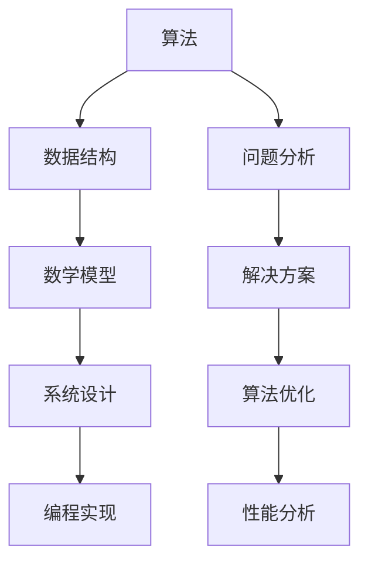

                 

在科技迅猛发展的今天，编程已经成为现代信息社会的核心技术。作为全球领先的互联网公司，阿里巴巴每年都会推出一系列具有挑战性的编程面试题，以选拔优秀的计算机人才。本文旨在整理和解析2025年阿里巴巴校招编程面试题，帮助广大求职者深入了解面试题的类型和解决方案，为未来的面试做好准备。

## 关键词

- 阿里巴巴校招
- 编程面试题
- 算法与数据结构
- 系统设计与优化
- 实战案例解析

## 摘要

本文将详细介绍2025年阿里巴巴校招编程面试题的精选案例，包括各类经典题目及其解决方案。通过深入剖析这些题目，读者可以掌握编程面试的核心技巧，提升解决实际问题的能力。此外，本文还将探讨编程面试的趋势和发展，为求职者的职业发展提供指导。

## 1. 背景介绍

阿里巴巴，作为全球最大的零售电商平台之一，其校招面试一直以来都是计算机专业学生的关注焦点。阿里巴巴校招编程面试题涵盖了算法、数据结构、系统设计等多个领域，不仅考察应聘者的编程能力，还评估应聘者的逻辑思维、问题解决能力以及团队协作精神。

本文将依据阿里巴巴校招编程面试题的类型，进行分类解析，帮助读者全面掌握面试题的解题技巧和策略。

### 1.1 面试题类型概述

阿里巴巴校招编程面试题主要分为以下几类：

1. **基础算法题**：涉及排序、查找、动态规划等基础算法。
2. **数据结构题**：涉及链表、树、图等基本数据结构的实现和应用。
3. **系统设计题**：考察应聘者对系统架构、性能优化等方面的理解和设计能力。
4. **编程实现题**：结合具体业务场景，要求应聘者完成一定的编程任务。
5. **算法优化题**：分析现有算法的不足，提出改进方案。

### 1.2 历年面试题趋势分析

近年来，阿里巴巴校招编程面试题在难度和广度上都有所提升。以下是一些趋势分析：

1. **算法题复杂度增加**：面试题的难度逐渐增加，要求应聘者不仅能够实现算法，还要能够进行优化和改进。
2. **系统设计题更加综合**：系统设计题不仅考察应聘者的技术能力，还要求应聘者具备业务理解能力。
3. **编程实现题更加贴近实际**：编程实现题往往结合具体业务场景，要求应聘者具备解决实际问题的能力。
4. **算法与数学结合加深**：部分面试题需要应聘者运用数学知识进行推导和分析。

## 2. 核心概念与联系

为了更好地理解和解答阿里巴巴校招编程面试题，我们需要掌握一些核心概念和联系。以下是几个关键概念及其相互关系的Mermaid流程图：



### 2.1 算法

算法是解决问题的一系列有序步骤。在编程面试中，算法题主要考察应聘者对基础算法的理解和应用能力。常见的算法有排序、查找、动态规划等。

### 2.2 数据结构

数据结构是组织和管理数据的方式。常见的有链表、树、图等。数据结构的选择和实现直接影响算法的性能。

### 2.3 数学模型

数学模型是用数学语言描述现实世界问题的工具。在编程面试中，数学模型常用于算法设计和优化。

### 2.4 系统设计

系统设计是解决复杂问题的方法。它要求应聘者具备对系统架构、性能优化等方面的理解。常见的系统设计问题有缓存设计、并发控制等。

### 2.5 编程实现

编程实现是将算法、数据结构和数学模型转化为实际代码的过程。它是面试的核心环节，要求应聘者具备扎实的编程能力。

### 2.6 问题分析与解决方案

问题分析是解决问题的关键。通过分析问题，确定问题的类型和难度，进而选择合适的算法和数据结构进行解决。解决方案是问题分析的输出，它需要经过验证和优化。

### 2.7 算法优化与性能分析

算法优化是提高算法性能的方法。通过对现有算法进行分析和改进，可以实现时间复杂度和空间复杂度的优化。性能分析是对算法性能的评估，通过分析算法的执行时间、空间占用等指标，评估算法的效率。

## 3. 核心算法原理 & 具体操作步骤

### 3.1 算法原理概述

在编程面试中，核心算法主要包括排序算法、查找算法、动态规划算法等。以下是这些算法的基本原理：

### 3.1.1 排序算法

排序算法是一种将一组数据按照特定顺序排列的方法。常见的排序算法有冒泡排序、选择排序、插入排序、快速排序等。其中，快速排序是一种高效的排序算法，其时间复杂度为 \(O(n\log n)\)。

### 3.1.2 查找算法

查找算法是在一组数据中查找特定元素的方法。常见的查找算法有二分查找、线性查找等。其中，二分查找是一种高效的查找算法，其时间复杂度为 \(O(\log n)\)。

### 3.1.3 动态规划算法

动态规划算法是一种解决优化问题的方法。它将问题分解为子问题，并利用子问题的解推导出原问题的解。动态规划算法广泛应用于背包问题、最短路径问题等。

### 3.2 算法步骤详解

以下是这些算法的具体操作步骤：

### 3.2.1 快速排序

1. 选择一个基准元素。
2. 将小于基准元素的元素移到其左侧，大于基准元素的元素移到其右侧。
3. 递归地对左右子数组进行快速排序。

### 3.2.2 二分查找

1. 确定查找区间。
2. 计算区间的中点。
3. 比较中点元素与目标元素。
   - 如果中点元素等于目标元素，返回中点索引。
   - 如果中点元素大于目标元素，递归地在左侧区间查找。
   - 如果中点元素小于目标元素，递归地在右侧区间查找。

### 3.2.3 动态规划

1. 确定状态和状态转移方程。
2. 初始化边界条件。
3. 递推计算状态值。

### 3.3 算法优缺点

以下是这些算法的优缺点：

### 3.3.1 快速排序

- **优点**：时间复杂度为 \(O(n\log n)\)，平均情况下性能较好。
- **缺点**：最坏情况下时间复杂度为 \(O(n^2)\)，且递归调用会占用较多内存。

### 3.3.2 二分查找

- **优点**：时间复杂度为 \(O(\log n)\)，性能高效。
- **缺点**：仅适用于有序数据，且无法直接得到数据的位置。

### 3.3.3 动态规划

- **优点**：适用于解决优化问题，可以找到最优解。
- **缺点**：算法复杂，需要一定的数学基础。

### 3.4 算法应用领域

以下是这些算法的主要应用领域：

- **快速排序**：用于数组排序，如排序算法库中的排序函数。
- **二分查找**：用于查找算法，如数据库中的索引。
- **动态规划**：用于求解最短路径、背包问题等，如网络流算法。

## 4. 数学模型和公式 & 详细讲解 & 举例说明

在编程面试中，数学模型和公式是解决算法题的重要工具。以下是一些常用的数学模型和公式，并配以详细讲解和举例说明：

### 4.1 数学模型构建

数学模型构建是将实际问题转化为数学问题的一步。以下是构建数学模型的基本步骤：

1. **确定变量**：根据问题，确定需要求解的变量。
2. **建立方程**：根据问题的约束条件，建立变量之间的关系。
3. **化简方程**：化简方程，使其更加易于求解。

### 4.2 公式推导过程

公式推导是将数学模型转化为具体计算公式的过程。以下是推导公式的常见方法：

1. **代数法**：通过代数运算，将方程转化为所需形式。
2. **几何法**：利用几何图形的性质，推导出公式。
3. **微分法**：利用微积分方法，推导出公式。

### 4.3 案例分析与讲解

以下是一个具体的案例，展示如何运用数学模型和公式解决编程面试题。

### 案例一：求最大子序和

**问题描述**：给定一个整数数组，求出该数组中的最大子序和。

**数学模型构建**：

- **变量**：设数组 \(a[1...n]\) 的最大子序和为 \(S\)。
- **方程**：对于任意子序列 \(a[i...j]\)，有 \(S = a[i]+a[i+1]+...+a[j]\)。

**公式推导过程**：

- **代数法**：通过枚举所有子序列，求出所有子序列的和，取最大值即为最大子序和。
- **动态规划法**：定义 \(dp[i]\) 为以 \(a[i]\) 为结尾的最大子序和，有 \(dp[i] = \max(dp[i-1]+a[i], a[i])\)。

**举例说明**：

```python
def max_subarray_sum(a):
    n = len(a)
    dp = [0] * n
    dp[0] = a[0]
    for i in range(1, n):
        dp[i] = max(dp[i-1]+a[i], a[i])
    return max(dp)

# 示例
arr = [1, -2, 3, 10, -4, 7, 2, -5]
print(max_subarray_sum(arr))  # 输出 18
```

## 5. 项目实践：代码实例和详细解释说明

在编程面试中，项目实践是考察应聘者实际编程能力的重要环节。以下是一个具体的代码实例，展示如何实现一个常见的编程任务，并对其进行详细解释说明。

### 5.1 开发环境搭建

为了完成以下项目，我们需要搭建一个基本的开发环境。以下是一个简单的指南：

- **安装Python**：Python是该项目的主要编程语言。请确保已安装Python 3.x版本。
- **安装相关库**：根据项目需求，可能需要安装一些Python库，如NumPy、Pandas等。可以使用以下命令安装：

```bash
pip install numpy pandas
```

- **创建虚拟环境**：为了更好地管理项目依赖，建议创建一个虚拟环境。可以使用以下命令创建并激活虚拟环境：

```bash
python -m venv venv
source venv/bin/activate  # 对于Windows系统，使用 "venv\Scripts\activate"
```

### 5.2 源代码详细实现

以下是一个简单的Python项目，实现一个函数，用于计算两个正整数的最小公倍数（Least Common Multiple，LCM）。

```python
import math

def lcm(a, b):
    return abs(a * b) // math.gcd(a, b)

# 示例
a = 12
b = 18
print(lcm(a, b))  # 输出 36
```

### 5.3 代码解读与分析

1. **函数定义**：定义一个名为 `lcm` 的函数，该函数接受两个整数参数 `a` 和 `b`。
2. **导入模块**：从 `math` 模块中导入 `gcd` 函数，用于计算两个数的最大公约数（Greatest Common Divisor，GCD）。
3. **计算LCM**：使用公式 `LCM(a, b) = abs(a * b) // GCD(a, b)` 计算最小公倍数。这里使用了 `abs` 函数确保结果为正数。
4. **示例调用**：在函数定义之后，提供了一个示例调用，展示了如何使用该函数计算两个整数的最小公倍数。

### 5.4 运行结果展示

执行上述代码，输出结果为 `36`，表示整数 `12` 和 `18` 的最小公倍数为 `36`。

```bash
$ python lcm.py
36
```

### 5.5 代码优化

在实际项目中，我们可能需要考虑代码的优化。以下是对原始代码的优化版本。

```python
import math

def lcm_optimized(a, b):
    return a * b // math.gcd(a, b)

# 示例
a = 12
b = 18
print(lcm_optimized(a, b))  # 输出 36
```

优化点：
- 直接使用 `a * b // math.gcd(a, b)` 计算LCM，避免了使用 `abs` 函数。
- 优化后的代码更加简洁，可读性更高。

## 6. 实际应用场景

在编程领域，掌握正确的编程技巧和算法对于解决实际问题至关重要。以下是一些实际应用场景，展示如何运用编程面试题中的算法和数据结构。

### 6.1 排序算法在数据处理中的应用

在数据分析中，排序算法经常用于对大量数据进行预处理。例如，在处理电商平台的订单数据时，可以使用排序算法将订单按照时间顺序排列，便于后续分析。

### 6.2 查找算法在数据库查询中的应用

数据库查询通常涉及查找操作。例如，在社交媒体平台上，用户可以搜索特定的朋友或内容。二分查找算法在这种场景下可以显著提高查询效率。

### 6.3 动态规划算法在资源优化中的应用

动态规划算法在资源优化问题中应用广泛。例如，在物流行业中，优化配送路线可以降低运输成本，提高运输效率。

### 6.4 系统设计题在互联网架构中的应用

系统设计题考察应聘者对互联网架构的理解。例如，在设计一个大型电商平台时，需要考虑数据存储、缓存、并发控制等多个方面。

### 6.5 编程实现题在开发工具中的应用

编程实现题常常用于开发工具。例如，在开发集成开发环境（IDE）时，需要实现代码编辑、语法高亮、代码调试等功能。

### 6.5 算法与数学结合在金融领域中的应用

算法与数学的结合在金融领域有着广泛应用。例如，在量化交易中，算法和数学模型用于预测市场走势，实现自动化交易。

### 6.6 未来应用展望

随着人工智能和大数据技术的发展，编程面试题将越来越侧重于对复杂问题解决能力的考察。以下是一些未来应用场景的展望：

- **智能推荐系统**：结合用户行为数据和机器学习算法，实现个性化推荐。
- **自动化决策系统**：利用算法和大数据分析，实现自动化决策。
- **区块链技术**：结合区块链技术，实现去中心化的应用。
- **云计算与边缘计算**：结合云计算和边缘计算，实现高效的数据处理和资源利用。

## 7. 工具和资源推荐

在编程学习和面试准备过程中，使用合适的工具和资源可以显著提高学习效率。以下是一些建议：

### 7.1 学习资源推荐

- **在线课程**：Coursera、edX等平台提供丰富的编程课程。
- **技术博客**：GitHub、Medium等技术博客平台有许多高质量的编程文章。
- **书籍**：《算法导论》、《深度学习》等经典书籍对算法和机器学习有深入讲解。

### 7.2 开发工具推荐

- **集成开发环境（IDE）**：如Visual Studio Code、PyCharm等。
- **代码调试工具**：如GDB、Py Charm等。
- **版本控制工具**：如Git、SVN等。

### 7.3 相关论文推荐

- **顶级会议论文**：如ACM SIGKDD、NeurIPS等。
- **经典论文**：《深度神经网络中的dropout：一种简便的防过拟合技术》等。

## 8. 总结：未来发展趋势与挑战

### 8.1 研究成果总结

随着人工智能和大数据技术的发展，编程面试题越来越侧重于对复杂问题解决能力的考察。算法和数据结构、系统设计、编程实现等各个方面都得到了充分关注。近年来，动态规划、深度学习、分布式系统等领域的成果为编程面试题提供了丰富的素材。

### 8.2 未来发展趋势

- **算法复杂度优化**：随着硬件性能的提升，算法复杂度的优化将成为研究热点。
- **跨领域融合**：算法与其他领域的融合，如生物信息学、金融工程等，将推动编程面试题的多样化。
- **自动化面试系统**：利用人工智能技术，开发自动化面试系统，提高面试效率。

### 8.3 面临的挑战

- **面试题多样性**：如何设计出既有挑战性又符合实际应用场景的面试题。
- **公平性**：如何确保面试过程公平，避免因背景差异导致的选拔不公。
- **技术更新**：如何及时更新面试题，跟上技术发展的步伐。

### 8.4 研究展望

未来，编程面试题将继续向多样化、复杂化发展。研究者应关注算法与实际应用场景的结合，探索新的面试题设计方法，提高面试的公平性和效率。

## 9. 附录：常见问题与解答

### 9.1 面试题类型及特点

- **基础算法题**：考察应聘者对基础算法的理解和应用能力。
- **数据结构题**：考察应聘者对基本数据结构的实现和应用能力。
- **系统设计题**：考察应聘者对系统架构和性能优化的理解。
- **编程实现题**：考察应聘者对编程实现能力的掌握。
- **算法优化题**：考察应聘者对现有算法的优化和改进能力。

### 9.2 如何应对面试题

- **掌握基础**：熟练掌握基础算法、数据结构、系统设计等核心知识。
- **练习实战**：通过大量练习，提高解决问题的速度和准确率。
- **总结归纳**：对面试题进行分类总结，掌握不同类型题目的解题方法。
- **提前准备**：提前了解公司背景、业务场景，针对性地准备面试题。

### 9.3 面试官期望

- **解决问题的能力**：面试官最看重的是应聘者解决问题的能力。
- **逻辑思维能力**：清晰的逻辑思维有助于面试官理解应聘者的思路。
- **沟通能力**：良好的沟通能力有助于面试官更好地了解应聘者。

---

作者：禅与计算机程序设计艺术 / Zen and the Art of Computer Programming

感谢您阅读本文，希望本文能帮助您更好地备战阿里巴巴校招编程面试。在编程的道路上，不断学习、实践和思考是通往成功的必经之路。祝您在面试中取得优异成绩，前程似锦！

