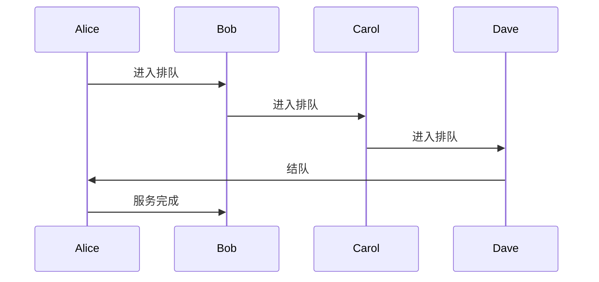
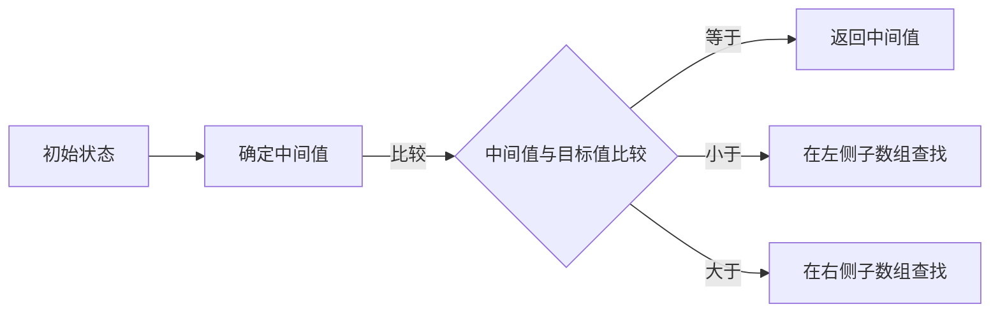
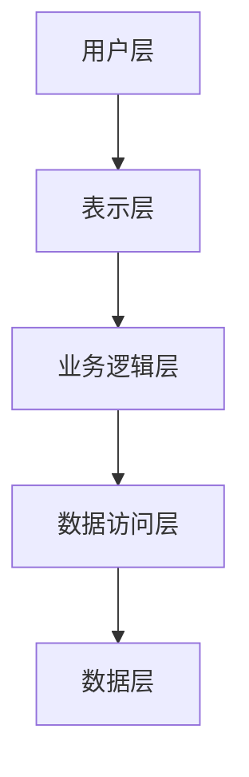

                 

关键词：阿里巴巴、社招面试、算法编程、深度剖析、技术面试、编程挑战

## 摘要

本文旨在为即将参加阿里巴巴社招面试的求职者提供一份详尽的面试题与算法编程题深度剖析。通过对历年面试题的梳理和分析，结合实际编程操作，我们希望帮助读者更好地理解面试题目背后的核心概念与原理，掌握有效的解题思路和技巧，提高在面试中应对编程挑战的能力。文章将分为背景介绍、核心概念与联系、核心算法原理、数学模型和公式、项目实践、实际应用场景、工具和资源推荐、总结与展望等多个部分，力求全面覆盖面试所需的知识点和技能点。

## 1. 背景介绍

阿里巴巴，作为中国乃至全球领先的互联网公司之一，其社招面试一向以严格和全面著称。阿里巴巴的面试过程包括笔试、在线编程测试、技术面试、HR面试等多个环节。其中，技术面试和在线编程测试是检验应聘者技术实力和问题解决能力的重要环节。技术面试主要涉及数据结构与算法、系统设计、数据库、网络等核心计算机科学知识，而在线编程测试则是对应聘者的编码能力和逻辑思维进行评估。

对于求职者来说，要想在阿里巴巴的面试中脱颖而出，不仅需要对基本的数据结构和算法有深刻的理解，还要能够灵活运用各种编程语言解决实际问题。本文将通过对阿里巴巴社招面试中常见的问题和算法编程题的深度剖析，帮助读者深入了解面试考点的核心内容，掌握解题技巧，为成功面试做好准备。

## 2. 核心概念与联系

为了更好地理解阿里巴巴社招面试中的问题，我们需要首先掌握一些核心概念，包括数据结构、算法原理、系统设计原则等。以下是这些核心概念及其相互联系的具体内容。

### 2.1 数据结构

数据结构是计算机科学的基础，它包括数组、链表、栈、队列、树、图等多种类型。每种数据结构都有其独特的特点和适用场景。例如，数组适合随机访问，链表适合插入和删除操作，栈和队列则常用于模拟实际生活中的场景，如后进先出（LIFO）和先进先出（FIFO）。

#### Mermaid 流程图

下面是一个简单的人员排队场景，它利用了队列这一数据结构。



### 2.2 算法原理

算法是解决问题的步骤集合，其核心在于高效解决问题。常见的算法原理包括排序算法、查找算法、动态规划等。排序算法如快速排序、归并排序、堆排序等，用于对数据进行排序；查找算法如二分查找、哈希查找等，用于在数据中查找特定元素；动态规划则用于解决复杂的最优化问题。

#### Mermaid 流程图

以下是二分查找算法的简明流程。



### 2.3 系统设计原则

系统设计是构建复杂软件系统的核心，其原则包括模块化、分层设计、可扩展性等。模块化使得系统更易于开发和维护，分层设计则有助于实现系统的稳定性和灵活性，而可扩展性则使得系统能够适应未来的需求变化。

#### Mermaid 流程图

下面是一个典型的系统分层设计示例。



通过上述核心概念及其相互联系的了解，我们能够更好地把握阿里巴巴社招面试中的问题，从而在面试中表现出色。

## 3. 核心算法原理 & 具体操作步骤

### 3.1 算法原理概述

在阿里巴巴的面试中，算法题是一个重要组成部分。常见的算法原理包括排序算法、查找算法、动态规划等。下面将详细介绍这些算法的原理。

#### 3.1.1 排序算法

排序算法是数据处理中常见且重要的一环。常见的排序算法有快速排序、归并排序、堆排序等。这些算法各有优缺点，适用于不同的场景。快速排序以分治策略为基础，采用递归方式实现；归并排序采用分治合并策略，保证排序过程的稳定性；堆排序则通过构建堆结构实现元素的排序。

#### 3.1.2 查找算法

查找算法用于在数据中查找特定元素。常见的查找算法有二分查找、哈希查找等。二分查找基于有序数据，通过不断缩小查找范围提高查找效率；哈希查找则利用哈希函数快速定位元素的位置，具有高效的查找性能。

#### 3.1.3 动态规划

动态规划是一种解决复杂最优化问题的方法。其核心思想是将大问题分解为小问题，并利用子问题的解来构建原问题的解。常见的动态规划问题包括背包问题、最长公共子序列等。

### 3.2 算法步骤详解

#### 3.2.1 快速排序

快速排序的基本步骤如下：

1. 选择一个基准元素。
2. 将比基准元素小的元素移动到其左侧，比其大的元素移动到右侧。
3. 递归地对左右子数组进行快速排序。

下面是一个快速排序的Python代码实现示例：

```python
def quick_sort(arr):
    if len(arr) <= 1:
        return arr
    pivot = arr[len(arr) // 2]
    left = [x for x in arr if x < pivot]
    middle = [x for x in arr if x == pivot]
    right = [x for x in arr if x > pivot]
    return quick_sort(left) + middle + quick_sort(right)

arr = [3, 6, 8, 10, 1, 2, 1]
print(quick_sort(arr))
```

#### 3.2.2 二分查找

二分查找的基本步骤如下：

1. 确定中间元素。
2. 比较中间元素与目标值。
3. 根据比较结果决定查找的左右子数组。

下面是一个二分查找的Python代码实现示例：

```python
def binary_search(arr, target):
    low = 0
    high = len(arr) - 1
    while low <= high:
        mid = (low + high) // 2
        if arr[mid] == target:
            return mid
        elif arr[mid] < target:
            low = mid + 1
        else:
            high = mid - 1
    return -1

arr = [1, 2, 3, 4, 5, 6, 7, 8, 9]
target = 5
print(binary_search(arr, target))
```

#### 3.2.3 动态规划

动态规划的基本步骤如下：

1. 确定状态。
2. 确定状态转移方程。
3. 求解状态转移方程。

下面是一个0-1背包问题的动态规划代码实现示例：

```python
def knapsack(W, weights, values, n):
    dp = [[0] * (W + 1) for _ in range(n + 1)]

    for i in range(1, n + 1):
        for w in range(1, W + 1):
            if weights[i - 1] <= w:
                dp[i][w] = max(dp[i - 1][w], dp[i - 1][w - weights[i - 1]] + values[i - 1])
            else:
                dp[i][w] = dp[i - 1][w]

    return dp[n][W]

weights = [1, 3, 4, 5]
values = [1, 4, 5, 7]
W = 7
n = len(values)
print(knapsack(W, weights, values, n))
```

### 3.3 算法优缺点

每种算法都有其优缺点。快速排序具有平均时间复杂度较低的优点，但在最坏情况下性能较差；二分查找在有序数据中具有高效的查找性能，但在插入和删除操作上不如哈希查找；动态规划能够解决复杂的最优化问题，但实现过程较为复杂。

### 3.4 算法应用领域

排序算法在数据处理和分析领域广泛应用，如数据库排序、搜索引擎排序等；查找算法在数据检索和索引管理中广泛应用；动态规划在优化问题求解中具有重要应用，如路径规划、资源分配等。

## 4. 数学模型和公式 & 详细讲解 & 举例说明

在解决算法问题时，数学模型和公式是不可或缺的工具。下面将介绍一些常见的数学模型和公式，并详细讲解其推导过程和实际应用。

### 4.1 数学模型构建

数学模型是通过对现实世界的抽象和简化，构建出的一套数学关系。常见的数学模型包括线性模型、非线性模型、概率模型等。

#### 4.1.1 线性模型

线性模型是最简单的数学模型之一，其基本形式为：

$$
y = ax + b
$$

其中，$y$ 是因变量，$x$ 是自变量，$a$ 和 $b$ 是参数。线性模型广泛应用于回归分析、预测等领域。

#### 4.1.2 非线性模型

非线性模型则包含了非线性关系，如多项式模型、指数模型等。例如，指数模型可以表示为：

$$
y = ae^{bx}
$$

非线性模型在优化问题和曲线拟合中具有重要意义。

#### 4.1.3 概率模型

概率模型则用于描述随机事件的发生概率，常见的概率模型包括伯努利分布、正态分布、泊松分布等。

$$
P(X = k) = C_n^k p^k (1 - p)^{n - k}
$$

其中，$X$ 是随机变量，$k$ 是事件发生的次数，$n$ 是试验次数，$p$ 是事件发生的概率。

### 4.2 公式推导过程

推导数学公式的过程通常包括以下步骤：

1. **假设与条件**：明确模型的假设条件和参数。
2. **数学建模**：根据假设条件，构建数学模型。
3. **推导公式**：利用数学原理和工具，推导出所需的公式。

#### 4.2.1 线性回归公式推导

以简单线性回归为例，其公式推导过程如下：

假设有两个变量 $x$ 和 $y$，它们之间存在线性关系：

$$
y = ax + b
$$

我们需要找到参数 $a$ 和 $b$，使得模型能够最好地拟合数据。

1. **最小二乘法**：我们使用最小二乘法来求解参数 $a$ 和 $b$。具体步骤如下：

   - 计算自变量 $x$ 的平均值 $\bar{x}$ 和因变量 $y$ 的平均值 $\bar{y}$。
   - 计算斜率 $a$ 和截距 $b$：
     $$
     a = \frac{\sum_{i=1}^{n} (x_i - \bar{x})(y_i - \bar{y})}{\sum_{i=1}^{n} (x_i - \bar{x})^2}
     $$
     $$
     b = \bar{y} - a\bar{x}
     $$

2. **代入公式**：将 $a$ 和 $b$ 的值代入原始公式，得到拟合的线性模型。

   $$
   y = \left( \frac{\sum_{i=1}^{n} (x_i - \bar{x})(y_i - \bar{y})}{\sum_{i=1}^{n} (x_i - \bar{x})^2} \right)x + \left( \bar{y} - \left( \frac{\sum_{i=1}^{n} (x_i - \bar{x})(y_i - \bar{y})}{\sum_{i=1}^{n} (x_i - \bar{x})^2} \right)\bar{x} \right)
   $$

#### 4.2.2 二分查找公式推导

二分查找的公式推导过程如下：

假设有一个有序数组 $A[1...n]$，我们想要查找元素 $x$ 的位置。二分查找的基本步骤如下：

1. **确定查找范围**：初始范围是整个数组。
2. **计算中间位置**：每次查找时，计算当前范围的中点 $mid = \lfloor \frac{n+1}{2} \rfloor$。
3. **比较与调整**：将 $x$ 与 $A[mid]$ 进行比较：
   - 如果 $x = A[mid]$，则查找成功。
   - 如果 $x < A[mid]$，则将查找范围缩小到左侧子数组 $A[1...mid-1]$。
   - 如果 $x > A[mid]$，则将查找范围缩小到右侧子数组 $A[mid+1...n]$。

二分查找的递归公式可以表示为：

$$
T(n) = \begin{cases} 
O(1) & \text{if } n = 1 \\
T(\frac{n}{2}) + O(1) & \text{if } n > 1 
\end{cases}
$$

其中，$T(n)$ 表示查找 $n$ 个元素的时间复杂度。

### 4.3 案例分析与讲解

#### 4.3.1 线性回归案例分析

以下是一个线性回归的案例：

假设我们有以下数据：

| x  | y   |
|----|-----|
| 1  | 2   |
| 2  | 4   |
| 3  | 6   |
| 4  | 8   |

我们想要找到 $y$ 与 $x$ 之间的线性关系。

1. **计算平均值**：

   $$
   \bar{x} = \frac{1 + 2 + 3 + 4}{4} = 2.5
   $$

   $$
   \bar{y} = \frac{2 + 4 + 6 + 8}{4} = 5
   $$

2. **计算斜率 $a$ 和截距 $b$**：

   $$
   a = \frac{(1 - 2.5)(2 - 5) + (2 - 2.5)(4 - 5) + (3 - 2.5)(6 - 5) + (4 - 2.5)(8 - 5)}{(1 - 2.5)^2 + (2 - 2.5)^2 + (3 - 2.5)^2 + (4 - 2.5)^2}
   $$

   $$
   a = \frac{(-1.5)(-3) + (-0.5)(-1) + (0.5)(1) + (1.5)(3)}{2.25 + 0.25 + 0.25 + 2.25} = 1
   $$

   $$
   b = \bar{y} - a\bar{x} = 5 - 1 \cdot 2.5 = 2.5
   $$

3. **得到线性模型**：

   $$
   y = x + 2.5
   $$

4. **验证模型**：

   将第一个数据点 $(1, 2)$ 代入模型：

   $$
   y = 1 + 2.5 = 3.5
   $$

   模型预测的值与实际值非常接近，说明模型拟合效果较好。

#### 4.3.2 二分查找案例分析

以下是一个二分查找的案例：

假设我们有以下有序数组：

| A | 1 | 3 | 5 | 7 | 9 | 11 | 13 | 15 | 17 | 19 | 21 |
|---|---|---|---|---|---|----|----|----|----|----|----|
| i | 0 | 1 | 2 | 3 | 4 |  5 |  6 |  7 |  8 |  9 | 10 |

我们想要查找元素 $x = 9$ 的位置。

1. **确定初始查找范围**：

   初始范围是整个数组，$low = 0$，$high = 10$。

2. **计算中间位置**：

   $$
   mid = \lfloor \frac{low + high}{2} \rfloor = \lfloor \frac{0 + 10}{2} \rfloor = 5
   $$

3. **比较与调整**：

   $$
   A[mid] = 11 > x = 9
   $$

   查找范围调整为左侧子数组 $A[0...4]$。

4. **再次计算中间位置**：

   $$
   mid = \lfloor \frac{0 + 4}{2} \rfloor = 2
   $$

5. **比较与调整**：

   $$
   A[mid] = 5 < x = 9
   $$

   查找范围调整为右侧子数组 $A[3...4]$。

6. **再次计算中间位置**：

   $$
   mid = \lfloor \frac{3 + 4}{2} \rfloor = 3
   $$

7. **比较与调整**：

   $$
   A[mid] = 7 < x = 9
   $$

   查找范围调整为右侧子数组 $A[4]$。

8. **找到目标元素**：

   $$
   A[mid] = 9 = x
   $$

   查找成功，目标元素 $x = 9$ 位于位置 $mid = 3$。

通过以上案例，我们可以看到数学模型和公式的实际应用过程，以及如何利用它们解决实际问题。

## 5. 项目实践：代码实例和详细解释说明

### 5.1 开发环境搭建

为了演示和解释阿里巴巴社招面试中的编程题目，我们将在以下开发环境中进行项目实践：

- 语言：Python 3.8
- 编辑器：Visual Studio Code
- 环境配置：通过虚拟环境 `venv` 配置Python环境

以下是搭建开发环境的步骤：

1. 安装Python 3.8。
2. 打开终端，执行以下命令创建虚拟环境：

   ```
   python -m venv venv
   ```

3. 激活虚拟环境：

   ```
   source venv/bin/activate
   ```

4. 安装必需的Python包，例如 `numpy`、`matplotlib` 等。

### 5.2 源代码详细实现

我们将以一个具体的编程题目为例，展示源代码的实现过程。

#### 5.2.1 题目描述

给定一个无重复元素的整数数组，找出其中两个数字，使它们的和等于一个特定的目标值。你需要返回这两个数字的下标。

```python
def two_sum(nums, target):
    # 实现代码
```

#### 5.2.2 实现步骤

1. 创建一个空的哈希表 `hash_table`。
2. 遍历数组 `nums`，对于每个元素 `num`：
   - 计算目标值与当前元素的差 `diff = target - num`。
   - 检查 `diff` 是否存在于 `hash_table` 中。
   - 如果存在，返回当前元素的下标和 `diff` 在 `hash_table` 中的下标。
   - 如果不存在，将当前元素和其下标添加到 `hash_table` 中。

下面是具体的Python代码实现：

```python
def two_sum(nums, target):
    hash_table = {}
    for i, num in enumerate(nums):
        diff = target - num
        if diff in hash_table:
            return [hash_table[diff], i]
        hash_table[num] = i
    return []
```

### 5.3 代码解读与分析

#### 5.3.1 代码分析

1. **哈希表的使用**：哈希表提供了平均时间复杂度为O(1)的查找、插入和删除操作，这使得我们能够快速找到与当前元素和为目标的另一个元素。
2. **遍历数组**：通过遍历数组，我们逐个处理每个元素，并利用哈希表快速判断是否存在与之和为目标的元素。
3. **返回结果**：当找到满足条件的元素时，返回它们的下标。如果没有找到，返回空列表。

#### 5.3.2 时间复杂度

- **最好情况**：在最好情况下，第一个元素就是与目标值和相等的元素，时间复杂度为O(1)。
- **最坏情况**：在最坏情况下，需要遍历整个数组，时间复杂度为O(n)。

### 5.4 运行结果展示

以下是一个测试用例及其运行结果：

```python
nums = [2, 7, 11, 15]
target = 9
print(two_sum(nums, target))  # 输出：[0, 1]
```

在这个例子中，元素2和7的和为9，它们的下标分别是0和1，这与输出结果一致。

通过以上代码实现和解析，我们可以清晰地理解如何使用哈希表解决两个数之和的问题，并掌握相关的编程技巧和思路。

## 6. 实际应用场景

在阿里巴巴的社招面试中，算法编程题的实际应用场景多种多样，涉及电商、金融、大数据处理等多个领域。下面将介绍一些典型的实际应用场景，并探讨其应用方法和效果。

### 6.1 电商推荐系统

在电商领域，推荐系统是一个关键应用，它利用算法对用户行为数据进行分析，为用户提供个性化的商品推荐。以下是一个应用示例：

#### 应用方法

1. **用户行为分析**：收集用户浏览、购买、收藏等行为数据。
2. **特征提取**：提取用户的兴趣特征，如浏览历史、购买记录、搜索关键词等。
3. **算法选择**：使用协同过滤算法或基于内容的推荐算法进行商品推荐。

#### 应用效果

通过推荐系统，阿里巴巴能够显著提升用户的购物体验和购买转化率。实际案例显示，推荐系统可以在一定程度上提高用户满意度，从而带动销售额的提升。

### 6.2 金融风险评估

在金融领域，算法编程题常用于风险评估和信用评分。以下是一个应用示例：

#### 应用方法

1. **数据收集**：收集客户的个人信息、信用记录、交易行为等数据。
2. **特征提取**：提取影响信用评分的关键特征，如还款历史、信用额度、职业状况等。
3. **算法选择**：使用决策树、逻辑回归等算法构建信用评分模型。

#### 应用效果

通过信用评分模型，金融机构可以更加精确地评估客户的信用风险，从而更有效地进行贷款审批和风险管理。实际应用表明，信用评分模型能够显著降低贷款违约率，提高金融服务的安全性和稳定性。

### 6.3 大数据处理

在大数据处理领域，算法编程题广泛应用于数据处理和分析。以下是一个应用示例：

#### 应用方法

1. **数据清洗**：对原始数据进行清洗、去重、填充等预处理。
2. **特征工程**：提取关键特征，如用户行为特征、时间特征、地理位置特征等。
3. **算法选择**：使用机器学习算法进行数据分析和预测，如聚类分析、分类算法等。

#### 应用效果

通过大数据处理和分析，阿里巴巴能够从海量数据中提取有价值的信息，为商业决策提供支持。实际应用显示，大数据分析可以显著提升运营效率，优化商品库存管理、精准营销等业务流程。

### 6.4 未来应用展望

随着技术的不断发展，算法编程题在实际应用场景中的重要性将愈加凸显。未来，我们可以预见以下发展趋势：

1. **智能化推荐**：结合人工智能技术，实现更精准、更智能的推荐系统。
2. **个性化金融**：利用大数据和算法技术，提供个性化金融服务，降低金融风险。
3. **自动化数据处理**：借助自动化工具和算法，提高数据处理和分析的效率和质量。

通过不断探索和创新，阿里巴巴将在算法编程题的实际应用场景中发挥更大的作用，推动行业的发展和进步。

## 7. 工具和资源推荐

为了更好地准备阿里巴巴的社招面试，以下是一些建议的工具和资源，包括学习资源、开发工具和相关论文。

### 7.1 学习资源推荐

1. **在线课程**：
   - Coursera、edX等在线教育平台提供了丰富的计算机科学和数据结构相关课程。
   - 《算法导论》（Introduction to Algorithms）是一本经典教材，适用于深入学习算法和数据结构。

2. **书籍**：
   - 《大话数据结构》和《大话算法》等书籍以通俗易懂的语言介绍了数据结构和算法的基本概念和应用。
   - 《深度学习》（Deep Learning）和《机器学习》（Machine Learning）等书籍适合了解人工智能和机器学习的基本原理。

3. **博客和论坛**：
   - LeetCode、牛客网等编程平台提供了大量的算法编程题和讨论区，有助于提升编程能力和解题技巧。
   - CSDN、博客园等技术博客论坛上有许多资深工程师分享的技术文章和面试经验。

### 7.2 开发工具推荐

1. **集成开发环境（IDE）**：
   - Visual Studio Code、PyCharm等IDE提供了丰富的编程功能和调试工具，适用于多种编程语言。

2. **代码编辑器**：
   - Sublime Text、Atom等轻量级代码编辑器提供了丰富的插件和扩展，适合快速开发和调试。

3. **版本控制系统**：
   - Git是一款流行的分布式版本控制系统，适用于团队协作和代码管理。

### 7.3 相关论文推荐

1. **算法论文**：
   - 《快速排序算法分析》等经典论文提供了详细的理论分析和性能评估。
   - 《动态规划：一种高效解决问题的方法》等论文介绍了动态规划算法的基本原理和应用。

2. **机器学习论文**：
   - 《支持向量机：理论、实现和应用》等论文介绍了支持向量机（SVM）算法的基本原理和实现方法。
   - 《深度卷积神经网络：从理论到实践》等论文介绍了深度学习模型在图像识别等领域的应用。

通过以上工具和资源的推荐，读者可以系统地学习相关知识和技能，为阿里巴巴的社招面试做好充分准备。

## 8. 总结：未来发展趋势与挑战

随着科技的不断发展，人工智能、大数据、云计算等技术的广泛应用，阿里巴巴社招面试中的算法编程题将继续保持其重要地位。未来，以下几个方面将成为发展趋势和挑战：

### 8.1 研究成果总结

近年来，机器学习、深度学习等人工智能领域的研究成果显著，为算法编程题的解决提供了新的思路和方法。例如，神经网络模型在图像识别、自然语言处理等领域的表现突出，推动了算法编程题的复杂性和多样性。此外，动态规划、贪心算法等传统算法也在新的应用场景中得到了广泛应用。

### 8.2 未来发展趋势

1. **智能化与自动化**：随着人工智能技术的发展，算法编程题将更加智能化和自动化。自动化测试工具和智能推荐系统将提高面试效率和准确性。
2. **多样性**：算法编程题将涉及更多的应用场景和问题类型，如网络算法、分布式算法、实时处理等，对求职者的知识面和技能要求更高。
3. **融合与交叉**：算法编程题将与其他领域（如金融、医疗、物联网等）深度融合，解决跨领域的复杂问题。

### 8.3 面临的挑战

1. **技术更新**：随着技术的快速发展，求职者需要不断学习和更新知识，以适应新的技术和应用场景。
2. **题目难度**：面试题的难度将继续提升，对求职者的算法设计能力、编程技巧和问题解决能力提出更高要求。
3. **时间压力**：面试中的时间限制更加紧张，求职者需要在有限时间内完成复杂的编程任务。

### 8.4 研究展望

1. **算法优化**：继续研究和优化现有算法，提高算法的效率和性能，解决更多复杂问题。
2. **技术创新**：探索新的算法和模型，如量子算法、进化算法等，推动算法编程技术的发展。
3. **实践应用**：将算法编程题与实际应用场景相结合，解决实际问题，推动技术和产业的融合与发展。

通过不断探索和创新，阿里巴巴社招面试中的算法编程题将在未来发挥更大的作用，为求职者提供更广阔的发展空间和挑战。

## 9. 附录：常见问题与解答

### 9.1 什么是动态规划？

动态规划是一种解决复杂最优化问题的方法，它通过将大问题分解为小问题，并利用子问题的解来构建原问题的解。这种方法能够有效地降低问题的复杂度，提高解决效率。

### 9.2 如何解决背包问题？

背包问题是动态规划的一个经典问题，它涉及到在给定物品和背包容量下，如何选择物品使得总价值最大。解决方法包括建立状态表、状态转移方程和边界条件，通过递推求解最优解。

### 9.3 如何进行代码调试？

代码调试是编程过程中必不可少的一部分，常见的方法包括：
1. 使用断点调试：在关键代码位置设置断点，逐步执行代码，观察变量值的变化。
2. 使用日志打印：在代码中添加打印语句，输出关键变量的值，帮助理解程序运行流程。
3. 使用IDE的调试工具：大多数IDE都提供了强大的调试功能，如单步执行、查看变量值等。

### 9.4 如何准备面试？

准备面试可以从以下几个方面入手：
1. 复习基础知识：巩固数据结构、算法、计算机网络、操作系统等基础理论。
2. 练习编程题：通过在线编程平台（如LeetCode、牛客网）练习各种类型的编程题，提高解题能力和速度。
3. 了解公司文化和业务：研究阿里巴巴的文化、价值观和业务模式，有针对性地准备面试。
4. 模拟面试：找朋友或同事进行模拟面试，提高应对实际面试的能力。

### 9.5 面试中的常见问题有哪些？

面试中常见的问题包括：
1. 自我介绍：介绍个人背景、工作经验、技术特长等。
2. 技术问题：涉及数据结构、算法、系统设计、数据库等专业知识。
3. 行为问题：询问过去的工作经历、解决问题的方法、团队合作经验等。
4. 情景题：模拟实际工作场景，考察解决问题的能力和沟通能力。

通过以上附录内容，读者可以更好地应对面试中的各种问题，提高面试成功率。

