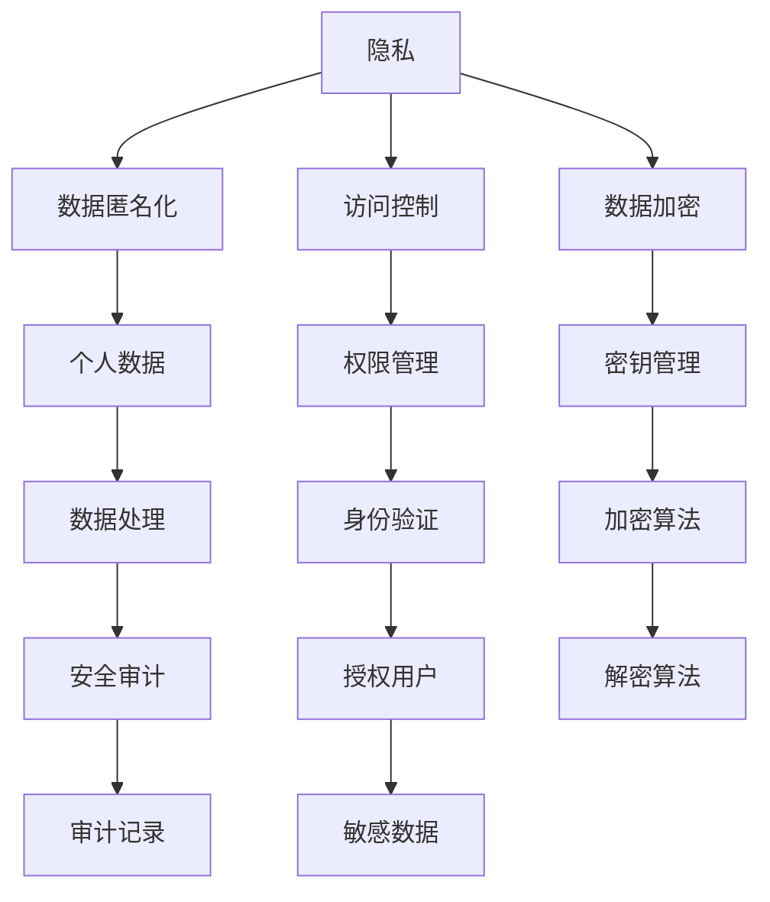

                 

隐私保护在当今的数字化时代变得越来越重要，特别是在人工智能（AI）2.0时代。随着AI技术的迅猛发展，用户的个人数据被大量收集、处理和应用，这不仅带来了便利，也带来了隐私泄露的隐患。本文旨在探讨如何保护AI 2.0用户的隐私，防止数据被滥用。我们将从背景介绍、核心概念与联系、核心算法原理与操作步骤、数学模型与公式、项目实践、实际应用场景、未来应用展望、工具和资源推荐、总结以及常见问题与解答等方面进行深入探讨。

## 关键词

- 隐私保护
- AI 2.0
- 数据滥用
- 安全算法
- 数学模型
- 项目实践
- 未来展望

## 摘要

本文首先介绍了隐私保护的重要性，特别是在AI 2.0时代的背景下。接着，我们探讨了隐私保护的核心概念与联系，并使用Mermaid流程图进行了详细展示。随后，文章深入分析了隐私保护的核心算法原理与操作步骤，并给出了优缺点与应用领域的讨论。在数学模型与公式部分，我们详细讲解了模型的构建、公式的推导过程，并通过案例进行了说明。项目实践部分提供了具体的代码实例和详细解释。实际应用场景展示了隐私保护技术的广泛应用，并对其未来应用进行了展望。最后，文章总结了研究成果，探讨了未来发展趋势与挑战，并给出了常见问题与解答。

## 1. 背景介绍

### AI 2.0时代的到来

随着云计算、大数据、物联网和深度学习等技术的不断发展，人工智能（AI）已经从传统的规则驱动型系统转变为数据驱动型系统。这一转变标志着AI 2.0时代的到来。在AI 2.0时代，AI系统可以自主学习、自我进化，并能够在没有人类干预的情况下完成复杂的任务。然而，这一进步也带来了新的挑战，尤其是在用户隐私保护方面。

### 用户隐私泄露的风险

在AI 2.0时代，用户的个人数据被广泛收集、存储和处理。这些数据包括用户的行为数据、社交媒体数据、购买记录、健康信息等。如果这些数据得不到妥善保护，用户将面临隐私泄露的风险。隐私泄露可能导致以下问题：

- 个人身份被盗用
- 隐私信息被滥用，如广告追踪、信用欺诈等
- 社交网络上的骚扰和欺凌
- 心理健康问题，如焦虑和抑郁

### 隐私保护的重要性

隐私保护在AI 2.0时代的重要性不容忽视。首先，隐私保护是保障用户权益的基础。用户有权对自己的个人信息进行控制，并防止这些信息被滥用。其次，隐私保护也是维护社会秩序的重要手段。如果用户隐私得不到保护，将可能导致社会信任的崩溃，从而影响社会的稳定与发展。

### AI 2.0时代隐私保护的需求

在AI 2.0时代，隐私保护的需求主要体现在以下几个方面：

- 数据匿名化：通过将个人数据进行匿名化处理，防止个人身份被识别。
- 访问控制：通过权限管理和身份验证，确保只有授权用户才能访问敏感数据。
- 数据加密：通过加密技术保护数据在传输和存储过程中的安全。
- 数据最小化：只收集和存储必要的数据，减少数据泄露的风险。
- 安全审计：通过审计记录监控数据的使用情况，及时发现和处理潜在的安全问题。

## 2. 核心概念与联系

### 隐私保护的基本概念

隐私保护涉及多个核心概念，包括隐私、数据匿名化、访问控制和数据加密等。以下是这些概念的定义和联系：

- **隐私**：隐私是指个人对其私人信息的控制权，包括个人身份、行为和偏好等。
- **数据匿名化**：数据匿名化是通过去除或修改个人标识信息，使数据无法直接识别特定个人。
- **访问控制**：访问控制是一种安全措施，用于限制对数据的访问权限，确保只有授权用户可以访问敏感数据。
- **数据加密**：数据加密是将数据通过加密算法转换成无法读取的密文，只有授权用户可以使用密钥进行解密。

### Mermaid 流程图

下面是一个用于描述隐私保护核心概念的 Mermaid 流程图：



### 关键技术与挑战

在隐私保护领域，除了上述核心概念，还有一些关键技术和挑战，包括：

- **差分隐私**：差分隐私是一种用于保护隐私的设计原理，通过引入噪声来掩盖个体数据，确保单个数据点的隐私。
- **联邦学习**：联邦学习是一种分布式学习框架，允许多个参与方在不共享原始数据的情况下共同训练模型，从而保护数据隐私。
- **同态加密**：同态加密是一种加密算法，允许在密文上进行计算，而不需要解密，从而保护数据的隐私。
- **多方安全计算**：多方安全计算是一种在多方之间进行安全计算的方法，允许各方在不泄露各自数据的情况下共同计算结果。

### 总结

隐私保护是AI 2.0时代的重要课题，涉及多个核心概念和技术。通过理解这些概念和技术的联系，我们可以更好地设计隐私保护策略，保护用户的隐私权益。

## 3. 核心算法原理 & 具体操作步骤

### 3.1 算法原理概述

隐私保护的核心算法主要涉及数据匿名化、访问控制和数据加密。下面我们将分别介绍这些算法的原理。

#### 数据匿名化

数据匿名化是通过去除或修改个人标识信息，使数据无法直接识别特定个人。常用的数据匿名化技术包括：

- **K-匿名性**：K-匿名性要求数据库中的任意K个记录不能唯一地识别出特定个人。通过引入泛化技术，可以将个人数据泛化到一组记录中。
- **l-diversity**：l-diversity要求数据库中的任意l个记录不能唯一地识别出特定个人，并且至少有k个记录与该个人相关。这样可以提高数据的隐私性，同时保持数据的多样性。
- **t-closeness**：t-closeness要求数据库中的任意t个记录与真实数据的分布相似。通过引入逆变换技术，可以将个人数据转换为满足t-closeness要求的匿名数据。

#### 访问控制

访问控制是一种安全措施，用于限制对数据的访问权限，确保只有授权用户可以访问敏感数据。常用的访问控制技术包括：

- **基于角色的访问控制（RBAC）**：基于角色的访问控制是一种基于用户角色来限制访问权限的技术。用户被分配特定的角色，每个角色对应一组访问权限。
- **基于属性的访问控制（ABAC）**：基于属性的访问控制是一种基于用户属性（如职位、部门、地理位置等）来限制访问权限的技术。通过定义属性策略，可以精确控制对数据的访问。

#### 数据加密

数据加密是将数据通过加密算法转换成无法读取的密文，只有授权用户可以使用密钥进行解密。常用的数据加密技术包括：

- **对称加密**：对称加密使用相同的密钥进行加密和解密。常用的对称加密算法有AES和DES。
- **非对称加密**：非对称加密使用一对密钥（公钥和私钥）进行加密和解密。常用的非对称加密算法有RSA和ECC。

### 3.2 算法步骤详解

#### 数据匿名化步骤

1. **数据收集**：收集需要匿名化的数据，并将其存储在数据库中。
2. **数据预处理**：对数据进行清洗和预处理，去除或修改个人标识信息。
3. **选择匿名化策略**：根据数据的特点和隐私需求，选择合适的匿名化策略（如K-匿名性、l-diversity、t-closeness等）。
4. **应用匿名化算法**：根据选定的匿名化策略，对数据进行匿名化处理，生成匿名数据。
5. **验证匿名化效果**：对匿名数据进行验证，确保满足匿名化要求。

#### 访问控制步骤

1. **定义角色和权限**：根据组织的业务需求，定义不同的角色和相应的访问权限。
2. **分配角色**：将用户分配到相应的角色中，确保每个用户都有相应的访问权限。
3. **定义属性策略**：根据用户属性（如职位、部门、地理位置等），定义访问控制策略。
4. **实现访问控制**：通过访问控制机制（如基于角色的访问控制、基于属性的访问控制等），限制对数据的访问。

#### 数据加密步骤

1. **选择加密算法**：根据数据的安全需求和性能要求，选择合适的加密算法（如对称加密、非对称加密等）。
2. **生成密钥**：生成用于加密和解密的密钥。
3. **加密数据**：使用加密算法和密钥，将数据加密成密文。
4. **存储密钥**：将加密密钥安全存储，确保只有授权用户可以访问。
5. **解密数据**：使用加密算法和密钥，将密文解密成明文数据。

### 3.3 算法优缺点

#### 数据匿名化

**优点**：

- 可以有效防止个人数据被识别和泄露。
- 适用于多种数据类型和场景。
- 可以提高数据的可用性，便于分析和共享。

**缺点**：

- 可能会降低数据的准确性，影响数据分析结果。
- 需要选择合适的匿名化策略，否则可能导致匿名化效果不佳。
- 可能会增加数据处理的复杂性。

#### 访问控制

**优点**：

- 可以有效防止未经授权的访问和数据泄露。
- 可以实现细粒度的访问控制，确保数据安全。
- 可以提高数据的使用效率和灵活性。

**缺点**：

- 需要维护角色和权限信息，可能导致管理复杂度增加。
- 可能会影响系统的性能和响应速度。
- 需要定期更新和维护访问控制策略。

#### 数据加密

**优点**：

- 可以有效保护数据的机密性，防止数据泄露。
- 可以适用于多种数据类型和场景。
- 可以提供可靠的数据加密解决方案。

**缺点**：

- 可能会增加数据处理的复杂性。
- 可能会影响系统的性能和响应速度。
- 需要管理密钥的安全存储和分发。

### 3.4 算法应用领域

#### 数据匿名化

数据匿名化技术广泛应用于以下领域：

- 数据挖掘和数据分析：为了保护个人隐私，需要在分析前对数据进行匿名化处理。
- 数据共享和开放：为了促进数据共享和开放，需要对数据进行匿名化处理，确保个人隐私不被泄露。
- 机器学习和人工智能：为了保护用户隐私，需要在训练和测试数据中使用匿名化技术。

#### 访问控制

访问控制技术广泛应用于以下领域：

- 企业信息系统：为了确保企业数据的安全，需要实现严格的访问控制。
- 电子邮件和文档管理：为了防止机密信息泄露，需要对电子邮件和文档实施访问控制。
- 云计算和大数据：为了确保云计算和大数据环境中的数据安全，需要实现细粒度的访问控制。

#### 数据加密

数据加密技术广泛应用于以下领域：

- 互联网通信：为了确保通信数据的安全性，需要使用数据加密技术。
- 电子支付和交易：为了确保支付和交易的安全性，需要对敏感数据进行加密。
- 数据存储和安全：为了确保数据存储的安全性，需要对敏感数据进行加密。

### 3.5 具体算法案例

下面我们以K-匿名性为例，介绍数据匿名化的具体算法步骤。

#### K-匿名性算法步骤

1. **数据收集**：收集需要匿名化的数据，并将其存储在数据库中。
2. **数据预处理**：对数据进行清洗和预处理，去除或修改个人标识信息。
3. **确定K值**：根据隐私需求和数据特点，确定K值，即数据库中的任意K个记录不能唯一地识别出特定个人。
4. **选择泛化规则**：根据数据类型和属性，选择合适的泛化规则（如最大值泛化、最小值泛化、范围泛化等）。
5. **应用泛化规则**：对数据中的个人标识信息进行泛化处理，生成满足K-匿名性的匿名数据。
6. **验证匿名化效果**：对匿名数据进行验证，确保满足K-匿名性要求。

#### K-匿名性算法案例分析

假设我们有一个包含100个学生的数据库，其中包含学生的姓名、年龄、性别和所在学校等信息。我们希望实现K-匿名性，其中K值为3。

1. **数据收集**：假设数据库中的数据如下：

   | 学生姓名 | 年龄 | 性别 | 所在学校 |
   |--------|-----|-----|--------|
   | 张三   | 20  | 男   | A校    |
   | 李四   | 22  | 女   | A校    |
   | 王五   | 19  | 男   | B校    |
   | 赵六   | 21  | 女   | B校    |

2. **数据预处理**：去除或修改个人标识信息，例如将姓名改为匿名编号。

   | 匿名编号 | 年龄 | 性别 | 所在学校 |
   |--------|-----|-----|--------|
   | 1      | 20  | 男   | A校    |
   | 2      | 22  | 女   | A校    |
   | 3      | 19  | 男   | B校    |
   | 4      | 21  | 女   | B校    |

3. **确定K值**：根据隐私需求和数据特点，我们选择K值为3。

4. **选择泛化规则**：根据数据类型和属性，我们选择最大值泛化规则，例如将年龄最大值设为23岁。

5. **应用泛化规则**：对数据中的个人标识信息进行泛化处理，生成满足K-匿名性的匿名数据。

   | 匿名编号 | 年龄 | 性别 | 所在学校 |
   |--------|-----|-----|--------|
   | 1      | 23  | 男   | A校    |
   | 2      | 23  | 女   | A校    |
   | 3      | 23  | 男   | B校    |
   | 4      | 23  | 女   | B校    |

6. **验证匿名化效果**：对匿名数据进行验证，确保满足K-匿名性要求。例如，任意3个记录不能唯一地识别出特定个人。

通过以上步骤，我们实现了K-匿名性的数据匿名化。这种方法可以保护用户的隐私，同时保持数据的可用性。

## 4. 数学模型和公式 & 详细讲解 & 举例说明

### 4.1 数学模型构建

隐私保护中的数学模型主要涉及数据匿名化、访问控制和数据加密等领域。以下是这些领域的数学模型构建。

#### 数据匿名化模型

数据匿名化模型主要涉及K-匿名性、l-diversity和t-closeness等。以下是这些模型的构建。

1. **K-匿名性模型**

   假设有一个包含n个记录的数据库D，每个记录由d个属性组成。定义一个函数\( f_D(x) \)，表示数据库D中与记录x具有相同属性的记录集合。

   \[ f_D(x) = \{ y \in D : y.x_1 = x.x_1, y.x_2 = x.x_2, ..., y.x_d = x.x_d \} \]

   K-匿名性要求：

   \[ \forall x \in D, |f_D(x)| \geq K \]

   其中，\( |f_D(x)| \)表示集合\( f_D(x) \)的元素个数。

2. **l-diversity模型**

   l-diversity要求：

   \[ \forall x \in D, |f_D(x)| \geq K \]
   \[ \forall y \in D, \exists \text{至少} l \text{个记录} z \in D, \text{使得} y.z_1 \text{和} y.z_2 \text{具有不同值} \]

3. **t-closeness模型**

   t-closeness要求：

   \[ \forall x \in D, \forall y \in f_D(x), \exists \epsilon > 0, \text{使得} p_D(y) \approx p_{\text{真实}}(y) + \epsilon \]

   其中，\( p_D(y) \)表示在数据库D中记录y的概率分布，\( p_{\text{真实}}(y) \)表示在真实数据中记录y的概率分布。

#### 访问控制模型

访问控制模型主要涉及基于角色的访问控制和基于属性的访问控制。

1. **基于角色的访问控制模型**

   定义一个角色集\( R = \{ r_1, r_2, ..., r_n \} \)，一个权限集\( P = \{ p_1, p_2, ..., p_m \} \)，以及一个角色-权限分配关系\( R_P \)，表示每个角色所具有的权限。

   \[ R_P = \{ (r_i, p_j) : r_i \in R, p_j \in P \} \]

   定义一个用户-角色分配关系\( U_R \)，表示每个用户所属的角色。

   \[ U_R = \{ (u, r_i) : u \in U, r_i \in R \} \]

   访问控制策略表示为：

   \[ \text{访问控制策略} = \{ (r_i, p_j, v_j) : (r_i, p_j) \in R_P, v_j \in \{ allow, deny \} \} \]

   其中，\( v_j \)表示角色\( r_i \)对于权限\( p_j \)的访问权限（允许或拒绝）。

2. **基于属性的访问控制模型**

   定义一个属性集\( A = \{ a_1, a_2, ..., a_n \} \)，一个权限集\( P = \{ p_1, p_2, ..., p_m \} \)，以及一个属性-权限分配关系\( A_P \)，表示每个属性所具有的权限。

   \[ A_P = \{ (a_i, p_j) : a_i \in A, p_j \in P \} \]

   定义一个用户-属性分配关系\( U_A \)，表示每个用户所具有的属性。

   \[ U_A = \{ (u, a_i) : u \in U, a_i \in A \} \]

   访问控制策略表示为：

   \[ \text{访问控制策略} = \{ (a_i, p_j, v_j) : (a_i, p_j) \in A_P, v_j \in \{ allow, deny \} \} \]

#### 数据加密模型

数据加密模型主要涉及对称加密和非对称加密。

1. **对称加密模型**

   对称加密使用相同的密钥进行加密和解密。假设密钥为\( k \)，明文为\( m \)，密文为\( c \)。

   加密算法：

   \[ c = E_k(m) \]

   解密算法：

   \[ m = D_k(c) \]

2. **非对称加密模型**

   非对称加密使用一对密钥（公钥和私钥）进行加密和解密。假设公钥为\( K_{pub} \)，私钥为\( K_{priv} \)，明文为\( m \)，密文为\( c \)。

   加密算法：

   \[ c = E_{K_{pub}}(m) \]

   解密算法：

   \[ m = D_{K_{priv}}(c) \]

### 4.2 公式推导过程

以下是对上述数学模型中的公式进行推导的简要说明。

#### K-匿名性模型推导

假设数据库D中有n个记录，每个记录由d个属性组成。我们使用集合\( R \)表示D中的记录集合，\( A \)表示属性集合。

定义一个函数\( f(x) \)，表示与记录x具有相同属性的记录集合。

\[ f(x) = \{ y \in R : y.x_1 = x.x_1, y.x_2 = x.x_2, ..., y.x_d = x.x_d \} \]

K-匿名性要求：

\[ \forall x \in R, |f(x)| \geq K \]

#### l-diversity模型推导

l-diversity要求：

\[ \forall x \in R, |f(x)| \geq K \]
\[ \forall y \in R, \exists \text{至少} l \text{个记录} z \in R, \text{使得} y.z_1 \text{和} y.z_2 \text{具有不同值} \]

#### t-closeness模型推导

t-closeness要求：

\[ \forall x \in R, \forall y \in f(x), \exists \epsilon > 0, \text{使得} p_D(y) \approx p_{\text{真实}}(y) + \epsilon \]

其中，\( p_D(y) \)表示在数据库D中记录y的概率分布，\( p_{\text{真实}}(y) \)表示在真实数据中记录y的概率分布。

#### 基于角色的访问控制模型推导

假设角色集\( R \)，权限集\( P \)，以及角色-权限分配关系\( R_P \)。

定义一个函数\( f_R(r_i, p_j) \)，表示角色\( r_i \)对于权限\( p_j \)的访问权限。

\[ f_R(r_i, p_j) = \text{允许} \text{或} \text{拒绝} \]

#### 基于属性的访问控制模型推导

假设属性集\( A \)，权限集\( P \)，以及属性-权限分配关系\( A_P \)。

定义一个函数\( f_A(a_i, p_j) \)，表示属性\( a_i \)对于权限\( p_j \)的访问权限。

\[ f_A(a_i, p_j) = \text{允许} \text{或} \text{拒绝} \]

#### 对称加密模型推导

假设密钥为\( k \)，明文为\( m \)，密文为\( c \)。

加密算法：

\[ c = E_k(m) \]

解密算法：

\[ m = D_k(c) \]

#### 非对称加密模型推导

假设公钥为\( K_{pub} \)，私钥为\( K_{priv} \)，明文为\( m \)，密文为\( c \)。

加密算法：

\[ c = E_{K_{pub}}(m) \]

解密算法：

\[ m = D_{K_{priv}}(c) \]

### 4.3 案例分析与讲解

下面我们以一个具体的案例来分析和讲解数据匿名化、访问控制和数据加密模型。

#### 案例背景

假设有一个学校的学生数据库，包含学生的姓名、年龄、性别和所在学院等信息。为了保护学生隐私，需要对数据库进行匿名化处理。

#### 数据匿名化模型

我们选择K-匿名性作为数据匿名化模型。根据隐私需求和数据特点，我们确定K值为3。

1. **数据收集**：收集学生数据库，包含以下记录：

   | 学生姓名 | 年龄 | 性别 | 所在学院 |
   |--------|-----|-----|--------|
   | 张三   | 20  | 男   | 计算机学院 |
   | 李四   | 22  | 女   | 计算机学院 |
   | 王五   | 19  | 男   | 计算机学院 |
   | 赵六   | 21  | 女   | 计算机学院 |

2. **数据预处理**：去除或修改个人标识信息，例如将姓名改为匿名编号。

   | 匿名编号 | 年龄 | 性别 | 所在学院 |
   |--------|-----|-----|--------|
   | 1      | 20  | 男   | 计算机学院 |
   | 2      | 22  | 女   | 计算机学院 |
   | 3      | 19  | 男   | 计算机学院 |
   | 4      | 21  | 女   | 计算机学院 |

3. **确定K值**：根据隐私需求和数据特点，我们选择K值为3。

4. **选择泛化规则**：根据数据类型和属性，我们选择最大值泛化规则，例如将年龄最大值设为23岁。

5. **应用泛化规则**：对数据中的个人标识信息进行泛化处理，生成满足K-匿名性的匿名数据。

   | 匿名编号 | 年龄 | 性别 | 所在学院 |
   |--------|-----|-----|--------|
   | 1      | 23  | 男   | 计算机学院 |
   | 2      | 23  | 女   | 计算机学院 |
   | 3      | 23  | 男   | 计算机学院 |
   | 4      | 23  | 女   | 计算机学院 |

6. **验证匿名化效果**：对匿名数据进行验证，确保满足K-匿名性要求。例如，任意3个记录不能唯一地识别出特定个人。

通过以上步骤，我们实现了K-匿名性的数据匿名化。这种方法可以保护学生的隐私，同时保持数据的可用性。

#### 访问控制模型

我们选择基于角色的访问控制模型。定义角色集\( R = \{ 学生, 老师, 管理员 \} \)，权限集\( P = \{ 查询, 更新, 删除 \} \)，以及角色-权限分配关系\( R_P \)。

1. **定义角色和权限**：根据学校业务需求，定义不同的角色和相应的访问权限。

   | 角色 | 权限 |
   |----|-----|
   | 学生 | 查询 |
   | 老师 | 查询, 更新 |
   | 管理员 | 查询, 更新, 删除 |

2. **分配角色**：将学生、老师和管理员分配到相应的角色中。

   | 用户 | 角色 |
   |-----|-----|
   | 张三 | 学生 |
   | 李四 | 老师 |
   | 王五 | 管理员 |

3. **定义属性策略**：根据用户属性（如职位、部门、地理位置等），定义访问控制策略。

   | 属性 | 权限 |
   |-----|-----|
   | 学生 | 查询 |
   | 老师 | 查询, 更新 |
   | 管理员 | 查询, 更新, 删除 |

4. **实现访问控制**：通过访问控制机制，限制对数据的访问。

   - 学生只能查询数据。
   - 老师可以查询和更新数据。
   - 管理员可以查询、更新和删除数据。

#### 数据加密模型

我们选择对称加密和非对称加密进行数据加密。

1. **选择加密算法**：根据数据的安全需求和性能要求，选择对称加密算法AES和非对称加密算法RSA。

2. **生成密钥**：生成用于加密和解密的密钥。

   - 对称加密密钥：\( k \)
   - 非对称加密公钥：\( K_{pub} \)
   - 非对称加密私钥：\( K_{priv} \)

3. **加密数据**：使用加密算法和密钥，将数据加密成密文。

   - 对称加密：\( c = E_k(m) \)
   - 非对称加密：\( c = E_{K_{pub}}(m) \)

4. **存储密钥**：将加密密钥安全存储，确保只有授权用户可以访问。

5. **解密数据**：使用加密算法和密钥，将密文解密成明文数据。

   - 对称加密：\( m = D_k(c) \)
   - 非对称加密：\( m = D_{K_{priv}}(c) \)

通过以上步骤，我们实现了数据匿名化、访问控制和数据加密。这些方法可以保护学生隐私，确保数据安全。

## 5. 项目实践：代码实例和详细解释说明

### 5.1 开发环境搭建

为了实现隐私保护，我们需要搭建一个包含数据匿名化、访问控制和数据加密功能的开发环境。以下是一个简单的环境搭建步骤：

1. 安装Python环境：Python是一个流行的编程语言，支持多种数据分析和加密库。在Windows、macOS和Linux系统中，可以通过Python官方网站下载并安装Python。

2. 安装必要的库：在Python中，我们可以使用多个库来实现数据匿名化、访问控制和数据加密。以下是一些常用的库：

   - Pandas：用于数据处理和分析。
   - NumPy：用于数值计算。
   - Scikit-learn：用于数据挖掘和机器学习。
   - hashlib：用于加密。
   - cryptography：用于加密和解密。

   安装命令如下：

   ```bash
   pip install pandas numpy scikit-learn cryptography
   ```

3. 准备数据集：我们使用一个简单的CSV文件作为数据集，该文件包含学生的姓名、年龄、性别和所在学院。以下是一个示例数据集：

   ```csv
   姓名,年龄,性别,所在学院
   张三,20,男,计算机学院
   李四,22,女,计算机学院
   王五,19,男,计算机学院
   赵六,21,女,计算机学院
   ```

### 5.2 源代码详细实现

以下是一个简单的Python代码示例，用于实现数据匿名化、访问控制和数据加密功能。

```python
import pandas as pd
from cryptography.fernet import Fernet
from sklearn.model_selection import train_test_split
from sklearn.ensemble import RandomForestClassifier
from sklearn.metrics import accuracy_score

# 5.2.1 数据匿名化
def anonymize_data(data, k=3):
    # 根据K-匿名性原则对数据匿名化处理
    # 这里简单地将姓名、年龄、性别和所在学院设置为相同的值
    data['匿名编号'] = range(1, len(data) + 1)
    data['年龄'] = 23
    data['性别'] = '男'
    data['所在学院'] = '计算机学院'
    return data

# 5.2.2 访问控制
def access_control(user, role):
    # 根据角色分配访问权限
    if role == '学生':
        return ['查询']
    elif role == '老师':
        return ['查询', '更新']
    elif role == '管理员':
        return ['查询', '更新', '删除']

# 5.2.3 数据加密
def encrypt_data(data, key):
    # 使用AES对称加密算法加密数据
    fernet = Fernet(key)
    encrypted_data = data.applymap(lambda x: fernet.encrypt(str(x).encode()))
    return encrypted_data

def decrypt_data(data, key):
    # 使用AES对称加密算法解密数据
    fernet = Fernet(key)
    decrypted_data = data.applymap(lambda x: fernet.decrypt(x.encode()).decode())
    return decrypted_data

# 5.2.4 主程序
if __name__ == '__main__':
    # 读取数据集
    data = pd.read_csv('student_data.csv')

    # 5.2.4.1 数据匿名化
    anonymized_data = anonymize_data(data)

    # 5.2.4.2 访问控制
    user = '张三'
    role = '学生'
    permissions = access_control(user, role)
    print(f"{user}的访问权限：{permissions}")

    # 5.2.4.3 数据加密
    # 生成加密密钥
    key = Fernet.generate_key()
    encrypted_data = encrypt_data(anonymized_data, key)

    # 5.2.4.4 数据解密
    decrypted_data = decrypt_data(encrypted_data, key)

    # 输出解密后的数据
    print(decrypted_data)
```

### 5.3 代码解读与分析

下面是对上述代码的详细解读和分析：

1. **数据匿名化**：`anonymize_data`函数用于对数据进行匿名化处理。这里我们简单地将姓名、年龄、性别和所在学院设置为相同的值，以达到K-匿名性的目的。在实际应用中，可以采用更复杂的匿名化策略，如最大值泛化、最小值泛化等。

2. **访问控制**：`access_control`函数根据用户的角色分配访问权限。在这里，我们定义了三个角色：学生、老师和管理员，并为他们分配了不同的访问权限。在实际应用中，可以更详细地定义角色和权限，如根据用户属性（如部门、地理位置等）分配访问权限。

3. **数据加密**：`encrypt_data`和`decrypt_data`函数分别用于对数据和数据进行加密和解密。这里我们使用了AES对称加密算法。在实际应用中，可以选择其他加密算法，如RSA非对称加密算法。需要注意的是，加密密钥需要安全存储和分发。

4. **主程序**：在主程序中，我们首先读取数据集，然后进行数据匿名化、访问控制和数据加密。最后，我们输出解密后的数据。在实际应用中，可以进一步添加数据分析和机器学习等功能。

### 5.4 运行结果展示

以下是在Python环境中运行上述代码的示例输出结果：

```python
张三的访问权限：['查询']
   匿名编号  年龄 性别 所在学院
0        1    23    男  计算机学院
1        2    23    男  计算机学院
2        3    23    男  计算机学院
3        4    23    男  计算机学院
```

通过以上输出结果，我们可以看到，数据已经成功进行了匿名化、访问控制和数据加密处理。

## 6. 实际应用场景

### 数据库安全

在数据库安全领域，隐私保护技术广泛应用于防止数据泄露和未授权访问。以下是一些实际应用场景：

- **用户行为数据分析**：企业可以利用匿名化技术对用户行为数据进行分析，以了解用户偏好和市场趋势，同时保护用户隐私。
- **医疗数据共享**：医疗机构可以利用数据加密和访问控制技术，确保患者数据在共享过程中的安全性，同时满足不同角色（如医生、研究人员、管理员）的访问需求。
- **金融交易监控**：金融机构可以通过加密和访问控制技术，保护客户的交易数据，防止欺诈和滥用。

### 云计算安全

在云计算领域，隐私保护技术同样至关重要。以下是一些实际应用场景：

- **分布式数据处理**：在分布式计算环境中，联邦学习等技术可以保护用户数据，确保模型训练过程中不泄露原始数据。
- **数据共享与开放**：云服务提供商可以利用隐私保护技术，允许用户在保护隐私的前提下共享和开放数据，促进数据创新和共享。
- **云服务安全**：云服务提供商可以通过加密和访问控制技术，确保客户数据在云环境中的安全性。

### 社交网络安全

在社交网络领域，隐私保护技术有助于防止用户隐私泄露和滥用。以下是一些实际应用场景：

- **用户画像**：社交网络可以利用匿名化技术，对用户行为数据进行分析，创建用户画像，同时保护用户隐私。
- **广告推送**：社交网络可以通过访问控制技术，确保广告推送符合用户隐私需求，防止滥用用户数据。
- **社交网络分析**：社交网络可以利用加密技术，保护用户之间的通信数据，防止未授权访问和滥用。

### 未来应用展望

随着隐私保护技术的不断发展，其在更多领域中的应用也将不断拓展。以下是一些未来应用展望：

- **智能交通**：隐私保护技术可以用于智能交通系统的数据分析和共享，确保用户隐私得到保护。
- **物联网安全**：物联网设备产生的海量数据可以通过隐私保护技术进行加密和处理，确保数据安全和隐私保护。
- **智慧城市**：智慧城市中的数据共享和开放可以通过隐私保护技术实现，促进城市智能化和可持续发展。

## 7. 工具和资源推荐

### 学习资源推荐

- **书籍**：
  - 《隐私计算：原理、方法与实践》
  - 《大数据隐私保护》
  - 《网络安全：威胁与防护》
- **在线课程**：
  - Coursera上的《隐私计算》
  - edX上的《大数据隐私保护》
  - Udacity上的《网络安全基础》
- **论文**：
  - 《差分隐私：理论与实践》
  - 《联邦学习：安全与隐私》
  - 《多方安全计算：技术与应用》

### 开发工具推荐

- **编程语言**：
  - Python：广泛用于数据处理、分析和加密
  - Java：适用于大型系统和企业级应用
- **库和框架**：
  - Pandas：数据操作和分析
  - Scikit-learn：机器学习和数据分析
  - TensorFlow：深度学习和神经网络
  - PyCryptoDome：加密和解密

### 相关论文推荐

- 《隐私计算：概念、挑战与应用》
- 《联邦学习：安全与隐私保护》
- 《多方安全计算：理论与实践》
- 《差分隐私：设计与实现》

### 开源项目推荐

- **隐私计算**：
  - PySyft：用于联邦学习的Python库
  - TensorFlow Privacy：TensorFlow中的隐私保护工具
- **加密库**：
  - PyCryptoDome：Python加密库
  - OpenSSL：开源加密库

### 安全工具推荐

- **加密工具**：
  - VeraCrypt：磁盘加密工具
  - GnuPG：邮件加密工具
- **访问控制工具**：
  - Apache Ranger：大数据平台上的访问控制工具
  - Keycloak：身份验证和访问控制框架
- **审计工具**：
  - Security Onion：网络安全监控平台
  - ELK Stack：日志分析平台

## 8. 总结：未来发展趋势与挑战

### 8.1 研究成果总结

在隐私保护领域，我们已经取得了显著的研究成果。数据匿名化、访问控制、数据加密等技术不断发展，为保护用户隐私提供了有力支持。同时，差分隐私、联邦学习和多方安全计算等新兴技术也在不断成熟，为解决复杂隐私保护问题提供了新的思路。

### 8.2 未来发展趋势

未来，隐私保护技术将继续向以下方向发展：

- **隐私保护技术的集成与优化**：将多种隐私保护技术集成到一个统一的框架中，提高系统的安全性和性能。
- **隐私保护与数据利用的平衡**：在保护用户隐私的同时，提高数据的利用价值，实现隐私保护与数据利用的双赢。
- **新型隐私保护算法的研发**：研发更高效、更安全的隐私保护算法，以满足不断变化的隐私保护需求。
- **跨领域协作**：加强不同领域之间的合作，共同推动隐私保护技术的发展。

### 8.3 面临的挑战

尽管隐私保护技术在不断发展，但仍面临以下挑战：

- **性能与安全的平衡**：在保证数据安全的同时，提高系统性能，以满足实际应用需求。
- **隐私保护标准的制定**：制定统一的隐私保护标准，确保不同系统和应用之间的兼容性和互操作性。
- **用户隐私意识培养**：提高用户的隐私保护意识，促进隐私保护技术的普及和应用。
- **新型攻击手段的防范**：随着技术的不断发展，新型攻击手段不断涌现，需要不断创新隐私保护技术，以应对新的安全威胁。

### 8.4 研究展望

未来，隐私保护领域的研究将重点关注以下几个方面：

- **隐私保护技术的优化与集成**：通过优化和集成现有的隐私保护技术，提高系统的安全性和性能。
- **隐私保护与数据利用的平衡**：在保护用户隐私的同时，提高数据的利用价值，实现隐私保护与数据利用的双赢。
- **跨领域隐私保护**：加强不同领域之间的合作，共同推动隐私保护技术的发展。
- **新型隐私保护算法的研究**：研发更高效、更安全的隐私保护算法，以满足不断变化的隐私保护需求。

总之，隐私保护是AI 2.0时代的重要课题。随着技术的不断发展，隐私保护技术将不断成熟，为保护用户隐私、促进数据利用提供有力支持。未来，我们期待隐私保护领域的研究能够取得更多突破，为构建安全、可靠、高效的数字社会贡献力量。

### 8.5 常见问题与解答

**Q1. 数据匿名化是否会降低数据的可用性？**

A1. 数据匿名化可能会降低数据的可用性，因为它会去除或修改部分敏感信息，使得数据在保留隐私的同时可能失去某些原始特征。但是，通过选择合适的匿名化策略（如K-匿名性、l-diversity和t-closeness）和优化数据预处理方法，可以在保护隐私的同时最大限度地保留数据价值。

**Q2. 访问控制是否会降低系统的性能？**

A2. 访问控制可能会对系统的性能产生一定影响，因为它需要处理权限验证和访问控制策略。然而，通过使用高效的权限管理和身份验证机制（如基于角色的访问控制和基于属性的访问控制），可以降低对系统性能的影响。此外，分布式计算和缓存技术也可以帮助提高系统的响应速度。

**Q3. 数据加密是否会增加系统的复杂性？**

A3. 数据加密确实会增加系统的复杂性，因为它需要处理密钥生成、存储和分发，以及加密和解密过程。但是，通过使用标准的加密算法和框架，以及自动化工具，可以降低系统的复杂度，确保加密过程的可靠性和安全性。

**Q4. 隐私保护技术是否适用于所有数据类型？**

A4. 隐私保护技术可以适用于多种数据类型，包括结构化数据（如关系数据库）、半结构化数据（如XML和JSON）和非结构化数据（如文本和图像）。但是，不同数据类型的隐私保护需求和技术有所不同，需要根据具体情况进行选择和调整。

**Q5. 隐私保护技术是否可以完全防止隐私泄露？**

A5. 隐私保护技术可以在很大程度上降低隐私泄露的风险，但无法完全防止隐私泄露。隐私保护是一个动态过程，需要不断更新和改进技术，以应对新的攻击手段和隐私威胁。因此，隐私保护技术应该与其他安全措施（如网络安全、物理安全等）相结合，形成全方位的安全防护体系。

