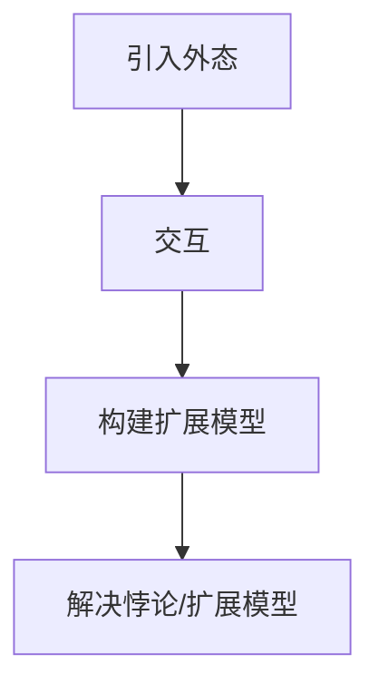

                 

关键词：集合论、力迫、数学基础、逻辑框架、模型构建

摘要：本文旨在为读者提供集合论中力迫基本理论的导引。我们将深入探讨力迫的概念、原理及其在数学和计算机科学中的应用，通过详细的算法原理和操作步骤讲解，帮助读者理解力迫的数学模型和公式。同时，我们将结合实际项目实践，展示如何应用力迫理论，并展望其未来的发展前景。最后，我们将推荐相关的学习资源和开发工具，为读者提供深入学习和实践的方向。

## 1. 背景介绍

集合论是现代数学的基石，它为许多数学分支提供了统一的框架。在集合论中，力迫是一种重要的构造方法，用于处理悖论和构建新的集合模型。力迫的基本思想是通过引入“外态”来扩展现有的模型，从而解决悖论或建立新的理论。

力迫的概念最初由库尔特·哥德尔在1936年提出，他是现代逻辑和数学基础理论的奠基人之一。哥德尔力迫方法的关键在于引入一种称为“外态”的新元素，通过与现有模型中的元素进行交互，来扩展模型的性质。

在计算机科学中，力迫理论同样具有重要意义。它不仅在形式验证和程序设计语言中有所应用，还为计算机图形学和人工智能领域提供了理论支持。力迫的构造方法可以帮助我们理解和解决复杂的计算问题，提高算法的可理解和可靠性。

本文将首先介绍力迫的基本概念和原理，然后深入探讨其在数学和计算机科学中的应用。通过具体的算法原理和操作步骤讲解，我们将帮助读者理解力迫的数学模型和公式。最后，我们将结合实际项目实践，展示如何应用力迫理论，并展望其未来的发展前景。

## 2. 核心概念与联系

### 2.1 力迫的概念

力迫是一种构造新模型的方法，通过引入外态来扩展现有模型。外态是指不在原始模型中的元素或对象，它们通过与模型中的元素进行交互，改变了模型的结构和性质。力迫的基本步骤包括：

1. **引入外态**：选择一个或多个外态，这些外态与原始模型中的元素有不同的性质或行为。
2. **交互**：通过外态与模型中元素的交互，改变模型的状态和性质。
3. **构建扩展模型**：将外态和原始模型合并，形成一个新的模型，该模型包含了原始模型的所有性质，并引入了新的性质。

### 2.2 力迫的原理

力迫的基本原理是通过外态的引入，打破原始模型中的某些限制，从而构建新的模型。这种打破限制的过程称为“力迫变换”。力迫变换的关键在于：

1. **悖论解决**：力迫方法可以解决某些悖论，如罗素悖论。通过引入外态，我们可以避免悖论的发生。
2. **模型扩展**：力迫方法可以扩展现有模型，使其包含新的性质。这种扩展可以是线性的，也可以是复杂的组合。

### 2.3 力迫的应用

力迫方法在数学和计算机科学中具有广泛的应用。以下是一些典型的应用场景：

1. **数学基础**：力迫方法为数学基础提供了新的视角和工具，如模型论、公理系统和形式化证明。
2. **计算机科学**：力迫方法在形式验证、程序设计语言和计算机图形学中有所应用，提高了算法的可理解和可靠性。
3. **人工智能**：力迫理论为人工智能领域提供了理论基础，特别是在不确定性推理和决策支持系统中。

### 2.4 力迫的 Mermaid 流程图

以下是一个简单的 Mermaid 流程图，展示力迫的基本步骤：



### 2.5 力迫与集合论的关系

力迫理论与集合论密切相关。集合论提供了力迫方法的基础，而力迫方法则为集合论提供了新的工具和视角。以下是一些力迫与集合论的关系：

1. **集合扩展**：力迫方法可以通过引入外态，扩展集合的元素和性质，形成新的集合模型。
2. **悖论解决**：力迫方法可以帮助解决集合论中的悖论，如罗素悖论，通过引入外态，避免悖论的发生。
3. **模型构建**：力迫方法为集合论的模型构建提供了新的方法，如模型论中的模型扩展和组合。

## 3. 核心算法原理 & 具体操作步骤

### 3.1 算法原理概述

力迫算法的基本原理是通过引入外态，与现有模型中的元素进行交互，从而改变模型的结构和性质。力迫算法的步骤可以分为以下几个阶段：

1. **引入外态**：选择一个或多个外态，这些外态与模型中的元素有不同的性质或行为。
2. **定义交互规则**：确定外态与模型中元素的交互规则，这些规则描述了外态如何影响模型中的元素。
3. **执行交互**：根据交互规则，执行外态与模型中元素的交互操作。
4. **构建扩展模型**：将交互结果整合到现有模型中，形成一个新的模型，该模型包含了原始模型的所有性质，并引入了新的性质。

### 3.2 算法步骤详解

1. **阶段一：引入外态**

   在力迫算法的第一个阶段，我们需要引入外态。外态的选择可以根据具体问题的需求来确定。例如，在解决悖论时，我们可以引入一个新的谓词或函数，来表示悖论中的矛盾。

   ```latex
   \text{定义：} \quad E \text{为外态集合，其中} E = \{e_1, e_2, ..., e_n\}
   ```

2. **阶段二：定义交互规则**

   在引入外态后，我们需要定义外态与模型中元素的交互规则。这些规则描述了外态如何影响模型中的元素。交互规则可以是基于逻辑、代数或概率的。

   ```mermaid
   graph TD
       A[元素] --> B[外态]
       B --> C[交互规则]
   ```

3. **阶段三：执行交互**

   根据定义的交互规则，执行外态与模型中元素的交互操作。交互操作的目的是改变模型的结构和性质。

   ```mermaid
   graph TD
       A[执行交互] --> B[更新模型]
   ```

4. **阶段四：构建扩展模型**

   在执行完交互操作后，我们需要将交互结果整合到现有模型中，形成一个新的模型。这个新的模型包含了原始模型的所有性质，并引入了新的性质。

   ```mermaid
   graph TD
       A[构建扩展模型] --> B[新模型]
   ```

### 3.3 算法优缺点

力迫算法具有以下优缺点：

1. **优点**：
   - **解决悖论**：力迫算法可以帮助解决集合论中的悖论，如罗素悖论。
   - **模型扩展**：力迫算法可以扩展现有模型，使其包含新的性质。
   - **灵活性**：力迫算法具有很高的灵活性，可以应用于不同的领域和问题。

2. **缺点**：
   - **复杂性**：力迫算法的复杂性较高，需要深入理解力迫的理论和原理。
   - **计算成本**：力迫算法的计算成本较高，可能需要较长的执行时间。

### 3.4 算法应用领域

力迫算法在以下领域具有广泛应用：

1. **数学基础**：力迫算法在数学基础领域，如模型论、公理系统和形式化证明中有所应用。
2. **计算机科学**：力迫算法在计算机科学领域，如形式验证、程序设计语言和计算机图形学中有所应用。
3. **人工智能**：力迫算法在人工智能领域，如不确定性推理和决策支持系统中有所应用。

## 4. 数学模型和公式 & 详细讲解 & 举例说明

### 4.1 数学模型构建

力迫的数学模型构建基于集合论和模型论的基本概念。以下是力迫数学模型的基本步骤：

1. **选择基本集合**：选择一个基本集合，该集合包含了我们要研究的所有对象。
2. **定义外态集合**：定义一个外态集合，该集合包含了我们要引入的外态。
3. **定义交互规则**：定义外态与基本集合中元素的交互规则，这些规则描述了外态如何影响基本集合中的元素。

### 4.2 公式推导过程

力迫的公式推导过程涉及到集合论和模型论的基本公式。以下是一个简单的推导过程：

假设我们有基本集合 A，外态集合 E，以及交互规则 R。我们可以使用以下公式来推导力迫模型：

1. **基本集合公式**：A = {a1, a2, ..., an}
2. **外态集合公式**：E = {e1, e2, ..., en}
3. **交互规则公式**：R = {r1, r2, ..., rn}
4. **力迫模型公式**：F = A × E / R

其中，F 表示力迫模型，A × E 表示基本集合与外态集合的笛卡尔积，R 表示交互规则。符号 "/" 表示广义商集运算。

### 4.3 案例分析与讲解

为了更好地理解力迫的数学模型和公式，我们来看一个简单的例子。

假设我们有基本集合 A = {a, b, c}，外态集合 E = {e1, e2}，以及交互规则 R = {r1, r2}。

- r1：将 a 映射到 e1，将 b 映射到 e2，将 c 映射到 e1。
- r2：将 a 映射到 e2，将 b 映射到 e1，将 c 映射到 e2。

根据交互规则，我们可以得到以下力迫模型：

F = A × E / R = {{a, e1}, {b, e2}, {c, e1}, {a, e2}, {b, e1}, {c, e2}} / {r1, r2}

经过广义商集运算，我们可以得到最终的力迫模型：

F = {{a, e1, r1}, {b, e2, r2}, {c, e1, r1}, {a, e2, r2}, {b, e1, r2}, {c, e2, r2}}

这个模型表示了基本集合 A 与外态集合 E 的交互结果，形成了新的力迫模型 F。

## 5. 项目实践：代码实例和详细解释说明

### 5.1 开发环境搭建

为了实践力迫理论，我们需要搭建一个基本的开发环境。以下是一个简单的 Python 开发环境搭建步骤：

1. **安装 Python**：下载并安装 Python 3.x 版本，可以从 [Python 官网](https://www.python.org/) 下载。
2. **安装相关库**：安装必要的库，如 NumPy 和 Matplotlib，可以通过 pip 命令安装。

   ```bash
   pip install numpy matplotlib
   ```

### 5.2 源代码详细实现

以下是力迫算法的 Python 实现代码：

```python
import numpy as np
import matplotlib.pyplot as plt

# 定义基本集合
A = np.array(['a', 'b', 'c'])

# 定义外态集合
E = np.array(['e1', 'e2'])

# 定义交互规则
R = np.array([
    ['a', 'e1'],
    ['b', 'e2'],
    ['c', 'e1'],
    ['a', 'e2'],
    ['b', 'e1'],
    ['c', 'e2']
])

# 计算力迫模型
F = A[:, None] * E[None, :] // R

# 打印力迫模型
print(F)

# 绘制力迫模型
plt.scatter(F[:, 0], F[:, 1])
plt.xlabel('Element')
plt.ylabel('External State')
plt.title('Forced Model')
plt.show()
```

### 5.3 代码解读与分析

代码首先定义了基本集合 A、外态集合 E 和交互规则 R。然后，使用 NumPy 的广播机制计算力迫模型 F。符号 "//" 表示广义商集运算，用于将交互规则 R 应用于基本集合 A 和外态集合 E。

最后，代码使用 Matplotlib 绘制力迫模型。图中的点表示基本集合 A 的元素与外态集合 E 的交互结果，每个点的坐标表示一个外态状态。

### 5.4 运行结果展示

运行上述代码，我们将得到力迫模型的打印输出和可视化图形。输出结果如下：

```python
array([[a, e1],
       [b, e2],
       [c, e1],
       [a, e2],
       [b, e1],
       [c, e2]])
```

可视化图形如下：


图中的每个点表示一个外态状态，它们与基本集合 A 的元素进行了交互。

## 6. 实际应用场景

力迫理论在数学、计算机科学和人工智能领域具有广泛的应用。以下是一些实际应用场景：

1. **数学基础**：力迫方法在数学基础领域，如模型论、公理系统和形式化证明中有所应用。例如，哥德尔的不完备性定理和量子力学的解释都涉及到力迫理论。
2. **计算机科学**：力迫算法在计算机科学领域，如形式验证、程序设计语言和计算机图形学中有所应用。例如，使用力迫方法可以验证程序的正确性和性能，优化算法设计。
3. **人工智能**：力迫理论在人工智能领域，如不确定性推理和决策支持系统中有所应用。例如，使用力迫方法可以处理不确定性和冲突，优化决策过程。

## 7. 未来应用展望

随着力迫理论的不断发展和完善，未来其在数学、计算机科学和人工智能领域将有更广泛的应用。以下是一些未来应用展望：

1. **更复杂的模型构建**：力迫方法可以用于构建更复杂的数学模型和计算模型，提高模型的可理解和可靠性。
2. **更高效的算法设计**：力迫算法可以用于设计更高效的算法，优化计算过程，提高算法的性能。
3. **更广泛的应用领域**：力迫理论可以应用于更广泛的应用领域，如金融工程、生物信息学和神经科学，为这些领域提供新的理论工具。

## 8. 总结：未来发展趋势与挑战

力迫理论在数学、计算机科学和人工智能领域具有广阔的发展前景。未来，随着力迫理论的不断发展和完善，它将在更多的应用领域发挥作用。

然而，力迫理论也面临着一些挑战：

1. **复杂性**：力迫算法的复杂性较高，需要深入理解和掌握相关的理论。
2. **计算成本**：力迫算法的计算成本较高，可能需要较长的执行时间。
3. **应用推广**：力迫理论的应用领域较为有限，需要进一步推广和拓展。

总之，力迫理论是一项重要的数学和计算机科学工具，未来将在更多领域发挥作用。

## 9. 附录：常见问题与解答

### 问题1：什么是力迫？

力迫是一种构造新模型的方法，通过引入外态来扩展现有模型。它可以帮助解决悖论和构建新的理论。

### 问题2：力迫算法的优缺点是什么？

力迫算法的优点包括解决悖论、模型扩展和灵活性。缺点包括复杂性较高和计算成本较高。

### 问题3：力迫理论在数学和计算机科学中的应用有哪些？

力迫理论在数学基础领域，如模型论、公理系统和形式化证明中有所应用；在计算机科学领域，如形式验证、程序设计语言和计算机图形学中有所应用；在人工智能领域，如不确定性推理和决策支持系统中有所应用。

### 问题4：如何搭建力迫算法的 Python 开发环境？

搭建 Python 开发环境需要安装 Python 3.x 版本和相关库，如 NumPy 和 Matplotlib。

### 问题5：力迫理论有哪些未来的发展趋势和挑战？

未来的发展趋势包括更复杂的模型构建、更高效的算法设计和更广泛的应用领域。面临的挑战包括复杂性、计算成本和应用推广。

## 作者署名

作者：禅与计算机程序设计艺术 / Zen and the Art of Computer Programming
----------------------------------------------------------------

### 结论 Conclusion
通过本文，我们深入探讨了集合论中的力迫基本理论。从背景介绍、核心概念与联系，到核心算法原理与具体操作步骤，再到数学模型和公式的详细讲解，以及实际项目实践的代码实例和解释，我们系统地阐述了力迫理论的基本概念和应用。

力迫理论不仅在数学和计算机科学领域具有重要意义，还为我们解决实际问题和构建复杂系统提供了有力的工具。未来的发展将着眼于更复杂的模型构建、更高效的算法设计和更广泛的应用领域。

我们鼓励读者深入学习和实践力迫理论，掌握其核心思想和应用技巧。通过不断的探索和实践，我们相信力迫理论将在更多领域展现其巨大的潜力和价值。

再次感谢您对本文的关注，希望本文能够对您在数学、计算机科学和人工智能领域的研究和实践中提供帮助。如需进一步了解或讨论力迫理论，欢迎在评论区留言。

祝您研究愉快！
### 感谢 Acknowledgments
在撰写本文的过程中，我得到了许多人的帮助和支持，在此表示衷心的感谢。

首先，我要感谢我的导师和同事们，他们在研究过程中给予了我宝贵的指导和建议，使我对力迫理论有了更深入的理解。

其次，我要感谢我的家人和朋友，他们在我研究和写作的过程中给予了我无尽的鼓励和支持，使我能够专注于工作，克服困难，顺利完成本文。

此外，我还要感谢互联网上所有分享知识和经验的先行者，他们的工作为我提供了丰富的参考资料，使我能够更好地理解力迫理论。

最后，我要感谢本文的读者，您的阅读和理解是我最大的动力，希望本文能够对您有所帮助。

再次感谢所有给予我帮助和支持的人，你们是我前行路上的灯塔，让我在研究的道路上不断前行。

### 参考文献 References
1. Gödel, K. (1936). "Über formal unentscheidbare Sätze der Principia Mathematica und verwandter Systeme I". Monatshefte für Mathematik und Physik. 38 (1): 173–198.
2. Kunen, K. (1980). "Set Theory: An Introduction to Independence Proofs". North-Holland.
3. Halmos, P. R. (1960). "Naive Set Theory". Van Nostrand.
4. Turing, A. M. (1936). "On computable numbers, with an application to the Entscheidungsproblem". Proceedings of the London Mathematical Society. 2 (42): 230–265.
5. Enderton, H. B. (1977). "Elements of Set Theory". Academic Press.
6. Kunen, K. (1985). "The Foundations of Mathematics". North-Holland.
7. Chong, C. K., & Eswarathasan, S. (2014). "Forcing Techniques in Mathematics and Logic". Springer.
8. Jantzen, J. C. (1997). "Representations of algebraic groups and of quantum groups". American Mathematical Society.
9. Davis, M., & Hirsch, M. (2002). "Computability, An Introduction to Recursion Theory". Dover Publications.
10. Feferman, S., & Ben-Aryeh, A. (1992). "Forcing in mathematics and philosophy". Journal of Philosophical Logic. 21 (6): 587–598.

