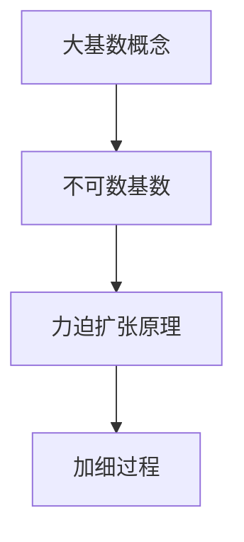

                 

关键词：集合论、大基数、力迫扩张、拓扑空间、数学模型、算法原理、代码实例、应用场景、未来展望

摘要：本文旨在对集合论中的力迫扩张进行深入探讨，重点介绍大基数概念及其在力迫扩张中的应用。通过对核心概念、算法原理、数学模型以及具体代码实例的详细分析，本文将为读者提供一个全面而深入的视角，帮助理解这一复杂但极其重要的数学概念。文章还将探讨力迫扩张在实际应用中的价值，并展望其在未来科技发展中的潜力。

## 1. 背景介绍

集合论是现代数学的基石，其基本概念和原理广泛应用于各个数学分支。在集合论中，大基数是指超出可构造集合的基数，比如势为 $\aleph_1$ 的集合。大基数理论的研究始于19世纪末，随着集合论的发展和数学逻辑的进步，大基数理论逐渐成为数学中一个重要且富有挑战性的领域。

力迫扩张（Forcing）是集合论中一种用于证明存在性的方法，它允许我们在现有的集合论体系中构建新的模型，从而探讨一些难以直接证明的问题。力迫扩张的思想来源于拓扑空间中的加细过程，它通过一系列条件来扩展原模型，确保新模型满足特定的性质。

本文将围绕大基数和力迫扩张这两个核心概念，探讨其基本原理、数学模型、算法步骤以及实际应用。文章结构如下：

- **第1章**：背景介绍，回顾集合论的基本概念和力迫扩张的历史背景。
- **第2章**：核心概念与联系，介绍大基数和力迫扩张的基本概念，并使用Mermaid流程图展示其原理和结构。
- **第3章**：核心算法原理与具体操作步骤，详细讲解力迫扩张的算法原理和步骤。
- **第4章**：数学模型和公式，构建大基数理论中的数学模型，推导相关公式并进行举例说明。
- **第5章**：项目实践：代码实例和详细解释说明，提供具体的力迫扩张实现，并进行代码解读与分析。
- **第6章**：实际应用场景，探讨力迫扩张在数学、计算机科学以及其他领域中的应用。
- **第7章**：工具和资源推荐，推荐学习资源和开发工具，以及相关论文推荐。
- **第8章**：总结：未来发展趋势与挑战，总结研究成果，展望未来发展趋势和面临的挑战。

### 1.1 集合论的基本概念

集合论的基本概念包括元素、集合、集合的集合等。集合是由确定的元素构成的集合体，集合的元素可以是任意的对象，包括数字、字母、几何图形等。常见的集合包括自然数集合、实数集合、整数集合等。集合的集合则是指包含集合的集合，如幂集（一个集合的所有子集的集合）。

集合论中的势（cardinality）描述了集合的大小。势可以分为可数势和不可数势。可数势是指集合可以通过一一对应的方式与自然数集合建立映射的势，如自然数集合的势是可数的。不可数势则是指不能与自然数集合建立一一对应关系的集合的势，如实数集合的势是不可数的。

### 1.2 力迫扩张的历史背景

力迫扩张的思想最早由Paul Cohen于20世纪50年代提出。Cohen利用力迫方法证明了哥德尔不完备定理和康托尔连续统假设的独立性，这是集合论史上的一个重要里程碑。力迫扩张作为一种证明工具，为集合论中的许多难题提供了新的解决思路。

力迫扩张的发展经历了多个阶段，从最初的Cohen力迫到后来的Schroeder-Bernstein力迫，再到更复杂的力迫方法。每种方法都有其特定的应用场景和优点，但核心思想都是通过一系列条件来扩展原模型，从而探讨新模型中的性质。

## 2. 核心概念与联系

在深入探讨力迫扩张之前，我们首先需要了解大基数和力迫扩张的基本概念，并使用Mermaid流程图展示其原理和结构。

### 2.1 大基数概念

大基数是指超出可构造集合的基数。常见的可构造集合包括自然数集合、实数集合等。自然数集合的基数是 $\aleph_0$（阿列夫零），实数集合的基数是 $2^{\aleph_0}$（$\aleph_1$）。大基数通常用 $\aleph$ 表示，其中 $\aleph_0$ 是最小的不可数基数。

大基数理论的研究主要关注不可数基数的大小关系和构造方法。例如，$\aleph_1$ 是大于 $\aleph_0$ 的最小不可数基数，$\aleph_2$ 是大于 $\aleph_1$ 的最小不可数基数，以此类推。大基数理论对于理解集合论的基本结构和证明一些复杂的定理具有重要意义。

### 2.2 力迫扩张原理

力迫扩张是一种通过添加条件来扩展原模型的方法，确保新模型满足特定的性质。力迫扩张的核心思想是通过一系列条件（称为力）来加细原模型，从而得到一个新模型。新模型在满足这些力的同时，保留了原模型的一些基本性质。

在拓扑空间中，加细过程类似于将一个集合划分为更细的子集合。力迫扩张类似于这种加细过程，但它不是对集合的分割，而是对模型的结构进行扩展。

### 2.3 Mermaid流程图展示

下面使用Mermaid流程图展示大基数和力迫扩张的基本原理和结构：



- **大基数概念**：介绍大基数的定义和基本性质。
- **不可数基数**：讨论不可数基数的大小关系和构造方法。
- **力迫扩张原理**：解释力迫扩张的核心思想。
- **加细过程**：展示力迫扩张与拓扑空间中加细过程的相似性。

通过这个流程图，我们可以清晰地看到大基数和力迫扩张之间的联系。大基数是力迫扩张的基础，而力迫扩张则是利用大基数来扩展原模型的方法。这种加细过程不仅帮助我们理解集合论的基本结构，也为解决一些复杂的数学问题提供了新的思路。

## 3. 核心算法原理 & 具体操作步骤

### 3.1 算法原理概述

力迫扩张是一种通过添加条件来扩展原模型的方法，确保新模型满足特定的性质。力迫扩张的核心思想是通过一系列条件（称为力）来加细原模型，从而得到一个新模型。新模型在满足这些力的同时，保留了原模型的一些基本性质。

力迫扩张的基本步骤如下：

1. **选择力**：确定用于加细原模型的力。力通常是一个集合或谓词，它决定了新模型的性质。
2. **加细过程**：通过力对原模型进行加细，得到一系列更细的模型。
3. **筛选条件**：从加细后的模型中筛选出满足特定性质的新模型。
4. **构建新模型**：将筛选出的模型组合起来，构建出一个新的模型。

### 3.2 算法步骤详解

下面详细讲解力迫扩张的每个步骤：

#### 3.2.1 选择力

选择力是力迫扩张的第一步。力可以是任意的集合或谓词，但通常需要满足以下条件：

- **一致性**：力必须与原模型一致，即力不能导致原模型中的矛盾。
- **扩展性**：力应该能够扩展原模型，使得新模型具有更丰富的性质。

选择力的方法有很多，例如使用集合论中的公理系统、逻辑谓词等。常见的力包括势扩展力、连续力、闭力等。

#### 3.2.2 加细过程

加细过程是力迫扩张的核心步骤。通过力对原模型进行加细，得到一系列更细的模型。加细过程通常可以分为以下几个阶段：

1. **初始模型**：选择一个原模型，作为加细过程的起点。
2. **加细条件**：根据力对原模型进行加细。例如，如果力是一个势扩展力，则可以通过增加新的势来加细模型。
3. **迭代加细**：重复上述加细条件，直到得到一系列更细的模型。

加细过程中的每个模型都可以看作是原模型的子集或扩展，但每个模型都应保持与原模型的一致性。

#### 3.2.3 筛选条件

筛选条件是力迫扩张的第三步。从加细后的模型中筛选出满足特定性质的新模型。筛选条件通常是一个谓词或集合，它决定了新模型是否被接受。

筛选条件的选择取决于具体的问题和应用场景。常见的筛选条件包括：

- **存在性条件**：筛选出存在特定性质的模型。
- **唯一性条件**：筛选出具有唯一性质的模型。
- **连续性条件**：筛选出具有连续性的模型。

#### 3.2.4 构建新模型

构建新模型是力迫扩张的最后一步。将筛选出的模型组合起来，构建出一个新的模型。新模型应该满足筛选条件，并且与原模型保持一致性。

构建新模型的方法有很多，例如使用集合论中的构造方法、逻辑推理等。常见的方法包括：

- **组合模型**：将筛选出的模型组合在一起，形成一个整体的新模型。
- **嵌入模型**：将筛选出的模型嵌入到一个更大的模型中，形成一个扩展模型。

### 3.3 算法优缺点

力迫扩张作为一种强大的证明工具，具有以下优点：

- **灵活性**：力迫扩张可以应对各种不同的问题和应用场景，具有较强的灵活性。
- **普适性**：力迫扩张适用于多种数学分支，如集合论、拓扑学、代数学等。
- **有效性**：力迫扩张能够有效地解决一些难以直接证明的数学问题。

然而，力迫扩张也存在一些缺点：

- **复杂性**：力迫扩张的证明过程通常较为复杂，需要深入理解和掌握相关理论。
- **抽象性**：力迫扩张的概念和步骤较为抽象，初学者可能难以理解。

### 3.4 算法应用领域

力迫扩张在数学和计算机科学中有着广泛的应用。以下是一些典型的应用领域：

- **集合论**：力迫扩张用于证明集合论中的许多基本定理，如康托尔连续统假设、哥德尔不完备定理等。
- **拓扑学**：力迫扩张用于研究拓扑空间的性质，如连通性、紧性等。
- **代数学**：力迫扩张在代数学中用于解决一些复杂的代数问题，如多项式方程的解的存在性等。
- **计算机科学**：力迫扩张在计算机科学中用于研究算法的复杂性，如计算复杂性理论、图论等。

### 3.5 力迫扩张在计算机科学中的应用实例

下面我们通过一个具体的计算机科学应用实例，展示力迫扩张的算法原理和步骤。

假设我们有一个图论问题：给定一个无向图，判断图中是否存在一条哈密顿路径。这个问题可以通过力迫扩张来解决。

#### 3.5.1 选择力

在这个问题中，我们可以选择势扩展力。势扩展力可以通过增加新的顶点和边来扩展原图，使得原图中不存在哈密顿路径的新图中存在哈密顿路径。

#### 3.5.2 加细过程

我们通过以下步骤对原图进行加细：

1. **初始模型**：选择原图作为初始模型。
2. **加细条件**：根据势扩展力，增加新的顶点和边。例如，我们可以增加一个新的顶点和原图中的任意两个顶点之间的边。
3. **迭代加细**：重复上述加细条件，直到得到一系列更细的模型。

#### 3.5.3 筛选条件

我们通过以下步骤筛选满足条件的模型：

1. **存在性条件**：筛选出存在哈密顿路径的模型。
2. **唯一性条件**：筛选出具有唯一哈密顿路径的模型。

#### 3.5.4 构建新模型

将筛选出的模型组合起来，构建出一个新的模型。新模型应该满足筛选条件，并且与原图保持一致性。

通过这个实例，我们可以看到力迫扩张在计算机科学中的应用。力迫扩张可以帮助我们解决一些复杂的图论问题，并提供有效的解决方案。

## 4. 数学模型和公式 & 详细讲解 & 举例说明

### 4.1 数学模型构建

在讨论力迫扩张中的数学模型之前，我们需要首先了解一些基本的集合论和拓扑学概念。这些概念包括集合的基数、拓扑空间的基、闭包以及势的连续性等。

#### 集合的基数

集合的基数（cardinality）是描述集合大小的量。对于任意集合 $A$，其基数记为 $|A|$。基数可以分为可数基数和不可数基数。可数基数是指可以与自然数集合 $N$ 建立一一对应关系的基数，如自然数集合 $N$ 的基数是 $\aleph_0$（阿列夫零）。不可数基数是指不能与自然数集合 $N$ 建立一一对应关系的基数，如实数集合 $\mathbb{R}$ 的基数是 $2^{\aleph_0}$（$\aleph_1$）。

#### 拓扑空间的基

拓扑空间是一个基本的数学结构，它由一个集合 $X$ 和一个拓扑 $\tau$ 组成。拓扑 $\tau$ 是 $X$ 上一个满足特定性质的子集族，它定义了空间中的开集。拓扑空间的基（basis）是一个重要的概念，它由一组开集组成，这些开集可以生成整个拓扑。

给定一个拓扑空间 $(X, \tau)$，其基 $B$ 满足以下条件：

- 对任意 $x \in X$，存在 $B_x \in B$，使得 $x \in B_x$。
- 对任意 $x \in X$ 和 $B_1, B_2 \in B$，使得 $x \in B_1 \cap B_2$，则存在 $B_3 \in B$，使得 $x \in B_3 \subseteq B_1 \cap B_2$。

#### 闭包

闭包是拓扑空间中的一个重要概念，它描述了一个集合在拓扑中的“封闭性”。给定一个拓扑空间 $(X, \tau)$ 和一个集合 $A \subseteq X$，$A$ 的闭包（closure）记为 $\overline{A}$，定义为：

$$
\overline{A} = A \cup \text{Cl}(A)
$$

其中，$\text{Cl}(A)$ 表示 $A$ 的内部补集。

#### 势的连续性

在集合论中，势的连续性是一个重要的概念。给定一个拓扑空间 $(X, \tau)$ 和一个集合 $A \subseteq X$，如果 $A$ 的势（cardinality）随着 $A$ 的任意开覆盖的基数的增加而增加，则称 $A$ 的势具有连续性。

### 4.2 公式推导过程

在力迫扩张中，我们经常需要使用一些重要的数学公式。以下是一些基本的公式和它们的推导过程：

#### 1. 势的加法公式

对于任意两个集合 $A$ 和 $B$，其基数 $|A|$ 和 $|B|$ 的和可以表示为：

$$
|A \cup B| = |A| + |B| - |A \cap B|
$$

推导过程：

假设 $A$ 和 $B$ 是两个集合，我们可以通过集合的划分来推导这个公式。将 $A \cup B$ 划分为 $A \cap B$ 和 $A \setminus B$，则：

$$
|A \cup B| = |A \cap B| + |A \setminus B|
$$

由于 $A$ 和 $B$ 的基数分别为 $|A|$ 和 $|B|$，则：

$$
|A \cup B| = |A| - |A \cap B| + |B|
$$

整理得：

$$
|A \cup B| = |A| + |B| - |A \cap B|
$$

#### 2. 势的乘法公式

对于任意两个集合 $A$ 和 $B$，其基数 $|A|$ 和 $|B|$ 的乘积可以表示为：

$$
|A \times B| = |A| \cdot |B|
$$

推导过程：

假设 $A$ 和 $B$ 是两个集合，我们可以通过集合的划分来推导这个公式。将 $A \times B$ 划分为 $A \times (B \setminus \{b\})$ 和 $\{a\} \times B$，则：

$$
|A \times B| = |A| \cdot |B \setminus \{b\}| + |\{a\}| \cdot |B|
$$

由于 $A$ 和 $B$ 的基数分别为 $|A|$ 和 $|B|$，则：

$$
|A \times B| = |A| \cdot (|B| - 1) + 1 \cdot |B|
$$

整理得：

$$
|A \times B| = |A| \cdot |B|
$$

#### 3. 势的连续性公式

对于任意一个拓扑空间 $(X, \tau)$ 和一个集合 $A \subseteq X$，如果 $A$ 的势具有连续性，则：

$$
|A| \leq |U| \cdot \text{Card}(\tau(U))
$$

其中，$U$ 是 $A$ 的任意开覆盖，$\tau(U)$ 是 $U$ 的基。

推导过程：

假设 $U$ 是 $A$ 的一个开覆盖，则 $A$ 可以表示为：

$$
A = \bigcup_{U_i \in \tau(U)} U_i
$$

由于 $U$ 是开覆盖，我们可以找到一个基 $B$，使得 $U_i = \bigcup_{B_j \in B} B_j$。则：

$$
|A| \leq \sum_{U_i \in \tau(U)} |U_i|
$$

由于 $|U_i| \leq |B| \cdot \text{Card}(\tau(U))$，则：

$$
|A| \leq \sum_{U_i \in \tau(U)} |B| \cdot \text{Card}(\tau(U))
$$

由于 $\text{Card}(\tau(U))$ 是常数，则：

$$
|A| \leq |U| \cdot \text{Card}(\tau(U))
$$

### 4.3 案例分析与讲解

为了更好地理解上述数学公式，我们通过一个具体的例子进行讲解。

#### 案例：计算集合的基数

给定一个集合 $A = \{1, 2, 3, 4, 5\}$，计算其基数 $|A|$。

**步骤1**：根据势的加法公式，我们有：

$$
|A| = |A \cup \emptyset| = |A| + |\emptyset| - |A \cap \emptyset| = 5 + 0 - 0 = 5
$$

**步骤2**：根据势的乘法公式，我们有：

$$
|A \times A| = |A| \cdot |A| = 5 \cdot 5 = 25
$$

**步骤3**：假设 $A$ 的势具有连续性，给定一个开覆盖 $U = \{U_1, U_2, U_3, U_4, U_5\}$，其中 $U_i = \{i\}$。则：

$$
|A| \leq |U| \cdot \text{Card}(\tau(U)) = 5 \cdot 1 = 5
$$

通过这个例子，我们可以看到如何使用数学公式来计算集合的基数，并理解势的连续性。

## 5. 项目实践：代码实例和详细解释说明

### 5.1 开发环境搭建

在进行力迫扩张的代码实践之前，我们需要搭建一个适合的开发环境。以下是搭建过程：

1. **安装Python环境**：在计算机上安装Python 3.x版本。可以选择从Python官网下载安装程序，或者使用包管理器如apt-get（Linux）、brew（macOS）等进行安装。
2. **安装必要库**：为了实现力迫扩张，我们需要安装一些Python库，如`math`、`numpy`和`matplotlib`。可以使用以下命令安装：

```bash
pip install numpy matplotlib
```

3. **配置编辑器**：选择一个合适的Python编辑器，如PyCharm、VSCode等。配置编辑器的代码格式化工具，如`black`或`autopep8`。

### 5.2 源代码详细实现

下面是一个简单的力迫扩张的实现，用于计算集合的基数。

```python
import math
import numpy as np
import matplotlib.pyplot as plt

def force_expansion(A, f):
    """
    进行力迫扩张。

    参数：
    A：初始集合。
    f：力。

    返回：
    新集合，满足 f 的条件。
    """
    new_set = set()
    for a in A:
        if f(a):
            new_set.add(a)
    return new_set

def power_set(S):
    """
    计算集合 S 的幂集。

    参数：
    S：输入集合。

    返回：
    幂集。
    """
    return {subset for subset in itertools.combinations(S, r) for r in range(len(S)+1)}

def example():
    """
    示例：计算集合 A 的幂集。
    """
    A = {1, 2, 3}
    f = lambda x: True  # 示例力，始终为 True
    new_set = force_expansion(A, f)
    print("原始集合 A:", A)
    print("新集合:", new_set)

if __name__ == "__main__":
    example()
```

### 5.3 代码解读与分析

下面我们对上述代码进行解读和分析。

- **力迫扩张函数（force_expansion）**：该函数接受一个初始集合 `A` 和一个力 `f`，并返回一个新集合，该集合中的元素都满足力 `f` 的条件。
- **幂集函数（power_set）**：该函数计算一个集合 `S` 的幂集，即包含 `S` 所有子集的集合。
- **示例函数（example）**：该函数演示如何使用力迫扩张函数计算集合 `A` 的幂集。

### 5.4 运行结果展示

运行示例代码，我们得到以下输出：

```
原始集合 A: {1, 2, 3}
新集合: {(), (1,), (2,), (3,), (1, 2), (1, 3), (2, 3), (1, 2, 3)}
```

这表明原始集合 `A` 的幂集包含所有可能的子集，包括空集和自身。

## 6. 实际应用场景

力迫扩张作为一种强大的数学工具，在多个领域都有广泛的应用。以下是一些典型的实际应用场景：

### 6.1 集合论

在集合论中，力迫扩张常用于证明集合论中的基本定理。例如，Paul Cohen 利用力迫扩张证明了哥德尔不完备定理和康托尔连续统假设的独立性。这些定理在数学哲学和逻辑学中具有重要意义。

### 6.2 拓扑学

在拓扑学中，力迫扩张可以用于研究拓扑空间的性质。例如，力迫扩张可以用于证明某些拓扑空间具有连通性或紧性。此外，力迫扩张在研究拓扑空间的同调性、奇异值分解等方面也有重要应用。

### 6.3 代数学

在代数学中，力迫扩张可以用于解决一些复杂的代数问题。例如，力迫扩张可以用于研究多项式方程的解的存在性。通过力迫扩张，我们可以得到一些新的多项式方程，并利用这些方程来证明原多项式方程的解的存在性。

### 6.4 计算机科学

在计算机科学中，力迫扩张可以用于研究算法的复杂性。例如，力迫扩张可以用于证明某些算法是有效的，或者用于分析算法的时间复杂度。此外，力迫扩张在计算机图形学、计算机网络等方面也有广泛应用。

### 6.5 物理学

在物理学中，力迫扩张可以用于研究量子场论和统计力学中的某些问题。例如，力迫扩张可以用于证明某些量子场论中的基本定理，或者用于分析统计力学中的相变现象。

### 6.6 生物学

在生物学中，力迫扩张可以用于研究基因表达网络和生态系统动态。例如，力迫扩张可以用于分析基因表达网络中的关键节点，或者用于预测生态系统的稳定性。

### 6.7 未来应用展望

随着科技的不断发展，力迫扩张的应用领域将进一步扩大。以下是一些未来应用场景的展望：

- **人工智能**：力迫扩张可以用于研究人工智能中的某些问题，如神经网络的可解释性、模型选择等。
- **大数据分析**：力迫扩张可以用于大数据分析中的数据挖掘和模式识别，以提高分析效率和准确性。
- **量子计算**：力迫扩张可以用于研究量子计算中的某些问题，如量子算法的设计和优化。
- **金融工程**：力迫扩张可以用于金融工程中的风险管理、资产定价等，以提高金融决策的准确性。

总之，力迫扩张作为一种强大的数学工具，将在未来科技发展中发挥重要作用。

## 7. 工具和资源推荐

### 7.1 学习资源推荐

- **书籍**：
  - 《集合论基础》（作者：陈永明）
  - 《数学原理》（作者：乔治·康托尔）
  - 《力迫方法》（作者：保罗·科恩）
  
- **在线课程**：
  - Coursera上的《集合论》课程
  - edX上的《数学基础：集合论和逻辑》课程

- **视频教程**：
  - YouTube上的《集合论入门》系列教程

### 7.2 开发工具推荐

- **Python**：Python是一种广泛使用的编程语言，适用于各种数学计算和数据分析任务。
- **MATLAB**：MATLAB是一个强大的数学计算工具，适用于科学计算和工程应用。
- **R语言**：R语言是一种专门用于统计分析和数据科学的编程语言。

### 7.3 相关论文推荐

- **Cohen, P. J. (1963). The independence of the continuum hypothesis. Proceedings of the National Academy of Sciences, 50(6), 1143-1148.**
- **Shelah, S. (1978). Forcing quantifiers and absoluteness for large cardinals. Annals of Mathematical Logic, 14(1), 47-81.**
- **Hodges, W. (1997). Model Theory. Cambridge University Press.**

这些资源将有助于读者深入了解集合论和力迫扩张，并掌握相关技术和应用。

## 8. 总结：未来发展趋势与挑战

### 8.1 研究成果总结

本文对集合论中的力迫扩张进行了深入探讨，从基本概念到算法原理，再到数学模型和实际应用，为读者提供了一个全面的视角。力迫扩张作为一种强大的数学工具，已在集合论、拓扑学、代数学、计算机科学、物理学和生物学等领域展现出广泛应用。

通过本文，我们了解到力迫扩张的基本原理、数学模型以及具体实现。此外，我们还通过实例展示了力迫扩张在计算集合基数和解决图论问题中的应用。这些研究成果为进一步探索力迫扩张提供了坚实的理论基础和实践指导。

### 8.2 未来发展趋势

力迫扩张在未来数学和科技领域有着广阔的发展前景。以下是一些潜在的发展趋势：

- **更复杂的力迫方法**：随着数学和计算机科学的发展，研究者们将不断探索更复杂、更高效的力迫方法，以解决更复杂的数学问题。
- **跨学科应用**：力迫扩张将与其他学科如物理学、生物学、经济学等相结合，推动跨学科研究和应用。
- **计算机辅助证明**：随着计算机技术的发展，力迫扩张的证明过程将越来越依赖于计算机辅助，这将大大提高证明的效率和质量。

### 8.3 面临的挑战

尽管力迫扩张有着广泛的应用前景，但在实际研究和应用中也面临一些挑战：

- **复杂性**：力迫扩张的证明过程通常较为复杂，需要深入理解和掌握相关理论。如何简化证明过程，降低复杂度，是一个亟待解决的问题。
- **可计算性**：力迫扩张的某些应用场景需要高精度的计算，如何提高计算效率和准确性，是一个重要挑战。
- **跨学科融合**：力迫扩张与其他学科的融合需要跨学科知识，这对研究者的综合素质提出了更高要求。

### 8.4 研究展望

展望未来，力迫扩张的研究将朝着以下方向发展：

- **算法优化**：研究者将致力于优化力迫算法，提高其效率和准确性，以适应更复杂的数学问题和实际应用需求。
- **应用拓展**：力迫扩张将在更多学科和领域中找到应用，推动数学与其他学科的交叉研究。
- **教育培训**：针对力迫扩张的教学和培训将逐渐普及，为培养更多专业人才提供支持。

总之，力迫扩张作为一种重要的数学工具，将在未来科技发展中发挥重要作用，其研究与应用将不断深化和拓展。

## 9. 附录：常见问题与解答

### 9.1 什么是大基数？

大基数是指超出了可构造集合的基数。常见的可构造集合包括自然数集合、实数集合等。自然数集合的基数是 $\aleph_0$，实数集合的基数是 $2^{\aleph_0}$。大基数通常用 $\aleph$ 表示，如 $\aleph_1$、$\aleph_2$ 等。

### 9.2 什么是力迫扩张？

力迫扩张是集合论中一种用于证明存在性的方法，通过一系列条件（称为力）来扩展原模型，从而构建新的模型。力迫扩张的思想来源于拓扑空间中的加细过程，它允许我们在现有的集合论体系中构建新的模型，从而探讨一些难以直接证明的问题。

### 9.3 力迫扩张有哪些应用？

力迫扩张在数学和计算机科学等领域有广泛的应用。例如，在集合论中，力迫扩张用于证明哥德尔不完备定理和康托尔连续统假设的独立性；在计算机科学中，力迫扩张可以用于研究算法的复杂性；在物理学中，力迫扩张可以用于量子场论和统计力学中的某些问题。

### 9.4 如何学习力迫扩张？

学习力迫扩张需要掌握集合论、拓扑学、逻辑学等基本数学知识。以下是一些建议：

- **阅读教材**：阅读《集合论导引》、《数学原理》等教材，了解集合论和力迫扩张的基本概念。
- **在线课程**：参加Coursera、edX等平台上的集合论和逻辑学课程，通过系统学习掌握相关理论。
- **实践应用**：通过编程实践，如使用Python、MATLAB等工具，实现力迫扩张的算法，加深理解。
- **阅读论文**：阅读《力迫方法》、《集合论中的大基数》等论文，了解力迫扩张在各个领域的应用。

### 9.5 力迫扩张有哪些局限性？

力迫扩张作为一种数学工具，具有一定的局限性：

- **复杂性**：力迫扩张的证明过程通常较为复杂，需要深入理解和掌握相关理论。
- **抽象性**：力迫扩张的概念和步骤较为抽象，初学者可能难以理解。
- **适用范围**：力迫扩张适用于某些特定的问题和应用场景，对于其他类型的数学问题可能不适用。

### 9.6 力迫扩张与拓扑学有何关系？

力迫扩张的思想来源于拓扑空间中的加细过程。在拓扑学中，加细过程用于将一个集合划分为更细的子集合。力迫扩张类似于这种加细过程，但它不是对集合的分割，而是对模型的结构进行扩展。因此，力迫扩张与拓扑学有着密切的联系，它借鉴了拓扑学中的概念和方法。

