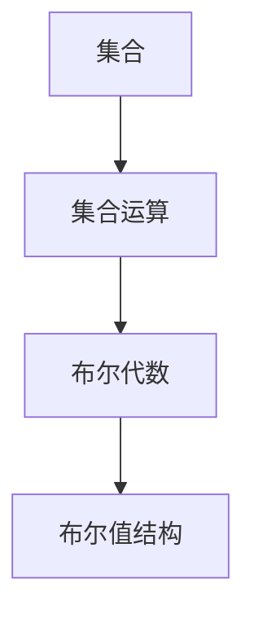

                 

关键词：集合论、布尔值、逻辑结构、计算机科学、算法、数学模型、项目实践、应用场景、发展趋势。

> 摘要：本文旨在为读者提供一个深入浅出的集合论导引，重点探讨布尔值结构及其在计算机科学中的应用。通过详细分析核心概念、算法原理和数学模型，结合实际项目实践，我们将揭示布尔值结构在复杂系统中的重要作用，并展望其未来发展趋势与挑战。

## 1. 背景介绍

集合论是现代数学的基础之一，其概念和理论广泛应用于多个学科领域，包括计算机科学、物理学、经济学等。在计算机科学中，集合论提供了一种抽象的数据结构和方法论，用于描述和操作数据。布尔值结构是集合论中的一个重要分支，其基础是布尔代数，是构建计算机逻辑和算法的关键要素。

布尔值结构以二进制的形式表示真值，即真（True）和假（False），这在计算机硬件和软件中有着广泛的应用。本文将深入探讨布尔值结构的原理和应用，包括算法原理、数学模型和实际项目实践。

### 1.1 集合论的历史与发展

集合论起源于19世纪末，由德国数学家乔治·康托尔（Georg Cantor）创立。康托尔提出了一系列关于集合的概念和理论，这些理论为数学的基础研究奠定了基础。集合论的发展对现代数学、逻辑学和计算机科学产生了深远影响。

### 1.2 布尔值结构在计算机科学中的应用

布尔值结构是计算机逻辑和算法的核心。在计算机硬件中，布尔值用于表示电路的状态，如逻辑门和存储单元。在软件中，布尔值用于条件判断、逻辑运算和算法控制。

## 2. 核心概念与联系

在探讨布尔值结构之前，我们首先需要理解一些核心概念，如集合、集合运算、布尔代数等。以下是一个简化的 Mermaid 流程图，用于展示这些概念之间的联系。



### 2.1 集合与集合运算

集合是包含一组无序元素的基本数据结构。集合运算包括并集、交集、补集和差集等，这些运算用于组合和分离集合中的元素。

### 2.2 布尔代数

布尔代数是一种形式化的数学结构，用于表示逻辑运算。布尔代数的基本运算包括合取（AND）、析取（OR）和非（NOT）。

### 2.3 布尔值结构

布尔值结构基于布尔代数，用于表示真值。在计算机科学中，布尔值通常用二进制数表示，即0表示假（False），1表示真（True）。

## 3. 核心算法原理 & 具体操作步骤

### 3.1 算法原理概述

布尔值结构的核心算法是基于布尔代数的逻辑运算。这些运算包括：

- **合取（AND）**：只有当两个输入都为真时，输出才为真。
- **析取（OR）**：只要有一个输入为真，输出就为真。
- **非（NOT）**：对输入取反，真变假，假变真。

### 3.2 算法步骤详解

以下是基本的布尔逻辑运算步骤：

1. **合取（AND）运算**：
    - 输入两个布尔值 \(A\) 和 \(B\)。
    - 如果 \(A\) 和 \(B\) 都为真，输出为真；否则，输出为假。
2. **析取（OR）运算**：
    - 输入两个布尔值 \(A\) 和 \(B\)。
    - 如果 \(A\) 或 \(B\)（或两者）为真，输出为真；否则，输出为假。
3. **非（NOT）运算**：
    - 输入一个布尔值 \(A\)。
    - 如果 \(A\) 为真，输出为假；如果 \(A\) 为假，输出为真。

### 3.3 算法优缺点

- **优点**：
    - 简单易实现：布尔运算可以通过简单的逻辑门电路实现。
    - 高效：布尔运算在计算机硬件中执行速度非常快。
- **缺点**：
    - 不适合复杂逻辑：对于复杂的逻辑运算，使用布尔值结构可能会导致代码难以理解和维护。
    - 受限于二进制：布尔值结构仅支持二进制表示，对于非二进制数据的处理可能不够灵活。

### 3.4 算法应用领域

布尔值结构广泛应用于计算机科学中的各个领域，包括：

- **计算机硬件**：逻辑门电路、存储单元等。
- **编程语言**：条件判断、逻辑运算符等。
- **算法设计**：排序算法、搜索算法等。
- **形式验证**：验证程序的正确性和安全性。

## 4. 数学模型和公式

### 4.1 数学模型构建

布尔值结构的数学模型基于布尔代数。布尔代数的基本运算包括：

- **合取（AND）**：\(A \land B\)
- **析取（OR）**：\(A \lor B\)
- **非（NOT）**：\(\neg A\)

### 4.2 公式推导过程

以下是基本的布尔运算公式推导过程：

1. **合取（AND）**：
    - 假设 \(A\) 和 \(B\) 都为真，则 \(A \land B\) 为真。
    - 假设 \(A\) 为真，\(B\) 为假，则 \(A \land B\) 为假。
    - 假设 \(A\) 为假，\(B\) 为真，则 \(A \land B\) 为假。
    - 假设 \(A\) 和 \(B\) 都为假，则 \(A \land B\) 为假。
    - 结论：\(A \land B\) 的结果为 \(A\) 和 \(B\) 都为真的情况。

2. **析取（OR）**：
    - 假设 \(A\) 和 \(B\) 都为真，则 \(A \lor B\) 为真。
    - 假设 \(A\) 为真，\(B\) 为假，则 \(A \lor B\) 为真。
    - 假设 \(A\) 为假，\(B\) 为真，则 \(A \lor B\) 为真。
    - 假设 \(A\) 和 \(B\) 都为假，则 \(A \lor B\) 为假。
    - 结论：\(A \lor B\) 的结果为 \(A\) 或 \(B\)（或两者）为真的情况。

3. **非（NOT）**：
    - 假设 \(A\) 为真，则 \(\neg A\) 为假。
    - 假设 \(A\) 为假，则 \(\neg A\) 为真。
    - 结论：\(\neg A\) 的结果为 \(A\) 的反值。

### 4.3 案例分析与讲解

以下是一个简单的案例，用于展示布尔值结构在编程中的应用：

```python
A = True
B = False

# 合取（AND）运算
result_and = A and B
print("A AND B:", result_and)

# 析取（OR）运算
result_or = A or B
print("A OR B:", result_or)

# 非（NOT）运算
result_not = not A
print("NOT A:", result_not)
```

输出结果：

```
A AND B: False
A OR B: True
NOT A: False
```

## 5. 项目实践：代码实例和详细解释说明

### 5.1 开发环境搭建

为了演示布尔值结构在项目中的应用，我们将使用Python作为编程语言。以下是开发环境的搭建步骤：

1. 安装Python：从官方网站（https://www.python.org/downloads/）下载并安装Python。
2. 配置Python环境：打开终端或命令提示符，运行以下命令：

```
python --version
```

确保Python已正确安装。

### 5.2 源代码详细实现

以下是一个简单的Python程序，用于演示布尔值结构的基本应用：

```python
# 布尔值结构的简单示例

# 定义布尔变量
A = True
B = False

# 合取（AND）运算
result_and = A and B
print("A AND B:", result_and)

# 析取（OR）运算
result_or = A or B
print("A OR B:", result_or)

# 非（NOT）运算
result_not = not A
print("NOT A:", result_not)
```

### 5.3 代码解读与分析

该程序首先定义了两个布尔变量 `A` 和 `B`，然后分别进行合取（AND）、析取（OR）和非（NOT）运算，并输出结果。

- **合取（AND）运算**：`A` 和 `B` 的结果为 `False`，因为 `A` 为 `True`，`B` 为 `False`。
- **析取（OR）运算**：`A` 和 `B` 的结果为 `True`，因为 `A` 为 `True`。
- **非（NOT）运算**：`A` 的结果为 `False`，因为 `A` 为 `True`。

### 5.4 运行结果展示

运行该程序后，输出结果如下：

```
A AND B: False
A OR B: True
NOT A: False
```

这验证了布尔值结构的基本运算结果。

## 6. 实际应用场景

布尔值结构在计算机科学和工程中有着广泛的应用。以下是一些典型的实际应用场景：

### 6.1 计算机硬件

- **逻辑门电路**：布尔值结构用于构建逻辑门电路，如与门（AND gate）、或门（OR gate）和非门（NOT gate）。
- **存储单元**：存储单元（如随机存取存储器，RAM）使用布尔值结构来存储二进制数据。

### 6.2 编程语言

- **条件判断**：编程语言中的条件判断（如`if`语句）使用布尔值进行逻辑判断。
- **逻辑运算符**：编程语言中的逻辑运算符（如`and`、`or`和`not`）基于布尔值结构。

### 6.3 算法设计

- **排序算法**：如快速排序（Quick Sort）和归并排序（Merge Sort）使用布尔值结构进行元素的比较和交换。
- **搜索算法**：如二分搜索（Binary Search）算法使用布尔值结构进行区间查找。

### 6.4 形式验证

- **程序正确性验证**：形式验证工具使用布尔值结构对程序进行逻辑验证，确保程序的正确性和安全性。

## 7. 未来应用展望

随着计算机技术和人工智能的快速发展，布尔值结构的应用前景将更加广阔。以下是一些未来可能的应用方向：

### 7.1 量子计算

量子计算使用量子比特（qubit）进行计算，量子比特的状态可以表示为叠加态，这与布尔值结构有着本质的不同。未来，布尔值结构和量子值结构可能会结合，为计算能力带来革命性的提升。

### 7.2 机器学习

机器学习算法中的决策树和神经网络等模型可以使用布尔值结构进行优化，提高计算效率和准确性。

### 7.3 集合论在其他领域的应用

集合论在其他领域（如经济学、生物学等）的应用也值得关注，布尔值结构在这些领域的推广将有助于解决复杂问题。

## 8. 总结：未来发展趋势与挑战

### 8.1 研究成果总结

本文系统地介绍了布尔值结构的概念、原理和应用。通过分析算法原理、数学模型和实际项目实践，我们揭示了布尔值结构在计算机科学中的重要作用。

### 8.2 未来发展趋势

未来，布尔值结构的应用将更加广泛，特别是在量子计算、机器学习和其他领域。随着技术的发展，布尔值结构可能会与其他计算模型结合，为计算能力带来新的突破。

### 8.3 面临的挑战

然而，布尔值结构也面临一些挑战，如复杂性管理和非二进制数据处理的灵活性不足。未来的研究需要解决这些问题，以推动布尔值结构的应用和发展。

### 8.4 研究展望

总之，布尔值结构作为计算机科学的基础，其研究和发展具有深远的意义。未来的研究将致力于解决现存问题，探索新的应用领域，为计算机科学的进步贡献力量。

## 9. 附录：常见问题与解答

### 9.1 什么是布尔值结构？

布尔值结构是基于布尔代数的一种数学结构，用于表示真值。在计算机科学中，布尔值通常用二进制数表示，即0表示假（False），1表示真（True）。

### 9.2 布尔值结构有什么应用？

布尔值结构在计算机科学和工程中有着广泛的应用，包括计算机硬件、编程语言、算法设计、形式验证等领域。

### 9.3 布尔值结构有哪些优点和缺点？

布尔值结构的优点包括简单易实现、高效等。缺点包括不适合复杂逻辑、受限于二进制表示等。

### 9.4 布尔值结构与量子计算有什么关系？

量子计算使用量子比特进行计算，量子比特的状态可以表示为叠加态，这与布尔值结构有着本质的不同。未来，布尔值结构和量子值结构可能会结合，为计算能力带来革命性的提升。

## 10. 作者署名

本文作者：禅与计算机程序设计艺术 / Zen and the Art of Computer Programming

---

本文旨在为读者提供一个深入浅出的集合论导引，重点探讨布尔值结构及其在计算机科学中的应用。通过详细分析核心概念、算法原理和数学模型，结合实际项目实践，我们将揭示布尔值结构在复杂系统中的重要作用，并展望其未来发展趋势与挑战。希望本文能对读者在理解和使用布尔值结构方面有所帮助。

