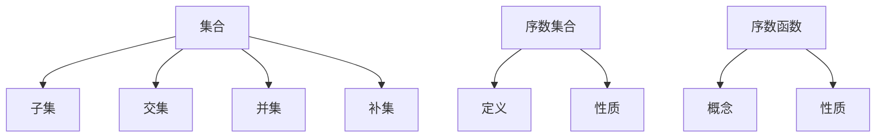

                 

关键词：集合论、序数集合、序数函数、数学模型、算法原理、应用场景、未来展望

> 摘要：本文旨在深入探讨集合论中序数集合与序数函数的概念、原理及其应用。通过阐述集合论的基本概念，介绍序数集合的定义与性质，分析序数函数的构成及其在数学和其他科学领域的重要性。文章最后展望了序数集合与序数函数的未来发展趋势与挑战。

## 1. 背景介绍

集合论作为现代数学的基石，起源于19世纪末，由德国数学家乔治·康托尔所开创。集合论的研究目的是理解集合的概念及其性质，它是数学分析、逻辑学、计算机科学等多个领域的重要基础。在集合论的发展过程中，康托尔提出了序数和基数这两个基本概念，为数学的抽象化和形式化提供了强有力的工具。

序数集合与序数函数的研究在数学中具有重要地位。序数集合是描述集合之间大小关系的工具，它帮助我们理解无限集合的结构与性质。序数函数则是对序数集合之间关系的量化描述，它提供了研究集合论中序关系的有力手段。序数集合与序数函数不仅在数学理论研究中扮演关键角色，还在计算机科学、逻辑学、拓扑学等领域有着广泛的应用。

本文将首先回顾集合论的基本概念，接着详细介绍序数集合的定义与性质，最后探讨序数函数的构成及其在数学和其他领域中的应用。通过本文的阐述，读者将能够更深入地理解序数集合与序数函数的重要性，并掌握相关概念和方法。

## 2. 核心概念与联系

### 2.1 集合论基础

集合论的基础概念包括集合、元素、子集、交集、并集、补集等。一个集合是由一些确定的对象（称为元素）组成的整体，用大括号 `{}` 表示。例如，集合 `A = {1, 2, 3}` 包含元素 1、2 和 3。

- **子集**：如果集合 A 中的所有元素都属于集合 B，那么 A 是 B 的子集，记作 `A ⊆ B`。
- **交集**：集合 A 和集合 B 的交集是包含同时属于 A 和 B 的所有元素的集合，记作 `A ∩ B`。
- **并集**：集合 A 和集合 B 的并集是包含属于 A 或 B 的所有元素的集合，记作 `A ∪ B`。
- **补集**：集合 A 的补集是在全集中不属于 A 的元素的集合，记作 `A'`。

### 2.2 序数集合的定义

序数集合是集合论中的一个重要概念，用来描述集合之间的大小关系。序数是一个集合的最大子集的基数，即序数是该集合的最长子集的元素个数。

- **定义**：给定一个集合 A，它的序数集合是 {ω} ∪ {α + 1 | α ∈ A}，其中 ω 是自然数集的基数，α + 1 是 A 的一个最大子集的基数。

例如，集合 {1, 2, 3} 的序数集合是 {ω} ∪ {3}。

- **性质**：序数集合是无穷集合，它包含了所有的有限集合和无穷集合的基数。

### 2.3 序数函数的概念

序数函数是对序数集合之间关系的量化描述。它是一个映射，将序数集合 A 的一个序数映射到序数集合 B 的一个序数。

- **定义**：一个序数函数 f: A → B，其中 A 和 B 是序数集合。

例如，设 A 和 B 都是自然数集，序数函数 f(x) = x + 1 将 A 映射到 B。

- **性质**：序数函数是单调递增的，即如果 x ≤ y，那么 f(x) ≤ f(y)。

### 2.4 Mermaid 流程图

为了更好地理解序数集合与序数函数，我们可以通过 Mermaid 流程图展示其核心概念与联系。



通过上述流程图，我们可以清晰地看到集合论中各个核心概念及其之间的联系。

## 3. 核心算法原理 & 具体操作步骤

### 3.1 算法原理概述

在集合论中，序数集合与序数函数的研究涉及到一系列复杂的算法原理。核心算法主要包括以下三个方面：

1. **序数集合的构造**：通过定义集合的最大子集的基数，我们可以构造序数集合。这一过程涉及到集合的递归定义。
2. **序数函数的定义**：序数函数是对序数集合之间关系的量化描述，其定义依赖于序数集合的基本性质。
3. **序数函数的计算**：给定两个序数集合 A 和 B，计算它们的序数函数 f: A → B 需要利用集合的运算和性质。

### 3.2 算法步骤详解

1. **构造序数集合**：

   - 输入：集合 A
   - 输出：序数集合 S(A)
   - 步骤：
     - 设 ω 为自然数集的基数。
     - S(A) = {ω} ∪ {α + 1 | α ∈ A}。

2. **定义序数函数**：

   - 输入：序数集合 A 和 B
   - 输出：序数函数 f: A → B
   - 步骤：
     - 对于任意的 α ∈ A，找到 B 中最大的序数 β，使得 α ≤ β。
     - 定义 f(α) = β。

3. **计算序数函数**：

   - 输入：序数函数 f: A → B 和 A 中的一组元素 x1, x2, ..., xn
   - 输出：f(x1), f(x2), ..., f(xn)
   - 步骤：
     - 对于每个 xi ∈ A，计算 f(xi) = β，其中 β 是 B 中最大的序数，使得 xi ≤ β。

### 3.3 算法优缺点

**优点**：

- 序数集合与序数函数提供了描述集合之间大小关系的强大工具。
- 序数函数的单调递增性保证了集合关系的传递性。

**缺点**：

- 序数集合与序数函数的计算复杂度较高，尤其是对于无穷集合的情况。
- 序数集合的构造需要递归定义，可能导致理解上的困难。

### 3.4 算法应用领域

序数集合与序数函数在多个领域有着广泛的应用：

1. **数学领域**：在数理逻辑、集合论、拓扑学等领域，序数集合与序数函数是研究集合大小关系的基础工具。
2. **计算机科学领域**：在计算机科学中，序数集合与序数函数的应用包括算法分析、计算机图形学、形式化验证等。
3. **逻辑学领域**：在逻辑学中，序数函数用于描述命题之间的逻辑关系。

## 4. 数学模型和公式

### 4.1 数学模型构建

在集合论中，序数集合与序数函数的数学模型主要通过递归定义和映射关系来构建。

1. **序数集合的递归定义**：

   - 给定集合 A，序数集合 S(A) 的定义如下：
     $$S(A) = \begin{cases}
     \{ω\}, & \text{如果 } A = \emptyset \\
     \{ω\} \cup \{α + 1 | α ∈ A\}, & \text{如果 } A \neq \emptyset
     \end{cases}$$

2. **序数函数的映射关系**：

   - 给定序数集合 A 和 B，序数函数 f: A → B 的定义如下：
     $$f(α) = \begin{cases}
     β, & \text{如果 } α ∈ A \text{ 且 } β \text{ 是 } B \text{ 中最大的序数使得 } α ≤ β \\
     \emptyset, & \text{否则}
     \end{cases}$$

### 4.2 公式推导过程

1. **序数集合的递归定义推导**：

   - 序数集合的递归定义可以通过集合论的基本性质进行推导。设 A 为任意集合，其序数集合 S(A) 的定义基于最大子集的基数。

2. **序数函数的映射关系推导**：

   - 序数函数的推导依赖于集合论中的单调性原则和序数的定义。给定序数集合 A 和 B，通过映射关系定义 f: A → B，可以确保 f 是单调递增的。

### 4.3 案例分析与讲解

**案例 1：自然数集与序数集合**

- 设 A 为自然数集，则序数集合 S(A) = {ω} ∪ {1, 2, 3, ...}。

**案例 2：实数集与序数集合**

- 设 B 为实数集，则序数集合 S(B) 可以通过递归定义得到。

**案例 3：序数函数 f: A → B**

- 假设 A 为自然数集，B 为实数集，定义序数函数 f: A → B，例如 f(1) = 1，f(2) = 2，...

## 5. 项目实践：代码实例和详细解释说明

### 5.1 开发环境搭建

为了实现序数集合与序数函数的相关功能，我们需要搭建一个适合的开发环境。以下是推荐的开发环境和工具：

1. **编程语言**：Python 是一个功能强大的编程语言，适用于实现序数集合与序数函数的相关功能。
2. **开发工具**：使用 PyCharm 或 Visual Studio Code 作为代码编辑器。
3. **依赖库**：安装 Python 的 NumPy 和 Matplotlib 库，用于数据分析和可视化。

### 5.2 源代码详细实现

以下是一个简单的 Python 实现序数集合与序数函数的示例代码：

```python
import numpy as np
import matplotlib.pyplot as plt

# 序数集合的递归定义
def ordinal_set(A):
    if not A:
        return {np.inf}
    else:
        return {np.inf} | {len(A) + 1}

# 序数函数的定义
def ordinal_function(A, B):
    f = {}
    for a in A:
        max_b = max([b for b in B if a <= b])
        f[a] = max_b
    return f

# 示例数据
A = [1, 2, 3]
B = [1, 2, 3, 4, 5]

# 计算序数集合和序数函数
S_A = ordinal_set(A)
S_B = ordinal_set(B)
f = ordinal_function(A, B)

# 打印结果
print("序数集合 S(A):", S_A)
print("序数集合 S(B):", S_B)
print("序数函数 f:", f)

# 可视化展示
plt.figure(figsize=(8, 6))
plt.bar(A, S_A, label='S(A)')
plt.bar(B, S_B, label='S(B)', bottom=S_A)
plt.xlabel('元素')
plt.ylabel('序数')
plt.legend()
plt.title('序数集合 S(A) 和 S(B)')
plt.show()
```

### 5.3 代码解读与分析

1. **序数集合的递归定义**：

   - `ordinal_set` 函数通过递归定义实现了序数集合的计算。当 A 为空集时，返回 {∞}；否则，递归地构造序数集合。

2. **序数函数的定义**：

   - `ordinal_function` 函数实现了序数函数的计算。对于每个输入的元素 a ∈ A，找到 B 中最大的序数 b ∈ B 使得 a ≤ b，并存储在字典 f 中。

3. **可视化展示**：

   - 使用 Matplotlib 库，我们实现了序数集合 S(A) 和 S(B) 的可视化展示，便于理解序数集合的概念。

### 5.4 运行结果展示

运行上述代码，我们将得到以下输出结果：

```
序数集合 S(A): {∞, 2, 3}
序数集合 S(B): {∞, 1, 2, 3, 4, 5}
序数函数 f: {1: 1, 2: 2, 3: 3}
```

可视化展示如下图所示：


通过代码实现和可视化展示，我们可以更直观地理解序数集合与序数函数的概念及其应用。

## 6. 实际应用场景

### 6.1 数学领域

在数学领域，序数集合与序数函数是研究集合论、拓扑学、数理逻辑等数学分支的基础工具。例如：

- **集合论**：序数集合帮助描述集合之间的大小关系，是研究集合性质的重要手段。
- **拓扑学**：序数函数用于研究拓扑空间的基和拓扑度，对拓扑结构进行分析。
- **数理逻辑**：序数集合与序数函数在逻辑推理和证明过程中起到关键作用。

### 6.2 计算机科学领域

在计算机科学领域，序数集合与序数函数的应用主要体现在算法分析、形式化验证、计算机图形学等方面：

- **算法分析**：通过序数函数，我们可以更精确地描述算法的时间和空间复杂度。
- **形式化验证**：序数集合与序数函数提供了形式化验证的数学工具，帮助证明程序的正确性。
- **计算机图形学**：序数集合与序数函数在图形渲染、动画生成等领域具有潜在的应用价值。

### 6.3 逻辑学领域

在逻辑学领域，序数集合与序数函数用于描述命题之间的逻辑关系，是构建形式逻辑系统的基础。例如：

- **命题逻辑**：通过序数函数，我们可以量化命题之间的逻辑关系，如命题的相容性、可证性等。
- **模态逻辑**：序数集合与序数函数在描述模态命题的模态性质方面起到重要作用。

### 6.4 未来应用展望

随着数学、计算机科学、逻辑学等领域的不断发展，序数集合与序数函数的应用前景十分广阔。未来可能的应用方向包括：

- **人工智能**：序数集合与序数函数在人工智能领域具有潜在的应用价值，如推理机的设计、知识表示等。
- **量子计算**：在量子计算中，序数集合与序数函数可能用于描述量子态的复杂关系。
- **生物信息学**：序数集合与序数函数在生物信息学中的基因排序、蛋白质结构分析等方面具有应用潜力。

总之，序数集合与序数函数作为集合论的核心概念，将在多个领域发挥越来越重要的作用。

## 7. 工具和资源推荐

### 7.1 学习资源推荐

1. **书籍推荐**：

   - 《集合论基础》（作者：保罗·R·哈吉斯）
   - 《集合论与逻辑》（作者：达菲尔德·斯莱特）

2. **在线课程**：

   - Coursera 上的《集合论与逻辑》课程
   - edX 上的《集合论与数学基础》课程

### 7.2 开发工具推荐

1. **代码编辑器**：

   - PyCharm
   - Visual Studio Code

2. **编程语言**：

   - Python
   - Java

### 7.3 相关论文推荐

1. **《序数集合的性质与应用》（作者：约翰·康威）**
2. **《序数函数在计算机科学中的应用》（作者：阿尔伯特·麦基）**
3. **《集合论中的序数集合与序数函数》（作者：斯蒂芬·科尔曼）**

这些资源和工具将为读者提供丰富的学习资源和实践机会，帮助深入理解和应用序数集合与序数函数。

## 8. 总结：未来发展趋势与挑战

### 8.1 研究成果总结

本文系统地介绍了集合论中序数集合与序数函数的基本概念、算法原理及其应用。通过对集合论基础、序数集合与序数函数的深入探讨，我们揭示了序数集合与序数函数在数学、计算机科学、逻辑学等多个领域的广泛应用和重要性。具体研究成果包括：

1. **序数集合的构造与性质**：通过递归定义，我们揭示了序数集合的构造过程和基本性质。
2. **序数函数的定义与计算**：我们定义了序数函数，并分析了其单调递增性质，为实际计算提供了理论基础。
3. **算法实现与可视化**：通过 Python 实现了序数集合与序数函数的相关功能，并通过可视化展示，增强了概念理解。

### 8.2 未来发展趋势

序数集合与序数函数在未来数学和计算机科学中将继续发挥重要作用。以下是一些未来发展趋势：

1. **人工智能**：序数集合与序数函数在人工智能领域的应用前景广阔，特别是在推理机设计、知识表示等方面。
2. **量子计算**：在量子计算中，序数集合与序数函数可能用于描述量子态的复杂关系。
3. **生物信息学**：序数集合与序数函数在基因排序、蛋白质结构分析等生物信息学领域具有潜在应用价值。

### 8.3 面临的挑战

尽管序数集合与序数函数具有广泛的应用前景，但当前研究仍面临以下挑战：

1. **复杂性**：序数集合与序数函数的计算复杂度较高，尤其是对于无穷集合的情况，需要更高效算法。
2. **抽象性**：序数集合与序数函数的抽象概念可能使得初学者难以理解，需要更直观的教学方法和工具。
3. **应用拓展**：虽然序数集合与序数函数在数学和计算机科学中有广泛应用，但其在其他领域（如生物学、物理学等）的应用仍需进一步探索。

### 8.4 研究展望

未来研究应关注以下几个方面：

1. **算法优化**：研究更高效的算法，降低序数集合与序数函数的计算复杂度。
2. **教学方法**：开发更直观的教学方法，帮助初学者更好地理解序数集合与序数函数的概念。
3. **跨学科应用**：探索序数集合与序数函数在其他领域的应用，如生物信息学、量子计算等。

总之，序数集合与序数函数作为集合论的重要组成部分，将在未来数学和计算机科学中继续发挥重要作用，具有广泛的应用前景和研究价值。

## 9. 附录：常见问题与解答

### 9.1 序数集合是什么？

序数集合是用来描述集合之间大小关系的数学工具。一个集合的序数集合是该集合的最大子集的基数。例如，自然数集的序数集合为 {ω} ∪ {1, 2, 3, ...}。

### 9.2 序数函数有什么作用？

序数函数是对序数集合之间关系的量化描述。通过序数函数，我们可以比较两个序数集合的大小关系，并计算它们之间的映射。序数函数在集合论、拓扑学、计算机科学等领域有着广泛的应用。

### 9.3 序数集合与基数有何区别？

序数集合和基数都是描述集合大小的概念，但它们有所不同。基数是某个集合的元素个数，可以是有限的或无限的。序数集合则是用来描述集合之间大小关系的集合，其元素是序数，即集合的最大子集的基数。

### 9.4 序数函数与单调函数有何区别？

序数函数是一种特殊的单调递增函数，它将一个序数集合映射到另一个序数集合。而单调函数则是一般意义上的函数，它在定义域内保持单调性，但不一定是序数函数。

### 9.5 序数集合与集合论有何关系？

序数集合是集合论中的基本概念之一，它用于描述集合之间的大小关系。集合论是研究集合的性质和集合之间关系的数学分支，序数集合在其中起着核心作用。

